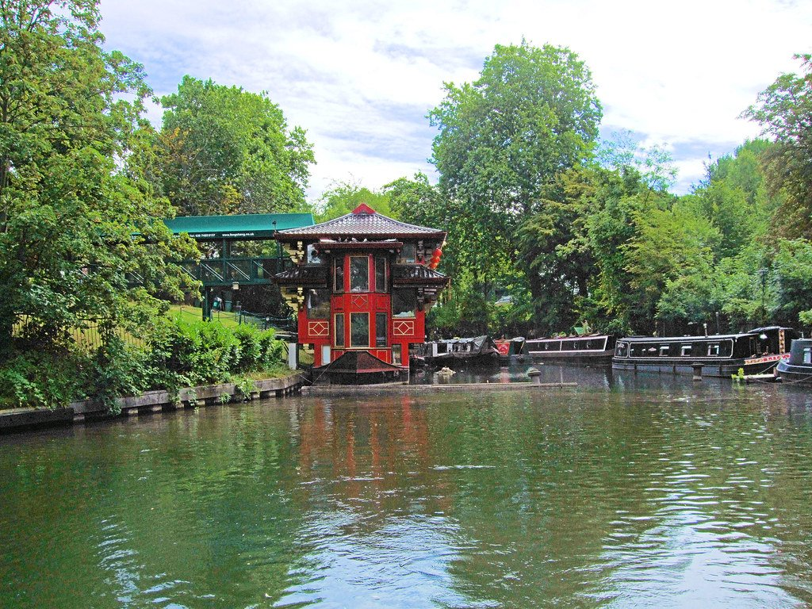
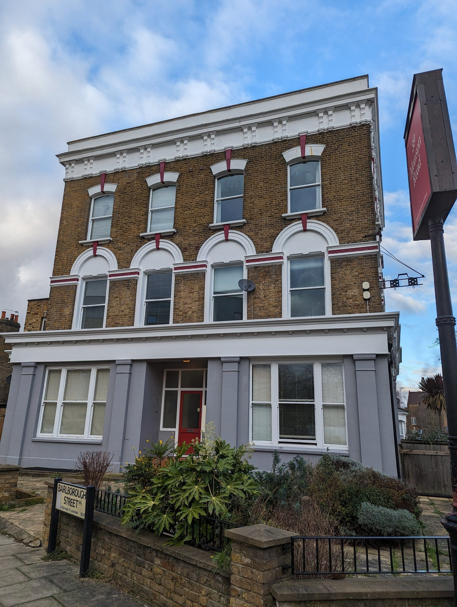

London is the most filmed city in Europe and most of its locations are ordinary streets you can walk down for nothing. The pleasure is in the mismatch: Gringotts is a working embassy, Sherlock's flat is on the wrong road entirely, and the Shanghai hotel pool in *Skyfall* is in Canary Wharf.

> 💡 **The Short Version:** **Australia House** is Gringotts and you cannot go in. **North Gower Street** is Sherlock's Baker Street. **Aldersgate Street** has the Slough House door. **Leadenhall Market** is Diagon Alley. And **Rules** in Covent Garden is Bond's favourite restaurant, written into *Spectre*.

> 📘 **How we choose these (editorial note)**
> No paid placements. These are drawn from a wide spread of sources rather than any single list - the food and travel press, the big listings sites, independent blogs and specialists, video, and what Londoners recommend themselves - and cross-referenced against each other. Locations are the ones confirmed by production credits, location agencies or the films themselves. Several are private or working buildings — we say which, and none of this is an invitation to trespass.

## Where they are

| If you are near… | What was filmed there |
| --- | --- |
| **The City** | Slow Horses, Snatch, Harry Potter (Leadenhall) |
| **Clerkenwell** | Batman — Gotham police station |
| **Covent Garden & Strand** | Harry Potter (Gringotts), Spectre (Rules), Notting Hill (The Savoy) |
| **Bloomsbury** | Sherlock |
| **Bethnal Green** | Snatch |
| **Canary Wharf** | Skyfall, 28 Weeks Later, Layer Cake |
| **Camden & Primrose Hill** | Paddington |
| **Greenwich** | Les Misérables, The Crown, Thor |
| **Regent's Park** | The Gentlemen, Slow Horses |

---

## Harry Potter

### Gringotts Wizarding Bank — Australia House, Strand

*Exterior only*

The **ornate banking hall of Australia House**, a real working diplomatic building. You can see the outside; the interior is not open to visitors.

### Leadenhall Market, City of London

*Free*

An 1881 covered market in cream, maroon and green wrought iron, used for **Diagon Alley** — the blue door of the Leaky Cauldron was an optician's shop.

### Platform 9¾, King's Cross

*Free*

The trolley in the wall, with a permanent queue and a staff member to help with the scarf. Between platforms 9 and 10 in the main concourse.

---

## Bond

### Rules, Covent Garden

*Open · book a table*

**London's oldest restaurant**, trading since 1798, written into *Spectre* as Bond's own favourite. You can book the table.

### Skyfall's "Shanghai" pool — Four Seasons, Canary Wharf

*Hotel*

Daniel Craig's Shanghai hotel pool scene was filmed **in Canary Wharf**, which is a very London kind of substitution.

---

## Television

### Slough House — Aldersgate Street, City of London

*Free · exterior*

The grubby door the slow horses trudge through in nearly every episode of *Slow Horses* is **a real one**, on the corner of Aldersgate Street. The interiors are a set.

### Sherlock's 221B — North Gower Street, Bloomsbury

*Free · exterior*

The BBC filmed its 221B exterior here rather than on the real, much busier Baker Street. **Speedy's Café next door** is real, open, and has been on television more than most actors.

### The Crown's Buckingham Palace — Old Royal Naval College, Greenwich

*Grounds free*

Wren's riverside campus stands in for Buckingham Palace, and has also played 1830s Paris in *Les Misérables* and Asgard in *Thor*.

---

Powered by <a target="_blank" rel="sponsored" href="https://www.getyourguide.com/london-l57/">GetYourGuide</a>

## Guy Ritchie's London

### Snatch's Pawn Shop and Tailor, Bethnal Green

*Free · exteriors*

Several genuine East End addresses, including **Bethnal Green Town Hall** as the tailor's shop — now a hotel.

### Snatch's Diamond Store, Hatton Garden

*Free*

Doug the Head's diamond shop is on **Hatton Garden, London's real diamond district**.

### Feng Shang Princess, Regent's Canal

*Open · a restaurant*

The floating Chinese pagoda appears in *The Gentlemen* and as a backdrop in *Slow Horses*. It is a working restaurant you can book.

*A floating pagoda moored at Cumberland Basin. You pass it on the canal walk between Little Venice and Camden. Photo: [Jim Linwood](https://www.flickr.com/photos/54238124@N00/14431541920), [CC BY 2.0](https://creativecommons.org/licenses/by/2.0/).*

---

## Horror and comedy

### The Winchester — Duke of Albany, New Cross

*Free · exterior only, and not a pub any more*

The pub Shaun and Ed barricade themselves in for the finale of *Shaun of the Dead* (2004) was a real one: **the Duke of Albany**, on Monson Road in New Cross. It closed in 2008 and was converted into flats, so there is no pub to visit — just the building, recognisable from the film but now somebody's front door.

*The building used as the Winchester, now flats. The corner windows and the roofline are the giveaway.*

> ⚠️ **Do not turn up expecting a pint.** This is a residential building. Look from the street and move on.

## Batman and dystopia

### Gotham City Police Station — Farmiloe Building, Clerkenwell

*Exterior only*

A grand Victorian former lead-manufacturing warehouse used for **Gotham's police HQ interiors across two Batman films**.

### 28 Weeks Later — Isle of Dogs

*Free*

The Isle of Dogs plays "District 1", the film's US-military quarantine zone. Its high-rises and water on three sides made the isolation plausible.

---

## Paddington

### The Brown family home — Primrose Hill

*Free · a residential street*

The fictional **32 Windsor Gardens** is a pastel-painted Primrose Hill crescent. It is a private street where people live — look, do not linger.

There is also a **Paddington Bear trail** around Paddington station itself, and a statue on the concourse.

---

## What it costs

**Almost all of it is free**, because a filming location is usually just a street.

* **Free and public:** Leadenhall Market, Millennium Bridge, Borough Market, the South Bank, St Pancras, Notting Hill's streets and almost every exterior in this guide.
* **Ticketed:** the **Warner Bros. Studio Tour** at Leavesden is the expensive one and needs booking weeks ahead — and it is a studio tour rather than a location. **Platform 9¾** at King's Cross is free to look at; the photograph with the trolley and scarf is the paid part, and the queue is long.
* **Working buildings.** Several locations here are private homes, offices or churches. Exteriors are fair game; do not go in.
* **Guided film tours** run £20–£40 and are mostly worth skipping — the locations are easy to find yourself and the guides rarely know more than the internet does.

---

Powered by <a target="_blank" rel="sponsored" href="https://www.getyourguide.com/london-l57/">GetYourGuide</a>

## What to know

* **Almost all of these are free** because almost all are streets and exteriors.
* **Australia House and the Farmiloe Building are working buildings.** Exterior views only.
* **Primrose Hill's Paddington crescent is residential.** Be considerate.
* **Leadenhall Market never actually closes** — the arcade is a public thoroughfare. The shops and bars inside keep City hours, so weekdays are when it is fully alive, though weekend pop-up markets now run there too.
* **The City cluster** — Slough House, Leadenhall, Hatton Garden, the Farmiloe Building — is walkable in under an hour.

---

## Continue planning your London trip

- 🎨 **[London's Street Art and Banksys](/articles/london-street-art/)**
- 🎪 **[Free Things to Do in London](/free/)**
- 🏛️ **[Historic Houses in London](/articles/historic-houses-london/)**
- 🏙️ **[City of London Area Guide](/articles/city-of-london-area-guide/)**
- 🎭 **[Covent Garden Area Guide](/articles/covent-garden-area-guide/)**
- ⛵ **[Greenwich Area Guide](/articles/greenwich-area-guide/)**
