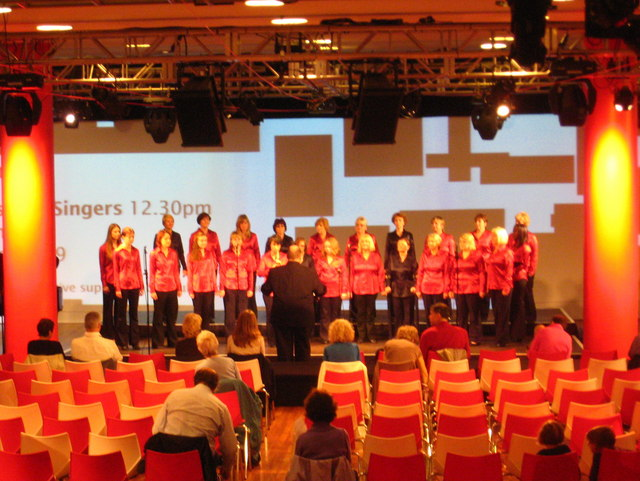
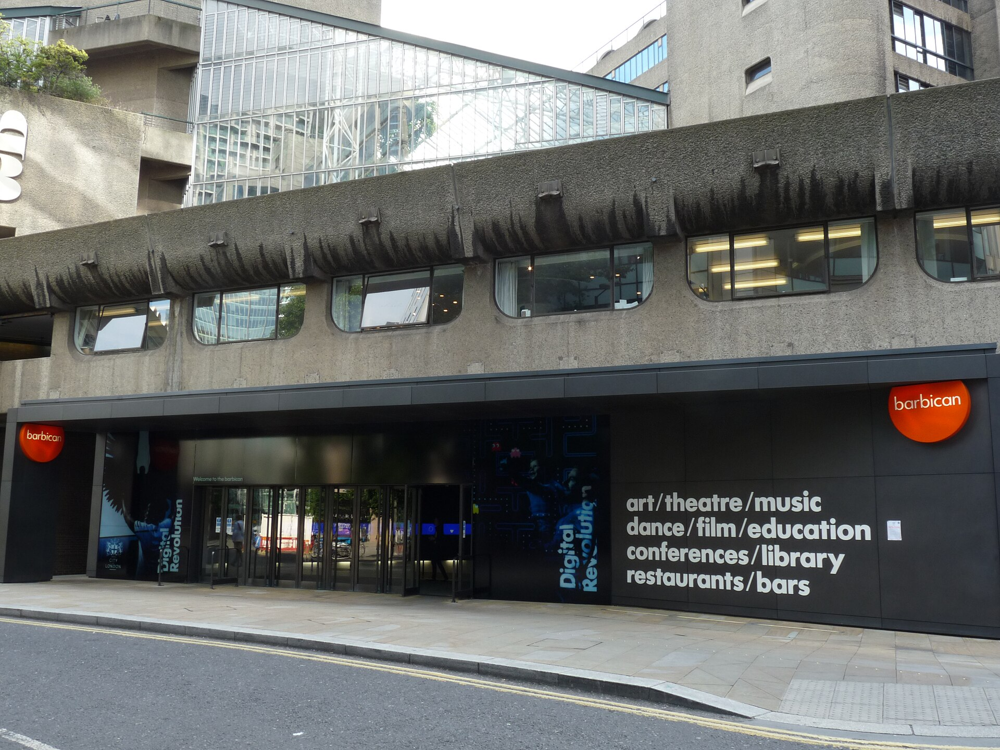
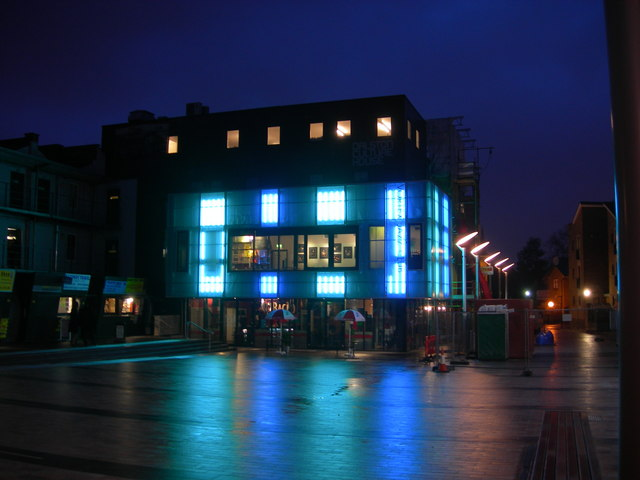
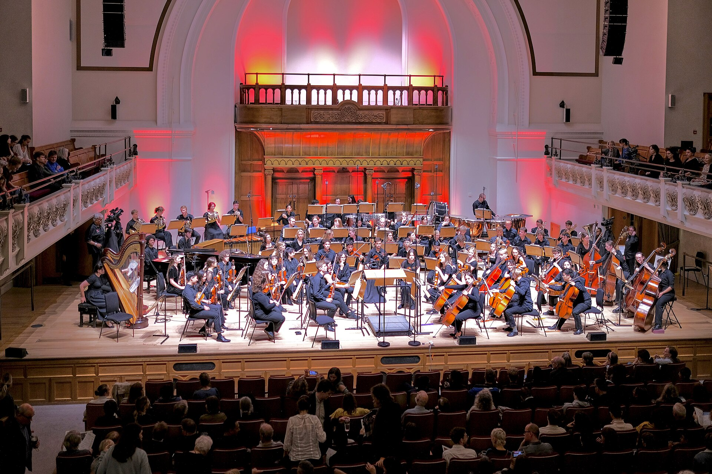
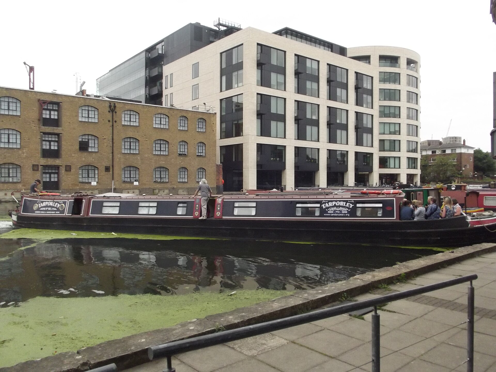
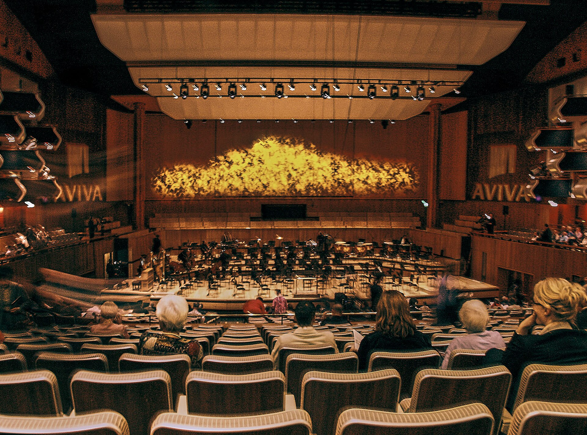
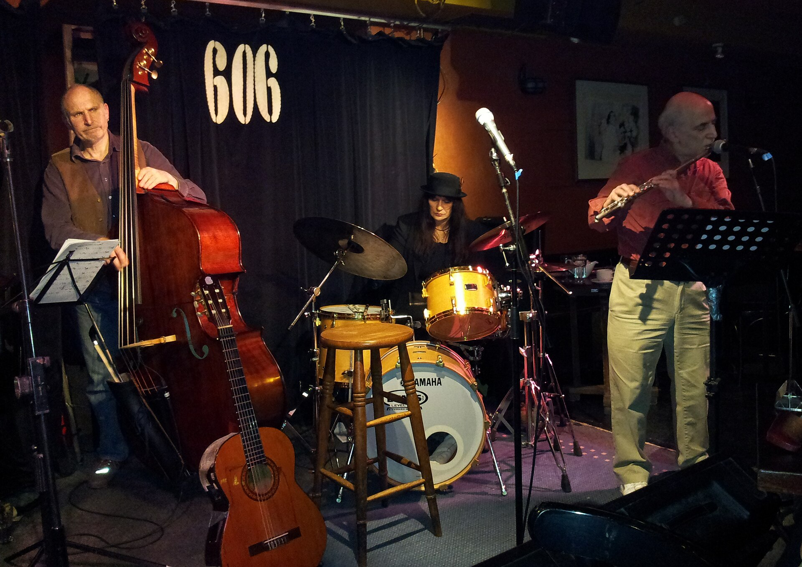
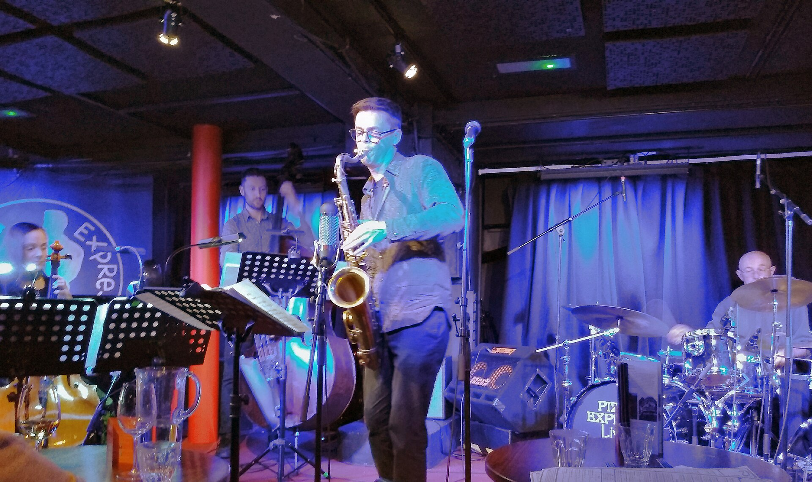

The EFG London Jazz Festival runs **13 to 22 November 2026** — ten days, both weekends included. Serious, the producer that started it in 1992, had **332 shows listed at 82 venues** on 21 September, and they are spread across the city rather than gathered on one site: the Royal Festival Hall and the Barbican, Ronnie Scott's and the Vortex, a church in Leytonstone, a bookshop off Kensington Church Street and a pop-up in an office block by Moorgate.

That sprawl is the thing that catches people out. There is no festival wristband and no single box office. **243 of the 332 shows are sold by the venue, not by the festival**, so there is no single on-sale morning to be ready for. It is also why eleven shows had already gone by 21 September while three hundred had not.

> 💡 **The Short Version:** **13-22 November 2026.** The full programme is on the festival's [what's on listing](https://efglondonjazzfestival.org.uk/whats-on), which is the only place all 332 shows sit together — each one then sends you to whoever is actually selling it. **Nineteen concerts are free**, and 14 of those fall on the two weekends, at the [Barbican FreeStage](https://efglondonjazzfestival.org.uk/by-type/free), the Clore Ballroom at the Southbank Centre and Milton Court. Paid tickets start at **£5** and the median cheapest ticket across the programme is **£21**. If you are 16-25, join the free [Serious Youth Network](https://serious.org.uk/serious-youth-network) before you book: it makes shows Serious produces **£5**. Eleven shows are already sold out, including **Coltrane 100**, **Melody Gardot** and **Ben Folds** — the way back in is the venue's own returns, not a resale site.

---

> 🧭 **Plan the rest of it:** [Best live music venues](/articles/best-live-music-venues-london/) · [Late-night eating](/articles/late-night-eating-london/) · [Best time to visit London](/articles/best-time-to-visit-london/) · [Things to do in October](/articles/things-to-do-in-london-in-october/)

## The shape of the ten days

The programme is not evenly spread. Each Saturday carries two and a half times what Monday 16 November does, and the sold-out shows cluster at the same end: ten of the eleven are on a Friday or a weekend.

| Date | Shows listed | What is on |
| --- | --- | --- |
| **Fri 13 Nov** | 35 | Opening Gala at the Royal Festival Hall; Coltrane 100 at the Barbican |
| **Sat 14 Nov** | 43 | Goldie with an orchestra; Asha Puthli at the Barbican |
| **Sun 15 Nov** | 43 | Mariza at the Royal Festival Hall; Anouar Brahem at the Barbican |
| **Mon 16 Nov** | 17 | The quietest day; The Jazz Social is closed |
| **Tue 17 Nov** | 26 | Roberto Fonseca & Vincent Segal at Cadogan Hall |
| **Wed 18 Nov** | 28 | Fatoumata Diawara at the Roundhouse |
| **Thu 19 Nov** | 40 | Soweto Kinch at the Barbican; Jaga Jazzist at Milton Court |
| **Fri 20 Nov** | 33 | Kronos Quartet at the Queen Elizabeth Hall |
| **Sat 21 Nov** | 43 | Branford Marsalis & Dianne Reeves at Olympia |
| **Sun 22 Nov** | 24 | Samara Joy; Cécile McLorin Salvant; The Joy at the Barbican |

Counts are the festival's own listings on 21 September 2026 and still rising — the family strand and The Jazz Social both say more is to come.

---

## What it costs

Prices on the festival's listings **include booking fees**, which is unusual and useful: the number you see is the number you pay for one ticket. Across the 294 shows with a published price on 21 September:

| Band | Shows | Where you find it |
| --- | --- | --- |
| **Free** | 19 | Barbican FreeStage, Clore Ballroom, Milton Court |
| **Under £10** | 31 | The Vortex, Jamboree, Ninety One Brick Lane, Grow Hackney |
| **£10-£20** | 95 | Karamel in Wood Green, the Bull's Head in Barnes, Morocco Bound |
| **£20-£40** | 143 | Most of the concert halls and most of the jazz clubs |
| **£40 and up** | 25 | Ronnie Scott's headliners, the Royal Festival Hall galas |

Another 11 shows are sold out and eight have no price yet. The cheapest adult ticket in the festival is **£5** — the Out to Lunch seats at Cadogan Hall, Eliane Correa at Hootananny Brixton, the two "100 Years Of" nights at Ninety One Brick Lane on Brick Lane and the late Elgar Room show on 13 November. Children pay **£2.50** at the Barbican's family film club on 21 November, £5 for adults. The dearest concert is the **Opening Gala at £48 to £100.50**.

### The fee that is worth understanding

Because most shows are sold by the venue, the fee is the venue's, and two of the big ones charge **per transaction rather than per ticket**. [Cadogan Hall](https://cadoganhall.com/whats-on/out-to-lunch-2026-joanna-eden-joni-and-me/) adds **£4.50 per booking**, waived at the box office in person and for its Encore members. [The Barbican](https://www.barbican.org.uk/your-visit/general-info/box-office-ticketing-information) adds **£4 per transaction**, nothing in person, nothing for members, and where a booking spans several events only the highest fee applies. So two tickets cost less per head than one, and four cost less again.

### If you are under 26

**[The Serious Youth Network](https://serious.org.uk/serious-youth-network) is free to join, open to 16- to 25-year-olds, and makes shows Serious produces £5 plus a booking fee**, up to two tickets a booking. It also gets you a discount at The Jazz Social through November. Serious produces 27 of the shows in the programme, including the Opening Gala.

**[Young Barbican](https://www.barbican.org.uk/join-support/young-barbican) is free to join and covers the Barbican's 18 listings.** It prices each concert separately rather than applying a flat discount: [Jaga Jazzist](https://www.barbican.org.uk/whats-on/2026/event/jaga-jazzist) is £12 against £29, [Asha Puthli](https://www.barbican.org.uk/whats-on/2026/event/asha-puthli) £18 against £34. The eligible age is printed on each event page and varies — 16-29 on some concerts, 16-25 on others.

---

## What is free

*The Clore Ballroom at the Royal Festival Hall — no ticket, no door, you walk in off the Southbank foyer. Photo: [Rod Allday](https://commons.wikimedia.org/wiki/File:The_Charles_Clore_Ballroom_in_the_Royal_Festival_Hall_-_geograph.org.uk_-_1575896.jpg), [CC BY-SA 2.0](https://creativecommons.org/licenses/by-sa/2.0/).*

This is the part of the festival most guides skip, and for a lot of people it is the whole trip. **Nineteen concerts cost nothing**, and they are not scraps: the South Asian Jazz afternoon at the Southbank Centre runs 2pm to 7.30pm across three acts and ends with a 30-piece orchestra.

**Barbican FreeStage, Level G** — the open area inside the Silk Street entrance, no ticket, just turn up. Rotterdam Loves London on Sat 14 Nov at 4.15pm, 'Round Midnight on Sun 15 Nov at 3.30pm, BBE Music's Japanese jazz DJs on Sat 21 Nov at 1pm, and Melbourne International Jazz Festival's Xani Kolac & Don Glori on Sun 22 Nov at 4pm.

**Clore Ballroom, Southbank Centre** — three afternoons, each with several sets:

- **Sat 14 Nov, from 2pm — South Asian Jazz.** Anmol Mohara at 2pm, Urvashi at 4pm, then Shri Sriram premiering new arrangements at 6.45pm with a 30-piece orchestra assembled for the night.
- **Fri 20 Nov, 3pm — Mix & Move.** Two hours of dance workshop with live musicians, then an hour of social dancing. No partner and no experience needed, and the organisers build in seated adaptations.
- **Sun 22 Nov, from 12.30pm — Homegrown.** ArtsTrain's young south-east London musicians, then Audrey Powne at 2pm and Allexa Nava at 4pm.

**Milton Court, at the Guildhall School by the Barbican** — four free concerts in a proper hall: Neil Charles, Mark Sanders and Cleveland Watkiss on Wed 18 Nov at 2pm, the **Guildhall Jazz Orchestra's Miles Davis centenary concert** on Fri 20 Nov at 2pm, the NYJO Blueprint Orchestra on Sat 21 Nov at 5.30pm, and Itiberê Orquestra Família on Sun 22 Nov at 2pm.

**Elsewhere:** Dhol Academy at the Rivergate Centre in Barking (Sat 14 Nov, 1pm), a community day at Fulham Pier (Sun 15 Nov, from midday), Francesco Cavestri at Steinway Hall on Marylebone Lane (Thu 19 Nov, 7pm), Chiminyo's NRG Trio at Number 90 in Hackney Wick (Thu 19 Nov, 8.30pm), Jazz Saturdays at The Albany in Deptford (Sat 21 Nov, 1pm) and Williams Cumberbache at Grow in Hackney Wick (Sun 22 Nov, 1pm).

> 💷 **Nearly free, and the best-value hour of the festival.** **Out to Lunch** puts five midday concerts in the Culford Room at Cadogan Hall, Mon 16 to Fri 20 November. **Seated is £5, standing is free but ticketed.** Doors at 11am, an hour of music either side of a 30-minute break. The catch is the fee: Cadogan Hall charges £4.50 per online booking whatever the ticket costs, so a free standing ticket booked online costs £4.50 and the same ticket costs nothing at the box office in person. Joanna Eden plays Joni Mitchell on the Monday, Nicolas Meier's world group on the Tuesday, Djangada's Brazilian trio on the Wednesday, ISQ on the Thursday and Vasilis Xenopoulos with Paul Edis on the Friday.

Two more you pay what you want for: **Daylight Music** at St John's Leytonstone on Sat 14 and Sat 21 November, both at midday, pay what you can and children free.

---

## Where it happens

*The Barbican's Silk Street entrance. The concert hall is three floors down from here, and the FreeStage is in the foyer. Photo: [Chris McKenna](https://commons.wikimedia.org/wiki/File:Barbican_Centre_-_Silk_Street_entrance_01.jpg), [CC BY-SA 4.0](https://creativecommons.org/licenses/by-sa/4.0/).*

82 buildings is too many to plan around, so start with the nine that carry 137 of the 332 shows between them.

| Venue | Nearest station | What is there |
| --- | --- | --- |
| **Ronnie Scott's**, 47 Frith Street W1D 4HT | Tottenham Court Road, Leicester Square | 23 listings, the most of any venue. First house at 6.20 or 6.40pm most nights, a 1pm Sunday show on 15 and 22 Nov, and eleven Late Late Shows from 11.30pm |
| **Barbican**, Silk Street EC2Y 8DS | Barbican 4 min; Moorgate 7 min | 18 listings across the Hall, the FreeStage, the Pit, the Art Gallery and two cinemas. The Jazz on Screen film strand is here, and so is the free programme |
| **PizzaExpress Live**, 10 Dean Street W1D 3RW | Tottenham Court Road | 17 listings in the basement under the Soho branch, mostly £20-£35, with the house Jazz Orchestra opening on 13 Nov at 9pm |
| **Crazy Coqs**, 20 Sherwood Street W1F 7ED | Piccadilly Circus | 15 listings in the cabaret room at Brasserie Zédel, almost all of them under the Spice Jazz Soho banner, £20-£37.25 |
| **Kings Place**, 90 York Way N1 9AG | King's Cross St Pancras, step-free to street | 14 listings across two halls. Hall One takes the bigger names, Hall Two runs £20-£31 |
| **Vortex**, 11 Gillett Square N16 8AZ | Dalston Kingsland 1 min, Dalston Junction 3 min | 13 listings and the cheapest serious jazz in the festival, from £6.60. A first-floor room entered from Boleyn Road, not from Kingsland Road |
| **606 Club**, 90 Lots Road SW10 0QD | Imperial Wharf 7 min, Fulham Broadway 12 min | 13 listings, around 100 seats, £16-£26. Gigs at 8pm or 9pm and 1.30pm on the Sundays. A restaurant licence, not a bar licence — see below |
| **Southbank Centre**, Belvedere Road SE1 8XX | Waterloo, Embankment | 12 listings. The Royal Festival Hall has the galas, the Queen Elizabeth Hall the Kronos Quartet and Cécile McLorin Salvant, the Clore Ballroom the free afternoons |
| **Cadogan Hall**, 5 Sloane Terrace SW1X 9DQ | Sloane Square 2 min | 12 listings. Doors and bars open 90 minutes before, auditorium doors 30 minutes before |

The rest run from the Roundhouse and Union Chapel down to Idiot Books on Kensington Church Street, the Mildmay Club in Newington Green and Ignition Brewery in Sydenham.

*The Vortex on Gillett Square — 13 listings and the cheapest serious jazz in the festival, from £6.60. The entrance is on Boleyn Road, not Kingsland Road. Photo: [Danny Robinson](https://commons.wikimedia.org/wiki/File:Vortex_Jazz_Club_-_geograph.org.uk_-_343852.jpg), [CC BY-SA 2.0](https://creativecommons.org/licenses/by-sa/2.0/).*

*Cadogan Hall, two minutes from Sloane Square. Bars open 90 minutes before the show and the auditorium doors 30 minutes before, which is worth knowing if you are eating first. Photo: [Anthony O'Neil](https://commons.wikimedia.org/wiki/File:At_the_Cadogan_Hall,_Chelsea_-_geograph.org.uk_-_7604826.jpg), [CC BY-SA 2.0](https://creativecommons.org/licenses/by-sa/2.0/).*

*Kings Place backs onto Battlebridge Basin, a few minutes from King's Cross and step-free from the street. Hall One takes the bigger names; Hall Two runs £20 to £31. Photo: [ell brown](https://commons.wikimedia.org/wiki/File:Battlebridge_Basin_-_London_Canal_Museum_-_narrowboat_-_Tarporley_No_182_-_Kings_Place_-_20905675029.jpg), [CC BY-SA 2.0](https://creativecommons.org/licenses/by-sa/2.0/).*

*The Royal Festival Hall auditorium, where the Southbank galas are. The Clore Ballroom downstairs is the free half of the same building. Photo: [Anthony O'Neil](https://commons.wikimedia.org/wiki/File:Auditorium_-_geograph.org.uk_-_7707590.jpg), [CC BY-SA 2.0](https://creativecommons.org/licenses/by-sa/2.0/).*

**The Jazz Social** is the closest thing the festival has to a hub. It takes over Unit 1B at CityPoint, 1 Ropemaker Street EC2Y 9AW — two minutes from Moorgate, entrance on Moor Lane — from **Monday 9 to Sunday 22 November**, opening before the festival does. Record shop, festival bar, merchandise, live radio and five gigs, four at £14 and one free. It opens at midday every day and closes at 11pm on the Sundays, midnight or 12.30am midweek and **1am on the Fridays and Saturdays**. It is **closed on Monday 16 November**. Full times are on [the festival's Jazz Social page](https://efglondonjazzfestival.org.uk/thejazzsocial).

---

## The programme

*The 606 Club in Chelsea, which holds a restaurant licence — you book a table, not a seat. Photo: [Robert Smith](https://commons.wikimedia.org/wiki/File:Simon_Woolf,_Michelle_Drees_and_Steve_Rubie_at_606_Club.jpg), [CC BY-SA 4.0](https://creativecommons.org/licenses/by-sa/4.0/).*

**Both John Coltrane and Miles Davis were born in 1926**, and the 2026 programme is organised around that coincidence more than around anything else.

**Coltrane 100** is at the Barbican on **Friday 13 November** — Joe Lovano, Melissa Aldana, Nduduzo Makhathini, Linda May Han Oh and Jeff "Tain" Watts — and is sold out. **Branford Marsalis and Dianne Reeves Celebrate John Coltrane** at the British Airways ARC at Olympia on **Saturday 21 November** is the other end of the same idea, at £80.50 to £88.50. For Davis, **Emma-Jean Thackray's Dear Miles** at EartH on the opening night has gone, but the **Guildhall Jazz Orchestra's Miles Davis Centenary Celebration** at Milton Court on **Friday 20 November at 2pm is free**, and Ninety One Brick Lane runs a £5-£12 pair of "100 Years Of" nights for each man.

**The Opening Gala: Jazz Voice** is at the **Royal Festival Hall on Friday 13 November**, doors 7pm, stage 7.30pm, £48 to £100.50. Guy Barker conducts the EFG London Jazz Festival Orchestra behind Lizz Wright, Emma Smith, Marvin Muoneké, Liv Warfield, Rita Wilson and James Emmanuel, hosted by Jumoké Fashola. It is one of three shows in the **EFG Elements Series**, the strand the title sponsor picks each year; the other two are **Goldie's "Dare to Dream"** with his live band, an orchestra and the Elysian Collective at the Royal Festival Hall on **Saturday 14 November at 5pm** (£42.75-£84.75), and **Melody Gardot** at the Royal Albert Hall on **Monday 16 November**, which is sold out.

The last night, **Sunday 22 November**, runs four headline shows at once: **Samara Joy** at the Royal Festival Hall (£53.25-£84.75), **Cécile McLorin Salvant with the BBC Concert Orchestra** at the Queen Elizabeth Hall (sold out), **Dave Holland and Norma Winstone** playing Kenny Wheeler's music at Kings Place (£28-£49) and South African vocal group **The Joy** at the Barbican (£31.50-£41.50).

Elsewhere in the ten days: **Mariza** at the Royal Festival Hall (15 Nov, £44-£54), **Anouar Brahem** at the Barbican (15 Nov, £36.50-£46.50), **Morcheeba** at the Troxy (13 Nov, £31.50-£44), **Caravan Palace** at Olympia (14 Nov, £34-£39), **Dave Okumu** at Union Chapel (15 Nov, £34), **GoGo Penguin** at KOKO (16 Nov, £33.50), **Fatoumata Diawara** at the Roundhouse (18 Nov, £33), **Soweto Kinch's Trilogy** at the Barbican (19 Nov, £22-£40), **Kronos Quartet** at the Queen Elizabeth Hall (20 Nov, £51.50-£58) and **Church of Sound's tenth birthday** at the Barbican (20 Nov, £24-£39).

### Celebrating the Jazz Clubs

Just under three-quarters of the programme — 242 listings of the 332 — sits under this heading, the festival's heading for the shows in London's own clubs and small rooms. In practice the Vortex, the 606, Jamboree, the Bull's Head, Toulouse Lautrec in Kennington and eighty other rooms programme their own November and the festival lists it. It is why the price range is so wide, and why the booking works the way it does.

---

## Booking: who is actually selling it

Start at the festival's [what's on listing](https://efglondonjazzfestival.org.uk/whats-on) — it is the only page carrying all ten days. Set the events-per-page filter to 100 before you start; at the default 24 the programme runs to fourteen pages.

Each show then hands you off. On 21 September, **243 of the 332 listings pointed at the venue's own box office**, 27 at the Festival Box Office that Serious runs, 18 at both, and 76 offered a third party as well — Dice on 43 of them, then Music Glue, WeGotTickets, Ticketmaster and See Tickets.

Three things follow.

**There is no single on-sale date.** A Ronnie Scott's night and a Barbican concert went on sale on whatever schedule those two buildings use. The festival's own [newsletter](https://efglondonjazzfestival.org.uk/newsletter) is where presales and on-sale alerts are announced, and it is the only way to be told in advance.

**Buy direct and buy in person if you can.** The Barbican and Cadogan Hall both drop their fee entirely at the box office counter, and both charge per booking rather than per ticket online.

**Discounts belong to the seller, not the festival.** The Serious Youth Network works on the 27 shows Serious produces. Young Barbican works on the Barbican's 18. Kings Place lists under-30s tickets, child tickets and a concessions scheme for anyone who would otherwise struggle to afford one. None of them crosses over.

---

## What has already sold out

Eleven shows had gone by **21 September 2026**:

| Date | Show | Venue |
| --- | --- | --- |
| Fri 13 Nov | Coltrane 100 | Barbican |
| Fri 13 Nov | Fergus McCreadie | Kings Place, Hall One |
| Fri 13 Nov | Emma-Jean Thackray: Dear Miles | EartH, Dalston |
| Fri 13 Nov | dublon | Jazz Cafe, Camden |
| 13-22 Nov | Robert Glasper residency | Blue Note London |
| Sat 14 Nov | Courtney Pine | PizzaExpress Live, Soho |
| Sun 15 Nov | Ambrose Akinmusire Quartet | Kings Place, Hall One |
| Mon 16 Nov | Melody Gardot | Royal Albert Hall |
| Fri 20 Nov | Ben Folds | Royal Festival Hall |
| Sat 21 Nov | Haruki Murakami's Jazz at Peter Cat | Barbican |
| Sun 22 Nov | Cécile McLorin Salvant, BBC Concert Orchestra | Queen Elizabeth Hall |

Six of the eleven land on the first two days, the Robert Glasper residency included. The opening weekend sells first, so if you are choosing nights, that is the one to book early.

### How to get into one anyway

**At the Barbican, watch the last 48 hours.** Ticket-holders can exchange up to 24 hours before the show for credit valid a year, minus £3 a ticket, and those seats go straight back on sale. Inside 24 hours the box office will still try to resell a returned ticket once the house allocation has gone. Refresh the event page on the day before and the day itself.

**At the 606 Club, ask for the cancellation list.** The club takes no payment in advance and asks every booking to confirm by 3pm on the day; it says up to half of advance bookings get cancelled, most of them on the day, and it works the list in the order people joined it. It keeps taking web bookings for full nights for exactly this reason.

**Twickets, for the 27 shows Serious sells.** Serious's [ticket terms](https://serious.org.uk/serious-ticketing-t-cs) name [Twickets](https://www.twickets.live/en/uk) as its only authorised resale platform for tickets bought through its own system, and say it can cancel a ticket resold anywhere else without notice or refund. The Barbican's terms are the same in substance: a ticket resold for profit is void and the holder is refused entry. Buying from a stranger on social media risks a barcode that does not scan.

**Serious does not refund.** Its terms are explicit: no refunds on tickets it sells, except where an event is cancelled outright. Plan accordingly if your dates are not fixed.

---

## Late nights, and getting home

*The basement at PizzaExpress Jazz Club on Dean Street, one of the rooms running late shows. Photo: [AndyScott](https://commons.wikimedia.org/wiki/File:Partikel_with_Natalie_Rosario_at_PizzaExpress_Jazz_Club,_Soho.jpg), CC0.*

A 7.30pm concert finishing around 10pm is inside normal Tube service from every venue in this guide, including the 606 in Chelsea and the Vortex in Dalston. The late programme is where it matters.

**Ronnie Scott's Late Late Shows** are eleven shows across six nights between **13 and 21 November** — the 13th, 14th, 16th, 19th, 20th and 21st, two rooms on all but the Monday. The main room goes on stage at **midnight**, doors 11.15pm, **£15.50**; Upstairs starts at **11.30pm**, doors 10.45pm, **£18.50**. A DJ plays either side of the live sets. The full list of nights is on [the festival's Late Late Shows listing](https://efglondonjazzfestival.org.uk/events/late-late-shows-at-ronnie-scotts).

**Late Night Jazz in the Elgar Room at the Royal Albert Hall** is the cheap version, curated by Sarathy Korwar and starting at **9.30pm**: Cinna Peyghamy on Fri 13 Nov at £5, £10 or £15, the Gary Crosby Quintet playing Mingus on Sat 14 Nov at £20, and Raffy Bushman on Sat 21 Nov at £15.

**The Jazz Social** stays open to **1am on 13, 14, 20 and 21 November** and to midnight or 12.30am on most weeknights.

> ⚠️ **Night Tube is Friday and Saturday only.** It runs on the Central, Jubilee, Northern, Piccadilly, Victoria and [Windrush lines](https://tfl.gov.uk/modes/tube/night-tube). So the Late Late Shows on 13, 14, 20 and 21 November have a Tube home; the ones on Monday 16 and Thursday 19 do not. Two more things. **Barbican station** is on the Circle, Metropolitan and Hammersmith & City lines, none of which runs at night — for The Jazz Social or a late drink at the Barbican, walk the seven minutes to Moorgate and take the Northern line. And **neither of the 606 Club's stations is a night line**: Imperial Wharf is Mildmay and Fulham Broadway is District, so a 9pm show in Chelsea that runs long means a night bus or a cab.

Somewhere to eat afterwards is the other half of the problem, and [our late-night eating guide](/articles/late-night-eating-london/) covers what is still serving after a midnight set in Soho, Dalston and the City.

---

## Access

Because the venues sell their own tickets, they set their own access provision, and the strongest is at the biggest rooms.

**The Barbican** adds a **free essential companion ticket** to any booking that needs one, and wheelchair spaces and companion seats can now be booked online rather than by phone. Its step-free routes from Farringdon and Moorgate are mapped on video.

**Cadogan Hall** has wheelchair spaces in the Stalls and an induction loop throughout, and is two minutes from Sloane Square.

**The Vortex** is a first-floor room. It has a lift via the adjoining building and an accessible toilet at ground level, and asks you to say what you need when you book so its volunteers can arrange it.

**Kings Place** is step-free from the King's Cross St Pancras platforms to its own ground-floor foyer, with a drop-off point on Crinan Street adjacent to the building.

One concert is programmed as a **Relaxed Performance**: Cinna Peyghamy in the Elgar Room at the Royal Albert Hall on Friday 13 November at 9.30pm. Serious asks anyone with specific access requirements to contact it before buying rather than after.

> ⚠️ **The 606 Club has a restaurant licence, not a bar licence.** It was granted in the 1980s and it still governs the night: if you are not a member, the club can only serve you alcohol if you are eating a main course, or on quieter Sunday-to-Thursday nights two starters. You can go for soft drinks alone and still pay the music charge, but only if there is space, and the club will not take a booking on that basis — ring 020 7352 5953 at about 6.30pm on the day. It is not a members' club otherwise; most of its customers are not members. It also asks for a silent room during most sets.

---

## A plan that works

1. **Open the [what's on listing](https://efglondonjazzfestival.org.uk/whats-on)**, switch it to 100 events a page and read the whole thing once. It is the only complete view.
2. **If you are 16-25, join the [Serious Youth Network](https://serious.org.uk/serious-youth-network) first.** It is free and it changes what you can afford.
3. **Build the day around a free afternoon.** A Barbican FreeStage set at 1pm or 4pm costs nothing and still leaves the evening for a ticketed concert.
4. **The weekend has the programme; the weekdays have the tickets.** Ten of the eleven sold-out shows are on a Friday or a weekend, and the only midweek casualty is Melody Gardot.
5. **For a sold-out show, go back to the venue's page 48 hours before**, not to a resale site.

[Best Time to Visit London](/articles/best-time-to-visit-london/) sets November's weather, crowds and hotel prices against the rest of the year, and the [live music venues guide](/articles/best-live-music-venues-london/) covers Ronnie Scott's, the 606, the Vortex and the Jazz Cafe on an ordinary week. [Hyde Park Winter Wonderland](/articles/hyde-park-winter-wonderland/) opens on 19 November, inside the festival's second half.

---

*Dates, venues, stage times, prices and sold-out shows are counted from the festival's own listings and event pages. Booking fees, returns and access come from the Barbican's and Cadogan Hall's own ticketing pages, the Serious ticket terms, the Vortex's and the 606 Club's own pages. Night Tube lines are from TfL. All checked 21 September 2026.*
