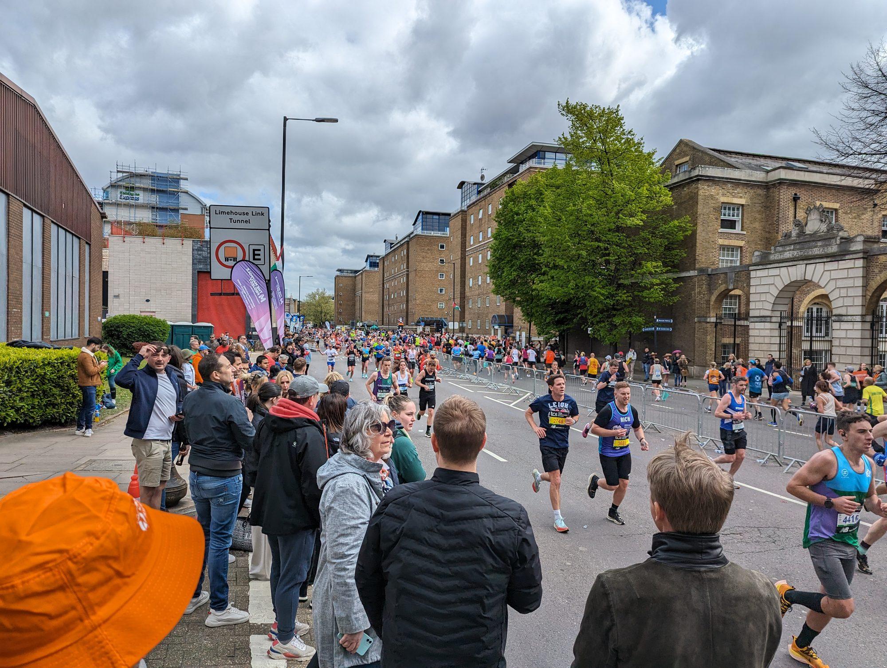
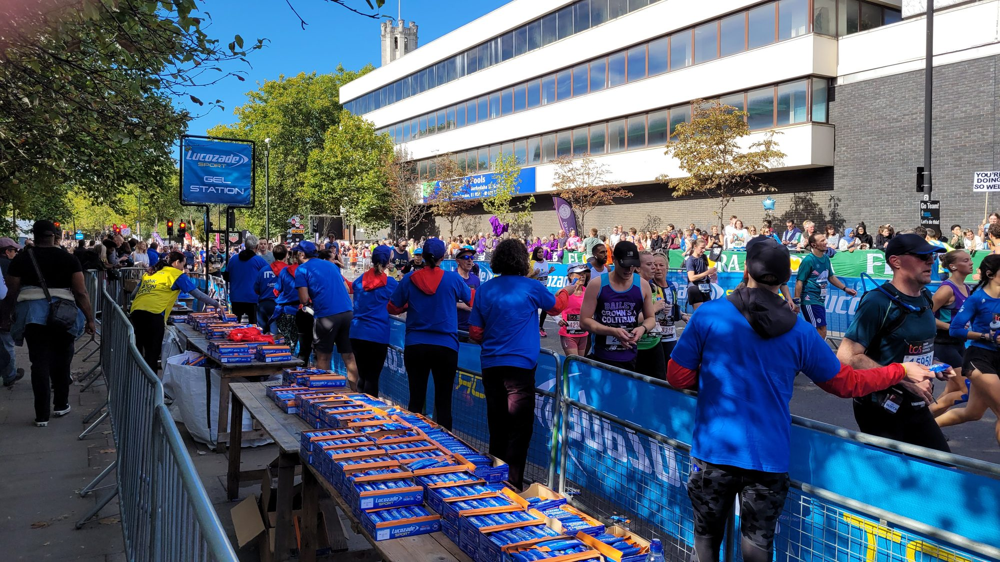
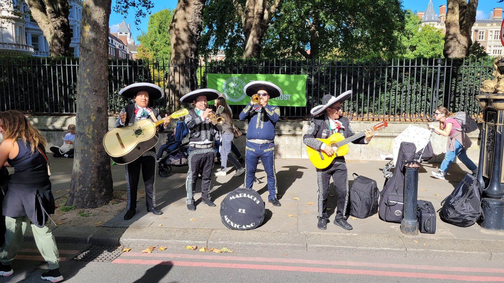

The London Marathon is the hardest mass-participation race in the world to get into. **A record 1,338,544 people applied for a place in the 2027 race** — more than double the number who applied for 2024, and more than a million of them from the UK alone.

**2027 is also unlike any London Marathon before it.** For one year only it runs over **two days — Saturday 24 and Sunday 25 April 2027** — with 45,000 people running on the Saturday and 55,000 on the Sunday. A hundred thousand runners across one weekend, on the same course from Greenwich to The Mall.

This guide covers every legitimate way to get a place, what is still open for 2027, and — if you would rather watch than run — where to stand.

> 💡 **The Short Version:** The **2027 ballot has closed**. What is still open for 2027 is a **charity place**, which means raising roughly **£2,000–£3,000**; an **official international tour operator** if you live abroad; or the **MyWay virtual marathon** at £40. For 2028, the ballot should open around **race weekend in late April 2027** — it is **free to enter** and you only pay if you get in. If you are quick enough, **Good For Age** and **Championship** entry are far better odds than the ballot. To **watch**, skip the famous spots and go to the **Isle of Dogs**.

---

## The dates

| What | When |
| --- | --- |
| **TCS London Marathon 2027** | **Sat 24 and Sun 25 April 2027** |
| Field size | **45,000 Saturday, 55,000 Sunday** |
| 2027 ballot | Closed — ran 24 April to 1 May 2026, results 9 July 2026 |
| Good For Age and Championship 2027 | Standards expected **autumn 2026** |
| 2028 ballot | Not announced. Expect it around **race weekend, late April 2027** |
| 2028 race | Not confirmed. Charities are advertising **Sunday 30 April 2028** |

> ⚠️ **The two-day format is a 2027 one-off.** Everything about it — the Saturday field, the split of Good For Age and Championship runners across the two days, the extra charity and club places — applies to 2027 only. Expect a single-day race again in 2028.

---

## Route 1: The ballot

The main public route, and the longest odds of any of them.

### When it runs

It has settled into a fixed pattern: the ballot opens on the **Friday of race weekend** in late April, closes the **following Friday**, and results go out by **early July**.

| Race | Ballot opened | Ballot closed | Results |
| --- | --- | --- | --- |
| **2026** | Fri 25 April 2025 | Fri 2 May 2025 | July 2025 |
| **2027** | 09:00, Fri 24 April 2026 | 16:00, Fri 1 May 2026 | Emailed 9 July 2026 |
| **2028** | Expected late April 2027 | Expected a week later | Expected July 2027 |

### What it costs

**Entering the ballot is free.** You choose between two options when you apply:

| Option | Pay now | Pay if you get in | If you miss out |
| --- | --- | --- | --- |
| **Standard** | Nothing | **£79.99** | Nothing lost |
| **"Double your chances"** | **£49.99** donation | Nothing more — the £49.99 is your entry fee | £49.99 kept as a donation; you get a hydration vest |

The second option is a **£30 discount if you get in**, a second draw if you miss the first, and a £49.99 donation to the London Marathon Foundation if you miss both. Whether that is worth it depends entirely on how much you want the vest.

**Overseas runners pay considerably more.** The organisers currently state a **£275 international entry fee**, which includes a carbon offset charge for international travel. Note that when the 2027 ballot opened in April 2026 this was widely reported as £225, so check the figure at the point you apply.

There are separate **UK and international ballots**, entered through the same form in the same window. The organisers do not publish whether the odds differ between them, so be wary of anyone who tells you one is easier.

### The odds, honestly

Applications are published every year, and they are rising fast:

| Race | Applications | UK | Overseas |
| --- | --- | --- | --- |
| 2024 | 578,304 | — | — |
| 2025 | 840,318 | 672,631 | 167,687 |
| 2026 | 1,133,813 | 869,803 | 264,011 |
| **2027** | **1,338,544** | **1,008,091** | **330,450** |

2027 was the first year UK applications passed a million — about **1.8% of the entire UK population** applied to run. The single largest group was **women aged 20–29**, more than 179,000 of them.

> ⚠️ **Nobody publishes the number of ballot places, so nobody knows the real success rate.** London Marathon Events releases applicant totals but has never released the ballot allocation. Reporting puts it at roughly **20,000 places a year**, which would give odds somewhere between **1 in 30 and 1 in 60** depending on the year. You will see "1 in 13" quoted widely for 2027 — that divides applicants by the **entire 100,000 field**, including charity, Good For Age, Championship, club and tour operator places. It is not the ballot rate.

---

## Route 2: A charity place

**This is the route still open for 2027**, and for most people who miss the ballot it is the realistic answer.

Charities buy entries from the organisers — £400 plus VAT each — and give them to runners who commit to fundraising. That purchase price is exactly why the targets are what they are.

### What it costs you

| Charity | Registration fee | Minimum to raise |
| --- | --- | --- |
| Get Kids Going! | £40 | **£2,000** |
| National Trust | £100 | **£2,000** |
| ZSL | £100 | **£2,000** |
| Médecins Sans Frontières UK | — | **£2,500** |
| Guy's & St Thomas' Charity | — | **£2,750** |

**Budget £2,000–£3,000 plus a registration fee of £40–£100.** Smaller charities cluster at the £2,000 floor and sometimes waive the fee; the big names ask more because they can fill the places.

> ⚠️ **The target is a pledge, not a suggestion.** Charities set interim milestones — Médecins Sans Frontières required £660 of its £2,500 by early January — and reserve the right to withdraw your place before race day if you are clearly not going to get there. Oxfam's terms went further, stating that missing the target means the organisers are informed and it "will impact your chances of running the TCS London Marathon in the future". Nobody is going to sue you, but do not treat the number as decorative.

### The distinction worth knowing

- **A charity place** is the charity's bought entry, given to you in exchange for a registration fee and a fundraising commitment.
- **An "own place"** is when you already have a ballot or club place and choose to fundraise anyway. There is normally **no registration fee and no minimum target**, and you still get the running vest and the charity's support. If you have your own place, never take a charity's bond place as well — you are using up an entry that cost them £400.

---

## Route 3: Good For Age

If you are fast, this is a far better bet than the ballot — and most people who would qualify never check.

**The 2027 standards had not been published as of late August 2026**; the organisers said they would come in the autumn, along with the split of Good For Age men and women across the two race days. These are the 2026 standards, for reference:

| Age | Women | Men |
| --- | --- | --- |
| 18–39 | sub 3:38 | **sub 2:52** |
| 40–44 | sub 3:43 | sub 2:57 |
| 45–49 | sub 3:46 | sub 3:02 |
| 50–54 | sub 3:53 | sub 3:07 |
| 55–59 | sub 3:58 | sub 3:12 |
| 60–64 | sub 4:23 | sub 3:34 |
| 65–69 | sub 4:53 | sub 3:52 |
| 70–74 | sub 5:53 | sub 4:52 |
| 75–79 | sub 6:13 | sub 5:07 |
| 80–84 | sub 6:38 | sub 5:27 |
| 85–89 | sub 7:10 | sub 6:10 |
| 90+ | sub 7:45 | sub 7:20 |

Things that catch people out:

- **The standards got harder for 2026** — cut by three minutes for men and two for women in nearly every age band.
- **Meeting the time is not a place.** Good For Age was capped at **6,000 entries for 2026** (3,000 men, 3,000 women) and allocated **fastest-first** within each age and gender group. If you scrape the standard, you may still miss out — which is why the organisers advise entering the ballot as well if you are within ten minutes of it.
- **Your age is the age you were when you ran the time**, not on marathon day.
- **UK residents only**, on a course certified by UK Athletics, AIMS or a national governing body.
- **Good For Age places cannot be deferred**, with pregnancy and postpartum the only exception.

Applications for the 2026 race opened on 2 October and closed at the end of the month, so expect a similar short October window.

---

## Route 4: Championship entry

For serious club runners. Again, **2027 standards were still to be published** in late August 2026; the 2026 criteria were:

| | Men | Women |
| --- | --- | --- |
| **Marathon** | sub-2:38:00 | sub-3:10:00 |
| **Half marathon** | sub-1:11:30 | sub-1:26:00 |

**1,200 places** for 2026, split evenly between men and women, allocated fastest-first if oversubscribed. You need a **valid affiliated UK Athletics membership**, and you apply with a link to the official results page — screenshots are rejected. Half-marathon times only count if you have never completed a marathon, or your marathon time falls outside the qualifying window.

Unsuccessful UK applicants may be offered a Good For Age place instead.

> ⚠️ **Falsifying a qualifying time carries a ban of up to five years from every London Marathon Events race**, and up to a life ban for a second offence.

---

## Route 5: A running club place

Genuinely overlooked, and the cheapest guaranteed route in if you already run with a club.

Clubs affiliated to British Athletics get an allocation based on how many first-claim members aged 18 or over they have:

| First-claim members | Entries |
| --- | --- |
| **0–9** | None — the club does not qualify |
| **10–39** | Entered into a draw for **228 guaranteed entries**, one per successful club |
| **40–189** | **1** guaranteed |
| **190+** | **2** guaranteed |

Clubs do not apply — the organisers email every eligible club with its allocation, in late October for the 2026 race, with names due back by mid-December. That means **most clubs run their internal draw in November or early December**, on whatever basis they choose: years of membership, race and volunteering participation, or priority to people who have never run London. There is no national rule, so ask your club how it decides.

Runners pay the standard £79.99, and **club places can be deferred**, unlike Good For Age and Championship. For 2027, clubs get more places than usual, spread across both days.

---

## Route 6: Entering from overseas

Two routes, and they work very differently.

**The international ballot** runs in the same window as the UK one, through the same form. It is free to enter, and the entry fee if you are drawn is the higher international one.

**Official international tour operators** are the guaranteed-entry route, and there are over a hundred of them worldwide. **Sports Tours International** is named as the official overseas tour operator, covering the USA, Ireland, France and selected other territories — and note it is explicitly **not available to UK residents**. **Marathon Tours & Travel** is the official North American agency and does publish prices.

Indicative 2027 package prices, four nights, per person, guaranteed race entry included:

| Package | Sharing a double | Single room |
| --- | --- | --- |
| **Classic** (Marble Arch) | **$3,150–$3,960** | $4,135–$4,475 |
| **Signature** (Park Lane, Mayfair five-stars) | **$3,675–$4,510** | $4,765–$6,780 |

Flights are extra. As a rough guide to what the entry itself is worth inside those packages, the non-runner discount is **$1,350**.

---

## Route 7: The virtual marathon

**TCS London Marathon MyWay** is 26.2 miles wherever you like on marathon day, for **£40 in the UK or £55 internationally**. It has to be outdoors — treadmills do not count. For 2027 you can enter either day, or both, or run the real race one day and MyWay the other. Same medal.

> 💡 **It has one real use beyond the medal: a MyWay time counts as a Good For Age qualifier.** You also need to submit an in-person certified half-marathon time from the same qualifying window that meets a separate standard. Beyond that, MyWay gives you **no ballot advantage and no priority** for a future place, whatever anyone implies.

---

## What never works

- **Buying a place.** Selling, swapping or transferring an entry is explicitly banned, as is running on someone else's number. There is **no official resale platform**, so every bib for sale on eBay, Facebook or Gumtree is one that will be cancelled.
- **Entering the ballot more than once.** Multiple entries using different email addresses will disqualify **all** of them.
- **Swapping days in 2027.** Even between friends or family allocated different days, this cancels your place.
- **Using someone else's qualifying time** for Good For Age or Championship entry.

The penalty for any of these is annulled results and **a ban from all London Marathon Events races for up to five years** — and up to a **life ban** for a second breach.

### Deferrals

If you have a place and cannot run, whether you can roll it over depends entirely on how you got it:

| Entry route | Can you defer? |
| --- | --- |
| Ballot, UK or international | **Yes** |
| Running club | **Yes** |
| Charity | Not through the organisers — ask the charity |
| **Good For Age** | **No** |
| **Championship** | **No** |
| Tour operator | Ask the operator |
| MyWay virtual | **No** |

Two things people get wrong: you **pay the entry fee again** for the deferred year, so it is a guaranteed entry rather than a free one; and you **cannot defer a place that was already deferred once**. Pregnancy and postpartum deferrals are more generous — up to three years, keeping any Good For Age or Championship category without requalifying.

---

---

## Watching the London Marathon

You do not need a ticket, a place or a plan to watch — the whole route is public pavement and it is free. But the day defeats a lot of people, because the course cuts London in half for most of the day and the obvious viewing spots are the ones everyone else has picked.

### The route, in order

The race starts on Blackheath and in Greenwich Park in three waves — **Red** on Charlton Way, **Blue** on Shooters Hill Road and **Pink** on St John's Park. They do not merge immediately: the three courses meet **just before Mile 3, at Woolwich**, then head back west.

| Mile | Where |
| --- | --- |
| 3–4 | Woolwich |
| **6.5** | **Cutty Sark**, Greenwich |
| 9 | Canada Water and Surrey Quays |
| 11.5 | Bermondsey, Jamaica Road |
| **12.5** | **Tower Bridge** — halfway falls just after, on The Highway |
| 14 | The Highway, eastbound |
| 15–16 | Westferry Road, Isle of Dogs |
| 17 | Mudchute |
| 18 | Marsh Wall |
| **19** | **Canary Wharf** |
| 20 | Poplar High Street |
| 21 | Commercial Road, Limehouse — **Rainbow Row** just after |
| **22** | **The Highway, westbound** |
| 23 | Tower Hill |
| 24 | Upper and Lower Thames Street |
| 25 | Victoria Embankment and Parliament Square |
| 26 | Birdcage Walk, then the finish on **The Mall** |

### Where to stand

The organisers themselves split the route into places that will be heaving and places that will not. This is their own classification, not ours.

| Officially "extremely busy" | Officially quieter |
| --- | --- |
| Cutty Sark (6.5) | Rotherhithe peninsula (9–11) |
| Canada Water (9) | **The Highway (14 and 22)** |
| Bermondsey (11.5) | Westferry (15) |
| **Tower Bridge (13)** | Isle of Dogs (16) |
| Canary Wharf (18–19) | Poplar High Street (20) |
| Limehouse (21) | Victoria Embankment (25) |
| Tower Hill (23) | |
| **Westminster (26)** | |

> ⚠️ **Expect station queues of up to 90 minutes** at the busy points — that is the organisers' own figure, and it applies at Cutty Sark and Limehouse in particular. Their blunt advice about the busy zones is worth repeating: *"This could be the only part of the route you can visit, so make the most of it."*

**Tower Bridge is the iconic spot and it is worth it once** — but arrive early, and use London Bridge rather than Tower Hill or Tower Gateway.

Powered by <a target="_blank" rel="sponsored" href="https://www.getyourguide.com/london-l57/">GetYourGuide</a>

### The best place to watch: the Isle of Dogs

If you want to actually see the race rather than the back of someone's head, go to the **southern half of the Isle of Dogs — Westferry Road, Millwall and Mudchute, Miles 15 to 17.**

**It is quiet precisely because it is awkward to reach**, and that trade is worth making. The island is a peninsula served by small DLR stations — Crossharbour, Mudchute, Island Gardens and South Quay — with none of the mainline capacity that funnels crowds to Tower Bridge or Greenwich. The course loops around it, so you can only cross at designated points. And almost everyone who has come to watch a landmark has gone to the landmarks instead.

What you get for the inconvenience:

- **Room at the barrier**, even fairly late in the morning. The photograph above is the elite women's lead pack going through, from a standing spot a few feet back with no crush.
- **A genuine local crowd** rather than a tourist one — residents out on their own street, and bands playing on the pavement.
- **A second sighting.** The course runs out along Westferry Road and comes back through Canary Wharf, so from around here you can catch the field at Mile 15 and again at Mile 18 without getting on a train.
- **Mudchute at Mile 17 is the pick if you have children** — quieter still, and Mudchute Farm is next door for when they lose interest.

> ⚠️ **One caveat: Canary Wharf itself is not quiet.** Miles 18 and 19, in the estate, are on the organisers' "extremely busy" list. The quiet stretch is the residential southern half of the island, not the towers.

**Poplar High Street at Mile 20** works on the same principle — you stand with local residents rather than tourists.

### How to see your runner twice

This is the thing worth planning, and there is one clear answer.

> 💡 **The Highway, Miles 14 and 22.** The course runs out along the north bank and comes back on the other carriageway, so you can stand in one place and see the field twice, roughly 45 minutes to an hour apart. Get there on the Overground to **Shadwell** or **Wapping**. It is on the organisers' own list of quieter stretches, and there is no train journey in between.

Three more that work:

- **Limehouse DLR** — Mile 15, then Mile 21 and Rainbow Row.
- **Canary Wharf** — Miles 15 and 18, using the estate's loop rather than a train.
- **Tower Hill** — halfway on The Highway, then Mile 23.

### Getting around on the day

**The single most useful fact, and it is buried in the organisers' map rather than on the website: Cutty Sark DLR is entrance only on marathon day. You cannot get off the train there.** Walk in from Deptford, Greenwich, Island Gardens or Maze Hill instead. **Westminster station is exit only** for much of the day.

**Crossing the course** is the other thing that catches people out. Roads shut from **07:00**, and the bulk of the route stays closed until about **20:30**. Only stewarded crossing points let you across:

- **Greenwich** — Creek Road and Romney Road. Note **Creek Road is one-way for pedestrians, east to west only.**
- **Tower Bridge and Tower Hill** — no surface crossing at all; use the underpasses.
- **Wapping** — the pedestrian subway where The Highway meets Glamis Road.
- **Limehouse** — Butcher Row.
- **Canary Wharf** — Upper Bank Street, Bank Street, Montgomery Street and Marsh Wall.
- **Westminster** — Parliament Square, Victoria Embankment and the Spur Road footbridge. Birdcage Walk is **entry only** into St James's Park; Storey's Gate is **exit only**.

The **Greenwich Foot Tunnel** runs **one way, south to north, between 10:00 and 12:30**, and it queues.

> 💡 **The boat beats the trains.** Uber Boat by Thames Clippers runs pier to pier between Woolwich and Westminster via Greenwich, Canary Wharf, Rotherhithe, Tower and Embankment. It crosses none of the course, it is nothing like as crowded as the DLR, and the boats have toilets and a café bar — which matters more than you would think, for reasons below.

Buses on the route are diverted or curtailed, no taxi will take you across the course during the race, and Santander Cycles docking stations along the route are suspended from the Saturday evening.

### Timings

Start times shift year to year and the 2027 pair had not been confirmed when we wrote this. For the 2026 race, the elite wheelchair races went at **08:50**, the elite women at **09:05**, and the elite men and the mass field at **09:35**, with waves continuing until **all start lines closed at 11:30**.

The practical consequence: at any given point on the course, the runners keep coming for **hours**. At Tower Bridge you are looking at roughly 11am until mid-afternoon; at Canary Wharf, roughly midday until late afternoon. If you are watching for one person, that is a long wait in one spot — which is the argument for the two-sightings plan above.

### Toilets, and the thing nobody warns you about

> ⚠️ **There are five spectator toilets on the entire 26.2-mile route.** They are at Trafalgar Road, Cutty Sark Gardens and Welland Street around Mile 6, Reuters Plaza in Canary Wharf, and St James' Gardens at Mile 21. That is it. The portaloos you can see every mile are for runners. Plan accordingly, and note again that the Thames Clipper boats have toilets on board.

There are **five accessible viewing areas** — barrier-free, stewarded, each with an accessible toilet, and a carer or supporter is welcome: Cutty Sark, Canary Wharf, Rainbow Row on Butcher Row, Tower Hill and Victoria Embankment.

### The finish, and finding your runner

**You cannot stand at the finish line.** The Mall is not a general spectator area, and access to St James's Park is controlled. Spectators are directed instead to the **Meet and Greet area** on Horse Guards Avenue, Horse Guards Road and Horse Guards Parade, where meeting points are marked by letter — A, B, CD, EF, G, HIJ, KL, M, NO, P, QR, S, TUV and WXYZ. Several letters are grouped, so "meet at F" means the EF point.

> ⚠️ **Agree your letter and a fallback time before race day.** Your runner needs **up to 30 minutes** to walk from the finish line to the meeting area, and phone signal in the crowds is poor. The organisers say it twice in their own guidance: do not rely solely on your phone. The official app has live runner tracking and it is worth having, but it is a supplement to a plan, not a plan.

Also in the finish area: a sensory calm tent, a parent and child tent for feeding and young children, and a multi-faith prayer tent. Charity post-race receptions are invitation-only — if your runner is with a charity, check with them rather than turning up.

One thing spectators often assume wrongly: the **free post-race TfL travel is for runners showing a bib**, not for the people who came to watch.

### The rest of the marathon weekend

2027 turns the race into a four-day event, and two of the extras are worth knowing about if you are in London anyway:

| When | What |
| --- | --- |
| **Fri 23 April** | **TCS Mini London Marathon** — moved from its usual Saturday slot. Around 20,000 young runners finishing on The Mall. Schools enter, not individuals |
| **Fri 23 April** | **Friday Night Lights 5K** |
| **Tue 20 – Sat 24 April** | **The Running Show at ExCeL** — free to attend, and open on the Saturday while day one runs |
| **Sat 24 and Sun 25 April** | The marathon itself |

---

## Continue planning your London trip

- 🎾 **[How to Get Wimbledon Tickets](/articles/wimbledon-tickets-guide/)**
- 🚇 **[How to Use the London Underground](/articles/how-to-use-the-london-underground/)**
- 💷 **[London Transport Costs and Fares](/articles/london-public-transport-costs-and-fares/)**
- 🌳 **[Best Parks and Gardens in London](/articles/best-parks-gardens-london/)**
- 💷 **[London on a Budget](/articles/london-on-a-budget/)**

---

*Entry routes, fees and qualifying standards are as published by London Marathon Events and the named charities and operators, and checked in August 2026. Good For Age and Championship standards shown are the 2026 criteria; the 2027 standards were still to be published at the time of writing. Charity fundraising targets vary by charity and year — check with the charity directly before committing.*
