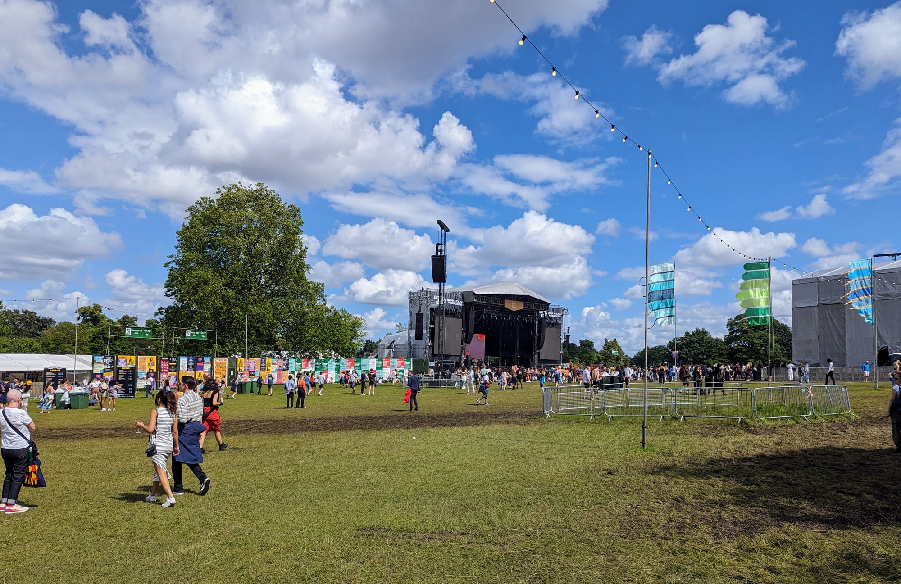
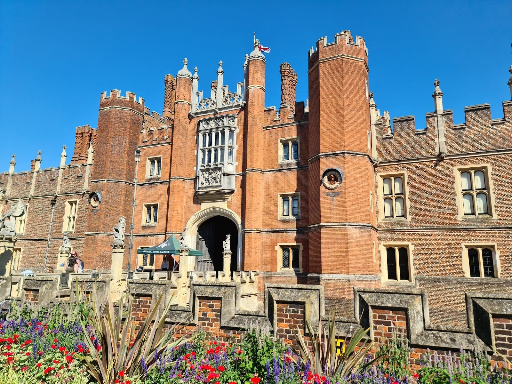
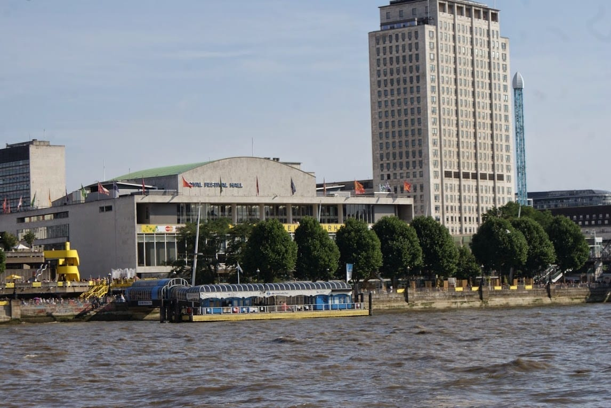
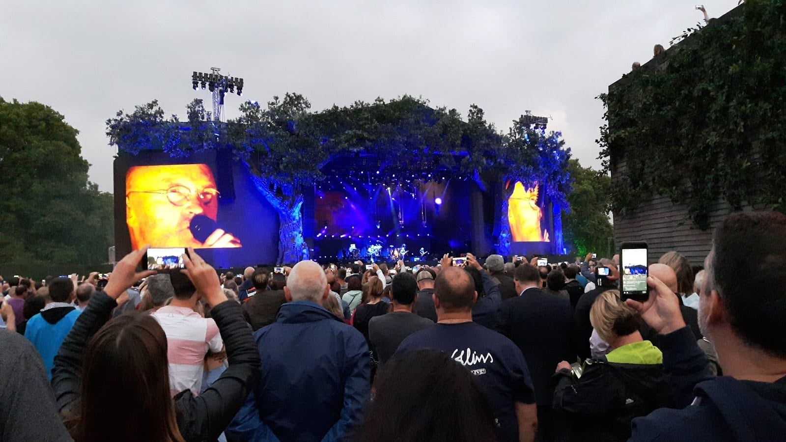
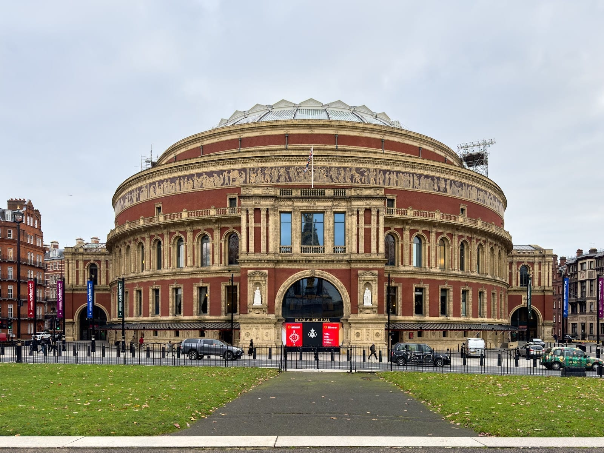
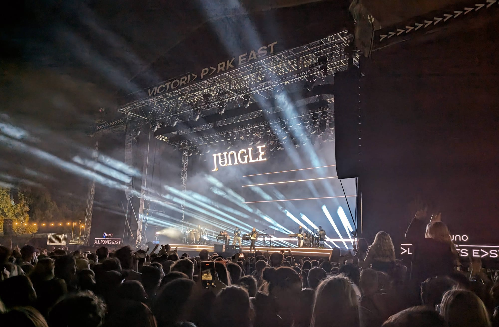
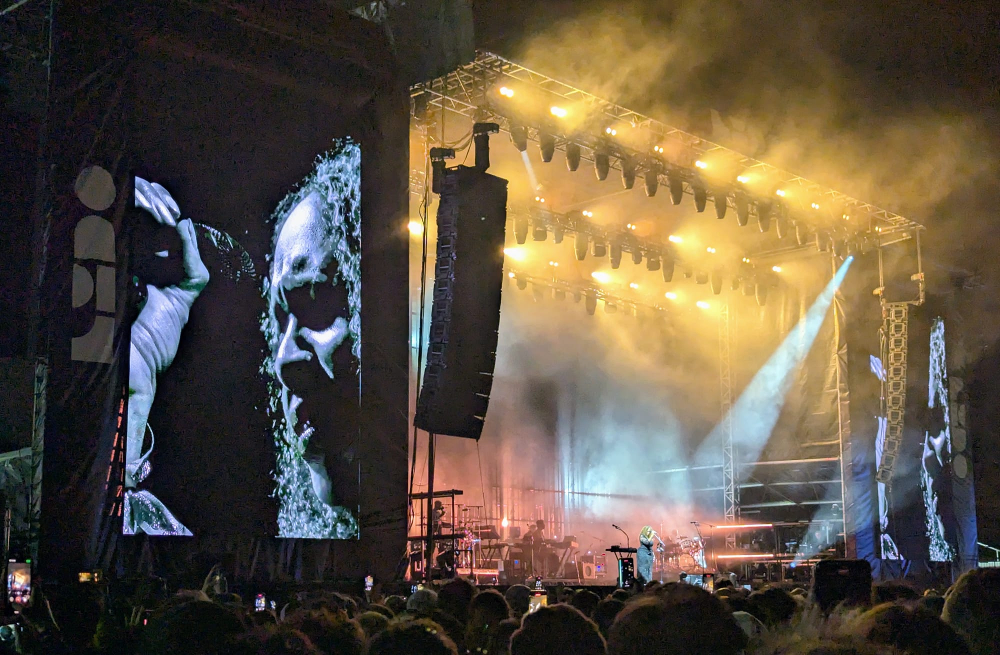
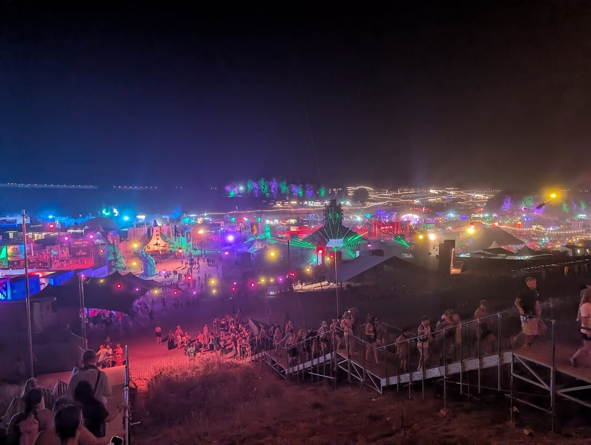
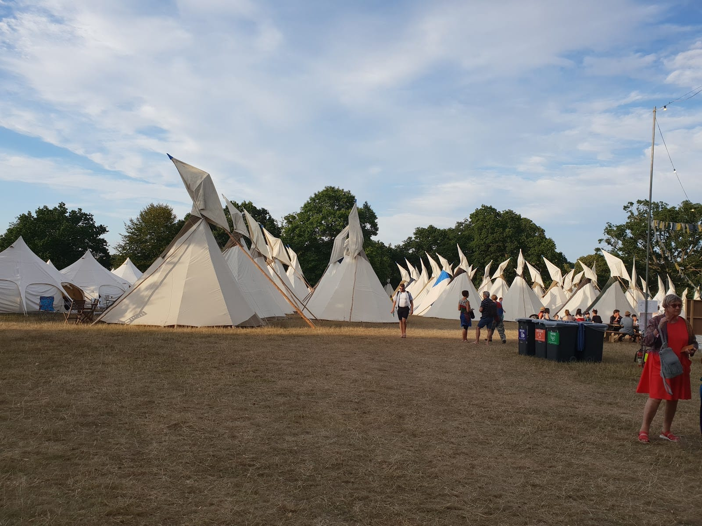

> 💡 **The Short Version:** Six London festivals have **2027 dates**: **Country to Country** at The O2 (12–14 March); four in **Brockwell Park** around the late May bank holiday, **Field Day** (29 May), **Cross the Tracks** (30 May), **City Splash** (31 May) and **Mighty Hoopla** (5–6 June); and **Kaleidoscope** at Alexandra Palace (10 July). **BST Hyde Park** and **All Points East** haven't announced 2027 yet: in 2026 BST ran from late June to mid-July, and All Points East over the last two weekends of August. Within a train ride, **Reading** (26–29 August), **Boomtown** (11–15 August), **Love Supreme** (2–4 July), **Henley** (7–11 July) and **Cambridge Folk Festival** (ends 1 August) have set their dates, and several are already on sale. Still to come this year: the **EFG London Jazz Festival**, 13–22 November 2026.

## 2027 at a glance

| Festival | Where | 2027 | 2026 |
|---|---|---|---|
| Country to Country | The O2 | **12–14 March** | 13–15 March |
| Field Day | Brockwell Park, SE24 | **29 May** | 23 May |
| Cross the Tracks | Brockwell Park, SE24 | **30 May** | 24 May |
| City Splash | Brockwell Park, SE24 | **31 May** | 25 May |
| Mighty Hoopla | Brockwell Park, SE24 | **5–6 June** | 30–31 May |
| Hampton Court Palace Festival | Hampton Court Palace | Not yet announced | 10–20 June |
| Meltdown | Southbank Centre | Not yet announced | 11–21 June |
| BST Hyde Park | Hyde Park | Not yet announced | 27 June – 12 July |
| Kaleidoscope | Alexandra Palace Park | **10 July** | 11 July |
| Wireless | Not yet announced | From 9 July on Skiddle's listing | — |
| Somerset House Summer Series | Somerset House | Not yet announced | 16–26 July |
| Junction 2 | Boston Manor Park | Summer, dates not yet announced | 25–26 July and 2 August |
| BBC Proms | Royal Albert Hall | Not yet announced | 17 July – 12 September |
| All Points East | Victoria Park | Not yet announced | 21–23 and 28–30 August |
| LIDO | Lido Field, Victoria Park | Not yet announced | 31 August |
| The Great Escape | Brighton | **From 12 May** | May |
| Love Supreme | Glynde, East Sussex | **2–4 July** | 3–5 July |
| Henley Festival | Henley-on-Thames | **7–11 July** | 8–12 July |
| Cambridge Folk Festival | Cambridge | **30 July – 1 August** | Late July |
| Boomtown | Near Winchester | **11–15 August** | 12–16 August |
| Reading | Reading | **26–29 August** | 27–30 August |
| Wilderness | Cornbury Park, Oxfordshire | Not yet announced | 30 July – 2 August |
| Truck | Near Didcot, Oxfordshire | Not yet announced | 23–27 July (campsites) |
| Lovebox | Dreamland, Margate | Not yet announced | 29–30 May |

## Festivals in London

In rough date order through the year.

### Country to Country, The O2

**Friday 12 – Sunday 14 March 2027.** [C2C: Country to Country](https://c2cfestival.co.uk/) is three days of country music at The O2, running the same weekend in Glasgow and, for the first time in 2027, Manchester. It ran 13 to 15 March in 2026. Tickets for 2027 go on general sale in the autumn of 2026. Our [O2 travel guide](/articles/the-o2-travel-guide/) covers getting there and back.

### Field Day, Brockwell Park

**Saturday 29 May 2027.** [Field Day](https://www.fielddayfestivals.com/) is electronic and dance music, running since 2007 and in Brockwell Park since 2025, when Peggy Gou led the bill. The 2026 edition, on 23 May, included **Joy Orbison**, **Floating Points (live)**, **Honey Dijon**, **Andy C** playing a jungle set and **MJ Cole (live)**. **18+ only**, with ID checked at the gate. In 2026 it ran 12pm to 10.30pm, with last entry at 8pm. The site takes sign-ups for the next ticket release. [Tickets on Skiddle](https://www.skiddle.com/festivals/field-day/).

### Cross the Tracks, Brockwell Park

*Cross the Tracks in Brockwell Park, with the main stage across the field.*

**Sunday 30 May 2027.** [Cross the Tracks](https://www.xthetracks.com/) is jazz, funk and soul, mixing heritage acts with emerging artists. **Little Simz** headlined on 24 May 2026, the year after Ezra Collective. **All ages**; children aged 3 to 17 need a bolt-on to get into the VIP area. There are more than 50 street food traders and a craft beer fair. In 2026 it ran 12pm to 10.45pm, with last entry at 8pm. [Tickets on Skiddle](https://www.skiddle.com/festivals/crossthetracks/).

### City Splash, Brockwell Park

**Monday 31 May 2027.** [City Splash](https://www.city-splash.com/) is reggae, dancehall, afrobeats and amapiano, with more than 80 Black-owned food traders. **All ages**, but anyone under 18 must be with a parent or guardian aged over 26, and one adult can bring up to four. At the 2026 edition, on 25 May, children's tickets were **£20 for under-10s** and **£40 for 10 to 17s**, and the site was open 12pm to 10pm, with last entry at 6pm. [Tickets on Skiddle](https://www.skiddle.com/festivals/city-splash-festival/).

### Mighty Hoopla, Brockwell Park

**Saturday 5 and Sunday 6 June 2027.** [Mighty Hoopla](https://www.mightyhoopla.com/london) is pop, with queer culture at its centre: Brockwell Live puts it at more than 400 artists and performers over two days and eight stages. It ran 30 and 31 May in 2026. **18+ only, and no babies.** 12pm to 10.30pm on Saturday and to 10.15pm on Sunday, with last entry at 8pm. **The 2027 early birds have sold out**; general sale comes later in the year, with £20 deposits and a six-for-the-price-of-five group ticket. [Tickets on Skiddle](https://www.skiddle.com/festivals/mighty-hoopla/).

**Brockwell Park rules.** Each of the four is ticketed separately, and all use the site rules set by [Brockwell Live](https://www.brockwell-live.com/), which runs the park's summer festival series. Herne Hill station is about 500 metres from the park's entrances, and Brixton (Victoria line) is about a mile away, or two minutes on the train to Herne Hill. You can't leave and come back in. Bags bigger than A4 aren't allowed, there's no cloakroom, and you can't bring your own food or drink. Expect a search at the gate, with search dogs.

### Hampton Court Palace Festival

*The west front of Hampton Court Palace. The concerts are held in Base Court, inside.*

**June. 2027 not yet announced.** Evening concerts in Base Court at [Hampton Court Palace](https://hamptoncourtpalacefestival.com/), with **3,000 seats a night**. People picnic in the East Front Gardens first. It ran **10 to 20 June 2026**, and the headliners included **David Gray**, **OMD**, **The Stranglers**, **Nile Rodgers & CHIC**, **Elvis Costello & The Imposters** and **Sophie Ellis-Bextor**. There are two direct trains an hour from Waterloo to Hampton Court, taking about 40 minutes, and the 111 bus stops outside the palace 24 hours a day. The site has a waitlist for 2027 tickets. [Tickets on Skiddle](https://www.skiddle.com/festivals/hampton-court-palace-festival/).

### Meltdown, Southbank Centre

*The Royal Festival Hall, on the Southbank Centre's riverside site.*

**Mid-June. 2027 curator and dates not yet announced.** The Southbank Centre calls [Meltdown](https://www.southbankcentre.co.uk/events/meltdown/) the world's longest-running artist-curated music festival: each year one musician programmes the 11-acre site. **Harry Styles** curated 2026, from **11 to 21 June**, and played a headline show at the Royal Festival Hall on 16 June; Little Simz curated 2025. The 2026 festival added free events to the ticketed gigs. [Tickets on Skiddle](https://www.skiddle.com/festivals/meltdown/).

### BST Hyde Park

*Every show is standing only, on the grass in front of a stage dressed as a stand of trees.*

**Late June to mid-July. 2027 not yet announced.** [American Express presents BST Hyde Park](https://www.bst-hydepark.com/) is a run of one-headliner days on the Great Oak Stage: in 2026 there were nine shows over three weekends, **27 June to 12 July**. The headliners were **Garth Brooks** (65,000 people, his first UK show in almost 30 years), **ATEEZ**, **Maroon 5**, **Mumford & Sons**, **Duran Duran**, **Pitbull**, and **Lewis Capaldi** on two nights. All five shows on its 2026 line-up page are marked sold out. Between the weekends, BST's **Open House** fills the site with free events.

Every show is **standing only**. You can bring one bag no bigger than A4 and no chairs, and apart from an unopened bottle of water of up to 500ml, no food or drink. The bars and food stalls are cashless. Children aged **2 to 9** come in on a Child + Guardian ticket, sold as a pair, and **under-2s are free**. Shows finish by **10.30pm**, or **10pm on Sundays**. The stations are Hyde Park Corner, Knightsbridge, Green Park and Bond Street (Elizabeth line). Check for Piccadilly line closures before you go: in 2026 the whole line shut on the first weekend, closing Hyde Park Corner and Knightsbridge.

### Kaleidoscope, Alexandra Palace

**Saturday 10 July 2027, on sale.** [Kaleidoscope](https://kaleidoscope-festival.com/) is a one-day festival of music, comedy and family entertainment in the park below Alexandra Palace, across three stages, with a family area and a chance to explore the Palace's Victorian basements. It ran on 11 July 2026 and sold out; **tier 1 tickets for 2027 are on sale**. Adult tickets are for **16 and over**, child tickets for **5 to 15**, and under-5s cost **£10** plus fees; under-16s must be with an adult aged 21 or over. Parents can leave and come back between 4pm and 8.30pm to take children home. It finishes by **10.30pm**. Alexandra Palace station (Great Northern) is a 10-minute walk from the entrance, and Wood Green (Piccadilly line) about 15. [Tickets on Skiddle](https://www.skiddle.com/festivals/kaleidoscope-festival/).

### Wireless Festival

**July 2027. Dates and venue not yet announced by the festival.** [Wireless](https://wirelessfestival.co.uk/) is Live Nation's festival, and its site is taking sign-ups for 2027 news; in September 2026 Live Nation ran a survey offering VIP weekend tickets to Wireless 2027 as the prize. Skiddle's page lists the 2027 festival from **Friday 9 July**, but Wireless itself hasn't confirmed dates or a site, so treat that as provisional. Its past bills include the first UK headline shows by Drake and Rihanna. [Tickets on Skiddle](https://www.skiddle.com/festivals/wireless-festival/).

### Somerset House Summer Series

**July. 2027 not yet announced.** Eleven nights of gigs in the courtyard of [Somerset House](https://www.somersethouse.org.uk/whats-on/somerset-house-summer-series) on the Strand. The 2026 series ran **16 to 26 July**, with **The Flaming Lips**, **Agnes Obel**, **Venna**, **Rizzle Kicks** and **Freya Ridings** among the acts.

### Junction 2, Boston Manor Park

**Summer 2027, dates not yet announced.** [Junction 2](https://www.junction2.london/) ran in Boston Manor Park in 2026. Its site now announces The Bridge, a summer 2027 series of electronic music in the same park, with Junction 2 among its events. The 2026 dates were **25 and 26 July and 2 August**. The Bridge series is **18+ only**. The site takes sign-ups for first access to tickets and line-ups.

### BBC Proms, Royal Albert Hall

*The Royal Albert Hall, home of the Proms from mid-July to mid-September.*

**Mid-July to mid-September. 2027 not yet announced.** Eight weeks of mostly classical concerts. The [2026 season](https://www.bbc.co.uk/proms) ran from **17 July to 12 September**, ending with the Last Night, where Yuja Wang played. The cheapest way in is **Promming**: standing in the Arena or Gallery for **£8** including fees, with tickets released from 9.30am on the day of each concert. General booking opened in mid-May in 2026, and season and weekend Promming passes went on sale two days earlier.

### All Points East, Victoria Park

*All Points East's main stage in Victoria Park at night, with Jungle playing.*

**Late August. 2027 not yet announced.** [All Points East](https://www.allpointseastfestival.com/) runs headline days in Victoria Park, with a free programme, In The Neighbourhood, in the week between. In 2026 it ran six days over two weekends: **Jorja Smith + Tems** (21 August), **Lorde** (22 August), **Outbreak Fest** with Deftones and IDLES (23 August), **Tyler, The Creator** (28 and 29 August) and **Twenty One Pilots** (30 August).

**Age limits change by day.** In 2026 they ran from **12+** at Twenty One Pilots to **16+** for Lorde and Tyler, The Creator, with under-18s accompanied by an adult. Gates opened at 2pm on most days and closed at 8.30pm. You can bring one A4 bag, no chairs, and no food or drink apart from an empty reusable bottle or unopened water of up to 500ml. There's no cloakroom and the site is cashless. Stations and the Night Tube are under [getting home late](#getting-home-late) below. [Tickets on Skiddle](https://www.skiddle.com/festivals/all-points-east/).

### LIDO, Victoria Park

*LIDO's main stage in Victoria Park at night.*

**Late August. 2027 not yet announced.** [LIDO](https://www.lidofestival.co.uk/) is a festival on the Lido Field in Victoria Park, where the headline artists lead the curation alongside emerging acts. In 2026 it was a single day, the bank holiday Monday, **31 August**: **Maribou State**, **Kelis**, **Folamour** and **Theo Parrish B2B Moodymann**, with DJ Koze, Kelly Lee Owens (DJ set), LTJ Bukem and Marie Davidson (live). Gates closed at 8.30pm, and there's no re-entry. You can bring one A4 bag, no chairs, and no food or drink apart from an empty reusable bottle or unopened water of up to 500ml. Mile End and Bethnal Green stations are 10 to 15 minutes' walk. [Tickets on Skiddle](https://www.skiddle.com/festivals/lido/).

## A train ride away

Our cut-off is a station that's about **90 minutes or less by train from central London**, so each of these works as a day out or a weekend without a car.

### Reading Festival

**Thursday 26 – Sunday 29 August 2027, on sale.** Rock, rap, pop and dance at Richfield Avenue in Reading, with camping. The 2026 headliners were **Chase & Status**, **Charli xcx**, **Dave**, **Florence + The Machine**, **Fontaines D.C.** and **Raye**, over 27 to 30 August. The 2027 prices are **£296** for a weekend without camping, **£326** for weekend camping, and **£362** for camping with early entry from Wednesday 25 August. Any of them can be secured with a **£20 deposit** and monthly instalments.

**Anyone 15 or under must be with a ticket holder over 18, and under-13s go in free**, though the festival advises against bringing young children. If you do, it suggests the White Campsite as the quietest. A weekend non-camping wristband doesn't let you out and back in on the same day. Reading station has direct trains from Paddington, and Big Green Coach runs the official coaches from around the country. [Tickets on Skiddle](https://www.skiddle.com/festivals/reading/).

### Boomtown

*The temporary city at night, from the hillside above it.*

**Wednesday 11 – Sunday 15 August 2027, on sale.** [Boomtown](https://www.boomtownfair.co.uk/) builds a temporary city of themed districts, with 18 stages on its 2026 line-up, on the Matterley Estate, a working dairy farm in the South Downs near Winchester. It ran 12 to 16 August in 2026. **It's 18+.** A 2027 ticket with entry from Thursday is **£370**, or **£315 if you come by public transport**. From Wednesday, those prices are £440 and £385. The public transport ticket isn't valid if you drive. You book your coach or shuttle journey by 1 July. The festival runs its own wheelchair-accessible shuttle from **Winchester** station, about three miles away. National Express coaches from more than 50 places stop at the gates.

### Love Supreme

**Friday 2 – Sunday 4 July 2027.** Jazz, soul and R&B at [Glynde Place](https://lovesupremefestival.com/) in the South Downs, with camping and glamping. The 2026 edition, 3 to 5 July, was headlined by **Loyle Carner**, **Ezra Collective** and **De La Soul**, with Sister Sledge, The Temptations & The Four Tops and Samara Joy further down. Weekend tickets are on sale on its site, with monthly payments, and day tickets go on sale when the first acts are announced. Glynde station is on Southern, and a **free shuttle** takes about five minutes to the North Entrance; on Saturday and Sunday it runs back to the station until the last train. There's a children's area, Little Supremos, and bookable nannies. [Tickets on Skiddle](https://www.skiddle.com/festivals/love-supreme-festival/).

### Henley Festival

**Wednesday 7 – Sunday 11 July 2027.** Evening concerts on a stage floating on the Thames, with comedy, jazz and art around it. **Black tie is the dress code.** In 2026, 8 to 12 July, the floating stage had **Boy George & Culture Club**, **Sugababes**, **Lulu**, **Alex James' Britpop Classical**, **The Bootleg Beatles** and **Ezra Collective**. **Under-16s aren't admitted Wednesday to Saturday, and under-12s aren't admitted on Sunday**, babies included. The Sunday morning children's festival, Playdate, has no age limit and no dress code. Henley-on-Thames station is about an hour from London, and the entrance is under 10 minutes' walk away, over the bridge. [Henley Festival's site](https://henley-festival.co.uk/) takes friends' priority bookings. [Tickets on Skiddle](https://www.skiddle.com/festivals/henley-festival/).

### Cambridge Folk Festival

**Friday 30 July – Sunday 1 August 2027 at Cherry Hinton Hall, on sale.** Running since 1965 and now organised by Cambridge City Council, with smaller folk events around the city through July. Its main weekend in 2026 **sold out**, with **Frank Turner**, **Suzanne Vega** and **Richard Thompson** with Zara Phillips headlining. **Early birds for 2027 have sold out.** Full festival tickets now start at **£160** and camping at **£65**. The arena opens at 5pm on the Friday, and the campsite surrounds it. Fast trains from King's Cross take 49 minutes; our [Cambridge day trip guide](/articles/cambridge-day-trip/) has fares and the last trains. [Tickets on Skiddle](https://www.skiddle.com/festivals/cambridge-folk-festival/).

### The Great Escape, Brighton

**From Wednesday 12 May 2027, on sale.** A festival for new music: more than 450 emerging artists across more than 30 venues in Brighton, all on one wristband, with entry subject to each venue's capacity. **It's 18+**, apart from the separately ticketed Spotlight Shows at Brighton Dome, which are 14+. **The 2027 early bird and super early bird tickets have sold out**; four-day saver tickets are on sale, and single-day tickets follow in March 2027. Direct trains from Victoria and London Bridge take as little as an hour. [Tickets on Skiddle](https://www.skiddle.com/festivals/the-great-escape/).

### Wilderness

*Tipis and bell tents in the boutique camping.*

**Late July or early August. 2027 not yet announced.** Music, long-table feasts and boutique camping in [Cornbury Park](https://www.wildernessfestival.com/), Oxfordshire. It ran **30 July to 2 August 2026**, with **Scissor Sisters**, **Carl Cox**, **The Last Dinner Party**, a **Sisters** show curated by Annie Lennox and **Soulwax** at the top of the bill. A shuttle bus runs from **Charlbury** station, and there's a walking entrance from Charlbury through the North Lodge gate. [Tickets on Skiddle](https://www.skiddle.com/festivals/wilderness/).

### Truck

**July. 2027 tickets on sale.** Indie and alternative bands near Steventon in Oxfordshire, running since 1998, when it began as a birthday party. The second tier of 2027 tickets starts at **£172 including all fees** for camping with Friday entry, or **£224** from Thursday. The first tier sold out in 30 minutes. In 2026 the campsites opened on **Thursday 23 July** and closed on **Monday 27 July**. **Under-16s need an adult aged 21 or over**, one adult to four children. **Didcot Parkway** has direct trains from London, and Thames Travel runs shuttle buses from the station to the site. [Tickets on Skiddle](https://www.skiddle.com/festivals/truck/).

### Lovebox, Margate

**Late May. 2027 not yet announced.** Lovebox moved to the seaside in 2026, at [Dreamland Margate](https://loveboxfestival.com/), on **29 and 30 May**, with **Rudimental** and **Scissor Sisters**. **18+, with ID.** Final-tier 2026 tickets were **£65 plus a booking fee** for a day and **£123.50** for the weekend. Dreamland is a short walk from Margate station, 90 minutes from St Pancras, and Southeastern ran later trains back. [Tickets on Skiddle](https://www.skiddle.com/festivals/lovebox-festival/).

## Still to come in 2026

### EFG London Jazz Festival

**Friday 13 – Sunday 22 November 2026.** Ten days of jazz and its neighbours in venues across London. The **[EFG London Jazz Festival](https://efglondonjazzfestival.org.uk/)** opens with its **Jazz Voice** gala at the Royal Festival Hall on 13 November. That night also has **Morcheeba**, **Emma-Jean Thackray** and a Coltrane centenary concert with **Joe Lovano**. Later in the festival: **Goldie**'s Dare to Dream with a live band and orchestra, and **Caravan Palace** (14 November); **Mariza** (15 November); and **Kyoto Jazz Massive** (22 November). If you're **16 to 25**, the free Serious Youth Network gets you **£5 tickets** to selected shows. [Tickets on Skiddle](https://www.skiddle.com/festivals/efg-london-jazz-festival/). Our [London Jazz Festival guide](/articles/london-jazz-festival/) covers the venues, what has sold out and the free sets.

The Great Escape's **First Fifty** also runs in November: one night in East London's independent venues, where the first 50 acts on the next May's Brighton bill play.

## Getting home late

- **The Night Tube runs on Friday and Saturday nights only**, on the Central, Jubilee, Northern (Charing Cross branch), Piccadilly, Victoria and Windrush lines. There's nothing on Sunday night, which matters for bank holiday Sundays at All Points East and Brockwell Park. Details are in our [Tube guide](/articles/how-to-use-the-london-underground/); the [bus guide](/articles/how-to-use-london-buses-and-trams/) covers night buses.
- **All Points East and LIDO**, both in Victoria Park: walk 10 to 15 minutes to Mile End (Central, District, Hammersmith & City) or Bethnal Green (Central), or take the Overground from Cambridge Heath or Bethnal Green. Expect queues to get into the stations after the headliner. LIDO's 2026 date was a bank holiday Monday, when there's no Night Tube either.
- **Brockwell Park:** there are two exits, one towards Brixton and one towards Herne Hill station. Brixton is on the Victoria line, which runs all night on Fridays and Saturdays.
- **BST Hyde Park:** shows end by 10.30pm, early enough for the normal Tube. Park Lane can close for a short time afterwards.
- **Out of town:** check the last train before the headliner starts. Love Supreme's shuttle runs to the last train, Lovebox published its late trains, and Boomtown and Reading have official coaches.

## Booking

- **Buy from the festival or its named ticket agents.** BST asks fans not to buy from secondary sites, and Brockwell Live says it can't guarantee tickets bought from third parties. [Skiddle's festival guide](https://www.skiddle.com/festivals/) lists the festivals it sells across the UK.
- **Deposits spread the cost.** Reading and Mighty Hoopla take £20 up front, and Boomtown, Truck and Big Green Coach all sell on instalments.
- **Early birds go early.** Mighty Hoopla's and The Great Escape's 2027 early birds had sold out by 23 September 2026, and Truck's first tier sold out in 30 minutes. For the ones without dates yet, the mailing list is how you hear about the first release.
- **Bring ID if you look under 25.** BST, All Points East, LIDO and the Brockwell Park festivals run Challenge 25 at the bars, and the 18+ events check ID at the gate.

## Continue planning your London trip

- 🗓️ **[What's On in London](/whats-on/)**: every gig, show and concert we list, searchable by date and price
- 🎟️ **[Tickets Going On Sale Soon](/whats-on/on-sale/)**
- 🎤 **[Best Live Music Venues in London](/articles/best-live-music-venues-london/)**
- 🚆 **[Day Trips from London](/articles/day-trips-from-london/)**
- 🎓 **[Cambridge Day Trip](/articles/cambridge-day-trip/)** and **[Oxford Day Trip](/articles/oxford-day-trip/)**
- 🌳 **[Hackney Area Guide](/articles/hackney-area-guide/)**: Victoria Park and the canal
- 🏟️ **[The O2 Travel Guide](/articles/the-o2-travel-guide/)**
- 🌤️ **[The Best Time to Visit London](/articles/best-time-to-visit-london/)**
- 🏨 **[Best Areas to Stay in London](/articles/best-areas-to-stay-in-london/)**

*Dates, line-ups, prices, age rules and travel details from each festival's own website, checked 23 September 2026. Festivals change prices by ticket tier, so check the booking page.*
