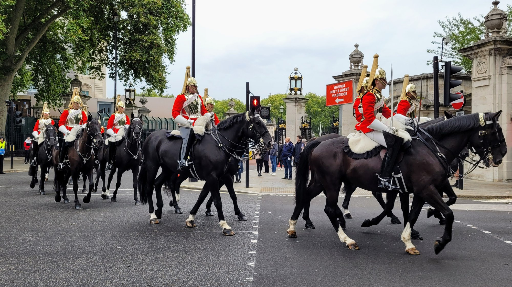
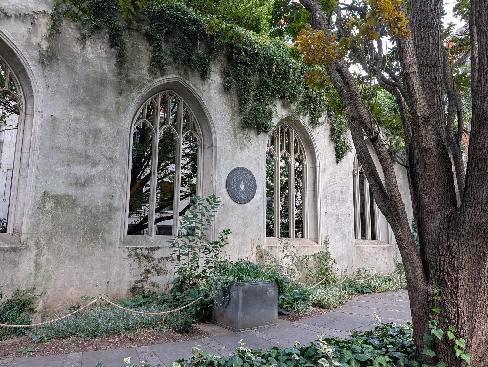
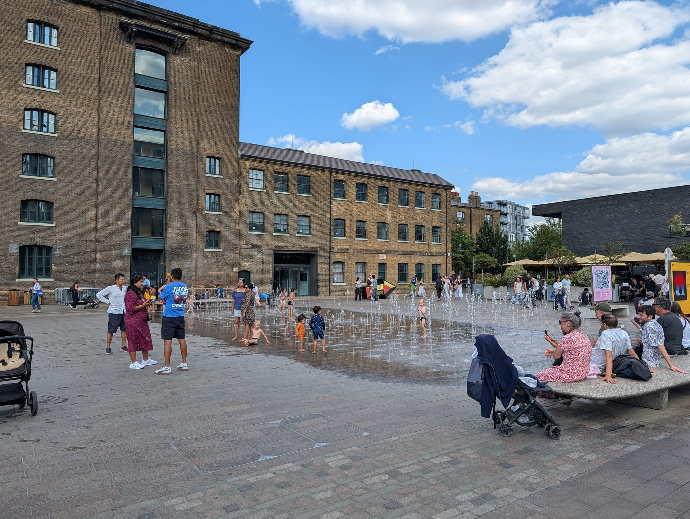
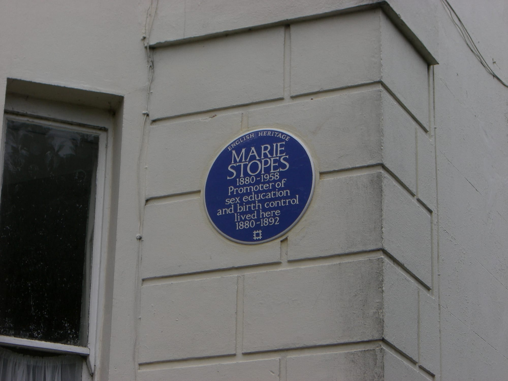

London's reputation for expense is mostly about rent. The **culture is free** — every national museum, five viewpoints including the highest one, eight Royal Parks and eight city farms cost nothing at all.

What follows is how to do the city properly on a small budget, and what is genuinely worth paying for.

> 💡 **The Short Version:** Every national museum is free. **Horizon 22** is the highest free viewing platform in London. **Evensong at St Paul's** is free and better than the £27 visit. You can watch a **Supreme Court case** or a **TV recording** for nothing. **Canary Wharf Winter Lights** in January is free while others charge £30. **ICCO** does a £3.95 pizza. And **walking is free** — central London is much smaller than the Tube map suggests.

> 📘 **How we choose these (editorial note)**
> No paid placements. These are drawn from a wide spread of sources rather than any single list - the food and travel press, the big listings sites, independent blogs and specialists, video, and what Londoners recommend themselves - and cross-referenced against each other. "Free" means free at the door with no minimum spend. Prices checked August 2026.

---

## Free: the culture

**Every national museum and gallery costs nothing.** This is the single biggest saving available in London and a lot of visitors do not realise how far it extends.

* British Museum, Natural History Museum, Science Museum, V&A
* Tate Modern, Tate Britain, National Gallery, National Portrait Gallery
* Imperial War Museum, London Museum Docklands, National Army Museum
* Young V&A, Wellcome Collection, Sir John Soane's Museum
* Serpentine Galleries, White Cube, Guildhall Art Gallery

Special exhibitions inside them are ticketed, usually £18–£25. **The permanent collections never are.**

---

## Free: the views

Five viewpoints in and around the City cost nothing, and the highest of them is free.

* **Horizon 22** — **Level 58, and the highest free viewing platform in London.** 300-degree views, two lifts that take 41 seconds. Free, but book a slot.
* **The Garden at 120** — no booking needed. The most useful one.
* **Sky Garden** — free but books weeks ahead.
* **The Lookout at 8 Bishopsgate** — the newest and least busy.
* **Tate Modern's tenth floor** — free, open late, better than several paid options.

Plus **Primrose Hill**, **Parliament Hill**, **Greenwich Park** and **Waterloo Bridge**, all outdoors and always open.

> ⚠️ The View from The Shard costs about £32. It is the highest and has an open-air deck, but do not pay it under the impression there is no alternative.

---

## Free: outdoors

* **All eight Royal Parks**, including Richmond with its 600 free-roaming deer.
* **Hampstead Heath**, including the swimming ponds — a small charge applies to swim.
* **Eight city farms** — Hackney, Kentish Town, Mudchute, Spitalfields, Stepney, Surrey Docks, Freightliners and Vauxhall.
* **The Crystal Palace Dinosaurs**, the first ever made, from 1854.
* **St Dunstan in the East** and **Postman's Park** in the City.

---

## Free: the set pieces

**Changing the Guard** is free to watch, and the thing to know is that **it does not run daily** — check the schedule before building a morning around it. The crowd at the Palace gates is deep; the **Horse Guards Parade** ceremony at 11am, and the dismount inspection at 4pm, are the same soldiers with a fraction of the audience.

*Free, but not daily. And the Horse Guards end of it is far less crowded than the Palace gates.*

**Evensong at St Paul's or Westminster Abbey** is the best-value hour in London. It is **free, daily, and you sit in the quire** rather than filing past on a one-way route — so you see the building working, from the best seats in it, for nothing. St Paul's otherwise costs £27 and the Abbey £31. It is a church service, not a concert, but nobody will ask anything of you beyond sitting quietly.

**St Dunstan in the East** is a bombed Wren church left as a ruin and planted as a garden — free, open daily, and the most photographed thing in the City that costs nothing.

*Bombed in 1941, left standing, and planted. The City's best free half-hour.*

**The Greenwich foot tunnel** walks you under the Thames, free, at any hour.

**The Granary Square fountains** at King's Cross — a thousand jets in the pavement, free, and the single best thing in London for children on a hot day. Bring a towel and low expectations about staying dry.

*No ticket, no queue, no closing time. Just bring a towel.*

### Street performers, and where they actually are

Covent Garden gets the credit, but **licensed street performance runs right across London**, and knowing where turns a walk into an afternoon.

**Covent Garden** is the oldest and the most formal. The Piazza has run licensed pitches since the 1980s, and performers audition for them — the **West Piazza** for the big circle-show acts outside St Paul's Church, the **North Hall** for classical musicians, and the covered **Lower Courtyard** where opera singers perform over lunch. It is genuinely free, though the hat comes round and the good acts earn it.

*The Piazza pitches are auditioned for, which is why the standard is higher here than the average high street.*

**But it is not the only place, and the others are quieter:**

* **The South Bank**, between the London Eye and the National Theatre — the busiest stretch of street performance in London on a weekend, and no audition needed.
* **Leicester Square**, which has its own managed pitches.
* **The London Underground.** This is the one people miss. TfL has run a **licensed busking scheme since 2003**, performers audition to get on it, and there are pitches across the network — including newer ones at Bond Street's Elizabeth line entrances. Those green semicircles on station floors are official. The standard is high because the audition is competitive.
* **Trafalgar Square, the Southbank Centre and Greenwich Market** all host performers at weekends.

The Mayor's **Busk in London** scheme is the umbrella over much of this, set up to give performers straightforward access to licensed pitches across the transport network and beyond. Which is why the busking you hear in London is, more often than not, someone who passed an audition to be standing there.

---

Powered by <a target="_blank" rel="sponsored" href="https://www.getyourguide.com/london-l57/">GetYourGuide</a>

## Free: the city as a museum

None of this is ticketed, and most of it is standing in the street.

### Blue plaques

**There are around 1,000 official English Heritage blue plaques in London**, plus hundreds more from councils and other bodies, and they are free by definition — they are screwed to the outside of buildings.

The good ones reward a detour rather than a special trip. **Mozart wrote his first symphony at 180 Ebury Street aged eight. Handel and Hendrix lived in adjoining Mayfair houses two centuries apart. Engels hosted Marx in Primrose Hill for twenty years.**

**[We have mapped them →](/plaques/)** — every plaque, searchable and plottable, so you can see which ones fall on a walk you were doing anyway. That is the way to use them: not a plaque tour, but knowing that the house you are passing is the one.

*About a thousand of them, and the map tells you which are on your route. Photo: [Robert Rimell](https://commons.wikimedia.org/wiki/File:English_Heritage_Blue_Plaque_-_geograph.org.uk_-_2088773.jpg), [CC BY-SA 2.0](https://creativecommons.org/licenses/by-sa/2.0/).*

**[The full guide to London's plaques →](/articles/london-plaques-guide/)** covers the other colours too — the brown ones, the film cells, and who puts them up.

### Street art, including the Banksys

**Shoreditch and Hackney are an open-air gallery**, repainted constantly and free to walk through. Brick Lane, Hanbury Street, Rivington Street and the Village Underground wall are the concentrated stretch, and what is there this month will not be there next year.

**Several Banksy works survive in London**, though the number falls every year to removal, theft and overpainting — so check a current location list before setting out rather than trusting a guide written three years ago. The ones that remain are on ordinary streets, free, with nothing to mark them.

**[The full street art guide →](/articles/london-street-art/)**

### Film and television locations

Standing where something was filmed costs nothing. **Notting Hill's blue door, the Harry Potter Millennium Bridge, Paddington's Primrose Hill, the Bridget Jones flat above the Globe pub in Borough** — all street-level, all free, all findable without a tour.

**[Our filming locations guide →](/articles/london-filming-locations/)** maps the ones actually worth the walk, and says which are a disappointment.

### The Fourth Plinth

**Trafalgar Square's empty plinth** carries a new commissioned artwork every eighteen months or so — major contemporary art, at street level, free, permanently. Most people walk past it.

---

## Free: sitting in on the real thing

The least-known free London, and the most interesting. These are not attractions — they are institutions doing their actual work, with seats at the back for anyone who turns up.

### The courts

**The Old Bailey** is the famous one. Public galleries are open **Monday to Friday, 10am–12.40pm and 2pm–3.40pm**, and it costs nothing to watch a trial in the Central Criminal Court.

> ⚠️ **Three rules decide whether you get in, and one is new.** Since **1 June 2026 you must show official photographic identification** — the City of London states it plainly. **The minimum age is 14**, and under-16s need an adult. And there is **no cloakroom and no bag storage**: large bags and rucksacks are refused, and phones and electronic devices are not allowed in at all. The usual workaround is a nearby travel agent that stores phones for about £1 a device. Turn up with luggage or without ID and you will not get past the door.

**The Supreme Court** is far easier and almost nobody goes. **Free, no ticket, Monday to Friday 9am–5pm** with last entry at 4.30pm, three courtrooms in the old Middlesex Guildhall on Parliament Square. Gallery space is limited so you may wait, but you can normally see something. No ID rigmarole, no phone ban of the Old Bailey's severity.

**The Royal Courts of Justice** on the Strand also has free public galleries, in a building worth walking into on its own.

### Parliament

**Watching debates is free for everyone**, UK resident or not. Galleries are open when the Houses are sitting — **Monday to Thursday and some Fridays** — and you can queue at the Cromwell Green entrance without booking. Fridays are the quietest; for anything high-profile, queueing alone rarely works and UK residents can request gallery tickets from their MP instead. **Select committees** are free too and often more interesting than the chamber.

### Television and radio

**Studio audience tickets cost nothing**, from the BBC and four independent agencies. It is genuinely free entertainment, with one large caveat — the tickets are deliberately over-issued, so a ticket is a place in a queue rather than a seat.

**[Our full guide to free TV and radio tickets →](/articles/free-tv-show-tickets-london/)**

### And one you have to plan for

**The Ceremony of the Keys** at the Tower of London — the locking-up ritual performed every night for around 700 years — is **free**, but allocated by ballot months ahead. Worth entering long before you travel.

---

Powered by <a target="_blank" rel="sponsored" href="https://www.getyourguide.com/london-l57/">GetYourGuide</a>

## Free: only at the right time of year

A lot of London's best free things do not exist most of the year. These are worth planning a trip around, or at least knowing about before you book dates.

### Winter — the light festivals

**Canary Wharf Winter Lights** is the big one, and almost nobody outside London knows it is free. Around twenty large-scale light installations by international artists, sited across the estate for roughly two weeks in **January**, **free, no ticket** — while people are paying £30 upwards for ticketed trails elsewhere in the same season. Go on a weekday; the weekend crowds are considerable.

**Battersea Power Station's Light Festival** does the same thing in the same season, again free, along the river and through the shopping centre.

**And the Christmas lights themselves.** Oxford Street, Regent Street, Carnaby Street, Bond Street, Seven Dials and Covent Garden all cost nothing to walk under, switch on in early-to-mid November, and stay up until early January. **Kew and the ticketed trails are the ones you pay for; the West End is not.** [Our Christmas guide](/articles/christmas-in-london/) has the dates.

**Trafalgar Square's Norway spruce**, a gift from Oslo every year since 1947, plus free carol singing beneath it through December.

### Spring

* **Blossom.** Late March to mid-April: Kew is ticketed, but **Greenwich Park, Battersea Park, Regent's Park and the Kensington Gardens avenues** are free and just as good.
* **The Boat Race**, late March or early April — a world-class sporting event you can watch from the Thames path for nothing, anywhere between Putney and Mortlake.
* **The London Marathon**, April. **Free to watch**, and one of the great days out in the city even if you know nobody running.
* **Chelsea in Bloom**, May — the floral installations along the King's Road during Chelsea Flower Show week are free and outdoors, while the show itself is not.

### Summer

* **Open-air theatre and film screenings** in the parks are mostly ticketed, but the **Scoop at More London**, beside Tower Bridge, runs free performances and screenings through the summer.
* **BBC Proms**, July to September. Not free, but **£8 standing tickets** on the day at the Royal Albert Hall are close, and it is the cheapest way into world-class classical music anywhere.
* **Notting Hill Carnival**, August bank holiday. Free, enormous, and Europe's largest street festival.
* **Free outdoor swimming** is not a thing — the Hampstead ponds charge — but **the Serpentine and the Royal Parks are free to walk, and the lidos are cheap rather than free.**

### Autumn

* **Open House London**, September — the single best free weekend of the year. Hundreds of buildings that are normally shut, from private houses to City skyscrapers and government offices, open free. Some ballot, most just queue.
* **Totally Thames**, September — a month of free river events and installations.
* **Bonfire Night**, early November. Several of London's big displays are **free to watch** — Alexandra Palace charges, but plenty of borough displays do not. [Our guide](/articles/bonfire-night-london/) sorts the free from the ticketed.
* **Diwali in Trafalgar Square** and **the Lord Mayor's Show** in November are both free.

### All year, but only if you time it

* **Ceremony of the Keys**, the Tower's nightly locking-up — free, but balloted months ahead.
* **The State Opening of Parliament** and **Trooping the Colour** — the processions are free to watch from the street; the stands are not.
* **London Marathon and Boat Race aside, almost every parade in London is free at the roadside.** The tickets are for seats, not for looking.

---

## Free: the things nobody lists

* **Lunchtime concerts.** **St Martin-in-the-Fields**, the **Royal Academy of Music**, the **Guildhall School** and several City churches run free recitals by properly good musicians, most weeks, usually around an hour.
* **BFI Mediatheque** on the South Bank — sit down and watch the national film and television archive, free, in a booth. Almost nobody knows it exists.
* **The Bank of England Museum**, the **Hunterian Museum**, the **Grant Museum of Zoology** and the **Petrie Museum** — all free, all far quieter than the big names.
* **Open House London**, every September — hundreds of buildings normally closed to the public open their doors for a weekend, free.
* **Speaker's Corner**, Hyde Park, Sunday mornings.

---

## Eating cheaply

**£25–£35 a day eats well** if you use markets and counters.

**Under £5**
* ICCO, Fitzrovia — a twelve-inch pizza from **£3.95**
* Kolkati at Seven Dials — kati rolls
* Shree Krishna Vada Pav, Fitzrovia

**Under £12**
* Wetherspoons — cooked breakfast from 8am, in buildings like a 1913 banking hall
* Michael's Fish Bar, Leytonstone — the cheapest good chippy (cash only)
* Horn OK Please and Gujarati Rasoi, Borough Market
* Temple of Seitan — vegan fried chicken at chicken-shop prices
* Diwana, Euston — an all-you-can-eat vegetarian thali, and **bring your own wine**

**Tips that actually save money**
* **Markets beat restaurants.** Seven Dials, Borough and Old Spitalfields are all in the sightseeing core.
* **Set lunches** at good restaurants are often half the evening price for the same kitchen.
* **Counters add no service charge.** The discretionary 12.5% applies at table service only.
* **Tap water must be provided free** by any licensed premises. Ask.

---

## Getting around

* **Always use contactless or Oyster.** A paper single is roughly double.
* **Buses cap at about £5.25 a day** however many you take — and you see the city.
* **Walk.** Covent Garden to Soho is five minutes; Westminster to the South Bank is ten. The Tube map is not to scale and it makes London look far bigger than it is.
* **Under-11s travel free** with a fare-paying adult.
* **Avoid Zone 1 in the morning peak** if your ticket allows — off-peak fares are materially cheaper.

---

Powered by <a target="_blank" rel="sponsored" href="https://www.getyourguide.com/london-l57/">GetYourGuide</a>

## Where the money actually goes

Be honest about the three things that cost real money in London:

1. **Accommodation.** The one unavoidable expense. Zone 2 with good transport beats Zone 1 every time.
2. **Paid attractions.** The Tower, the Shard, Madame Tussauds and the Eye are £30+ each. Pick two, not six.
3. **Drinking.** A pint is £6–£8 in central London. Wetherspoons and the outer zones are half that.

Everything else — the museums, the parks, the views, the walking, the markets — is where London is genuinely generous.

If you do decide to pay for one or two attractions, it is worth comparing ticket prices before you queue at the door — several come cheaper booked ahead than bought on the day.

---

## Continue planning your London trip

- 🛍️ **[Shopping in London](/articles/shopping-in-london/)** — including why you cannot claim the VAT back- 🎪 **[Free Things to Do in London](/free/)**
- 💷 **[Cheap Eats in London](/articles/cheap-eats-london/)**
- 👀 **[The Best Views in London](/articles/best-views-london/)**
- 🏛️ **[The Best Museums in London](/articles/best-museums-london/)**
- 📺 **[Free TV and Radio Tickets](/articles/free-tv-show-tickets-london/)** — studio audiences cost nothing
- 🔵 **[London's Blue Plaques](/articles/london-blue-plaques/)** and the [plaques map](/plaques/)
- 🎟️ **[Is the London Pass Worth It?](/articles/london-pass-guide/)** — the arithmetic, done properly
- 🚇 **[Oyster Card Guide](/articles/oyster-card-guide-london/)**
- 💳 **[London Transport Costs and Fares](/articles/london-public-transport-costs-and-fares/)**
