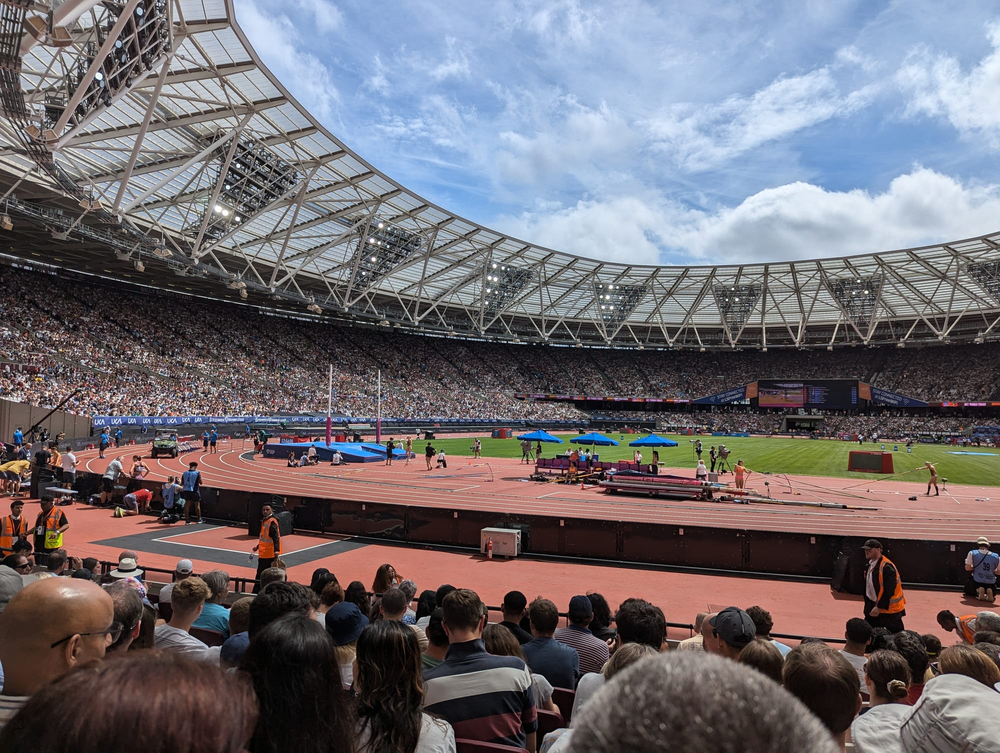

London Stadium doesn't try to be Wembley. It sits inside a public park rather than at the end of a purpose-built approach road, it calls itself a "green stadium" and means it, and on any given weekend it might be hosting a Championship match, a stadium tour, or nothing at all. Getting there is less about queue management and more about knowing which of Stratford's seven different train services to actually use.

> 💡 **The Short Version:** Come by train to **Stratford** — seven services meet there and it's **15 to 20 minutes'** walk, most of it through **Westfield Stratford City**. Don't confuse it with **Stratford International**, a separate station nearby with no Eurostar. If you're driving, **there is almost nowhere to park**: the stadium has only **229 spaces in total**, nearly all reserved for season-ticket holders, and West Ham's own advice is to leave the car at home. Newham's event-day parking zone covers **five residential areas from 8am to 9pm**, with a standard **£160 penalty** (£80 if paid within 14 days) for parking without a permit. Going home, there's no Wembley-style colour-coded queue system — the stadium runs its own **hold-and-release** crowd management instead, usually clear **within an hour**. On **Friday and Saturday nights the Central and Jubilee lines run all night**, both calling at Stratford.

---

## Getting there by train

| Station | Lines | Walk to the stadium | Best for |
| --- | --- | --- | --- |
| **Stratford** | **Central, Jubilee**, DLR, Elizabeth line, London Overground (Mildmay), Greater Anglia, c2c | **15–20 minutes**, through Westfield | Everyone — the default, and the one the stadium's own site recommends |
| **Stratford International** | DLR, **Southeastern** (domestic high speed) | **15–20 minutes** | A separate station, easily mistaken for Stratford — no faster and no closer |
| **Pudding Mill Lane** | **DLR** only | **10 minutes**, south side | Skipping Westfield; one stop from Stratford, no ticket barriers |
| **Hackney Wick** | London Overground (Mildmay) | **10 minutes**, northwest side | The other way to skip Westfield; one stop from Stratford |

### Stratford: the default, and one of the busiest interchanges in London

Central and Jubilee lines, the DLR, the Elizabeth line, London Overground's Mildmay line, and National Rail services from Greater Anglia and c2c all meet here — West Ham's own count is 58 trains an hour through the station. It has 17 platforms, step-free access to all of them, and staff on duty from first train to last.

The walk to the stadium is where the sources disagree slightly: London Stadium's own site says **15 minutes**; West Ham's official access statement says **20**. Either way, allow 20, because almost all of it runs through **Westfield Stratford City** — the signposted route from the station goes through the shopping centre, not around it.

> ⚠️ **Don't confuse it with Stratford International.** It's a different station on a different set of lines (DLR and Southeastern's domestic high-speed service to Kent, via St Pancras) — there is no Eurostar here, despite the name. It's roughly the same walking distance from the stadium as Stratford proper, so turning up there isn't a disaster, but it won't save you any time either.

### Pudding Mill Lane and Hackney Wick: the quieter approaches

Two stations that don't get mentioned as often, both one stop from Stratford and both a genuinely shorter walk. **Pudding Mill Lane**, DLR only, sits to the south of the stadium and is about **10 minutes** on foot — it has no ticket barriers, but no wheelchair to borrow either. **Hackney Wick**, on the Overground's Mildmay line, is to the northwest and also about **10 minutes** away, with the same trade-off on wheelchairs. Neither route goes anywhere near Westfield.

### Buses

Routes **25** (a 24-hour service), **86, 104, 108, 158, 241, 257, 262, 276, 308, 339, 425, 473** and **D8** all serve the area around Stratford and Stratford City, with night buses **N8** and **N86** continuing after the Tube stops. Stratford and Stratford City bus stations both sit close to Stratford station itself.

### By bike

The London Cycle Superhighway runs from Aldgate to Stratford City, and Santander Cycles has eight docking stations across Queen Elizabeth Olympic Park, the nearest at the Copper Box Arena, the London Aquatics Centre, Monier Road, The Podium and Stratford station itself.

---

## Driving: there's almost nowhere to put the car

This is the biggest difference from Wembley. London Stadium doesn't have a network of car parks built around it — it has **229 parking spaces in total**, and most of those are tied up in season-ticket allocations. West Ham calls it a "designated green stadium" and its own advice is blunt: come by public transport. The club's own getting-here page names the closest car park to the ground as the one at **Stratford Westfield** — that is, Westfield Stratford City's own car park, not anything the stadium runs itself.

**On the street, an event-day parking zone applies.** Newham Council's rules cover five Residential Parking Zones — Stratford Central, Stratford North West, Stratford South West, Stratford South East and West Ham — and are triggered by any West Ham match or other event at London Stadium or Queen Elizabeth Olympic Park.

| | |
| --- | --- |
| **Zones affected** | Stratford Central, Stratford North West, Stratford South West, Stratford South East, West Ham |
| **When** | 8am to 9pm on event days |
| **Can a visitor park on the street?** | Only in a shared-use or cashless pay-and-display bay, or with a visitor permit issued by a resident of the zone |
| **Penalty** | Newham's standard rate: **£160**, reduced to **£80** if paid within 14 days (the council does not publish a higher, event-specific figure) |

Unlike Brent's scheme around Wembley, Newham's own page doesn't describe a single, named "exclusion zone" radius — it lists the affected residential zones directly. If in doubt, Newham's site lets you check whether a specific address is inside one of the five.

**ULEZ applies across all of Greater London**, Newham included, at £12.50 a day, 24 hours. Stratford station is in fare zone 2–3.

---

Powered by <a target="_blank" rel="sponsored" href="https://www.getyourguide.com/london-l57/">GetYourGuide</a>

## Where to actually park

There's no equivalent here of Wembley's five colour-coded, pre-bookable car parks. What actually exists:

**Gold Top, the accessible car park.** On the south Loop Road at Bridge 3, with 55 Blue Badge spaces out of the stadium's 229 total. Home supporters get access through a season-ticket waiting list — it isn't a product a one-off visitor can book. Six spaces are reserved for visiting supporters, arranged in advance through their own club. It opens three hours before kick-off and closes during the match at the 80th minute, reopening roughly 20–30 minutes after the final whistle once the safety officer confirms the roads are clear.

**Westfield Stratford City's car park.** The stadium's own site names this as the nearest option to the ground for everyone else. Check Westfield's own site for its current price and opening hours before you rely on it for an event.

If you're driving, the advice is the same as West Ham's own: don't, unless you already have a season-ticket space.

---

## Getting home

### Hold-and-release, not colour-coded queues

There's no Wembley-style system of train operators running separate colour-coded queues for different destinations. Instead, London Stadium operates its own "managed exit/egress crowd management system" — stewards use hold-and-release points at pinch points on the bridges off the stadium island to manage the flow, rather than everyone leaving at once. By the stadium's own account, egress is "generally complete within an hour." On an ordinary, non-event evening, the walk back to Stratford station takes 20–25 minutes; expect it to feel longer with a crowd around you, even with the hold-and-release points working as intended.

Road closures around the stadium go in from **three hours before kick-off**, and non-ticket-holders can't get onto the stadium island itself on an event day.

### The Central and Jubilee lines run all night

On **Friday and Saturday nights**, both lines run 24 hours through Stratford — the Jubilee line actually terminates there, so waiting out a Friday or Saturday crowd for half an hour and then walking onto a train is a genuine option, the way it is at Wembley Park.

### Last trains on an ordinary night

On a Monday to Thursday night, the last central London-bound trains on most lines leave around 00:30–01:00; on Sunday, last trains run before midnight, earlier than the rest of the week. Check TfL's own journey planner or National Rail for your specific date and line before relying on a last train after a late finish, since engineering work can change either.

### Car parks and the accessible shuttle

The Gold Top accessible car park reopens roughly 20–30 minutes after the final whistle, once the roads are confirmed clear. West Ham also runs 18 complimentary accessible shuttle buses on matchdays, connecting Stratford Platform 13 (at the Jubilee line entrance) and Stratford International with a drop-off at the Stadium Store café — but this is a registered service for supporters with accessibility requirements (season-ticket holders, their personal assistants, senior citizens with mobility issues, temporary disabilities, and pregnant supporters), not a general shuttle for anyone who'd rather not walk. It starts two hours before kick-off and keeps running for 90 minutes after the final whistle.

---

## Match days, athletics and a very different kind of event

This venue's event mix is unusually wide, and the club's own paperwork treats them differently. **Football** is the frequent case — a roughly two-hour window with the hold-and-release egress described above, and away supporters have their own turnstile allocation and up to 19 wheelchair-accessible spaces in the visitors' section. The next home fixture as this was written is a Carabao Cup tie against Fulham on 15 September 2026.

**Athletics** happens once a year rather than most weekends: the Novuna London Athletics Meet returned to London Stadium on **18 July 2026**, and has run annually since the venue's post-Olympics conversion. It's a different shape of day — a single long afternoon-into-evening session rather than a 90-minute match.

*A full house for the Novuna London Athletics Meet — the same bowl a West Ham crowd fills on a match day.*

**Concerts** are the least frequent case of all. As of September 2026, London Stadium has no music events on sale for the rest of the year — the next confirmed one, Fontaines D.C., is booked for 2027. If a concert is announced for your dates, treat the general transport advice in this guide as the starting point and check the venue's own site for that specific event's doors and curfew times.

**Stadium tours** run on non-event days, covering the pitch and dressing rooms, and are a way to see London Stadium without the crowds at all.

---

## Where to stay

London Stadium's own site recommends the **Adagio Original London Stratford** aparthotel, two minutes from Stratford's DLR platforms and about ten minutes from the stadium, and currently offers a 10% discount with the promo code **LS10BB** booked directly through Adagio.

This site already covers the area's other main options in detail — **[Premier Inn London Stratford](hotel:premier-inn-stratford)**, inside the Westfield complex and the closest hotel of any kind to Queen Elizabeth Olympic Park, and **[Hyatt Regency London Stratford](hotel:hyatt-regency-stratford)**, also built into Westfield — in our [Stratford area guide](/articles/stratford-area-guide/) and our [where to stay in Shoreditch](/articles/where-to-stay-shoreditch/) and [aparthotels](/articles/aparthotels-london/) guides. If you'd rather stay central and travel out, our [best areas to stay in London](/articles/best-areas-to-stay-in-london/) guide covers the Central, Jubilee and Elizabeth line neighbourhoods that put you within one change of Stratford.

---

Powered by <a target="_blank" rel="sponsored" href="https://www.getyourguide.com/london-l57/">GetYourGuide</a>

## The walk through Queen Elizabeth Olympic Park

The stadium sits on what West Ham's own paperwork calls "the stadium island" — reached across the park's waterways by five numbered bridges, plus a road, Marshgate Lane, for Bridge 4. Ten turnstile blocks, lettered A to K (skipping I), ring the island, each signposted from a distance by large illuminated totem poles showing the letter and the transport destinations beyond it.

The route from both Stratford and Stratford International stations is signposted the same way: through Westfield Stratford City, then across the park. Rest areas with arm-rests are spaced roughly every 50 metres along the route, including on the bridges themselves — useful to know if the walk is a struggle, since once you're through the search tents there's no seating outside the stadium at all, only the seats inside it.

The stadium uses **what3words** for its own precise locations — the security reception, each numbered bridge, the accessible lifts and the ticket office each have their own three-word address, which is a genuinely useful way to describe exactly where you are to someone trying to find you in a crowd of tens of thousands.

Stadium tours, run on non-event days, are the other reason to make the walk when there's nothing on: our [Stratford area guide](/articles/stratford-area-guide/) covers the wider park, including the ArcelorMittal Orbit and its slide, and the Aquatics Centre next door.

---

## Eating and drinking

**Inside the stadium**, kiosks on the lower-tier concourse sell hot food (pies, burgers), sandwiches, wraps and salads, hot drinks and soft drinks, with vegetarian options at every kiosk and water fountains around the concourse. The **Stadium Store café**, run as the West Ham United Coffee Co. on the ground floor of the flagship store next to the stadium, does coffee, sandwiches, wraps, pastries and cakes — but the club's own access statement warns that the store's first floor "becomes extremely busy" on matchdays, so it's better used before or well after the crowd arrives than in the rush beforehand.

**There's no equivalent here of Wembley's Boxpark** — nowhere near London Stadium that closes to the public and turns into a ticketed fan zone on event days.

**Westfield Stratford City**, between the station and the park, keeps its normal hours on event days — roughly 10am to 9pm Monday to Friday, 9am to 9pm on Saturday, and midday to 6pm on Sunday, with around 250 shops and restaurants between the station and the stadium. **Stratford town centre**, a few minutes east of the station and predating the Olympic redevelopment, is a quieter, cheaper alternative if Westfield feels too much like an airport terminal — see our [Stratford area guide](/articles/stratford-area-guide/) for both in more detail.

---

## Drinking on event days

At Association Football matches, alcohol may not be consumed in view of the pitch, and none of it may leave the stadium island once you've bought it. That's West Ham's own rule, stated on the club's safety and security page.

---

## The bag problem

London Stadium operates a **100% search policy**: every supporter and their belongings are checked on the way in. The rule on size is simple — **no bag larger than A4** — and it's enforced the same way West Ham's own official 2026/27 access statement and the stadium's own safety page both describe it.

> ⚠️ **There is no left luggage facility on site at all.** Unlike Wembley, where the arena at least points you to a third-party storage service, London Stadium's own guidance is simply not to bring a bag you don't need. If you need to bring something larger for a medical reason, West Ham's accessibility team (accessibility@westhamunited.co.uk, 0333 030 0174) will advise in advance — but there's no general workaround for anyone else, beyond leaving the bag somewhere before you arrive; see our [luggage storage guide](/articles/luggage-storage-london/) for the nearest options.

---

## Step-free access

London Stadium is, on the evidence of its own published access statement, thoroughly built for step-free use — considerably more so, on paper, than the transport getting you there.

**Getting to the ground:** all of Stratford's 17 platforms are step-free with lifts, as are Stratford International's platforms; Pudding Mill Lane and Hackney Wick both have step-free access but no wheelchairs to borrow. A complimentary **accessible shuttle bus** — 18 vehicles on a home matchday — runs between Stratford Platform 13, Stratford International and a drop-off at the Stadium Store café, for supporters registered with the club's accessibility scheme (season-ticket holders and their personal assistants, senior citizens with mobility issues, supporters with a temporary disability, and pregnant supporters), starting two hours before kick-off and running for 90 minutes after the final whistle.

**Getting onto the island:** level, step-free access across all five bridges, plus a lift between ground and podium level at Bridge 4, reached via Marshgate Lane.

**Inside the stadium:** 261 wheelchair-accessible viewing spaces across the Bobby Moore (North), Billy Bonds (East), Sir Trevor Brooking (South) and West stands, plus 12 in the Club London hospitality tier, with a personal assistant ticket provided automatically for every wheelchair user. Nine lifts serve the upper tiers. There are three adult Changing Places facilities, gender-neutral accessible toilets with RADAR locks on every level, a **Sensory Room** (accessed via Turnstile B, pre-booked through the accessibility team) for supporters who find the noise and crowds overwhelming, and two Multi-Faith Rooms. Audio commentary is available for blind and partially sighted supporters in all four stands, and assistance dogs are welcome, with a hygiene area at Bridge 4.

**On matchday**, 41 Disabled Supporter Assistants (pink tabards) and 27 Supporter Liaison Officers are on duty, and every entry bridge has a dedicated accessible search lane, open until 20 minutes before kick-off.

**Accessible parking:** the Gold Top car park's 55 Blue Badge spaces are allocated to home season-ticket holders through a waiting list, with six spaces held for visiting supporters via their own club — there's no way to book one for a single visit without a season ticket. Dedicated Blue Badge bays also exist on the street nearby.

**Contact:** West Ham's accessibility team is on **0333 030 0174** or **accessibility@westhamunited.co.uk**.

---

Powered by <a target="_blank" rel="sponsored" href="https://www.getyourguide.com/london-l57/">GetYourGuide</a>

## Small print that catches people out

- **Sat-nav:** use **E20 2ST** for London Stadium and the wider Queen Elizabeth Olympic Park.
- **The stadium is "island" by design.** Non-ticket-holders cannot access the stadium island itself from three hours before kick-off on an event day, even to pass through.
- **ULEZ covers all of Newham**, at £12.50 a day, 24 hours — Stratford is well inside it. Congestion Charge does not reach this far east.
- **Fare zone:** Stratford station sits on the boundary of zones 2 and 3.

---

## Continue planning your London trip

- 🏉 **[Twickenham Stadium Travel Guide](/articles/twickenham-stadium-travel-guide/)** — London's biggest rugby crowd, and the last train out at 00:11
- ⚽ **[Premier League Tickets in London](/articles/premier-league-tickets-london/)** — West Ham are in the Championship this season, which makes this a far easier ticket than a top-flight one
- 🚇 **[How to Use the London Underground](/articles/how-to-use-the-london-underground/)**
- 💷 **[London Transport Costs and Fares](/articles/london-public-transport-costs-and-fares/)**
- 🚌 **[How to Use London Buses and Trams](/articles/how-to-use-london-buses-and-trams/)**
- 🏟️ **[Wembley Stadium and OVO Arena: a comparable venue guide](/articles/wembley-stadium-arena-guide/)**
- 🛏️ **[Best Areas to Stay in London](/articles/best-areas-to-stay-in-london/)**
- 🛌 **[Where to Stay in Shoreditch](/articles/where-to-stay-shoreditch/)**
- 🎡 **[Stratford Area Guide](/articles/stratford-area-guide/)**
- 💰 **[Money in London: Cash, Cards and ATMs](/articles/money-in-london/)** — including which London venues take no cash at all

---

*Figures come from London Stadium's and West Ham United's own sites, West Ham's official 2026/27 Access Statement, Newham Council and Transport for London, checked the week of 13 September 2026. Where two official sources gave different numbers — the walk from Stratford station, chief among them — we've said so rather than picked one. Parking and event details are set match by match, so check the operators' own sites for your date.*
