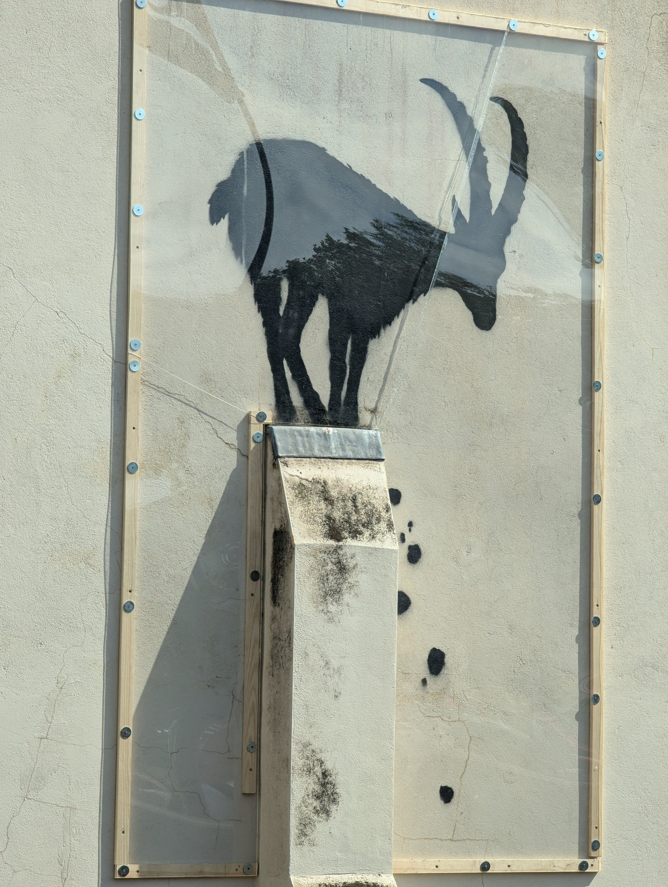
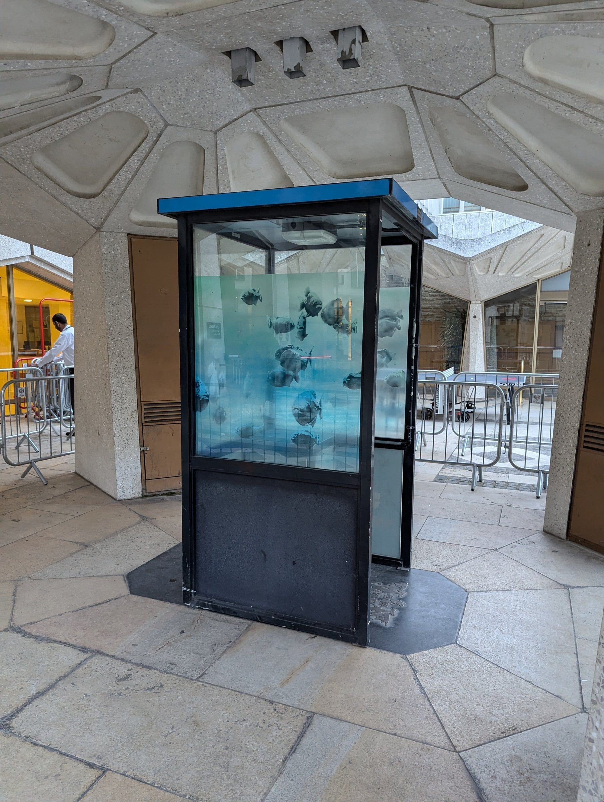
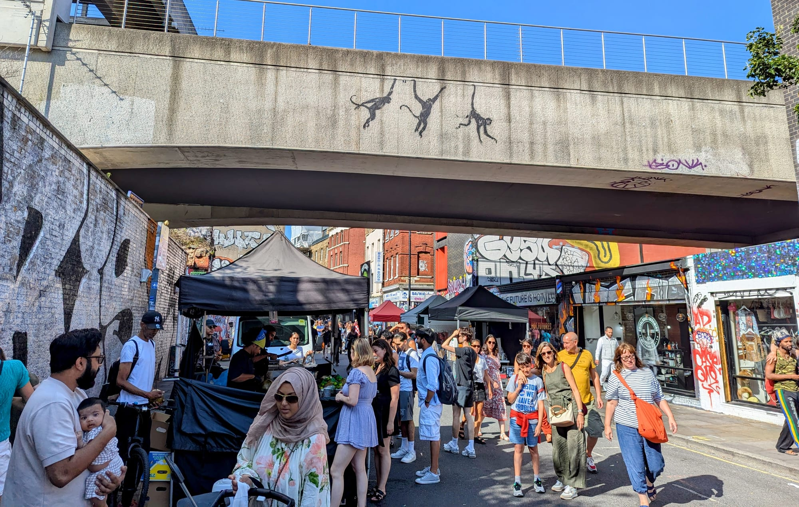

Most Banksy maps of London send you to walls where the work no longer exists. Pieces get removed, painted over, stolen, sold with the wall attached, or covered in perspex that makes them impossible to photograph.

This guide **says which are gone**, which is the single most useful thing a street art guide can do.

**Twelve Banksys are still viewable as originals in situ**: the Cannon Street rat, the two Basquiat tributes, the two Foundry pieces now on the front of art'otel Hoxton, the Bermondsey fishing boy, the Chelsea elephants, the Walthamstow pelicans, the Charlton rhino, the Finsbury Park tree, the Stargazing Children on New Oxford Street, and Blind Patriotism at Waterloo Place. Everything else you will read about has been removed, stolen, boarded over, scrubbed off or replaced with a replica.

> 💡 **The Short Version:** The **Cannon Street rat** is one of the earliest survivors. Two **Basquiat tributes** sit in one tunnel by the Barbican. The **2024 animal series** left work across the city, though several pieces vanished within days. **Leake Street** is legal graffiti under Waterloo and repainted constantly. And **Shoreditch** is still the densest area.

> 📘 **How we choose these (editorial note)**
> No paid placements. These are drawn from a wide spread of sources rather than any single list - the food and travel press, the big listings sites, independent blogs and specialists, video, and what Londoners recommend themselves - and cross-referenced against each other. Street art is impermanent by nature. Everything here was checked in August 2026 and we have flagged what had already been removed — but a piece can disappear the week after publication, so treat any single work as provisional.

## Where they are

| If you are near… | What to see |
| --- | --- |
| **The City** | Cannon Street rat, two Basquiat tributes |
| **Shoreditch & Brick Lane** | The densest concentration in London, changing constantly — plus the two Foundry Banksys on art'otel Hoxton |
| **Waterloo** | Leake Street tunnel — legal, and repainted continuously |
| **Chelsea** | Banksy's elephants |
| **Walthamstow** | Banksy's pelicans, the best-preserved of the 2024 series |
| **Charlton** | Banksy's rhinoceros |
| **Bermondsey** | Banksy's fishing boy, on the Thames Path |
| **Trafalgar Square** | Blind Patriotism, the 2026 statue |
| **Hackney Wick** | Large-scale murals along the canal |
| **Brixton** | The Bowie mural, protected and locally listed |

---

## Banksy, and what survives

### Cannon Street Rat, City of London

*Free · still in place*

One of Banksy's **earliest surviving London rats**, on the railway bridge over Cannon Street — a reminder of how long he has been working here.

### The Basquiat pair, City of London

*Free · still in place*

Painted in **2017 to coincide with a Basquiat exhibition at the Barbican**: a ferris wheel reworking Basquiat's crown motif, and a police officer frisking a crowned figure. Both in the same tunnel, which makes them the easiest pair to see together.

### The Foundry pair, Shoreditch

*Free · still in place*

Two stencils from **2004** — a giant rat carrying a knife and fork, and a television thrown through a window — painted on a wall behind **The Foundry**, the alt-culture bar that stood on the Old Street roundabout. They were boarded over for around twelve years when the bar closed, and were salvaged during demolition.

They are now mounted on the front of **art'otel London Hoxton**, which was built on the site, above the entrance on the Great Eastern Street corner. **Free, outdoors, and visible from the pavement** — you do not need to go into the hotel.

### Fishing Boy, Bermondsey

*Free · Thames Path*

A 2008 piece right on the river path, showing a boy fishing.

### Elephants, Chelsea

*Free*

Two elephant heads stencilled reaching toward one another from **a pair of bricked-up windows**.

---

## The 2024 animal series: what is left

Banksy put up nine animal works across London over nine days in August 2024. **Six are gone** — removed, stolen, dismantled or swapped for a copy. It is routinely written up as a walkable trail. It is not one.

*The goat in place near Kew Bridge in August 2024, already under protective perspex. It was cut out of the wall six months later and has not reappeared.*

*The piranhas at Guildhall Yard, where the City of London Corporation put the sentry box on public view behind barriers after relocating it from its original spot on Ludgate Hill. It has since gone into storage ahead of permanent display at the new London Museum.*

*The monkeys on the Brick Lane railway bridge, photographed on 11 August 2024, days after they appeared. Transport for London removed them that December.*

| The work | Where | What is there now |
| --- | --- | --- |
| **Elephants** | Edith Grove, Chelsea | **Still there.** Defaced and since repaired |
| **Pelicans** | Bonners Fish Bar, Walthamstow | **Still there**, and the best preserved of the nine |
| **Rhinoceros** | Westmoor Street, Charlton | **Partly there.** The wall stencil survives; the car it was mounting has gone |
| Goat | Kew Green | Cut out and removed, February 2025, by the building's owner "for protection during building works". Not returned as of January 2026, when the bare wall was found daubed with paint |
| Monkeys | Brick Lane railway bridge | Removed by Transport for London, December 2024 |
| Wolf | Rye Lane, Peckham | **Stolen** within about an hour. No arrests |
| Big cat | Edgware Road, Cricklewood | Dismantled over billboard safety concerns |
| Piranhas | Police sentry box, Ludgate Hill | In storage — **free display at the London Museum from 28 November 2026** |
| Gorilla | London Zoo shutter, Regent's Park | Original removed. What is on the shutter is a replica |

**Go to Chelsea, Walthamstow and Charlton.** The other six are a wasted journey.

---

Powered by <a target="_blank" rel="sponsored" href="https://www.getyourguide.com/london-l57/">GetYourGuide</a>

## Later work, and what happened to it

### Blind Patriotism, Waterloo Place

*Free · April 2026 · in place, behind barriers*

The newest Banksy in London and the easiest to see. A suited figure stepping down off his plinth, holding a flag that blows back and covers his own face. It went up overnight on **29 April 2026** near Trafalgar Square and he confirmed it three days later.

**Westminster City Council has spent almost £60,000 on it** and is still deciding whether to make it permanent. It stands behind barriers, in the open, free to walk up to.

### The Finsbury Park tree

*Free · March 2024 · damaged but visible*

Green paint sprayed across a wall behind a **pollarded cherry tree**, so the wall reads as the foliage the tree has lost. It was defaced with white paint within days; Islington Council fenced it, installed CCTV and sent patrols.

Still there, still fenced, still damaged. It is on Hornsey Road in **Islington** — a lot of guides put it in Hackney.

### Stargazing Children — two versions

*Free · December 2025 · one visible, one boarded over*

Two identical murals of children lying on their backs, one pointing upward, widely read as a comment on the housing crisis. Often listed with the animal series; they came more than a year later.

* **New Oxford Street**, in front of Centre Point — behind transparent protection, and damaged, but visible.
* **Queen's Mews, Bayswater** — **boarded over.** It physically survives and you cannot see it.

### Royal Courts of Justice, the Strand

> ⚠️ **Gone.** A judge striking a cowering protester, painted on the **Grade I listed** Royal Courts of Justice on 8 September 2025 and scrubbed off within two days because the building is heritage-protected. **Over £85,000 has been spent removing it** and a faded trace is still there behind screens.

> **Girl with Balloon is not where people look for it, and has not been for twenty years.** The original stencil was under **Waterloo Bridge** in 2002, with the words "There is always hope" beside it, and the council painted over it. The famous self-shredding at auction in 2018 was a **framed canvas** — a different object entirely. There is nothing to see at Waterloo.

---

## Where street art actually lives

Banksy is a fraction of it, and the rest is more interesting.

### Leake Street, Waterloo

*Free · legal · always changing*

A tunnel under Waterloo station where graffiti is **legal and repainted continuously**. The only place in London where you can reliably watch work being made rather than just look at it. There are bars and a bowling alley in the arches off it.

> **The rules, which are published and almost never mentioned.** Painting here is not merely tolerated, it is actively encouraged, and you do not need permission. But discriminatory content and **political messaging** are both removed, as is unauthorised advertising. Keep noise down after 10pm. Organised events, filming and photoshoots need clearing in advance. And anything you paint may be painted over within days — the tunnel is managed by Platform4, and that is the deal.
>
> Do not come looking for a Banksy. He ran the Cans Festival here in 2008, but with constant repainting it should be assumed none of that work survives.

### Shoreditch and Brick Lane

*Free*

The densest concentration in London, and it changes month to month. Rivington Street, Redchurch Street and the Brick Lane side streets are the core.

### Hackney Wick

*Free*

Large-scale murals along the canal towpath, and a working artists' community that keeps producing them.

### Camden

*Free*

The Stables Market walls and the canal bridges, plus the Amy Winehouse mural on Camden Road.

---

### Brixton

*Free · the Bowie mural, Tunstall Road*

James Cochran's **Aladdin Sane portrait** on the side of Morleys, painted in 2013 and now a permanent shrine — flowers appear against it every January.

It is behind protective glass and has been **locally listed by Lambeth Council since 2016**, so it cannot be altered or demolished without planning permission. Almost uniquely for London street art, this one is not going anywhere.

### Walthamstow

*Free · Wood Street Walls*

One of the real hubs of large-scale London street art, built up over a decade by the **Wood Street Walls** project, which has put dozens of community-backed murals on gable ends across E17. It also has the best-surviving Banksy in the city.

### Dulwich

*Free · the Dulwich Outdoor Gallery*

The quiet alternative to east London, and much the strangest idea. International street artists were invited to reinterpret **Baroque Old Masters from the Dulwich Picture Gallery collection**, and the results are scattered through ordinary residential streets. Founded by the late Ingrid Beazley.

### Croydon

*Free · RISE Gallery and the Croydon Collection*

Genuinely underrated and rarely walked by visitors. RISE Gallery, founded in 2014, brokered most of it — negotiating between artists and building owners to get work up. **The Croydon Collection** is the umbrella name for the borough's permanent murals.

### Penge

*Free · Penge High Street*

Dozens of murals along and around the high street, coordinated locally over several years.

---

## Where to buy it

There are two completely separate markets here and they have almost nothing to do with each other.

**In east London, prints by working street artists cost less than a nice dinner.** These are galleries and print studios where the artists are alive, the editions are current, and you can walk in off the street and take something home the same day.

**In Mayfair, Banksy screenprints are a secondary-market asset** sold by appointment, priced on enquiry, and bought by people who are not thinking about their hallway. Both are legitimate. Only one of them is a souvenir.

### The east London print galleries

| Gallery | Where | Open | What it is |
| --- | --- | --- | --- |
| **Nelly Duff** | 156 Columbia Road E2 7RG | Wed–Fri 9am–6pm, Sat 11am–6pm, Sun 9am–5pm; Mon–Tue by appointment | Print gallery on the flower-market street, with its own framing service and gift vouchers |
| **Jealous Gallery** | 53 Curtain Road, Shoreditch EC2A 3PT | Mon–Sat 10am–6pm, closed bank holidays | Gallery and screenprint publisher. The **print studio at 2a Luke Street EC2A 4NT** is where the work is actually made, open Mon–Sat 9.30am–6pm |
| **StolenSpace** | 17 Osborn Street E1 6TD | Check before travelling | The long-standing Brick Lane-end street art gallery |
| **Pure Evil** | 108 Leonard Street EC2A 4XS | **Thu–Sat 10am–6pm, Wednesday by appointment only** | Artist-run, and the one most likely to have the artist in it |

**Nelly Duff is the one to do on a Sunday**, because Columbia Road Flower Market is happening outside the door and the gallery opens at 9am to catch it. It is the only gallery here with useful Sunday hours.

> ⚠️ **StolenSpace shows its prices before VAT.** Their own site says so in the footer. Add 20% to anything you see there before deciding what you can afford — it is the single most expensive assumption to get wrong on this page.

### If it is a Banksy you want

**You are in a different price bracket and a different postcode.** Banksy has not sold new work through a London gallery since Pictures on Walls wound up, so everything on the market is resale.

* **Maddox Gallery** — Maddox Street W1S 2QE and Shepherd Market W1J 7QE. Stocks signed Banksy screenprints alongside Hockney and Warhol. Prices are **on enquiry**, which is itself the answer.
* **Grove Gallery** — Berkeley Square House, Berkeley Square W1J 6BD. Same model, same names.
* **Quantus Gallery** — Shoreditch, and the one that actually publishes figures. A **Di-Faced Tenner is £2,450**, which is the cheapest genuine Banksy object you are likely to see priced openly.

> 💡 **The Di-Faced Tenner is the sane entry point.** It is a printed banknote from the 2004 stunt rather than a signed edition, so it costs low thousands instead of tens of thousands, and it is unambiguously the real thing. Anything cheaper claiming to be Banksy is a poster.

> ⚠️ **Authentication matters more here than anywhere else in art.** Banksy's own body, Pest Control, is the only issuer of certificates, and unauthenticated work is effectively unsaleable. Never buy a Banksy on the strength of a gallery's word alone — ask for the Pest Control paperwork before money moves.

### Gift shops rather than galleries

**Jealous and Nelly Duff both sell at gift-shop prices as well as gallery ones** — small unframed editions, cards and prints in the tens rather than the hundreds — which makes them the realistic answer to "I want to take some London street art home". Nelly Duff also does framing, so you can walk out with something ready to hang.

**Leake Street has no shop**, which surprises people. The tunnel is legal and constantly repainted but entirely uncommercial, so the spray-paint shops around Shoreditch and Brick Lane are where the artists themselves buy.

---

## What it costs

**Nothing.** This is the most genuinely free thing to do in London, and one of the very few that changes week to week.

* **Walk it yourself.** Shoreditch, Hackney Wick, Camden, Brixton, Croydon and Penge all reward an aimless hour, and everything in this guide is on a public street.
* **Guided tours** run roughly £15–£30 and are worth it once, because the good guides know which pieces are painted over what, and who fell out with whom. The free walking tours are tip-based rather than actually free.
* **Leake Street tunnel** under Waterloo is legal, free, open all hours, and repainted constantly — the only place in London you can watch it being made.
* **Buying it is a different question entirely.** A print by a working street artist from a Shoreditch gallery runs from the low tens to a few hundred pounds. A resale Banksy starts around £2,450 for a Di-Faced Tenner and climbs steeply from there. See **Where to buy it** above.
* **Nothing here is permanent.** Everything in this guide was checked in August 2026 and a piece can go the week after publication, which is the nature of the form rather than a flaw in it.

---

Powered by <a target="_blank" rel="sponsored" href="https://www.getyourguide.com/london-l57/">GetYourGuide</a>

## What to know

* **All of it is free.** It is on the outside of buildings.
* **Pieces disappear.** Check recent photographs before making a special trip for one specific work.
* **Perspex covers** protect several Banksys and make them very hard to photograph without reflections. Overcast days are better.
* **Leake Street is the reliable one** because it is legal and constantly renewed — you will always find something.
* **Shoreditch changes fastest.** A guided tour is worth it there specifically, because the commentary is about what is new.
* **Respect residents.** Much of this is on the side of people's homes and businesses.
* **The London Mural Festival runs every four years**, not annually — 2020, 2024, and next in 2028. There was no 2022 edition and there is no 2026 one, whatever some listings say.

---

## Continue planning your London trip

- 🎬 **[London Filming Locations](/articles/london-filming-locations/)**
- 🎪 **[Free Things to Do in London](/free/)**
- 🎨 **[Shoreditch Area Guide](/articles/shoreditch-area-guide/)**
- 🎭 **[Camden Area Guide](/articles/camden-area-guide/)**
- 🏙️ **[City of London Area Guide](/articles/city-of-london-area-guide/)**
- 👀 **[The Best Views in London](/articles/best-views-london/)**
