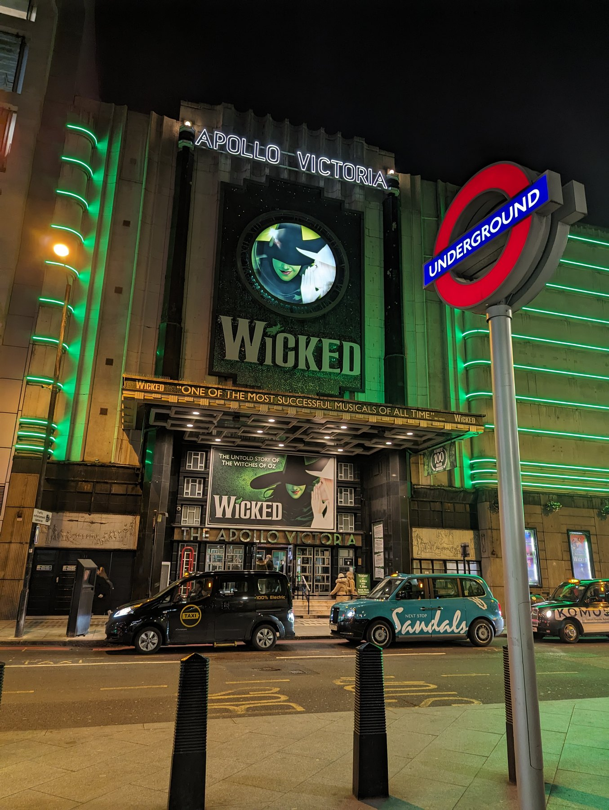
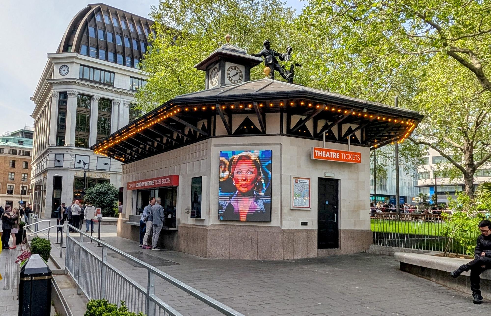
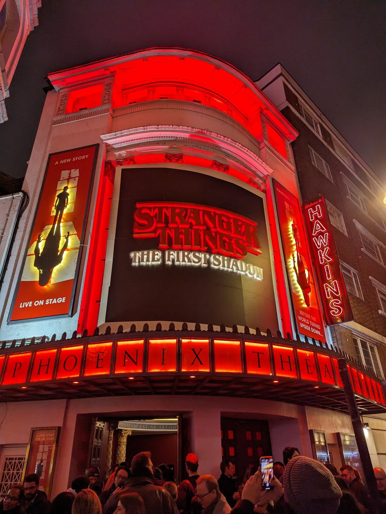

London has more theatre than any city on earth, and that is exactly the problem. Two hundred-odd shows are playing tonight, prices run from £10 to £250 for the same evening, and most visitors end up booking whatever they have already heard of, at close to the highest price it sells for.

This guide is about the two decisions that actually matter: **what to see**, and **how to pay less for it**.

> 💡 **The Short Version:** Decide what kind of evening you want before you look at prices. Then: **use TKTS, either online or at the Leicester Square booth**, **go midweek and never on a Saturday night**, and **think about where you are sitting** as much as what you are seeing. Day seats, rush tickets and lotteries are worth a try if you like a gamble. Never buy from someone on the street.

---

## Deciding what to see

Start from what you actually want out of the evening rather than from a list of titles.

**For spectacle**, you want a big West End musical. These are the shows built for scale — full orchestras, large casts, and theatres seating two thousand or more. They are also the most expensive, the most heavily marketed, and the ones you have already heard of.

*The Apollo Victoria, one of the largest houses in London at over 2,300 seats. The long-running musicals take the biggest theatres, and they are the easiest tickets to find and the hardest to find cheaply.*

**For the writing and the acting**, look outside the West End. The National Theatre, the Old Vic, the Bridge, the Almeida, the Donmar and the Young Vic consistently stage the best new work in the country, and a lot of what later appears on Shaftesbury Avenue started at one of them — at a fraction of the eventual price.

**For dance**, it is Sadler's Wells in Islington, which is Britain's leading dance house and programmes everything from ballet to hip hop. For opera and ballet, the London Coliseum and the Royal Opera House.

**With children**, the long-running family musicals are the safe choice, but check the running time and whether there is an interval before you commit a seven-year-old to three hours.

**If you want something genuinely unpredictable**, the fringe is dozens of small rooms, many above pubs, most seating under a hundred. Tickets often cost less than a cinema seat. The work is uneven and the hit rate is far better than you would expect.

**A note on the labels**, because they mislead people. **"West End" is a classification, not an address, and not a quality rating.** Most West End theatres do sit in the theatre district around Shaftesbury Avenue, the Strand and Drury Lane — but not all of them. The Apollo Victoria pictured above is one of the largest West End houses in London and it is in Victoria, nowhere near it. **Off-West End** does not mean smaller or lesser: several of those venues seat more than West End theatres do. **Fringe** means genuinely small rooms. What separates the three is the scale and nature of the production, not the postcode.

---

## How to pay less

Almost nobody needs to pay the top price, and one route matters more than the rest.

### Start with TKTS, online or at the booth

**TKTS is the single most useful thing on this page, and it works two ways.** It is run by Official London Theatre, part of the Society of London Theatre — the theatre industry's own body — and it sells discounted seats for a wide spread of shows.

**Online**, at [officiallondontheatre.com](https://officiallondontheatre.com/todays-tickets), you can see what is discounted and book before you travel, or from your hotel that morning.

**In person**, the TKTS booth sits in the middle of Leicester Square, with screens listing what is available and staff who will tell you what is actually worth seeing. **The booth carries the same deals as the website**, so use whichever suits — the booth has the advantage of someone to ask, the website the advantage of not queueing.

*The official booth in Leicester Square. Note the wording: "Official London Theatre Ticket Booth". Nothing else in that square is this.*

> ⚠️ **It is the only booth in Leicester Square that is what it claims to be.** The surrounding shops with similar signage are unrelated ticket agencies, and the people selling on the street are not a bargain. Buy at the booth itself, at a theatre's own box office, or from an official agency — nowhere else.

**Go with a list, not a single show.** The point of TKTS is that you take what is discounted today. Arrive — or log on — with three or four things you would happily see, and you will almost always get one of them cheaply.

### Go midweek, and never Saturday

**The same seat, for the same show, costs materially more on a Saturday night than on a Tuesday.** This is the easiest saving available and it costs you nothing but flexibility.

- **Best value:** Tuesday, Wednesday and Thursday evenings
- **Also good:** midweek matinees, which are the quietest houses of the week
- **Avoid:** **Saturday evening**, which is the most expensive slot in London theatre, and Friday nights after it

**Season matters too.** January and February are the cheapest months of the year, when everyone has spent their money at Christmas. The summer holidays are the busiest and the most expensive.

### The lower-cost routes, briefly

These are all real and all worth trying, but they take planning and none of them is guaranteed:

- **Day seats** — a handful of cheap seats released at the box office on the morning of the performance
- **Rush tickets** — the same idea released digitally through an app at a set time
- **Lotteries** — a ballot for a small number of very cheap seats, free to enter
- **Returns** — ask at the box office shortly before curtain, especially for a sold-out run
- **Twickets** — resale at face value or less, unlike the sites that charge multiples

**Which shows run which scheme changes constantly**, so this is exactly the sort of thing to check on the day rather than plan around. Our theatre site tracks it: **[Cheap London Theatre Tickets](https://www.londontheatregeek.co.uk/guides/cheap-theatre-tickets)**.

### Where you sit is the other half of the price

A West End ticket can vary by more than £100 within the same performance, and the cheap end is not always the bad end.

*The view from the stalls before curtain. What you are actually buying varies enormously by tier — and by row within a tier.*

**Most of these theatres are Victorian or Edwardian**, which has consequences: narrow seats, tight legroom, steep upper tiers and overhangs that cut off the top of the stage. A cheap seat in a well-shaped house can be better than an expensive one behind a pillar.

**Two things are worth knowing before you book.** The **overhang** — where the tier above cuts into your view of the stage's upper half — and whether the theatre sells **restricted view** seats honestly, which most now do.

For seat-by-seat detail — which rows, which numbers, which to avoid — that is what **[the seat guides](https://www.londontheatregeek.co.uk/guides/best-theatre-seats)** are for, theatre by theatre.

---

## The practical bit

**Curtain times** are usually **7.30pm**, occasionally 7pm or 8pm. **Matinees** are typically **Wednesday or Thursday and Saturday**, usually at 2.30pm — but it varies by production, so check the show.

**Most theatres are closed on Sunday**, and there is less on offer on Mondays. Plan those two evenings around something else.

**Running times** are usually around two and a half hours for a musical including an interval; plays are often shorter and some run straight through.

**Latecomers are not admitted** until a suitable break, which at some shows means the interval. Arrive twenty minutes early — bag checks are standard and slow the queue.

**There is no dress code.** Nobody dresses up, including at the grandest houses.

**Getting home is rarely a problem.** A 7.30pm start puts you out around 10pm, well inside normal Tube hours, and the Night Tube runs on several lines on Friday and Saturday. If you are staying outside central London on a National Rail line, the last train is the constraint.

*Turning out of the Phoenix Theatre at the end of an evening performance. Theatreland empties all at once, so the streets and the nearest station are busiest in the fifteen minutes after curtain.*

**Eat before, and book early.** The restaurants directly opposite the theatres are mediocre because they do not have to be good. Book around 5.30pm and walk one street back into Soho or Seven Dials — see [Where to Eat in London](/articles/eat-in-london-guide/). Many restaurants run **pre-theatre menus** that are much cheaper than the same food at 8pm.

---

## Where to go deeper

We run a **[dedicated London theatre site](https://www.londontheatregeek.co.uk/)** with the show-by-show detail no general travel guide can carry:

- 💷 **[Cheap theatre tickets](https://www.londontheatregeek.co.uk/guides/cheap-theatre-tickets)** — every tactic above, in full
- 🎟️ **[Where to buy tickets](https://www.londontheatregeek.co.uk/guides/where-to-buy-theatre-tickets)** — which sellers are legitimate
- 🎫 **[Current offers](https://www.londontheatregeek.co.uk/guides/theatre-offers)** — TKTS, Twickets, rush, day seats and lotteries
- 💺 **[Best theatre seats](https://www.londontheatregeek.co.uk/guides/best-theatre-seats)** — seat-by-seat, theatre by theatre, including the restricted views
- 📅 **[Best time to visit](https://www.londontheatregeek.co.uk/guides/best-time-to-visit)** — when prices fall and when everything sells out
- 🎭 **[Every London theatre](https://www.londontheatregeek.co.uk/theatres)** — 86 venues with capacities, bars and stage doors

---

## Continue planning your London trip

- 🎪 **[Free Things to Do in London](/free/)**
- 🎤 **[The Best Cabaret in London](/articles/best-cabaret-london/)**
- 🎬 **[The Best Cinemas in London](/articles/best-cinemas-london/)**
- 🍽️ **[Where to Eat in London](/articles/eat-in-london-guide/)**
- 🏛️ **[Covent Garden Area Guide](/articles/covent-garden-area-guide/)**
- 🌉 **[South Bank Area Guide](/articles/south-bank-area-guide/)**
