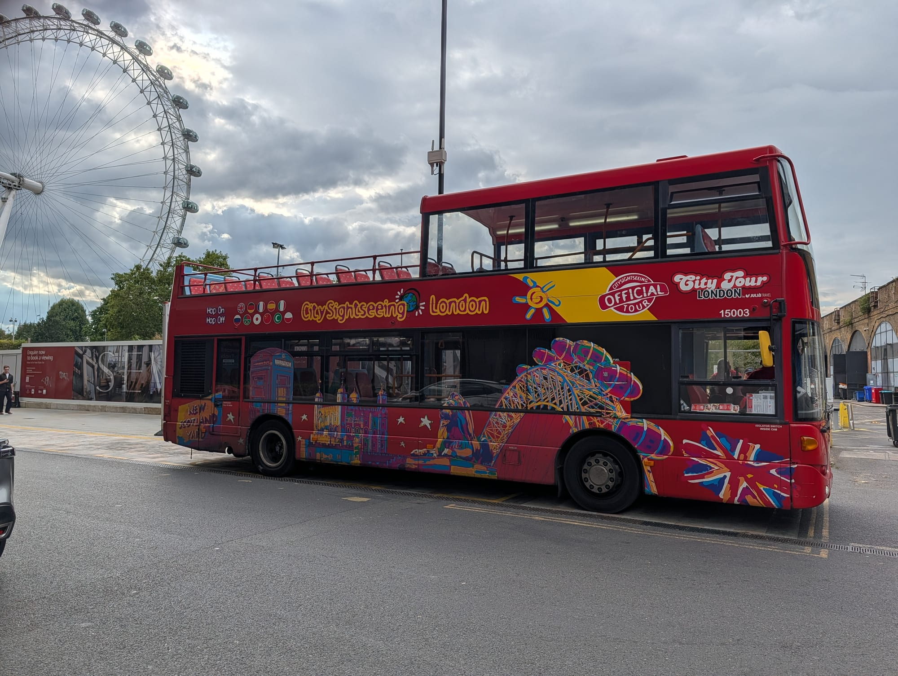

Almost everything written about London tour buses is written by someone earning a commission on the ticket. So here is the thing those pages leave out: **London's ordinary red buses cover much of the same route for £1.75, capped at £5.25 a day**, and the top deck of a normal double-decker has the same view as the top deck of a tour bus.

That does not make tour buses a rip-off. It makes them a specific product for a specific person. This page lists **every route and every stop** so you can see exactly what you would be buying, then makes the case both ways.

> 💡 **The Short Version:** **Golden Tours** is cheapest at **£24.78** online. **Big Bus** from **£32** has the densest network. **Tootbus** at **£35.20** includes six walking tours. **Never buy at the kerb** — the online discount runs 25–43%. The free alternative is **route 11** or **route 24** for **£1.75**.

## What they cost

Prices as published by the operators in August 2026. The gap between the online and full price is the whole game.

*Every operator sells the same top deck. What separates them is the route density and how much you paid — the kerb price is roughly double the online one.*

| Ticket | Online from | Full price | Includes |
| --- | --- | --- | --- |
| **Golden Tours** — 1 Day | **£24.78** | £42.00 | 3 routes, 60+ stops |
| **Big Bus** — One Day | **£32.00** | £39.00 | 3 routes, bus only |
| **Tootbus** — Discovery 1 Day (adult) | **£35.20** | £44.00 | 4 routes + 6 walking tours |
| **Golden Tours** — 24 Hours | **£33.32** | £49.00 | Adds a Thames cruise |
| **Big Bus** — Discover | **£36.99** | £43.99 | Adds a river cruise |
| **Golden Tours** — 48/72 Hours | **£36.72** | £54.00 | Longer validity, cruise included |
| **Big Bus** — Essential | **£46.99** | £53.99 | Adds cruise and walking tours |
| **Golden Tours** — Electric Routemaster | **£19.50** | £30.00 | Live guide, vintage bus, not hop-on hop-off |

**Tootbus family and child pricing:** child (5–15) **£19.20** against £24.00, and a family ticket (2 adults + 2 children) at **£112.00**. Tootbus tickets run for 1, 2 or 3 days.

> ⚠️ **Never buy from a seller at a bus stop.** Every operator discounts heavily online and charges near full price at the kerb. On a Golden Tours day ticket that difference is **£17.22**; on Tootbus it is **£8.80**. Street sellers are commission-paid, and the price they quote is the one you should not pay.

---

## Big Bus: three routes, around 55 stops

The largest network, and the one with stops closest together. Operating hours and frequencies are from Big Bus's own timetables.

| Route | Covers | Operates | Frequency |
| --- | --- | --- | --- |
| **Red Route** | Central and east — the landmarks loop | 08:30–17:45 | Every **15–20 min** |
| **Blue Route** | West — museums, parks, Notting Hill | 08:26–18:00 | Every **20 min** |
| **Green Link** | Bloomsbury, Euston, King's Cross, St Pancras | 08:30–18:00 | Every **45 min** |

### Red Route — the landmarks loop

The one most people ride. It threads Mayfair and Piccadilly into Whitehall and Westminster, crosses to the South Bank, runs east to the Tower, then comes back along the Embankment through Victoria.

1. **Green Park Underground** — next to the Ritz
2. **Hard Rock Cafe** — Piccadilly, opposite the restaurant
3. **Queen Mother Gates** — Park Lane, opposite the London Hilton
4. **Marble Arch (westbound)** — Park Lane, near Speakers' Corner
5. **Regent Street** — 144 Regent Street, near Beak Street
6. **Piccadilly Circus** — Lower Regent Street
7. **Haymarket**
8. **Trafalgar Square** — Pall Mall East
9. **Craig's Court** — off Whitehall
10. **Horseguards** — opposite Horse Guards
11. **Whitehall** — opposite Westminster station entrance
12. **London Eye (eastbound)** — Westminster Bridge Road, by the Lion statue
13. **Waterloo (eastbound)** — York Road
14. **Covent Garden** — 1 Aldwych, near the Strand
15. **St Paul's Cathedral** — Ludgate Hill at Ave Maria Lane
16. **Monument** — London Bridge
17. **London Bridge** — second stop on the bridge
18. **Southwark** — City Hall
19. **Tower of London** — 362 Tower Hill
20. **Temple Underground** — Victoria Embankment
21. **Westminster Pier** — Victoria Embankment
22. **London Eye (westbound)** — Westminster Bridge Road
23. **Lambeth Palace** — Lambeth Palace Road
24. **College Green** — Abingdon Street, by Parliament
25. **Tothill Street** — near Westminster Abbey
26. **Buckingham Palace** — 1 Buckingham Gate, opposite the Queen's Gallery
27. **Victoria, Nova Complex** — Buckingham Palace Road
28. **Victoria Station** — Buckingham Palace Road
29. **Queen Mother Gates** — back onto Park Lane

**Best stops to actually get off at:** 19 for the Tower, 26 for Buckingham Palace, 15 for St Paul's, 12 or 22 for the London Eye and the South Bank.

### Blue Route — the western loop

Museums, parks and the smart end of west London. This is the route people underrate, and it is the only one that reaches South Kensington or Notting Hill.

30. **Marble Arch (westbound)** — Park Lane
31. **Green Park** — Piccadilly
32. **Hard Rock Cafe** — Piccadilly
33. **Hyde Park Corner** — Knightsbridge, outside the Lanesborough
34. **Harrods** — Brompton Road
35. **South Kensington Museums** — Thurloe Place, for the V&A, Natural History and Science museums
36. **Gloucester Road** — outside the station
37. **Kensington Palace** — Kensington High Street
38. **Notting Hill** — Notting Hill Gate
39. **Kensington Gardens** — Bayswater Road
40. **Thistle Hotel Kensington Gardens** — Bayswater Road
41. **Lancaster Gate** — Bayswater Road
42. **Peter Pan** — Bayswater Road, near Lancaster Gate station
43. **Paddington Station** — London Street
44. **Edgware Road** — by the Metropole Hotel
45. **Marble Arch (eastbound)** — Speakers' Corner
46. **Baker Street** — Marylebone Road, for Madame Tussauds and Sherlock Holmes
47. **Oxford Circus** — Regent Street

**Best stops:** 35 puts you at all three South Kensington museums at once, which is the single most useful tour bus stop in London. 34 for Harrods, 37 for Kensington Palace, 38 for Portobello Road.

### Green Link — the Bloomsbury spur

A short connector rather than a sightseeing loop, and at **every 45 minutes** it is the one to plan around rather than rely on. Worth it almost entirely for the British Museum and the Eurostar terminal.

48. **Woburn (northbound)** — opposite Russell Court
49. **Euston Station** — Upper Woburn Place at Euston Road
50. **King's Cross Station** — Pancras Road
51. **St Pancras Station** — Midland Road, opposite the British Library
52. **Euston Road** — Upper Woburn Place, by St Pancras New Church
53. **Woburn (southbound)** — outside Russell Court
54. **British Museum (southbound)** — Southampton Row
55. **British Museum (northbound)** — Southampton Row

> **If you are arriving by Eurostar**, stop 51 puts a tour bus at St Pancras — which is genuinely convenient, and the reason this route exists.

---

Powered by <a target="_blank" rel="sponsored" href="https://www.getyourguide.com/london-l57/">GetYourGuide</a>

## Golden Tours: three routes, 60+ stops

The cheapest of the three online, and the routes are organised by theme rather than geography. A full loop takes **50–60 minutes** on each.

| Route | Covers | Operates | Stops |
| --- | --- | --- | --- |
| **Blue — Classic Tour** | Central: Big Ben, the London Eye, the Houses of Parliament | 09:00–19:00 | 11 |
| **Red — Essential Tour** | Central and north: Tower Bridge, Westminster Abbey, Hyde Park | 10:35–20:00 | 21 |
| **Orange — Museum Tour** | The Natural History Museum, Science Museum and V&A | 10:10–18:15 | Museum quarter |

Tickets include a free app audio guide in **12 languages**, live bus tracking, and free cancellation.

**The Red Route runs latest**, to 20:00, which makes Golden Tours the better choice if you want a late-afternoon start — Big Bus's Red Route has its last departure at 17:45.

> Golden Tours' own site describes "three carefully designed routes" on its product pages and "four different routes" in its FAQ. We have listed the three that are documented with times and stop counts.

---

## Tootbus: four routes and six walking tours

Tootbus tickets run for **1, 2 or 3 days** and cover **four bus routes**, with **six walking tours included** in the Discovery ticket — the most generous bundle of the three operators, and the reason its headline price is higher.

At **£35.20** adult and **£19.20** child, a family of four is better served by the **£112 family ticket**, which saves about £10 against buying separately.

---

## The honest alternative

A normal London bus costs **£1.75** a journey with contactless or Oyster, and the **daily cap is £5.25** — after that, buses are free for the rest of the day.

The **Hopper fare** gives unlimited bus journeys within **one hour** of touching in for that single £1.75. Hop off, look at something, hop on the next one, and it is all one fare.

### The routes worth riding, and what they pass

**Route 11 — the classic.** Liverpool Street, the Bank of England, **St Paul's Cathedral**, Fleet Street, the Strand, **Trafalgar Square**, Whitehall, the **Houses of Parliament**, **Westminster Abbey**, and on to Victoria. That is most of a Big Bus Red Route for £1.75.

**Route 24 — north to south.** **Hampstead Heath**, Camden Town, Mornington Crescent, Tottenham Court Road, **Trafalgar Square**, Whitehall, **Westminster** and Pimlico. The best cross-city sightseeing run in London, and it reaches somewhere no tour bus goes.

**Route 15 — the eastern half.** Trafalgar Square, the Strand, Fleet Street, **St Paul's**, Monument and the **Tower of London**.

**Route 88 — the galleries run.** Camden, Great Portland Street, Oxford Circus, **Piccadilly Circus**, Trafalgar Square, Whitehall, Westminster and **Tate Britain**.

**Route 9 — Kensington and the west.** Hammersmith, **Kensington High Street**, **Royal Albert Hall**, Hyde Park Corner, Piccadilly, and Trafalgar Square. The closest ordinary equivalent to Big Bus's Blue Route.

**Route 148 — over the river.** Camberwell, Elephant & Castle, **Westminster**, Hyde Park Corner, **Notting Hill** and White City, crossing Westminster Bridge with the Parliament view.

> **The heritage Routemaster is gone.** Route 15 used to run a limited service with the old open-platform buses, and many guides still send people to find it. TfL's own route 15 page now lists no heritage service. If you want a vintage Routemaster, Golden Tours runs an electric one as a paid tour at £19.50.

### What you give up

No commentary, no guaranteed seat, and no guaranteed top-deck front window — the seat everyone actually wants. Ordinary buses get crowded, they do not wait while you photograph anything, and nobody tells you what you are looking at. You also need to know where you are going.

---

## Who should buy a tour bus ticket

Genuinely worth it if:

* **You have limited mobility.** The strongest case by far. Step-free boarding, stops directly outside the sights, and none of the walking between them.
* **You have one day and no plan.** The commentary and the loop buy you orientation you would otherwise spend a morning acquiring.
* **You are travelling with children who have run out of legs.** A guaranteed sit-down that is still moving past things.
* **The weather is bad.** Covered lower deck, and you never wait long.
* **The bundle fits.** Big Bus Essential at £46.99 includes a cruise and walking tours; Tootbus includes six walking tours. If you were paying for those anyway, the arithmetic changes completely.
* **You want South Kensington in one stop.** Big Bus stop 35 lands you at three major museums at once.

## Who should not

* **Anyone with three or more days.** You will walk past these places anyway and the ticket duplicates them.
* **Anyone comfortable tapping onto a normal bus.** Route 11 costs £1.75.
* **Anyone in a hurry.** Tour buses sit in the same traffic and stop more often. Westminster to Trafalgar Square is a fifteen-minute walk; the bus is not faster.
* **Anyone planning to genuinely get off at lots of stops.** The hop-off, wait, hop-on cycle eats a day quickly, especially on a 45-minute frequency.

---

## Traps to watch for

1. **"24 hours" is not always 24 hours.** Some tickets run for a calendar day and expire that evening; others run 24 hours from first use. Check which you are buying — the most common complaint by far.
2. **The kerbside price.** Buy online, ideally before you arrive.
3. **Late-afternoon starts.** Big Bus's Red Route last departure is **17:45**. Buying a day ticket at 4pm buys you well under two hours.
4. **The 45-minute frequency on Big Bus's Green Link.** Miss one and you have lost most of an hour.
5. **"Included" extras that still need booking.** River cruises and walking tours bundled into a ticket often need a slot reserved, and popular ones fill.
6. **Reduced winter service.** Frequencies drop and last departures get much earlier outside summer.
7. **Similar-looking brands.** Several operators use comparable names, red buses and near-identical livery. Tickets are not interchangeable between operators.
8. **Live guide versus recorded commentary.** Recorded is multilingual and consistent; a live guide is better on a good day and worse on a bad one. Operators mix both across routes.
9. **Traffic.** No operator controls the roads. Advertised frequencies are optimistic in central London, particularly around Parliament Square.

---

Powered by <a target="_blank" rel="sponsored" href="https://www.getyourguide.com/london-l57/">GetYourGuide</a>

## What to know

* **Contactless is all you need for ordinary buses.** Tap the reader with a bank card or phone, and you do not tap out. See our [fares guide](/articles/london-public-transport-costs-and-fares/).
* **The bus daily cap is separate from the Tube cap.** £5.25 for buses and trams alone.
* **Children under 11 travel free on London buses**, which changes the family arithmetic sharply against a tour bus child ticket.
* **The river bus is the better-value scenic ride** — ordinary fares, genuine views, and it is transport rather than a tour. See [how to use London's river boats](/articles/how-to-use-london-river-boats/).
* **A free alternative to commentary:** the [three-day itinerary](/articles/three-days-in-london-itinerary/) walks the same ground with the context built in.

---

## Continue planning your London trip

- 🚌 **[How to Use London Buses and Trams](/articles/how-to-use-london-buses-and-trams/)**
- 💷 **[London Transport Costs and Fares](/articles/london-public-transport-costs-and-fares/)**
- 🚲 **[Cycling and Bike Hire in London](/articles/cycling-bike-hire-scooters-london/)**
- ⛵ **[How to Use London's River Boats](/articles/how-to-use-london-river-boats/)**
- 🗓️ **[Three Days in London](/articles/three-days-in-london-itinerary/)**
- 💷 **[London on a Budget](/articles/london-on-a-budget/)**

---

*Operator prices and timetables checked in August 2026 and change frequently. Bus fares are from Transport for London. Stop lists are as published by the operators; routes are occasionally altered for roadworks and events, so check the operator's live map on the day.*
