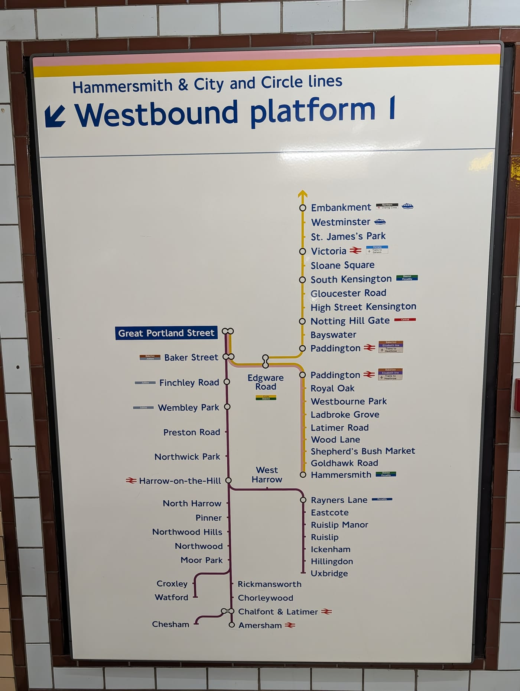
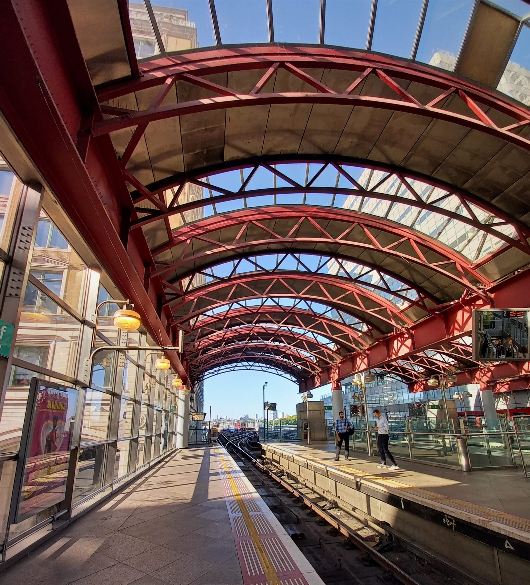
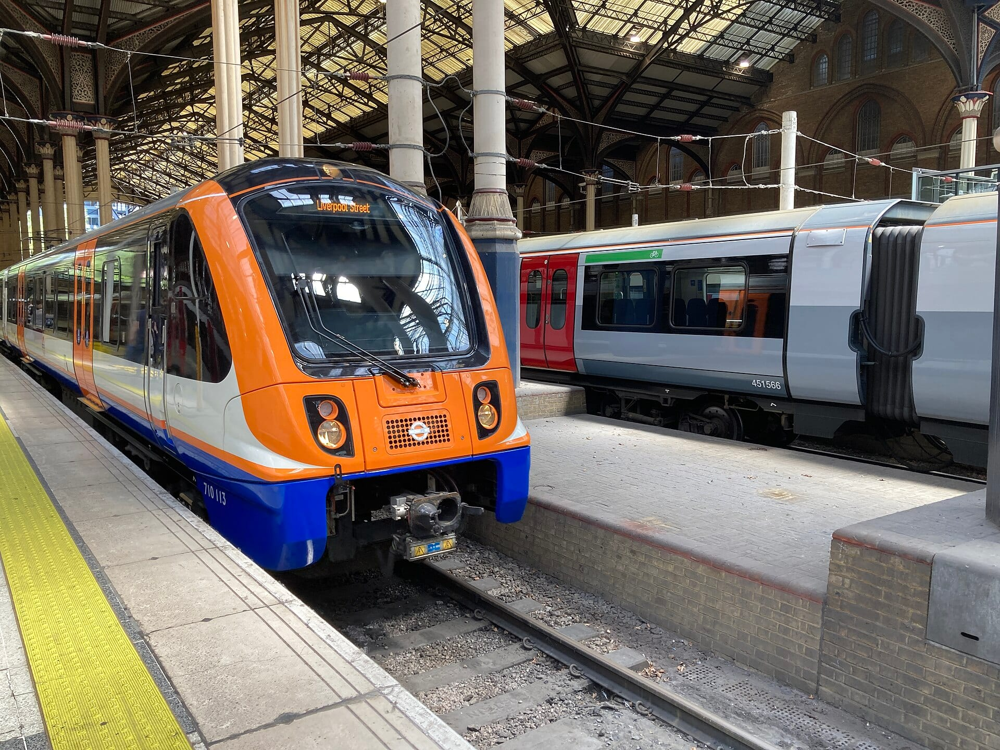

Whilst the London Underground (or tube as it's commonly referred to by Londoners) is the most popular and well-known way to traverse London by rail, there are many other lines that also accept Oyster cards (or your bank card if you prefer).

> **The short answer:** London's rail lines are not interchangeable. The Elizabeth line, the sub-surface Tube lines and the London Overground are air-conditioned and comfortable; the deep-level Tube lines are faster through the centre but hot and crowded. This guide rates every line for crowding and comfort, and lists which attractions sit at which station — including the exit to use when you get there.

Oyster and contactless work on every line covered here. For the National Rail exceptions and the Elizabeth line boundary at West Drayton, see the [Oyster card and contactless guide](/articles/oyster-card-guide-london/). If you are new to the network, [How to Use the London Underground](/articles/how-to-use-the-london-underground/) explains touching in and out, fare zones, interchanges and common first-time mistakes.

## Official London rail and Tube map

The Elizabeth line runs west–east through central London, linking Paddington, Bond Street, Tottenham Court Road, Farringdon, Liverpool Street and Canary Wharf. The DLR mainly serves Docklands, Greenwich and London City Airport, while the London Overground connects areas around and beyond central London. The map below shows Zones 1 and 2, and the full official map is linked below.

  

[Open or download the official TfL map](https://content.tfl.gov.uk/london-rail-and-tube-services-map.pdf).

## London Underground

*Every platform carries a diagram of that platform's line and direction. Checking it before boarding is the simplest way to avoid taking the wrong branch.*

All 11 Tube lines are rated below. The Elizabeth line, DLR and London Overground are covered after this section.

**Rating key:**

- **Crowding:** one red star is usually quieter; five red stars are usually very busy.
- **Comfort:** one gold star is less comfortable; five gold stars are more comfortable.

### Piccadilly

<dl>
<dt>Typical crowding</dt><dd>5/5</dd>

<dt>Comfort</dt><dd>2/5</dd>

<dt>Air-conditioning</dt><dd>Existing fleet: no. New fleet: yes</dd>

<dt>Visitor likelihood</dt><dd>Very likely — Heathrow, the Museum Quarter and the West End.</dd>
</dl><h4>Attractions and areas</h4><table class="line-attractions"><thead><tr><th>Attraction / area</th><th>Station</th><th>Best exit</th></tr></thead><tbody><tr><td>Natural History Museum, Science Museum and V&amp;A Museum</td><td>South Kensington</td><td>Museum Subway pedestrian tunnel</td></tr><tr><td>Harrods, Harvey Nichols and Hyde Park</td><td>Knightsbridge</td><td>Brompton Road for Harrods; Sloane Street for Harvey Nichols</td></tr><tr><td>Piccadilly Circus lights, Shaftesbury Avenue and Soho</td><td>Piccadilly Circus</td><td>Exit 1 or 3</td></tr><tr><td>Chinatown, Leicester Square and West End shows</td><td>Leicester Square</td><td>Exit 1 or 3</td></tr><tr><td>Covent Garden Piazza, Royal Opera House and London Transport Museum</td><td>Covent Garden</td><td>James Street exit; lifts/stairs only, no escalators</td></tr></tbody></table><h4>Useful to know</h4>
Direct to Heathrow but awkward with luggage at busy times.
<h4>Watch out for</h4>
Check whether a Heathrow train is for Terminal 4 or Terminal 5.

### Jubilee

<dl>
<dt>Typical crowding</dt><dd>5/5</dd>

<dt>Comfort</dt><dd>3/5</dd>

<dt>Air-conditioning</dt><dd>No</dd>

<dt>Visitor likelihood</dt><dd>Very likely — South Bank, Westminster and major interchanges.</dd>
</dl><h4>Attractions and areas</h4><table class="line-attractions"><thead><tr><th>Attraction / area</th><th>Station</th><th>Best exit</th></tr></thead><tbody><tr><td>Wembley Stadium, OVO Arena Wembley and London Designer Outlet</td><td>Wembley Park</td><td>Olympic Way (Wembley Way) main exit</td></tr><tr><td>Buckingham Palace, Green Park and Mayfair</td><td>Green Park</td><td>Buckingham Palace exit; ramp access into Green Park</td></tr><tr><td>Big Ben, Houses of Parliament and London Eye</td><td>Westminster</td><td>Exit 4 for Big Ben; Exit 1 for the London Eye walk</td></tr><tr><td>Southbank Centre, London Eye and London Aquarium</td><td>Waterloo</td><td>South Bank exit</td></tr><tr><td>The O2 Arena and IFS Cloud Cable Car</td><td>North Greenwich</td><td>Exit 1 for The O2 main entrance</td></tr></tbody></table><h4>Useful to know</h4>
Fast and frequent; the modern eastern stations are roomy, but trains get very busy.
<h4>Watch out for</h4>
Allow extra time at busy interchange stations, especially Waterloo and London Bridge.

### Victoria

<dl>
<dt>Typical crowding</dt><dd>5/5</dd>

<dt>Comfort</dt><dd>2/5</dd>

<dt>Air-conditioning</dt><dd>No</dd>

<dt>Visitor likelihood</dt><dd>Very likely — Buckingham Palace, Victoria station and a central north-south route.</dd>
</dl><h4>Attractions and areas</h4><table class="line-attractions"><thead><tr><th>Attraction / area</th><th>Station</th><th>Best exit</th></tr></thead><tbody><tr><td>Brixton Market, Electric Brixton, O2 Academy and Pop Brixton</td><td>Brixton</td><td>Main exit onto Brixton Road</td></tr><tr><td>Buckingham Palace and Victoria theatres</td><td>Victoria</td><td>Station concourse / Buckingham Palace Road</td></tr><tr><td>Buckingham Palace and Mayfair</td><td>Green Park</td><td>South exit into Green Park</td></tr><tr><td>Oxford Street and Regent Street shopping</td><td>Oxford Circus</td><td>Exit 1 or 2</td></tr><tr><td>Platform 9¾, British Library and St Pancras International</td><td>King's Cross St Pancras</td><td>Euston Road or Pancras Road exits</td></tr></tbody></table><h4>Useful to know</h4>
Extremely frequent and usually fast, but hot and intensely busy at peak times.
<h4>Watch out for</h4>
Victoria is a large interchange: follow signs carefully for the right line and exit.

### Central

<dl>
<dt>Typical crowding</dt><dd>5/5</dd>

<dt>Comfort</dt><dd>2/5</dd>

<dt>Air-conditioning</dt><dd>No</dd>

<dt>Visitor likelihood</dt><dd>Very likely — Oxford Street, the West End and fast east-west travel.</dd>
</dl><h4>Attractions and areas</h4><table class="line-attractions"><thead><tr><th>Attraction / area</th><th>Station</th><th>Best exit</th></tr></thead><tbody><tr><td>Portobello Road Market and Notting Hill</td><td>Notting Hill Gate</td><td>Exit 3 for Portobello Road</td></tr><tr><td>Hyde Park, Speakers' Corner and west Oxford Street</td><td>Marble Arch</td><td>Exit 1 for Hyde Park; Exit 2 for Oxford Street</td></tr><tr><td>Selfridges, Mayfair and Oxford Street shopping</td><td>Bond Street</td><td>Oxford Street for shopping; Marylebone Lane for St Christopher's Place</td></tr><tr><td>British Museum, Dominion Theatre, Soho and Outernet</td><td>Tottenham Court Road</td><td>Exit 1 for British Museum; Charing Cross Road for Soho</td></tr><tr><td>St Paul's Cathedral, One New Change and Millennium Bridge</td><td>St Paul's</td><td>Exit 2 for St Paul's Cathedral</td></tr></tbody></table><h4>Useful to know</h4>
Very fast east-west route, but frequently hot and crowded through Zone 1.
<h4>Watch out for</h4>
Some trains use the Hainault branch; check the destination on the front and platform displays.

### District

<dl>
<dt>Typical crowding</dt><dd>4/5</dd>

<dt>Comfort</dt><dd>4/5</dd>

<dt>Air-conditioning</dt><dd>Yes</dd>

<dt>Visitor likelihood</dt><dd>Likely — South Kensington, Westminster and the Tower of London.</dd>
</dl><h4>Attractions and areas</h4><table class="line-attractions"><thead><tr><th>Attraction / area</th><th>Station</th><th>Best exit</th></tr></thead><tbody><tr><td>Royal Botanic Gardens, Kew</td><td>Kew Gardens</td><td>Victoria Gate; follow signs through the village</td></tr><tr><td>Stamford Bridge (Chelsea FC)</td><td>Fulham Broadway</td><td>Main exit through Fulham Broadway shopping centre</td></tr><tr><td>V&amp;A, Natural History Museum and Science Museum</td><td>South Kensington</td><td>Museum Subway tunnel</td></tr><tr><td>Big Ben, Houses of Parliament and Westminster Abbey</td><td>Westminster</td><td>Exit 4 for Big Ben</td></tr><tr><td>Tower of London and Tower Bridge</td><td>Tower Hill</td><td>Main exit</td></tr></tbody></table><h4>Useful to know</h4>
Spacious, air-conditioned trains. The line has branches to Richmond, Ealing Broadway, Wimbledon and Kensington (Olympia), alongside its main eastern route to Upminster.
<h4>Watch out for</h4>
Check both the platform display and the train destination before boarding: District services branch, and shared sections can be served by more than one line.

### Circle

<dl>
<dt>Typical crowding</dt><dd>3/5</dd>

<dt>Comfort</dt><dd>4/5</dd>

<dt>Air-conditioning</dt><dd>Yes</dd>

<dt>Visitor likelihood</dt><dd>Likely — a useful orbit of central sights and key interchanges.</dd>
</dl><h4>Attractions and areas</h4><table class="line-attractions"><thead><tr><th>Attraction / area</th><th>Station</th><th>Best exit</th></tr></thead><tbody><tr><td>Natural History Museum, Science Museum and V&amp;A Museum</td><td>South Kensington</td><td>Subterranean museum pedestrian subway</td></tr><tr><td>Duke of York Square, Saatchi Gallery and King's Road</td><td>Sloane Square</td><td>Main exit onto Sloane Square</td></tr><tr><td>Victoria theatres and Buckingham Palace</td><td>Victoria</td><td>Buckingham Palace Road for theatres; Wilton Road for the palace walk</td></tr><tr><td>Big Ben, Houses of Parliament and Westminster Abbey</td><td>Westminster</td><td>Exit 4 (Bridge Street)</td></tr><tr><td>Tower of London, Tower Bridge and HMS Belfast</td><td>Tower Hill</td><td>Main exit; left for the Tower, right for Tower Bridge</td></tr></tbody></table><h4>Useful to know</h4>
Modern walk-through trains.
<h4>Watch out for</h4>
The Circle line shares tracks with District, Hammersmith &amp; City and Metropolitan services. Check the platform display and the train destination; busy stations such as Edgware Road have several platforms.

### Northern

<dl>
<dt>Typical crowding</dt><dd>5/5</dd>

<dt>Comfort</dt><dd>2/5</dd>

<dt>Air-conditioning</dt><dd>No</dd>

<dt>Visitor likelihood</dt><dd>Likely — Camden, Leicester Square and central north-south journeys.</dd>
</dl><h4>Attractions and areas</h4><table class="line-attractions"><thead><tr><th>Attraction / area</th><th>Station</th><th>Best exit</th></tr></thead><tbody><tr><td>Camden Market, Camden Lock and Electric Ballroom</td><td>Camden Town</td><td>Main exit; turn right for Camden Market</td></tr><tr><td>British Library and Coal Drops Yard</td><td>King's Cross St Pancras</td><td>Euston Road exit</td></tr><tr><td>West End theatres, Covent Garden and Chinatown</td><td>Leicester Square</td><td>Exit 1 for Chinatown; Exit 2 for Covent Garden</td></tr><tr><td>Borough Market, The Shard and HMS Belfast</td><td>London Bridge</td><td>Borough High Street for the market; Joiner Street for The Shard</td></tr><tr><td>Battersea Power Station, Lift 109 and Battersea Park</td><td>Battersea Power Station</td><td>Main concourse exit into the Power Station plaza</td></tr></tbody></table><h4>Useful to know</h4>
Useful for central north-south journeys.
<h4>Watch out for</h4>
Check both the central route and final destination: the line has several branches.

### Bakerloo

<dl>
<dt>Typical crowding</dt><dd>3/5</dd>

<dt>Comfort</dt><dd>2/5</dd>

<dt>Air-conditioning</dt><dd>No</dd>

<dt>Visitor likelihood</dt><dd>Likely — Paddington, the West End and Waterloo.</dd>
</dl><h4>Attractions and areas</h4><table class="line-attractions"><thead><tr><th>Attraction / area</th><th>Station</th><th>Best exit</th></tr></thead><tbody><tr><td>Sherlock Holmes Museum, Madame Tussauds and Regent's Park</td><td>Baker Street</td><td>Marylebone Road for Tussauds; Baker Street for the museum</td></tr><tr><td>Oxford Street and Regent Street shopping</td><td>Oxford Circus</td><td>Exit 1 or 2 for Regent Street; Exit 3 or 8 for Oxford Street</td></tr><tr><td>West End theatres, Chinatown, Shaftesbury Avenue and Soho</td><td>Piccadilly Circus</td><td>Exit 1 (Sherwood Street) or Exit 2 (Covent Street)</td></tr><tr><td>Trafalgar Square, National Gallery and The Mall</td><td>Charing Cross</td><td>Exit 1 for Trafalgar Square</td></tr><tr><td>Southbank Centre, London Eye and National Theatre</td><td>Waterloo</td><td>South Bank exit</td></tr></tbody></table><h4>Useful to know</h4>
Useful between Paddington, the West End and Waterloo.
<h4>Watch out for</h4>
It can get hot through central London.

### Metropolitan

<dl>
<dt>Typical crowding</dt><dd>3/5</dd>

<dt>Comfort</dt><dd>4/5</dd>

<dt>Air-conditioning</dt><dd>Yes</dd>

<dt>Visitor likelihood</dt><dd>Less likely — useful for Baker Street, the Barbican and outer north-west London.</dd>
</dl><h4>Attractions and areas</h4><table class="line-attractions"><thead><tr><th>Attraction / area</th><th>Station</th><th>Best exit</th></tr></thead><tbody><tr><td>Wembley Stadium and OVO Arena Wembley</td><td>Wembley Park</td><td>Olympic Way exit</td></tr><tr><td>Madame Tussauds and Sherlock Holmes Museum</td><td>Baker Street</td><td>Marylebone Road exit</td></tr><tr><td>British Library and Coal Drops Yard</td><td>King's Cross St Pancras</td><td>Euston Road exit</td></tr><tr><td>Fabric Nightclub and Smithfield Market</td><td>Farringdon</td><td>Cowcross Street exit</td></tr><tr><td>Whitechapel Gallery and south Brick Lane</td><td>Aldgate</td><td>Main exit onto Aldgate High Street</td></tr></tbody></table><h4>Useful to know</h4>
Comfortable trains and faster outer-London services. Between Finchley Road and Harrow-on-the-Hill, there are fast and slow tracks in each direction.
<h4>Watch out for</h4>
Check the platform display and the train destination, as well as whether it is fast, semi-fast or all-stations. The line shares tracks with Circle and Hammersmith &amp; City services in central London.

### Hammersmith &amp; City

<dl>
<dt>Typical crowding</dt><dd>3/5</dd>

<dt>Comfort</dt><dd>4/5</dd>

<dt>Air-conditioning</dt><dd>Yes</dd>

<dt>Visitor likelihood</dt><dd>Less likely — useful for the Barbican and parts of the City.</dd>
</dl><h4>Attractions and areas</h4><table class="line-attractions"><thead><tr><th>Attraction / area</th><th>Station</th><th>Best exit</th></tr></thead><tbody><tr><td>Eventim Apollo</td><td>Hammersmith</td><td>Broadway Shopping Centre exit</td></tr><tr><td>Madame Tussauds and Regent's Park</td><td>Baker Street</td><td>Marylebone Road exit</td></tr><tr><td>Platform 9¾, British Library and Coal Drops Yard</td><td>King's Cross St Pancras</td><td>Euston Road / Regent Quarter for British Library; Pancras Road for Coal Drops Yard</td></tr><tr><td>Barbican Centre</td><td>Barbican</td><td>Main exit onto Aldersgate Street; follow the yellow floor line</td></tr></tbody></table><h4>Useful to know</h4>
Modern walk-through trains; useful across the northern edge of central London.
<h4>Watch out for</h4>
It shares tracks with Circle and Metropolitan services for part of its route. Check the platform display and train destination before boarding.

### Waterloo &amp; City

<dl>
<dt>Typical crowding</dt><dd>5/5 at peak</dd>

<dt>Comfort</dt><dd>2/5</dd>

<dt>Air-conditioning</dt><dd>No</dd>

<dt>Visitor likelihood</dt><dd>Less likely — it runs only between Waterloo and Bank, and there is no service on Saturdays, Sundays and on bank/public holidays.</dd>
</dl><h4>Attractions and areas</h4><table class="line-attractions"><thead><tr><th>Attraction / area</th><th>Station</th><th>Best exit</th></tr></thead><tbody><tr><td>South Bank and London Eye</td><td>Waterloo</td><td>South Bank exit</td></tr><tr><td>Financial District, Guildhall and Royal Exchange</td><td>Bank</td><td>Exit 9 for Bank of England / Royal Exchange</td></tr></tbody></table><h4>Useful to know</h4>
A two-stop commuter shuttle between Waterloo and Bank.
<h4>Watch out for</h4>
No service on Saturdays, Sundays or bank/public holidays.

<table class="underground-comparison" aria-hidden="true">
  <caption>London Underground line comparison</caption>
  <thead>
    <tr>
      <th scope="col">Underground line</th>
      <th scope="col">Typical crowding</th>
      <th scope="col">Comfort</th>
      <th scope="col">Air-conditioning</th>
      <th scope="col">Major visitor attractions</th>
      <th scope="col">Visitor likelihood</th>
      <th scope="col">Useful to know</th>
    </tr>
  </thead>
  <tbody>
    <tr>
      <td data-label="Underground line">Piccadilly</td>
      <td data-label="Typical crowding">5/5</td>
      <td data-label="Comfort">2/5</td>
      <td data-label="Air-conditioning">Existing fleet: no. New fleet: yes</td>
      <td data-label="Major visitor attractions">
        <ul class="attractions-list">
          <li>V&amp;A South Kensington &mdash; South Kensington</li>
          <li>Natural History Museum &mdash; South Kensington</li>
          <li>Buckingham Palace &mdash; Green Park</li>
        </ul>
      </td>
      <td data-label="Visitor likelihood">Very likely &mdash; Heathrow, the Museum Quarter and the West End.</td>
      <td data-label="Useful to know">Direct to Heathrow but awkward with luggage at busy times. Air-conditioned replacement trains are due to begin entering service during 2026.</td>
    </tr>
    <tr>
      <td data-label="Underground line">Jubilee</td>
      <td data-label="Typical crowding">5/5</td>
      <td data-label="Comfort">3/5</td>
      <td data-label="Air-conditioning">No</td>
      <td data-label="Major visitor attractions">
        <ul class="attractions-list">
          <li>London Eye and South Bank &mdash; Waterloo</li>
          <li>Buckingham Palace &mdash; Green Park</li>
        </ul>
      </td>
      <td data-label="Visitor likelihood">Very likely &mdash; South Bank, Westminster and major interchanges.</td>
      <td data-label="Useful to know">Fast and frequent; the modern eastern stations are roomy, but trains get very busy.</td>
    </tr>
    <tr>
      <td data-label="Underground line">Victoria</td>
      <td data-label="Typical crowding">5/5</td>
      <td data-label="Comfort">2/5</td>
      <td data-label="Air-conditioning">No</td>
      <td data-label="Major visitor attractions">
        <ul class="attractions-list">
          <li>Buckingham Palace &mdash; Victoria</li>
          <li>Tate Britain &mdash; Pimlico</li>
        </ul>
      </td>
      <td data-label="Visitor likelihood">Very likely &mdash; Buckingham Palace, Victoria station and a central north-south route.</td>
      <td data-label="Useful to know">Extremely frequent and usually fast, but hot and intensely busy at peak times.</td>
    </tr>
    <tr>
      <td data-label="Underground line">Central</td>
      <td data-label="Typical crowding">5/5</td>
      <td data-label="Comfort">2/5</td>
      <td data-label="Air-conditioning">No</td>
      <td data-label="Major visitor attractions">
        <ul class="attractions-list">
          <li>British Museum &mdash; Tottenham Court Road</li>
          <li>Kensington Palace &mdash; Queensway</li>
        </ul>
      </td>
      <td data-label="Visitor likelihood">Very likely &mdash; Oxford Street, the West End and fast east-west travel.</td>
      <td data-label="Useful to know">Very fast east-west route, but frequently hot and crowded through Zone 1.</td>
    </tr>
    <tr>
      <td data-label="Underground line">District</td>
      <td data-label="Typical crowding">4/5</td>
      <td data-label="Comfort">4/5</td>
      <td data-label="Air-conditioning">Yes</td>
      <td data-label="Major visitor attractions">
        <ul class="attractions-list">
          <li>Tower of London &mdash; Tower Hill</li>
          <li>V&amp;A South Kensington &mdash; South Kensington</li>
          <li>Kew Gardens &mdash; Kew Gardens</li>
        </ul>
      </td>
      <td data-label="Visitor likelihood">Likely &mdash; South Kensington, Westminster and the Tower of London.</td>
      <td data-label="Useful to know">Spacious trains and many branches, so check the destination before boarding.</td>
    </tr>
    <tr>
      <td data-label="Underground line">Circle</td>
      <td data-label="Typical crowding">3/5</td>
      <td data-label="Comfort">4/5</td>
      <td data-label="Air-conditioning">Yes</td>
      <td data-label="Major visitor attractions">
        <ul class="attractions-list">
          <li>Kensington Palace &mdash; High Street Kensington</li>
          <li>V&amp;A South Kensington &mdash; South Kensington</li>
          <li>Tower of London &mdash; Tower Hill</li>
        </ul>
      </td>
      <td data-label="Visitor likelihood">Likely &mdash; a useful orbit of central sights and key interchanges.</td>
      <td data-label="Useful to know">Modern walk-through trains; shares tracks with other lines and is not a simple closed loop.</td>
    </tr>
    <tr>
      <td data-label="Underground line">Northern</td>
      <td data-label="Typical crowding">5/5</td>
      <td data-label="Comfort">2/5</td>
      <td data-label="Air-conditioning">No</td>
      <td data-label="Major visitor attractions">
        <ul class="attractions-list">
          <li>Camden Market &mdash; Camden Town</li>
          <li>London Eye and South Bank &mdash; Waterloo</li>
          <li>British Museum &mdash; Tottenham Court Road</li>
        </ul>
      </td>
      <td data-label="Visitor likelihood">Likely &mdash; Camden, Leicester Square and central north-south journeys.</td>
      <td data-label="Useful to know">Has several branches. Check both the central route and the final destination.</td>
    </tr>
    <tr>
      <td data-label="Underground line">Bakerloo</td>
      <td data-label="Typical crowding">3/5</td>
      <td data-label="Comfort">2/5</td>
      <td data-label="Air-conditioning">No</td>
      <td data-label="Major visitor attractions">
        <ul class="attractions-list">
          <li>Madame Tussauds &mdash; Baker Street</li>
          <li>London Eye and South Bank &mdash; Waterloo</li>
        </ul>
      </td>
      <td data-label="Visitor likelihood">Likely &mdash; Paddington, the West End and Waterloo.</td>
      <td data-label="Useful to know">Can get hot through central London; useful between Paddington, the West End and Waterloo.</td>
    </tr>
    <tr>
      <td data-label="Underground line">Metropolitan</td>
      <td data-label="Typical crowding">3/5</td>
      <td data-label="Comfort">4/5</td>
      <td data-label="Air-conditioning">Yes</td>
      <td data-label="Major visitor attractions">
        <ul class="attractions-list">
          <li>Madame Tussauds &mdash; Baker Street</li>
          <li>Barbican Centre &mdash; Barbican</li>
        </ul>
      </td>
      <td data-label="Visitor likelihood">Less likely &mdash; useful for Baker Street, the Barbican and outer north-west London.</td>
      <td data-label="Useful to know">Comfortable trains and faster outer-London services; check whether a train is fast, semi-fast or all-stations.</td>
    </tr>
    <tr>
      <td data-label="Underground line">Hammersmith &amp; City</td>
      <td data-label="Typical crowding">3/5</td>
      <td data-label="Comfort">4/5</td>
      <td data-label="Air-conditioning">Yes</td>
      <td data-label="Major visitor attractions">
        <ul class="attractions-list">
          <li>Barbican Centre &mdash; Barbican</li>
          <li>Whitechapel Gallery &mdash; Aldgate East, exit 3</li>
        </ul>
      </td>
      <td data-label="Visitor likelihood">Less likely &mdash; useful for the Barbican and parts of the City.</td>
      <td data-label="Useful to know">Modern walk-through trains; useful across the northern edge of central London.</td>
    </tr>
    <tr>
      <td data-label="Underground line">Waterloo &amp; City</td>
      <td data-label="Typical crowding">5/5 at peak</td>
      <td data-label="Comfort">2/5</td>
      <td data-label="Air-conditioning">No</td>
      <td data-label="Major visitor attractions">
        <ul class="attractions-list">
          <li>London Eye and South Bank &mdash; Waterloo</li>
          <li>Bank of England Museum &mdash; Bank</li>
        </ul>
      </td>
      <td data-label="Visitor likelihood">Less likely &mdash; it runs only between Waterloo and Bank.</td>
      <td data-label="Useful to know">A two-stop commuter shuttle between Waterloo and Bank; check its operating days and hours.</td>
    </tr>
  </tbody>
</table>

The Circle, District, Hammersmith & City and Metropolitan lines use modern S-stock trains with walk-through carriages and air-conditioning. The deep-level lines generally use forced ventilation rather than passenger air-conditioning. Piccadilly line fleet replacement is beginning in 2026, so the train you receive will depend on the rollout.

## Elizabeth line

The Elizabeth line is shown in purple. It crosses London from Shenfield and Abbey Wood in the east through the central tunnels to Heathrow and Reading in the west.

<dl>
<dt>Typical crowding</dt><dd>4/5 overall; 5/5 peak</dd>

<dt>Comfort</dt><dd>5/5</dd>

<dt>Air-conditioning</dt><dd>Yes</dd>
</dl>

<h4>Attractions and areas</h4>

<table class="line-attractions"><thead><tr><th>Attraction / area</th><th>Station</th><th>Best exit</th></tr></thead><tbody><tr><td>Little Venice and canal walks</td><td>Paddington</td><td>Praed Street or Canal Walk exit</td></tr><tr><td>Selfridges, Oxford Street and Mayfair</td><td>Bond Street</td><td>Davies Street for Mayfair; Hanover Square for Regent Street</td></tr><tr><td>Soho, British Museum and Outernet London</td><td>Tottenham Court Road</td><td>Dean Street for Soho; Oxford Street / Plaza for Outernet and British Museum</td></tr><tr><td>Spitalfields Market, Brick Lane and Horizon 22</td><td>Liverpool Street</td><td>Bishopsgate / Octagon exit for Spitalfields</td></tr><tr><td>Crossrail Place Roof Garden and Museum of London Docklands</td><td>Canary Wharf</td><td>Crossrail Place exit</td></tr></tbody></table>

The central section is especially busy at peak times. Long walk-through trains, generous luggage space and step-free access from street to platform at every Elizabeth line station make this a particularly convenient route for airport travel. Boarding is level at the new central stations and Heathrow.

If you are travelling to Heathrow, Elizabeth line and Piccadilly line fares and journey times differ, so use the [complete Heathrow Airport transport guide](/articles/heathrow-airport-to-london/) alongside TfL's Single Fare Finder.

East of central London, the line has two branches. Services to **Abbey Wood** run via Canary Wharf and Woolwich, while services to **Shenfield** run via Stratford and Romford. Always check the destination display before boarding.

## Docklands Light Railway

The DLR serves the City, Canary Wharf, the Royal Docks, London City Airport, Stratford, Woolwich and Lewisham. Its trains are automated, although a passenger service agent is normally on board.

Most DLR stations do not have ticket gates. Instead, tap your Oyster card, contactless card or device on a yellow reader when you enter and leave the station. It is easy to walk straight to the platform, so make a point of tapping in and out: ticket inspectors sometimes check for valid payment on the train.

<dl>
<dt>Typical crowding</dt><dd>3/5 overall; 4/5 peak</dd>

<dt>Comfort</dt><dd>3/5</dd>

<dt>Air-conditioning</dt><dd>Older trains: no. New B23 trains: yes</dd>
</dl>

<h4>Attractions and areas</h4>

<table class="line-attractions"><thead><tr><th>Attraction / area</th><th>Station</th><th>Best exit</th></tr></thead><tbody><tr><td>Tower of London and Tower Bridge</td><td>Tower Gateway</td><td>Main exit; around three minutes' walk to Tower Hill</td></tr><tr><td>Cutty Sark, Royal Observatory, National Maritime Museum, Greenwich Market and Greenwich Park</td><td>Cutty Sark for Maritime Greenwich</td><td>Main street exit onto Cutty Sark Gardens / Greenwich Church Street</td></tr><tr><td>ExCeL London</td><td>Custom House</td><td>Direct covered walkway into the main entrance</td></tr><tr><td>ABBA Voyage / ABBA Arena</td><td>Pudding Mill Lane</td><td>Single exit directly opposite the arena entrance</td></tr><tr><td>London City Airport terminal</td><td>London City Airport</td><td>Escalators lead directly into the check-in hall</td></tr></tbody></table>

At commuter times, services around Canary Wharf are busier. Every DLR station has step-free access from street to platform. The front seats give an excellent driver's-eye view when available.

TfL is replacing the older fleet with spacious, walk-through B23 trains. The new trains have air-conditioning and charging points, but the proportion in service will vary during the rollout.

*Canary Wharf DLR station. Photo: [It's No Game](https://commons.wikimedia.org/wiki/File:Canary_Wharf_DLR.jpg), [CC BY 2.0](https://creativecommons.org/licenses/by/2.0/).*

## London Overground

London Overground is the orange network that circles and crosses inner and outer London. Its six routes now have individual names.

| Overground line | Main route | Typical crowding | Comfort | Air-conditioning |
| --- | --- | ---: | ---: | --- |
| Liberty | Romford–Upminster | 2/5 | 4/5 | Yes |
| Lioness | Euston–Watford Junction | 4/5 | 4/5 | Yes |
| Mildmay | Stratford–Richmond or Clapham Junction | 4/5 | 4/5 | Yes |
| Suffragette | Gospel Oak–Barking Riverside | 3/5 | 4/5 | Yes |
| Weaver | Liverpool Street–Enfield Town, Cheshunt or Chingford | 4/5 | 4/5 | Yes |
| Windrush | Highbury & Islington–New Cross, Clapham Junction, Crystal Palace or West Croydon | 5/5 | 4/5 | Yes |

All London Overground trains are walk-through and air-conditioned. Several lines divide into branches, so the new line name does not remove the need to check the train's destination.

*A Class 710 London Overground train at Liverpool Street. Photo: [Matt Brown](https://commons.wikimedia.org/wiki/File:London_Overground_train_710113_at_Liverpool_Street.jpg), [CC BY 2.0](https://creativecommons.org/licenses/by/2.0/).*

## Best choices for comfort

Where a visitor can choose between routes:

- **Elizabeth line** is generally the most comfortable option for longer east-west journeys and airport luggage.
- **Sub-surface Tube lines** are cooler than the deep Tube because their modern trains have air-conditioning.
  Examples:
  - Circle
  - District
  - Hammersmith & City
  - Metropolitan
- **London Overground** is comfortable and air-conditioned, but the Windrush and Mildmay lines can be exceptionally busy.
- **DLR** is scenic and accessible; seek the front seats outside peak time.
- **Deep-level Tube lines** are often fastest for central journeys, but can be hot and crowded in summer.

Speed, step-free access and interchange walking time can matter more than the train itself. Consider the whole journey rather than choosing purely by the ratings above.

## When walking between stations is simpler

In central London, stations that look separate on the Tube map can be close together at street level. A short walk can be quicker or simply easier than changing lines once you allow for finding the interchange, stairs or escalators, long passageways and waiting for the next train. TfL's [station-to-station walking map](https://tfl.gov.uk/cdn/static/cms/documents/walking-tube-map.pdf) is a useful starting point.

Useful walking alternatives for visitors include:

- **Covent Garden and Leicester Square** — Roughly 400 metres apart on foot, or around five minutes. Leicester Square is on the Piccadilly line, so getting off there for Covent Garden can be the simpler choice, particularly when a change of line would be involved.
- **Waterloo and Southwark** — about four minutes on foot. This can be handy between the South Bank, Waterloo and the Tate Modern side of the river.
- **Monument and London Bridge** — about five minutes on foot. It is a practical option when moving between the City and London Bridge or Borough Market.
- **Embankment and Waterloo** — about eight minutes on foot along the river. Consider it for the South Bank, the London Eye or a connection at Waterloo rather than an extra change.
- **Tower Hill and Tower Gateway** — roughly three minutes on foot. This is useful for changing between the District or Circle lines and the DLR near the Tower of London.

---

*Information checked on 28 July 2026. Fare boundaries, train fleets and services change. Confirm a time-sensitive journey with [Transport for London](https://tfl.gov.uk/) before travelling.*
