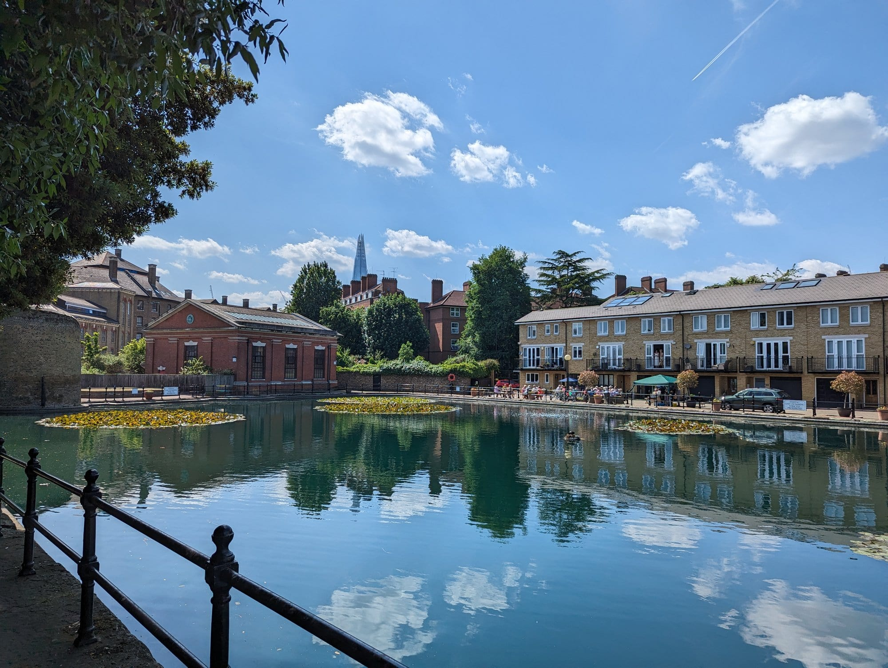
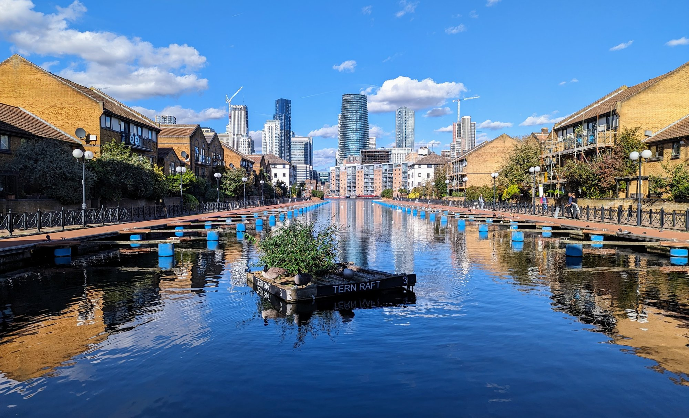

The Tube map is not to scale and it makes London look far bigger than it is. **Covent Garden to Leicester Square is one stop and a shorter walk than the station corridors.** Learning to walk London is the single biggest upgrade to a trip here.

These are the routes worth planning around, all free.

> 💡 **The Short Version:** **Westminster to Tower Bridge** on the south bank is the classic hour. **Little Venice to Camden** along the canal is the best quiet walk. **Wapping to Limehouse** is the riverside pub route. And the **City on a Sunday** is empty and extraordinary.

> 📘 **How we choose these (editorial note)**
> No paid placements. These are drawn from a wide spread of sources rather than any single list - the food and travel press, the big listings sites, independent blogs and specialists, video, and what Londoners recommend themselves - and cross-referenced against each other. Timings are walking pace without stopping — every route here has enough on it that you should double them.

---

## The South Bank: Westminster to Tower Bridge

*About an hour · entirely riverside · free*

The classic London walk and still the best introduction to the city.

**The route:** Westminster Bridge → the London Eye → Southbank Centre → the National Theatre → Gabriel's Wharf → Tate Modern → Millennium Bridge → Shakespeare's Globe → Borough Market → HMS Belfast → Tower Bridge.

**Worth stopping for:** Tate Modern's free tenth-floor view, the second-hand book market under Waterloo Bridge, Forza Wine's terrace on top of the National Theatre, and Borough Market if it is a trading day.

**Detour:** cross the Millennium Bridge for St Paul's, which is the view the bridge was built to frame.

---

## Regent's Canal: Little Venice to Camden

*About 45 minutes · flat and quiet · free*

The best walk in London that most visitors never find.

**The route:** Little Venice → past the Puppet Theatre Barge → Maida Hill tunnel (the towpath diverts up to street level) → alongside **London Zoo's aviary** → Regent's Park → Camden Lock.

**Worth stopping for:** the Feng Shang Princess floating pagoda at Cumberland Basin, the zoo animals visible from the path, and Camden Market at the end.

**Continue:** Camden to King's Cross is another 30 minutes and brings you out at Granary Square and Coal Drops Yard.

---

## Wapping to Limehouse: the riverside pubs

*About 40 minutes · free · best at high tide*

The oldest pubs in London, in order, along the river.

**The route:** Tower Bridge → St Katharine Docks → **The Town of Ramsgate** (a pub here since 1545) → Wapping Old Stairs → **Turner's Old Star** → **The Captain Kidd** → **The Prospect of Whitby** → **The Grapes** in Limehouse.

*One of Wapping's old docks, now ringed by warehouse conversions — the calm water and the Shard on the skyline make an odd pair.*

**Worth knowing:** Wapping Old Stairs is where condemned prisoners were chained at low tide. The Grapes is part-owned by Ian McKellen and Dickens drank there.

---

## The City on a Sunday

*As long as you like · free · Sundays only*

The Square Mile empties completely at weekends, which makes it the best time to walk it and the worst time to try to go inside anything.

**Worth finding:** **Postman's Park**, **St Dunstan in the East**, Leadenhall Market's exterior, the Roman wall at Tower Hill, and the Barbican highwalks.

> ⚠️ Almost everything is closed. This is a walk, not a day out — bring a coffee with you.

---

## Hampstead Heath to Primrose Hill

*About an hour · hilly · free*

**The route:** Hampstead village → the Heath → Parliament Hill for the protected City view → Kenwood House (free) → back down through Belsize Park → Primrose Hill for the second view.

Two of London's best skyline views in one walk, plus a Robert Adam interior with Rembrandts in it, for nothing.

---

## Canary Wharf to Greenwich, via the Isle of Dogs

*About 2 hours · free*

**The route:** Canary Wharf → south down the Isle of Dogs, past the old docks — now marinas ringed with moorings and waterside flats → **Mudchute Park and Farm**, 32 acres of open farmland with the financial district's towers still visible over the fence → Island Gardens, at the southern tip → **under the Thames through the Victorian foot tunnel** to Greenwich → the Old Royal Naval College grounds (free) → the National Maritime Museum (free) → up through Greenwich Park to the Observatory for the view.

*One of the Isle of Dogs' old docks, now a marina of moorings and waterside flats — this stretch is easy to have almost entirely to yourself.*

*Further down the same dock — the towers you just walked away from are still following you.*

**Mudchute Farm** is the surprise in the middle of the route: llamas and a rare-breed herd grazing with the skyline still visible over the fence, and by far the largest of London's city farms.

Coming up on the Greenwich side with the whole skyline behind you is the best free reveal in London, and it works better in this direction — forty minutes of docks and farmland not quite believing you're still in Zone 2, then straight out of a Victorian tunnel into the Old Royal Naval College.

---

## Rotherhithe to Greenwich: the quiet stretch

*About 4 miles · 1 hour 45 · Rotherhithe to Cutty Sark DLR*

The bit of the Thames Path almost nobody walks, and the better for it. From Rotherhithe the route runs past the **Mayflower** — the pub beside the steps the Pilgrims' ship left from — through Surrey Docks and the old timber ponds, round the peninsula at Greenland Dock, and into Deptford past the site of Henry VIII's naval dockyard.

You emerge at the Cutty Sark with the Old Royal Naval College ahead of you, which is the best arrival on the whole river.

**Stave Hill** is a short detour inland: an artificial mound with a bronze relief on top mapping the docks that used to be here, and a 360-degree view over what replaced them.

## Battersea to Putney: the boat race stretch

*About 4.5 miles · 1 hour 45 · Battersea Power Station to Putney Bridge*

Mostly flat, mostly quiet, and the reverse of the Championship Course the Boat Race is rowed on. Past **Battersea Park** and the Peace Pagoda, under the pink-and-green Albert Bridge, along the Wandsworth reach and into Putney where the rowing clubs line the embankment.

Best done on a spring morning when the crews are out. On Boat Race day itself the towpath is packed for hours before the start.

## Thames Barrier to the Woolwich Ferry

*About 2 miles · 45 minutes · Charlton to Woolwich*

Short, strange and almost empty. The **Thames Barrier** is the end of the Thames Path's London section — ten steel gates across 520 metres of river, each as tall as a five-storey building, and the Information Centre on the south bank explains what happens when they close.

Walk east from there to the **Woolwich Ferry**, which is free, takes vehicles and foot passengers, and has crossed the river on that spot since 1889.

---

## Short central walks people take the Tube for

* **Covent Garden → Leicester Square** — 4 minutes. One Tube stop, and further through the station tunnels.
* **Covent Garden → Soho** — 5 minutes.
* **Westminster → South Bank** — 10 minutes over the bridge.
* **St Paul's → Tate Modern** — 8 minutes over the Millennium Bridge.
* **King's Cross → Bloomsbury** — 12 minutes.

---

## Practical notes for walking the river

* **The tide runs fast and the foreshore is not a beach.** The stairs at Wapping, Bankside and Rotherhithe are only usable around low water, and the river comes back in more quickly than people expect. Check a tide table before going down.
* **Mudlarking needs a permit.** Even picking things up off the foreshore requires a Port of London Authority licence, and they are limited. Looking is free.
* **The path is not continuous.** Development, private wharves and construction close sections at both ends of the city. The signage is good where it exists and absent where it does not.
* **North bank or south?** The south is more continuous and greener; the north has more of the historic pubs and the City. Between Westminster and Tower Bridge the south bank is the better walk by some margin.
* **Bridges are the decision points.** Every bridge is free to cross, and most walks work better as a loop over two of them than as an out-and-back.

---

## What it costs

**Nothing.** The Thames Path is a National Trail, free and open at all hours along almost its entire London length.

* **The whole path runs 185 miles** from the source in Gloucestershire to the Thames Barrier, and the London stretch is the most consistently walkable part of it.
* **Bridges are free**, including Tower Bridge's pavement — you only pay for the high-level walkways.
* **The one thing you pay for is getting back.** Walk one way and take the Tube, the DLR or a Thames Clipper back. The Clipper is the most enjoyable and the most expensive; a river bus fare is well above a Tube one.
* **The Greenwich Foot Tunnel is free**, open 24 hours to pedestrians, and the most interesting way to cross the river in east London — though the lifts keep shorter hours than the tunnel.
* **Tide times matter** on the foreshore sections. The river comes in fast, and the stairs down to the beach at Wapping and Bankside are only usable at low water.

Prefer to see the river from the water instead of the towpath one day.

Powered by <a target="_blank" rel="sponsored" href="https://www.getyourguide.com/london-l57/">GetYourGuide</a>

---

## What to know

* **The Thames Path is signposted** and runs on at least one bank the whole way through London.
* **Canal towpaths are shared with cyclists.** Keep left and expect bells.
* **Tide matters** on the river walks — the Thames drops a long way and the foreshore appears. Do not go down onto it without checking the tide table.
* **Maida Hill tunnel has no towpath.** The canal walk diverts to street level for about five minutes and it is well signed.
* **Comfortable shoes beat any travel advice** anyone will give you about London.

---

## Continue planning your London trip

- 🎪 **[Free Things to Do in London](/free/)**
- 👀 **[The Best Views in London](/articles/best-views-london/)**
- 🍺 **[Historic Pubs and Dining Rooms in London](/articles/historic-pubs-dining-rooms-london/)**
- 🌳 **[London's Parks and Gardens](/articles/best-parks-gardens-london/)**
- ⛵ **[Greenwich Area Guide](/articles/greenwich-area-guide/)**
- 🚂 **[King's Cross Area Guide](/articles/kings-cross-area-guide/)**
