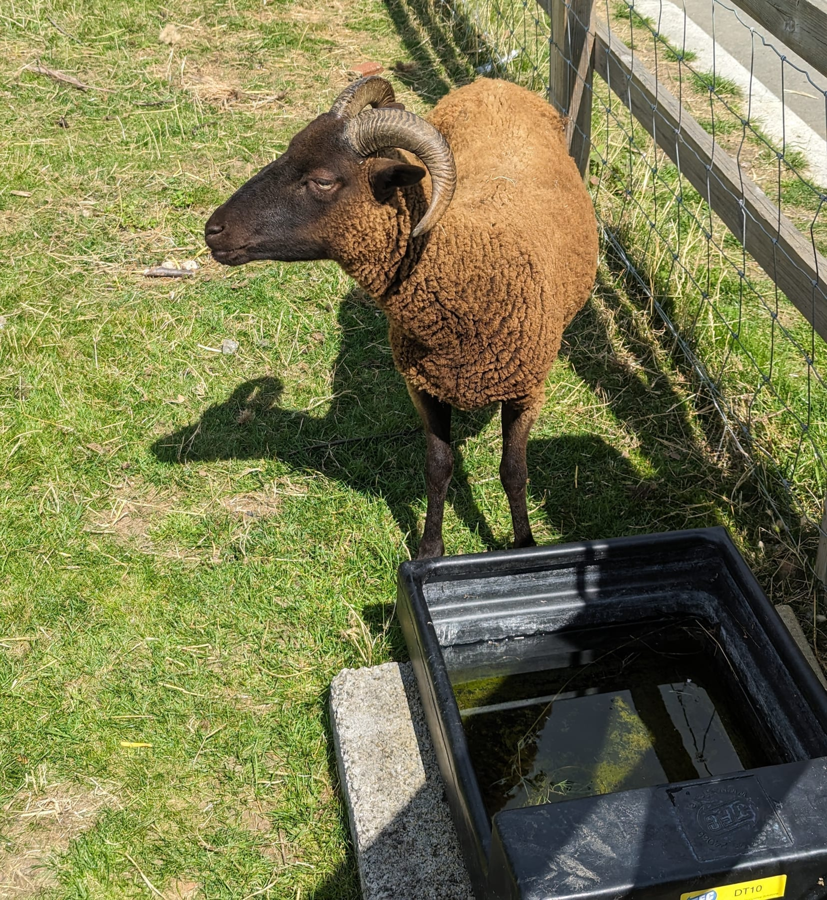
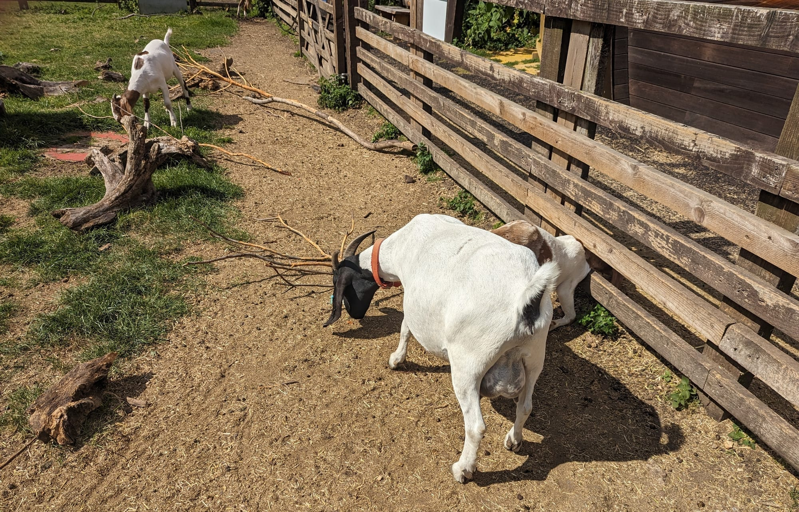
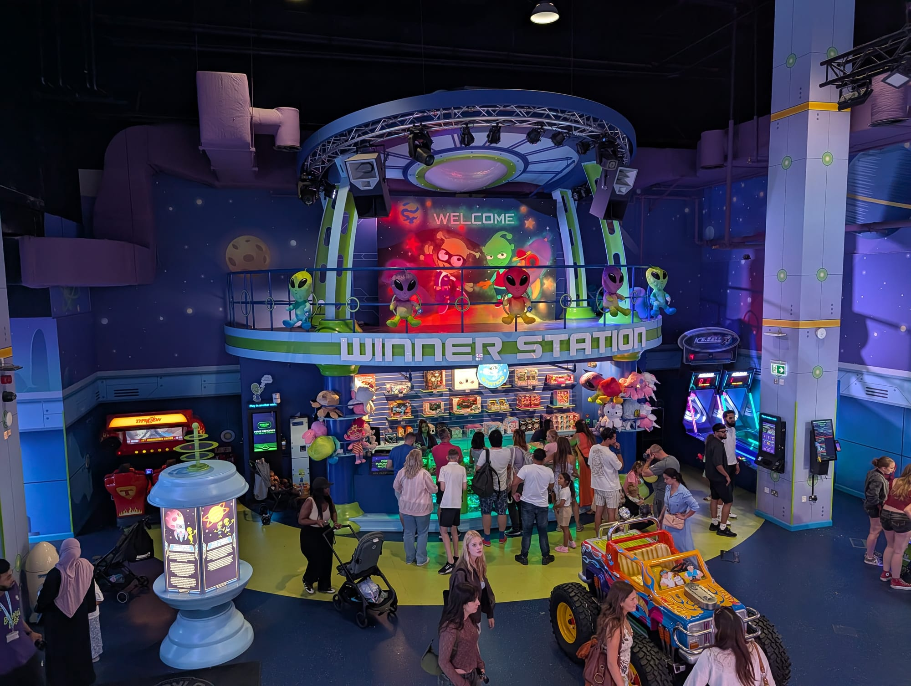

London is unusually good with children and most of the best of it is free. There are **eight city farms** you can walk into for nothing, a museum built entirely around children, and a thousand fountains in the paving at King's Cross.

Every one of the big national museums is free at the door, too. The expensive attractions are fine. They are just not where the good stuff is.

> 💡 **The Short Version:** **Young V&A** is free, needs no booking and is built for children. The **city farms** are all free. **Granary Square fountains** are the best free thing in London on a hot day. **Babylon Park** in Camden has the only indoor rollercoaster in the city, with a 105cm height limit. And **Mail Rail** puts you on a train inside real Post Office tunnels.

> 📘 **How we choose these (editorial note)**
> No paid placements. These are drawn from a wide spread of sources rather than any single list - the food and travel press, the big listings sites, independent blogs and specialists, video, and what Londoners recommend themselves - and cross-referenced against each other. Prices, hours and age limits below were checked against each venue's own website on 1 September 2026 and will drift; the deciding facts are the ones worth re-checking. Where something is free we mean genuinely free at the door. Age suitability is the venues' own guidance, and worth checking — several attractions marketed at families are 12+.

## Where they are

| If you are near… | Where to go |
| --- | --- |
| **South Kensington** | Natural History Museum, Science Museum |
| **Bloomsbury** | Postal Museum & Mail Rail, British Museum |
| **Bethnal Green** | Young V&A, Spitalfields City Farm |
| **King's Cross** | Granary Square fountains, Word on the Water |
| **Camden & Regent's Park** | Babylon Park, London Zoo, Kentish Town City Farm |
| **Battersea** | Children's Zoo, Go Ape, Lift 109 |
| **South Bank** | SEA LIFE, Shrek's Adventure, London Eye |
| **Greenwich & east** | Cutty Sark, Mudchute Farm, foot tunnel |

---

## Free city farms

All eight are free to walk into, and none of them needs booking. This is the single most underused thing on this list.

The one thing to check is the day. Only Mudchute, Kentish Town and Surrey Docks open seven days a week. Hackney, Spitalfields, Stepney and Vauxhall all close on Mondays, and Freightliners closes on Tuesdays.

*This is the whole proposition: an animal at arm's length, behind a fence a child can see over, for nothing.*

### Mudchute Park and Farm, Isle of Dogs

*Free · every day 9am–4pm · Crossharbour DLR*

A working farm sitting in 32 acres of rough grazing in the middle of the Isle of Dogs, with the Canary Wharf towers standing directly over the fence. The disorientation is most of the appeal. The farm keeps over a hundred animals — cattle, sheep, pigs, goats, llamas, donkeys, poultry — in paddocks you walk between rather than view through glass, and the surrounding park is hedgerow and open grass rather than mown lawn. It is much the biggest of London's city farms, and big enough that a small child can run themselves out here properly. **Entry is free, the farm is open every day 9am to 4pm, and the animals start going in from 3pm** — so arrive before two if the animals are the point. The park itself is open dawn to dusk, and buggies are fine on the paths, which turn to mud after rain.

### Kentish Town City Farm

*Free · every day 9am–5pm · Gospel Oak Overground*

Britain's first city farm, founded in 1972 on a strip of land beside the Gospel Oak railway line, and the model that everything since has copied. It is small enough to walk in half an hour, which suits a short attention span. There are cows, pigs, goats, sheep, poultry and a set of well-known donkeys, plus a duck pond, a riding programme and a café. At weekends the farm runs small-animal handling sessions for children, which need signing up for in advance and are the reason to come on a Saturday rather than a Tuesday. **Entry is free, it opens every day from 9am to 5pm, and no booking is required** for an ordinary visit. It is ten minutes from Camden Town on foot and a great deal calmer than the market.

### Hackney City Farm

*Free · Tuesday to Sunday, 10am–4.30pm · Hoxton Overground*

A farmyard on a small plot off Goldsmiths Row, a few minutes from Broadway Market and backing onto Haggerston Park. Pigs, goats, donkeys, sheep, chickens and rabbits, plus a walled garden and beehives, all on a site you can take in from the gate — which matters with small children, because nothing is far from the exit and nobody gets lost. The café attached is a proper neighbourhood restaurant rather than a farm tea hut, and busy at weekends. **The farmyard is open Tuesday to Sunday, 10am to 4.30pm, and closed on Mondays except bank holidays.** Entry is free. Allow an hour, and less than that in bad weather, because there is very little cover once you are in the yard.

### Spitalfields City Farm

*Free · Tuesday to Sunday · Whitechapel*

A working farm on reclaimed railway land off Buxton Street, five minutes from Brick Lane and about as unlikely as that sounds. Sheep, goats, donkeys, pigs, poultry and rabbits, alongside large vegetable and herb beds worked by volunteers, a farm shop selling eggs and plants, and a tea hut. It is a farm rather than a petting zoo — there is mud, there are working tools, and young children need holding onto near the growing beds. **Entry is free, it opens Tuesday to Sunday, and the hours move with the clocks: 10am to 4pm in winter, 10am to 4.30pm in summer.** Closed Mondays. An hour covers it unless there is an event on, and it pairs well with a walk up Brick Lane afterwards.

### Surrey Docks Farm, Rotherhithe

*Free · every day 10am–4pm · Canada Water*

A compact farm sitting directly on the Thames Path at Rotherhithe, with pigs, goats, sheep, donkeys, poultry and beehives, and the river running past the fence. It is the easiest of the eight to fold into something else, because the walk in along the Thames Path from Rotherhithe or Greenland Dock is half the pleasure and costs nothing either. There is a farm shop run by volunteers selling eggs, meat, plants and honey, and a coffee shop doing hot food and cakes. **It is free and open 10am to 4pm every day of the week, bank holidays included** — one of only three of the eight that never closes for a weekday. The farm shop trades 10am to 1pm and 2pm to 4pm, so it shuts over lunch.

### Stepney City Farm

*Free · Tuesday to Sunday, 10am–4pm · Stepney Green*

Four and a half acres between Stepney Green and the Mile End Road, with rare-breed livestock that are working animals rather than pets, growing beds, and craft studios on site that visitors can look into. The farm café cooks with what is grown in the beds. The Saturday farmers' market is the busiest and much the best time to come, and it is worth planning the visit around it rather than turning up midweek. **The farm and café open 10am to 4pm Tuesday to Sunday and on bank holiday Mondays; the market runs Saturdays, 10am to 3pm.** Entry is free and no booking is needed. Closed Mondays, and closest to Stepney Green on the District and Hammersmith & City lines.

*Goats are on every one of the eight, and they are the reason most children stay longer than the adults expected.*

### Freightliners Farm, Islington

*Free · closed Tuesdays · Highbury & Islington*

A small farm behind Paradise Park on Sheringham Road, about ten minutes' walk from Highbury & Islington and easy to miss from the street. Pigs, goats, sheep, poultry, rabbits and bees on a site you can see round in half an hour, with a garden and a café — a scale that suits under-fives better than it suits ten-year-olds, who will want Mudchute instead. **It is free at the point of entry, funded by donations, and unusually it is closed on Tuesdays rather than Mondays. The usual hours are 10.30am to 4.30pm, dropping to 3.30pm through the winter.** Those closing times move more than at the other farms, so check the site the morning you go rather than assuming.

### Vauxhall City Farm

*Free, £4 suggested donation · Tuesday to Sunday · Vauxhall*

A small farm on Tyers Street, five minutes from Vauxhall station and closer to Westminster than any other farm in London — which makes it the one to use if you are staying central and have an hour spare. Pigs, alpacas, goats, sheep, rabbits, guinea pigs and an aviary, plus a riding school, which is one of very few places in inner London where a child can get on a horse. **Entry is free with a suggested donation of £4, and it opens Tuesday to Sunday, 10.30am to 4pm, with last entry at 3.45pm.** Closed Mondays. Riding sessions and animal encounters are booked separately and are not covered by walking in. Forty minutes is enough for the animals.

---

Powered by <a target="_blank" rel="sponsored" href="https://www.getyourguide.com/london-l57/">GetYourGuide</a>

## Museums built for children

### Young V&A, Bethnal Green

*Free · no booking · Bethnal Green*

The V&A's museum for children, rebuilt around them and reopened in 2023 on the old Museum of Childhood site. It won Art Fund Museum of the Year in 2024, in its first year open. Three galleries — Imagine, Play and Design — run from a sensory area for babies through dressing-up, building and a small stage, to design benches aimed at teenagers, and nearly all of it is meant to be handled rather than looked at. **Admission is free and you do not need to book**, which makes it the most forgiving thing on this page when a day collapses. It opens daily 10.00 to 17.45, though the galleries start closing from 17.00. **There is buggy parking in the Welcome Area by the main entrance**, plus 24 free lockers on the lower ground floor. Children must be supervised throughout.

### The Postal Museum and Mail Rail, Bloomsbury

*Adult £20.50, child (2–17) £11 · Tuesday to Sunday · Chancery Lane*

A museum about the post that is really a museum about a secret railway. **Mail Rail puts you in a narrow train running through the actual tunnels of the Post Office's own underground line**, which carried letters beneath London from 1927 to 1993. The ride takes about 15 minutes, the tunnels are no wider than 2.1 metres at their tightest, and it includes pitch darkness, loud noise and flashing light. Some children love that. Some very much do not. **Adults are £20.50 and children aged 2 to 17 are £11, under-2s go free, and the ticket converts to an annual pass** — you can come back for a year. **No buggies are allowed on the lower ground floor where the train runs**; buggy parking is upstairs. The queue for the train reaches 45 minutes in school holidays. Sorted!, the play space for ages 1 to 8, is a separate £5 ticket.

### Natural History Museum and Science Museum, South Kensington

*Both free · book a free timed ticket · South Kensington*

The two obvious answers, next door to each other on Exhibition Road, **and both free**. The Natural History Museum does much of the work with the building itself — Hintze Hall, the blue whale hung overhead, the dinosaur gallery — and opens daily 10.00 to 17.50, last entry 17.30. The Science Museum suits children old enough to want to press things, opens daily 10.00 to 18.00, last entry 17.15, and its hands-on Wonderlab gallery is the one part that carries a charge. **General admission at both is free, but book the free timed ticket** rather than queueing: the walk-up line at the Natural History Museum in half term can swallow a morning. Attempting both in a day is a mistake with anyone under about eight — pick one, and go at opening or after three.

### London Transport Museum, Covent Garden

*Adult £27 for a year, under-18s free · daily 10am–6pm · Covent Garden*

Real Tube carriages, trams, trolleybuses and horse-drawn omnibuses under the iron roof of the old Covent Garden flower market, and **you can climb into most of them**. There is a stamp trail to work round, a play zone for under-fives and a Tube driving simulator upstairs. **Children and under-18s go free, and the £27 adult ticket is an annual pass rather than a day ticket — it covers unlimited return visits for twelve months.** That changes the arithmetic completely: steep for one hour on a single trip, very cheap for anyone here for a week or living in London. An off-peak version is £22.50 for weekday afternoons in term time. Free tickets for children still need booking. Open every day 10.00 to 18.00, last entry 17.00.

---

## Animals

### ZSL London Zoo, Regent's Park

*Adult from £27.70, child (3–15) from £19.40 · under-3s free · Camden Town*

Opened in 1828 as the world's first scientific zoo, and the listed Victorian and modernist buildings are half of what you are paying for — including the old Snowdon Aviary, reworked as Monkey Valley and now holding the zoo's monkeys. It is a full day rather than an afternoon, with a long walk built into it. **Under-3s go free and need no ticket at all. Children aged 3 to 15 start at £19.40 and adults at £27.70 for an off-peak weekday if you book online, rising to £24.10 and £34.50 at peak** — and buying at the gate adds roughly two pounds a head. Last entry is an hour before closing and some animal houses shut half an hour before that, so a late-afternoon arrival is poor value. Children under 16 are not admitted without an adult.

### Battersea Park Children's Zoo

*Adult £17.50, child (2–15) £13.95, family £53.95 · under-2s free*

A small zoo built deliberately around young children — meerkats, monkeys, otters, lemurs, a barnyard of sheep and goats to get close to, and two adventure playgrounds to burn off whatever is left. It takes an afternoon rather than a day, which is the whole argument for it over London Zoo with anyone under about eight: nobody has to be carried out at the end. **Adults are £17.50, children aged 2 to 15 are £13.95, under-2s go free, and the family ticket is £53.95 for two adults and two children or one adult and three children** — about £9 less than buying the same tickets separately. Currently open 10am to 5.30pm with last entry at 5pm, dropping to 4.30pm from late September. Under-16s must be with an adult.

### SEA LIFE London Aquarium, South Bank

*From £27.13 online · under-2s free · Waterloo*

In the basement of County Hall beside the London Eye: fourteen zones over three floors, a walk-through tunnel with sharks and rays passing overhead, and a rockhopper penguin colony. It is dark, warm, crowded and over quickly. **Their own estimate is one to one and a half hours, which is worth weighing against a standard online ticket from £27.13** — walking up on the day costs meaningfully more. Under-2s go free, and under-16s must be with someone over 18. **There is no cloakroom of any kind, and that explicitly includes pushchairs**, so whatever you arrive with you push around the tanks. Currently open 10am to 6pm with last entry at 5pm. Book a timeslot; queues on the South Bank build from mid-morning.

### WWT London Wetland Centre, Barnes

*Adult £17.10, junior (3–17) £11.12, family £48.11 · under-3s free*

Reedbed, lagoon and marsh in a loop of the Thames at Barnes, made out of four disused Victorian reservoirs and now a national nature reserve. Otters, bitterns, kingfishers and a large collection of ducks, geese and swans, plus pond dipping, adventure play areas and hides you can sit in out of the rain — which is what makes it work on a grey day when a park does not. It rewards three unhurried hours. **Booked online without Gift Aid it is £17.10 for an adult, £11.12 for a junior aged 3 to 17 and £48.11 for a family of two adults and two children; under-3s are free and parking costs nothing.** Open 364 days a year, 10am to 5.30pm in summer and 4.30pm in winter, last admission an hour before closing.

---

## Rides and running about

### Babylon Park, Camden

*Free entry, pay per ride · 105cm minimum on the big two · Camden Town*

An indoor amusement park on Castlehaven Road, a minute from Camden Lock, on three levels: reception at street level, a restaurant and toddler soft play on the mezzanine, and the rides down in the basement — **a rollercoaster, a drop tower, bumper cars, a carousel, VR and a wall of arcade machines**. The rollercoaster is the only indoor one in London. **Entry is free and there is no minimum age, but the rollercoaster and the drop tower both require a minimum height of 105cm**, which rules out most three-year-olds and some fours. You either buy a wristband for unlimited rides or load Babylon coins and pay per go; for an hour with one child, the coins work out cheaper. Prams are allowed, with a buggy park inside. Open daily from 10am, to 9pm most days and 10pm on Saturdays.

*Babylon Park, under Camden High Street. It is much bigger than the entrance suggests — the rides run down three floors.*

### Granary Square Fountains, King's Cross

*Free · daylight hours, every day · King's Cross St Pancras*

Four banks of jets set flush into the paving in front of the old Granary Building — **over 1,000 of them, individually controlled and individually lit** — with no fence, no queue, no ticket and no closing time beyond the light. Children run in and out of them for as long as you are willing to stand there. It is five minutes from the King's Cross and St Pancras concourses, which makes it the best answer in London to a delayed train with small children in tow. **They run daily during daylight hours and cost nothing**, though the display setting varies and is currently kept to a low, intermittent pattern rather than the full choreographed programme. Bring a towel and a complete change of clothes. The paving is hard and children fall over on it.

### Go Ape, Battersea Park

*From £28.95 · age 6 and 1.2m, or age 10 and 1.4m · Battersea Park rail*

High ropes strung through the plane trees in Battersea Park, and the only course of its kind this close to central London. Two run here. **Treetop Adventure Plus is from £28.95, with a minimum age of 6 and a minimum height of 1.2 metres, and takes 60 to 90 minutes; the full Treetop Challenge is from £39.95, minimum age 10 and minimum height 1.4 metres, and runs one to three hours.** Both cap participants at 130kg. There is also an indoor escape room, Codebreakers, from £24.95 and age 8 up. **Book ahead** — sessions are timed and staffed, and holiday weekends go early. Heights are checked at the gate and there are no exceptions, so measure your child before paying rather than after.

### Shrek's Adventure, South Bank

*From £18.38 online · recommended ages 6–12 · Waterloo*

A guided walkthrough on the South Bank with live actors, built sets and a 4D flying bus ride, finishing in a DreamWorks play area with characters from Kung Fu Panda and Madagascar. **The operator recommends it for ages 6 to 12, and says a tour lasts about an hour on top of a queue that typically runs 10 to 30 minutes and can reach an hour when busy.** There is no age limit as such, under-2s go free, and anyone 15 or under must be with an adult over 18. Standard tickets start at £18.38 online. There are witches in it and a couple of deliberate jump moments, so a cautious five-year-old will find it a lot. Closing time is often 3pm — check before building an afternoon on it.

> ⚠️ **The London Dungeon is in the same building** and is emphatically not the same thing — Merlin recommend it for 12+ and it genuinely frightens younger children.

---

Powered by <a target="_blank" rel="sponsored" href="https://www.getyourguide.com/london-l57/">GetYourGuide</a>

## The big attractions, and whether they are worth it with children

The famous ones are famous for a reason, but they are not equally good with children and they are not equally priced.

### Tower of London

*Adult £37, child (5–15) £18.50 · under-5s free · Tower Hill*

**The best of the big-ticket attractions for children, and it is not close.** Armour, the Crown Jewels on a moving walkway, the ravens, and a thousand years of grim stories told at exactly the right pitch, plus a Yeoman Warder tour included in the price that is funnier and better told than it needs to be. **Adults are £37 and children aged 5 to 15 are £18.50, while under-5s go free and need no ticket at all** — which puts two adults and two toddlers at £74 rather than the £111 a family with two older children pays. Open 09.00 to 17.30, last entry 16.30, and **the last included Warder tour leaves at 14.00**. Arrive at opening: by midday the Jewel House queue becomes the day.

### The British Museum

*Free · daily 10.00–17.00 · Russell Square*

Free, enormous, and the mummies are why most children want to come at all. The trick is to **pick three things and leave** — the museum is built to defeat completeness, and a tired child in Room 62 is nobody's good afternoon. Free family trails are handed out at the information desks, and the Great Court is one of very few places in central London where you can sit down indoors without buying something first. **Entry is free and needs no ticket; it opens daily 10.00 to 17.00 with last entry at 16.45, and Fridays run to 20.30.** Fold-up pushchairs go in the cloakroom free, though bags cost £4 to £6 to leave. Special exhibitions are ticketed separately and are rarely the reason to bring children.

### Tower Bridge

*Adult £18, child (5–15) £9 · under-5s free · Tower Hill*

The **glass floors in the high-level walkways** are what children come for, and watching a bus pass underneath your feet does not disappoint. The ticket also covers the Victorian engine rooms on the south side, which are better than they sound: the original coal-fired pumping engines that raised the bascules, oiled and enormous. **Adults are £18 and children aged 5 to 15 are £9, with under-5s free though they still need a ticket on the booking.** Open daily 09.30 to 18.00, last entry 17.00, and an hour covers it. **Watching the bridge lift from the pavement is free**, the lift times are published on their site weeks ahead, and for a small child that is honestly the better of the two experiences.

### The London Eye

*Adult from £29 online, £39 walk-up · under-2s free · Waterloo*

Thirty minutes, one slow rotation, thirty-two sealed pods and no way off once the door shuts — which suits some children and very much does not suit others. Its real advantage is that no walking is involved, which counts for a lot at the end of a long day. **Booked online it is from £29 for an adult and £26 for a child aged 2 to 15; walk up on the day and it is £39 and £35, so booking ahead saves a family of four around £38.** Under-2s go free. Honest note: for the same money the Tower of London is a longer and more interesting day, and the free view from Greenwich Park or Primrose Hill is better than the one from the pod.

### Westminster Abbey and Buckingham Palace

*Abbey £31 adult, £14 child (6–17) · Palace £33 and £16.50 · Westminster*

Both are magnificent and neither is designed for children. **Westminster Abbey is £31 for an adult and £14 for a child aged 6 to 17, under-6s free, with general sightseeing from 9.30am to 3.30pm** — it is a working church, so hours shift around services and Sunday is for worship rather than visits. **Buckingham Palace's State Rooms open only in summer, cost £33 for an adult and £16.50 for a child aged 5 to 17 booked in advance, and under-5s go free.** For most families the version worth having is the free one outside: **Changing the Guard costs nothing to watch**, happens on the forecourt and along the Mall, and does not run every day — check the schedule before building a morning around it.

### Madame Tussauds

*From £23.63 online, £39 walk-up · under-2s free · Baker Street*

Expensive, always busy, and entirely about whether your child wants a photograph standing beside a waxwork. If they do, they will love it and nothing else on this page substitutes. If they do not, there is genuinely nothing else there — a short dark ride at the end, and otherwise the same waxworks again. **Book online and it starts at £23.63 for an adult and £21 for a child aged 2 to 15; walking up on the day is £39 and £35, the widest online-versus-gate gap of anything on this page.** Under-2s go free. Closing times move around a great deal — it was shutting at 3pm on the day these prices were checked — so look them up rather than assuming a late slot exists.

---

## Free spectacle

* **Changing the Guard**, St James's — guards in bearskins and a full regimental band, free to watch. Check the schedule; it does not run daily.
* **Greenwich Foot Tunnel** — walk **under the Thames** through a tiled Victorian tunnel and come up on the Isle of Dogs. Free, open at all hours, and reliably a hit.
* **Word on the Water**, King's Cross — a bookshop on a barge, with a roof deck.
* **The Crystal Palace Dinosaurs** — the first dinosaur sculptures ever made, from 1854, and magnificently wrong.
* **Covent Garden street performers** — three licensed pitches, free, and the West Piazza takes the big circle acts.

---

## What to know

* **The national museums are free.** The British Museum, Natural History Museum, Science Museum and Young V&A all cost nothing at the door — book the free timed ticket where one is offered.
* **The city farms are free and almost never busy.** They are the best-kept secret on this page. Check the closing day before you travel.
* **Under-5s go free almost everywhere that charges** — the Tower of London, Tower Bridge, Buckingham Palace. Under-3s at London Zoo and the Wetland Centre; under-2s at the London Eye, SEA LIFE, Shrek's and Madame Tussauds.
* **Check age and height guidance.** The London Dungeon is 12+; Shrek's Adventure is recommended for 6–12; Babylon Park's rollercoaster and drop tower need 105cm; Go Ape needs 1.2m at six or 1.4m at ten.
* **Buggies are not always welcome.** Mail Rail bans them below ground, SEA LIFE has nowhere to leave one, and Young V&A and the British Museum both have somewhere to park one.
* **Under-11s travel free** on the Tube, DLR and Elizabeth line with a fare-paying adult, and free on buses and trams at any time.
* **Museums are quietest in the last two hours** before closing.

---

Powered by <a target="_blank" rel="sponsored" href="https://www.getyourguide.com/london-l57/">GetYourGuide</a>

## The one pass that is genuinely aimed at families

**Merlin's Magical London** covers **Madame Tussauds, SEA LIFE London, the London Dungeon, Shrek's Adventure and the London Eye** on one ticket, in any order, **valid 90 days from first activation** — so it does not force a route or a deadline on a trip with children in it.

**From £69, against £132 for all five booked separately.** The number worth knowing is the break-even: two of them are cheaper bought direct, and it starts paying from the third.

Powered by <a target="_blank" rel="sponsored" href="https://www.getyourguide.com/london-l57/">GetYourGuide</a>

Age is the thing to check before you buy, and two of the five are narrow: the **Dungeon is 12+** and **Shrek's Adventure is pitched at 6–12**, as covered above. If neither suits your children you are down to three attractions, which is exactly the break-even — so the pass stops being a saving and becomes a convenience.

---

## Continue planning your London trip

- 🎪 **[Free Things to Do in London](/free/)**
- 🏛️ **[The Best Museums in London](/articles/best-museums-london/)**
- 🌳 **[London's Parks and Gardens](/articles/best-parks-gardens-london/)**
- 🚇 **[How to Use the London Underground](/articles/how-to-use-the-london-underground/)**
- 🎭 **[Camden Area Guide](/articles/camden-area-guide/)**
- 🚂 **[King's Cross Area Guide](/articles/kings-cross-area-guide/)**
