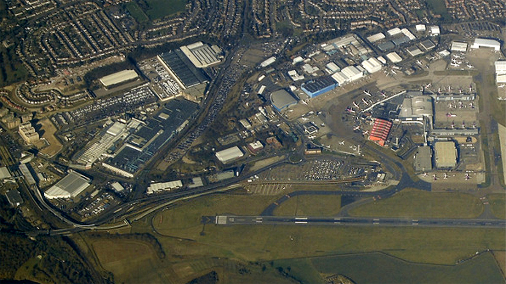

London Luton Airport (LTN) is located 28 miles (45 km) north of Central London. While the main passenger terminal is not directly adjacent to National Rail tracks, the **Luton DART** (Direct Air-Rail Transit) automated shuttle connects the terminal to **Luton Airport Parkway station** in under 4 minutes.

> 💡 **Quick Verdict: Luton to London (2026)**  
> - **Fastest to St Pancras:** **Luton Airport Express (EMR)** + DART. Takes **32 mins** total terminal-to-station to reach St Pancras International.  
> - **Best Cross-London Route:** **Thameslink Rail** + DART. Takes 35–50 mins directly to Farringdon, Blackfriars, London Bridge, and St Pancras.  
> - **Crucial Ticket Rule:** When buying train tickets online or at machines, select **"Luton Airport (LUA)"** as your destination so the £4.90 DART shuttle fee is automatically included! (Selecting "Luton Airport Parkway" excludes the DART).  
> - **Contactless vs. Oyster:** Contactless bank cards and Apple/Google Pay ARE accepted, but **Oyster cards are NOT valid** to Luton!

---

## Luton Transport Options Compared

*Fares and travel times checked on **2 August 2026**.*

| Transport Option | Central London Station | Total Journey Time | Typical Adult Single Fare | Best Used For |
| --- | --- | --- | --- | --- |
| **Luton Airport Express + DART** | St Pancras International | 32 mins | From **£10.00** *(Advance)* / **£19.10** *(PAYG)* | **Fastest route** to King's Cross / St Pancras |
| **Thameslink Rail + DART** | London Bridge / Blackfriars / Farringdon | 35–50 mins | From **£6.50** *(Advance)* / **£19.10** *(PAYG)* | **Best cross-London route** & Elizabeth Line access |
| **National Express / Green Line Bus** | Victoria Coach Station / Baker Street | 50–90 mins | From **£6.00** *(Advance)* | Budget travel & 24/7 overnight transfers |
| **Taxi / Uber / Private Transfer** | Door-to-door anywhere in London | 60–100 mins | **£85.00 – £130.00+** | Door-to-door comfort for families & heavy luggage |

---

## Which route is best for your hotel area?

| Hotel Area or Landmark | Recommended Train / Bus Route | Why Take This Route? |
| --- | --- | --- |
| **King's Cross, St Pancras (Eurostar), Bloomsbury** | **Luton Airport Express or Thameslink** | Direct train to St Pancras International in 32–35 mins. |
| **Farringdon, Clerkenwell, The City** | **Thameslink + DART** | Direct to Farringdon in 40 mins with step-free Elizabeth Line access. |
| **Blackfriars, South Bank, St Paul's Cathedral** | **Thameslink + DART** | Direct to Blackfriars station in 45 mins. |
| **London Bridge, Borough, Tower Bridge** | **Thameslink + DART** | Direct to London Bridge station in 50 mins. |
| **Paddington, Bayswater, Notting Hill** | **Thameslink to Farringdon ➔ Elizabeth Line** | Fast cross-city connection without Tube line transfers. |
| **Baker Street, Marble Arch, Victoria** | **National Express / Green Line Bus** | Direct coach option stopping right outside West End locations. |

---

## Book Airport Transfers & Experiences

Powered by <a target="_blank" rel="sponsored" href="https://www.getyourguide.com/s/%3Fq=London&amp;lc=57&amp;et=292175&amp;searchSource=3&amp;src=search_bar">GetYourGuide</a>

---

## How the Luton DART Works

The **Luton DART** is a state-of-the-art automated cable-hauled shuttle.

*The Luton DART route. Photo: [Thomas Nugent](https://commons.wikimedia.org/wiki/File:Luton_DART_aerial_view.jpg), [CC BY-SA 2.0](https://creativecommons.org/licenses/by-sa/2.0/).*

* **Frequency:** Departs every 4 to 8 minutes 24/7.
* **Transit Time:** Takes under **4 minutes** between the terminal building and Luton Airport Parkway rail station.
* **Fares:** Included in all **Luton Airport (LUA)** through-tickets. Standalone single DART tickets cost **£4.90** for adults (children 5-15: £2.45).

---

## 6 Common Luton transit mistakes to avoid

1. **Selecting "Luton Airport Parkway (LTN)" instead of "Luton Airport (LUA)":** Selecting Parkway excludes the £4.90 DART shuttle fee, requiring a second standalone ticket.
2. **Trying to use an Oyster card:** Oyster cards are **NOT valid** to Luton Airport (contactless bank cards or train tickets are required).
3. **Taking Luton Express to St Pancras when heading to London Bridge:** Take Thameslink directly to London Bridge instead of transferring to the Tube at St Pancras.
4. **Confusing Luton Town station with Luton Airport:** Luton Town station is a separate stop inside the town center—stay on the DART/train for Luton Airport!
5. **Switching payment devices between taps:** Tapping in with a bank card and out with Apple Pay creates two incomplete journey penalties.
6. **Hailing unlicensed taxis:** Always use official terminal taxi desks or pre-booked private hire.

---

## Related London Transport Guides

* ✈️ [Heathrow Airport to London Transport Guide](/articles/heathrow-airport-to-london/)
* ✈️ [Gatwick Airport to London Transport Guide](/articles/gatwick-airport-to-london/)
* ✈️ [Stansted Airport to London Transport Guide](/articles/stansted-airport-to-london/)
* 🚊 [Getting Around London: Complete Transport Overview](/articles/getting-around-london-transport-guide/)
* 💷 [London Transport Fares and Costs 2026](/articles/london-public-transport-costs-and-fares/)

---

*Fares and travel times checked on 2 August 2026. Always verify live timetables with [Thameslink](https://www.thameslinkrailway.com/) and [East Midlands Railway](https://www.eastmidlandsrailway.co.uk/).*
