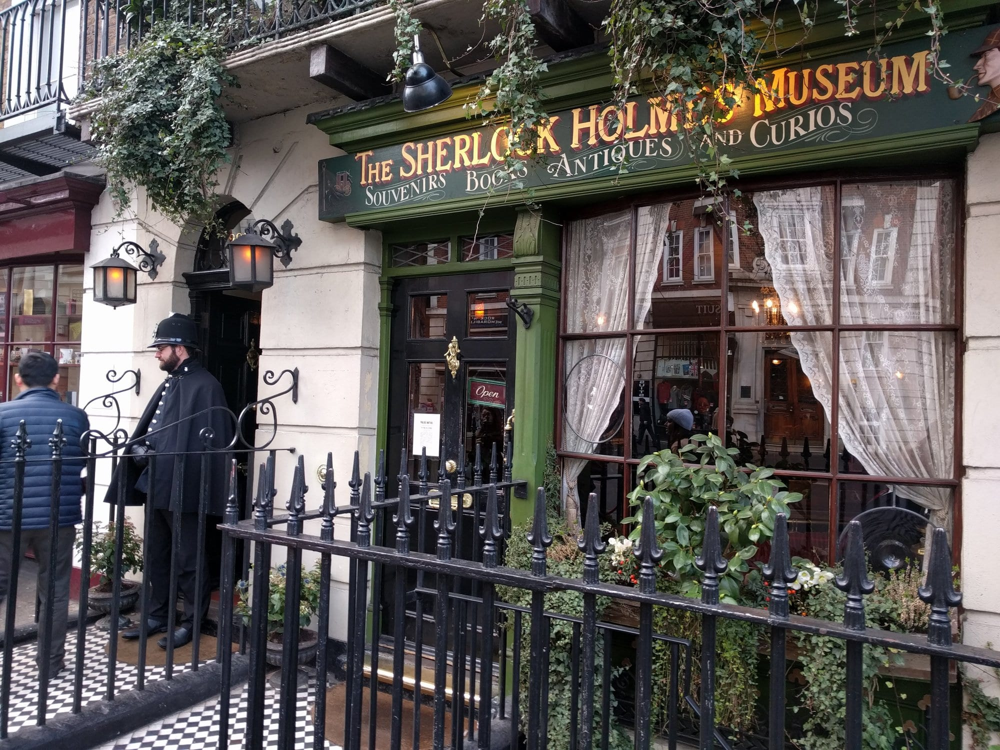
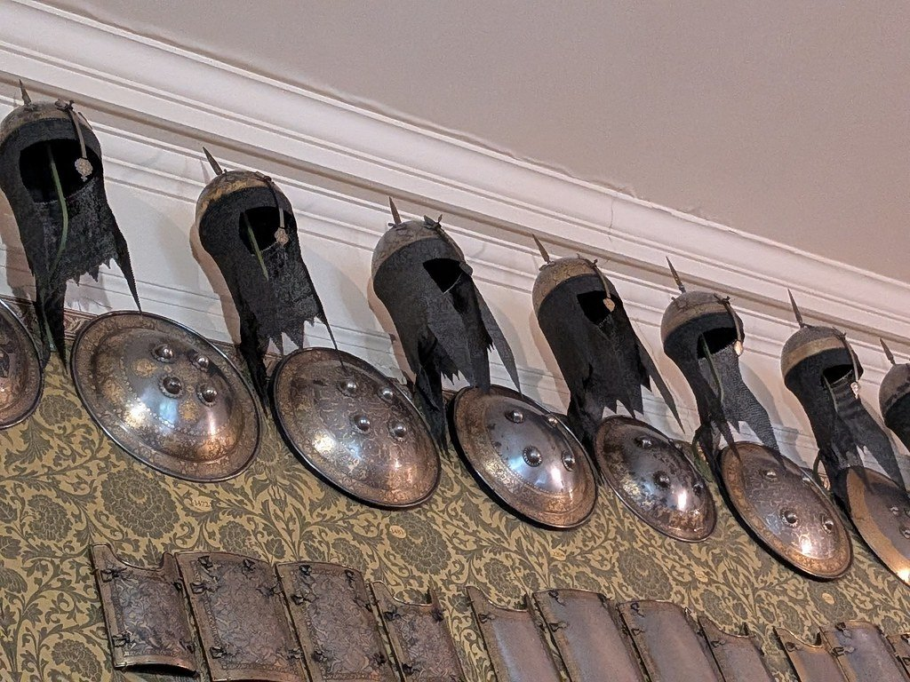
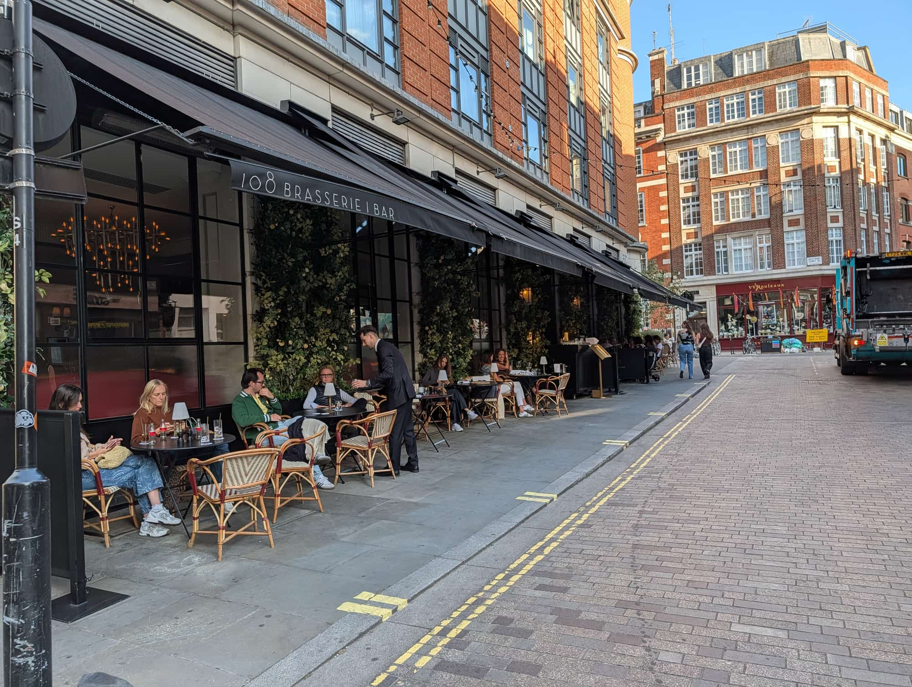
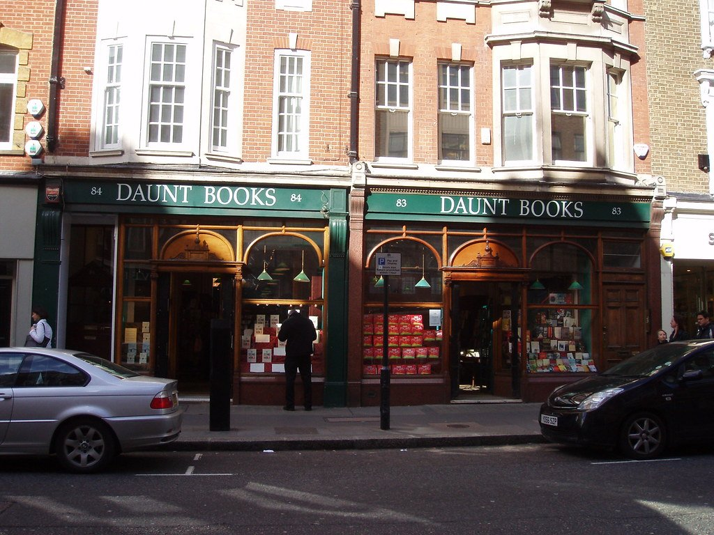
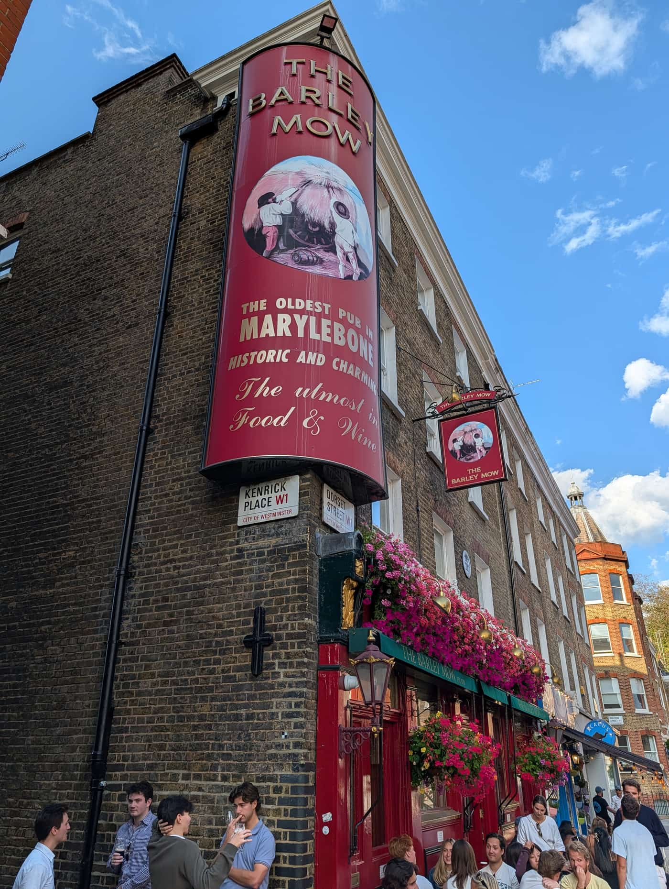

Marylebone runs parallel to Oxford Street about four minutes north, and it is the opposite of it in almost every way: low-rise Georgian, largely independent, and quiet enough to hear yourself.

It also holds one of the best free museums in London — a townhouse full of Old Masters and armour that most visitors have never heard of — and backs directly onto Regent's Park.

Marylebone has its own share of the commemorative plaques marking where notable people lived or worked - see them on our [interactive map](/plaques/?area=marylebone).

## Why visit — and who should skip it

**Come here if** Oxford Street has worn you down. Marylebone High Street is a genuine village street of independent shops, cheesemongers and bookshops, and the Wallace Collection nearby is free, world-class and almost empty.

**Skip it if** you are hunting landmarks. Apart from the queue outside the Sherlock Holmes Museum there is very little here to photograph. Marylebone is for browsing and eating.

## Top sights and activities

1. **The Wallace Collection** — Free, in a Manchester Square townhouse. *The Laughing Cavalier*, Titian, Rembrandt, Velázquez, and one of Europe's great armour collections. Astonishingly quiet for what it holds.
2. **Marylebone High Street** — The spine. Independent shops, delis, a cheesemonger and cafes with pavement tables.
3. **Daunt Books** — An Edwardian shop with oak galleries and a stained-glass window, its main room arranged **by country** rather than genre. Free to browse.
4. **Marylebone Farmers' Market** — Sundays, 10:00 to 14:00, in the Cramer Street car park. Producers only.
5. **Regent's Park** — Ten minutes north. Queen Mary's rose garden, the boating lake, the open-air theatre and London Zoo at the top.
6. **Wigmore Hall** — A 1901 chamber music hall with near-perfect acoustics. Sunday morning coffee concerts are cheap and excellent.
7. **The Sherlock Holmes Museum and Madame Tussauds** — Both on Baker Street, both ticketed, both usually with a queue. Manage expectations.

*The Sherlock Holmes Museum, signed 221B by special arrangement - the building actually sits between numbers 237 and 241.*

*The Wallace Collection's armoury. The whole museum was left to the nation on the condition that nothing ever leaves it. Photo: [gruntzooki](https://www.flickr.com/photos/37996580417@N01/55292433963), [Public Domain Mark](https://creativecommons.org/publicdomain/mark/1.0/).*

## Key streets and micro-districts

### Marylebone High Street
The centre. Independents, delis, Daunt Books and the best of the eating.

### Marylebone Lane

*Marylebone Lane keeps the curve of the old Tyburn riverbed, which is why it wanders while everything around it runs straight.*

A curving lane following the course of the buried River Tyburn, which is why it bends oddly against the grid. Small shops and pubs.

### Manchester Square
The Wallace Collection, in a garden square two minutes east of the high street.

### Baker Street and Marylebone Road
North. The Sherlock Holmes Museum, Madame Tussauds and the traffic. The least pleasant part.

### Chiltern Street
Red-brick Victorian gothic, bridal shops, instrument dealers and the Chiltern Firehouse in an old fire station.

*Daunt Books, an Edwardian shop built for a bookseller and still one. The travel section is arranged by country. Photo: [Ewan-M](https://www.flickr.com/photos/55935853@N00/2417477044), [CC BY-SA 2.0](https://creativecommons.org/licenses/by-sa/2.0/).*

Powered by <a target="_blank" rel="sponsored" href="https://www.getyourguide.com/london-l57/">GetYourGuide</a>

## Where to eat and drink

*The Barley Mow on Dorset Street, trading since 1791 and claiming the title of Marylebone's oldest pub.*

| Spot | Style | Price | Why go |
| --- | --- | --- | --- |
| **La Fromagerie** | Cheese shop and cafe | ££ | Walk-in cheese room; excellent for lunch |
| **The Golden Hind** | Fish and chips | £ | Marylebone Lane, since 1914, bring your own wine |
| **Monocle Cafe** | Coffee | £ | Small, on Chiltern Street, good for an hour with a book |
| **The Ivy Cafe** | Modern European | ££ | High Street; reliable and open all day |
| **Marylebone Farmers' Market** | Market | £ | Sundays only, and the best-value eating here |
| **The Wallace Restaurant** | Brasserie | £££ | In the museum's glazed courtyard |

## Getting there

**By Tube.** **Baker Street** (five lines) is best for the north end and Regent's Park. **Bond Street** (Elizabeth line, Central, Jubilee) is best for the south end and is only four minutes' walk from the high street.

**Best exit.** From Bond Street, take the **Marylebone Lane** exit and walk north — it drops you straight into the village rather than onto Oxford Street.

**On foot.** Ten minutes to Regent's Park, twelve to Mayfair, twenty to Soho.

## How long to spend, and when to go

| If you have | Do this |
| --- | --- |
| **Two hours** | Marylebone High Street, Daunt Books and lunch |
| **Half a day** | Add the Wallace Collection |
| **A full day** | Add Regent's Park and the zoo, or a Wigmore Hall concert |

**Best time:** Sunday morning for the farmers' market, then the Wallace Collection when it opens.

**Note:** The high street is largely shut by early evening. Marylebone is a daytime area.

## Suggested half-day route

1. **Start:** Bond Street station, **Marylebone Lane** exit.
2. **Marylebone Lane:** North along the curving lane to the high street.
3. **Daunt Books:** The galleried main room.
4. **Marylebone High Street:** North past the delis and cafes.
5. **The Wallace Collection:** East to **Manchester Square**. Free.
6. **Finish:** North to **Regent's Park**, or a concert at Wigmore Hall.

## Common mistakes to avoid

1. **Missing the Wallace Collection.** Free, world-class and quiet — the best-value hour in the area.
2. **Judging Marylebone by Marylebone Road.** That is a traffic artery. The village is two streets south.
3. **Queuing for the Sherlock Holmes Museum without knowing what it is.** Small, ticketed and heavily themed.
4. **Coming in the evening.** Most of the high street closes by 18:00.
5. **Expecting Madame Tussauds to be a Marylebone experience.** It is a standalone attraction on a busy road.
6. **Walking up from Oxford Circus.** Bond Street is closer and less unpleasant.

Powered by <a target="_blank" rel="sponsored" href="https://www.getyourguide.com/london-l57/">GetYourGuide</a>

## Where to stay

Central, calm and well connected, with the Elizabeth line at Bond Street four minutes away.

- **Marylebone Village** — Small hotels and townhouse conversions around the high street.
- **Baker Street and Marylebone Road** — Larger hotels, cheaper, noisier, handy for Regent's Park.
- **Paddington** — Twenty minutes west, better value again, and direct to Heathrow.
