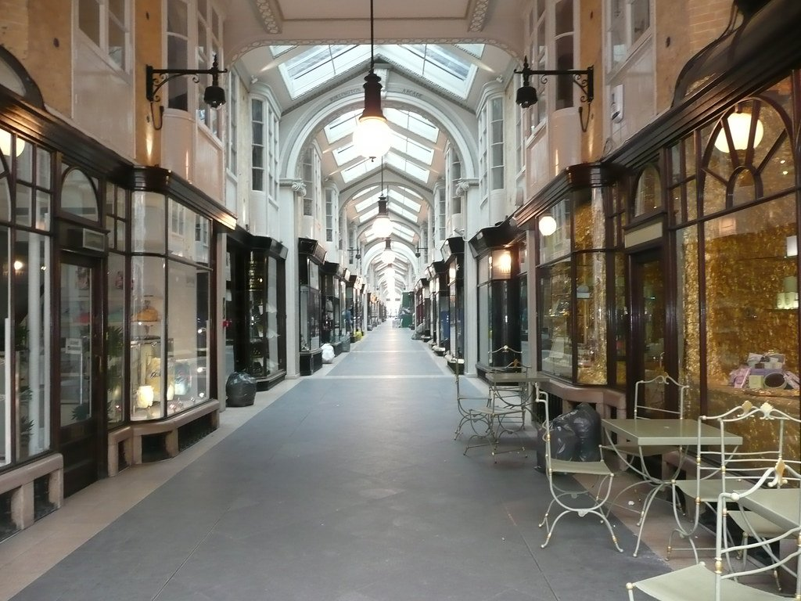
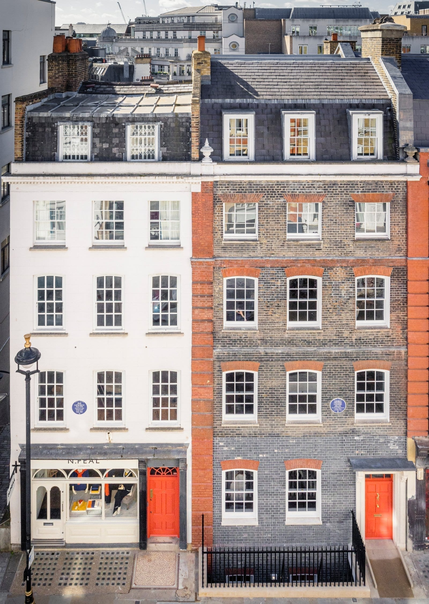

Mayfair is a Georgian grid laid out from the 1720s between [Oxford Street](/articles/shopping-in-london/#oxford-street-and-the-big-three), Regent Street, Piccadilly and Park Lane, and it has been the most expensive part of London for most of the three centuries since.

It is also less closed off than it looks. The Victorian arcades are public passages, the Royal Academy's courtyard is free, and the dozens of commercial art galleries on and around Cork Street will let anyone walk in.

Mayfair has its own share of the commemorative plaques marking where notable people lived or worked - see them on our [interactive map](/plaques/?area=mayfair).

## Why visit — and who should skip it

**Come here if** you like architecture or art. Mayfair has more free galleries per street than anywhere else in London, the best-preserved Georgian grid in the centre, and four Victorian arcades you can walk through for nothing.

**Skip it if** you want to eat or drink cheaply. This is the most expensive postcode in Britain and it shows on every menu. It is also quiet in the evening — most of Mayfair is offices and embassies once the shops shut.

## Top sights and activities

1. **Burlington Arcade** — Britain's first shopping arcade, opened 1819, still patrolled by uniformed **Beadles** enforcing the original rules: no running, whistling, singing or opening umbrellas.
2. **The Royal Academy** — In Burlington House. The courtyard and Fine Rooms are free; the exhibitions are ticketed. The **Summer Exhibition** has run every year since 1769.
3. **The Cork Street galleries** — A concentration of commercial art dealers, nearly all free to enter and none of them expecting you to buy.
4. **Handel Hendrix House** — 23 and 25 Brook Street. Handel lived at 25 and wrote *Messiah* there; Hendrix rented the top floor of 23 in 1968. Now one ticketed museum.
5. **Shepherd Market** — A small, scruffy village of narrow lanes and pubs in the middle of the most expensive district in the country. Genuinely unexpected.
6. **The other arcades** — Piccadilly Arcade, Princes Arcade and the Royal Arcade, all free to walk through and all quieter than Burlington.
7. **Green Park and Berkeley Square** — Green Park to the south, and the plane trees of Berkeley Square, planted in 1789 and among the oldest in London.

*Burlington Arcade, open since 1819 and still patrolled by beadles who can stop you whistling or running in it. Photo: [Reading Tom](https://www.flickr.com/photos/16801915@N06/3282398164), [CC BY 2.0](https://creativecommons.org/licenses/by/2.0/).*

## Key streets and micro-districts

### Bond Street

Old Bond Street at the Piccadilly end, New Bond Street running north to Oxford Street, and one continuous run of flagship fashion and jewellers between them. It is the most expensive retail street in Europe and it does not pretend otherwise.

**Sotheby's at 34–35 New Bond Street is the free one.** Auction viewings are open to the public, no ticket and no appointment, in the days before a sale — you can walk in off the street and stand in front of things that will sell for millions. Over the door is a black granite **Egyptian statue of Sekhmet, around 1320 BC**, the oldest outdoor object in London and older than anything in the British Museum's frontage.

**Allies**, the bench sculpture of Roosevelt and Churchill mid-conversation, sits halfway along and is the most photographed thing on the street.

**It is a weekday street.** The galleries and auction houses keep office hours and close at weekends, when only the shops are open. Bond Street station is at the north end, Green Park at the south.

### The arcades and Piccadilly

Four covered Victorian shopping arcades within a few hundred metres — **Burlington**, **Piccadilly**, **Princes** and **Royal** — plus the Royal Academy between them. All free to walk through and all roofed, which makes this the best rainy hour in Mayfair.

**Burlington Arcade opened in 1819** and is the oldest and grandest. It is still patrolled by **Beadles** in top hats and frock coats, the oldest small police force in the world, and they enforce the original rules: **no running, no whistling, no singing, and no opening an umbrella inside.** They will stop you, politely.

**The Royal Academy** is through the courtyard next door, Tuesday to Saturday 10am to 6pm. Its exhibitions are ticketed but the courtyard, the shop and parts of the building are free to enter.

**Cecconi's at 5A Burlington Gardens** is the all-day Italian at the back of the arcade, and it takes bookings — most of Mayfair at this end does not do walk-ins well.

### Cork Street and Savile Row

Two parallel streets doing two different trades, both free to walk down, and both far more welcoming than they look from outside.

**Cork Street is commercial art galleries**, one after another, showing work at museum quality with no admission charge and no crowd. **You are allowed to walk in.** Nobody will ask what you want, the price list is on the desk if you care, and looking without buying is entirely normal — this is the same argument as White Cube in Bermondsey, at a fraction of the distance from Piccadilly.

**Savile Row is bespoke tailoring**, and the shopfronts are worth the walk even if a suit is not: Huntsman at number 11 supplied the Kingsman films with their entire premise. **Gieves & Hawkes at number 1** has been at that address since 1912.

**Both close at weekends.** Galleries typically run Tuesday to Saturday and tailors Monday to Friday, so a Sunday walk down either street gets you shuttered windows. Green Park and Piccadilly Circus are each about five minutes.

### Shepherd Market

A pocket of narrow lanes and small squares between Curzon Street and Piccadilly, built on the site of the May Fair the district is named after. **No chains, no flagships, and a completely different scale** from the streets around it — two-storey buildings and pavement tables where everything else is six floors of plate glass.

It is the one part of Mayfair that feels like a village, and it is thirty seconds off Piccadilly through an easily-missed archway.

**The pubs are the point.** Ye Grapes and the Shepherd's Tavern both put tables out, and the whole square fills with drinkers on a warm evening — the closest thing central Mayfair has to a beer garden.

**Green Park is three minutes away** and Hyde Park Corner about five. Go in the early evening; at lunchtime it is quiet and at eleven it is shut.

### Mount Street and Berkeley Square

The quietest handsome walking in Mayfair. **Mount Street** is a run of pink terracotta and red-brick Victorian Gothic — deliberately ornate, built by the Grosvenor estate in the 1880s — and now the address for a particular kind of very expensive small shop.

**Berkeley Square's plane trees were planted in 1789** and are among the oldest in central London. The square is a public garden, free, open in daylight and locked overnight.

**Eat on Mount Street rather than around the square.** **Bacchanalia at 1–3** does Greek and southern Italian under a ceiling of classical sculpture; **The Guinea Grill at 30 Bruton Place**, in the mews behind, is a chophouse that has been there since the 1950s and is the least Mayfair thing in Mayfair.

**Mount Street Gardens**, tucked behind the street beside the Jesuit church, is the secret one — a walled garden of benches and London planes, free, and almost never busy. It is the best place to sit down in W1.

*Two blue plaques, next door to each other. Handel lived at 25 Brook Street; Jimi Hendrix lived at 23, two centuries later. Photo: [HandelandHendrix](https://commons.wikimedia.org/w/index.php?curid=150507869), [CC BY-SA 4.0](https://creativecommons.org/licenses/by-sa/4.0/).*

Powered by <a target="_blank" rel="sponsored" href="https://www.getyourguide.com/london-l57/">GetYourGuide</a>

## Where to eat and drink

| Spot | Style | Price | Why go |
| --- | --- | --- | --- |
| **The Guinea Grill** | Historic pub and grill | ££ | Bruton Place; a pub since 1423, famous for its pies |
| **Ye Grapes** | Pub | £ | Shepherd Market; unpretentious, in the middle of Mayfair |
| **The Audley** | Restored pub | ££ | Mount Street; ornate Victorian interior, recently restored |
| **Mercato Mayfair** | Food hall | ££ | Inside a deconsecrated Victorian church on North Audley Street |
| **The Wolseley** | Grand cafe | £££ | Piccadilly, in a former car showroom; book for breakfast |
| **Sketch** | Modern European | ££££ | Conduit Street; the pink room and the egg-pod toilets |

## Getting there

**By Tube.** **Green Park** (Piccadilly, Victoria, Jubilee) is best for the arcades and the Royal Academy. **Bond Street** (Elizabeth line, Central, Jubilee) is best for the north. Oxford Circus serves the north-east corner.

**Best exit.** From Green Park, take the **Piccadilly North** exit and Burlington Arcade is four minutes west along Piccadilly.

**On foot.** Ten minutes to Soho, twelve to Marylebone, twenty through Green Park to Buckingham Palace.

## How long to spend, and when to go

| If you have | Do this |
| --- | --- |
| **Two hours** | The arcades, the Royal Academy courtyard and Cork Street |
| **Half a day** | Add Shepherd Market, Mount Street and Berkeley Square |
| **A full day** | Add Handel Hendrix House and a Royal Academy exhibition |

**Best time:** Weekday daytime. Many commercial galleries close at weekends entirely, and Mayfair is dead on a Sunday.

**Note:** The Summer Exhibition runs roughly June to August and is the busiest the Royal Academy gets.

## Suggested two-hour walking route

1. **Start:** Green Park station, **Piccadilly North** exit.
2. **Burlington Arcade:** West along Piccadilly, then through the arcade.
3. **Royal Academy:** Next door. The free courtyard and Fine Rooms.
4. **Cork Street:** North through the commercial galleries.
5. **Bond Street and Mount Street:** West and north past Sotheby's.
6. **Finish:** South to **Shepherd Market** for a pub, or Green Park.

## Common mistakes to avoid

1. **Assuming everything costs money.** The arcades, the RA courtyard and nearly every commercial gallery are free.
2. **Coming on a Sunday.** Galleries shut and the area empties.
3. **Whistling in Burlington Arcade.** Genuinely against the rules, and the Beadles will say so.
4. **Missing Shepherd Market.** Two minutes off Piccadilly and completely unlike the rest of Mayfair.
5. **Eating on Bond Street.** Walk to Shepherd Market or Mercato Mayfair instead.
6. **Expecting evening life.** Mayfair is offices and embassies after dark. Soho is ten minutes east.

Powered by <a target="_blank" rel="sponsored" href="https://www.getyourguide.com/london-l57/">GetYourGuide</a>

## Where to stay

The most expensive hotel district in London, and the quietest central one at night.

- **Mayfair proper** — Claridge's, the Connaught, the Ritz on the Piccadilly edge. Landmark hotels at landmark prices.
- **Marylebone** — Twelve minutes north, considerably better value, same Elizabeth line access at Bond Street.
- **Soho and Covent Garden** — East, cheaper, and far more open in the evening.
