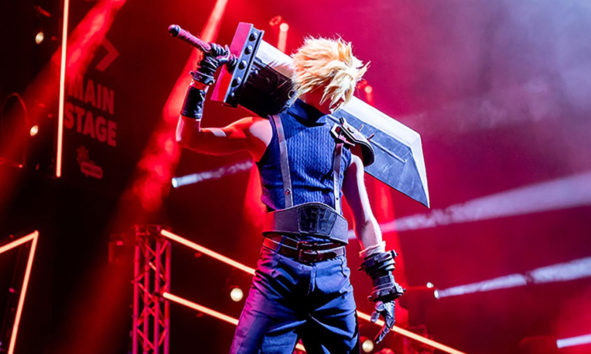
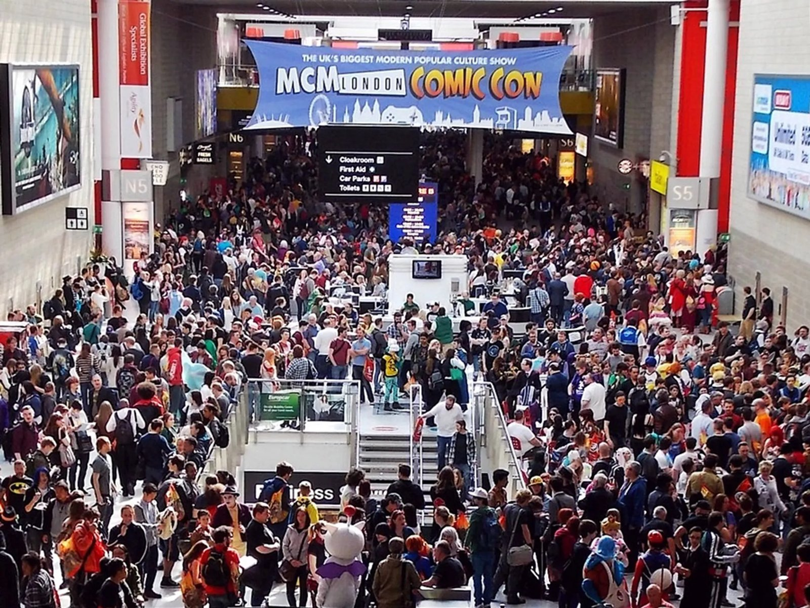

MCM Comic Con returns to ExCeL London for its autumn edition on **Friday 23 to Sunday 25 October 2026** — three days of cosplay, anime, comics, gaming and guest signings that MCM runs twice a year at the same venue. Weekend tickets and both VIP tiers are already sold out; single-day tickets from £29 are not.

> 💡 **The Short Version:** **23–25 October 2026, ExCeL London.** General entry is **£29 Friday/Sunday, £38 Saturday**; Priority entry (two hours' early access) is **£39/£48**. The **Weekend ticket and both VIP tiers have sold out**, along with Friday's Squad Bundle. **Cosplay props max out at 150cm** (180cm for a narrow staff), and metal blades, guns and functional bows are banned outright — every prop gun gets a fresh security marking each day. Autographs and photo ops are a **paid add-on on top of admission**, sold through MCM's partner Epic; bring cash for guest tables even though the venue itself is cashless. Use **Custom House** station and the **West Entrance** whichever side of ExCeL you arrive from. **Saturday is priced and timed as the busiest day** — Friday or Sunday are calmer.

---

> 🧭 **Plan the rest of it:** [Getting to and parking at ExCeL London](/articles/excel-london-guide/) · [Things to do in London in October](/articles/things-to-do-in-london-in-october/) · [The UK ETA](/articles/uk-eta-guide/) · [Luggage storage near the stations](/articles/luggage-storage-london/)

## Tickets: what's sold out, what a day costs

| Ticket | Price | What it gets you | Sold out? |
| --- | --- | --- | --- |
| VIP Legend Pass | £300 | 3-day priority-hours entry, early access to autograph and photo-op booking, VIP lounge, fast-track queues, 15% off merch, the October 2026 extra perks are tabletop-gaming themed | **Sold out** |
| VIP Pass | £230 | Same fast-track access as VIP Legend, but early panel bookings rather than early autograph/photo-op access | **Sold out** |
| Weekend ticket | £98 | 3-day entry at Priority-entry hours, no fast-track perks | **Sold out** |
| Priority entry, Friday | £39 | Entry from 10am, two hours before general | On sale |
| Priority entry, Saturday | £48 | Entry from 9am, two hours before general | On sale |
| Priority entry, Sunday | £39 | Entry from 10am, two hours before general | On sale |
| General entry, Friday | £29 | Entry from noon; the free After Hours party runs to 9pm, included | On sale |
| General entry, Saturday | £38 | Entry from 11am to 7pm — the longest day | On sale |
| General entry, Sunday | £29 | Entry from noon to 5pm | On sale |
| Child ticket, daily | £7 | Ages 5 and up; under-5s go free with a paying adult | On sale |

*Prices from [MCM's own ticket page](https://www.mcmcomiccon.com/london/en-us/tickets.html), 3 October 2026; they include VAT and service fees, but a posted physical badge adds its own delivery charge at checkout.*

A **Squad Bundle** buys five Priority tickets at once for a group: £158 on Sunday. Friday's bundle has sold out and there's no Saturday bundle.

- **Kids 4 and under go free** with a paying adult; everyone 5 and up needs a ticket, including the daily child rate.
- **No refunds, and MCM doesn't run its own resale.** A ticket bought anywhere other than MCM's own site can be cancelled at the door with no entry and no refund.
- **Order before the delivery deadline and your badge is posted to your door**, so you skip the pick-up queue; order after it and you show the QR code on your phone or a printout at registration instead.
- **Once a ticket type sells out, it isn't reopened** — that includes the Weekend ticket and both VIP tiers for this show.

> ⚠️ **Weekend and both VIP tiers are sold out.** As of 3 October 2026, the only tickets left are single-day Priority and General entry for Friday, Saturday and Sunday, plus the Sunday Squad Bundle.

## Cosplay, weapons and props: the rules that matter

MCM's full costume and prop policy runs to several thousand words; this is what actually changes whether something gets confiscated at the door.

*On the Main Stage cosplay masquerade.*

- **Banned outright:** metal blades of any kind (swords, axes, knives), guns or gun-shaped items built from metal or hard wood, airsoft/BB/gel-blaster guns even unpowered, functional bows and crossbows, laser pointers, drones, and anything a police officer could reasonably call a weapon.
- **Every prop gun or blaster is marked by security at the door, every day.** The marking isn't permanent, so if you're bringing the same prop back on day two, you queue for a fresh mark each morning.
- **Size limit: 150cm**, or 180cm for a narrow staff or spear — anything bigger must dismantle by hand before you enter a crowded area. Scythes must always split into two pieces without tools, regardless of size.
- **Costumes max out at 2.5 metres** between any two points (fabric trains and folding parts excluded), and a bulky costume — full fur suit, armour, wings — needs a sighted guide walking with you.
- **Nudity and exposed prosthetic genitalia aren't allowed**, and extreme fetish or BDSM-style attire is judged unsuitable for the all-ages show; email MCM's cosplay team in advance if you're unsure.
- **Unrealistic toy guns are fine** — bright plastic, flashing lights, obvious sci-fi designs — up to the same 150cm limit, as are lightsabers, including metal-hilted ones.

If your prop is unusual, MCM's cosplay team (MCMcosplay@reedpop.com) will advise before the show; nobody can give you a guarantee without seeing it in person.

## Guests, autographs and photo ops: how the money works

Meeting a guest is two separate purchases: your admission ticket gets you into the building, and the autograph or photo op itself is bought on top, through MCM's partner **Epic**.

*A guest panel on the Main Stage.*

- **Some guests sell pre-booked, timed slots online before the show**; others sell only at their table on the day, first come, first served.
- **The guest's own page on MCM's site says which** — pre-sale, table-only, or both — and lists the price, since guests set their own autograph and photo-op rates.
- **Bring cash for table sales.** Some tables have card readers, MCM says, but recommends cash as the safer bet; Epic's own sales desk (for pre-purchased slots) takes cash or card.
- **A photo op gets you one professional 8x10 print**, taken at a backdrop and collected afterwards; extra prints or a digital copy cost more, on top.
- **JSA, MCM's official autograph authentication partner, is on-site all weekend** if you want a signature verified for resale or insurance value, either at their booth or pre-booked in advance.
- **No refunds if you miss your slot.** Pre-booked photo ops run to a fixed timeslot; turn up 5–15 minutes early, because there's no retake and no second chance.

## Gaming: EGX is no longer a separate show

EGX, the console and PC gaming expo that used to share ExCeL's calendar as its own ticketed event, has folded into MCM: since the October 2025 show, its indie zone (the **Leftfield Collection**), competitive gaming arena and industry Career Fair run inside MCM itself, on the same ticket. This October's gaming floor covers the **Side Quest Arena** (hosting the Street Fighter League EMEAA 2026 Playoffs), a free-to-play tabletop zone, a card-game corner running Pokémon, Yu-Gi-Oh! and One Piece tournaments, an RPG zone for tabletop role-play, and LARP sessions and foam-sword tuition in the Forest Glade.

## Which day is quietest

MCM doesn't publish footfall by day, but the ticket sheet is the best clue there is. **Saturday costs more (£38 general against £29 on the other two days) and runs longer (11am to 7pm, against 6pm on Friday and 5pm on Sunday)** — both signs the organiser is pricing and staffing for the biggest crowd of the weekend. Friday also falls in normal school term: England's autumn half-term doesn't start until Monday 26 October, the day after the show closes, so most school-age fans can only be there after 3.30pm. If a calmer walk round the floor matters more than a specific guest's schedule, Friday or Sunday are the better pick.

## Early entry, the queue and getting through the door

Activate your entry badge in the **MCM app** before you travel — it's required for over-18s and unlocks scavenger hunts and exhibitor content once you're inside, but the point that matters on the day is that it's one less thing to do at the door.

*The concourse on a busy day.*

- **Security checks bags, cosplay weapons and props before you're through the Queue Hall** — have them out and ready rather than buried in a bag.
- **Priority and Weekend/VIP ticket holders enter up to two hours before General** each day; VIP badges also get a separate, faster queue for entry, autographs, photo ops and the Main Stage.
- **Re-entry is allowed up to 30 minutes before the show closes each day** — after that, once you're out, you're out.
- **An accessibility sticker unlocks separate queuing lanes with seating**, for entry, Main Stage panels and the autograph and photo-op lines; request one on your way in.

## Getting to ExCeL: the entrance and station that matter

MCM funnels everyone toward the **West Entrance**, whichever side of the building you actually arrive at.

- **Custom House**, on the Elizabeth line and DLR, is MCM's own recommended station — alight there and follow signage to the Queue Hall on the north lorryway.
- **If you come out at Prince Regent**, on the DLR only, on the east side, MCM's advice is to get back on the DLR one stop to Custom House rather than walk the length of the venue.
- **Driving:** use postcode **E16 1FR** for the car park, and book a space in advance — MCM warns it fills up fast on show weekends, and neither MCM nor ExCeL controls the price or the availability once it's booked out. Disabled bays take vehicles up to 1.9m; email ExCeL directly if yours is taller.

Parking prices, cloakroom locations and which of ExCeL's two stations to use for a different hall are all in our [ExCeL London travel guide](/articles/excel-london-guide/).

## Food

ExCeL's own restaurants and food stalls are **cashless — no cash accepted anywhere in the venue** — so bring a contactless card or phone wallet. The **Waterfront Street Kitchen & Bar** is ExCeL's sit-down option if you want a proper break rather than a stall queue; beyond that, MCM's ticket FAQ points to a "diverse range" of retail food units through the show. That cashless rule is the opposite of the advice for guest autograph tables above — worth remembering, since one queue wants a card and the next one down the aisle may only want cash.

## Where to stay

A handful of hotels sit within a few minutes' walk of ExCeL, all in the Royal Docks:

- **[Aloft London ExCeL](hotel:aloft-london-excel)** — about a minute's walk from the East Entrance, with an indoor pool; the queue hall is at the other end, one DLR stop away.
- **[Good Hotel London](hotel:good-hotel-london)** — a converted floating platform moored at the Western Gateway, under five minutes from Royal Victoria DLR.
- **[Sunborn London Yacht Hotel](hotelscom:463416)** — a superyacht moored for good on the dock, with 133 rooms and five suites, every one facing the river or the dock.

Rooms this close to ExCeL price against the show calendar rather than the season, so a quiet week is cheap and an MCM weekend isn't. Our [hotels near ExCeL guide](/articles/where-to-stay-near-excel/) sorts the rest by how close they are to the west side, where the queue hall is, adds the cheapest chains a few DLR stops out, and gives the last train back after the evening events. More on stations and parking in our [ExCeL London travel guide](/articles/excel-london-guide/).

## Not to be confused with: London Comic Con Spring

A different show, a different organiser, and a different venue: **London Comic Con Spring**, run by Showmasters (not MCM/ReedPop) at **Olympia London**, held 28 February to 1 March 2026. Its 2027 dates hadn't been announced as of late September 2026.
