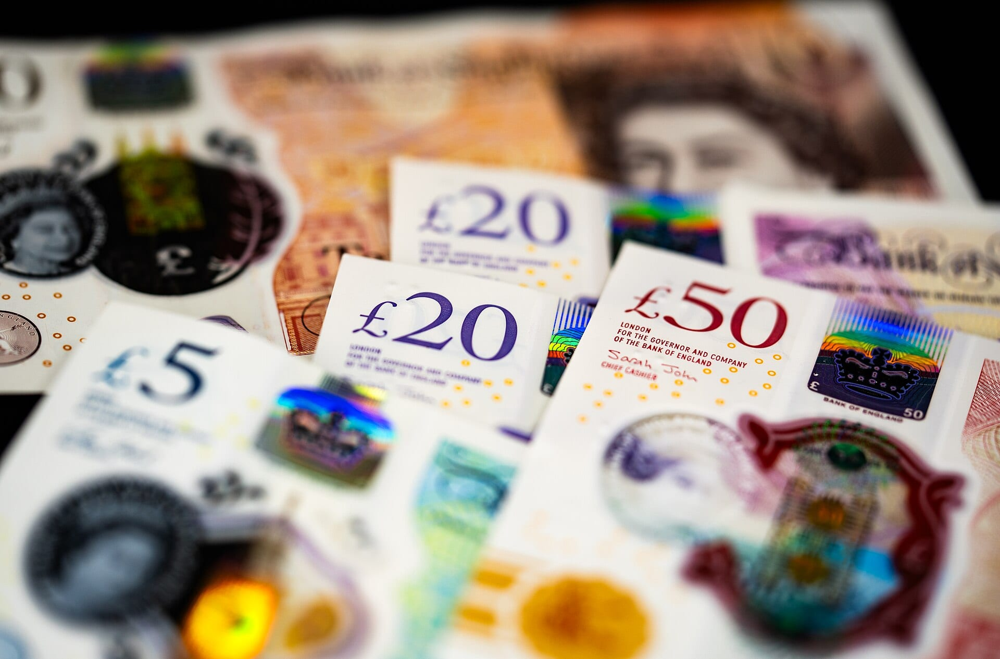
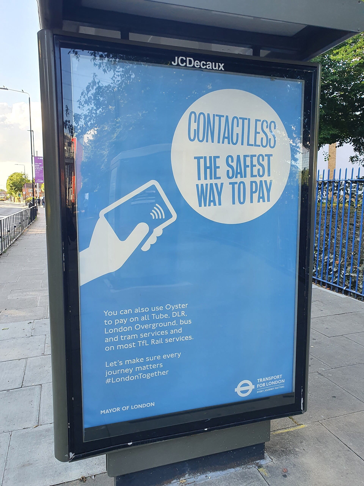
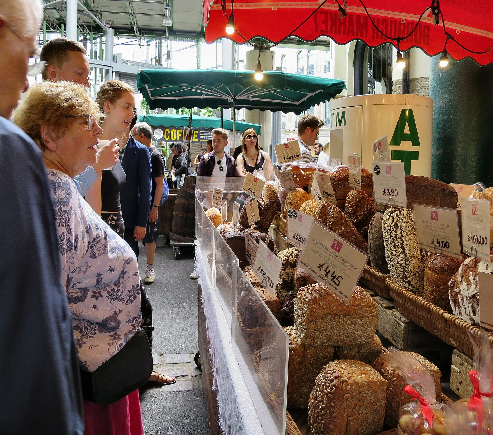
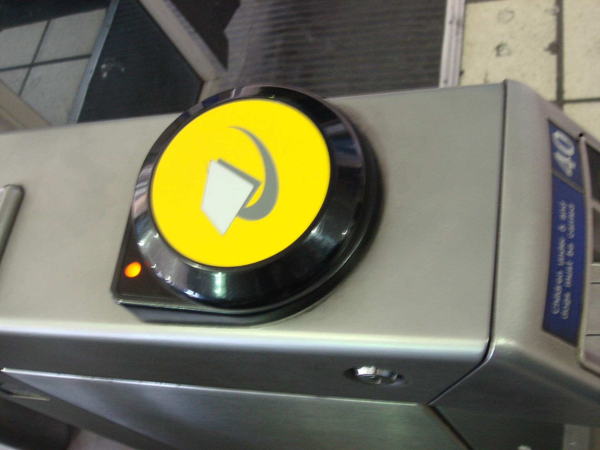

A card works almost everywhere in London — the Tube, the bus, the corner shop, the market stall's little white reader. But "London takes cards" and "London doesn't need cash" are different claims, and the second one is wrong often enough to catch visitors out: a bus that won't take your banknote, a museum café that's contactless-only, a tip that never reaches the waiter because it went through the machine. This is what actually happens to money in London, sourced to the Bank of England, the FCA, TfL, LINK and UK Finance rather than to habit.

> 💡 **The Short Version:** London runs on contactless — 67% of credit card and 76% of debit card transactions in the UK are now contactless, per UK Finance. The **contactless limit is £100** at every major bank, even though the FCA lifted the official cap in March 2026. **TfL buses take no cash at all**, and Wembley, Tottenham Hotspur Stadium, The O2 and OVO Arena are fully cashless. Cash machines are **free about 95% of the time** — LINK requires any charge to be shown on screen before you accept it. Carry **£20–£40** for markets, buskers and small independents. **Always choose to pay in pounds**, never the "convert to your currency" option, at a card machine or a cash machine. A **12.5% service charge** is common at restaurants and now goes to staff by law. And there's **no VAT refund** on London shopping — that ended in January 2021.

## The currency: what's actually in your wallet

British money is the **pound sterling (£)**, in notes of £5, £10, £20 and £50, and coins of 1p, 2p, 5p, 10p, 20p, 50p, £1 and £2.

**Two faces currently share the currency.** The Bank of England began issuing notes carrying King Charles III's portrait on 5 June 2024, but it didn't recall the old ones — notes featuring the late Queen Elizabeth II "remain legal tender and are co-circulating alongside King Charles III notes," and the Bank prints new notes only to replace worn ones or meet demand, not to force a changeover. The same policy applies to coins: King Charles III's effigy has been rolling out denomination by denomination since December 2022 — the 50p first, then the £1, the 5p from October 2025, and the 10p from August 2026, when the Royal Mint put more than seven million King Charles III 10p coins into circulation. Queen Elizabeth II coins keep working alongside them; the Mint puts the current total at 24.142 billion coins in circulation across the UK. Don't sort your change by portrait — both spend exactly the same.

*Bank of England polymer banknotes (£5, £20 and £50) with transparent holographic security windows.*

| Note | On the back | | Coin | Legal tender limit |
| --- | --- | --- | --- | --- |
| £5 | Winston Churchill | | 1p, 2p | Up to 20p |
| £10 | Jane Austen | | 5p, 10p | Up to £5 |
| £20 | J.M.W. Turner | | 20p, 50p | Up to £10 |
| £50 | Alan Turing | | £1, £2 | Unlimited |

### Paper notes stopped working in 2022

If you're holding an old-style paper note — the kind that bends rather than the newer, slightly waxy polymer — it's no longer usable in a shop. The last two, the paper **£20 and £50 (Series F)**, ceased to be legal tender on 30 September 2022, completing the Bank of England's move to polymer. That doesn't mean the money is gone: paper notes keep their face value, and the Bank of England will exchange them **with no deadline**. The easiest routes:

* **Pay it into a UK bank account.** Barclays, Halifax, Lloyds, Nationwide, NatWest and Santander all accept old paper notes as ordinary deposits.
* **51 Post Office branches** will swap it on the spot if it's £300 or less, you have photo ID, and you don't need a bank account.
* **Post it to the Bank of England** (Dept NEX, Bank of England, Langston Road, Loughton, Essex IG10 3TN) or take it to the Bank's own counter on Threadneedle Street, open Monday to Friday, 9.30am to 3pm. Postal exchanges are currently taking up to 90 working days.

### Scottish and Northern Irish notes

Three Scottish banks (Bank of Scotland, Clydesdale Bank, Royal Bank of Scotland) and three Northern Irish banks (Bank of Ireland UK, Danske Bank and NatWest, trading as Ulster Bank) also print their own sterling notes. They're the same money, backed pound-for-pound by the Bank of England, but they occupy an odd legal position that trips people up.

> ⚠️ **A Scottish or Northern Irish note can be turned down anywhere in the UK, including in Scotland or Northern Ireland.** They aren't legal tender at all — only Bank of England notes are, and only in England and Wales. London shops and machines mostly recognise and accept them, but "mostly" isn't "always": refusals of a Scottish £20 in an English shop are reported often enough to be worth planning around. If you're arriving from north of the border, either spend Scottish notes before you cross, or change them at a bank.

### What "legal tender" doesn't mean

This is the phrase visitors misuse most. The Bank of England is blunt about it: **"A shop owner can choose what to accept. If you want to pay for a pack of chewing gum with a £50 note, it is perfectly legal to turn you down."** Legal tender is a narrow rule about settling a debt in court, not a right to force any shop to take your cash, your card, or a specific note. A café that's gone card-only, a market stall that's cash-only, and a taxi that won't break a £50 for a £6 fare are all acting within their rights.

Powered by <a target="_blank" rel="sponsored" href="https://www.getyourguide.com/london-l57/">GetYourGuide</a>

## Cards: how far they actually go

**Card and contactless are the default, not the alternative.** UK Finance's most recent figures put contactless at **67% of credit card transactions and 76% of debit card transactions**, with an average tap worth just under £18. Chip-and-PIN, by contrast, has been the UK's standard since it fully replaced signature verification on 15 February 2006 — a change credited with a 95% fall in counterfeit card fraud since — and still carries the bigger purchases, averaging £93 a transaction.

**The contactless limit is £100 — for now, by choice rather than by law.** The FCA removed the single regulatory cap in March 2026, telling banks with strong fraud controls they could set their own limit. In March 2026, none of them had: Barclays, HSBC, Lloyds, Nationwide, NatWest, Santander and Monzo have all kept £100, and UK Finance says it's because there's no real customer demand for higher, plus shop card terminals would need reconfiguring. An FCA spokesperson put the reasoning behind the change this way: **"We want to make sure our rules provide flexibility for the future, and choice for firms, merchants and consumers."** Phone and watch payments work differently: Apple Pay and Google Pay verify you by face or fingerprint, so the £100 ceiling doesn't apply to them.

*A Transport for London bus shelter poster promoting contactless payment across the Tube, bus and rail networks.*

**American Express** is accepted at most major stores, hotel chains and sit-down restaurants, but noticeably less often at small independents, market stalls and some pubs — Amex's merchant fees run higher than Visa or Mastercard's, and plenty of smaller places simply don't take it. Carry a Visa or Mastercard as backup.

**A signature-only card from abroad can be a problem.** Most of the world has moved to chip-and-PIN, but a card that still relies on signature verification, or has no chip at all, will fail at machines that no longer support the fallback — including most self-service checkouts and TfL's gates. If your card is a magnetic-stripe or signature type, check with your bank before you travel.

**Foreign transaction fees and dynamic currency conversion are where visitors actually lose money.** Two separate charges can apply to a card issued outside the UK: a non-sterling transaction fee from your own bank (commonly a percentage of the spend), and, at the point of sale, an offer to "pay in your home currency instead of pounds." Take that offer and the exchange rate is set by the till or the cash machine, not by your card network — and it's reliably worse. Which? found British travellers abroad were charged **up to 13% more** when they paid in pounds instead of euros: the same trap, in reverse, as a visitor offered their home currency in London. The rule is the same at a shop, a restaurant, or a cash machine in London: **when asked to choose a currency, pick pounds sterling.** Your own bank's network (Visa, Mastercard or similar) will convert it at a market rate that's almost always better than the till's.

## Where you can't pay with cash — and where it still helps

**TfL's entire bus network has taken no cash since 2014** — pay by contactless, Oyster, or a valid Travelcard, or you can't board. The Tube, Overground, DLR and Elizabeth line still sell paper tickets from machines, but pay-as-you-go by card or [Oyster](/articles/oyster-card-guide-london/) is cheaper on almost every fare — see our [transport costs and fares guide](/articles/london-public-transport-costs-and-fares/) for the numbers.

**Plenty of cafés, restaurants and pubs have gone card-only too**, particularly newer openings and counter-service places — it's legal, per the Bank of England's own guidance above, and increasingly common, though it's still a minority of London's food and drink scene rather than the norm. Even [public toilets](/articles/public-toilets-london/) have joined the shift: all eight Royal Parks charge a flat 20p for theirs, and it's card or contactless only — the parks removed cash payment, so the coin you'd expect to need is the one thing that no longer works.

**Cash still earns its place in a few specific spots:**

* **Market stalls**, especially the smaller, more informal ones — plenty now take cards, but a float of coins speeds things up and covers the ones that don't.
* **Buskers and street performers**, including the licensed pitches on the [Underground and in Covent Garden](/articles/london-on-a-budget/) — the hat still goes round.
* **Tips**, where cash reaches the person who served you directly rather than going through a payroll system (more on this below).
* **Small independents**, particularly older cafés and stalls that have never installed a card reader — rarer every year, but still around.

*Prices displayed in pounds at Borough Market, with an ATM cash machine visible behind the stall.*

**London's biggest stadiums and arenas are fully cashless.** [Wembley Stadium](/articles/wembley-stadium-arena-guide/), the [Tottenham Hotspur Stadium](/articles/tottenham-hotspur-stadium-travel-guide/), [The O2 arena and indigo at The O2](/articles/the-o2-travel-guide/), and OVO Arena Wembley take contactless, mobile payment or a venue gift card only, so arrive with a card that works.

## Cash machines: cashpoints, ATMs — same thing

Britain uses all three terms interchangeably — **cash machine**, **cashpoint**, **ATM** — and LINK, the scheme that connects nearly every one of them, favours "cash machine" on its own site. Whatever you call it, here's how the charging actually works.

**Most cash machines are free, and the ones that aren't have to tell you first.** LINK's own network data, published 21 August 2026, counted **33,699 free-to-use machines against 8,693 pay-to-use ones in 2025** — about 80% free by number. Because people naturally use the free ones, the *proportion of withdrawals* that are free is even higher: LINK says **around 95% of cash withdrawals are free of charge**, with roughly £1.4 billion taken out of the network every week.

Where a machine does charge — commonly an independent, convenience-store operator such as Euronet, which runs pay-to-use machines under its YourCash brand in shops including Nisa Local and Bargain Booze, rather than the free machines banks provide — LINK's own rules require it to be upfront about the cost:

> LINK's rules on charging require: **an on-screen message stating when an operator charge will be applied**; the exact amount displayed on screen; **your positive acceptance of that specific charge before the withdrawal completes**; the option to cancel without being charged; and external signage on the machine itself warning that it charges.

In practice: read the screen before you confirm, and if a fee appears, you can always cancel and find a free machine instead — the [LINK Cash Locator](https://www.link.co.uk/) shows both, and bank branches and large supermarkets have free machines.

**Your own bank can also charge, separately from the machine.** This is a fee from your card issuer, not the cash machine, and LINK's Cash Locator won't show it — check with your bank before you travel. As an illustration, TSB charged its own customers a **2.99% non-sterling transaction fee** on cash withdrawals abroad in August 2026.

**Withdrawal limits are set by your own bank or card issuer, not by the machine**, and vary by account — check yours before relying on cash machines for a large sum. **On how much to carry:** transport, shops and restaurants mostly work by card, so most visitors don't need much — £20–£40 in notes and coins covers markets, a bus-fare mishap, tips and the odd cash-only counter, topped up as needed rather than carried in bulk.

Powered by <a target="_blank" rel="sponsored" href="https://www.getyourguide.com/london-l57/">GetYourGuide</a>

## Changing money before or during the trip

**Airport bureaux de change are the convenient option, not the cheap one** — compare the rate before you commit at arrivals. **The Post Office** sells over 60 currencies online for branch collection or home delivery, and its own site advertises **"0% commission"** pricing. High-street bureaux (in shopping centres and city-centre branches) sit between the two — check the rate they'll actually give you against the mid-market rate before handing over cash, since "0% commission" describes the fee structure, not the exchange rate itself, and a bureau can build its margin into the rate instead.

**Multicurrency cards are a fourth option.** Wise and Revolut, both open to customers in many countries, let you hold pounds and spend them on a linked debit card. Fees, exchange rates and limits vary by plan and change often, so check the provider's own site.

Whichever cash you end up holding, the same rule from the cards section applies at a bureau's own card machine or at a cash machine dispensing a foreign currency: if it asks whether you want to "guarantee" a rate in your home currency, decline it and pay in pounds.

## Tipping and service charges

**Nothing is compulsory**, but a **discretionary service charge of around 12.5%** is common on London restaurant bills, usually printed on the menu and added automatically to the total — you can ask for it to be removed if service was genuinely poor, though most people don't.

**Since 1 October 2024, that money is protected by law.** The **Employment (Allocation of Tips) Act 2023** — which received Royal Assent on 2 May 2023, followed by a statutory Code of Practice published on 22 April 2024 — makes it unlawful for an employer to hold back tips, gratuities or service charges from staff. GOV.UK estimates the change puts **an extra £200 million a year** into the pockets of more than 2 million hospitality, leisure and service workers, and gives staff the right to see their employer's tipping record. Many restaurants pool and distribute tips through a system called a **"tronc"** — a shared scheme for splitting tips fairly across a team rather than paying each server only what their own tables left.

* **Restaurants:** 10–15% if no service charge is already added; check the bill before adding twice.
* **Pubs and bars:** not expected for a drink at the bar; round up or leave a coin or two for table service.
* **Taxis, including black cabs:** round up rather than working to a fixed percentage.
* **Hotels:** £1–£2 for a porter carrying bags is normal; housekeeping tips are optional and less customary than in the US.

Restaurant discount schemes and set menus are a separate way to spend less on the bill itself before a tip is even calculated — see our guide to [restaurant discount cards in London](/articles/restaurant-discount-cards-london/).

## Prices, VAT and the border

**Every price you see already has tax in it.** VAT is charged at a standard rate of 20% (since 4 January 2011), and UK pricing law — the Price Marking Order 2004 — defines the "selling price" a trader must display as the final figure, **inclusive of VAT and all other taxes**. What's on the shelf, the menu or the till screen is what you pay; there's no tax added at the register the way there is in the US.

**There's no VAT refund for visitors.** Tax-free shopping for overseas visitors ended across Great Britain — England, Scotland and Wales — on 1 January 2021, and it hasn't come back. The one thing that still works is having a retailer ship a purchase directly to an address outside the UK, which zero-rates the sale at the till; our full guide to [tax-free shopping in London](/articles/tax-free-shopping-london/) covers exactly which stores offer it and what it saves.

**Carrying £10,000 or more in cash — in any currency, or as a family group's combined total — must be declared to UK customs**, whether you're entering or leaving Great Britain. You can declare online up to 72 hours before travelling, or in person at the "goods to declare" channel on arrival. Fail to declare when required and a Border Force officer can seize the cash, and you can be fined up to £5,000.

Powered by <a target="_blank" rel="sponsored" href="https://www.getyourguide.com/london-l57/">GetYourGuide</a>

## Card safety

**"Card clash" is a London-specific hazard.** Tap a wallet holding more than one contactless card, or a contactless card together with an Oyster card, against a Tube or bus reader, and it can charge the wrong card, charge two cards for one journey, or simply fail to read at all. Take the one card or phone you're using out of your wallet before you touch in — our [Oyster card guide](/articles/oyster-card-guide-london/) covers the daily-cap consequences of getting it wrong.

*The familiar yellow reader on a London Underground ticket barrier, where contactless bank cards, phones and Oyster cards touch in and out.*

**Card skimming is much rarer than it was.** UK Finance credits chip-and-PIN with a 95% drop in counterfeit and cloned-card fraud since 2006. The fraud that has grown instead is remote: UK Finance recorded **£215 million lost to remote purchase fraud in the first half of 2025 alone**. Treat any unexpected request for a banking code — by text, call or email — as suspicious, whoever it claims to be from.

**Every London black cab is required to take cards.** TfL's board mandated it from 31 October 2016, and since 1 January 2017 every licensed taxi has had to carry a card reader fixed inside the passenger compartment.

*Figures from the Bank of England, the Royal Mint, the FCA, TfL, LINK, GOV.UK and UK Finance, checked 12–17 September 2026. Rates, limits and bank policies change — always check the figure at the point of payment rather than relying on any guide, including this one.*

## Continue planning your London trip

- 💳 **[Oyster Card Guide](/articles/oyster-card-guide-london/)** — Oyster against contactless, and the card clash mistake that costs you twice
- 🚌 **[London Transport Costs and Fares](/articles/london-public-transport-costs-and-fares/)** — what pay-as-you-go actually costs, zone by zone
- 💷 **[London on a Budget](/articles/london-on-a-budget/)** — where the money really goes, and what's free
- 🛂 **[The UK ETA Guide](/articles/uk-eta-guide/)** — the £20 permit to sort before you fly, not after you land
- 📱 **[Travel SIM and eSIM Guide](/articles/travel-sim-esim-guide/)** — mobile data compared, so you're not paying roaming rates to check an exchange rate
- 🛍️ **[Tax-Free Shopping in London](/articles/tax-free-shopping-london/)** — why there's no VAT refund, and the one route that still works
- 🍽️ **[Restaurant Discount Cards](/articles/restaurant-discount-cards-london/)** — cutting the bill before the tip is even calculated
- 🚻 **[Public Toilets in London](/articles/public-toilets-london/)** — including the ones that still want a coin
- 🏟️ **[Wembley Stadium Guide](/articles/wembley-stadium-arena-guide/)**, **[Tottenham Hotspur Stadium Guide](/articles/tottenham-hotspur-stadium-travel-guide/)** and **[The O2 Travel Guide](/articles/the-o2-travel-guide/)** — all cashless, all covered in detail
