There are two ways a London pub gets called beautiful, and the lists split between them.

One is **the room**: a late Victorian gin palace with its etched glass, mirrors and carved mahogany still in place. Those are judged, because the Campaign for Real Ale keeps a **register of pub interiors of national importance** and rates them from one star to three. The other is **the outside** — flowers, a riverside terrace, a building in a cobbled lane — which is what gets photographed, and which nobody judges at all.

This guide counts both. Where a pub is here mainly for its age and its stories, our [guide to London's historic pubs](/articles/historic-pubs-dining-rooms-london/) goes further into those.

> 💡 **The Short Version:** **The Churchill Arms** is named by more sources than anywhere, for its flowers. **The Blackfriar** and **The Princess Louise** are the interiors the lists agree on most, and both hold CAMRA's three stars. **The Viaduct Tavern** and **Ye Olde Mitre** are closed on Sundays. And the newest award-winning room in London is **The Blue Stoops** in Kensington, a former wine bar.

> 📊 **The evidence behind this guide.**
> Nothing here rests on one visit. This pass reads **17 independent sources carrying 259 citations** across **187 named venues**. **38 are named by two or more sources; 129 carry a CAMRA rating or design award.**
> **Built on:** CAMRA's National Inventory and its Pub Design Awards, counted as one source; four publications including SquareMeal and Historic England's blog; eight independent guides and blogs; and four video creators, counted per creator.
> *Evidence built 14 September 2026 · [How we rank →](/how-we-rank/)*

## Where they are

| If you are near… | Where to look |
| --- | --- |
| **Holborn & Fleet Street** | The Princess Louise, Cittie of Yorke, Ye Olde Mitre, The Punch Tavern, Ye Olde Cheshire Cheese |
| **St Paul's & Blackfriars** | The Viaduct Tavern, The Blackfriar |
| **Oxford Street & Soho** | The Argyll Arms, The Flying Horse, The Champion |
| **Covent Garden & St James's** | The Salisbury, Red Lion on Duke of York Street, St James Tavern |
| **Kensington & Chelsea** | The Churchill Arms, The Cadogan Arms, The Blue Stoops, The Windsor Castle |
| **Maida Vale & Kilburn** | The Prince Alfred, The Warrington, The Black Lion |
| **Hampstead** | The Holly Bush, The Spaniards Inn |
| **Greenwich & the river** | The Trafalgar Tavern, The Dickens Inn |
| **North & east** | The Salisbury in Harringay, The Queens in Crouch End, The Palm Tree in Bow, The Boleyn Tavern in East Ham |

## When they're open

| | |
| --- | --- |
| **Closed on Sunday** | The Viaduct Tavern, Ye Olde Mitre |
| **Close early on Sunday** | Red Lion, Duke of York Street, and Cittie of Yorke, both at 6pm |
| **Evenings only on weekdays** | The Black Lion in Kilburn from 4pm Monday to Friday; The Salisbury in Harringay from 5pm Monday to Thursday |
| **Open seven days** | The Blackfriar, The Princess Louise, The Punch Tavern, The Argyll Arms, The Churchill Arms |

The City pubs are built for office workers, so a weekday afternoon is the time to see the rooms without a crowd in them.

---

## The interiors the lists agree on

### The Blackfriar — friars in marble and mosaic

*Blackfriars · Cited by 6 sources · CAMRA National Inventory, three stars*

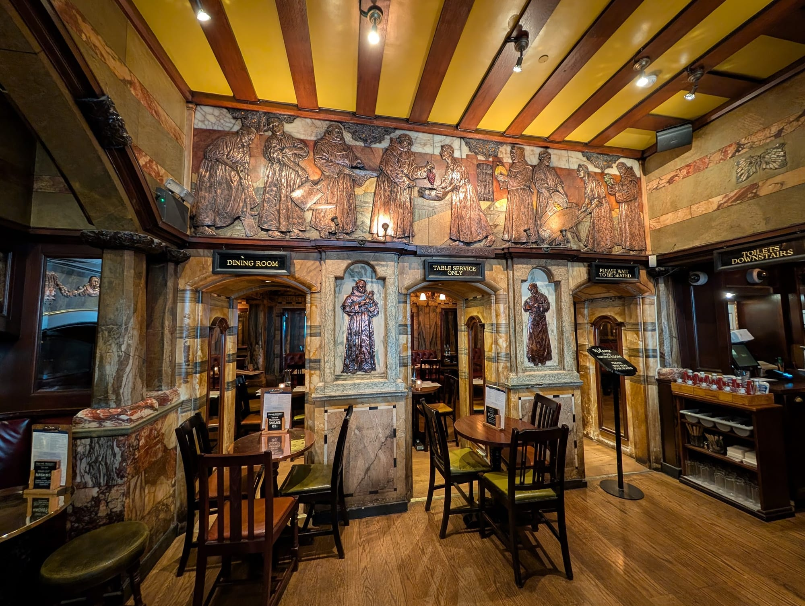

*Bronze reliefs of friars by Frederick T. Callcott and Henry Poole, from the remodelling around 1905.*

A thin wedge of a building standing alone by Blackfriars station, on the site of a Dominican friary. It was built in the 1870s and **remodelled around 1905 by the Arts and Crafts sculptors Frederick T. Callcott and Henry Poole**, who covered the inside in jolly friars: in bronze reliefs, in carvings over the doors, in a mosaic above the entrance, alongside great swathes of marble and glittering mosaics.

CAMRA, SquareMeal and four independent guides all name it. **Open seven days a week.** How John Betjeman's campaign saved it from demolition is in our [historic pubs guide](/articles/historic-pubs-dining-rooms-london/).

### The Princess Louise, Holborn — tiles, mirrors and a listed urinal

*Holborn · Cited by 6 sources · CAMRA National Inventory, three stars*

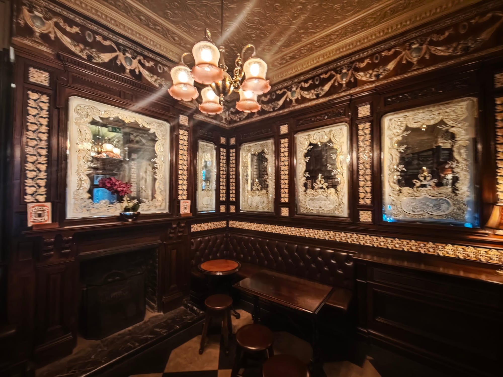

*One of the small wood-and-glass booths, lined with etched and gilt mirrors.*

Discover Britain calls it possibly the most beautiful pub in London, and **Historic England put it on its list of the ten best gin palaces in the country**. Behind a plain High Holborn frontage are brightly coloured tiles, gilt mirrors, etched glass and a bar divided into small wood-and-glass booths, the original Victorian way of keeping drinkers apart.

Four of the six sources send you to the gents: **the marble urinals downstairs are part of the listed interior**. Open every day, noon to 11pm, and 10.30pm on Sunday, with food at lunch and in the early evening. A Lady in London filmed it as some of the most beautiful Victorian interiors in the city.

### The Viaduct Tavern, St Paul's — Pre-Raphaelite paintings opposite the Old Bailey

*St Paul's · Cited by 4 sources · CAMRA National Inventory, three stars · [the pub's site](https://www.viaducttavern.co.uk/)*

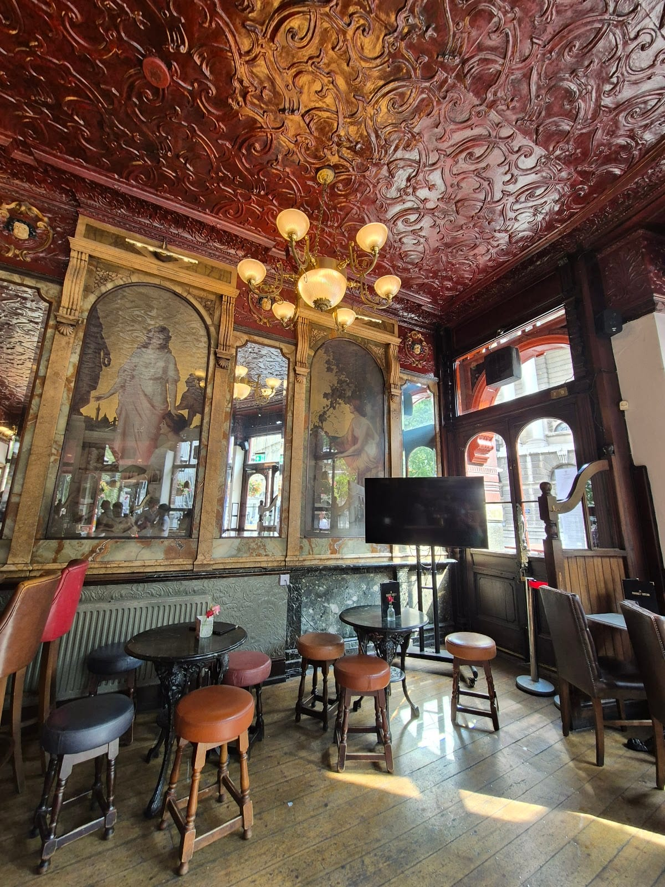

*Historic England describes this wall as alternating mirrors and Pre-Raphaelite-style paintings in marble and alabaster frames.*

Opened in 1869 across from the Old Bailey, and **remodelled between 1898 and 1900 under Arthur Dixon**, an Arts and Crafts designer. Historic England describes a wall of alternating mirrors and paintings of Pre-Raphaelite-style women set in marble and alabaster frames; The 500 Hidden Secrets adds etched glass and a rich red ceiling. The gin list is long, as a gin palace's should be.

**Closed on Sunday, and on Saturday it shuts at 8pm.** Monday to Friday it runs from 11am to 11pm, which is when to go.

### The Argyll Arms, Oxford Circus — the mirrors that survived the Blitz

*Oxford Circus · Cited by 4 sources · CAMRA National Inventory, three stars*

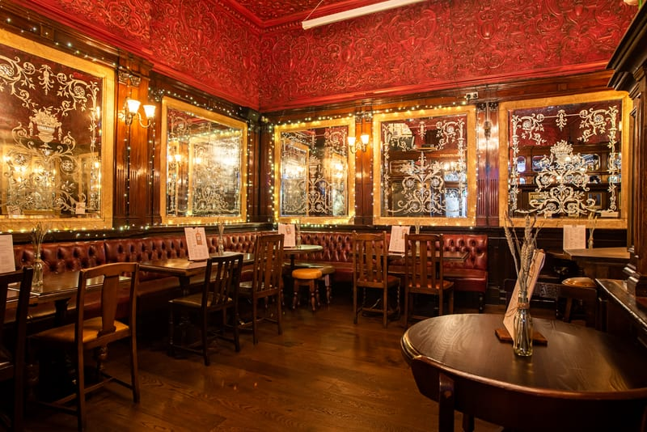

*These mirrors are the pub's famous feature — Historic England and Discover Britain both note that they survived the Blitz.*

Seconds from Oxford Circus and, according to Historic England, **little changed from Victorian times in parts**. The large mirrors are the famous feature: both Historic England and Discover Britain point out that they survived the Blitz. The layout still has the small separate drinking areas that once kept one class of customer from another, with carved wood and glass screens between them.

**Open seven days**, and to midnight on Friday and Saturday. It is on three publications' lists, the most of any pub here outside the CAMRA register.

### The Prince Alfred, Maida Vale — duck under the snob screens

*Warwick Avenue · Cited by 4 sources · CAMRA National Inventory, three stars*

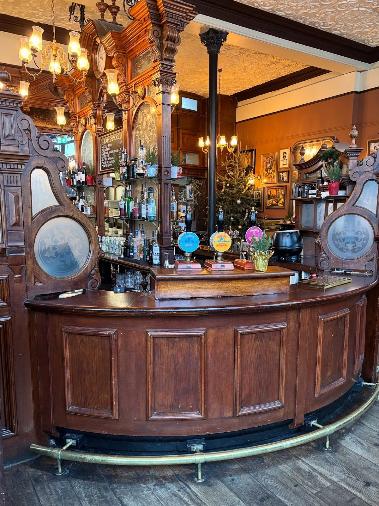

*The glass-and-timber snob screens that split the bar into separate compartments.*

Trading since 1856, and the best example on this page of **how a Victorian pub was divided**. Its glass-and-timber snob screens split the bar into separate compartments, each with its own door to the street, and you have to duck through low doorways to move between them. Colourful original tiles and a mosaic floor; the old basement coal store is now seating.

A Young's pub, **open seven days** and serving a Sunday roast. [The Warrington](#further-out-and-worth-the-trip), another three-star interior, is a few streets away.

### The Salisbury, Covent Garden — candelabras shaped like women

*Leicester Square · Cited by 3 sources · CAMRA National Inventory, three stars*

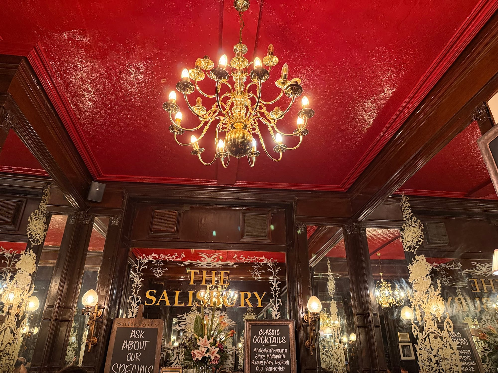

*Etched glass at The Salisbury, whose interiors date from around 1900.*

A large pub on St Martin's Lane full of theatregoers, with **etched glass panels, a sweeping mahogany bar and interiors from around 1900**. The detail to look for, from The 500 Hidden Secrets: the original candelabras, made as women holding glowing flowers.

Open until 12.30am on Friday and Saturday, and it serves pub classics and a Sunday roast. **Not to be confused with The Salisbury in Harringay**, further down this guide.

### Red Lion, Duke of York Street — the complete gin palace

*Piccadilly Circus · Cited by 3 sources · CAMRA National Inventory, three stars · [the pub's site](https://www.redlionmayfair.co.uk/)*

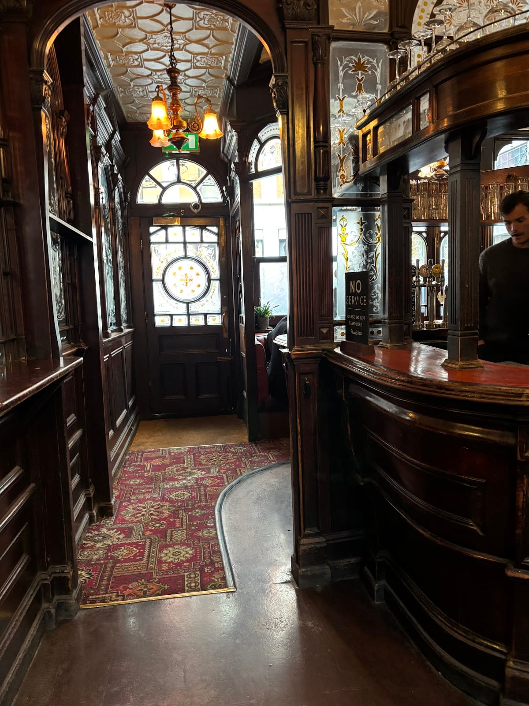

*Dark wood and etched glass at the Red Lion, a complete Victorian gin palace on a St James's side street.*

A Fuller's pub on a St James's side street, which takes table bookings online, and which London Luke's channel filmed for **its original Victorian gin palace interior**, all etched glass and mirrors. SquareMeal put it on its list of London's picturesque pubs, and CAMRA gives it three stars.

**On Sunday it closes at 6pm, and on Monday and Tuesday at 10pm.** Not the Red Lion on Crown Passage nearby, nor the one on Whitehall.

### The Flying Horse, Oxford Street — the last pub on Oxford Street

*Tottenham Court Road · Cited by 3 sources · CAMRA National Inventory, three stars*

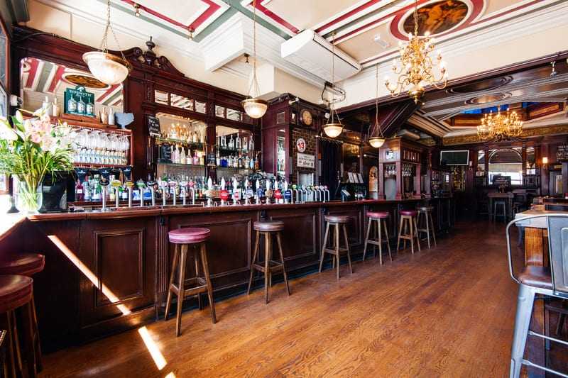

*The Flying Horse, rebuilt in 1893 and the last pub left on Oxford Street.*

Historic England and Discover Britain both name it among the best gin palaces in London, Historic England under its old name, **The Tottenham**. It is **the last pub left on Oxford Street**, rebuilt in 1893, and Historic England says there is something of a Victorian music hall — it once stood a few doors from one — about the inside.

Open every day, to midnight on Saturday. Right by Tottenham Court Road station.

### The Punch Tavern, Fleet Street — a skylight and a pink marble bar

*Blackfriars · Cited by 3 sources · CAMRA National Inventory, two stars · [the pub's site](https://www.urbanpubsandbars.com/venues/punch-tavern)*

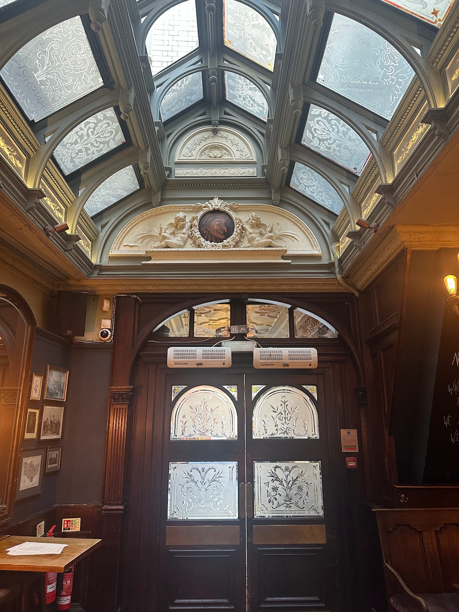

*The barrel-vaulted skylight over the entrance passage, from the 1890s rebuild by Saville and Martin.*

Rebuilt between 1893 and 1897 by the architects Saville and Martin, who also did The Flying Horse. **A tiled entrance passage under a barrel-vaulted skylight** leads into a bar with its mosaic floor, cut-glass mirrors, painted panels and a pink marble bar counter still there, according to Discover Britain. It was named after *Punch* magazine, whose staff drank here.

Open seven days, and there is a cocktail bar hidden upstairs.

---

Powered by <a target="_blank" rel="sponsored" href="https://www.getyourguide.com/london-l57/">GetYourGuide</a>

## The outsides

### The Churchill Arms, Kensington — flowers in summer, Christmas trees in December

*Notting Hill Gate · Cited by 7 sources · CAMRA National Inventory, two stars · [the pub's site](https://www.churchillarmskensington.co.uk/)*

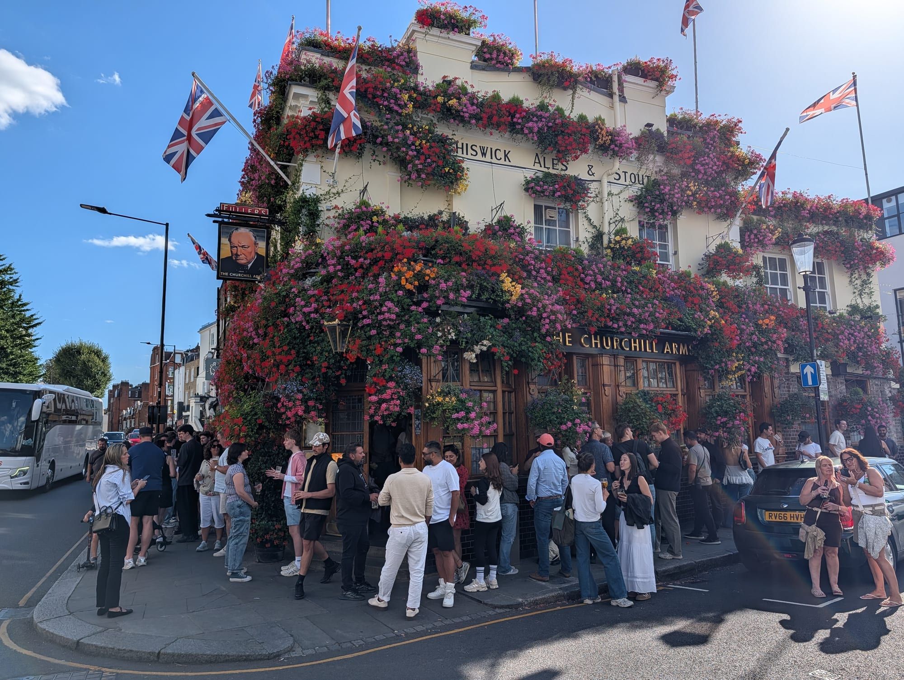

*Kensington Church Street in summer. In December the flowers are swapped for Christmas trees.*

**Named by seven sources, more than any other pub in this guide**, and almost all of them for the outside. Secret London calls it "the most photographed pub in all of London": the whole frontage is covered in flower baskets in summer, and in December the pub replaces them with a wall of Christmas trees and lights.

Inside is less famous and nearly as full — ceilings hung with wartime memorabilia, pots and tankards — and CAMRA rates the interior two stars. It has **run a Thai kitchen for more than 35 years**. Open every day. Go early for a photograph without the crowd on the pavement.

### The Holly Bush, Hampstead — the pub at the top of the lane

*Hampstead · Cited by 5 sources · CAMRA National Inventory, two stars · [the pub's site](https://www.hollybushhampstead.co.uk/)*

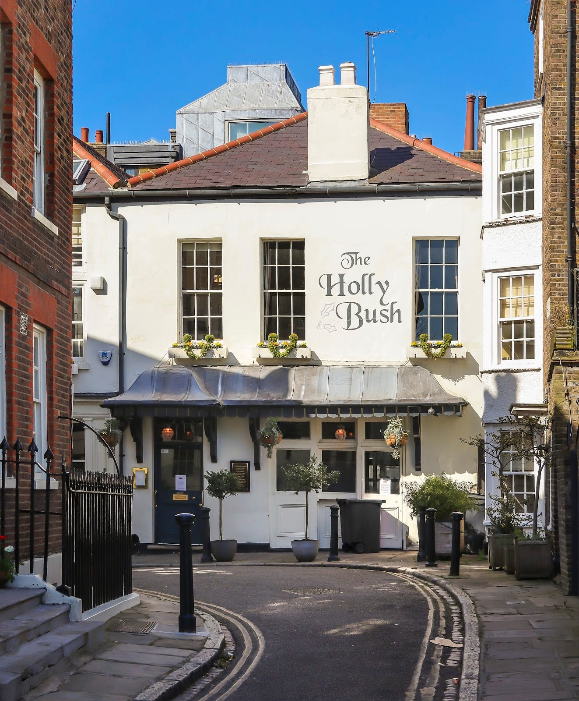

*The Holly Bush on Holly Mount, a cobbled lane in Hampstead village.*

Tucked up Holly Mount, a cobbled lane in Hampstead village, and Secret London's runner-up for the most-photographed pub in London. Architectour Guide describes the inside as **oak-panelled rooms with etched glass, a log fire** and a slightly ramshackle feel, with more seating upstairs.

It takes table bookings online and serves traditional seasonal food. An easy pairing with a walk on the Heath and [The Spaniards Inn](#the-spaniards-inn-hampstead--on-the-edge-of-the-heath).

### The Spaniards Inn, Hampstead — on the edge of the Heath

*Hampstead · Cited by 5 sources*

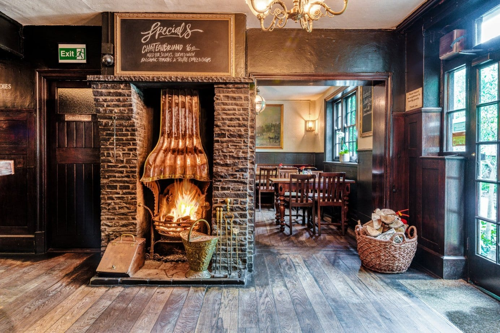

*The fire at The Spaniards Inn, on the edge of Hampstead Heath.*

On Spaniards Road across the top of Hampstead Heath. Five sources name it, and Secret London's writers include it twice — once for the fire and the corgi, once for how it looks in snow. **Open every day from 10am, Tuesday to Saturday.**

It is here for looks; the legends of highwaymen and poets are in our [historic pubs guide](/articles/historic-pubs-dining-rooms-london/).

### The Trafalgar Tavern, Greenwich — on the river by the Naval College

*Cutty Sark · Cited by 3 sources · [the pub's site](https://www.trafalgartavern.co.uk/)*

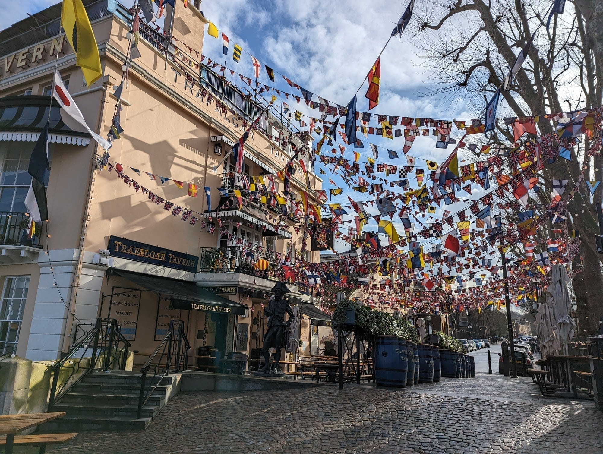

*The terrace, dressed in signal flags.*

Right on the Thames beside the Old Royal Naval College. Secret London says it could have made the list just for its riverside perch, but that inside there are **several floors of handsome rooms**, the main pub kept plain so the river views do the work. A local on TikTok filmed it simply to say how pretty it is.

It takes online bookings for the pub, the Nile restaurant and the terrace, and it opens to midnight on Friday and Saturday.

### Ye Olde Mitre and Ye Olde Cheshire Cheese — two City warrens

*Chancery Lane · Cited by 3 sources each · CAMRA National Inventory, three stars each*

*Ye Olde Mitre's sign in Ely Court. Photo: [Ewan-M](https://www.flickr.com/photos/55935853@N00/4224779897), [CC BY-SA 2.0](https://creativecommons.org/licenses/by-sa/2.0/).*

Both are on CAMRA's three-star register and both are mostly famous for their age, so their full entries are in our [historic pubs guide](/articles/historic-pubs-dining-rooms-london/). For looks: **Ye Olde Mitre** is reached down an alley off Hatton Garden, and **Ye Olde Cheshire Cheese** off Fleet Street is a dark warren of wood-panelled rooms. **Ye Olde Mitre is closed on Sunday** and closes at 9pm on Saturday.

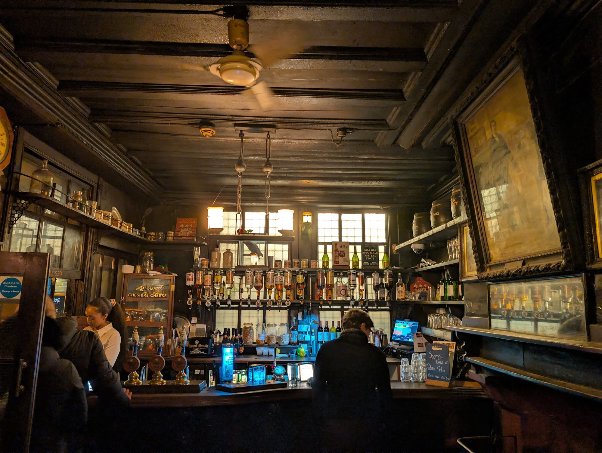

*Ye Olde Cheshire Cheese, a dark warren of wood-panelled rooms off Fleet Street.*

### The Dickens Inn, St Katharine Docks — flowers on three balconies

*Tower Hill · Cited by 2 sources*

*A converted warehouse, not the eighteenth-century inn it looks like.*

The other big flower display on the lists. Three tiers of wooden balconies overlook the marina at St Katharine Docks, all hung with baskets. Secret London calls it impossible to leave off a list of pretty pubs; Love and London describes a tavern bar on the ground floor with a grill restaurant above. It is a converted warehouse dressed as an old inn, and the balconies are the reason it is on the lists. Open daily from noon, and from 11am at weekends.

---

Powered by <a target="_blank" rel="sponsored" href="https://www.getyourguide.com/london-l57/">GetYourGuide</a>

## Restored and rebuilt: the design awards

CAMRA's Pub Design Awards, run with Historic England, judge new work — restorations, conversions and new buildings — rather than old fabric. These are the London results from the last five years.

### The Black Lion, Kilburn — Historic England's conservation award

*Kilburn · Cited by 2 sources · CAMRA National Inventory, three stars · CAMRA Pub Design Awards 2023, Historic England Award for Conservation*

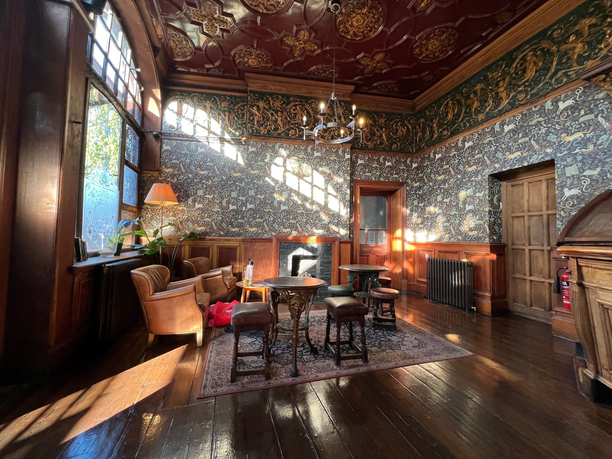

*The rich ceiling and decorative cornice, two of the details CAMRA's judges describe.*

A Grade II*-listed pub from 1898, and **the 2023 winner of Historic England's conservation award**: CAMRA's judges describe a rich ceiling, the original bar counter and island back bar, a screen, etched and cut glass and a very decorative cornice. Secret London says the restoration made it bright rather than dark and fusty.

It now serves **contemporary Indian food** during the week and a roast on Sunday. **Weekdays it opens at 4pm.** Opposite the Kiln Theatre, two minutes from Kilburn station.

### The Cadogan Arms and The George — the refurbishments

*Chelsea and Fitzrovia · Cited by 2 sources each · CAMRA Pub Design Awards 2023*

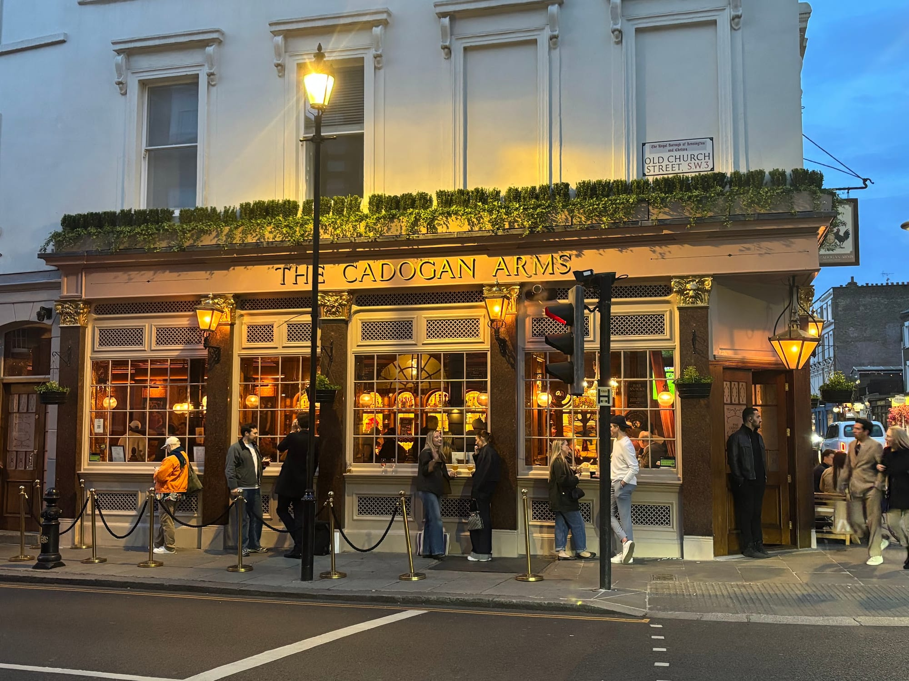

*The Cadogan Arms on the King's Road, winner of the 2023 Refurbishment Award.*

Two pubs from the same owners, recognised in the same year. **The Cadogan Arms** on the King's Road won the 2023 Refurbishment Award for recreating the building's lost early Georgian details and timber panelling. **The George** on Great Portland Street was highly commended for its restored bar, where the judges picked out a five-bay back-fitting of etched and gilded mirrors and painted tiles of hunting dogs and a stag. Both are also in our [gastropubs guide](/articles/best-gastropubs-london/) for their kitchens. The George serves food all day, every day; The Cadogan Arms stays open until 1am on Friday and Saturday.

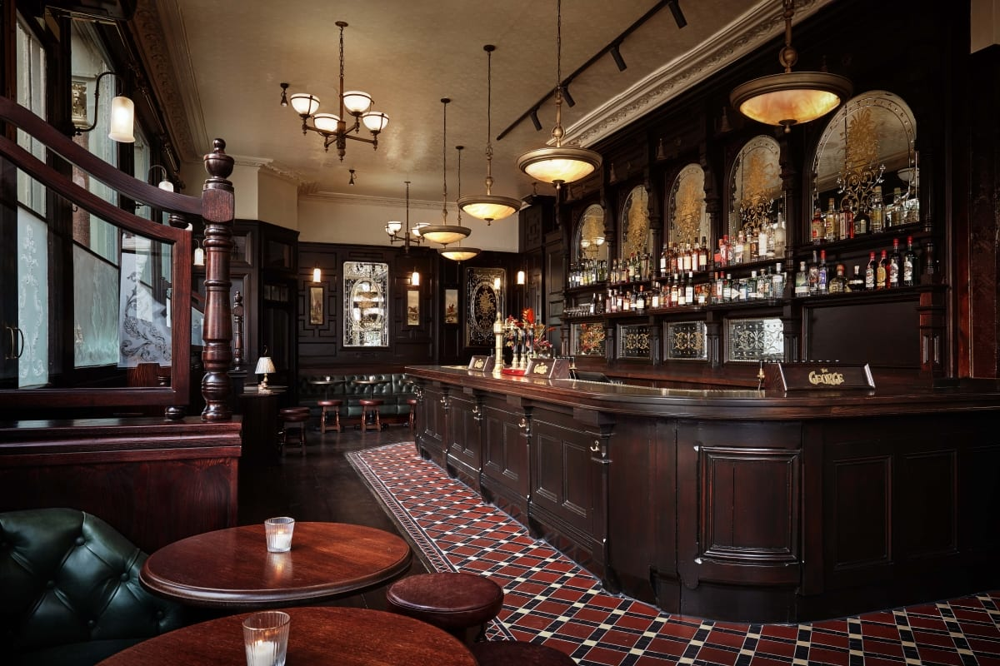

*CAMRA's judges highly commended this five-bay back-fitting of etched and gilded mirrors when The George was recognised in 2023.*

### The Blue Stoops, Kensington — the newest winner

*Kensington · Cited by 1 source · CAMRA Pub Design Awards 2026, Conversion to Pub Use*

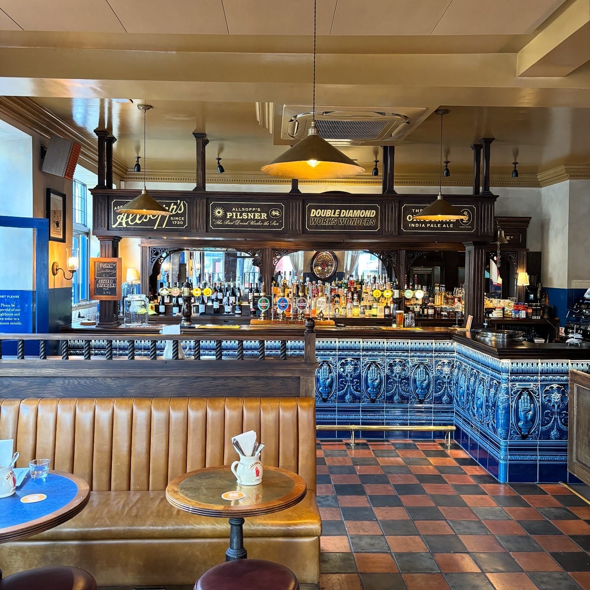

*CAMRA's judges singled out this ceramic bar front carrying the old Allsopp's brewery trademark when the pub won the 2026 conversion award.*

**A pub in the building that used to be the Kensington Wine Rooms**, and the 2026 conversion winner. CAMRA's judges point to the half-height partitions and glazed screens that break up the room, new fixed seating, and a ceramic bar front carrying the old Allsopp's brewery trademark. It is the Allsopp's brewery's pub, open every day from noon, at 127–129 Kensington Church Street — **a short walk up the same street from The Churchill Arms**, so see both together.

### Also recognised

- **The Leyton Engineer** — 2026 Refurbishment winner: the Grade II-listed 1895 former Leyton Town Hall, with its glazed screens and mosaic and terrazzo floors restored.
- **The Lord Southampton**, Kentish Town — 2026 Community Local winner: a near-derelict 1850s pub with its floorboards and wall panelling restored and new hand-painted signs.
- **The Duke of York**, Fitzrovia — commended in 2026 for a ceramic-tiled bar counter.
- **The Boleyn Tavern**, East Ham — 2022 Community Local winner after a £1.5 million restoration of the 1899 pub, which put back its seven-bar layout under a coloured glass skylight. Three stars from CAMRA too. Opens at 4pm Monday to Wednesday.
- **The Spread Eagle**, Wandsworth — highly commended for conservation in 2023, for its etched glass and external canopy.

---

## Further out, and worth the trip

- **[The Warrington](https://www.thewarringtonhotel.co.uk/)**, Maida Vale — tiled columns and a mosaic floor at the door, stained glass, art nouveau friezes and a marble-topped bar, per The 500 Hidden Secrets. Three stars from CAMRA. *Cited by 2 sources.*

  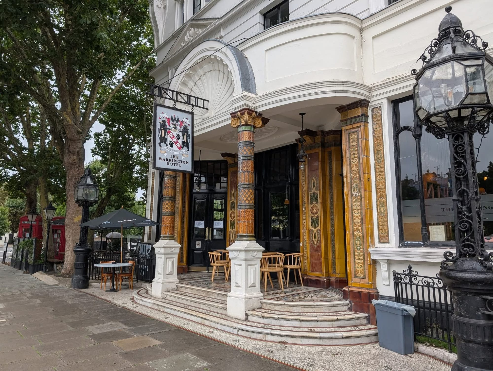

  *The tiled columns at the door of The Warrington, one of CAMRA's three-star interiors.*

- **The Salisbury**, Harringay — Historic England's pick for elaborate wrought-iron screens, tiled lobbies and mosaics, and a billiard room under a vine-painted glass roof. Opens at 5pm Monday to Thursday. *Cited by 2 sources.*

  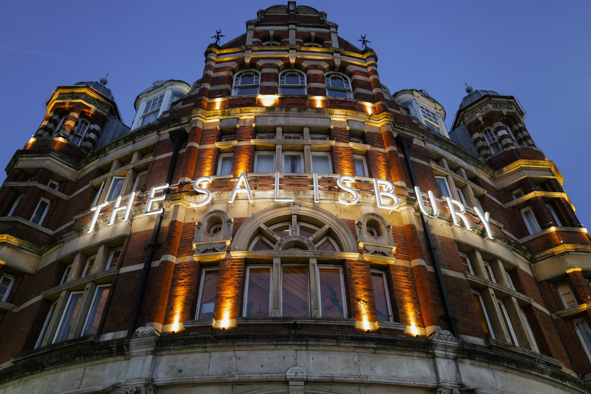

  *The Salisbury in Harringay, Historic England's pick for its wrought-iron screens, tiled lobbies and mosaics.*

- **The Queens**, Crouch End — art nouveau stained glass, a mosaic entrance floor and a huge original bar between decorative partitions. *Cited by 2 sources.*

  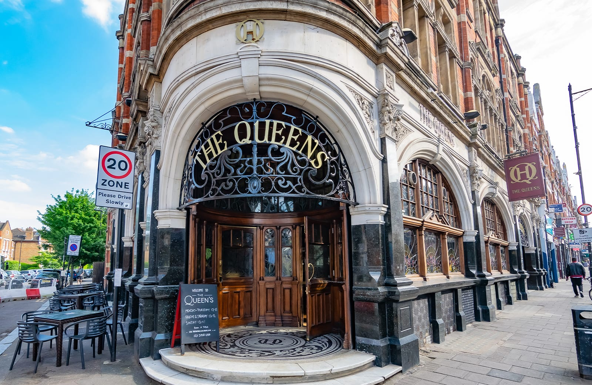

  *The entrance to The Queens in Crouch End, with its mosaic floor at the door.*

- **The Palm Tree**, Bow — standing alone in a park off Grove Road, with a gold oval bar, flock wallpaper and boxing photos, according to Nuff, which says it is cash only and has jazz Thursday to Sunday. *Cited by 2 sources.*

  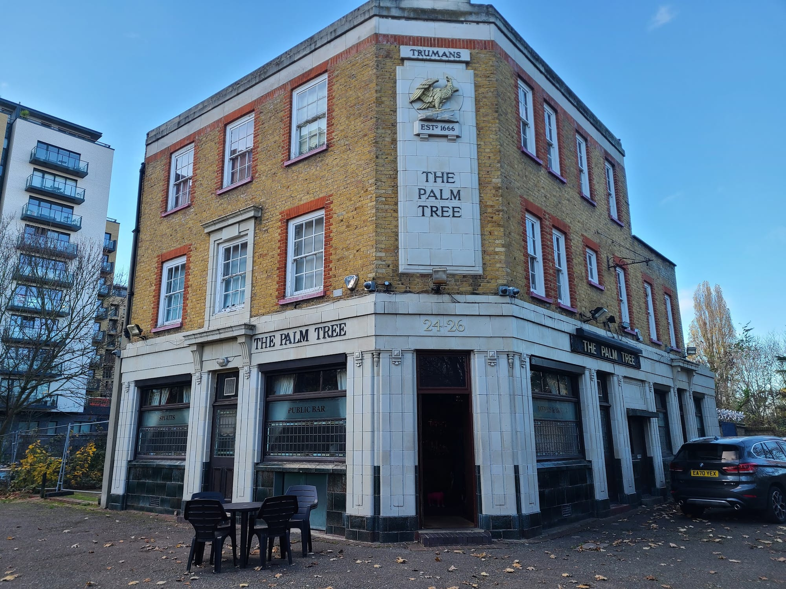

  *The Palm Tree in Bow, standing alone in a park off Grove Road.*

Powered by <a target="_blank" rel="sponsored" href="https://www.getyourguide.com/london-l57/">GetYourGuide</a>

## One-offs

- **The Champion**, Fitzrovia — its "Victorian" stained glass and mahogany are, as the beer historians Boak & Bailey found, a **1954 design by the architects Sylvia and John Reid**. A fake old pub, and a good-looking one.
- **St James Tavern**, Soho — a Victorian pub rebuilt in 1896, with theatre-themed tiles made for it by Doulton in the 1930s.
- **Mr Fogg's Tavern**, Covent Garden — a new pub made to look like a Victorian one and crammed with curiosities. *Cited by 2 sources.*

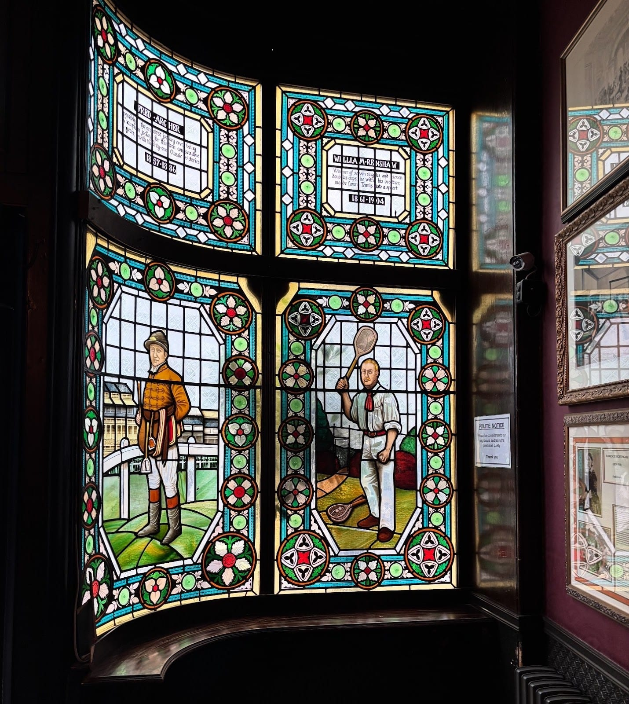

*The beer historians Boak & Bailey found that this "Victorian" glass is actually a 1954 design by the architects Sylvia and John Reid.*

## A gin palace route, Holborn to Blackfriars

Five of the three-star interiors sit close enough to see in one weekday afternoon, in this order: **The Princess Louise** and **Cittie of Yorke** on High Holborn, **Ye Olde Mitre** down its alley off Hatton Garden, **The Viaduct Tavern** opposite the Old Bailey, and **The Blackfriar** by the river. **Don't try it on a Sunday** — the Mitre and the Viaduct are shut.

Cittie of Yorke's back bar is the one to look for on the way: The 500 Hidden Secrets describes a mock-Tudor hall with a huge roof, giant wooden vats and carved booths, built in the 1920s to look far older. It closes at 6pm on Sunday.

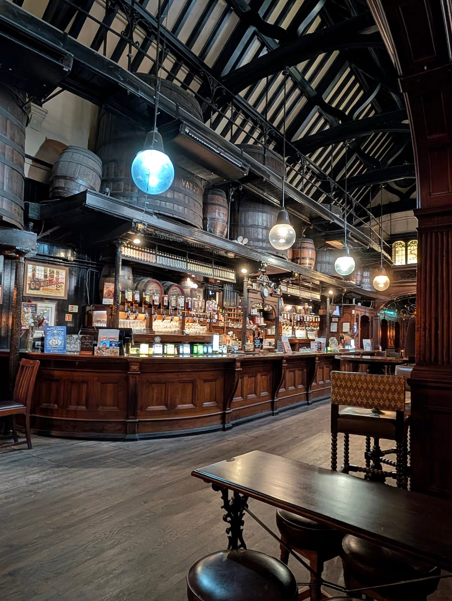

*The 500 Hidden Secrets describes this mock-Tudor hall, built in the 1920s to look far older, with its huge roof and giant wooden vats.*

## What to know

**CAMRA's stars rate what survives inside**, not the food or the beer. Three stars means an interior of outstanding national importance; London has 60 of them.

**A listed interior is protected, but the pub isn't frozen.** Several of these rooms have been restored or rebuilt — The Champion's "Victorian" glass dates from 1954 and Cittie of Yorke was built in the 1920s — and the design awards exist to reward good new work.

**Be discreet with a camera.** These are working pubs, several of them small, and a phone held up in the middle of a crowded Friday bar will not be welcome. Weekday afternoons are quieter.

---

## Continue planning your London trip

- 🏛️ **[London's Historic Pubs and Dining Rooms](/articles/historic-pubs-dining-rooms-london/)**
- 🍽️ **[The Best Gastropubs in London](/articles/best-gastropubs-london/)**
- 🍺 **[The Best Craft Beer Pubs in London](/articles/best-craft-beer-pubs-london/)**
- 🍺 **[The Best Wetherspoons in London](/articles/best-wetherspoons-pubs-london/)**
- 🚶 **[City of London Walk](/articles/city-of-london-walk/)**
- 📸 **[The Most Instagrammable Restaurants in London](/articles/most-instagrammable-restaurants-london/)**
