Some rooms are booked for the cooking and some are booked for the photograph, and this page is only about the second kind.

That distinction matters more than it sounds. **Every venue below is ranked by how many independent guides name it for its interior**, not by how it eats. A few are among the better kitchens in London. One is a chain. One is a viewing platform with restaurants inside it. Where a room is better looking than it is good, this page says so.

> 📌 **The short version.**
> **Bacchanalia**, Mayfair, is named by six of seven sources — more than any other room in London. **Sketch** and **Circolo Popolare** follow on five each. The cheapest genuinely striking room is **Bar Douro** in Borough at ££. The one people get wrong is **Sky Garden**: the garden is free with a booked slot, the restaurants inside it are not.

> 📊 **The evidence behind this guide.**
> Nothing here rests on one visit. This pass reads **7 sources carrying 148 citations** across **105 named venues** — three editorial mastheads (DesignMyNight, HELLO!, Country & Town House) and four independent specialists. **23 rooms are named by two or more independent sources.**
> *Evidence rebuilt 3 September 2026 · [How we rank →](/how-we-rank/)*

> ⏱️ **How far ahead to book.**
> **Months:** Sessions Arts Club. **Weeks:** Bacchanalia, Sketch, Circolo Popolare, Ave Mario, Gloria, Bob Bob Ricard, NoMad London, Spring, Isabel, Joia, Petersham Nurseries, Seabird, Winter Garden. **Days:** Brasserie of Light, Dalloway Terrace, Bar Douro, Sucre, Tattu, Sticks'n'Sushi, The Ivy Chelsea Garden. **Timed slot, book free in advance:** Sky Garden.

## Where they are

  

    Map of the most Instagrammable restaurants in London
  

  

    
Loading the interactive map…

  

  

    <i class="restaurant-map-key restaurant-map-key--editorial" aria-hidden="true"></i> Named in this guide
  

  <noscript>
    
The interactive map requires JavaScript. Every entry below lists its area and nearest station.

  </noscript>

| If you are near… | Where to go |
| --- | --- |
| **Mayfair** | Bacchanalia, Sketch, Brasserie of Light, Isabel |
| **Fitzrovia & Tottenham Court Road** | Circolo Popolare, Tattu |
| **Covent Garden & the Strand** | Ave Mario, NoMad London, Spring, Bancone |
| **Soho** | Bob Bob Ricard, Sucre |
| **Shoreditch & Clerkenwell** | Gloria, Sessions Arts Club |
| **The City** | Sky Garden |
| **Bloomsbury & Marylebone** | Dalloway Terrace, Winter Garden |
| **Chelsea & Kensington** | The Ivy Chelsea Garden, Jacuzzi |
| **South of the river** | Bar Douro, Seabird, Joia, Sticks'n'Sushi |
| **Further out** | Petersham Nurseries, Richmond |

**Price guide:** **££** £15–£30 · **£££** £35–£55 · **££££** £70+.

---

## The most-named rooms

No judged award exists for a restaurant interior, so there is no winner in the sense a food guide would mean. What there is instead is agreement, and on three rooms the agreement is unusually strong.

### Bacchanalia, Mayfair

*££££ · Mayfair · 7 min from Green Park · Cited by 6 sources · book weeks ahead*

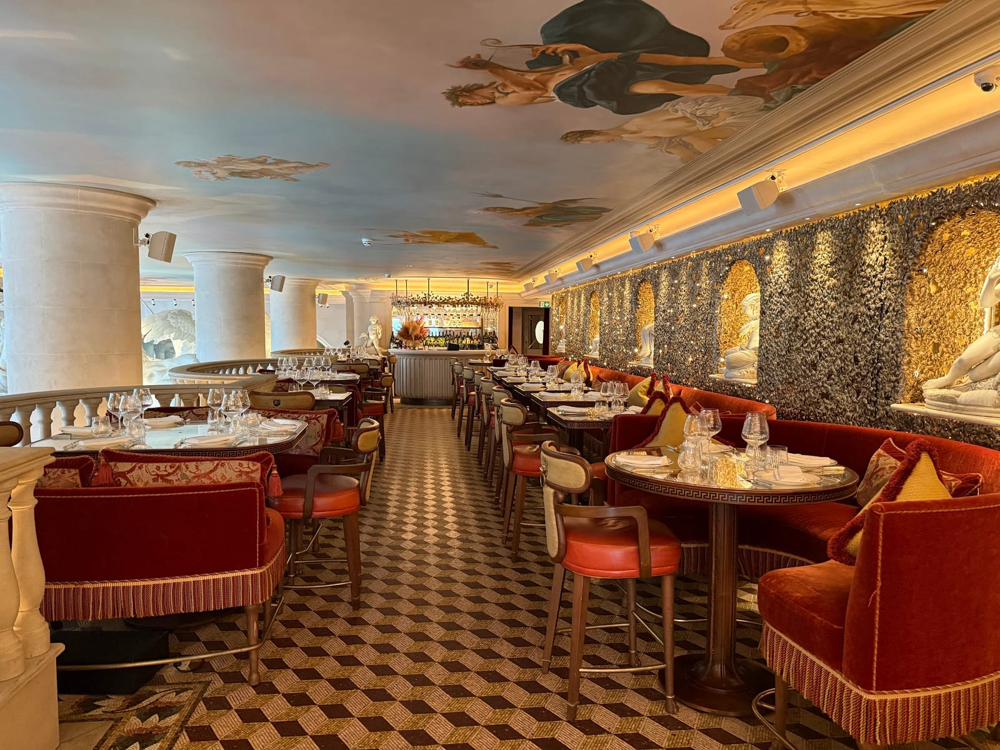
*The painted ceiling runs the length of the room, and the sculptures sit in grottoes along the wall.*

**The most-cited room in this entire set**, and the only one six of seven sources agree on. It is a Greco-Roman fantasy on Mount Street: marble sculptures by Damien Hirst, hand-painted ceiling murals by Gary Myatt, and an interior by Martin Brudnizki, the designer behind a good proportion of the other rooms on this page.

The cooking is Greek and southern Italian — grilled fish, mezze, pasta — and it is expensive in the way Mayfair is expensive. Country & Town House is the only source here that credits the designers by name, which is why its account is the most useful: this is a room built by people whose job is building rooms, rather than a restaurant that happens to look good.

### Sketch, Mayfair

*££££ · Mayfair · 6 min from Oxford Circus · Cited by 5 sources · book weeks ahead*

*Not the Gallery: this is the Glade, painted as a woodland with the bottles on floating shelves. The rooms at Sketch look nothing like each other.*

**Sketch is not one room, and this is the thing to get right before booking.** It is a Georgian townhouse at **9 Conduit Street, W1S 2XG**, divided into rooms that look nothing like each other, and every source on this page calls all of them "Sketch". Book the room you have seen a photograph of, not the address.

- **The Gallery** is the room people mean — **and it is no longer pink.** The millennial-pink velvet and David Shrigley drawings that made it famous were replaced in 2022, when India Mahdavi redesigned it in warm yellow and copper around artworks by Yinka Shonibare. Most photographs online are still of the pink version. It serves **afternoon tea and dinner**, and afternoon tea is both the easiest booking to get and the cheapest way in.
- **The Glade** is the room in the photograph above: a woodland painted across every wall, lit in shafts as though through a canopy, with the bottles on floating wooden shelves. Breakfast, lunch and afternoon tea by day, a bar at night.
- **The Parlour** is the casual one, open all day.
- **The Lecture Room & Library** is Pierre Gagnaire's fine-dining room, with **three Michelin stars** in the 2026 guide — a tasting menu at a completely different price, and a booking that needs months rather than weeks.
- **The East Bar** at the back is a small round room under a domed ceiling, beside the pods.

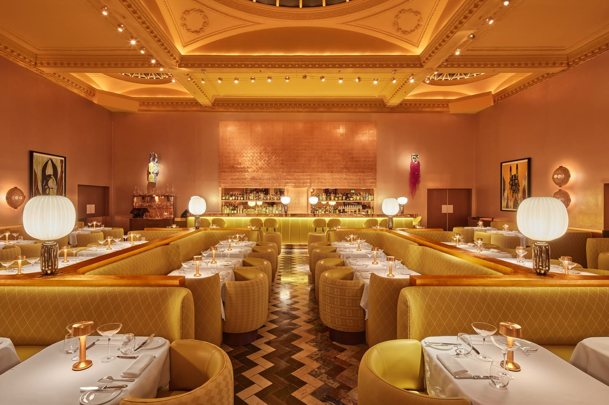
*The Gallery as it is now: yellow and copper rather than pink.*

**And the lavatories.** Up the staircase from the Gallery is an atrium of **egg-shaped pods**, each a self-contained white capsule under a stained-glass dome, with birdsong playing. They are photographed nearly as often as the dining room and are the single most-recognised thing in the building.

> 💡 **The pods are free.** You do not need a booking, a table or a drink to walk up and photograph them, which makes them the cheapest shot in this guide.

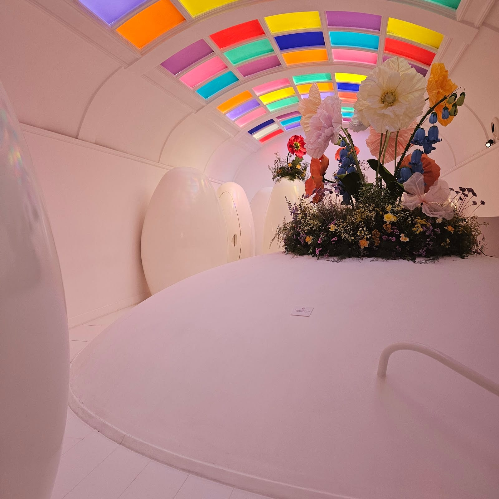
*The pods, under the coloured glass ceiling. No booking needed to see them.*

### Circolo Popolare, Fitzrovia

*££ · Fitzrovia · 3 min from Tottenham Court Road · Cited by 5 sources · book weeks ahead*

*The bottles run floor to ceiling on every wall, and the ceiling is a canopy of foliage and fairy lights.*

**The cheapest of the three most-cited rooms by a wide margin**, and the most photographed per pound in London. Big Mamma's Sicilian room hangs fairy lights from a canopy of foliage over walls stacked floor to ceiling with bottles — one source counts over 20,000, though that is the restaurant's own figure repeated.

**Order the truffle pasta**, finished tableside in a wheel of pecorino, or the **giant lemon meringue pie**, which arrives about the size of a football and is built to be photographed. Pizza and regional southern Italian otherwise. The portions are enormous and the prices are not Mayfair.

**It is very loud and it is not a quiet dinner** — the room is designed for volume and turnover, which is the trade for the price.

**Book weeks ahead**; the queue for walk-ins is real. 40–41 Rathbone Place, W1T 1HX, three minutes from Tottenham Court Road. If you want the photograph without the wait, its sibling **Ave Mario** in Covent Garden is the same idea with a hall of mirrors and duomo-striped walls.

---

Powered by <a target="_blank" rel="sponsored" href="https://www.getyourguide.com/london-l57/">GetYourGuide</a>

## Also strongly backed

### Ave Mario, Covent Garden

*££ · Covent Garden · 5 min from Embankment · Cited by 4 sources · book weeks ahead*

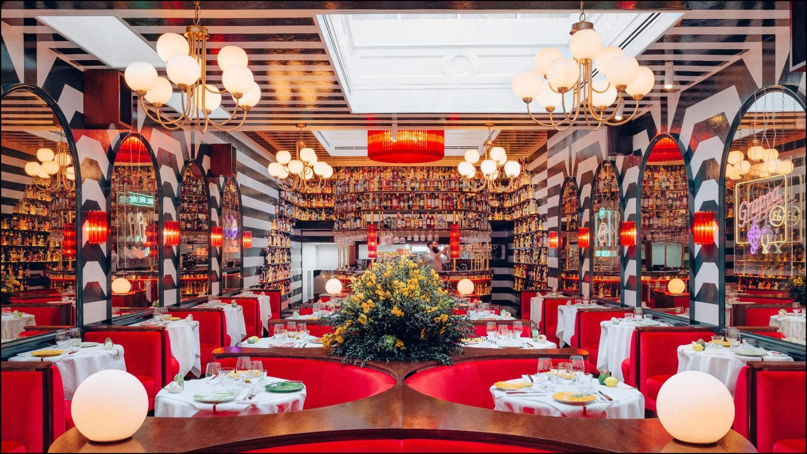
*The main hall: the stripes, the arches and the bottles. Ask to sit here rather than in a side room.*

A Studio Kiki room with psychedelic duomo-striped walls, a hall of mirrors and a bar holding 3,500 bottles. Same group as Circolo Popolare and the same trick — maximalism at a price that does not match it. The lavatories are a mirrored infinity room, which is the shot most people come for.

**Order the pasta rather than the pizza here.** The **cacio e pepe**, finished in the cheese wheel, and the **carbonara** are what the kitchen is for; the grill menu is the weaker half.

**It is enormous** — several rooms over two floors — so where you are seated changes the experience completely. Ask for the main hall rather than the side rooms if the interior is why you are coming.

**15 Henrietta Street, WC2E 8QG**, five minutes from Embankment. Books weeks ahead.

### Brasserie of Light, Mayfair

*££££ · Mayfair · 3 min from Bond Street · Cited by 4 sources · book a few days ahead*

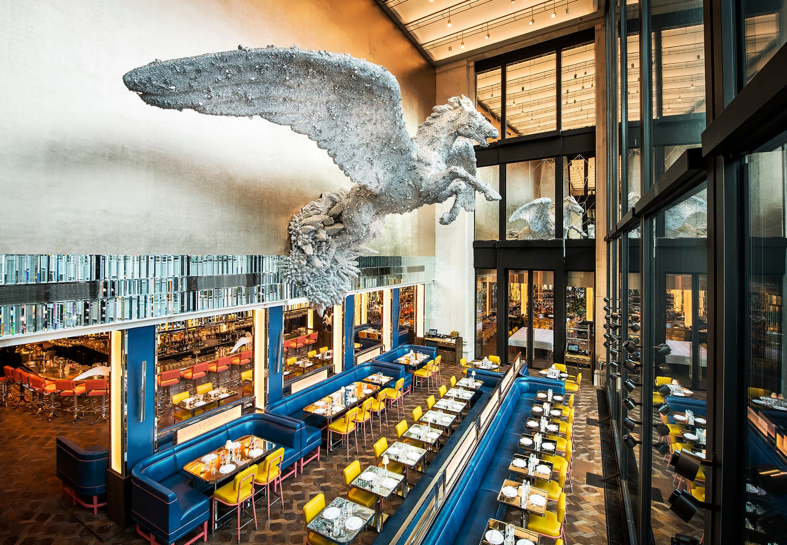
*The Pegasus, looking down over the whole room.*

Built around **a 24-foot crystal-encrusted Damien Hirst Pegasus**, in Art Deco mirror and brass inside Selfridges. Four sources name it and every one leads on the sculpture, which tells you what the room is for.

**The menu is brasserie classics done properly**: a seafood counter with oysters and shellfish platters, **steak tartare**, **truffle chicken**, and a long list of salads aimed squarely at people who have been shopping. Seasonal and unfussy rather than inventive.

**It is inside Selfridges**, on the first floor, which is the practical fact — it keeps the store's hours rather than restaurant hours, so it closes earlier than you would expect for somewhere at this price.

**Only a few days' notice needed**, unlike most of this page. 400 Oxford Street, W1A 1AB, three minutes from Bond Street.

### Dalloway Terrace, Bloomsbury

*£££ · Bloomsbury · 2 min from Tottenham Court Road · Cited by 4 sources · book a few days ahead*

A covered terrace at The Bloomsbury Hotel whose floral installation is **changed with the season** — wisteria in spring, something else entirely in November. That is the one thing to check before travelling for a specific photograph, because the room you saw online may not be the room that is there this month.

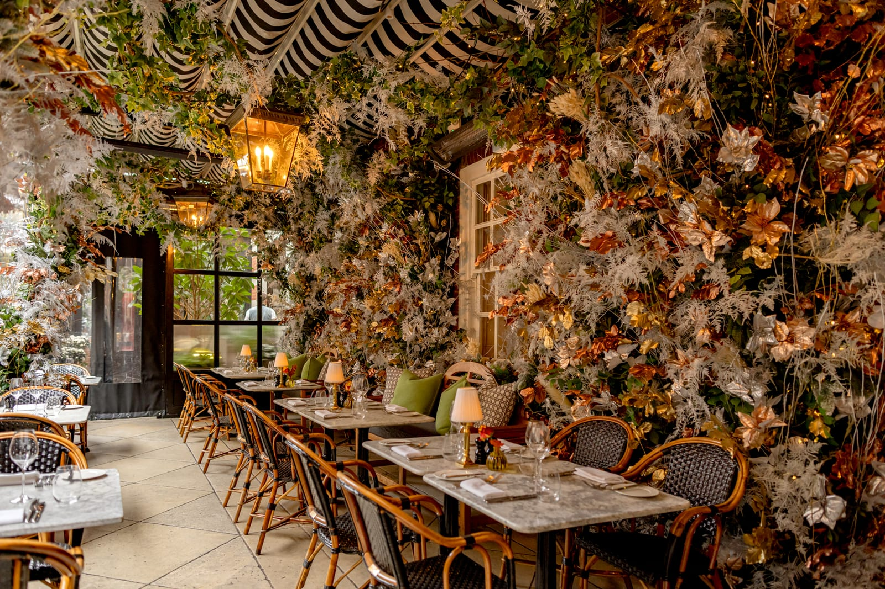
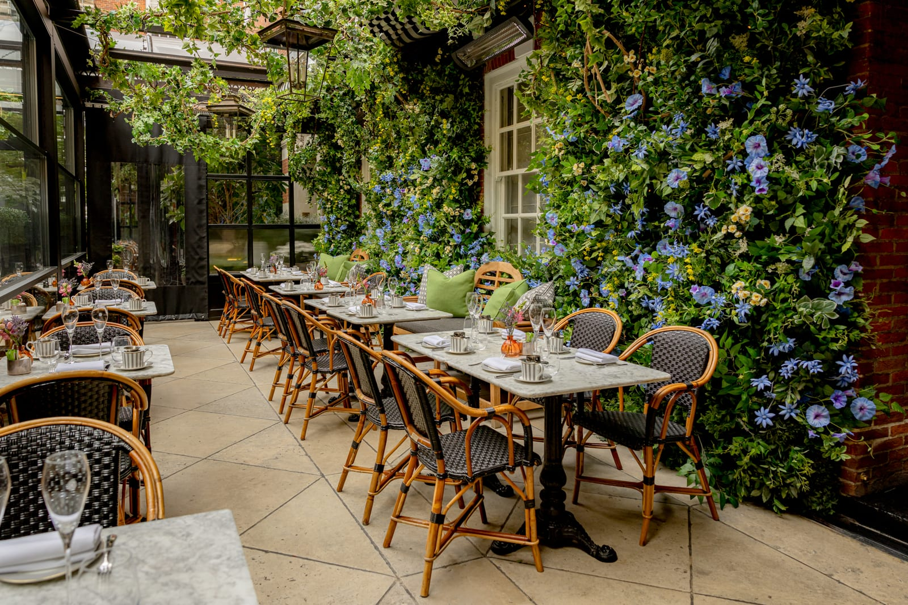
*The same terrace in two seasons. Check which dressing is up before you go for the photograph.*

**It is an all-day room rather than a dinner one.** Breakfast, then **afternoon tea**, then a short brasserie menu — and afternoon tea is what it is really for, taken under the flowers with the terrace heated and covered.

**It is the best-placed room on this page for a museum day.** Two minutes from Tottenham Court Road and about five from the British Museum, so it works as the sit-down after rather than a trip of its own.

**A few days' notice is usually enough**, which makes it much the easiest booking here. 16–22 Great Russell Street, WC1B 3NN.

### Gloria, Shoreditch

*££ · Shoreditch · 8 min from Old Street · Cited by 4 sources · book weeks ahead*

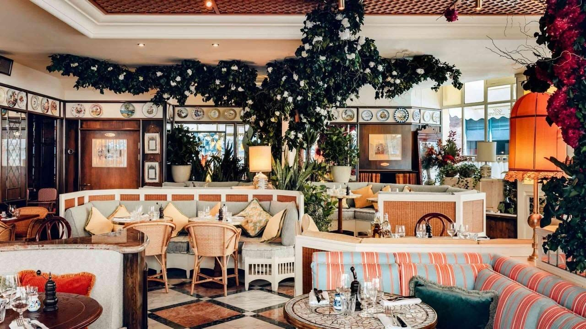
*Upstairs at Gloria: the blossom tree and the plates on the walls, in daylight.*

Big Mamma's 1970s Capri pastiche: hand-painted plates, a blossom tree in the middle of the room, and striped banquettes. Cheaper than it looks and louder than it looks.

**The dish to order is the carbonara**, made in a hollowed pecorino wheel at the table, and the **lemon meringue** for pudding — both are the group's signatures and both are what the room is photographed with.

**It is two different rooms on two floors**, which matters if the photograph is the point. The ground floor is the bright Capri room with the blossom tree; the basement is a darker 1970s room with a mirrored ceiling. Ask for upstairs if you want the room in the pictures.

**Books weeks ahead** like the rest of the group. 54–56 Great Eastern Street, EC2A 3QR, eight minutes from Old Street.

### Jacuzzi, Kensington

*£££ · Kensington · 1 min from High Street Kensington · Cited by 3 sources · book weeks ahead*

A four-floor Sicilian palazzo on Kensington High Street under a **retractable glass roof**, crammed with Roman statues, Murano glass chandeliers and greenery.

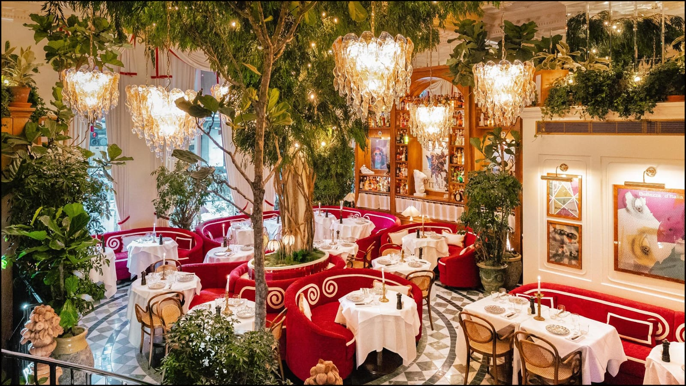
*The main room at Jacuzzi, with the trees growing up through it.*

**The roof is the thing to plan around.** It opens in warm weather and the room becomes a different place; on a wet January evening you are in a covered atrium instead. Worth asking when you book if the open roof is what you came for.

**Order the seafood** — the raw bar and the fritto misto are what the kitchen does best — or the pasta, which is the group's usual strength.

**Also Big Mamma**, and four of the rooms on this page belong to that one group. Worth knowing when every list agrees: they are agreeing about one company's design department. **High Street Kensington**, one minute from the station.

### Sessions Arts Club, Clerkenwell

*££££ · Clerkenwell · 3 min from Farringdon · Cited by 3 sources · book months ahead*

**A restored eighteenth-century courthouse**, on the top floor of the old Clerkenwell Sessions House, with peeling plaster left deliberately unrestored and battered armchairs scattered through it. The rarest room on this page and the hardest to book — months rather than weeks.

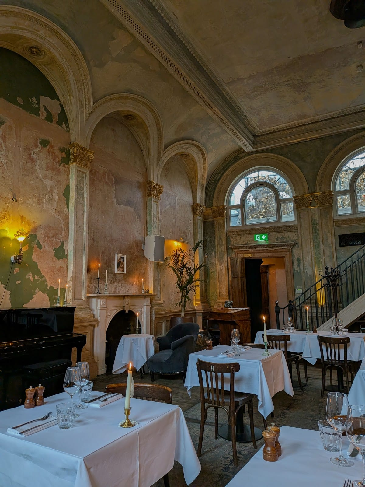
*The plaster has been left peeling on purpose.*

It is also one of the few here where the kitchen is cited as often as the interior. If you want one room that answers both questions, this is it.

**The cooking is short, seasonal and small-plates** — whatever is good that week rather than a fixed list — so there is no dish to name in advance, and the menu changes often enough that regulars come back for it rather than the room.

**Book months ahead**, and note it is on the top floor of the old Sessions House with the entrance easy to miss from Clerkenwell Green. 24 Clerkenwell Green, EC1R 0NA, three minutes from Farringdon.

---

Powered by <a target="_blank" rel="sponsored" href="https://www.getyourguide.com/london-l57/">GetYourGuide</a>

## The Big Mamma rooms

**Four of the twenty-three rooms named by two or more sources belong to one group**, which is worth saying plainly: when every guide agrees, some of that agreement is one company's design department.

Big Mamma builds maximalist Italian rooms at prices that do not match them, and it now has six London sites. Ranked by how many of this page's sources name each:

| Room | Where | Named by |
| --- | --- | --- |
| **Circolo Popolare** | Fitzrovia | 5 sources |
| **Ave Mario** | Covent Garden | 4 sources |
| **Gloria** | Shoreditch | 4 sources |
| **Jacuzzi** | Kensington | 3 sources |
| **Carlotta** | Marylebone | 1 source |
| **Barbarella** | Canary Wharf | *no source in this corpus* |

The bottom two are the interesting ones, and they are why this table exists.

**Carlotta** on Marylebone High Street is the group's Italian-American room — plush, retro, red leather booths, pasta alla vodka and whole roasted fish. One source names it.

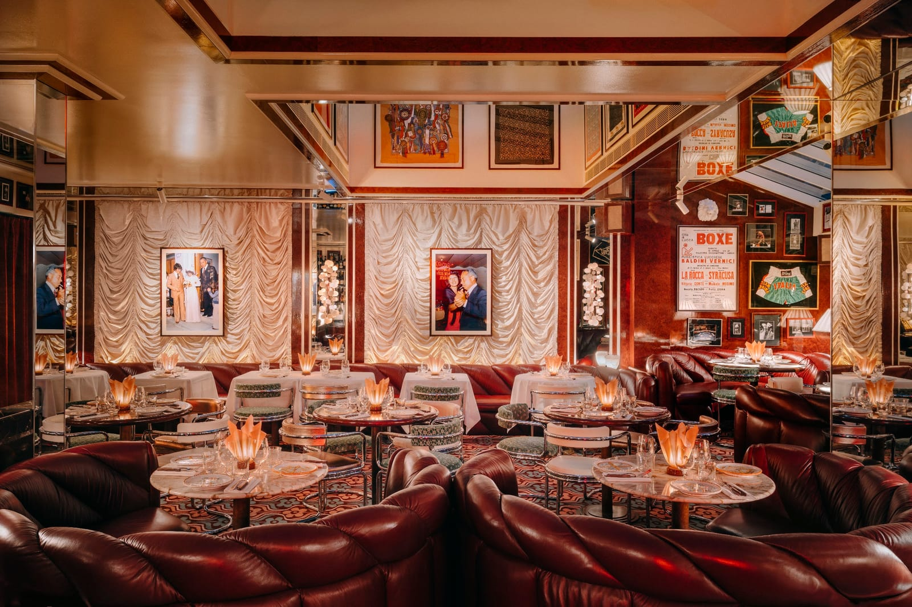
*Carlotta: red leather, ruched curtains and boxing posters.* **Barbarella** in Canary Wharf is a 1970s Italian fantasy and is named by none of the seven guides read for this page.

That absence is not evidence they are less good-looking. It is evidence that these lists lag: a room has to be open long enough to be written up, and the guides that rank interiors are refreshed less often than the restaurants open. Both are on the group's own site and both are unmistakably built to be photographed. **They are listed here, and deliberately not ranked, because no source in this corpus reaches them.**

If you want the Big Mamma look without the wait, those two are the ones nobody is queueing for yet.

## By setting

Rooms group by what makes them photograph well, and the axis is more useful than price.

**Inside a building that was something else first.** Sessions Arts Club, an eighteenth-century courthouse. **NoMad London**, a three-storey glass atrium in the former Bow Street Magistrates Court, opposite the Royal Opera House and a working court until 2006. *££££ · Covent Garden · 3 min from Covent Garden · Cited by 2 sources.*

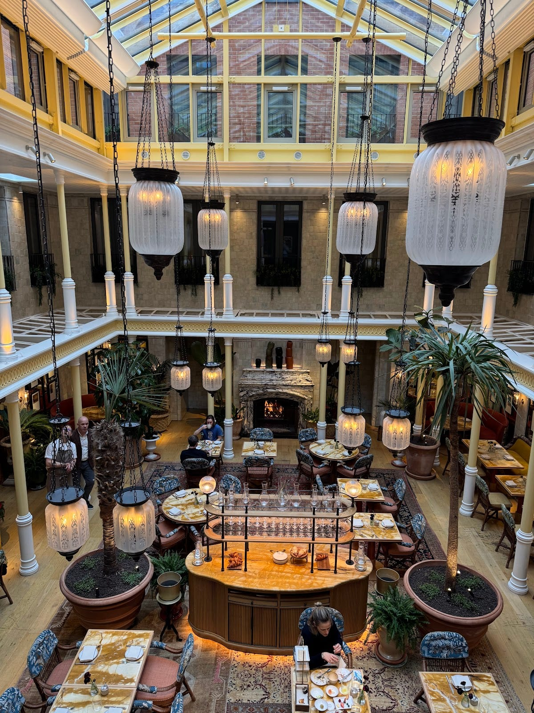
*The atrium at NoMad London, in the old magistrates' court.*

**Under glass.** **Petersham Nurseries** in Richmond serves lunch inside a working plant nursery, surrounded by what is for sale. *££££ · Richmond · 29 min from Richmond · Cited by 2 sources.*

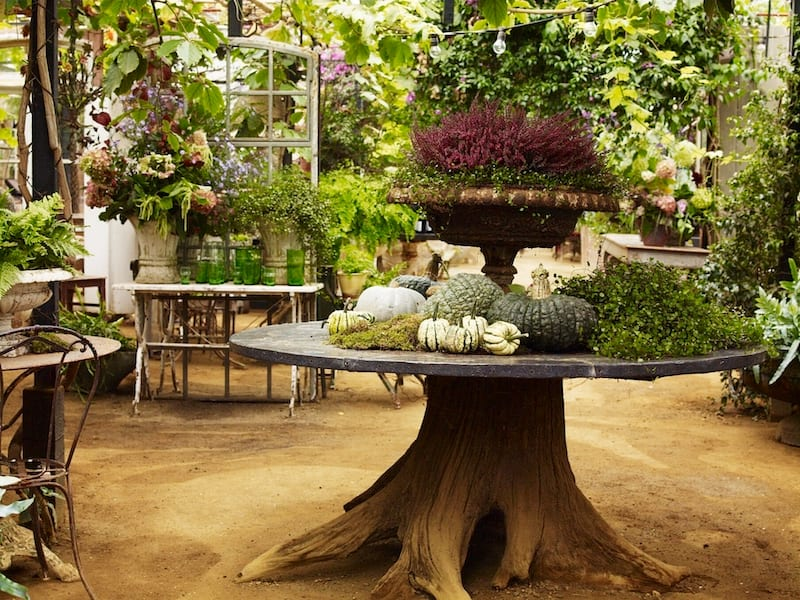
*Inside the glasshouses at Petersham Nurseries, where everything around you is for sale.*
 **Winter Garden** at The Landmark sits under an eight-storey glass atrium with full-height palms — named by one source here, and better known for its afternoon tea. *££££ · Marylebone · 3 min from Marylebone.*

*Eight storeys of glass roof over full-grown palms, in what was a Victorian railway hotel.*

**Rooms with a view.** **Seabird** on the South Bank is a rooftop with a long London panorama. *£££ · South Bank · 2 min from Southwark · Cited by 2 sources.*

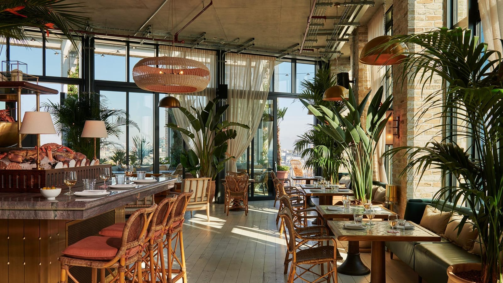
*Seabird's rooftop dining room, with the city through the windows.*

**Sky Garden** is not really a restaurant at all — it is a planted dome on top of 20 Fenchurch Street with restaurants inside it. **Entry to the garden is free with a booked timed slot**; the restaurants are separate and are not. *£££ · City of London · 3 min from Monument · Cited by 2 sources.*

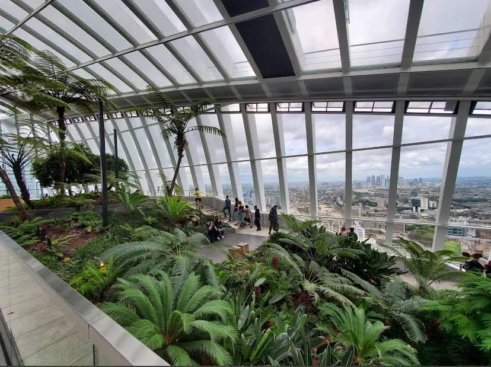
*The garden itself, which is the free part.*

**Gardens at street level.** **The Ivy Chelsea Garden** has a walled garden behind the King's Road, dressed seasonally, with a conservatory for the months it is too cold to sit out. *£££ · Chelsea · 14 min from South Kensington · Cited by 2 sources.*

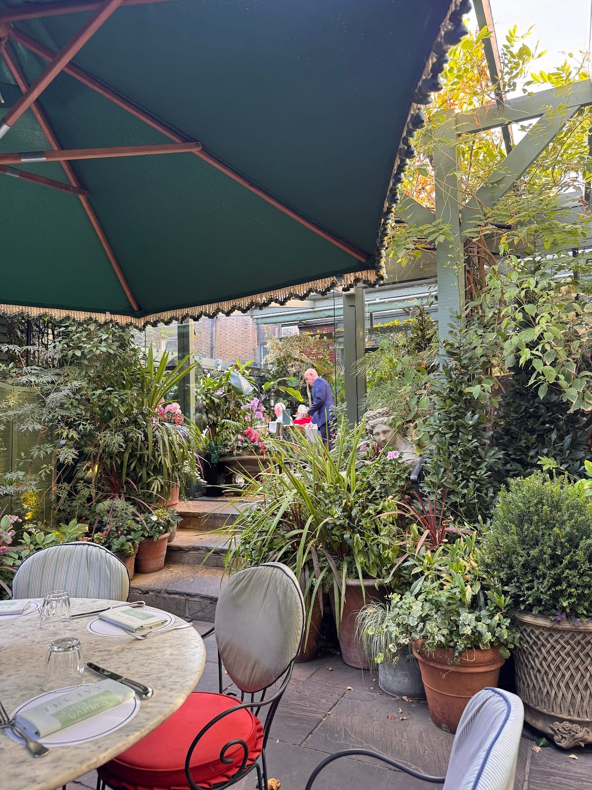
*The walled garden behind the King's Road.*

**Basements.** **Sucre** in Soho is lit by cut-glass chandeliers over an open fire kitchen; one source calls it impressive but *just subdued enough not to feel gimmicky*, which is the line the whole category walks. *£££ · Soho · 5 min from Oxford Circus · Cited by 2 sources.*

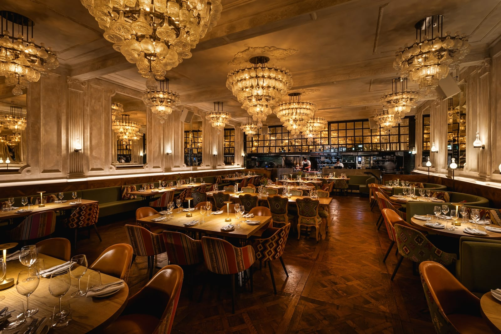
*Sucre's chandeliers, with the fire kitchen at the far end of the room.*

---

## The cheapest striking rooms

Most of this list is expensive. Four rooms are not.

- **[Bar Douro](#bar-douro-borough)** — ££, Borough. Hand-painted azulejo tiles under a slatted ceiling. The only room here whose look comes from tilework rather than budget. *Cited by 2 sources.*
- **Circolo Popolare** — ££, Fitzrovia. Covered above; the best value on the page. *Cited by 5 sources.*
- **Ave Mario** — ££, Covent Garden. *Cited by 4 sources.*
- **Gloria** — ££, Shoreditch. *Cited by 4 sources.*

### Bar Douro, Borough

*££ · Borough · 5 min from Borough · Cited by 2 sources · book a few days ahead*

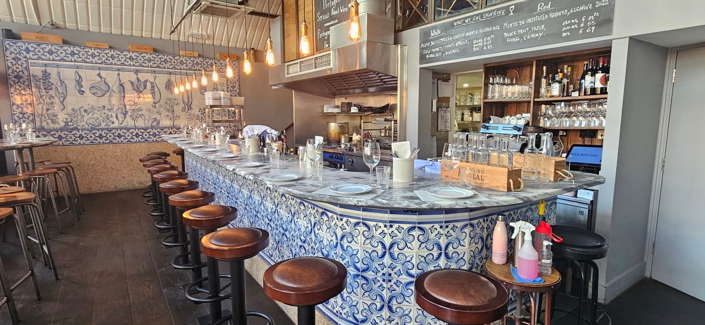
*The tiled counter, which is where you eat.*

A narrow Portuguese counter, tiled floor to ceiling in hand-painted azulejos, under a slatted shack-like ceiling. **The cheapest room on this page and one of the very few where the look costs nothing extra.**

**Order the petiscos**: the **presunto**, the **bacalhau**, the **pastéis de nata** made on site, and a glass of something from the Douro — the list is heavily Portuguese and priced to be drunk rather than admired.

**You eat sitting at the counter**, which is the format rather than a shortage of tables, so this is a two-person meal rather than a group one.

**A few days' notice is enough**, unlike almost everything else here. It is in a railway arch off Southwark Bridge Road, five minutes from Borough.

---

## All look, ordinary plate

The honest section, and the one no competing list prints.

A room can be worth photographing and unremarkable to eat in, and three here are cited almost entirely for the interior:

- **Sky Garden** is a viewing platform. The restaurants inside it are convenient rather than good, and the garden — the actual reason to go — is free.
- **The Ivy Chelsea Garden** is part of a chain. The garden is genuinely lovely; the menu is the same brasserie list served across the group.
- **Brasserie of Light** sits inside a department store and is named by four sources, every one of which leads on the Pegasus sculpture rather than anything on the plate.

Where the cooking does match the room: **Spring** at Somerset House, **Sessions Arts Club**, and **Bar Douro**.

### Spring, Covent Garden

*££££ · Somerset House · 4 min from Temple · Cited by 2 sources · book weeks ahead*

Skye Gyngell's dining room in the New Wing of Somerset House — a nineteenth-century drawing room in blonde wood and blush, under a porcelain petal installation by Valeria Nascimento. **One of the very few rooms on this list that would still be worth the table with the lights off.**

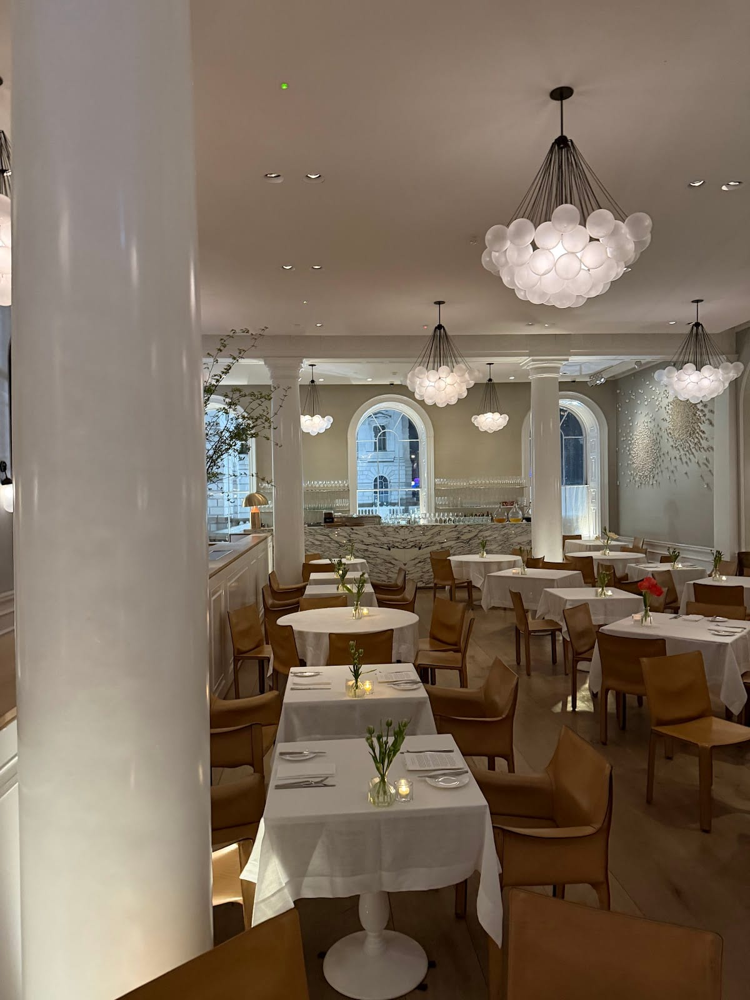
*Spring, in the New Wing of Somerset House.*

**The cooking is seasonal and Italian-influenced**, built around produce from a single Sussex farm, so the menu changes constantly and there is no signature dish to name — which is itself the point of it.

> 💡 **The Scratch menu is the way in.** An early-evening set menu made from the day's trimmings and surplus, at a fraction of the à la carte, served before the main service starts. It is the cheapest three-figure-standard cooking in central London.

**Somerset House, Lancaster Place, WC2R 1LA**, four minutes from Temple — and the courtyard outside is free, with fountains in summer and a rink in winter.

---

Powered by <a target="_blank" rel="sponsored" href="https://www.getyourguide.com/london-l57/">GetYourGuide</a>

## Also named

Rooms carried by two sources each, listed once rather than written up twice:

- **Bob Bob Ricard**, Soho — booth-only Golden Age of Travel interior with a press-for-champagne button at every table. *££££ · 5 min from Piccadilly Circus.*
- **Isabel**, Mayfair — a Beaux-Arts dining room off Albemarle Street, with a bar downstairs that runs late. *££££ · 4 min from Green Park.*
- **Tattu**, Fitzrovia — a Joyce Wang Studio room built as a Chinese courtyard around a full-size cherry blossom tree. The only venue here named by two editorial sources and no blog. *£££ · 3 min from Tottenham Court Road.*
- **Joia**, Battersea — Portuguese cooking high in the Art'otel with floor-to-ceiling glass. *££££ · 2 min from Battersea Power Station.*
- **Bancone**, Covent Garden — golden light over curved marble pasta counters. *££ · 3 min from Charing Cross.*
- **Sticks'n'Sushi**, Battersea — Danish-Japanese, and the most restrained room on this page. *£££ · 2 min from Battersea Power Station.*

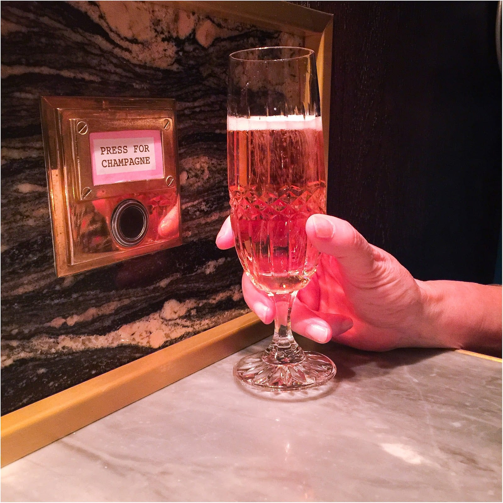
*Bob Bob Ricard's press-for-champagne button, fitted at every table.*

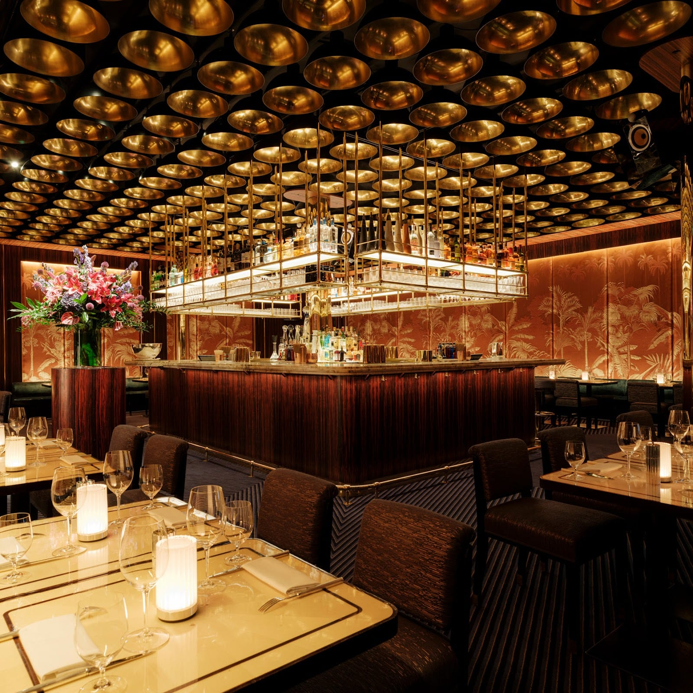
*Isabel, under its ceiling of gold.*

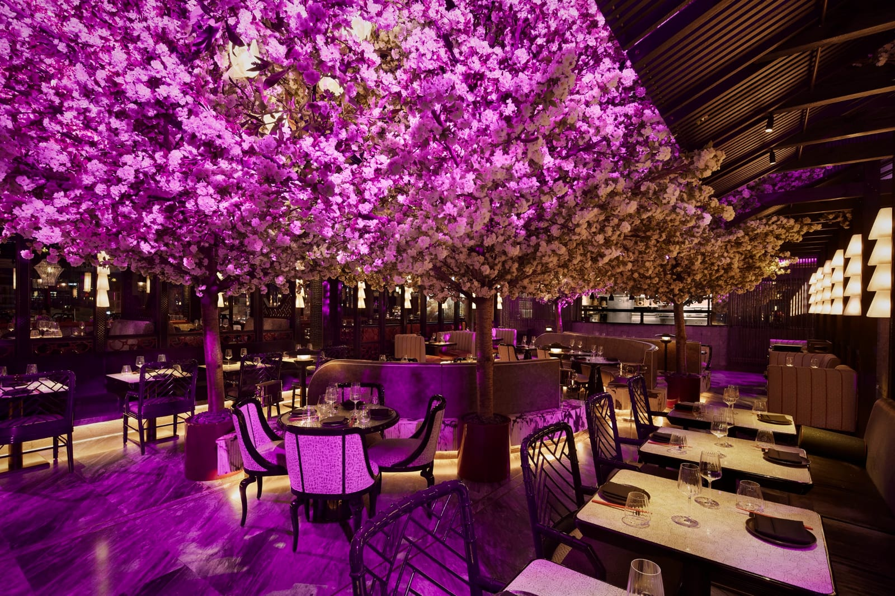
*The cherry blossom trees at Tattu.*

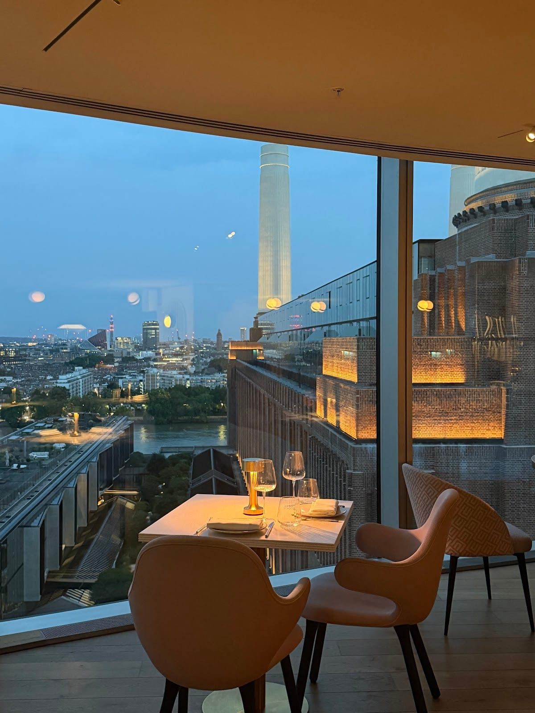
*Joia's window seats, looking out at a Battersea Power Station chimney.*

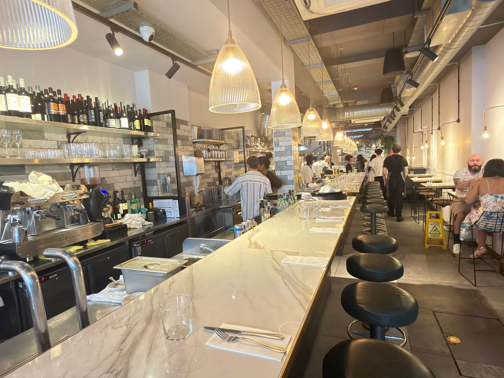
*Bancone's marble counter, where most people eat.*

---

## If the room matters more than the plate

That is a legitimate way to choose and this guide is built for it. But two others are worth reading alongside: [unusual restaurants](/articles/unusual-restaurants-london/) for rooms that are strange rather than pretty, and [special occasion restaurants](/articles/special-occasion-restaurants-london/) for the ones where the cooking justifies the room. The [full eating guide](/articles/eat-in-london-guide/) has everything else.

## What to know

**Seasonal rooms change.** Dalloway Terrace and The Ivy Chelsea Garden are both dressed to the season. The photograph that brought you here may be six months old.

**One room, several rooms.** Sketch is the clearest case: the Gallery, the Lecture Room and the lavatory pods are all "Sketch" to a source and all different to a diner.
