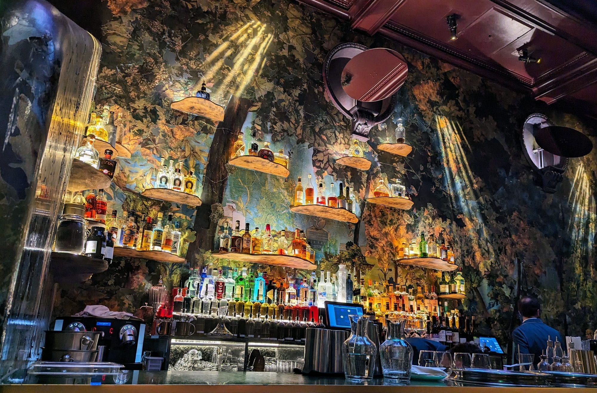
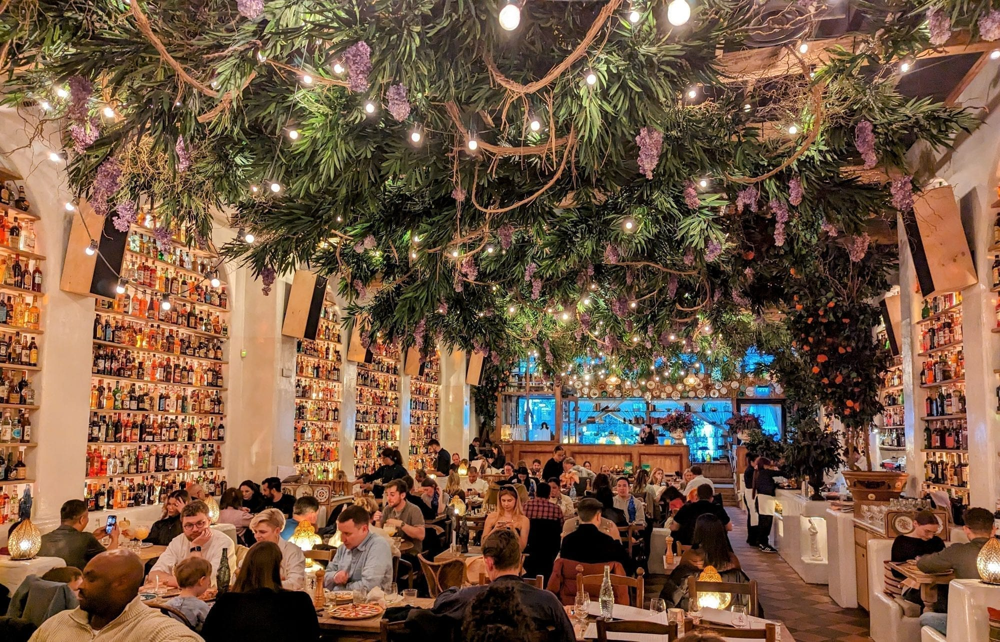

Some rooms are booked for the cooking and some are booked for the photograph, and this page is only about the second kind.

That distinction matters more than it sounds. **Every venue below is ranked by how many independent guides name it for its interior**, not by how it eats. A few are among the better kitchens in London. One is a chain. One is a viewing platform with restaurants inside it. Where a room is better looking than it is good, this page says so.

> 📌 **The short version**
> **Bacchanalia**, Mayfair, is named by six of seven sources — more than any other room in London. **Sketch** and **Circolo Popolare** follow on five each. The cheapest genuinely striking room is **Bar Douro** in Borough at ££. The one people get wrong is **Sky Garden**: the garden is free with a booked slot, the restaurants inside it are not.

> 📊 **The evidence behind this guide**
> Nothing here rests on one visit. This pass reads **7 sources carrying 148 citations** across **105 named venues** — three editorial mastheads (DesignMyNight, HELLO!, Country & Town House) and four independent specialists. **23 rooms are named by two or more independent sources.**
> **The known weakness in this topic:** there is no judged award for a restaurant interior, so nothing here carries a dated ranking the way a food guide would — this is editorial consensus alone. Two mastheads that belong in it, Visit London and The Handbook, refused to load. And the tier that ought to matter most on a topic about photographs, video and social, could not be collected at all in this pass. That is a real hole and it is named rather than hidden.
> *Evidence rebuilt 3 September 2026 · [How we rank →](/how-we-rank/)*

> ⏱️ **How far ahead to book**
> **Months:** Sessions Arts Club. **Weeks:** Bacchanalia, Sketch, Circolo Popolare, Ave Mario, Gloria, Bob Bob Ricard, NoMad London, Spring, Isabel, Joia, Petersham Nurseries, Seabird, Winter Garden. **Days:** Brasserie of Light, Dalloway Terrace, Bar Douro, Sucre, Tattu, Sticks'n'Sushi, The Ivy Chelsea Garden. **Timed slot, book free in advance:** Sky Garden.

## Where they are

  

    Map of the most Instagrammable restaurants in London
  

  

    
Loading the interactive map…

  

  

    <i class="restaurant-map-key restaurant-map-key--editorial" aria-hidden="true"></i> Named in this guide
  

  <noscript>
    
The interactive map requires JavaScript. Every entry below lists its area and nearest station.

  </noscript>

| If you are near… | Where to go |
| --- | --- |
| **Mayfair** | Bacchanalia, Sketch, Brasserie of Light, Isabel |
| **Fitzrovia & Tottenham Court Road** | Circolo Popolare, Tattu |
| **Covent Garden & the Strand** | Ave Mario, NoMad London, Spring, Bancone |
| **Soho** | Bob Bob Ricard, Sucre |
| **Shoreditch & Clerkenwell** | Gloria, Sessions Arts Club |
| **The City** | Sky Garden |
| **Bloomsbury & Marylebone** | Dalloway Terrace, Winter Garden |
| **Chelsea & Kensington** | The Ivy Chelsea Garden, Jacuzzi |
| **South of the river** | Bar Douro, Seabird, Joia, Sticks'n'Sushi |
| **Further out** | Petersham Nurseries, Richmond |

**Price guide:** **££** £15–£30 · **£££** £35–£55 · **££££** £70+.

---

## The most-named rooms

No judged award exists for a restaurant interior, so there is no winner in the sense a food guide would mean. What there is instead is agreement, and on three rooms the agreement is unusually strong.

### Bacchanalia, Mayfair

*££££ · Mayfair · 7 min from Green Park · Cited by 6 sources · book weeks ahead*

**The most-cited room in this entire set**, and the only one six of seven sources agree on. It is a Greco-Roman fantasy on Mount Street: marble sculptures by Damien Hirst, hand-painted ceiling murals by Gary Myatt, and an interior by Martin Brudnizki, the designer behind a good proportion of the other rooms on this page.

The cooking is Greek and southern Italian — grilled fish, mezze, pasta — and it is expensive in the way Mayfair is expensive. Country & Town House is the only source here that credits the designers by name, which is why its account is the most useful: this is a room built by people whose job is building rooms, rather than a restaurant that happens to look good.

### Sketch, Mayfair

*££££ · Mayfair · 6 min from Oxford Circus · Cited by 5 sources · book weeks ahead*

*Not the pink room: this is the bar, painted as a woodland with the bottles on floating shelves. The rooms at Sketch look nothing like each other.*

**Sketch is not one room, and this is the thing to get right before booking.** It is a Georgian townhouse on Conduit Street divided into several rooms that look nothing like each other, and every source on this page calls all of them "Sketch". Book the room you have seen a photograph of, not the address.

- **The Gallery** is the pink one — the room people mean. Millennial-pink quilted velvet floor to ceiling, hung with framed David Shrigley drawings, redesigned by artist Yinka Shonibare with India Mahdavi. **Afternoon tea is served here**, and it is both the easiest booking to get and the cheapest way in.
- **The Glade** is the bar in the photograph above: a woodland painted across every wall, lit in shafts as though through a canopy, with the bottles on floating wooden shelves. Dark where the Gallery is bright.
- **The Lecture Room & Library** is the fine-dining room, two Michelin stars, and a different proposition at a different price entirely. Gilded and jewel-coloured rather than pink.
- **The East Bar** at the back is a small round room under a domed ceiling.

**And the lavatories.** Up the staircase from the Gallery is an atrium of **egg-shaped pods**, each a self-contained white capsule under a stained-glass dome, with birdsong playing. They are photographed nearly as often as the dining room and are the single most-recognised thing in the building. You do not need a table to walk up and look.

### Circolo Popolare, Fitzrovia

*££ · Fitzrovia · 3 min from Tottenham Court Road · Cited by 5 sources · book weeks ahead*

*The bottles run floor to ceiling on every wall, and the ceiling is a canopy of foliage and fairy lights.*

**The cheapest of the three most-cited rooms by a wide margin**, and the most photographed per pound in London. Fairy lights hang from a canopy of foliage over a room whose walls are stacked floor to ceiling with bottles — one source counts over 20,000, though that is the restaurant's own figure repeated.

Big Mamma group Italian, so the portions are enormous and the prices are not Mayfair. It books weeks out and the queue for walk-ins is real. If you want the photograph without the wait, its sibling **Ave Mario** in Covent Garden is the same idea with a hall of mirrors and duomo-striped walls.

---

Powered by <a target="_blank" rel="sponsored" href="https://www.getyourguide.com/london-l57/">GetYourGuide</a>

## Also strongly backed

### Ave Mario, Covent Garden

*££ · Covent Garden · 5 min from Embankment · Cited by 4 sources · book weeks ahead*

A Studio Kiki room with psychedelic duomo-striped walls, a hall of mirrors and a bar holding 3,500 bottles. Same group as Circolo Popolare and the same trick — maximalism at a price that does not match it. The lavatories are a mirrored infinity room, which is the shot most people come for.

### Brasserie of Light, Mayfair

*££££ · Mayfair · 3 min from Bond Street · Cited by 4 sources · book a few days ahead*

Built around **a 24-foot crystal-encrusted Damien Hirst Pegasus**, in Art Deco mirror and brass inside Selfridges. Four sources name it and every one leads on the sculpture, which tells you what the room is for. Brasserie cooking, and the shopping-trip lunch it was designed to be.

### Dalloway Terrace, Bloomsbury

*£££ · Bloomsbury · 2 min from Tottenham Court Road · Cited by 4 sources · book a few days ahead*

A covered terrace at The Bloomsbury Hotel whose floral installation is **changed with the season** — so it is wisteria in spring and something else entirely in November. That is the one thing to check before travelling for a specific photograph, because the room you saw online may not be the room that is there this month.

### Gloria, Shoreditch

*££ · Shoreditch · 8 min from Old Street · Cited by 4 sources · book weeks ahead*

Big Mamma's 1960s Capri pastiche: hand-painted plates, pink neon, a blossom tree in the middle of the room. Cheaper than it looks and louder than it looks. Books weeks ahead like the rest of the group.

### Jacuzzi, Kensington

*£££ · Kensington · 1 min from High Street Kensington · Cited by 3 sources · book weeks ahead*

Multi-level Sicilian under a retractable glass roof, with a disco-ball stairway that is the reason it is on every one of these lists. Also Big Mamma — four of the twenty-three rooms here belong to one group, which is worth knowing when the lists all agree.

### Sessions Arts Club, Clerkenwell

*££££ · Clerkenwell · 3 min from Farringdon · Cited by 3 sources · book months ahead*

**A restored eighteenth-century courthouse**, on the top floor of the old Clerkenwell Sessions House, with peeling plaster left deliberately unrestored and battered armchairs scattered through it. The rarest room on this page and the hardest to book — months rather than weeks.

It is also one of the few here where the kitchen is cited as often as the interior. If you want one room that answers both questions, this is it.

---

## The Big Mamma rooms

**Four of the twenty-three rooms named by two or more sources belong to one group**, which is worth saying plainly: when every guide agrees, some of that agreement is one company's design department.

Big Mamma builds maximalist Italian rooms at prices that do not match them, and it now has six London sites. Ranked by how many of this page's sources name each:

| Room | Where | Named by |
| --- | --- | --- |
| **Circolo Popolare** | Fitzrovia | 5 sources |
| **Ave Mario** | Covent Garden | 4 sources |
| **Gloria** | Shoreditch | 4 sources |
| **Jacuzzi** | Kensington | 3 sources |
| **Carlotta** | Marylebone | 1 source |
| **Barbarella** | Canary Wharf | *no source in this corpus* |

The bottom two are the interesting ones, and they are why this table exists.

**Carlotta** on Marylebone High Street is the group's Italian-American room — plush, retro, red leather booths, pasta alla vodka and whole roasted fish. One source names it. **Barbarella** in Canary Wharf is a 1970s Italian fantasy and is named by none of the seven guides read for this page.

That absence is not evidence they are less good-looking. It is evidence that these lists lag: a room has to be open long enough to be written up, and the guides that rank interiors are refreshed less often than the restaurants open. Both are on the group's own site and both are unmistakably built to be photographed. **They are listed here, and deliberately not ranked, because no source in this corpus reaches them.**

If you want the Big Mamma look without the wait, those two are the ones nobody is queueing for yet.

## By setting

Rooms group by what makes them photograph well, and the axis is more useful than price.

**Inside a building that was something else first.** Sessions Arts Club, an eighteenth-century courthouse. **NoMad London**, a three-storey glass atrium in the former Bow Street Magistrates Court, opposite the Royal Opera House and a working court until 2006. *££££ · Covent Garden · 3 min from Covent Garden · Cited by 2 sources.*

**Under glass.** **Petersham Nurseries** in Richmond serves lunch inside a working plant nursery, surrounded by what is for sale. *££££ · Richmond · 29 min from Richmond · Cited by 2 sources.* **Winter Garden** at The Landmark sits under an eight-storey glass atrium with full-height palms — named by one source here, and better known for its afternoon tea. *££££ · Marylebone · 3 min from Marylebone.*

*Eight storeys of glass roof over full-grown palms, in what was a Victorian railway hotel.*

**Rooms with a view.** **Seabird** on the South Bank is a rooftop with a long London panorama. *£££ · South Bank · 2 min from Southwark · Cited by 2 sources.* **Sky Garden** is not really a restaurant at all — it is a planted dome on top of 20 Fenchurch Street with restaurants inside it. **Entry to the garden is free with a booked timed slot**; the restaurants are separate and are not. *£££ · City of London · 3 min from Monument · Cited by 2 sources.*

**Gardens at street level.** **The Ivy Chelsea Garden** has a walled garden behind the King's Road, dressed seasonally, with a conservatory for the months it is too cold to sit out. *£££ · Chelsea · 14 min from South Kensington · Cited by 2 sources.*

**Basements.** **Sucre** in Soho is lit by cut-glass chandeliers over an open fire kitchen; one source calls it impressive but *just subdued enough not to feel gimmicky*, which is the line the whole category walks. *£££ · Soho · 5 min from Oxford Circus · Cited by 2 sources.*

---

## The cheapest striking rooms

Most of this list is expensive. Four rooms are not.

- **[Bar Douro](#bar-douro-borough)** — ££, Borough. Hand-painted azulejo tiles under a slatted ceiling. The only room here whose look comes from tilework rather than budget. *Cited by 2 sources.*
- **Circolo Popolare** — ££, Fitzrovia. Covered above; the best value on the page. *Cited by 5 sources.*
- **Ave Mario** — ££, Covent Garden. *Cited by 4 sources.*
- **Gloria** — ££, Shoreditch. *Cited by 4 sources.*

### Bar Douro, Borough

*££ · Borough · 5 min from Borough · Cited by 2 sources · book a few days ahead*

A narrow Portuguese counter, tiled floor to ceiling in hand-painted azulejos, under a slatted shack-like ceiling. Petiscos and a Douro-heavy wine list, eaten sitting at the counter. It is the cheapest room on this page and one of the few where the look costs nothing extra.

---

## All look, ordinary plate

The honest section, and the one no competing list prints.

A room can be worth photographing and unremarkable to eat in, and three here are cited almost entirely for the interior:

- **Sky Garden** is a viewing platform. The restaurants inside it are convenient rather than good, and the garden — the actual reason to go — is free.
- **The Ivy Chelsea Garden** is part of a chain. The garden is genuinely lovely; the menu is the same brasserie list served across the group.
- **Brasserie of Light** sits inside a department store and is named by four sources, every one of which leads on the Pegasus sculpture rather than anything on the plate.

Where the cooking does match the room: **Spring** at Somerset House, **Sessions Arts Club**, and **Bar Douro**.

### Spring, Covent Garden

*££££ · Somerset House · 4 min from Temple · Cited by 2 sources · book weeks ahead*

Skye Gyngell's dining room in the New Wing of Somerset House — a nineteenth-century drawing room in blonde wood and blush, under a porcelain petal installation by Valeria Nascimento. Seasonal Italian-influenced cooking, and one of the few rooms on this list that would still be worth the table with the lights off.

---

Powered by <a target="_blank" rel="sponsored" href="https://www.getyourguide.com/london-l57/">GetYourGuide</a>

## Also named

Rooms carried by two sources each, listed once rather than written up twice:

- **Bob Bob Ricard**, Soho — booth-only Golden Age of Travel interior with a press-for-champagne button at every table. *££££ · 5 min from Piccadilly Circus.*
- **Isabel**, Mayfair — a Beaux-Arts dining room off Albemarle Street, with a bar downstairs that runs late. *££££ · 4 min from Green Park.*
- **Tattu**, Fitzrovia — a Joyce Wang Studio room built as a Chinese courtyard around a full-size cherry blossom tree. The only venue here named by two editorial sources and no blog. *£££ · 3 min from Tottenham Court Road.*
- **Joia**, Battersea — Portuguese cooking high in the Art'otel with floor-to-ceiling glass. *££££ · 2 min from Battersea Power Station.*
- **Bancone**, Covent Garden — golden light over curved marble pasta counters. *££ · 3 min from Charing Cross.*
- **Sticks'n'Sushi**, Battersea — Danish-Japanese, and the most restrained room on this page. *£££ · 2 min from Battersea Power Station.*

---

## What to know

**Seasonal rooms change.** Dalloway Terrace and The Ivy Chelsea Garden are both dressed to the season. The photograph that brought you here may be six months old.

**One room, several rooms.** Sketch is the clearest case: the pink Gallery, the Lecture Room and the lavatory pods are all "Sketch" to a source and all different to a diner.
