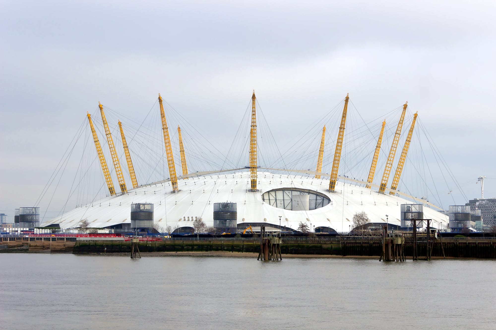

The National Television Awards are a televised awards night where the public chooses the winners and can also buy a seat. The ceremony has been held at **The O2** since 2010, apart from 2022, when it moved to the OVO Arena Wembley.

Tickets for the **8 September 2027** ceremony are sold through AXS and Ticketmaster. What you pay depends on two things: how close the seat is, and whether you want to stand outside and watch the stars arrive first.

> 💡 **The Short Version:** The ceremony is on **8 September 2027** at **The O2**, live on ITV. Tickets come from **[AXS](https://www.axs.com/uk/events/1596387/32nd-national-television-awards-tickets?skin=theo2)** or **[Ticketmaster](https://www.ticketmaster.co.uk/event/35006521445D08BE?did=ntaclub)**, the only two sellers the organiser links. Seats run from **£25** to **£105**. The **red-carpet packages** (**£150** and **£270**) add a standing viewing area outside, and are the only way to see the arrivals. Every price carries a **booking fee and a venue facility fee**. **Club NTA**, a free mailing list on the [organiser's site](https://www.nationaltvawards.com/join), sends presale and vote alerts.

*Prices are face value, as printed by the organiser. Add the seller's fees.*

---

## What each ticket costs

All prices are per ticket, plus a booking fee and a venue facility fee. The organiser does not print the fees, so the total shows at checkout.

| Ticket | Price | What you get |
| --- | --- | --- |
| Floor, restricted view | £25 | The arena floor, restricted view |
| Lower bowl, blocks 103 to 110 | £30 | Lower bowl |
| Upper level, blocks 403–404 and 419–420 (all rows except A) | £30 | Upper level |
| Floor and lower bowl blocks 102 and 111; upper level row A of blocks 403–404 and 419–420 | £45 | Floor and lower bowl, plus the front row of the upper level |
| Block 112 rows W to Z, and Block 101 rows V to Z | £80 | Lower bowl |
| Block 112 rows M to R | £105 | Lower bowl, the highest-priced seats sold outside the packages |
| **Red Carpet** | £150 | A standing viewing area outside to watch the stars arrive, a reserved seat at the ceremony, a gift and a souvenir laminate. Check-in from 4.30pm |
| **Premium Red Carpet** | £270 | The same viewing area with earlier access (check-in from 3.45pm), a reserved seat in rows H to L of Block 101 or 112, and a goodie bag |
| **Star Treatment** | £275 | A drinks reception before the show, hair and make-up check stations, a hand massage and manicure, a fast-track entrance and a photo moment. Check-in from 4.45pm, closing at 7pm |
| **Premium Star Treatment** | £395 | Star Treatment with access from 4pm, a seat in rows C to E of Block 112 and a photo holding an official NTA trophy |
| **Five Star Experience** | £1,075 | A night in a five-star London hotel with breakfast, a red-carpet arrival, a backstage tour, a three-course meal, a seat in row A or B of Block 112 and transport back to the hotel. Arrive at The O2 at 1.30pm |

The Five Star Experience and Premium Star Treatment are marked "limited availability" on the organiser's page.

---

## Watching the red carpet

The red carpet is **not a free public viewing area**. The only way onto it is a Red Carpet or Premium Red Carpet ticket, which includes a seat at the ceremony.

The organiser describes the viewing area as "standing room only, quite literally". It is outside, so dress for the weather. Smart or glamorous is the stated dress code, but you stand for as long as the arrivals last. The Five Star Experience, where you walk the carpet yourself, comes with a rule printed in capitals: no selfies while on it.

If you only want the arrivals and not the ceremony, the broadcast is the alternative. The results are revealed live on ITV.

---

## How to book

Tickets for 8 September 2027 are on sale from [AXS](https://www.axs.com/uk/events/1596387/32nd-national-television-awards-tickets?skin=theo2) and [Ticketmaster](https://www.ticketmaster.co.uk/event/35006521445D08BE?did=ntaclub), both linked from [nationaltvawards.com/tickets](https://www.nationaltvawards.com/tickets). Every seat block and package is on those pages. The Five Star Experience is sold through AXS only; the other packages link to both sellers.

**Join Club NTA before you book.** It is free, and the organiser describes it as the way to get "exclusive" presales and vote alerts. 

**Book accessible tickets by phone.** Call **020 8463 3359**, Monday to Friday, 9am to 5pm. The O2 is fully accessible, with lifts and public areas designed for wheelchair use, and **access@theo2.co.uk** answers other questions.

---

## The evening at The O2

The practical rules are The O2's, not the NTAs'. Our [O2 travel guide](/articles/the-o2-travel-guide/) has the detail, and three things matter most for a ceremony night.

- **Bags.** One bag per person, no bigger than A4. The arena has no cloakroom, but a bag store outside the main entrance charges £10 a bag.
- **Cash.** The arena is cashless, so bring a card.
- **Getting home.** North Greenwich on the Jubilee line is the only station, and the last trains leave on the ordinary timetable. The cable car and the river boats stop before a late-evening ceremony ends.

Check-in for the packages opens between 1.30pm (Five Star Experience) and 4.45pm (Star Treatment), so there are hours to fill before the show. **Up at The O2**, the guided climb over the roof of the dome, takes about 90 minutes, and slots are best booked well ahead of a big night.

*The O2 on the Greenwich Peninsula, seen across the Thames. Photo: [Heuschrecke](https://commons.wikimedia.org/wiki/File:O2_Arena.jpg), [CC BY-SA 3.0](https://creativecommons.org/licenses/by-sa/3.0/).*

Powered by <a target="_blank" rel="sponsored" href="https://www.getyourguide.com/london-l57/">GetYourGuide</a>

Hotel rates on the peninsula rise on big nights, so staying elsewhere on the Jubilee line is usually simpler. See [where to stay near The O2](/articles/where-to-stay-near-the-o2/).

---

## If you cannot get a ticket

**Watch it live on ITV.** The ceremony is broadcast live.

**Vote.** The winners are chosen by public vote, with millions of votes cast each year by post, phone and online. Club NTA sends the vote alerts.

**Apply to be in the audience for an ITV show instead.** Studio tickets for entertainment shows are free from the audience agencies, and our [free TV show tickets guide](/articles/free-tv-show-tickets-london/) explains the over-issue, the queue and the ID rules.

**Do not buy from a resale listing.** The organiser links two sellers, AXS and Ticketmaster. A listing anywhere else is a resale.

---

## More award nights

The [award ceremonies guide](/articles/award-ceremonies-london/) lists every London awards night and how the public gets in. Two others have their own pages: [the Olivier Awards](/articles/olivier-awards-tickets/), where the green-carpet fan pens are free, and [the BAFTA red carpet](/articles/bafta-red-carpet/).

## Continue planning your London trip

- 🏟️ **[The O2 Travel Guide](/articles/the-o2-travel-guide/)** — stations, parking, last trains and the bag rule
- 🏆 **[Award Ceremonies and Galas in London](/articles/award-ceremonies-london/)** — every event the public can get into, and the ones it cannot
- 📺 **[Free TV Show Tickets in London](/articles/free-tv-show-tickets-london/)** — the free route into a studio audience
- 🎭 **[Olivier Awards Tickets](/articles/olivier-awards-tickets/)** — free green-carpet places and how the Society of London Theatre hands them out
- 🌅 **[Things to Do in London in September](/articles/things-to-do-in-london-in-september/)** — what else runs in the month of the NTAs
- 🛏️ **[Where to Stay Near The O2](/articles/where-to-stay-near-the-o2/)**
