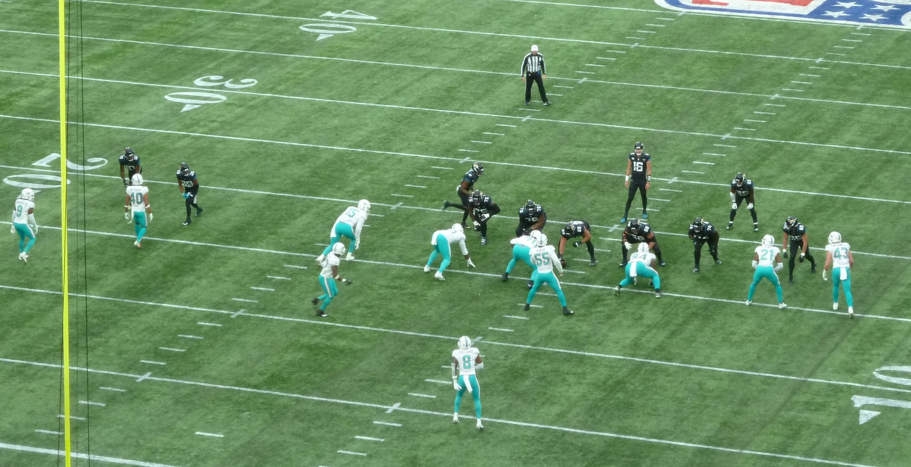
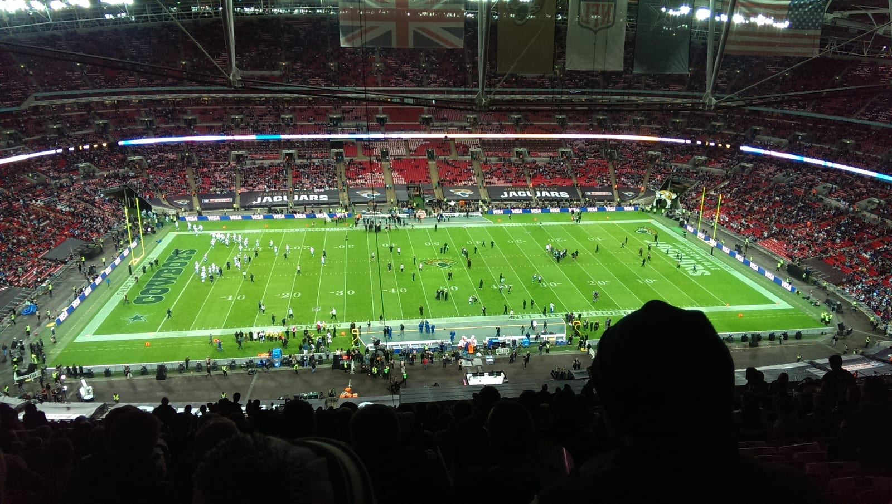

The NFL plays three games in London in October 2026, all on Sundays at **2.30pm BST**: two at Tottenham Hotspur Stadium, one at Wembley. The Tottenham games and the Wembley game are sold through different systems and different accounts.

> 💡 **The Short Version:** **Colts v Commanders, Sunday 4 October** and **Eagles v Jaguars, Sunday 11 October**, both at **Tottenham**; **Texans v Jaguars, Sunday 18 October**, at **Wembley**. All **2.30pm**. Tottenham tickets are sold by the NFL (an **NFL Ticketmaster account**, six per account per game, **£79.13 to £280.65** with fees included); **Eagles v Jaguars has sold out**. Wembley tickets are sold by the **Jaguars**, **£70 to £297**, **under-16s £51**. **Gates open at 12.30pm**. You **can drink in your seat** (18+, photo ID, four drinks per purchase). Both stadiums are **cashless**, and bags must be **clear and no bigger than 30.5 x 15.25 x 30.5cm**, with nowhere to leave one that fails. No ticket? All three are **free to air on 5**.

---

> 🧭 **Plan the rest of it:** [Getting to Tottenham Hotspur Stadium](/articles/tottenham-hotspur-stadium-travel-guide/) · [Getting to Wembley](/articles/wembley-stadium-arena-guide/) · [Things to do in London in October](/articles/things-to-do-in-london-in-october/) · [The UK ETA](/articles/uk-eta-guide/)

## The three fixtures

| Date | Kick-off | Stadium | Game and who sells the tickets |
| --- | --- | --- | --- |
| **Sun 4 October** | 2.30pm | **Tottenham Hotspur Stadium** | **Indianapolis Colts v Washington Commanders**, sold by the NFL |
| **Sun 11 October** | 2.30pm | **Tottenham Hotspur Stadium** | **Philadelphia Eagles v Jacksonville Jaguars**, sold by the NFL |
| **Sun 18 October** | 2.30pm | **Wembley Stadium** | **Houston Texans v Jacksonville Jaguars**, sold by the Jaguars |

*From the [NFL](https://www.nfl.com/international/games/london/faqs), [Tottenham Hotspur Stadium](https://www.tottenhamhotspurstadium.com/events/1069172/nfl-2026) and [Wembley Stadium](https://www.wembleystadium.com/events/2026/Jacksonville-Jaguars), 21 September 2026.*

Getting there, road closures and parking are in our [Tottenham Hotspur Stadium guide](/articles/tottenham-hotspur-stadium-travel-guide/) and [Wembley guide](/articles/wembley-stadium-arena-guide/).

---

## Tickets

### The Tottenham games: sold by the NFL

You need an **NFL Ticketmaster account**: set it up at [nfl.com/international/ticketaccount](https://www.nfl.com/international/ticketaccount) before you buy. Both games are sold on the [NFL's Tottenham ticket site](https://www.eticketing.co.uk/nfl-tottenham). Prices include fees.

| Category | Colts v Commanders, 4 Oct | Eagles v Jaguars, 11 Oct |
| --- | --- | --- |
| 1 | £245.65 | £280.65 |
| 2 | £235.65 | £255.65 |
| 3 | £215.65 | £225.65 |
| 4 | £200.65 | £210.65 |
| 5 | £185.65 | £195.65 |
| 6 | £164.15 | £180.50 |
| 7 | £142.35 | £153.25 |
| 8 | £115.10 | £126.00 |
| 9 | £79.13 | £79.13 |
| **Category 4 child** | **£101.48** | **£106.93** |
| **Category 9 child** | **£39.89** | **£39.89** |

*Prices [published by the NFL](https://www.nfl.com/news/2026-nfl-london-games-tickets-sales-windows), 21 September 2026.*

- **Child tickets are only in categories 4 and 9.**
- **Six tickets per account per game.** The NFL cancels orders from bots or duplicate accounts.
- **Accessible seats aren't sold online.** Apply through the NFL's enquiry form; it replies within five working days.
- **Tickets are digital only**, emailed to the lead booker at least 72 hours before kick-off. Each person needs their own ticket in Apple Wallet or Google Pay on their own phone.

> ⚠️ **Eagles v Jaguars has sold out.** On 21 September 2026 the official site had nothing left for 11 October, including accessible seats. **Colts v Commanders on 4 October is still on sale.**

### The Wembley game: sold by the Jaguars

On sale on the [Jaguars' own site](https://jaguars.co.uk/wembley2026/).

| Level and seat | Price |
| --- | --- |
| **Level 2: Sideline Central** | **£297** |
| Level 2: Sideline | £250 |
| Level 1: Category 1 | £232 |
| Level 1: Category 2 | £197 |
| Level 2: End Zone 2 | £185 |
| Level 2: End Zone 1 | £176 |
| Level 5: Category 3 | £146 |
| Level 1: Category 5 | £136 |
| Level 5: Category 4 | £131 |
| Level 5: Category 6 | £103 |
| Level 5: Category 7 | £86 |
| Level 5: Category 8 | £72 |
| Level 1: Category 10 (part obstructed) | £71 |
| Level 5: Category 9 | £70 |
| **Under-16s** | **£51** |

*The Jaguars' prices, 21 September 2026.*

- **Under-16 tickets are only in categories 5, 9 and 10**, bought with an adult ticket in the same category, and at most three per adult.
- **No under-2s at all.** Tottenham lets an under-2 in free; Wembley doesn't.
- **Tickets arrive about ten working days before the game.**

### If you can't use your ticket

Resell it at face value through the official channel: the **NFL Ticket Exchange** for Tottenham, or **Ticketmaster's Last Available Ticket service** in your Jaguars account for Wembley. A ticket resold any other way can be cancelled at the gate, with no entry and no refund, so don't buy one from a stranger.

---

Powered by <a target="_blank" rel="sponsored" href="https://www.getyourguide.com/london-l57/">GetYourGuide</a>

## On the day

| Time | What is happening |
| --- | --- |
| **10.00** | **NFL Gameday Experience** opens around the ground: free, no ticket needed |
| **12.30** | **Gates open** |
| **14.00** | The NFL asks you to be **in your seat** for the pre-game show |
| **14.30** | **Kick-off** |
| **early evening** | Final whistle |

*From the [NFL's gameday guide](https://www.nfl.com/news/2026-nfl-london-games-gameday-guide), 21 September 2026. Wembley has not published its entry times for 18 October.*

**There's no tailgating.** Instead, the Gameday Experience runs from 10am to 2pm, with the McCoy's Quarterback Challenge, DJs, cheerleaders, mascots, the official NFL shop and food and drink stalls.

**You can drink in your seat.** Unlike at football, alcohol is sold inside the bowl and you can take it to your seat. You must be **18 or over** with **government-issued photo ID** (a passport works), and you can buy **four drinks at a time**.

**No re-entry.** Once you leave, you're out.

**Both stadiums are cashless.** At Tottenham a contactless card is capped at £100 a tap; Apple Pay and Google Pay aren't.

> ⚠️ **Clear bags only.** A clear plastic, vinyl or PVC bag no larger than **30.5 x 15.25 x 30.5cm**, or a one-gallon clear freezer bag, plus one clutch up to **11.5 x 16.5cm**. **Neither stadium stores bags that fail**, and a bag that gets you into a Spurs match may not get you in here. Our [luggage storage guide](/articles/luggage-storage-london/) has options near the main stations.

No food or drink comes in, except an **empty clear plastic bottle up to a litre** for the water points. Umbrellas must be collapsible and under 61cm. No smoking or vaping inside.

---

## Getting home on a Sunday evening

**There's no Night Tube on Sundays**, and trains run to the normal Sunday timetable, so check your last train before you plan dinner.

- **Tottenham**: four stations, with White Hart Lane five minutes away. Taxis can't reach the ground; the NFL says to arrange a pick-up at least a 15-minute walk away. Stations and last trains are in our [Tottenham Hotspur Stadium guide](/articles/tottenham-hotspur-stadium-travel-guide/).
- **Wembley**: most of the crowd goes through Wembley Park; Chiltern's last train to Marylebone leaves around midnight, and the official car parks are £50. Details are in our [Wembley guide](/articles/wembley-stadium-arena-guide/).

For step-free routes, see our [step-free London guide](/articles/step-free-london/).

---

## If you can't get a ticket

**All three games are live free-to-air on 5**, as well as on Sky Sports and NFL Game Pass on DAZN.

**Sport London** shows all three games at its six pubs and takes table bookings:

| Pub | Where |
| --- | --- |
| **Greenwood** | 170 Victoria Street, SW1E 5LB |
| **Goldwood** | 30–32 Old Jewry, EC2R 8DQ (Bank) |
| **Broadwood** | 25 Old Broad Street, EC2N 1HN (Liverpool Street) |
| **Beechwood** | 1A Principal Place, Worship Street, EC2A 2FA (Shoreditch) |
| **Redwood** | London Bridge Station, SE1 9SP |
| **Westwood** | Westfield London, Ariel Way, W12 7HB |

The Jaguars hold their own UK watch parties at the Greenwood, listed on [jaguars.co.uk](https://jaguars.co.uk/).

> ⚠️ **Book a table.** On **11 and 18 October** the game overlaps [Premier League matches](/articles/premier-league-tickets-london/) at 2pm, and a pub that hasn't promised a screen to the NFL will show the football. [Sport London's NFL schedule](https://www.sportlondon.com/american-football/nfl) lists each game.

---

## What else is on those weekends

- **BFI London Film Festival, 7 to 18 October**: see our [London Film Festival guide](/articles/london-film-festival/).
- **Frieze Week, 14 to 18 October**: five art fairs, and higher hotel prices in central London.
- **England v Czechia at Wembley, Tuesday 6 October.**
- **Jaguars practice session, Friday 16 October**: a free draw for two passes, open to UK and Ireland residents aged 18 or over. [Entries close on 25 September](https://jaguars.co.uk/join-the-practice-session-draw/).

More in our [things to do in London in October guide](/articles/things-to-do-in-london-in-october/).

Stay in central London rather than near either ground: Wembley room prices roughly treble on a big night (see our [Wembley guide](/articles/wembley-stadium-arena-guide/)). Our [best areas to stay in London](/articles/best-areas-to-stay-in-london/) guide covers the Victoria and Jubilee line areas that reach both stadiums.

---

## Before you fly

- **Get a UK ETA.** Americans, Canadians, Australians and New Zealanders need one. It costs **£20** and must be approved before you board; allow up to three working days. Apply only at gov.uk or in the official app. See our [UK ETA guide](/articles/uk-eta-guide/).
- **Bring a contactless card or phone wallet.** The stadiums are cashless and so is London transport; [how Oyster and contactless work](/articles/oyster-card-guide-london/).
- **Charge your phone.** Your ticket is on it, and there's no paper backup.

*Prices, sale dates, bag rules and timings from the NFL, the Jaguars and both stadiums, 21 September 2026. Check the official page for your game before you book travel.*
