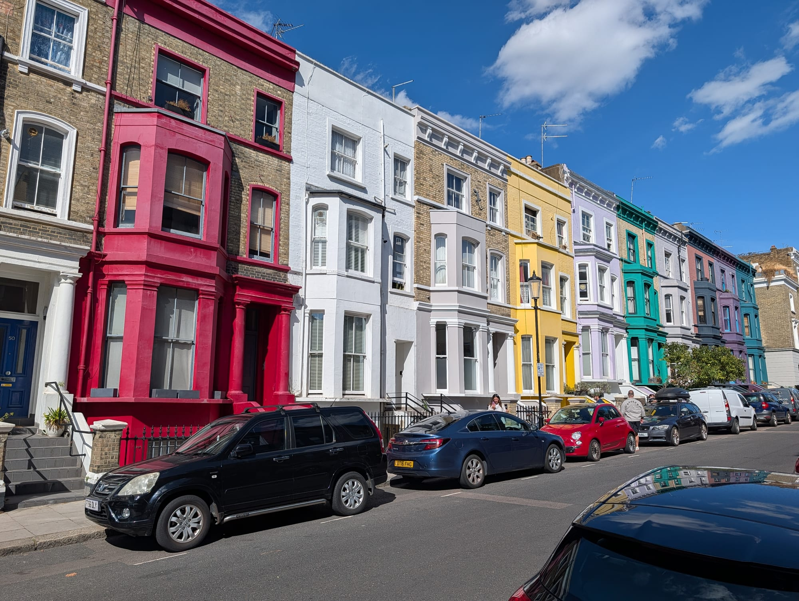

Notting Hill is a west London village of pastel terraces, antique arcades and a market that stretches for over a mile. It is also one of the most misunderstood areas in the city: most visitors turn up on the wrong day, photograph the wrong streets, and leave wondering what the fuss was about.

This guide covers what is actually open when, which streets have the houses you have seen online, and how to combine Notting Hill with the canal walk east that most people miss entirely.

Notting Hill has its own share of the commemorative plaques marking where notable people lived or worked - see them on our [interactive map](/plaques/?area=notting-hill).

## Why visit — and who should skip it

**Come here if** you like browsing more than ticking off landmarks. Notting Hill rewards slow wandering: antique arcades, secondhand bookshops, independent boutiques on Westbourne Grove and a genuinely excellent pub scene. It is the best area in London for vintage and antiques by a wide margin, and one of the prettiest to walk through in good weather.

**Skip it if** you are on a short trip built around major sights. There is no museum here, no cathedral, no palace. Notting Hill is atmosphere and shopping. On a three-day first visit, Westminster, the South Bank and the British Museum will serve you better — save this for a return trip or a spare Saturday.

**One honest warning:** the pastel houses are private homes. Residents on Lancaster Road and St Luke's Mews deal with photographers on their doorsteps every single day, and some have put up signs asking people to stop. Photograph from the pavement, keep off the steps, and do not block front doors.

## Top sights and activities

1. **Portobello Road Market** — Over a mile of stalls, and the largest antiques market in the world by number of dealers. The character changes completely as you walk north: antique arcades at the southern end near Notting Hill Gate, then fruit and veg, then vintage clothing under the Westway flyover, then a flea market towards Ladbroke Grove.
2. **The antique arcades** — The real find, and most visitors walk straight past them. Admiral Vernon, Portobello Studios and Roger's Arcade are indoor warrens of dealer stalls selling silver, jewellery, maps and militaria. Open Fridays and Saturdays only.
3. **Lancaster Road pastel terraces** — The rainbow row that appears on every Notting Hill postcard. Just north of Ladbroke Grove station, and best photographed in morning light.
4. **The Churchill Arms** — An 18th-century pub buried under thousands of flowers in summer and around 90 Christmas trees in December, serving Thai food in its back conservatory. Genuinely worth the detour on Kensington Church Street.
5. **Holland Park and the Kyoto Garden** — Fifteen minutes south, and the quietest good park in west London. The Japanese garden has koi ponds, a waterfall and resident peacocks.
6. **Notting Hill Bookshop** — The Blenheim Crescent shop that inspired the film. Small, busy, and a working bookshop rather than a museum piece.
7. **Golborne Road** — The far northern end, past the flea market. Portuguese cafes, Moroccan grocers and far fewer visitors. This is where locals actually shop.

## Key streets and micro-districts

*Lancaster Road pastel houses. Photo: [Bex Walton](https://commons.wikimedia.org/wiki/File:Colourful_houses_in_Lancaster_Road,_Notting_Hill_2020-07-05.jpg), [CC BY 2.0](https://creativecommons.org/licenses/by/2.0/).*

### Portobello Road (south) — antiques
From Chepstow Villas to Elgin Crescent. Antique shops and the indoor arcades, open Friday and Saturday. Quiet and shuttered the rest of the week.

### Portobello Road (north) and the Westway — vintage
Past Lancaster Road and under the flyover. Vintage clothing, records and street food. Busiest part of the market on a Saturday afternoon.

### Westbourne Grove — boutiques and brunch
The east–west shopping street. Independent fashion, homeware and the area's brunch cafes. Open all week, which makes it the reliable choice on a market-free day.

### Golborne Road — the local end
North of the Westway. Portuguese pastelarias, antiques at lower prices and almost no crowds.

### St Luke's Mews and Lancaster Road — the photogenic streets
Two short residential streets. Beautiful, entirely private, and permanently busy with photographers. Be considerate.

## Where to eat and drink

| Spot | Style | Price | Why go |
| --- | --- | --- | --- |
| **The Churchill Arms** | Historic pub, Thai kitchen | ££ | Flower-covered exterior; book the conservatory at weekends |
| **The Pelican** | Refined pub dining | £££ | The area's best Sunday roast; reserve well ahead |
| **Granger & Co.** | Australian all-day cafe | ££ | Ricotta hotcakes; expect a queue after 10am at weekends |
| **Layla** | Bakery | £ | Excellent pastries on Golborne Road, away from the crush |
| **Lisboa Patisserie** | Portuguese cafe | £ | Pastéis de nata on Golborne Road since 1985 |
| **Electric Diner** | American diner | ££ | Next to the Electric Cinema; good for a late lunch |

## Getting there

**By Tube.** Notting Hill Gate sits on the Central, District and Circle lines. The Central line is the fastest from the West End — about eight minutes from Oxford Circus. For the northern end of the market, stay on to **Ladbroke Grove** (Circle and Hammersmith & City) instead and walk south down Portobello Road, which puts you at the vintage end first and lets the crowds thin as you go.

**Best exit.** From Notting Hill Gate, take **Exit 3** for Portobello Road and follow Pembridge Road north. The market entrance is a five-minute walk.

**From Heathrow.** Take the Elizabeth line or Heathrow Express to Paddington, then the Circle or Hammersmith & City line two stops to Ladbroke Grove. See the [Heathrow Airport transport guide](/articles/heathrow-airport-to-london/) for fares and terminal detail.

**On foot.** Twenty minutes from Kensington Gardens, twenty-five from Little Venice along the canal. See which lines serve the area in the [London Tube and Rail Lines Guide](/articles/london-tube-and-rail-lines-guide/).

## How long to spend, and when to go

| If you have | Do this |
| --- | --- |
| **Two hours** | Portobello Road from Notting Hill Gate to Lancaster Road, then back |
| **Half a day** | The full market walk to Golborne Road, lunch, and the pastel streets |
| **A full day** | Add Holland Park and the Kyoto Garden, or walk the canal to Little Venice |

**Best day:** Saturday for the complete market, Friday for antiques with room to browse.

**Best time:** Before 10am. Portobello Road on a Saturday afternoon is shoulder-to-shoulder from the Westway southwards, and the arcades become difficult to browse properly.

**Avoid:** Sunday, when the market does not run and much of the road is shut. Also the August bank holiday weekend unless you are specifically coming for Carnival.

## Suggested two-hour walking route

1. **Start:** Ladbroke Grove station. Walk south to **Lancaster Road** for the pastel terraces in morning light.
2. **Portobello Road north:** Turn onto Portobello and walk under the **Westway** through the vintage stalls.
3. **Golborne Road detour** *(add 20 minutes)*: North for a pastel de nata at Lisboa before doubling back.
4. **The arcades:** South past Blenheim Crescent — stop at the **Notting Hill Bookshop** — and into **Admiral Vernon** arcade.
5. **Westbourne Grove:** East for boutiques and coffee.
6. **Finish:** The **Churchill Arms** on Kensington Church Street, or continue south to **Holland Park**.

## Common mistakes to avoid

1. **Coming on a Sunday.** The market does not run. This is the single most common Notting Hill mistake — plan for Friday or Saturday.
2. **Starting at Notting Hill Gate on a Saturday.** You arrive at the busiest end and walk against the flow. Start at Ladbroke Grove and walk south instead.
3. **Missing the indoor arcades.** Most people walk the street and never step inside, which is where the serious antique dealers actually are.
4. **Treating residential streets as a film set.** Lancaster Road and St Luke's Mews are people's homes. Shoot from the pavement.
5. **Only walking the southern half.** Golborne Road is fifteen minutes further and a completely different, far less touristed neighbourhood.
6. **Assuming Carnival is a normal visit.** Over the August bank holiday the area is closed to ordinary sightseeing entirely.

## Where to stay

Notting Hill is a pleasant, quiet base with good Central line access, though it is residential and prices reflect the postcode.

- **Portobello and Ladbroke Grove** — Small boutique hotels and townhouse conversions. Quiet at night, walkable to the market.
- **Bayswater and Queensway** — Ten minutes east, noticeably cheaper, and well connected via Paddington for Heathrow arrivals.
- **Holland Park** — The most expensive and the quietest, with good access south to Kensington's museums.

If you are arriving from Heathrow and want to avoid changing lines with luggage, staying near **Paddington** and travelling in each day is often the easier choice.
