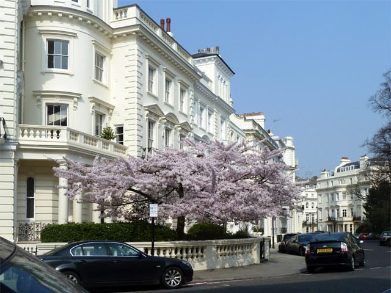
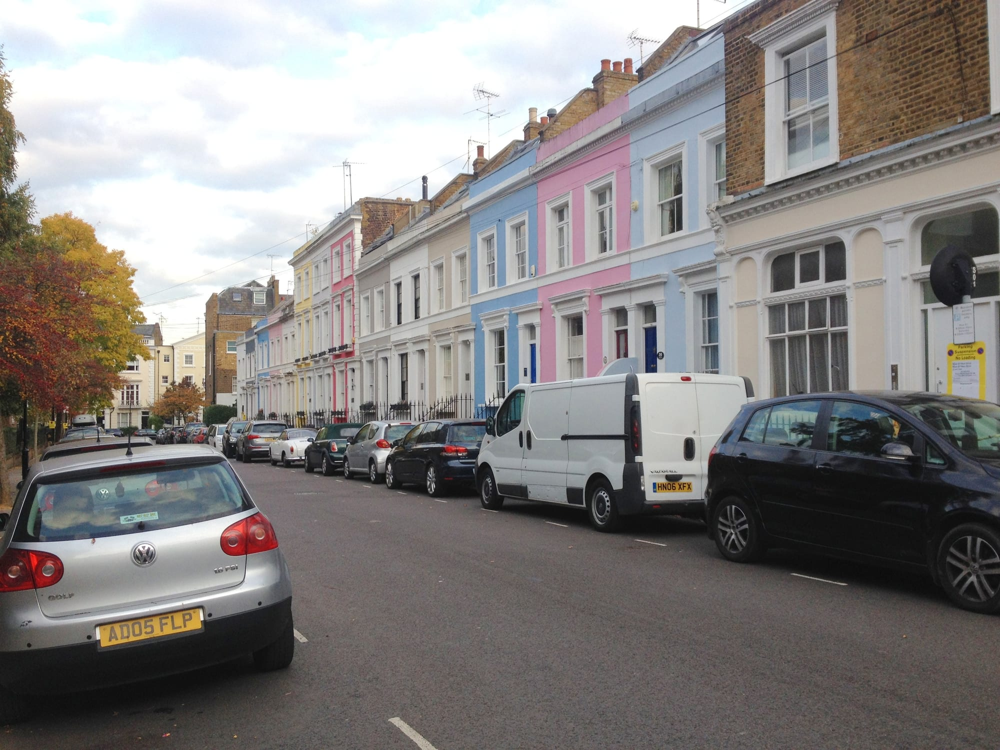
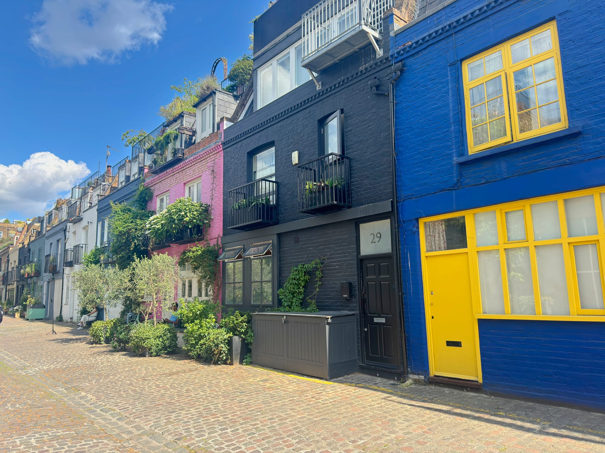

Almost everyone looking for Notting Hill's colourful houses goes to Portobello Road, walks its length, photographs some painted shopfronts and leaves slightly puzzled. **The pastel terraces are not on Portobello Road.** They are on the residential streets around it, and the best of them is a cluster of four streets that most visitors walk straight past on their way out of the station.

This guide is a route through the eleven streets that actually have the colour, in walking order, from Notting Hill Gate to Ladbroke Grove. It also covers where the cherry blossom is, if you are here in spring.

It is deliberately only about the houses. For the market, the antique arcades, Golborne Road and where to eat, see our [Notting Hill area guide](/articles/notting-hill-area-guide/) — the two are designed to be walked on the same day.

> 💡 **The Short Version:** Start at **Hillgate Place** — four minutes from Notting Hill Gate and the prettiest of the lot, with a fraction of the crowd. **Lancaster Road** has the strongest colours and the most photographers. **Lansdowne Road** and **Elgin Crescent** are the grand pale stucco version. And **Portobello Road** itself is shopfronts, not houses — which is why so many people leave disappointed. Go there for [the market](/articles/best-london-markets/), not the colour.

## Start with the four streets nobody visits

**Hillgate Village** is the name for a pocket of four short streets — Hillgate Place, Farmer Street, Hillgate Street and Jameson Street — immediately north-west of Notting Hill Gate station. The houses are small, two and three storeys, and painted in flat blocks of colour: pink, sage, butter, powder blue, a deep coral.

They are smaller than the stucco terraces elsewhere in Notting Hill because they were not built for the same people. This was workers' housing for the potteries and brickfields that gave Pottery Lane its name, thrown up in the 1850s on what was then the unfashionable edge of the district. The scale is the reason the colour works: on a three-storey cottage a strong colour reads as cheerful, where on a five-storey stucco terrace it would read as a mistake.

The practical point is that they are **four minutes from a Central line station and almost empty**. Portobello Road is a fifteen-minute walk north and takes essentially all of the foot traffic. On a Friday afternoon in September there were two other people photographing here; the same afternoon on Lancaster Road there were about thirty.

### 1. Hillgate Place

The best single street of the four, and the one to walk first. It bends, which means the colours stack up in the view rather than running away from you in a straight line — the reason it photographs better than streets with more dramatic individual houses.

Walk it in both directions. The north side and the south side are painted quite differently, and the corner where it meets Hillgate Street stacks four colours into one frame.

### 2. Farmer Street

The blue-pink-cream run near the top is the most photographed thing in Hillgate Village, helped along by the residents' habit of parking interesting cars outside it. One house is covered almost entirely in ivy that has been cut back around the windows, which is either the best or the worst house on the street depending on your feelings about ivy.

### 3. Hillgate Street

The long view. Hillgate Street gives you the most houses in one frame of anywhere in this guide, running downhill with the colours in sequence. There is a construction crane on the skyline at the far end, which you will either crop out or decide is honest.

### 4. Jameson Street

The shortest of the four and the quickest to walk. Its corner house is a strong flat pink against a grey terrace, and it closes the loop back towards Notting Hill Gate.

### 5. Portland Road

Ten minutes south-west of Hillgate Village and a different kind of colour: **Portland Road** runs down to Clarendon Cross, where a cluster of painted shopfronts and small houses sits around a junction with no through traffic and no market. It is the quietest thing in this guide.

Worth the detour mainly if you want somewhere to sit down. Clarendon Cross has a couple of cafes and the pace drops the moment you turn off Holland Park Avenue.

## Then go north for the grand version

The colour changes character about ten minutes' walk north-west. The houses get bigger, the paint gets paler, and the effect is less village and more Kensington.

### 6. Lansdowne Road

Wide, tree-lined, and expensive-looking in a way the Hillgate streets are not. The houses here are four and five storeys with proper porticos, painted in muted creams, yellows and blue-greys. It is the version of Notting Hill that estate agents photograph. Worth walking for the contrast more than for the colour — after Hillgate Place the palette feels almost restrained.

### 7. Elgin Crescent

The best of the grand streets. Elgin Crescent curves, so the pale yellow and powder blue frontages come at you in a sweep rather than a line, and the houses are tall enough that you get the colour and the sky in the same frame. If you only walk one of the northern streets, walk this one.

### 8. Stanley Crescent

*Cherry blossom on Stanley Crescent. Photo: [Robin Webster](https://commons.wikimedia.org/wiki/File:Cherry_blossom_on_Stanley_Crescent_-_geograph.org.uk_-_4994280.jpg), [CC BY-SA 2.0](https://creativecommons.org/licenses/by-sa/2.0/).*

White stucco rather than paint, so for most of the year this is the least colourful street here. **For about two weeks in spring it is the most.** See the blossom section below before you plan around it.

### 9. Denbigh Terrace

*Denbigh Terrace. Photo: [Chris Whippet](https://commons.wikimedia.org/wiki/File:Denbigh_Terrace,_Notting_Hill_-_geograph.org.uk_-_5188797.jpg), [CC BY-SA 2.0](https://creativecommons.org/licenses/by-sa/2.0/).*

A short run of houses packed tightly in pink, powder blue, pale yellow and cream, a minute off Portobello Road. Because the terrace is narrow and the houses are three storeys, the colours stack vertically as well as along — you get more of them in a frame here than anywhere except Lancaster Road.

## Finish on the strongest colour, and a mews

### 10. Lancaster Road

The postcard row, and the strongest colours in Notting Hill: a deep raspberry pink next to white, next to a mid blue, next to a green. This is the terrace behind most of the photographs that make people come to Notting Hill in the first place.

It is also the busiest spot on this walk by some distance, and the one where the etiquette below matters most. Expect other people in your photograph and expect to wait for a gap. Ladbroke Grove station is four minutes away, which makes this the natural end of the route.

### 11. St Luke's Mews

*St Luke's Mews. Photo: [Bex Walton](https://commons.wikimedia.org/wiki/File:St_Lukes_Mews_2025-06-14.jpg), [CC BY 4.0](https://creativecommons.org/licenses/by/4.0/).*

Three minutes east of Lancaster Road, off All Saints Road, and the only cobbled mews on this walk. The colours are the boldest in Notting Hill — a full cobalt blue with yellow window frames, a strong pink, a mint green — and the cobbles and the narrowness do most of the work.

**The pink house at number 27 is the *Love Actually* doorstep**, where Mark holds up the cue cards. That gets it a steady trickle of visitors on top of everyone photographing the mews itself, on a street with no pavement and no room to stand back.

## The etiquette, which is not optional

These are people's homes. Every street in this guide is ordinary residential housing with residents who did not ask to live on a photography trail, and there has been real friction in Notting Hill about it — front steps used as seating, doorways blocked, whole terraces treated as a backdrop.

Three rules cover almost all of it:

- **Photograph from the pavement.** Not from the steps, not from the porch, not leaning on the railings.
- **Do not block a front door.** If someone is trying to get in or out of their own house, move first and take the photo afterwards.
- **Keep the noise down**, especially early. The best light and the smallest crowds are both in the morning, when people are asleep behind those windows.

Some residents have painted their houses deliberately drab in response to the attention, which tells you how far this has gone.

## If you come in spring: the cherry blossom

Notting Hill's blossom is genuinely good and almost all of the attention lands on one street.

**Stanley Crescent** is the one. A run of cherry trees in front of white stucco, and in the last few springs it has drawn crowds heavy enough that residents have gone to the press about it — people setting up tripods for hours, blocking the pavement, and in at least one reported case getting changed in the street between outfits. It is a residential crescent, not a park.

**Go early on a weekday and stay on the pavement.** If there is a queue for a tree, that is the point at which to walk to one of the others rather than join it.

Because there are others, and they are the reason this section is not just one street:

- **Lansdowne Road and Elgin Crescent** have blossom along their front gardens and far more room to stand.
- **Kensington Park Gardens**, which meets Stanley Crescent at its western end, has trees along the same terraces without the reputation.
- **Ladbroke Square and the crescents off it** are dense with mature trees, visible over the garden walls.

**On timing:** London's cherry blossom is usually at its best from late March to mid April, and the peak lasts one to two weeks. It moves by a fortnight either way depending on the winter, so treat any fixed date as a guess — the trees on the ground are the only reliable forecast. Magnolias come slightly earlier on these same streets, and wisteria follows in late April and May.

If you are chasing blossom rather than houses, the [parks and gardens guide](/articles/best-parks-gardens-london/) covers where else in London to find it, with room to stand.

## Getting there and when to go

**Start at Notting Hill Gate** (Central, District and Circle lines) and finish at **Ladbroke Grove** (Circle and Hammersmith & City). Walking it the other way works equally well but ends with the quietest streets, which is an anticlimax.

**Weekday mornings are the quietest.** Saturday is Portobello Road's full market day, which is worth seeing on its own terms but pushes crowds out into the surrounding streets. Friday is the antiques day and busy but manageable. Sunday is the quietest of the weekend.

**On light**, this route was walked on a clear early September afternoon and the frontages on the Hillgate streets and Lancaster Road were lit from about two o'clock onwards. In midwinter, when the sun stays low, the narrow streets are in shade for much of the day.

The whole route is free, outdoors and step-free on pavements throughout.

## What to do with the rest of the day

You finish at Ladbroke Grove, which is the top of Portobello Road, so the obvious continuation is to walk back down it.

- **[The Notting Hill area guide](/articles/notting-hill-area-guide/)** — the market, the antique arcades most visitors walk past, Golborne Road and the Churchill Arms.
- **[London's best markets](/articles/best-london-markets/)** — where Portobello sits among them, and which days each one actually runs.
- **[Free things to do in London](/free/)** — this walk is one of them.
- **[The best parks and gardens](/articles/best-parks-gardens-london/)** — Holland Park and the Kyoto Garden are fifteen minutes south of where you started.
