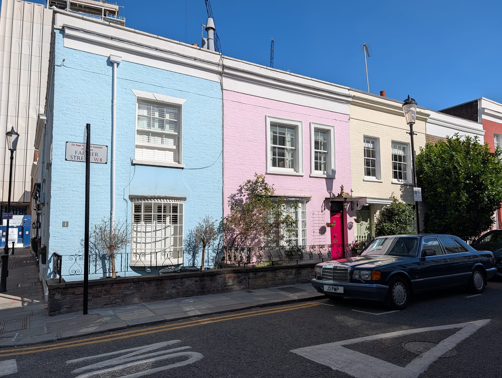
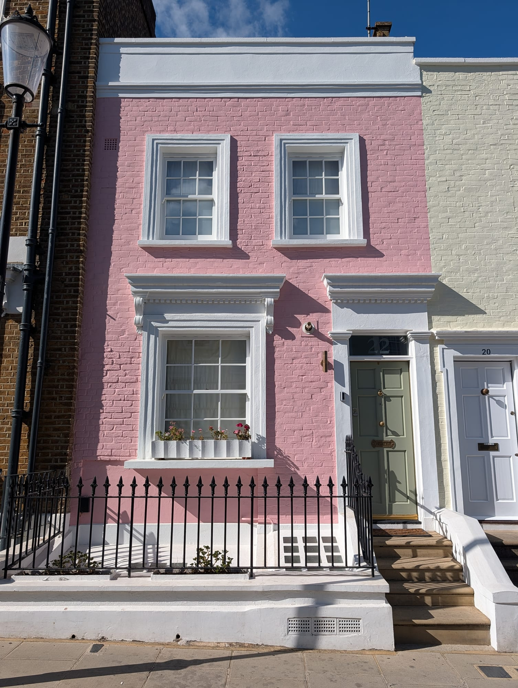
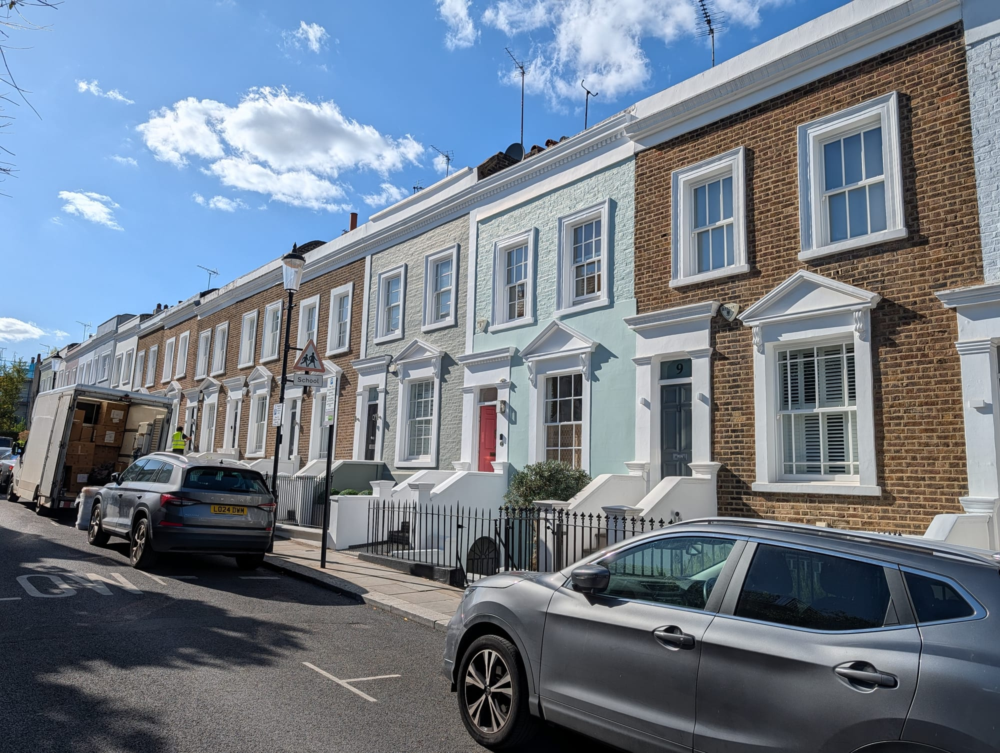
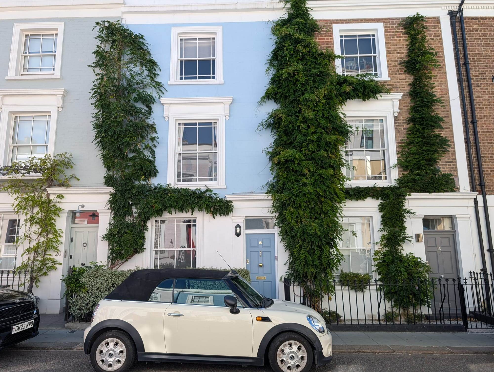
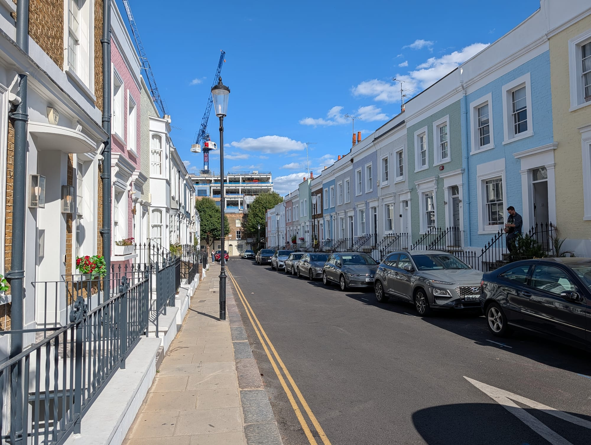
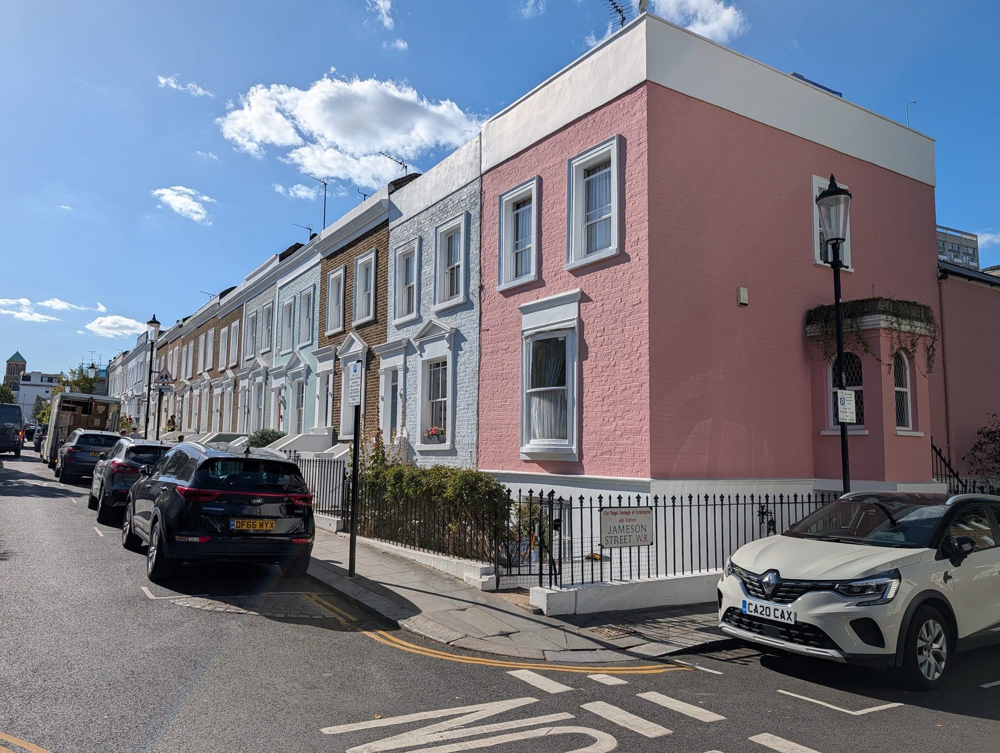
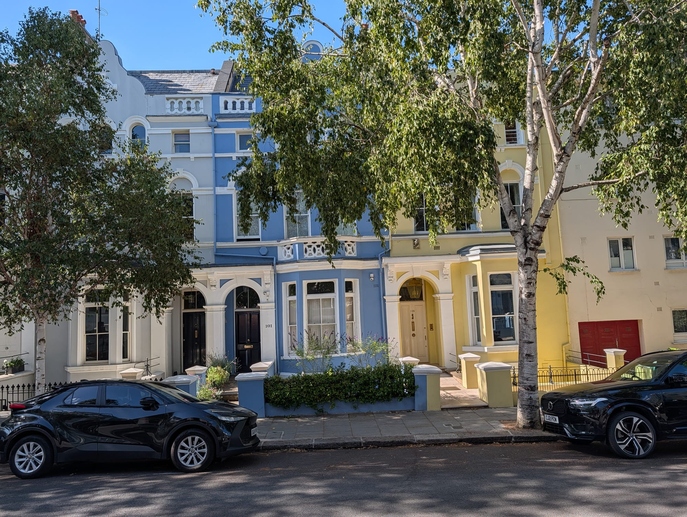
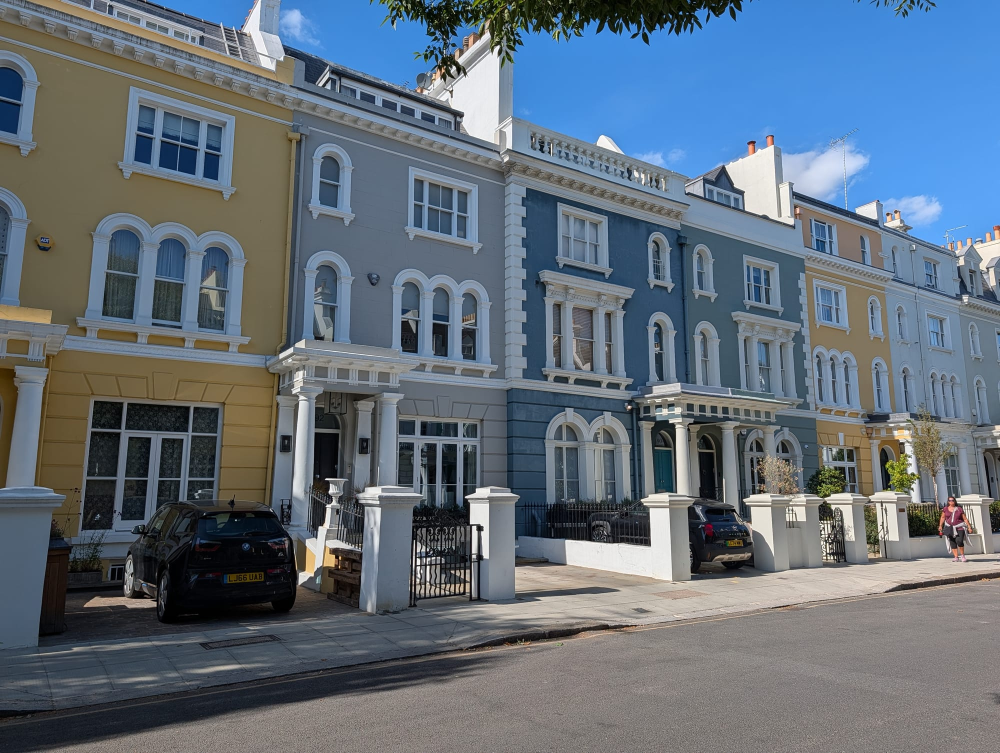

Almost everyone looking for Notting Hill's colourful houses goes to Portobello Road, walks its length, photographs some painted shopfronts and leaves slightly puzzled. **The pastel terraces are not on Portobello Road.** They are on the residential streets around it, and the best of them is a cluster of four streets that most visitors walk straight past on their way out of the station.

This guide is a route through the seven streets that actually have the colour, in walking order, from Notting Hill Gate to Ladbroke Grove.

> 💡 **The Short Version:** Start at **Hillgate Place** — four minutes from Notting Hill Gate and the prettiest of the lot, with a fraction of the crowd. **Lancaster Road** has the strongest colours and the most photographers. **Lansdowne Road** and **Elgin Crescent** are the grand pale stucco version. And **Portobello Road** itself is shopfronts, not houses — which is why so many people leave disappointed.

## Start with the four streets nobody visits

**Hillgate Village** is the name for a pocket of four short streets — Hillgate Place, Farmer Street, Hillgate Street and Jameson Street — immediately north-west of Notting Hill Gate station. The houses are small, two and three storeys, and painted in flat blocks of colour: pink, sage, butter, powder blue, a deep coral.

They are smaller than the stucco terraces elsewhere in Notting Hill because they were not built for the same people. This was workers' housing for the potteries and brickfields that gave Pottery Lane its name, thrown up in the 1850s on what was then the unfashionable edge of the district. The scale is the reason the colour works: on a three-storey cottage a strong colour reads as cheerful, where on a five-storey stucco terrace it would read as a mistake.

The practical point is that they are **four minutes from a Central line station and almost empty**. Portobello Road is a fifteen-minute walk north and takes essentially all of the foot traffic. On a Friday afternoon in September there were two other people photographing here; the same afternoon on Lancaster Road there were about thirty.

### 1. Hillgate Place

The best single street of the four, and the one to walk first. It bends, which means the colours stack up in the view rather than running away from you in a straight line — the reason it photographs better than streets with more dramatic individual houses.

Walk it in both directions. The north side and the south side are painted quite differently, and the corner where it meets Hillgate Street stacks four colours into one frame.

### 2. Farmer Street

The blue-pink-cream run near the top is the most photographed thing in Hillgate Village, helped along by the residents' habit of parking interesting cars outside it. One house is covered almost entirely in ivy that has been cut back around the windows, which is either the best or the worst house on the street depending on your feelings about ivy.

### 3. Hillgate Street

The long view. Hillgate Street gives you the most houses in one frame of anywhere in this guide, running downhill with the colours in sequence. There is a construction crane on the skyline at the far end, which you will either crop out or decide is honest.

### 4. Jameson Street

The shortest of the four and the quickest to walk. Its corner house is a strong flat pink against a grey terrace, and it closes the loop back towards Notting Hill Gate.

## Then go north for the grand version

The colour changes character about ten minutes' walk north-west. The houses get bigger, the paint gets paler, and the effect is less village and more Kensington.

### 5. Lansdowne Road

Wide, tree-lined, and expensive-looking in a way the Hillgate streets are not. The houses here are four and five storeys with proper porticos, painted in muted creams, yellows and blue-greys. It is the version of Notting Hill that estate agents photograph. Worth walking for the contrast more than for the colour — after Hillgate Place the palette feels almost restrained.

### 6. Elgin Crescent

The best of the two grand streets. Elgin Crescent curves, so the pale yellow and powder blue frontages come at you in a sweep rather than a line, and the houses are tall enough that you get the colour and the sky in the same frame. If you only walk one of the northern streets, walk this one.

## Finish on the street with the strongest colour

### 7. Lancaster Road

The postcard row, and the strongest colours in Notting Hill: a deep raspberry pink next to white, next to a mid blue, next to a green. This is the terrace behind most of the photographs that make people come to Notting Hill in the first place.

It is also the busiest spot on this walk by some distance, and the one where the etiquette below matters most. Expect other people in your photograph and expect to wait for a gap. Ladbroke Grove station is four minutes away, which makes this the natural end of the route.

## The etiquette, which is not optional

These are people's homes. Every street in this guide is ordinary residential housing with residents who did not ask to live on a photography trail, and there has been real friction in Notting Hill about it — front steps used as seating, doorways blocked, whole terraces treated as a backdrop.

Three rules cover almost all of it:

- **Photograph from the pavement.** Not from the steps, not from the porch, not leaning on the railings.
- **Do not block a front door.** If someone is trying to get in or out of their own house, move first and take the photo afterwards.
- **Keep the noise down**, especially early. The best light and the smallest crowds are both in the morning, when people are asleep behind those windows.

Some residents have painted their houses deliberately drab in response to the attention, which tells you how far this has gone.

## Getting there and when to go

**Start at Notting Hill Gate** (Central, District and Circle lines) and finish at **Ladbroke Grove** (Circle and Hammersmith & City). Walking it the other way works equally well but ends with the quietest streets, which is an anticlimax.

**Weekday mornings are the quietest.** Saturday is Portobello Road's full market day, which is worth seeing on its own terms but pushes crowds out into the surrounding streets. Friday is the antiques day and busy but manageable. Sunday is the quietest of the weekend.

**On light**, this route was walked on a clear early September afternoon and the frontages on the Hillgate streets and Lancaster Road were lit from about two o'clock onwards. In midwinter, when the sun stays low, the narrow streets are in shade for much of the day.

The whole route is free, outdoors and step-free on pavements throughout.
