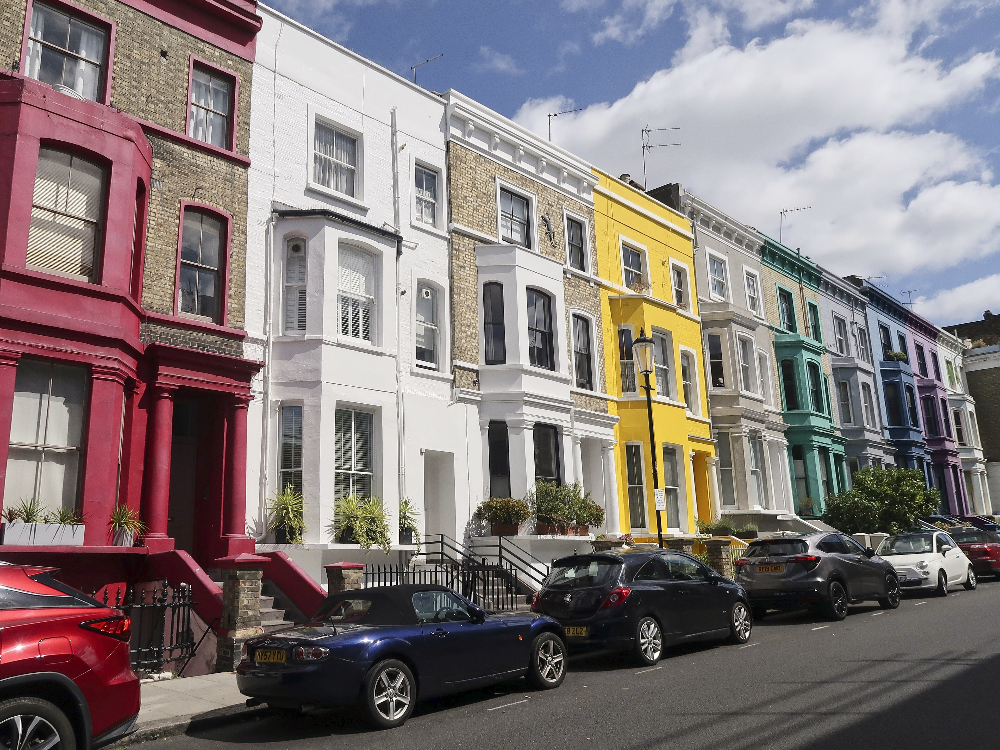

Notting Hill and Paddington showcase the charming, bohemian side of West London. Famous worldwide for the pastel Victorian townhouses of *Notting Hill*, the antique stalls of Portobello Road Market, and the tranquil canal paths of Little Venice, this area pairs picturesque street walks with high-speed airport transit.

> 💡 **At a Glance: Notting Hill & Paddington**  
> - **Vibe:** Bohemian, artistic, picturesque, and village-like.  
> - **Walkability:** 5 / 5 (Extremely scenic walking routes through markets and canals).  
> - **Nearest Stations:** Notting Hill Gate (Central, District, Circle), Paddington (Elizabeth Line, Heathrow Express, 4 Tube lines), Ladbroke Grove.  
> - **Best For:** Portobello Road Market, photography, pastel houses, Little Venice canal walks, and Kensington Gardens.

---

## Top 5 Sights & Activities

1. **Portobello Road Market:** Stroll the world's largest antique market, stretching over a mile past vintage clothing stalls, bakeries, street food, and antique shops.
2. **Photograph Pastel Houses:** Walk along **Lancaster Road** and **Westbourne Park Road** for London's most iconic rows of brightly painted Victorian townhouses.
3. **Explore Little Venice & Regent's Canal:** Walk the peaceful canal basin where the Grand Union and Regent's Canals meet, lined with colorful narrowboats and floating cafes.
4. **Stroll Kensington Gardens & Kyoto Garden:** Walk through Kensington Gardens to **Kensington Palace** or relax in the peaceful Japanese **Kyoto Garden** inside Holland Park.
5. **Visit The Notting Hill Bookshop:** Stop by the famous bookshop on Blenheim Crescent that inspired the classic Hugh Grant & Julia Roberts film *Notting Hill*.

---

## Key Micro-Districts & Iconic Streets

*Lancaster Road pastel houses. Photo: [Bex Walton](https://commons.wikimedia.org/wiki/File:Colourful_houses_in_Lancaster_Road,_Notting_Hill_2020-07-05.jpg), [CC BY 2.0](https://creativecommons.org/licenses/by-sa/3.0/).*

### 1. Portobello Road & Westbourne Grove
**Portobello Road** is the spine of Notting Hill, transitioning from antique shops near Notting Hill Gate to food stalls, vintage fashion under the Westway, and flea markets near Ladbroke Grove. Nearby **Westbourne Grove** offers high-end fashion boutiques and organic cafes.

### 2. Lancaster Road & St Luke's Mews
For picture-perfect cobblestone streets, explore **St Luke's Mews** (featured in *Love Actually*) and the neon-colored facades of **Lancaster Road**.

### 3. Little Venice & Paddington Basin
Located just north of Paddington station, **Little Venice** offers waterside pub gardens, narrowboat tours to Camden, and the modern **Paddington Basin** waterfront promenade.

---

## Book Walking & Market Tours

Powered by <a target="_blank" rel="sponsored" href="https://www.getyourguide.com/s/%3Fq=London&amp;lc=57&amp;et=292175&amp;searchSource=3&amp;src=search_bar">GetYourGuide</a>

---

## Where to Eat & Drink

| Spot | Style / Specialty | Why Visit |
| --- | --- | --- |
| **The Pelican** | Refined Pub Dining | Notting Hill's trendiest pub serving seasonal British dishes |
| **Granger & Co.** | Australian All-Day Cafe | Famous for ricotta hotcakes and avocado toast on Westbourne Grove |
| **The Churchill Arms** | Historic Thai Pub | Famous 18th-century pub covered in thousands of flowers, serving Thai food |
| **Waterway Little Venice** | Canal-side Bistro | Outdoor terrace overlooking narrowboats on Regent's Canal |

---

## Suggested 2-Hour Self-Guided Walking Route

1. **Start:** Exit **Notting Hill Gate Station** and walk down Pembridge Road.
2. **Portobello Road Market:** Turn right onto **Portobello Road** and explore the antique stalls and **Notting Hill Bookshop**.
3. **Pastel Houses & Mews:** Turn right onto Elgin Crescent and walk up to **Lancaster Road** for photos of the brightly colored townhouses.
4. **Westbourne Grove:** Walk east down **Westbourne Grove** past boutique cafes.
5. **Finish at Little Venice:** Walk past Royal Oak down to **Little Venice canal basin** for a coffee or pint on a floating narrowboat!

---

## 5 Common Visitor Mistakes to Avoid

1. **Visiting Portobello Road Market on a Sunday:** Portobello Road's main antique and street food market is closed on Sundays! The main market days are **Friday and Saturday** (Saturday is the biggest).
2. **Respecting residential privacy when taking photos:** The pastel houses on Lancaster Road and St Luke's Mews are private residences; do not climb on doorsteps or block doorways for photos.
3. **Paying for taxis from Heathrow Airport:** Take the **Elizabeth Line** (30 mins) or **Heathrow Express** (15 mins) straight into Paddington station instead!
4. **Missing the Little Venice narrowboat ride:** You can take a scenic waterbus narrowboat along Regent's Canal directly from Little Venice to **Camden Market**!
5. **Confusing Paddington station exits:** Paddington is a huge transport hub; follow signs for "Paddington Basin & Little Venice" when heading towards the canals.

---

## Related London Guides

* 🏨 [Exploring London's Best Neighbourhoods: Master Guide](/articles/best-areas-to-stay-and-visit-london/)
* ✈️ [Heathrow Airport to London Transport Guide](/articles/heathrow-airport-to-london/)
* 🚊 [Getting Around London: Complete Transport Overview](/articles/getting-around-london-transport-guide/)
* 🚇 [How to Use the London Underground](/articles/how-to-use-the-london-underground/)

---

*Exploration guide checked on 2 August 2026. Always check market operating hours before visiting.*
