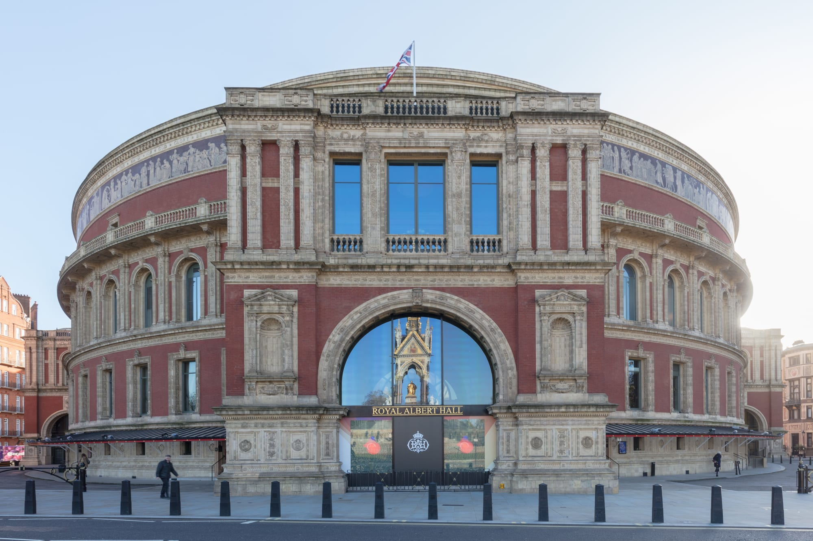

The Olivier Awards are British theatre's top honours, handed out by the Society of London Theatre at the **Royal Albert Hall**. The 2026 ceremony, the 50th, was on **Sunday 12 April 2026**, hosted by Nick Mohammed and broadcast by the BBC.

The Society's pages do not sell ceremony tickets. What the public can do is stand at the **green carpet**, which is free, or enter a sponsor's prize draw. Both routes are below, with the one catch each carries.

> 💡 **The Short Version:** The way in is the **green-carpet fan pens**, a free standing area **outside the Royal Albert Hall** where you watch the nominees and guests arrive. Places are **free, limited and drawn at random**, and are booked through **[Applause Store](https://www.applausestore.com/book-olivier-awards-2026-with-cunard-green-carpet)**, not the Society of London Theatre. They do **not** include the ceremony. The viewing area is **outdoors with no shelter or chairs**, opens at **3pm**, and anyone selected should arrive at least **an hour earlier**. The ceremony is on the BBC.

*Places are free. Anyone selling one voids it, so never pay for a green-carpet invitation.*

---

## The green carpet fan pens

The green carpet is the Oliviers' red carpet: guests and talent walk it into the Royal Albert Hall before the ceremony, and the BBC broadcast includes footage of the arrivals. The fan pens are the public viewing areas outside the venue.

*The Royal Albert Hall on Kensington Gore, with the Albert Memorial reflected in the entrance arch. Photo: [Diego Delso](https://commons.wikimedia.org/wiki/File:Royal_Albert_Hall,_Londres,_Inglaterra,_2022-11-25,_DD_02.jpg), [CC BY-SA 4.0](https://creativecommons.org/licenses/by-sa/4.0/).*

**How to get a place.** The Society of London Theatre's [green-carpet page](https://officiallondontheatre.com/olivier-awards/green-carpet-access/) sends everyone to [Applause Store](https://www.applausestore.com/book-olivier-awards-2026-with-cunard-green-carpet), the free audience-ticket agency that also handles BAFTA and film-premiere fan pens. Register an account, then use **Register Interest** on the Olivier Awards page and Applause Store emails you when places are released. The Society says successful applications are selected at random.

**Expect weather and a wait.** The pens are standing areas, outdoors, with no shelter. The Society says it does not provide chairs: wheelchair users can be accommodated, and anyone who needs a seat should bring a small folding chair of their own. If you are selected, be there **at least an hour before the viewing area opens at 3pm**.

**The rules.** Applause Store's page for the 2026 green carpet set a minimum age of 5, with under-18s accompanied by an adult. Applause Store's general rules for its free places say:

- Tickets are **over-allocated**, so admission is not guaranteed, and entry is first come, first served.
- Your whole party must be present before you join the queue, and you cannot save a place for anyone.
- Photo ID rules vary by event and are printed on the ticket, so read that line. A photo or scan of an ID is not accepted.

**Access pens.** The Society says Applause Store also manages the access area for disabled guests, with applications made on the same site.

---

## The prize draw

The title sponsor, Cunard, ran a prize draw for the 2026 ceremony. The **Ultimate Olivier Awards with Cunard Experience** was open to UK residents aged 18 or over, with one entry per person and no purchase needed. It ran through cunard.com and closed on 5 February 2026.

The prize covered the Saturday 11 and Sunday 12 April 2026. It included:

- a behind-the-scenes tour of the Royal Albert Hall
- a photograph with an Olivier Award
- two nights at The Londoner, a five-star hotel in Leicester Square
- arrival by chauffeur and a walk along the green carpet with the nominees
- the ceremony, watched live

The draw included seats at the ceremony itself, which the fan pens do not.

The Society's own guide to getting tickets, written for the ceremony on Sunday 2 April 2023, said tickets were available exclusively to Mastercard cardholders through priceless.com. Cunard was the title sponsor for the 2026 ceremony.

---

Powered by <a target="_blank" rel="sponsored" href="https://www.getyourguide.com/london-l57/">GetYourGuide</a>

## Judge the Oliviers

The Society of London Theatre recruits **public panellists** each year to judge categories, which is a way to be part of the awards rather than outside them.

- There are five panels: theatre, affiliate (smaller and non-West End London theatres), opera, dance and family.
- Panellists see every eligible production in their category, and normally receive **two free tickets** to each show plus a programme. The role is unpaid and lasts a year, and expenses are not covered.
- Theatre, dance, opera and affiliate panellists must be **18 or over** and apply with a 150-word review of a production they saw in the past year, plus a list of the other productions they have seen.
- The family panel takes an adult with a child under 14, who judges Best Family Show with them.

The Society announced the 2027 panel round on 3 December 2025, and applications have closed. It publishes the 2028 round on [officiallondontheatre.com](https://officiallondontheatre.com/).

---

## Watching from home

The Society lists the 2026 ceremony on **BBC iPlayer**, and a special Radio 2 show hosted by Jo Whiley on **BBC Sounds**. The Society puts ceremonies and performances from the last decade on the **Official London Theatre YouTube channel**. The 2026 performances included Evita, Into the Woods, Paddington The Musical, Phantom of the Opera, The Producers, Shucked, The Unlikely Pilgrimage of Harold Fry and Wicked.

The shows that win are the shows to book. Our [London theatre guide](/articles/london-theatre-guide/) covers how to choose one and pay less for it, and [dinner and a show](/articles/dinner-and-a-show-london/) pairs a booking with the meal beforehand.

---

## Where the Royal Albert Hall is

The hall is on Kensington Gore, in South Kensington. Our [South Kensington area guide](/articles/south-kensington-area-guide/) has the stations and what is nearby. For the other nights the hall hosts, see [Award Ceremonies and Galas in London](/articles/award-ceremonies-london/), which covers the Fashion Awards and the Royal Variety Performance, and [the Last Night of the Proms](/articles/last-night-of-the-proms-tickets/).

## Continue planning your London trip

- 🏆 **[Award Ceremonies and Galas in London](/articles/award-ceremonies-london/)** — every event the public can get into, and the ones it cannot
- 📺 **[National Television Awards Tickets](/articles/national-television-awards-tickets/)** — seats from £25 at The O2, and the red carpet
- 🎬 **[BAFTA Red Carpet](/articles/bafta-red-carpet/)** — the other free fan pens, booked through the same agency
- 🎭 **[London Theatre: How to Choose a Show and Pay Less for It](/articles/london-theatre-guide/)**
- 🍽️ **[Dinner and a Show in London](/articles/dinner-and-a-show-london/)**
- 🏛️ **[South Kensington Area Guide](/articles/south-kensington-area-guide/)**
