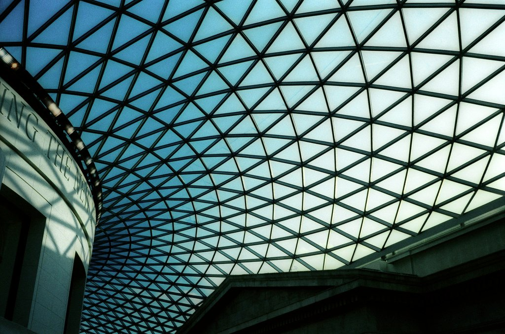
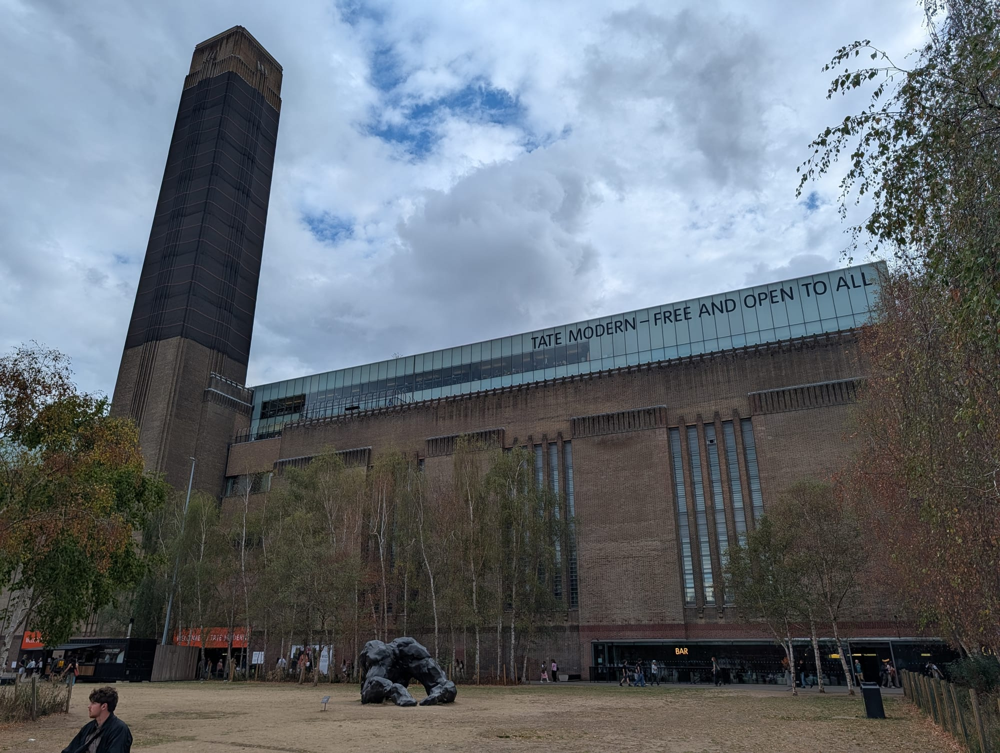
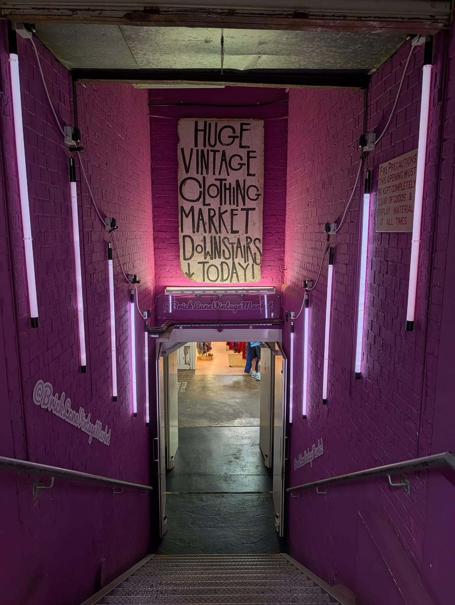

One day in London goes one of two ways. Either you chase five famous things across four Tube lines and remember the escalators, or you pick one thread and follow it properly.

These thirteen plans do the second. **Each is grouped tightly enough that you barely use the Underground**, and the walking times are real.

> 💡 **The Short Version:** **First-timers** walk Westminster to the South Bank. **Theatre** stays in Covent Garden all day. **Museums** pick one district, never two. **Families** do one museum and a park. **Food** follows the markets. **Low-walking** uses the river, which is flat and level-boarding. And seven more below, including a day that costs nothing, a day that never goes outside, and a day built entirely around Sunday.

## Which day is yours

| If you want | Go to | Roughly |
| --- | --- | --- |
| The postcard London | [First-time highlights](#first-time-highlights) | 4 miles, flat |
| A show and everything around it | [Theatre](#theatre) | Under 2 miles |
| One great collection | [Museums](#museums) | 2 miles |
| To keep children going | [Families](#families-with-children) | 3 miles, with breaks |
| To eat your way through | [Food](#food-lovers) | 3 miles |
| To avoid stairs and distance | [Low-walking](#low-walking-and-step-free) | Under 1 mile on foot |
| Palaces and ceremony | [Royal London](#royal-london) | 3 miles, flat |
| To spend nothing at all | [A day for free](#a-day-for-free) | 3 miles |
| It to rain all day | [Indoors only](#indoors-only) | Under 1 mile outside |
| To look down on it | [Views and rooftops](#views-and-rooftops) | 3 miles |
| Books and libraries | [The bookish day](#the-bookish-day) | 2 miles |
| Markets and vintage | [Markets, and why Sunday](#markets-and-why-sunday) | 3 miles |
| Where things were filmed | [Film and TV locations](#film-and-tv-locations) | 3 miles |

---

## First-time highlights

*About 4 miles, almost entirely flat, and no Tube needed.*

**Morning.** **Westminster Abbey** on an early slot — book ahead, and note it is **closed to sightseers on Sundays**. Allow 90 minutes. Then **Parliament Square** and out onto **Westminster Bridge** for the view back at Big Ben. *Five minutes.*

**Midday.** **Through St James's Park to Buckingham Palace** — *about 15 minutes*, and the bridge over the lake has the postcard view. Then **down The Mall to Trafalgar Square**, *another 15*.

Lunch ten minutes off the square rather than on it. See [cheap eats](/articles/cheap-eats-london/).

**Afternoon.** **The National Gallery** is free and right there — pick three rooms rather than attempting it. Then walk down to the river and east along the **South Bank** past the Southbank Centre and the National Theatre.

**Evening.** **Covent Garden** and dinner in [Soho](/articles/soho-area-guide/).

> This is the densest walking day of the six. If you have to cut something, cut the National Gallery — it deserves better than a tired hour.

---

## Theatre

*Under 2 miles all day. The most concentrated of these plans.*

**Morning.** **Covent Garden** — the Piazza, the street performers who audition for their pitch, and the theatre architecture in the surrounding streets. The **Royal Opera House** public areas and its terrace are worth going into.

**Afternoon.** Three ways to go:

* **A matinee.** Wednesday, Thursday and Saturday for most shows, and usually cheaper than the evening.
* **A backstage tour** — the National Theatre and the Royal Opera House both run them, and they book up.
* **The V&A's Theatre and Performance galleries**, which are free and hold the national collection.

**Dinner.** Book within ten minutes' walk of the theatre and **tell the restaurant the curtain time**. Two hours before curtain, not one.

**Evening.** The West End, the **National Theatre** on the South Bank, **Shakespeare's Globe** in summer, or fringe.

> **Buy direct from the theatre's own website.** Resellers add substantial fees, and the official day-seat and lottery schemes are only available direct. [Official London Theatre](https://officiallondontheatre.com/) lists what is on.

---

## Museums

*About 2 miles, and close to free.*

**Choose one district. Not both.** This is the single most common way a museum day goes wrong.

### South Kensington

Three major museums within *five minutes of each other*, all **free**.

* **Natural History Museum** — the UK's most visited attraction. Be there at opening.
* **V&A** — 145 galleries, and the one for design and objects.
* **Science Museum** — the most hands-on.

**Do two.** Lunch in between rather than pushing through. Use the **Exhibition Road entrances**, which queue less than the main ones.

### Bloomsbury

*The Great Court. Photo: [rbrwr](https://www.flickr.com/photos/38411862@N00/467099756), [CC BY-SA 2.0](https://creativecommons.org/licenses/by-sa/2.0/).*

* **British Museum** — free, roughly 80,000 objects on display out of eight million held. Pick three things.
* **Lunch on Lamb's Conduit Street**, *ten minutes north*.
* **British Library** — free, and the Treasures gallery has Magna Carta and the Lindisfarne Gospels in one room.

**Check late openings before you go.** Several run one evening a week, usually with a bar and a fraction of the daytime crowd — the best time to visit any of them.

---

## Families with children

*About 3 miles with deliberate gaps.*

**Morning.** **One** South Kensington museum, chosen by age. The Science Museum for children who want to press things; the Natural History Museum for dinosaurs and the whale. Arrive at opening — the half-term queues are the worst in London.

**Lunch.** A picnic in **Hyde Park** in good weather, or a booked table. Museum cafés at 1pm with tired children is a bad combination.

**Afternoon.** **Hyde Park** — the Diana Memorial Playground, the Serpentine, and boating when it runs. Or a second short activity rather than a second museum.

**Evening.** Eat early and near where you are sleeping.

> **Leave one hour completely empty.** London walking, stairs and crowds are more tiring than any map suggests, and the empty hour is what stops the day collapsing. See [London with children](/articles/london-with-children/).

---

## Food lovers

*About 3 miles, and it lives or dies on market days.*

**Morning.** **Borough Market** — **closed Sundays**, and much better before 11am. Plan three or four stalls rather than grazing at random. See our [markets guide](/articles/best-london-markets/).

**Midday.** Walk north across the river into the **City**, then east to **Spitalfields** — *about 30 minutes*, or a short Tube hop. Coffee or a bakery stop on the way; the [coffee](/articles/best-coffee-london/) and [bakeries](/articles/best-bakeries-london/) guides both cover this ground.

**Afternoon.** **Brick Lane** for beigels — the 24-hour shops are an institution — or Chinatown and Soho for a completely different day.

**Evening.** A booked dinner. Our [restaurant guides](/articles/eat-in-london-guide/) cover every cuisine; [cheap eats](/articles/cheap-eats-london/) if the market has already done the damage.

> **Sunday changes everything.** Borough is shut but Brick Lane, Columbia Road and Spitalfields are all at full stretch. Build the day around whichever is running.

---

Powered by <a target="_blank" rel="sponsored" href="https://www.getyourguide.com/london-l57/">GetYourGuide</a>

## Low-walking and step-free

*Under a mile on foot, spread across the day.*

**The river does the work.** Boat piers are level-boarding, the South Bank is flat and continuous, and the distances between things are short.

**Morning.** Step-free route to **Westminster**, then a **scheduled river boat** rather than a tour boat — same views, ordinary fares, and contactless works. See the [river boats guide](/articles/how-to-use-london-river-boats/).

**Afternoon.** One attraction near a pier. **Tate Modern** is free, level throughout and has lifts to every floor. **Royal Museums Greenwich** works if you want the longer boat journey.

**Evening.** Eat near where you are staying rather than travelling again.

> ⚠️ **Check lifts on your actual date, and request assistance in advance.** A station listed as step-free is not always level-boarding — the gap and the step at the platform edge vary by line and by station. TfL's assistance service is free and should be booked ahead rather than relied on at the barrier.

---

## Royal London

*About 3 miles, flat, and best on a Changing the Guard day.*

**Morning.** **Changing the Guard** — but check the schedule, because **it does not run daily**, and get there for 10.30am for an 11am start. The crush at the Palace gates is considerable; the **Horse Guards Parade** ceremony is the same regiments with a fraction of the crowd, and the **4pm dismount inspection** there is the quietest of the lot.

**Midday.** The **Household Cavalry Museum** on Whitehall is small, cheap and genuinely good — you see the working stables through a glass screen.

**Afternoon.** **Kensington Palace** and the Sunken Garden, reached by walking the length of **Hyde Park and Kensington Gardens** past the Albert Memorial — about 40 minutes, and the nicest stretch of park walking in central London.

> 💷 **If you are doing more than one palace, do the sums.** Historic Royal Palaces membership is £65 a year by Direct Debit and covers the Tower, Hampton Court and Kensington. Two palaces in a day nearly pays for it — see [our London Pass guide](/articles/london-pass-guide/) for the full arithmetic.

**Evening.** Dinner in **Mayfair** or **Victoria**, both a short walk out.

---

## A day for free

*About 3 miles, and it can genuinely cost nothing but lunch.*

**Morning.** **The British Museum** — free, and go at opening. Pick two galleries.

**Midday.** Walk down to **Trafalgar Square** for the **National Gallery**, also free, and the **Fourth Plinth** outside it, which carries a new commissioned artwork every eighteen months.

**Afternoon.** Over the river to **Tate Modern** — free, and its **tenth-floor viewing level** is one of the best views in London at no charge. Then walk east along the South Bank.

*Free to enter, free to go up. The tenth floor beats several paid viewpoints.*

**Late afternoon.** **Horizon 22** at Level 58 — **the highest free viewing platform in London**. Book a free slot in advance.

**Evening.** **Evensong at St Paul's** — free, daily, and you sit in the quire rather than filing past on the £27 tourist route.

**[The full free London guide →](/articles/london-on-a-budget/)**

---

## Indoors only

*For the day it rains, which in London is a working assumption.*

**The trick is picking a district where everything connects**, so you are never outside for more than five minutes.

**South Kensington is the best of them.** The **Natural History Museum**, **Science Museum** and **V&A** sit within three minutes of each other, and the **pedestrian subway from the Tube station reaches all three without going outside at all.** That is the single most useful fact for a wet day in London.

**Bloomsbury is the alternative** — the British Museum, and the **British Library** ten minutes away, with the Brunswick Centre for lunch under cover.

**Or go under the river.** The **Greenwich foot tunnel** is free, dry and open at all hours, with the **Painted Hall**, **National Maritime Museum** and **Queen's House** at the far end, all indoors.

**[More wet-weather options →](/articles/london-in-the-rain/)**

---

## Views and rooftops

*About 3 miles, and most of it costs nothing.*

**Morning.** **The Garden at 120** in the City — free, no booking, and the most useful viewpoint in London because you can simply walk in.

**Midday.** **Sky Garden** — free but books weeks ahead, so this is the one to reserve before you travel. **The Lookout at 8 Bishopsgate** is the newest and least busy.

**Afternoon.** **Horizon 22**, Level 58, free, and the highest of the lot.

**Late.** **Tate Modern's tenth floor**, then **Waterloo Bridge at dusk** — free, always open, and the best single view in London for nothing at all.

> ⚠️ **The Shard is about £32 and none of the above are.** It is the highest and it has an open deck, but do not pay it thinking there is no alternative. [The full views guide](/articles/best-views-london/) compares them properly.

---

## The bookish day

*About 2 miles, mostly Bloomsbury.*

**Morning.** **The British Library** — free, and the **Treasures gallery** holds Magna Carta, Shakespeare's First Folio, Handel's *Messiah* in his own hand and Beatles lyrics written on the back of envelopes. It is the most undersold free room in London.

**Midday.** Walk down through **Bloomsbury** — the squares, the blue plaques, **Senate House**, and the **Charles Dickens Museum** at 48 Doughty Street, the only surviving London house he lived in.

**Afternoon.** Bookshops: **Persephone** in Bath Place, **the London Review Bookshop** by the British Museum, **Daunt** on Marylebone High Street for the galleried travel room, and **Foyles** on Charing Cross Road.

**Evening.** **Cecil Court** — the Victorian bookselling alley between Charing Cross Road and St Martin's Lane — then dinner in Covent Garden.

---

## Markets, and why Sunday

*About 3 miles, and the day of the week matters more here than anywhere else on this page.*

**Sunday is the best market day in London and most guides do not say so.** Columbia Road only exists on a Sunday. Brick Lane is at full stretch on a Sunday. Both are quiet or shut the rest of the week.

**Morning, early.** **Columbia Road Flower Market**, 8am to about 3pm, **Sunday only**. Go before 9am or after 2pm — early for the choice, late for the traders shouting the prices down.

**Midday.** Walk fifteen minutes to **Brick Lane** and the **Old Truman Brewery** — vintage, records, and the Upmarket food hall.

*Sunday is when the whole of Brick Lane trades, not just the restaurants.*

**Afternoon.** **Old Spitalfields Market**, five minutes further, which trades all week but is busiest on a Sunday.

**If you are not here on a Sunday**, run it the other way: **Borough Market** (closed Mondays), **Seven Dials Market**, and **Maltby Street** on a Saturday.

**[The full markets guide →](/articles/best-london-markets/)** · **[Street food and food halls →](/articles/best-street-food-london/)**

---

## Film and TV locations

*About 3 miles, and free apart from lunch.*

**Morning.** **Notting Hill** — the blue door on Westbourne Park Road, the travel bookshop on Blenheim Crescent, and Portobello Road, at its best on a **Saturday**.

**Midday.** **King's Cross** for **Platform 9¾** — free to photograph, though the queue for the trolley is long and the shop beside it is not free. **St Pancras** next door is the exterior used for Hogwarts' station in the films.

**Afternoon.** **The Millennium Bridge**, destroyed on screen by Death Eaters, and **Borough Market**, where the Bridget Jones flat sits above The Globe pub on Bedale Street.

**Evening.** **Leadenhall Market** — the Diagon Alley exterior, and genuinely beautiful in its own right once the crowds thin.

> This is a walking day rather than a studio day. **The Warner Bros Studio Tour is in Watford**, takes most of a day on its own, and needs booking weeks ahead — it does not combine with any of the above.

**[The full filming locations guide →](/articles/london-filming-locations/)**

---

Powered by <a target="_blank" rel="sponsored" href="https://www.getyourguide.com/london-l57/">GetYourGuide</a>

## What all thirteen have in common

* **Group by geography.** Every plan above is built so that the walking is the connective tissue, not the cost.
* **Book the timed things before you arrive** — the Tower, the Abbey, any show, Horizon 22.
* **Eat ten minutes from the sight, not next to it.**
* **Most of the museums are free.** The British Museum, National Gallery, Tate Modern, V&A, Natural History Museum, Science Museum and British Library all cost nothing to enter.
* **Check market and closing days.** Borough shuts Sunday; the Abbey shuts to sightseers Sunday; several museums close one day a week.

---

## Continue planning your London trip

- 🗓️ **[Three Days in London](/articles/three-days-in-london-itinerary/)**
- 🗓️ **[Five Days in London](/articles/five-days-in-london-itinerary/)**
- 🏘️ **[Best London Areas to Visit](/articles/best-areas-to-visit-london/)**
- 🚇 **[Getting Around London](/articles/getting-around-london-transport-guide/)**
- 🎪 **[Free Things to Do in London](/free/)**

---

*Confirm opening hours, performances, market days and accessibility before travelling.*
