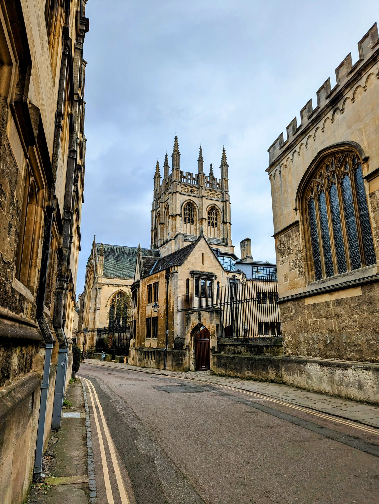
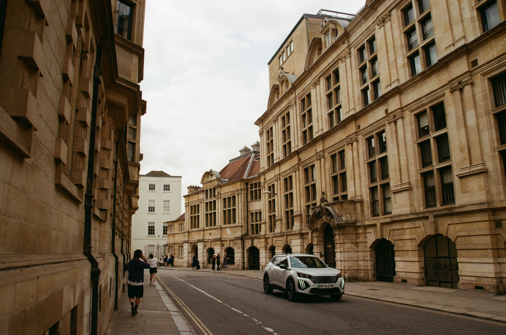
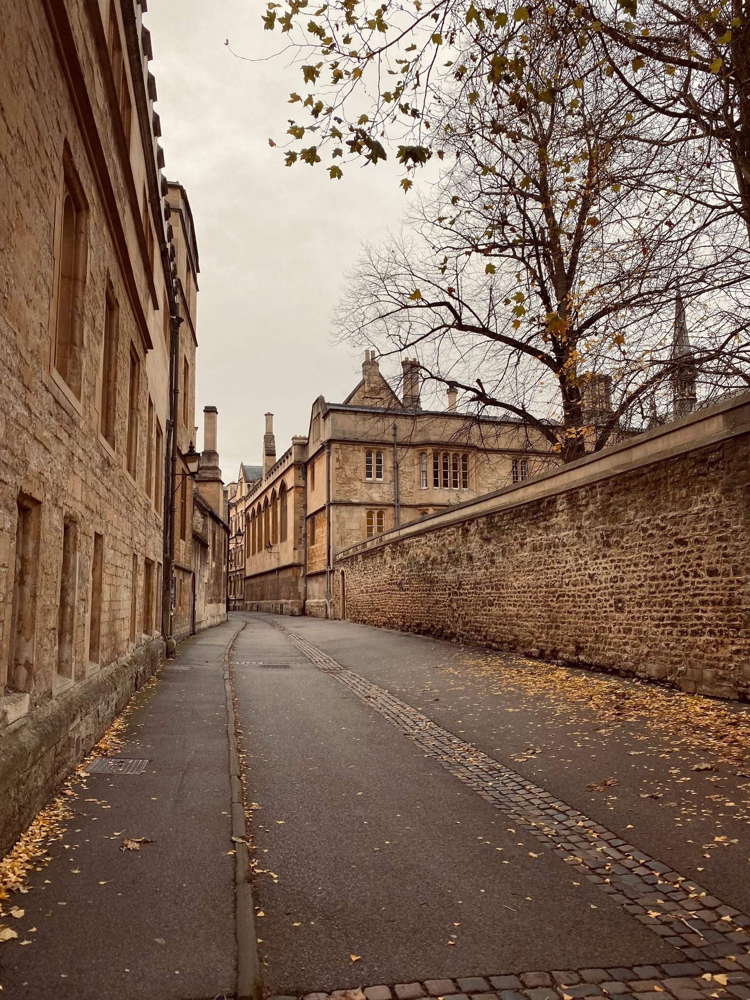

**An Off-Peak return from London to Oxford is £37.70, and the coach is £28 and never stops running.** That gap, and the fact that Oxford's best museums are free while its best-known college charges £22.95, is most of what you need to plan this day.

Oxford is 55 minutes from Paddington and small enough to cross on foot in twenty minutes. The mistake people make is not the travel — it is buying entry to three colleges and then queuing at a fourth.

> 💡 **The Short Version:** **Train from Paddington, 55 minutes**, Off-Peak return **£37.70**, Advance singles from **£18**. **Oxford Tube coach from Victoria, £28 return**, every 10 minutes, **24 hours a day**. **Christ Church £22.95** on a term weekday (its Great Hall shuts 12–2pm for student lunch), **New College £12**, **Magdalen £10**, **Trinity £7**, **Merton £5**. **Lincoln, Keble and St John's are free**, all afternoons only. The **Ashmolean, Pitt Rivers and Natural History Museum are free**. **Punting is £25–£35 an hour**, or £50 per half hour with someone else doing the work. Driving means a **£5 congestion charge** — park and ride instead, **£3 for the car and up to five people**.

## Getting there

### Train from Paddington, which is the fast one

**Great Western Railway runs Paddington to Oxford in 55 minutes** direct. Trains with a change at Reading take about the same, 58 minutes, so an awkward-looking itinerary is not a penalty.

| Fare | Price |
| --- | --- |
| **Off-Peak return**, either London terminus | **£37.70** |
| Off-Peak single from Paddington | £37.60 |
| Off-Peak single from Marylebone | £40.60 |
| **Advance single from Paddington** | **from £18.00** |
| **Advance single from Marylebone** | **from £15.00** |

**Buy the return, not two singles.** The Off-Peak return is £37.70 and an Off-Peak single out of Paddington is £37.60 — ten pence less for half the journey. The Off-Peak return is priced London Terminals to Oxford via any permitted route, so one ticket covers you out of Paddington and back into Marylebone if that suits.

If your times are fixed, Advance singles undercut everything: £18 from Paddington and £15 from Marylebone on the Tuesday we priced. Chiltern advertises Advance fares **from £5.40 one-way**, which is the floor rather than the usual.

### Train from Marylebone, which is the slow one

**Chiltern's direct trains from Marylebone take 1 hour 18 to 1 hour 22.** Chiltern's own Oxford page says "under an hour" — the timetable does not agree, and Oxford Parkway, the park and ride station north of the city, is still 1 hour 11 minutes.

Marylebone earns its place two ways: the cheaper Advance fares, and the fact that Chiltern trains are direct where Paddington's stopping services make you change. **Off-peak starts after 09:30 on weekdays.** A **PlusBus** add-on for unlimited Oxford buses is £4.50 adult, £2.50 child, which a day on foot does not need.

Oxford station is a **10-minute walk** from the colleges.

### The Oxford Tube, which is cheaper and runs all night

**Stagecoach's Oxford Tube runs 24 hours a day, 7 days a week, up to every 10 minutes, with no last coach.** There is no peak pricing and no need to pre-book.

| Oxford Tube ticket | Adult | Child | Concession |
| --- | --- | --- | --- |
| **Return** | **£28.00** | **£14.00** | £25.00 |
| Single | £18.50 | £9.00 | £16.50 |
| **Family return** | **£70.00** | — | — |

Concession covers students, young persons and seniors. A **Day ticket is £28** for an adult and also covers Stagecoach West local buses, which is worth it only if you plan to ride around Oxford.

It picks up at **Victoria, Marble Arch, Notting Hill Gate, Shepherd's Bush, Acton Main Line and Hillingdon**, plus Baker Street on weekday morning express runs, and terminates at **Gloucester Green** in the middle of Oxford — closer to the colleges than the railway station. The operator's own suggested day out allows **two hours** from a 07:45 Victoria departure.

> 💡 **Who should take which.** Two adults on fixed times: the train, on Advance singles, for £36 each way or less. A family, or anyone whose day might run long: the coach, because £70 covers the lot and there is no last one to miss. Anyone flying in: neither — Oxford Bus Company's **airline** coach runs between Oxford and the Heathrow and Gatwick terminals, 24 hours a day, and skips London entirely.

### Driving, and why not to

**Oxford has a temporary £5 daily congestion charge for cars**, at six signed locations, all year round including bank holidays. Electric cars are not exempt; vans and motorbikes pay nothing. You pay by midnight the day after. **It is replaced by the traffic filter trial on Monday 28 September 2026**, so the rules change shortly after this is published — check before you drive in.

**Park and ride sidesteps all of it.** A **£3 combined ticket** buys up to 16 hours' parking for one car plus return bus travel for **up to five people of any age**, at Redbridge, Pear Tree, Seacourt, Thornhill and Oxford Parkway. Buy it at the machine or on RingGo, choosing the Parking & Bus option, and show it to the driver both ways. It runs to 31 March 2027 and is not valid on the airline or the Oxford Tube.

Parking alone at Thornhill is free for the first hour and £2.50 up to 16 hours — so the combined ticket costs 50p more than parking and gets five people into town.

Powered by <a target="_blank" rel="sponsored" href="https://www.getyourguide.com/london-l57/">GetYourGuide</a>

## The colleges: which charge, and what they shut

*Photo: Quintin Sanders, Pexels.*

Colleges are working institutions, not attractions. Two patterns catch people out: **halls close over lunch** because students are eating in them, and **free colleges open in the afternoon only**.

| College | Adult | Concession | Hours |
| --- | --- | --- | --- |
| **Christ Church** | **£22.95**–£26.95 | £17.50 child | Mon–Sat from 10:00, exit by 17:00 |
| **New College** | **£12** | £11 | 10:00–17:00 summer; afternoons only in winter |
| **Magdalen** | **£10** | £9 | Daily 10:00 to dusk or 17:00 |
| **Trinity** | **£7** | £5 | 10:00–12:00 and 14:00–17:00 |
| **Balliol** | **£6** | £3 | 10:00–17:00 or dusk |
| **Merton** | **£5** | £3 | Mon–Fri 14:00–17:00, Sat 10:00–17:00 |
| **Lincoln** | **Free** | — | Generally 14:00–17:00 |
| **Keble** | **Free** | — | Daily 14:00–17:00 |
| **St John's** | **Free** | — | Daily 14:00–17:00, to 16:00 in winter |

### Christ Church, the expensive one

**A multimedia guide is required and included**, which is why the price looks like a museum's. It moves with the date:

| Christ Church, on the day | Weekday | Weekend |
| --- | --- | --- |
| **Adult, Michaelmas term** (4 Oct–12 Dec 2026) | **£22.95** | £24.95 |
| Adult, vacations (2 Sep–3 Oct, 13–31 Dec) | £24.95 | £26.95 |
| Senior or student, term | £20.50 | £22.50 |
| Child 5–17, term | £17.50 | £19.50 |

**Book ahead and take £2 off every ticket.** Under-5s are free but get no guide, and their tickets are collected on the day. Carers are free with proof of entitlement.

**Tickets are released each Friday at about 10am for the following week** — there is no three-month booking window. They are non-refundable, but you can reschedule free online up to two hours before if you made an account, or for £2 a ticket if you did not.

> ⚠️ **The Great Hall closes 12:00–14:00 Monday to Friday** while students eat, and **10:30–14:00 on Saturdays in term**. On Sundays the Hall opens at 14:00. On Saturdays the Cathedral shuts at 16:45 for choir practice. Christ Church publishes a known-closures page and the booking system labels slots where the Hall or Cathedral is shut — which also cost less.

### The Harry Potter bit, honestly

**The staircase is real. The Great Hall is not.** Christ Church's own notes on the Hall staircase in Bodley Tower, under its 1638 fan vaulting, say it "has been used in a number of film and television projects including *Lewis* and *Harry Potter*". The Hogwarts Great Hall you remember is a set, and you can walk onto it at the [Warner Bros. Studio Tour](/articles/harry-potter-studio-tour/) instead.

The other genuine location is the Bodleian's **Divinity School**, which the library itself describes as the infirmary in the films, and **Duke Humfrey's Library**, which played the Hogwarts library. Both are below.

### The other paying colleges

**Magdalen** is the best value of the big ones at £10, with deer, a riverside walk and its own tower over Magdalen Bridge. A **joint ticket with the Botanic Garden is £17** and stays valid for one entry at each within 12 months. It closes at 18:30 in July, August and September and at dusk otherwise, and the Hall may shut over lunch.

**New College** is £12, and its cloisters and medieval hall are the ones worth the money. **The Hall is closed daily 11:45–14:00.** From 1 November to 9 March it closes entirely on Mondays and opens only 13:30–16:30 the rest of the week.

**Trinity** is £7 and splits its day around lunch — 10:00–12:00 then 14:00–17:00 in term, 13:00 in vacation. Its hours move for private events and it asks you to ring the lodge first.

**Merton** is £5 and keeps its Hall, Fellows' Garden and residential areas closed to everyone, alumni included, so you are paying for four quads and the chapel.

**Balliol** is £6, or £3 concession, and free if you are a prospective applicant. In term — weeks 0 to 9 — and through exams and the admissions period, **groups are capped at eight people including the guide**.

### The free ones, and the one that is not

**Lincoln, Keble and St John's let you in for nothing**, all in the afternoon. Lincoln asks you to ring the Porters' Lodge first and takes no large groups; Keble opens 14:00–17:00 daily; St John's does 14:00–17:00 in summer, 16:00 in winter, with the chapel shut on Wednesdays.

**Worcester no longer takes walk-in tourists at all.** Its own page limits tourist access to official tours led by an Oxford Guild of Tour Guides member, or to public events. Residents of OX1 and OX2, applicants and alumni still get in free, 12:30–16:00.

## What is free, and it is a lot

*Photo: Vitalina, Pexels.*

| Free | Hours |
| --- | --- |
| **Ashmolean Museum** | 10:00–17:00, last entry 16:45 |
| **Pitt Rivers Museum** | Tue–Sun 10:00–17:00, Mon 12:00–17:00 |
| **Museum of Natural History** | Daily 10:00–17:00, last admission 16:45 |
| **Bodleian: Blackwell Hall and exhibitions** | Mon–Fri 9:00–17:00, weekends 10:00–17:00 |
| **Bodleian: Old Schools Quadrangle courtyard** | Whenever the gates are open |
| **University Church** (tower extra) | Mon–Sat 9:30–18:00, Sun 12:00–18:00 |
| **The Covered Market** | Mon–Wed 8:00–17:30, Thu–Sat to 22:00, Sun 10:00–17:00 |
| **Christ Church Meadow** | Daily, except 25 December |

**The Ashmolean** is free with no booking, on Beaumont Street. Its major exhibitions are ticketed — *In Bloom* now, *Aphrodite: The Making of a Goddess* from 8 October 2026 — and four Western Art galleries on the Level 3 mezzanine are closed for works until mid-October. Turner's *High Street* and Millais's *John Ruskin* were moved to Gallery 44 while that happens.

**The Pitt Rivers and the Museum of Natural History share a building** on Parks Road, which is the single most efficient free hour in Oxford: dinosaurs and a dodo downstairs, 500,000 ethnographic objects up the back. Both free, neither ticketed. The Pitt Rivers opens at noon on Mondays, so a Monday morning is a Natural History morning.

**The Covered Market** is where to eat without booking anything: over 50 independents, open from 8am, and until 10pm Thursday to Saturday.

### The Bodleian: free courtyard, paid interiors

**You can walk into the Old Schools Quadrangle for free** whenever the gates are open, and into Blackwell Hall in the Weston Library for the free exhibitions — *Pets & their People* to 27 September 2026, *Wonder of Birds* to 3 January 2027.

Everything else is ticketed, and cheaply:

| Bodleian | Price |
| --- | --- |
| **Divinity School**, self-guided, 15 minutes | **£3** |
| Outdoor audio trail, 7 languages | from £5.50 |
| **30-minute library tour** (Duke Humfrey's Library) | **from £12.50** |
| 60-minute library tour | from £17.50 |
| City of Oxford walking tour | from £25 |
| **Radcliffe Camera and city walking tour** | **from £30**, Saturdays and Sundays |
| Children's Literature Tour | £7 child, £15 adult |

**£3 for the Divinity School is the best-value ticket in Oxford** and takes a quarter of an hour. **The Radcliffe Camera cannot be visited any other way** — there is no standard entry, only the weekend tour. From Radcliffe Square the outside is free, and the outside is what everyone photographs anyway.

**The University Church tower is £7** for 127 steps up a medieval turret staircase and the view down onto Radcliffe Square — minimum age 8, last admission 17:30. The church itself is free.

## Punting

| Punting | Price |
| --- | --- |
| **Magdalen Bridge Boathouse**, self-hire | **£35 per hour**, up to 5 people |
| **Magdalen Bridge Boathouse**, chauffeured | **£50 per 30 minutes**, up to 4 |
| **Cherwell Boathouse**, weekdays | **£25 per hour**, £125 a day |
| Cherwell Boathouse, weekends | £27 per hour, £135 a day |

**Magdalen Bridge Boathouse** is under Magdalen tower at the end of the High Street, so it is the one you will walk past. Open 7 days a week from 1 February to 30 November, 9:30am to 9pm or an hour before sunset. No need to book, though a busy weekend says otherwise. Bring the boat back late and you are charged another 15 minutes.

**Cherwell Boathouse** is in north Oxford, cheaper, and has about 80 handmade boats, so midweek availability is good and weekends are not. Its season is shorter — mid-March to mid-October. Punt upstream for half an hour and there is a pub, the Victoria Arms; downstream runs through the University Parks.

**Chauffeured is the honest choice for a first go.** £50 buys half an hour of someone competent doing it while you sit still, against £35 for an hour of turning in circles with an audience on Magdalen Bridge.

## Does 2FOR1 cover anything here?

Some of it. The National Rail scheme lists Oxford attractions, but **no college is in it**, and neither is the Bodleian.

- **2FOR1:** Oxford Castle and Prison, The Story Museum, Soldiers of Oxfordshire Museum.
- **15% off:** the four official Oxford tours — University and City, the Ghost Tour, the C.S. Lewis and J.R.R. Tolkien tour and the On Screen tour.
- **Listed but free anyway:** the Ashmolean and the History of Science Museum.

The rules are the part people get wrong — it needs a National Rail ticket and two people, and the voucher process changed this year. [How National Rail 2FOR1 actually works](/articles/national-rail-2for1-london-attractions/) has the current version.

Powered by <a target="_blank" rel="sponsored" href="https://www.getyourguide.com/london-l57/">GetYourGuide</a>

## How long the day takes

*Photo: Jess Buckle, Pexels.*

**Seven hours in Oxford is plenty, and it fits inside a normal day.** Out on the 09:30-ish train, back on something around 18:00, and you have had a paying college, a free museum, lunch in the market and an hour on the river without hurrying.

A working shape:

- **10:30** — arrive, walk up to Radcliffe Square, Divinity School for £3
- **11:15** — one paying college. Christ Church if the Hall matters to you, Magdalen if £10 and a river do
- **13:00** — Covered Market
- **14:00** — the free afternoon colleges open; Lincoln, Keble or St John's
- **15:00** — Pitt Rivers and Natural History, both free, both in one building
- **16:30** — punting, or the University Church tower before its 17:30 cut-off
- **18:00** — train

**Last departures back**, on a weekday: Oxford to Paddington at **23:06**, arriving 00:12, with a **00:10** service arriving 01:16. Oxford to Marylebone, last direct at **22:44**, arriving 00:16. **The Oxford Tube has no last coach** — which is the real argument for it if you want dinner in Oxford.

> ⚠️ **Check the closures before you book a college.** Christ Church, Magdalen, New College and Merton all publish dated closure lists, and all four shut entirely on some days this autumn — Christ Church on 17 and 18 September and 4 October, New College on 18, 23, 25 and 26 September and 12 December, Magdalen on 25 September and 4 October, Merton on 7 November. Term-time and exam-period restrictions bite too: Balliol caps groups at eight, and New College closes on Mondays all winter.

*Prices and hours checked 12 September 2026 against each operator's and venue's own site.*

## Continue planning your trip

- ⚡ **[The Harry Potter Studio Tour](/articles/harry-potter-studio-tour/)** — where the Great Hall actually is, and what it costs to stand in it.
- 🚶 **[The best walking tours in London](/articles/best-walking-tours-london/)** — if the guided approach suits you, this is the London equivalent.
- 🎟️ **[National Rail 2FOR1, properly explained](/articles/national-rail-2for1-london-attractions/)** — the voucher rules, and why Oyster does not qualify.
- 🏛️ **[The best museums in London](/articles/best-museums-london/)** — the free-museum habit, continued at home.
- 🗺️ **[Day trips from London](/articles/day-trips-from-london/)** — what the others cost, how long they take, and which days they are shut.
