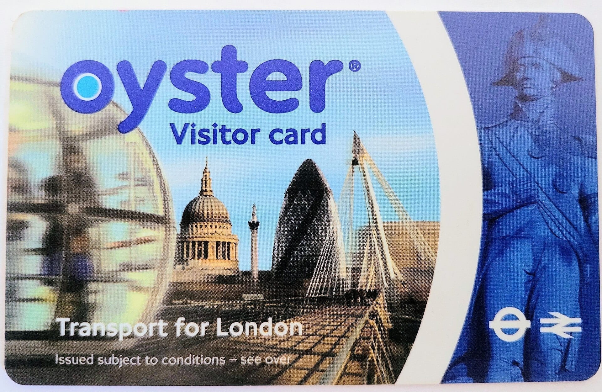
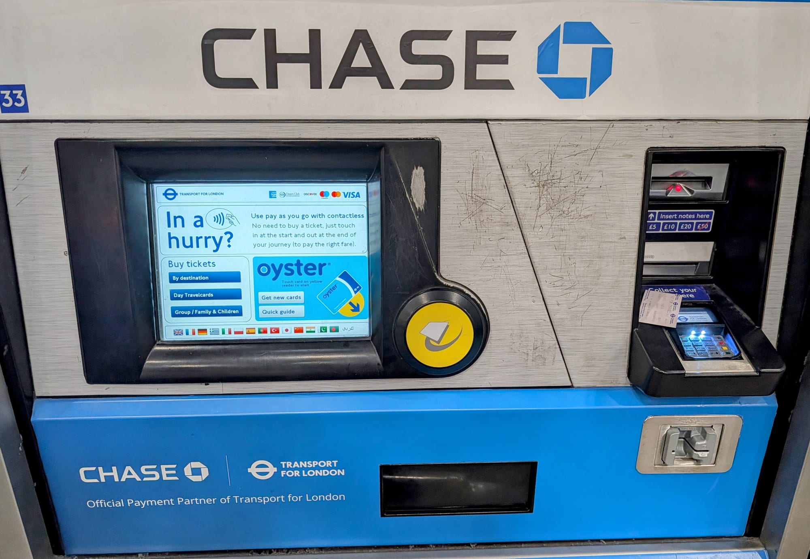
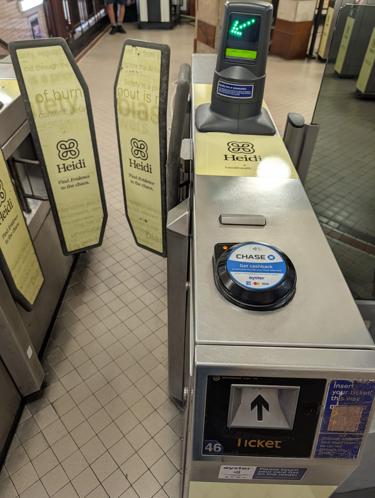

One of the most common questions for travelers visiting London is whether to buy an **Oyster card** or simply tap a **contactless bank card or smartphone**.

> 💡 **The Quick Verdict: Contactless vs. Oyster Card**  
> - **For 95% of Adult Visitors:** Use **Contactless** (Visa, Mastercard, Apple Pay, Google Pay). You get the exact same fares and daily price capping as an Oyster card, with **zero upfront fees** (£0 vs £10.50) and no need to manage balance top-ups.  
> - **When to Buy an Oyster Card:** Get an Oyster card if you want to pay with **cash**, if your foreign bank card charges high fixed transaction fees, or if you need to load **discount passes** (e.g. Young Visitor 50% child discount or National Railcards for 1/3 off off-peak fares).  
> - **Never Buy Paper Tickets:** Single paper Underground tickets cost almost double the pay-as-you-go rate (e.g. £6.70 paper vs £3.00 pay-as-you-go in Zone 1)!

---

## Side-by-Side Comparison: Oyster vs. Contactless

| Feature | Contactless Bank Card / Phone | Standard Blue Oyster Card | Visitor Oyster Card |
| --- | --- | --- | --- |
| **Adult Pay-As-You-Go Fares** | Same exact low fare | Same exact low fare | Same exact low fare |
| **Daily Fare Capping** | **Yes** *(Automatic)* | **Yes** *(Automatic)* | **Yes** *(Automatic)* |
| **Monday–Sunday Cap** | **Yes** *(Mon–Sun clock)* | **Yes** *(Mon–Sun clock)* | **Yes** *(Mon–Sun clock)* |
| **Upfront Card Fee** | **£0.00** *(Free)* | **£10.50** *(Non-refundable fee)* | **£10.50** *(Non-refundable fee)* |
| **Top-Up Required?** | No *(Billed to bank account)* | Yes *(Must load credit beforehand)* | Yes *(Must load credit beforehand)* |
| **Where to Buy** | Use existing bank card/phone | Station machines & newsagents | Pre-ordered online before trip |
| **Child & Concession Discounts** | Adult fares only | **Yes** *(Can add Young Visitor 50% off)* | **Yes** *(Can add Young Visitor 50% off)* |
| **National Railcard Discounts** | No | **Yes** *(1/3 off off-peak Tube/Rail)* | No |
| **Extended Coverage** | Valid to **Reading** on Elizabeth line | Valid to **West Drayton** only | Valid to **West Drayton** only |

---

## Where Oyster and Contactless Are Accepted

Both payment methods are accepted seamlessly across London's public transit network:

| Transport System | Contactless Accepted? | Oyster Accepted? | Counts Towards Daily Cap? |
| --- | --- | --- | --- |
| **London Underground (Tube)** | **Yes** | **Yes** | **Yes** |
| **London Buses & Trams** | **Yes** | **Yes** | **Yes** |
| **London Overground** | **Yes** | **Yes** | **Yes** |
| **Docklands Light Railway (DLR)** | **Yes** | **Yes** | **Yes** |
| **Elizabeth Line (Zone 1–9)** | **Yes** | **Yes** | **Yes** |
| **Elizabeth Line (West of West Drayton to Reading)** | **Yes** | 🛑 **No** *(Contactless only)* | **Yes** |
| **Heathrow Express** | **Yes** | **Yes** | Special premium cap rates |
| **Gatwick Airport Trains (Gatwick Express / Thameslink)** | **Yes** | **Yes** | Billed separately outside Zone 1–6 cap |
| **Stansted / Luton / Southend Airport Trains** | 🛑 **No** *(Contactless on selected lines)* | 🛑 **No** | 🛑 **No** |
| **Uber Boat by Thames Clippers (River Bus)** | **Yes** | **Yes** | 🛑 **No** *(Separate river fare; 1/3 Travelcard discount applies)* |
| **IFS Cloud Cable Car** | **Yes** | **Yes** | 🛑 **No** *(Separate cable car fare)* |

---

## National Rail services within London

National Rail is not one single London line. Several operators run suburban and regional trains through the Oyster area. Oyster is valid only for journeys where both stations and the permitted route are inside the pay-as-you-go boundary; it does **not** become valid across an operator's entire network.

The current TfL rail map shows services from these operators:

| Operator | London examples | Oyster guidance |
| --- | --- | --- |
| Chiltern Railways | Marylebone, Wembley and routes towards Amersham | Yes within the marked Oyster area; outer destinations are not covered. |
| c2c | Fenchurch Street and east London towards Upminster | Yes within the marked Oyster area. |
| East Midlands Railway | St Pancras and limited north London calls | Check the exact journey; contactless extends farther than Oyster on this corridor. |
| Gatwick Express | Victoria–Gatwick Airport | Oyster and contactless can be used to Gatwick, but airport fares are not ordinary zonal fares. |
| Great Northern | Moorgate or King's Cross and north London | Yes within the marked Oyster area. |
| Great Western Railway | Paddington and west London | Yes only where the station and service are inside the Oyster area. |
| Greater Anglia | Liverpool Street, Stratford and routes into east London | Yes within the marked Oyster area. |
| Heathrow Express | Paddington–Heathrow | Oyster and contactless are accepted, with a premium Heathrow Express fare. |
| London Northwestern Railway | Euston and northwest London | Yes within the marked Oyster area, including Watford Junction. |
| South Western Railway | Waterloo and southwest London | Yes within the marked Oyster area. |
| Southeastern | Charing Cross, Cannon Street, Victoria and southeast London | Yes within the marked Oyster area. |
| Southeastern high speed | St Pancras International–Stratford International | Check the exact fare before travel; special fares apply. |
| Southern | Victoria, London Bridge and south London | Yes within the marked Oyster area, including Gatwick Airport. |
| Thameslink | Cross-London services via St Pancras, Farringdon and Blackfriars | Yes within the marked Oyster area; contactless continues farther on some routes. |

For this reason, an operator name alone is not enough. For example, a Southern train can accept Oyster for part of a journey but continue beyond the Oyster area later on its route.

---

Powered by <a target="_blank" rel="sponsored" href="https://www.getyourguide.com/london-l57/">GetYourGuide</a>

## How to check a journey before travelling

1. Find both stations on the [official rail and Tube map](https://content.tfl.gov.uk/london-rail-and-tube-services-map.pdf).
2. Look for an Oyster boundary note or a section marked **contactless only**.
3. Enter the exact stations in TfL's [Single Fare Finder](https://tfl.gov.uk/fares/find-fares/single-fare-finder).
4. Use the same Oyster card throughout the journey and touch in and out, including at standalone pink route validators when your route requires one.
5. If either station is outside the Oyster area, use contactless or buy the correct rail ticket instead.

Contactless is often more flexible at the outer edge of London, but foreign card fees and card acceptance can make Oyster preferable for some visitors. Do not assume that the same geographic boundary applies to both.

---

## Standard Blue Oyster vs. Visitor Oyster Card

*A Visitor Oyster card. Photo: [MightyEagleGER](https://commons.wikimedia.org/wiki/File:Oyster_Visitor_Card.jpg), [CC BY-SA 4.0](https://creativecommons.org/licenses/by-sa/4.0/).*

If you do choose an Oyster card, you can pick between a **Standard Blue Oyster card** or a **Visitor Oyster card**:

* **Standard Blue Oyster Card (£10.50 fee):** Can be purchased instantly at any Tube or Elizabeth line station ticket machine upon arrival in London using credit card or cash. You can load 7-Day Travelcards onto it and link National Railcards.
* **Visitor Oyster Card (£10.50 fee + postage):** Must be ordered online before you leave home and mailed to your home address. It functions identically for pay-as-you-go fares but **cannot hold 7-Day Travelcards**.

> 💡 **Recommendation:** There is no fare discount for using a Visitor Oyster card over a Standard Blue Oyster card—both charge identical adult fares. If you want an Oyster card, wait until you arrive in London and buy the Standard Blue version at a station machine to avoid international shipping fees.

---

## Foreign Bank Transaction Fees: Is Contactless Still Cheaper?

If your bank card is issued outside the UK, your bank may charge a foreign transaction fee (typically **1% to 3%**). Does this make the **£10.50 Oyster card fee** worth it?

| Total Travel Spending in London | 1% Bank Foreign Fee | 2% Bank Foreign Fee | 3% Bank Foreign Fee |
| --- | ---: | ---: | ---: |
| **£30.00** *(approx 2 days Zone 1-2)* | £0.30 | £0.60 | £0.90 |
| **£60.00** *(approx 4 days Zone 1-2)* | £0.60 | £1.20 | £1.80 |
| **£100.00** *(approx 1 week Zone 1-2)* | £1.00 | £2.00 | £3.00 |
| **£350.00** | £3.50 | £7.00 | **£10.50** |

> 📊 **The Math:** With a 3% bank foreign fee, you would need to spend over **£350 in transport fares** before foreign transaction fees equal the non-refundable **£10.50 Oyster card fee**. For most 3 to 7-day trips, contactless remains significantly cheaper!

---

## 5 Steps to top up an Oyster card

If using an Oyster card, keep your balance topped up at any station ticket machine:

*A ticket machine at King's Cross St Pancras. The yellow disc to the right of the screen is the Oyster reader — that is where the card goes, both to start and to finish. The machine language can be changed using the flags along the bottom of the screen.*

> 💡 **Chase is TfL's official payment partner.** Tap in and out with a Chase debit or credit card and you get 2% cashback on your journeys, up to £20 a month.

1. **Touch Card on Yellow Reader:** Touch your Oyster card against the yellow reader on the ticket machine.
2. **Check Balance:** Your current credit balance will display on the screen. Select **Top Up Pay As You Go**.
3. **Select Amount:** Choose the top-up amount (e.g. £10, £20, £30).
4. **Pay:** Pay using a bank card or cash (at cash-enabled machines).
5. **Touch Card ONCE MORE:** Place your Oyster card back against the yellow reader until the screen displays **"Top Up Complete"**. *Do not remove the card early!*

---

## 🛑 Card Clash: A Crucial Warning

*The yellow reader sits on top of the gate to your right. Touch one card flat against it — not a whole wallet.*

> ⚠️ **Avoid Card Clash!**  
> "Card clash" happens when you touch a wallet or purse containing multiple contactless bank cards or an Oyster card against a yellow gate reader. The reader may:  
> 1. Charge the wrong card.  
> 2. Charge TWO different cards for the same journey (resulting in maximum fare penalties).  
> 3. Reject the barrier touch completely.  
>  
> **Rule:** Always take your specific card or phone out of your wallet before touching the yellow reader.

---

## 7 Common Oyster & contactless mistakes to avoid

1. **Buying paper single tickets:** Paper Tube tickets cost up to **£6.70** vs. **£3.00** with contactless/Oyster!
2. **Switching devices mid-day:** Tapping in with a physical bank card and tapping out with Apple Pay creates two separate, incomplete journeys.
3. **Sharing one card between two people:** Every traveler aged 11 and older MUST have their own individual card or device.
4. **Forgetting to tap out on trains:** Triggers an automatic maximum penalty fare charge (up to £9.40).
5. **Tapping out on buses:** Buses require tapping in ONCE when boarding; touching out is unnecessary and creates card errors.
6. **Leaving unused credit on Oyster:** Unused Oyster pay-as-you-go credit can be refunded at station ticket machines up to £10.
7. **Using Oyster to Reading:** Oyster is NOT accepted on the Elizabeth line past West Drayton to Reading—use contactless instead.

---

## Related London Transport Guides

* 🚊 [Getting Around London: Complete Transport Overview](/articles/getting-around-london-transport-guide/)
* 🚇 [How to Use the London Underground](/articles/how-to-use-the-london-underground/)
* 🚆 [London Tube and Rail Lines Guide](/articles/london-tube-and-rail-lines-guide/)
* 💷 [London Transport Fares and Costs 2026](/articles/london-public-transport-costs-and-fares/)
* 🚌 [How to Use London Buses and Trams](/articles/how-to-use-london-buses-and-trams/)
* 🚢 [How to Use London River Boats](/articles/how-to-use-london-river-boats/)

---

*Fares and card fees checked on 16 August 2026. Standard Oyster and Visitor Oyster card activation fees are £10.50. Always check [Transport for London](https://tfl.gov.uk/) for live fare updates.*
