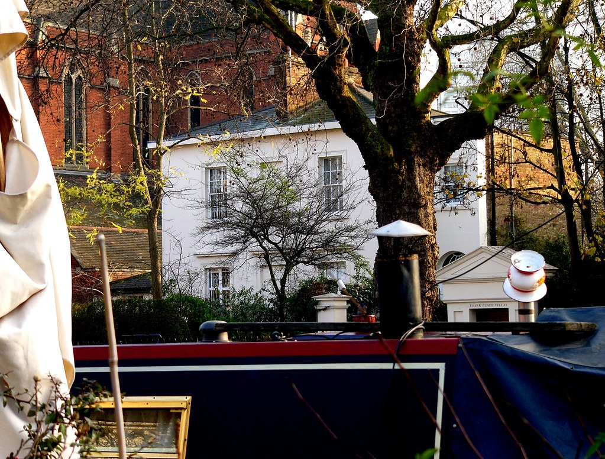
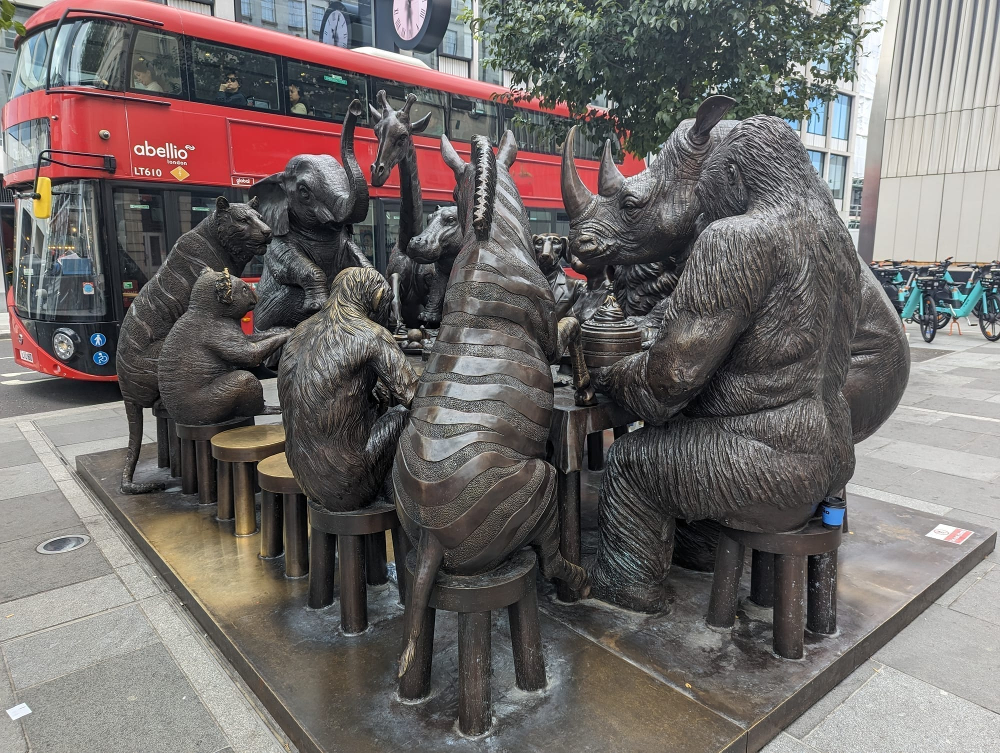
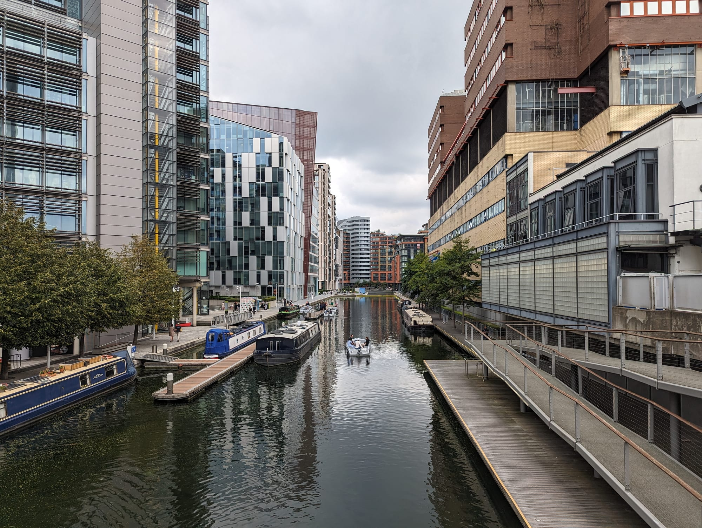

Paddington is where most visitors arrive rather than somewhere they set out to see, and that is a fair reflection of it. This is a working transport hub: a Brunel trainshed, five Tube lines, and the fastest connections to Heathrow in the city.

But ten minutes north of the platforms the character changes completely. **Little Venice** is a canal basin lined with moored narrowboats, waterside pubs and floating cafes, and it is the start of one of the best walks in London.

Paddington has its own share of the commemorative plaques marking where notable people lived or worked - see them on our [interactive map](/plaques/?area=paddington).

## Why visit — and who should skip it

**Come here if** you want a canal walk, a narrowboat trip to Camden, or a well-connected and comparatively affordable base for a first London trip. Little Venice is genuinely lovely and surprisingly quiet given how central it is.

**Skip it if** you are looking for sights. Paddington has no major attraction. The area earns its place on an itinerary as a starting point — for the canal, for Notting Hill, for Regent's Park — rather than as a destination.

## Top sights and activities

1. **Little Venice** — The basin where the Grand Union and Regent's Canals meet, lined with painted narrowboats. Waterside pubs, a floating cafe and a puppet theatre barge.
2. **The narrowboat waterbus to Camden** — About 45 minutes along Regent's Canal, through the Maida Hill tunnel and the grounds of London Zoo. Far more pleasant than the equivalent Tube journey. It does not stop at the zoo.
3. **The canal towpath west** — Follow the Grand Union towards Westbourne Park and Notting Hill. Quiet, flat and almost entirely traffic-free.
4. **Paddington station itself** — Brunel's 1854 trainshed is worth two minutes of looking up before you leave, alongside the Paddington Bear statue on the concourse. Outside, on the plaza, a bronze group of animals sits around a dining table — easy to walk straight past on the way to the Tube.
5. **Paddington Basin** — The modern waterfront east of the station, with the rolling and fan bridges and a run of canalside restaurants.
6. **St Mary's Hospital and the Fleming Museum** — The small laboratory museum where penicillin was discovered in 1928. Limited opening hours; check before going.

*Little Venice, where the Grand Union and Regent's Canal meet. The towpath to Camden starts here. Photo: [Kathleen Tyler Conklin](https://www.flickr.com/photos/79865753@N00/2122563341), [CC BY 2.0](https://creativecommons.org/licenses/by/2.0/).*

## Key streets and micro-districts

### Little Venice and Blomfield Road
The canal basin and its moorings. Waterside pubs, the Puppet Theatre Barge and the departure point for Camden waterbuses. Warwick Avenue station is closest.

### Paddington Basin
East of the station. Modern offices, canalside dining and two unusual moving footbridges. Quiet at weekends.

*The bronze animals outside Paddington station. Most people walk straight past on the way to the platforms.*

### Praed Street and Craven Road
The hotel strip. Functional rather than attractive, but convenient and comparatively cheap.

### Bayswater and Queensway
South-west of the station. A dense, diverse restaurant quarter — Chinese, Middle Eastern and Greek — and the best-value eating near Paddington.

*Paddington Basin, the canal's dead end, rebuilt in glass. The rolling and fan bridges here open on schedule. Photo: [trolvag](https://commons.wikimedia.org/w/index.php?curid=56959884), [CC BY-SA 3.0](https://creativecommons.org/licenses/by-sa/3.0/).*

Powered by <a target="_blank" rel="sponsored" href="https://www.getyourguide.com/london-l57/">GetYourGuide</a>

## Where to eat and drink

| Spot | Style | Price | Why go |
| --- | --- | --- | --- |
| **The Waterway** | Canal-side bistro | ££ | Terrace over the narrowboats in Little Venice |
| **The Summerhouse** | Seafood | £££ | Waterside tables on Blomfield Road; book in summer |
| **Pearl Liang** | Cantonese, dim sum | ££ | Long-standing favourite behind Paddington Basin |
| **Kateh** | Persian | ££ | Small Warwick Avenue restaurant; reserve ahead |
| **Beany Green** | Australian cafe | £ | Reliable breakfast on the station concourse |

## Getting there

**By Tube and rail.** Paddington is served by the Circle, District, Bakerloo and Hammersmith & City lines, plus the Elizabeth line and National Rail services to the west of England and Wales. For Little Venice, **Warwick Avenue** on the Bakerloo line is closer than Paddington itself.

**From Heathrow.** The Elizabeth line takes about 30 minutes; Heathrow Express takes 15 minutes non-stop at a premium fare. Full comparison in the [Heathrow Airport transport guide](/articles/heathrow-airport-to-london/).

**Best exit.** Paddington is large and poorly signposted for visitors. Follow signs for **"Paddington Basin"** for the canal and modern waterfront, or leave via **Praed Street** for the hotels and Bayswater.

## How long to spend, and when to go

| If you have | Do this |
| --- | --- |
| **One hour** | Little Venice basin and a drink on the water |
| **Two to three hours** | Canal walk west to Westbourne Park, lunch in Little Venice |
| **Half a day** | Add the waterbus to Camden, or walk on to Notting Hill |

**Best time:** Late morning. The canal is at its best in daylight and the waterside pubs fill up from midday at weekends.

**Note:** Waterbus services to Camden are much reduced outside summer. Check timetables before planning a trip around one.

## Common mistakes to avoid

1. **Getting lost in the station.** Paddington is a large interchange with poorly marked exits. Know whether you want Praed Street or Paddington Basin before you leave the platform.
2. **Walking to Camden along the canal.** It is around 50 minutes and progressively less scenic. Take the waterbus instead.
3. **Paying walk-up Heathrow Express fares.** Advance tickets are dramatically cheaper, and the Elizabeth line is cheaper still.
4. **Expecting Little Venice to be near the station.** It is a 10–12 minute walk north, or one stop on the Bakerloo line to Warwick Avenue.
5. **Judging the area by Praed Street.** The canal quarter a few minutes north is a completely different place.

Powered by <a target="_blank" rel="sponsored" href="https://www.getyourguide.com/london-l57/">GetYourGuide</a>

## Where to stay

Paddington is one of central London's better-value hotel districts, and the Heathrow connection makes it especially convenient on arrival and departure days.

- **Praed Street and Sussex Gardens** — The highest concentration of mid-range hotels. Convenient, noisy, unremarkable.
- **Little Venice and Warwick Avenue** — Quieter, more attractive, a short walk or one stop from the station.
- **Bayswater and Queensway** — Better restaurants and lower prices, ten minutes south-west, with Kensington Gardens on the doorstep.
