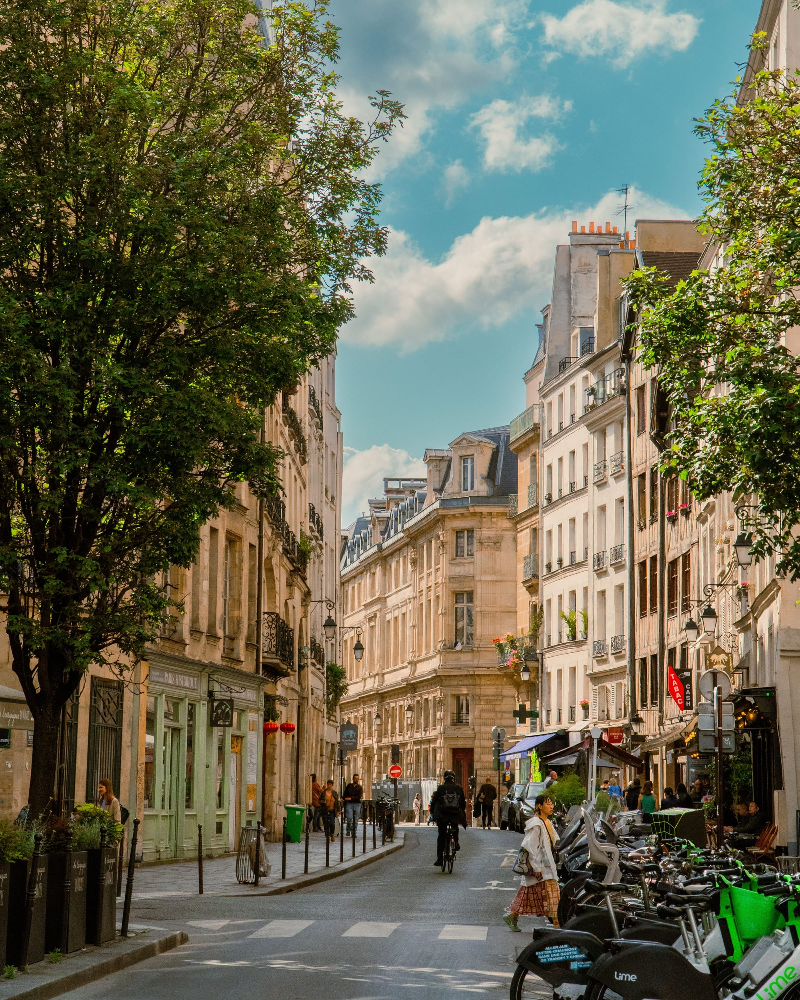
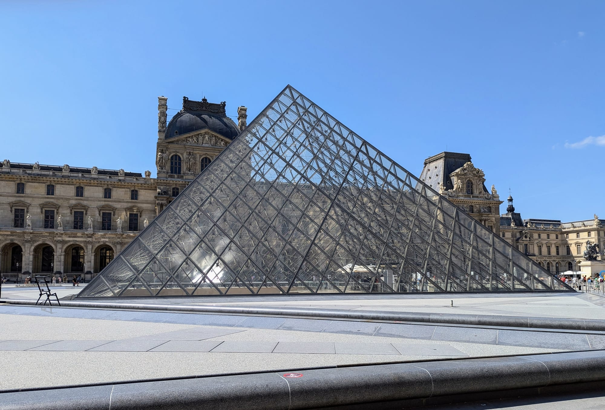
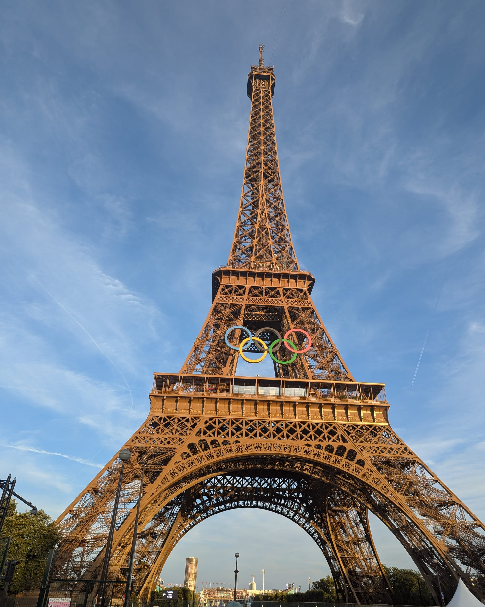
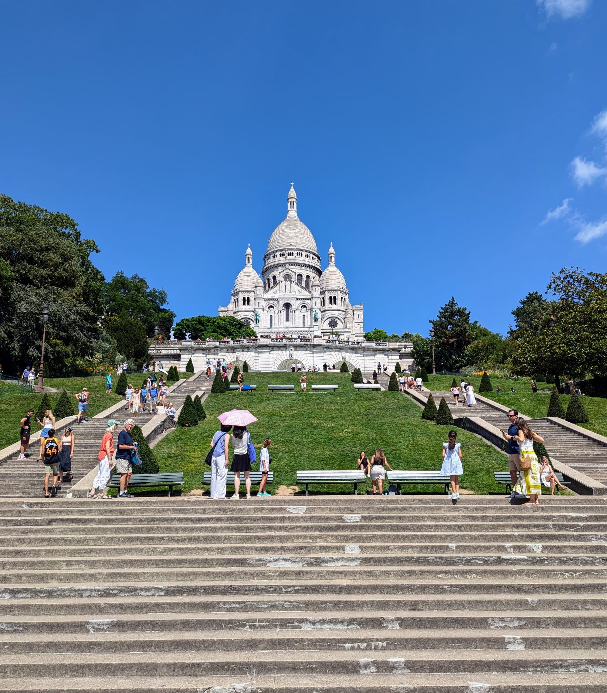

**St Pancras to Gare du Nord is as little as 2 hours 16 minutes on a direct Eurostar, and the fare for that seat moves more than almost anything else on this site: around £55 in Eurostar Standard booked two weeks out, and £220 or more booking for the same day.** Both came from Eurostar's own booking engine, checked on the same day.

The bigger difference from every other day trip here is what happens before you board. This is an international border, and Eurostar does the whole thing at St Pancras before you leave London — UK exit, French entry, and now EU biometric registration too — rather than on arrival in Paris. Budget properly for that and the maths on the day itself is more generous than the three-hour-each-way trips to Stonehenge or the Cotswolds.

> 💡 **The Short Version:** **St Pancras to Gare du Nord, from 2h16 direct.** Eurostar Standard around **£55** booked two weeks ahead (as low as **£35** in a sale), up to **£220+** booking on the day; **Eurostar Plus** roughly **£95–£300**; **Eurostar Premier** a flatter **£245–£361** whatever the date. **Arrive 75 minutes before departure** for Standard or Plus (45 for Premier) — UK exit, French entry and EU Entry/Exit System registration all happen at the station before you board. You need **a passport, not an ID card**, issued within **10 years** and valid **3 months** after you leave France — no ETA or visa required for a UK citizen heading out. **Luggage: 2 bags + 1 daypack** (3 for Premier), 85cm max. The earliest sensible train (07:01) and the last one reliably still selling seats (about 19:11) give you **roughly 7 hours in Paris** — nearer 8 if you take the 06:01. That's **two or three things done properly**, not five rushed.

**Book a tour direct:**

- **From £289** — <a href="https://www.getyourguide.com/activity/-t11108?partner_id=WWP7I0R&amp;cmp=paris-day-trip-eurostar-package" target="_blank" rel="sponsored nofollow noopener" data-affiliate="gyg">Paris day trip with lunch on the Eiffel Tower, Eurostar travel included</a>

## Getting there: the Eurostar

| | London St Pancras → Paris Gare du Nord |
| --- | --- |
| **Operator** | Eurostar, direct |
| **Journey time** | **From 2h16** (2h28–29 on the October days we checked) |
| Eurostar Standard, range we saw | **£35–£135.50** depending on date and time |
| Eurostar Plus, range we saw | £95.50–£300 |
| Eurostar Premier, range we saw | **£245–£361**, barely moved with the time of day |
| Recommended arrival, St Pancras | **75 min** before (Standard/Plus), 45 min (Premier) |

Every fare above is real, taken from Eurostar's own booking engine for a Tuesday about a month ahead — the same "checked a month out" convention we use for the other trains on this site. Prices move by the hour as seats sell, so treat the range as what to expect rather than a quote.

### Eurostar Standard, Plus or Premier

Eurostar renamed its travel classes: **Eurostar Standard, Eurostar Plus and Eurostar Premier now replace the old Standard, Standard Premier and Business Premier** on routes to and from London, so ignore any older guide still using those names.

| | Eurostar Standard | Eurostar Plus | Eurostar Premier |
| --- | --- | --- | --- |
| **Exchange** | Free up to 1hr before | Free up to 1hr before | Free up to **48hrs after** departure |
| **Refund** | Up to 7 days before, £25 fee | Up to 7 days before, £25 fee | Free, up to 48hrs after departure |
| **Luggage** | 2 bags + 1 daypack | 2 bags + 1 daypack | **3 bags** + 1 daypack |
| **Seat** | Standard | Extra spacious | Extra spacious |
| **Food** | Buy on board | 2-course meal at your seat | Chef-designed menu (selected routes) |
| **Lounge** | — | — | St Pancras, Paris, Brussels |
| **Gate** | Standard queue | Standard queue | Priority (London routes) |

For a single day trip, Standard is the one that matters: it can be refunded up to a week out for a £25 fee, and it is free to change right up to an hour before your train, so there is little reason to pay for Plus or Premier unless the lounge or the meal is the point of the trip.

### Booking ahead is the whole game

Eurostar fares work like UK Advance tickets, not like a flat off-peak return — the price moves with demand and how far out you book, and there's no simple walk-up fare to fall back on.

| Booking this far ahead | Cheapest Eurostar Standard, one way |
| --- | --- |
| **Same day** | **£220** |
| 3 days | £110 |
| **1 week** | **£75** |
| **2 weeks** | **£55** |
| **~1 month** | **£35** (promotional fare) |

That's checked on 14 September 2026, cheapest Standard seat on each date for the same route. The £35 fare was part of a sale running for travel between 23 September and 16 December 2026 that was due to close for bookings that same day, so treat it as an example of how low the fare can go rather than a permanent price — but the underlying pattern, a same-day seat costing three to six times a seat booked a few weeks out, is the durable lesson. **Eurostar releases tickets 10 to 11 months ahead**, so for a specific date you have that whole window to watch for a drop.

## Check-in and the border

This is the part that catches people used to a UK domestic train, where you can arrive five minutes before departure. Eurostar's own recommended arrival times are longer, because UK exit checks, French entry checks and EU border registration are all done at your departure station, before you board — not on arrival.

| Station | Class | Recommended arrival | Gate closes |
| --- | --- | --- | --- |
| **St Pancras** (outbound) | Standard / Plus | **75 min before** | 30 min before |
| St Pancras (outbound) | Premier | 45 min before | 15 min before |
| **Gare du Nord** (return) | Standard / Plus | **75–90 min before** | 30 min before |
| Gare du Nord (return) | Premier | 45–60 min before | 15 min before |

> ⚠️ **This is not the 20-minutes-before advice Eurostar gives for its other European routes.** Journeys between Paris, Brussels, Amsterdam and Cologne recommend arriving 20 minutes ahead. London routes are longer because of the passport checks — don't apply the shorter number to a trip that starts or ends at St Pancras.

**You need a passport, not an ID card.** Since Brexit, UK nationals are non-EU travellers on this route. Your passport must have been **issued less than 10 years before** the date you enter France and stay **valid for at least 3 months after** the day you leave — both rules apply, and a passport that fails either will be turned away at the gate. No ETA or visa is required for a UK citizen travelling out; the UK's Electronic Travel Authorisation only applies to foreign nationals entering Britain.

**EU Entry/Exit System (EES) registration** is the newer step: a passport scan, a facial photo and, on your first crossing, fingerprints, done at a self-service kiosk before the ticket gates. It's free, needs no advance application, and Eurostar's own guidance is simply to arrive at the recommended time and bring your passport — the kiosk tells you whether to proceed to an ePassport gate or a border agent afterwards.

**Luggage:** one handbag or daypack plus two further items, none more than 85cm at their widest point, for Standard and Plus — three bags plus the daypack for Premier. There's no weight limit, but you carry and store it yourself on board.

## Is Paris actually doable as a day trip?

Yes, and the numbers are kinder than you might expect — kinder than Stonehenge or the Cotswolds, where the travel time alone eats most of the day.

Checking a Tuesday about a month out: the **first train that doesn't mean checking in before 5am** is 07:01, arriving Gare du Nord at 10:29 local time. (The very first departure of the day is actually 06:01, arriving 09:29 — but Standard and Plus passengers are advised to check in 75 minutes ahead, which means being at St Pancras by around 04:45. For most people, 07:01 is the realistic early option, not 06:01.) The **last Paris–London train we could actually book a seat on** was 19:11, arriving St Pancras at 20:30; a later 21:02 departure is on the timetable but showed no seats in any class on all three October weekdays we checked, so don't plan around it.

That gives you from **10:29 to about 17:45** in Paris before you need to be through the gates at Gare du Nord for the 75–90-minute check-in — call it **seven and a quarter hours**. Take the 06:01 instead and it stretches to about **eight hours and fifteen minutes**.

> 💡 **A real day-tour operator books almost exactly this pattern.** Premium Tours' escorted Paris day trip from London (below) sets check-in at St Pancras for 6am on weekdays, with outbound trains "usually 7am" and return trains "usually 7pm/8pm" — an independent match for the window we worked out from Eurostar's own timetable.

Seven hours sounds generous next to a three-hour bus ride each way to Stonehenge, and it is — but by the time you've added the walk to and from the Métro, queuing at whatever you're visiting, and a buffer for getting back to Gare du Nord rather than sprinting for the gate, the honest number for actually doing things is closer to **five or six hours**. That's two sights done properly and a meal, not four rushed past.

*A side street in central Paris. Photo: MuffinLand, Pexels.*

## Getting into Paris: Métro and RER from Gare du Nord

Gare du Nord is itself a Métro and RER hub, so nothing central is far. A single ticket is **€2.55** on any Métro, RER or train within Paris (a day pass is €12.30, worth it only if you're making more than about five journeys). All times below are live transit estimates checked from Gare du Nord.

| From Gare du Nord to | Time | Route |
| --- | --- | --- |
| **Notre-Dame** | **9–11 min** | Métro line 4, or RER B |
| **Louvre** | **13–17 min** | RER B/D, or Métro line 4 |
| **Montmartre / Sacré-Cœur** | **15 min** | Métro line 4 |
| **Eiffel Tower** | **28 min** | RER B, then RER C |

Louvre and Notre-Dame are also a **9-minute walk from each other** along the river, which is the natural pairing if you'd rather stay central than cross town to the Eiffel Tower.

## What to do with the day

Given the real hours available, pick one of these rather than trying to string all of them together — the point of a day trip is not spending it entirely on the Métro.

**Central loop: Louvre, then Notre-Dame.** Closest to the station and closest to each other. The Louvre's collection is vast; if you have two to three hours, go in with a short list (the Mona Lisa and the Denon wing are the obvious one) rather than trying to see everything. It's **€22 for EEA residents, €32 for everyone else** — which now includes UK visitors — and **closed every Tuesday**, open 9:00–18:00 Monday, Thursday, Saturday and Sunday, 9:00–21:00 Wednesday and Friday, last entry an hour before close. Notre-Dame, reopened in December 2024 after the 2019 fire, is **free to enter every day during opening hours**.

*The glass pyramid in the Louvre's main courtyard, the museum's best-known entrance.*

> ⚠️ **If you're travelling on a Tuesday** — the same day of the week we priced the Eurostar fares against in this guide — **the Louvre is shut.** Swap in the Musée d'Orsay or simply give Notre-Dame and the Left Bank more time.

**Eiffel Tower loop: the tower, then a Seine cruise.** Both start from the same spot, so there's no extra crossing of the city. A ticket to the summit by lift is **€36.70**, to the second floor **€23.50**; the tower is booked in timed online slots, and same-day walk-up availability isn't guaranteed, so book ahead if this is the plan. Bateaux Parisiens run a one-hour sightseeing cruise from the foot of the tower past the Musée d'Orsay, the Louvre and Notre-Dame — a way to see the rest of central Paris from the water if you don't have time to visit it on foot. Large luggage isn't allowed inside the tower and there's no storage, so this loop doesn't work if you're carrying more than a day bag.

*The Eiffel Tower in August 2024, wearing the Olympic rings it carried for the Paris Games.*

**Montmartre**, 15 minutes from the station by Métro, is the option if you'd rather wander a neighbourhood than queue for a ticketed sight — cobbled streets, the Place du Tertre, and the basilica itself free to enter.

*The Sacré-Cœur at the top of Montmartre, free to enter once you've climbed the steps.*

Powered by <a target="_blank" rel="sponsored" href="https://www.getyourguide.com/london-l57/">GetYourGuide</a>

Prefer someone else to handle the tickets, the coach transfers in Paris and the Eurostar booking? The escorted day trip linked at the top of this guide covers a panoramic coach tour, lunch at the Eiffel Tower's Madame Brasserie, a Seine cruise and entry to the tower itself, with round-trip Eurostar included — useful if you'd rather not plan the logistics above yourself.

Powered by <a target="_blank" rel="sponsored" href="https://www.getyourguide.com/london-l57/">GetYourGuide</a>

## What people get wrong

- **Booking on the day instead of weeks ahead.** The cheapest same-day Standard fare we found was £220; a week out it was £75, and it kept falling the further out we checked.
- **Treating check-in like a UK domestic train.** Eurostar wants 75 minutes at St Pancras for Standard and Plus, not the 10 or 15 minutes a British train gets away with.
- **Assuming a UK driving licence or ID card works.** It doesn't — you need a passport, and it has to clear both the 10-year issue rule and the 3-month validity rule.
- **Not checking the passport's issue date.** A passport renewed early sometimes carries months added on from the old one, which can push it past the 10-year cutoff for entry even though it "isn't expired."
- **Planning around the very last train on the timetable.** The 21:02 Paris–London service showed no seats in any class on every date we checked a month out — treat about 19:11 as the real last train, not 21:02.
- **Turning up at the Louvre on a Tuesday.** It's the museum's one closed day, and it's easy to hit if you're booking around a midweek fare.
- **Trying to fit in the Eiffel Tower, the Louvre, Notre-Dame and Montmartre in one day.** With 7 to 8 hours in the city minus transit and queuing, that's an itinerary for two days, not one.
- **Showing up at the Eiffel Tower without a booked slot** and expecting to walk straight up — tickets are sold in timed slots online, and same-day entry isn't guaranteed.

All prices and times checked 14 September 2026.

## Continue planning your trip

- 🗺️ **[Day trips from London](/articles/day-trips-from-london/)** — what the others cost, how long they take, and which days they are shut.
- 🛁 **[Bath day trip](/articles/bath-day-trip/)** — the other day trip here with a train over an hour each way, and how the maths compares.
- 🏰 **[Windsor from London](/articles/windsor-day-trip/)** — the shortest big day out, if a full day abroad isn't what you're after.
- 🚇 **[London transport costs and fares](/articles/london-public-transport-costs-and-fares/)** — how contactless and capping work on the London end of the trip.
