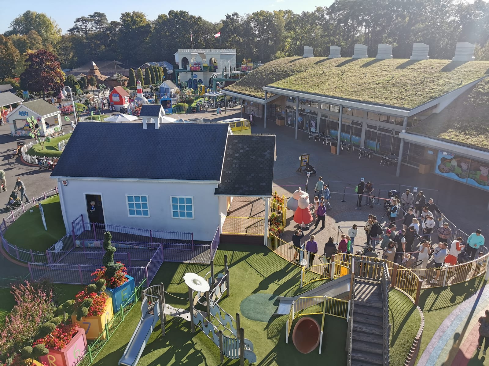
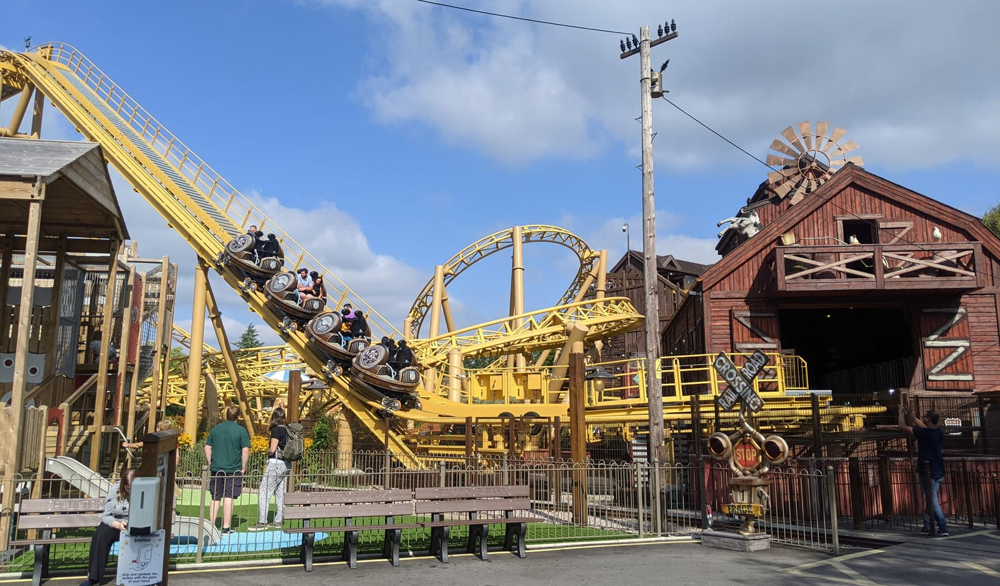
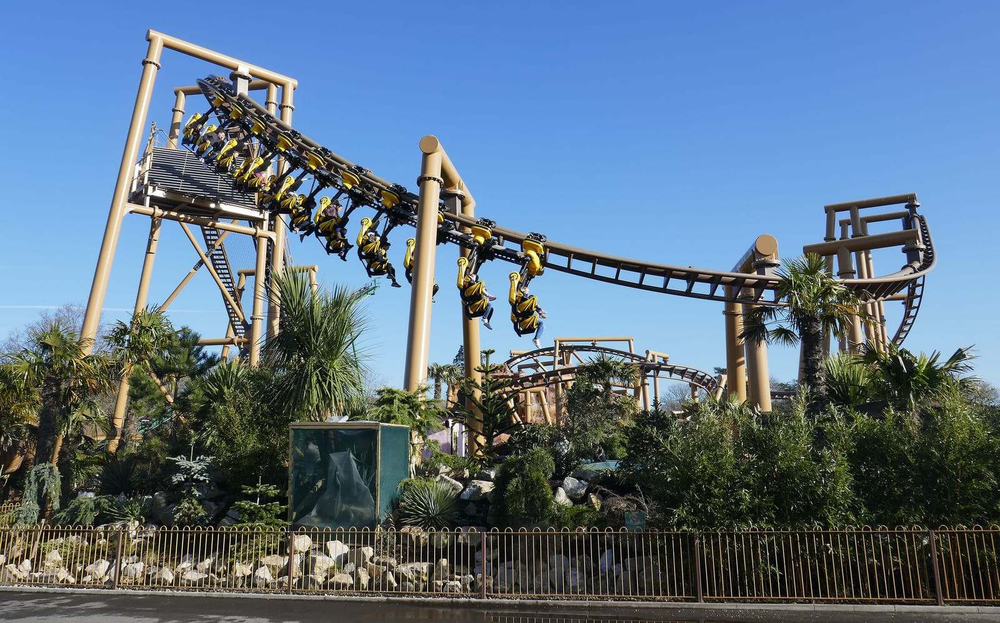

**Paultons Park costs £46.75 a person booked ahead for October 2026, children under 1 metre go free, and parking is free.** Book on the day and the same ticket is £61.50. Adults and children pay the same, so a family of two adults and two children over 1m pays £187 for an October day.

It is a family-run park of more than 70 rides and attractions on 140 acres at the edge of the New Forest, near Romsey, and it is home to the UK's only Peppa Pig World. It is not owned by Merlin, so a Merlin Annual Pass does not get you in.

> 💡 **The Short Version:** **Built for families with children under 14**: Peppa Pig World is aimed at ages 1 to 6, and the new **Valgard** coasters give older children something bigger. **Tickets £46.75 online in advance in October 2026, £61.50 booked on the day; under 1m free.** By **train from Waterloo to Southampton Central (about 1 hour 20) and the X7 bus (£3)**, or a **£20 pre-booked taxi**. **Parking is free.** **The traps: the X7 does not run on Sundays**, and the park is shut on November weekdays, from **4 January to 5 February 2027**, and on most term-time weekdays in February and March.

## What tickets cost

| Dates | Booked ahead online | Booked on the day |
| --- | --- | --- |
| **October 2026**, including the Halloween event | **£46.75** | £61.50 |
| October 2026, two consecutive days | £70.00 | £84.75 |
| **November reduced-rate weekends**, 7 to 29 November 2026 | **£29.00** | £38.50 |
| Christmas event days, 5 December 2026 to 3 January 2027 | £41.00 | £55.00 |
| Christmas event, two consecutive days | £61.50 | £75.50 |
| **Under 1 metre**, measured in shoes | Free, no ticket needed | Free |

*Per person, adult or child, from Paultons Park's own booking system.*

**Tickets are sold online only, and booking on the day of the visit costs almost a third more.** All the tickets in a booking enter together. There is no family ticket and no child rate; wheelchair users need a ticket too, and Access Card holders can buy an Essential Companion ticket that takes a discount off the carer.

**Tickets are non-refundable, and changing the date costs £20** through [Paultons' date-change page](https://paultonspark.co.uk/tickets/change-visit-date/), up to midnight the night before, plus any price difference.

**Two days is the usual advice in the school holidays.** Paultons suggests a first day in Peppa Pig World and a second for the rest of the park. The two-day ticket costs £23.25 more than one day in October 2026.

### Annual passes

| Pass | Price | Valid |
| --- | --- | --- |
| Essential | £172 | Off-peak periods |
| Star | £225 | Off-peak periods, including selected weekends; 20% off food and drink |
| Premium | £290, or £26.50 a month | Any day the park is open; 20% off food and drink |

At £46.75 a visit, the Essential pass pays for itself on the fourth off-peak visit. No pass needs pre-booking.

Book direct on [paultonspark.co.uk](https://paultonspark.co.uk/tickets/).

## Getting there from London

### Train and the X7 bus

**London Waterloo to Southampton Central is direct, about 1 hour 20 minutes on the fastest trains**, on South Western Railway, with direct trains from Clapham Junction too.

From Southampton Central, leave by platform 1, cross the road, and take the **X7 or X7R towards Salisbury from stop SB on Wyndham Place**, about 100 metres from the station exit. The bus takes **about 20 to 25 minutes**, single fares are **£3** on Salisbury Reds, and it runs **roughly hourly, Monday to Saturday only**. Some journeys go right into the park grounds to the main entrance; the others stop at **Ower, The Mortimer Arms**, at the end of the drive, a 5 to 10 minute walk from the gate.

| X7 buses that use the main entrance | Monday to Friday | Saturday |
| --- | --- | --- |
| **Southampton Central → Paultons** | 09:12, 10:22, 11:32, 16:33 | 09:12, 10:22, 11:32, 15:32, 16:32 |
| **Paultons → Southampton Central** | 15:33, 16:59, 17:41 | 15:33, 16:34, 17:37 |

*Salisbury Reds X7 timetable for October 2026. These reach the gate 23 to 26 minutes after leaving the station; the rest of the hourly service uses the Ower stop. Check [the X7 timetable](https://www.salisburyreds.co.uk/services/SWWD/X7) for your date.*

> ⚠️ **There is no X7 on Sundays or bank holidays.** On those days, take a taxi from Southampton Central or drive.

### Taxi from the station

Paultons works with **Radio Taxis**, which charge set fares to the park if you **pre-book** on 023 8066 6666 or its app; the code PAULTONS takes 20% off in the app.

| From | Standard taxi | Multi-seater |
| --- | --- | --- |
| **Southampton Central** | **£20** | £25 |
| Southampton Airport Parkway | £23 | £25 |
| Totton | £18 | £20 |
| Romsey | £18.50 | £20 |

For four people, a taxi each way from Southampton Central is £40 against £24 for eight £3 adult bus fares, and it runs on Sundays.

### Driving

The postcode is **SO51 6AL**, just off **junction 2 of the M27**; from London, take the M3 and then the M27 west towards Bournemouth, not east towards Portsmouth. **Parking is free**, in two tarmac car parks with an overflow field on the drive in peak season. There are no electric car chargers. On busy days, Paultons suggests leaving before 17:30 to avoid queueing out of the car park.

## When it is open

| Period | Days | Hours |
| --- | --- | --- |
| **October 2026** | Daily except 6 and 7 October | 10:30 to 16:30 on term-time weekdays, 10:00 to 17:00 at weekends and in half-term |
| **Halloween Spooktacular** | 9 October to 2 November 2026 | Late opening to 19:30 on 17, 23, 24, 27, 28 and 29 October |
| **November 2026** | Weekends only, 7 to 29 November | 10:30 to 16:00, selected rides |
| **A Celebration of Christmas** | 5–6, 12–14 and 18–24 December 2026, 27–31 December, 2–3 January 2027 | 10:00 to 16:30 |
| **February and March 2027** | 6–7 February, then Fridays to Mondays from 12 February; daily 13 to 22 February | 10:00 or 10:30 to 16:30 |
| **2027 main season** | Daily from 25 March 2027, apart from some term-time weekdays | 10:00 to 16:30–17:30 |

*From [Paultons' opening times calendar](https://paultonspark.co.uk/info/opening-times). The 2027 term-time closures are mostly Wednesdays in April and May, Tuesdays and Wednesdays in September and early October, and several days between 29 June and 13 July.*

> ⚠️ **Paultons is closed from 4 January to 5 February 2027**, and on weekdays through November 2026. On the November reduced-rate weekends, all of Lost Kingdom's rides, Edge, Cat-O-Pillar, the Pirate Ship and the water rides are shut for maintenance, which is why the ticket is £29.

## Rides, and who they suit

*Peppa Pig World. Photo: [Lewis Clarke](https://commons.wikimedia.org/wiki/File:Copythorne_,_Paultons_Park_-_Peppa_Pig_World_-_geograph.org.uk_-_8166422.jpg), [CC BY-SA 2.0](https://creativecommons.org/licenses/by-sa/2.0/).*

The park is split into six themed areas, set among gardens, lakes and an animal collection of more than 90 species.

- **Peppa Pig World** is included in every ticket and built for ages 1 to 6: nine rides, including Peppa's Big Balloon Ride, Grandpa Pig's Little Train and Miss Rabbit's Helicopter Flight, plus the Muddy Puddles splash park, George's Spaceship indoor playzone and Peppa and George to meet every day the park is open.
- **Valgard: Realm of the Vikings**, opened on 16 May 2026, is the park's biggest addition. **Drakon** climbs a vertical lift hill, drops beyond vertical and turns riders upside down twice, the first coaster at Paultons to invert. **Raven** is the park's old bobsled coaster rebuilt and rethemed, and **Vild Swing** swings riders 12 metres up.
- **Lost Kingdom** is dinosaurs: **Velociraptor**, a boomerang coaster at up to 40mph, **Flight of the Pterosaur**, the gentler **Dino Chase** coaster and the Dinosaur Tour Co., a 4x4 ride through the dinosaurs.
- **Tornado Springs** is the Wild West: the spinning **Storm Chaser** coaster, **Cyclonator**, which swings riders to 25 metres, and **Al's Auto Academy**, a driving school for children from 80cm.
- Across the rest of the park: **Edge**, a giant disc that spins along a 90-metre track at 43mph, the **Buffalo Falls** rapids, **Sky Swinger**, **Kontiki** and a **Pirate Ship**.

*Storm Chaser. Photo: [Henry Burrows](https://commons.wikimedia.org/wiki/File:Storm_Chaser_%28Paultons_Park%29_2.jpg), [CC BY-SA 2.0](https://creativecommons.org/licenses/by-sa/2.0/).*

### Height restrictions

| Ride | Minimum height | Must ride with a responsible adult |
| --- | --- | --- |
| **Drakon** | **1.25m** | Under 1.4m |
| **Edge** | **1.2m**, and age 6 | Under 8 and under 1.4m |
| **Cyclonator** | **1.2m**, and age 6 | Under 8 and under 1.4m |
| **Raven** | **1.1m** | Under 8 and under 1.3m |
| Velociraptor | 1.0m, and age 4 | Under 8 and under 1.2m |
| Storm Chaser | 1.0m, and age 4 | Under 8 and under 1.2m; one adult per child |
| Flight of the Pterosaur | 1.0m, and age 4 | Under 8 or under 1.2m |
| Sky Swinger | 1.0m | Under 8 or under 1.2m |
| Vild Swing | 95cm | Under 7 |
| Buffalo Falls | 90cm | Under 7 |
| Cat-O-Pillar Coaster | 90cm | Under 8 |
| Pirate Ship, Kontiki | 90cm | Under 6 (Pirate Ship), under 7 (Kontiki) |
| Windmill Towers, Farmyard Flyer | 90cm | Under 7 |
| George's Dinosaur Adventure | 85cm | Under 1.1m, in the front seat |
| Dino Chase | 85cm | Under 5 |
| Al's Auto Academy | 80cm | — |
| Tea Cup Ride | 75cm | Under 8 |
| Most Peppa Pig World rides | None | Varies; Miss Rabbit's Helicopter Flight under 8 |

*From each ride's page on [paultonspark.co.uk](https://paultonspark.co.uk/rides/). A responsible adult is 16 or over.*

**The rules here are about age as well as height.** A tall five-year-old still cannot ride Edge or Cyclonator, and under-8s need an adult on most of the bigger rides. A child under 1 metre gets in free and can ride every Peppa Pig World ride (George's Dinosaur Adventure needs 85cm), plus the many rides with no minimum height, including Ghostly Manor, the Rio Grande Train, the Victorian Carousel, the Dinosaur Tour Co. and the Viking Boats.

**Tot Swap** lets one parent ride while the other waits with a small child, then swap in through the exit without queueing again, on Edge, Sky Swinger, the Pirate Ship, Kontiki, Cat-O-Pillar, Flight of the Pterosaur, Velociraptor, Storm Chaser, Cyclonator, Windmill Towers and Al's Auto Academy. Ask the ride operator for the ticket as you get off; it is valid for 10 minutes.

*Flight of the Pterosaur. Photo: [Henry Burrows](https://commons.wikimedia.org/wiki/File:Flight_of_the_Pterosaur_1.jpg), [CC BY-SA 2.0](https://creativecommons.org/licenses/by-sa/2.0/).*

## Queues

**Queues at Paultons are short by theme-park standards.** Across 2025, queue-times.com, which logs each park's official wait times, recorded average waits of **5 to 12 minutes** a ride. The longest averages were George's Dinosaur Adventure and Grampy Rabbit's Sailing Club, both in Peppa Pig World, at 12 minutes, with Miss Rabbit's Helicopter Flight and The Queen's Flying Coach at 11.

**The busiest days are school holidays.** The same data put August at 76% of capacity on average against 21% in December, and Saturdays highest at 53%; the late-night Halloween openings averaged 86%, the busiest of any event. All ten of the busiest days of 2025 fell in August, October half-term or the Easter holidays.

**Do Peppa Pig World first or last.** Paultons' own advice for the holidays is to go there at 10:00 before queues build, or come back after 16:00, and to do Miss Rabbit's Helicopter Flight and George's Dinosaur Adventure first because they fill quickly. Spend the middle of the day on the rest of the park.

**Fast track is only sold inside VIP packages**, from **£285 a person** for Bronze, with entry, priority parking for two cars, a host and unlimited fast-track rides. It cannot be bought on its own.

**Peppa's Early Play and Ride Pass** buys a private meeting with Peppa and George between 09:00 and 09:30 and 30 minutes on the Peppa Pig World rides from 09:30, before the park opens, on selected dates. It is **£19.25 an adult and £29.75 for a child aged 3 or over**, on top of the park ticket, and must be booked by 16:00 the day before.

**The Queue Assist Pass** is for disabled guests who find queueing difficult. It must be booked in advance with an Access Card ID carrying one of the queueing, standing, crowds or urgent-toilet symbols; registering your access needs with Paultons alone is free.

## Food, bags and lockers

- **Picnics are welcome.** Paultons suggests the main gardens and the lawns by the Sky Swinger, and there are picnic benches across the park. No barbecues.
- **The park is cashless** and does not take American Express. Guest Information will load cash onto a gift card.
- **Lockers**: all-day lockers by Guest Information at the entrance and by the Buffalo Falls photo kiosk, card only, £4 regular and £6 large; single-use lockers at Water Kingdom and Lost Kingdom are £1.
- **Strollers** can be hired, £12 single or £15 double, booked online.
- **Pet dogs are not allowed**; assistance dogs are welcome.
- **Wear shoes.** Children are measured in them, and the free-entry rule is 1 metre in shoes.

## Halloween and Christmas

**Halloween Spooktacular runs from 9 October to 2 November 2026**, included in the normal ticket. It is pitched at families rather than scare fans: Peppa and George in Halloween costumes, The Great Halloween Mystery show from 17 October, the Ghostly Manor dark ride, and Viking characters, magic and storytelling in Valgard from 15:00, with a fire show on selected dates. The **late openings to 19:30** on 17, 23, 24, 27, 28 and 29 October cost nothing extra; Peppa Pig World still closes at 18:00. **Water Kingdom, Muddy Puddles and Seal Falls are shut throughout**, Velociraptor until 11 October and Sky Swinger from 12 to 18 October. Our [Halloween in London guide](/articles/halloween-london/) covers the scare events closer to town.

**A Celebration of Christmas runs on the dates in the opening table, 5 December 2026 to 3 January 2027.** Peppa Pig World, Valgard, Tornado Springs and Lost Kingdom's rides run; Edge, Cat-O-Pillar, the water rides and a few others close for winter maintenance. Santa's Storytime runs until 24 December, and Santa's Grotto is an extra booked with your ticket before the day. More festive days out are in our [Christmas in London guide](/articles/christmas-in-london/).

## Staying over

**There is no hotel at Paultons.** Its official short breaks, sold as [Paultons Breaks](https://www.paultonsbreaks.com/) and run by Holiday Extras, package a nearby hotel with park tickets and add **a second park day free**. They start **from £48 a person a night**. The partner hotels range from 3 to 37 miles from the park, from Southampton and the New Forest to Winchester and Basingstoke, so check the distance before you pick one.

Southampton is the obvious base if you arrive by train: the X7 leaves from beside Southampton Central, and the taxi is £20.

## What people get wrong

- **Planning a Sunday by bus.** The X7 does not run on Sundays or bank holidays.
- **Booking on the morning of the visit.** Same-day tickets cost £61.50, not £46.75.
- **Going in winter on a weekday.** Closed on November weekdays and from 4 January to 5 February 2027.
- **Bringing a Merlin pass.** Paultons is independent; Merlin passes are not accepted.
- **Expecting to buy fast track.** It only comes inside VIP packages.
- **Measuring a toddler barefoot.** The 1 metre free-entry line is measured in shoes.
- **Following the M27 east to Portsmouth.** From the M3, bear left onto the M27 west towards Southampton and Bournemouth.

## Continue planning your London trip

- 🎢 **[Theme parks near London](/articles/theme-parks-near-london/)** — every park within a day trip, compared on price, travel and age.
- 🧱 **[LEGOLAND Windsor](/articles/legoland-windsor-day-trip/)** — the other park built for under-12s, an hour from London by train and bus.
- 🦁 **[Chessington World of Adventures](/articles/chessington-world-of-adventures-day-trip/)** — Merlin's family park and zoo, in Zone 6.
- 🎢 **[Thorpe Park](/articles/thorpe-park-day-trip/)** — the Merlin park built for teenagers and thrill rides.
- 🪨 **[Stonehenge](/articles/stonehenge-day-trip/)** — also reached through the South Western line from Waterloo.
- 👨‍👩‍👧 **[London with kids](/articles/london-with-children/)** — free farms, zoos and family days out in the city.
- 🗺️ **[Day trips from London](/articles/day-trips-from-london/)** — what the others cost, how long they take, and which days they are shut.
