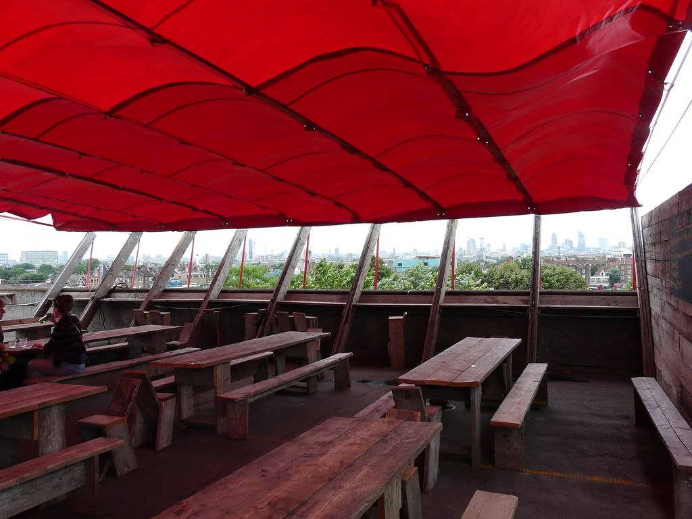
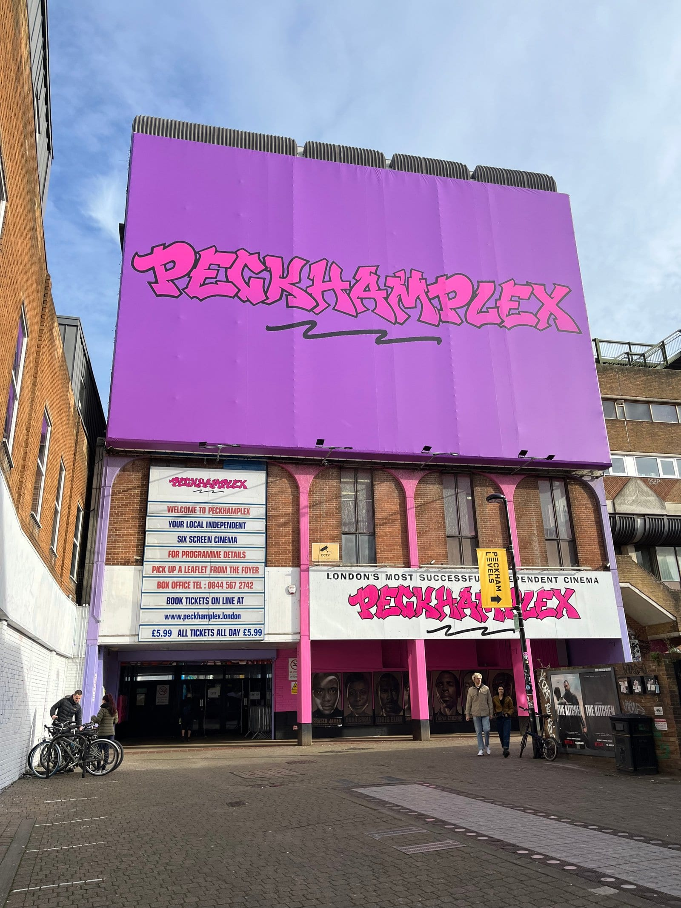

Peckham is the most-changed part of London in the last fifteen years and still the least polished. Rye Lane is a working high street of African grocers, fabric shops and phone repair kiosks; three floors above it, people are drinking cocktails on a car park roof looking back at St Paul's.

Both things are true at once, and neither has replaced the other. That is the whole appeal.

Peckham has its own share of the commemorative plaques marking where notable people lived or worked - see them on our [interactive map](/plaques/?area=peckham).

## Why visit — and who should skip it

**Come here if** you want to see how London actually eats and drinks outside the centre, and you want a view over the city that costs the price of a beer.

**Skip it if** you are on a short trip with museums to see. Peckham is thirty minutes from the middle and has no sights in the conventional sense. It rewards an evening, not a detour.

## Top sights and activities

1. **Rye Lane** — The high street, and the reason to come. African and Caribbean grocers, fabric shops, butchers and market stalls, busiest on a Saturday.
2. **Frank's Cafe** — A bar on the top deck of a multi-storey car park with an unobstructed view north to the City. **Free to walk up, no ticket**, and seasonal: roughly mid-May to mid-September, Wednesday to Sunday.
3. **The Bussey Building** — A former cricket bat factory turned arts and nightlife complex, off Rye Lane in Copeland Park. Bars, club nights, a rooftop and a cinema.
4. **Peckham Levels** — **The same car park**, on the floors below Frank's: studios, workspace and a bar. Open year round unlike Frank's, but **closed Mondays and Tuesdays**, and the old floor of independent food traders is gone.
5. **The South London Gallery** — A free contemporary art gallery on Peckham Road with a good garden and a second site in a former fire station opposite.
6. **Peckham Rye Park and Common** — Large, genuinely local, and where the area goes at the weekend. William Blake claimed to have seen angels in a tree here.
7. **Peckhamplex** — A cinema where every ticket is **£6.99** (£7.59 with the booking fee), a fraction of a West End seat. Also in the same car park building. Beloved locally and rightly so.

*Frank's, on the top floor of a multi-storey car park. Summer only, and the view is the entire point. Photo: [Loz Flowers](https://www.flickr.com/photos/99245765@N00/4800919009), [CC BY-SA 2.0](https://creativecommons.org/licenses/by-sa/2.0/).*

## Key streets and micro-districts

### Rye Lane

The spine, and the reason to come. Loud, crowded, and the part of Peckham that has changed least — African and Caribbean grocers, fabric shops, butchers, hair and beauty, phone repair and shipping agents, with the newer places threaded between them rather than replacing them.

**Rye Lane Market** at number 48 is the indoor one: **over 60 units under one roof, open seven days**, roughly 9.30am to 8pm Monday to Saturday and 11am to 5pm on Sunday. The food inside is Mexican, Peruvian, Salvadoran, Honduran, Congolese, Guyanese, Caribbean and West African, alongside tailors, herbalists, key cutters and a crystal stall. Southwark also runs a scatter of street-market pitches on the roads off Rye Lane — **Choumert Road, Atwell Road, Parkstone Road** — though the council publishes no trading days for any of them, so treat those as luck.

**Cornerhouse** at 133A is the newer end of the street in one building: Tonkotsu for ramen, **Forza Wine on the roof**, a basement club, a coffee shop and co-working above.

Just off it, **Peckham Palms** on Bournemouth Close is the **UK's first hair and beauty hub built for Afro hair** — over thirty stylists and a café. It exists because it was built to rehouse the Black-owned businesses displaced by the station redevelopment, which is worth knowing while you look at the new civic square going up.

### Copeland Park and the Bussey Building

Off the east side of Rye Lane through **Bussey Alley**, 150 metres from the station. A former **cricket bat factory** and the yards around it, now the densest concentration of independent anything in south London.

**The Bussey Rooftop Bar** is the anchor and it runs **year round**, not just in summer — from 5pm on weekdays and midday at weekends, free to walk in, dogs welcome, under-18s until 7pm. There is shelter and there are heaters, so bookings go ahead in the rain, and the drinks come in reusable polycarbonate rather than glass because there are homes below. It is **not wheelchair accessible**.

Around it: **Jumbi**, a Black-owned HiFi rum bar; **Copeland Gallery** and **Bosse & Baum**; two derelict Victorian houses used as exhibition space; **Balamii** radio; a ceramics studio, a CrossFit gym and a vegan café in **Holdrons Arcade**; record shops, vintage dealers and the fashion designer Bianca Saunders. **Fitzcarraldo Editions**, which publishes two Nobel laureates, works out of the same yard.

**One thing has changed.** The **CLF Art Café**, the club and live venue the Bussey Building was best known for, has moved out — it now runs at Mountview on Peckham Hill Street. The nightlife here is bars and the rooftop rather than the old club nights.

### Bellenden Road

West of Rye Lane and a complete contrast: quiet, low-rise, Victorian, and where Peckham goes to sit down and eat properly.

**Look at the bollards.** When Southwark ran a street-improvement scheme here from 1997 it commissioned the artists who happened to live locally: **Antony Gormley designed the bollards and street furniture**, and **Tom Phillips did the lampposts and mosaics**. Almost nobody walking down the street knows they are passing a Gormley, and there is no sign telling them.

The third artist of that group, **John Latham**, lived at number 210, and his house is now **Flat Time House** — a free public art space and archive built around the artwork he installed in his own home. It opens Wednesday to Sunday afternoons when a show is on.

The eating is the other reason: **Artusi** for Italian, **The Begging Bowl** for Thai, and a run of cafés and delis. The street was settled by **Huguenots** and has been called the French Quarter for years — the Montpelier pub and Petitou café are the leftovers of that, and a French community still lives around it.

**Note the geography.** Kruk, Levan and Peckham Cellars all get filed under Bellenden by guides that have not walked it — they are on Blenheim Grove and Queens Road, by the station.

### Peckham Road

North towards Camberwell, and quieter than anything on Rye Lane. This is the Peckham–Camberwell boundary, which is why the addresses flip between SE15 and SE5 halfway along.

The **South London Gallery** is the reason to walk up. It is **free**, and it is **two buildings 120 metres apart**: the Victorian main gallery at 65–67 Peckham Road, and the **former fire station opposite at number 82**, which became a second set of galleries in 2018. Contemporary shows in both.

**It is closed Mondays and Tuesdays.** Wednesday runs late to 9pm; Thursday to Sunday it is midday to 6pm. The **café is open more days than the galleries are**, and the **Orozco Garden behind is weekends only, midday to 6pm** — a detail that catches people who come specifically for it.

There is **no Tube anywhere near**, which is the honest problem with this stretch. Peckham Rye station is a fourteen-minute walk; the 12, 36, 171, 343, 345 and 436 all stop outside. Camberwell College of Arts is a few doors up, which explains a certain amount about the area.

### Peckham Rye

South towards the park, more residential, and where the area calms down. **Peckham Rye Park and Common is 113 acres** in two halves — 64 acres of open Common to the north, mown and flat, and 49 acres of proper Victorian park to the south, bought by the parish in 1868 for £51,000.

The park half has the things worth walking to: a **community wildlife garden** with beehives and a pond, a restored **fernery**, a skate park, an outdoor gym and an adventure playground. It has held a Green Flag every year since 2007. **Opening is 7.30am to dusk**, and dusk here means 5pm in January and 9.30pm in July — check the month rather than assuming.

**On the William Blake angel tree, the honest version:** Blake is said to have walked out here from the City as a boy in 1767 and seen a vision of angels filling a tree. The story is a biographical anecdote written down long afterwards rather than anything Blake recorded at the time — it happened **on the Common rather than in the Park**, and **the tree is gone**. There is no marker and nothing to photograph, whatever other guides imply.

The street called **Peckham Rye**, facing the Common, has the neighbourhood end of the eating: **Bà Ba**, the Nguyen family's southern Vietnamese restaurant, renamed from Bánh Bánh in 2026, and **Old Spike** for coffee.

*Peckhamplex. Every ticket, every showing, is £6.99 - the cheapest cinema in London by a distance, and it is in the same car park as Frank's and Peckham Levels. Photo: [Rhagfyr](https://commons.wikimedia.org/w/index.php?curid=144499998), [CC0](https://creativecommons.org/publicdomain/zero/1.0/).*

Powered by <a target="_blank" rel="sponsored" href="https://www.getyourguide.com/london-l57/">GetYourGuide</a>

## Where to eat and drink

Peckham eats well and cheaply. This is a selection — see the [full restaurant list](/articles/eat-in-london-guide/) for more.

| Spot | Style | Price | Why go |
| --- | --- | --- | --- |
| **The Begging Bowl** | Northern Thai | £££ | Jane Alty trained under David Thompson; small plates across the table |
| **Kruk** | Thai | ££ | A Michelin Bib Gourmand — serious Thai at the value end |
| **Artusi** | Seasonal Italian | ££ | A Bellenden Road neighbourhood restaurant with a short changing menu |
| **Bà Ba** | Vietnamese | ££ | The Nguyen family's southern Vietnamese room on Peckham Rye, renamed from Bánh Bánh in 2026 |
| **Mr Bao** | Taiwanese | ££ | Gua bao and Taiwanese small plates |
| **Guacamoles** | Birria tacos | £ | Tortillas pressed to order and dipped in birria juice, in Rye Lane Market |
| **Old Spike** | Coffee | £ | Trains and employs people who have experienced homelessness; the Peckham Rye site is a cafe, the roastery has moved to Brixton |

## Suggested two-hour walking route

1. **Start:** Peckham Rye station. North up Rye Lane.
2. **Rye Lane:** The full length — the market, the grocers, the fabric shops.
3. **Copeland Park:** East off Rye Lane for the **Bussey Building** and the yard.
4. **Peckham Levels:** Up through the car park floors for the traders and the view.
5. **Frank's Cafe:** In summer only, for the rooftop and the view back to the City.
6. **Bellenden Road:** West for the quiet end and the sit-down restaurants.
7. **Finish:** Dinner on Bellenden Road, or back to Rye Lane for tacos.

Powered by <a target="_blank" rel="sponsored" href="https://www.getyourguide.com/london-l57/">GetYourGuide</a>

## Common mistakes to avoid

1. **Turning up to Frank's Cafe in winter.** It is seasonal and on an open car park roof. Check first.
2. **Only walking Rye Lane.** Bellenden Road three minutes west is a completely different neighbourhood and holds most of the restaurants.
3. **Coming on a weekday afternoon.** Peckham is an evening and weekend place. Midweek daytime is just a high street.
4. **Looking for a Tube station.** There isn't one. Peckham Rye is Overground and Thameslink.
5. **Booking nothing and expecting to walk into The Begging Bowl.** The good rooms here fill up like central ones do.
6. **Writing it off on reputation.** The Peckham most people have heard about is the Peckham of fifteen years ago.

## Where to stay

Peckham is a place to spend an evening rather than a base — there are few hotels and the transport is Overground rather than Tube.

- **London Bridge** — Eight minutes by train and far better connected.
- **Bermondsey** — Twenty minutes, and the closest area with both hotels and its own night economy.
- **Camberwell and Denmark Hill** — Immediately north, cheaper, and walkable back to Peckham in twenty minutes.
