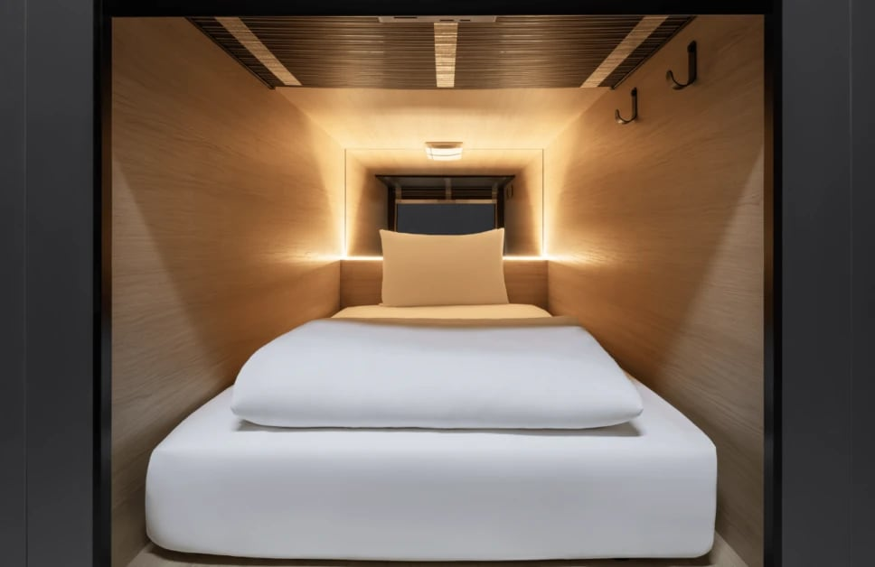
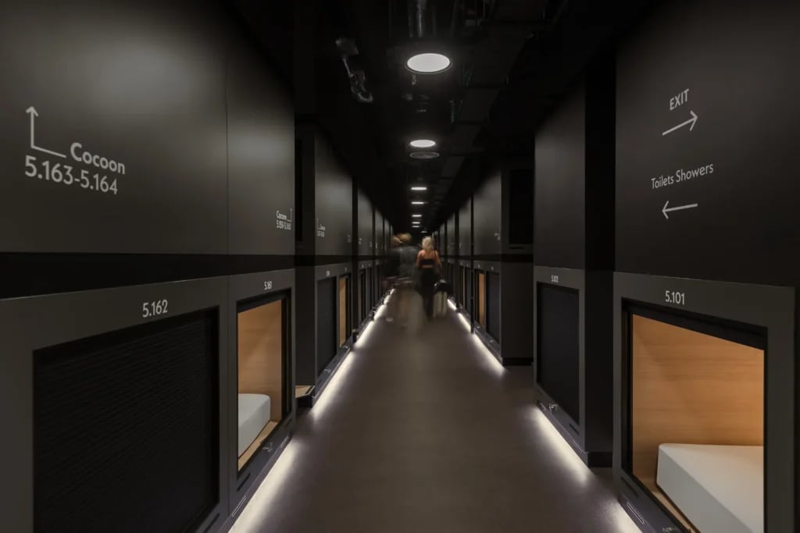
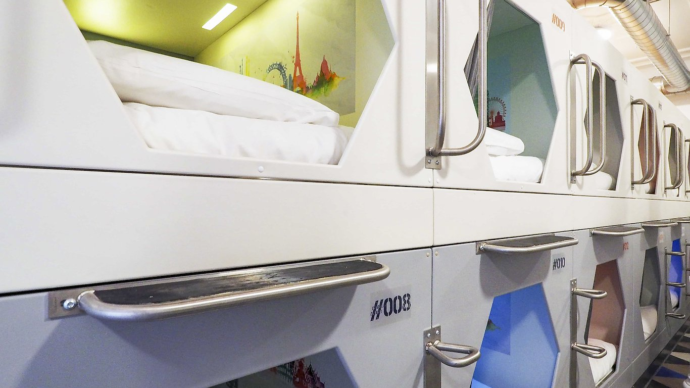
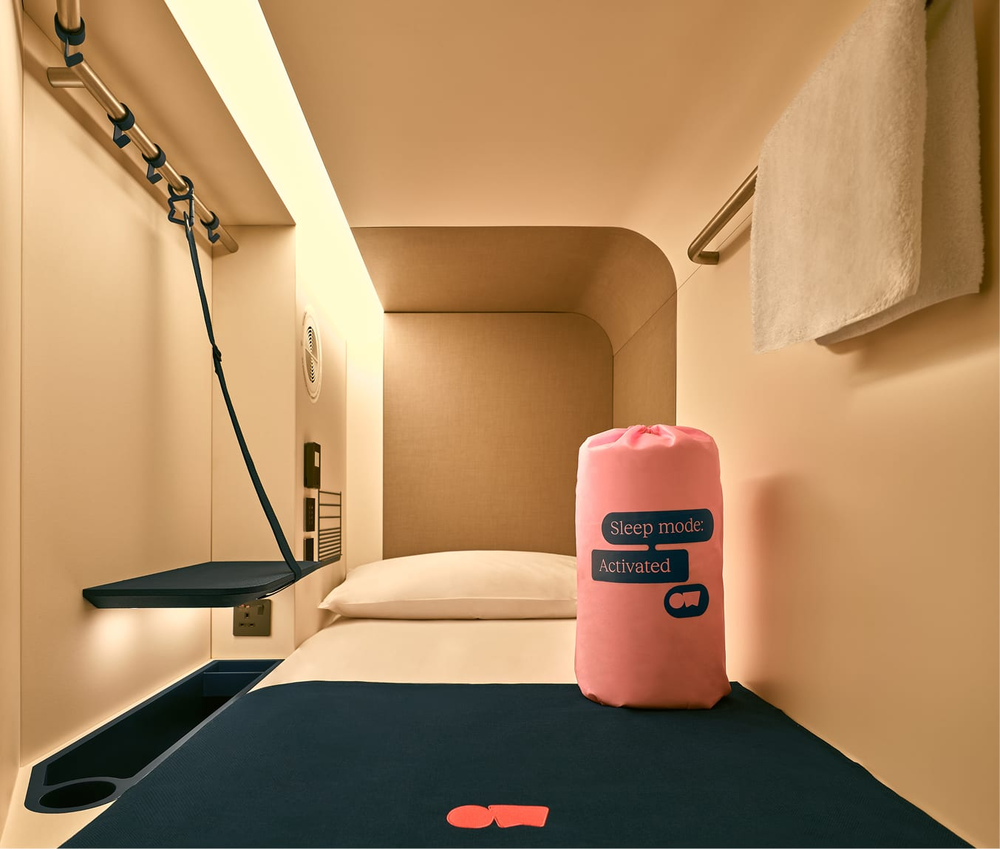

A capsule is a sealed berth roughly the size of a single bed, lined in oak, with a shutter you slide shut. You cannot stand up in it. It costs from about £33 a night one minute from Piccadilly Circus, which is the entire appeal.

London has **five of them**. Not the ten or eleven you will find on most lists — those pad the number with ordinary hostels, with small-room hotels, and in a couple of cases with places that closed or never opened here.

> 💡 **The Short Version:** **[Zedwell Capsule Piccadilly Circus](hotel:zedwell-piccadilly-capsule)** is the one to book — 965 berths one minute from the Tube, a 24-hour front desk, and the lowest price of the five. **Zedwell Leicester Place** is the same product at a quieter address. **[St Christopher's Village](hotel:st-christophers-village)** is the only one with a bar and a social side. **Otherwander Soho** is nicer and roughly double the price. **The GreenHouse** in Bethnal Green is tiny and has almost no staff.

> 🛏️ **Want the kitchen and the bar instead?** That is a [hostel](/articles/best-hostels-london/), and we compare fourteen of them on the things booking sites bury — which dorms are en-suite, which have real female-only rooms, and the age limits that will refuse you at the desk. Beds start around £11.

## What a night in one is actually like

*Inside a capsule. Hooks, a shelf, a shutter, and no room to stand up.*

**You check in at a desk and are given a floor and a berth number**, like a bunk on a sleeper train. The capsules run in stacked pairs down long corridors, upper and lower, and the floors are quiet by design — the lighting is low, the signage is discreet, and people talk in the voices they would use in a library.

**The berth itself is properly private.** Zedwell's are natural oak with a **solid sliding shutter**, not a curtain and not frosted glass, so once it is closed nobody can see in. There is a Hypnos mattress and Egyptian cotton sheets, filtered air, a light you can dim, a socket and a shelf. Leicester Place puts the size at **1.2 sq m** — long enough to lie flat, wide enough to roll over, and nothing else.

**It locks from the inside with a catch** — no padlock needed, and that is the lock that matters while you are asleep. Locking it from the *outside*, for when you go out for the day, is the part people get caught by at Zedwell: you supply the padlock, either your own **38mm** one or **£8 from a vending machine** on site. Otherwander and The GreenHouse work differently, using a smart lock and an access code respectively.

**Everything else is down the corridor.** Bathrooms are shared floors of individual shower stalls, each with its own changing space, which is a meaningful step up from a hostel's shower block. Zedwell's are rainfall showers with their own toiletries.

*The signage tells you which way the showers are, because they are not in your berth.*

**The honest part:** you sleep in it and you leave. There is no desk, no chair, nowhere to put a suitcase, and nowhere to sit up straight and read. If your plan involves any daytime in the room, this is the wrong booking.

## The facilities, and what is genuinely shared

| | Zedwell Capsule (both) | St Christopher's Village | Otherwander Soho | The GreenHouse |
| --- | --- | --- | --- | --- |
| **Front desk** | 24 hours | 24 hours | **None** — smart lock | **None** — access code |
| **Bathrooms** | Shared, private stalls | Shared | Shared, private stalls | Shared |
| **Bar / events** | No | **Yes, most nights** | No | No |
| **Kitchen** | No | Yes | No | No |
| **Luggage storage** | £15 a piece, non-refundable | Lockers | — | — |
| **Locking up** | Catch inside; padlock for outside, £8 or bring 38mm | Pod door | Smart lock | Access code |
| **Women-only** | Piccadilly Circus floor | Oasis, own bathrooms | No | No |
| **Breakfast** | No | £3 | No | No |
| **Check-in / out** | 3pm / 10am | 3pm / **11am** | 3pm / 10am | 2pm / **11am** |
| **Age** | 18+ | 18+ | 18+ | 18+ |

**None of the four dedicated capsule hotels has a self-catering kitchen**, which is the clearest practical difference from a hostel — and the reason St Christopher's Village is worth knowing about, because it is a hostel that happens to sell capsules and therefore has one. Zedwell allows food deliveries but they must be eaten in the common areas, never in the dormitories.

**The front desk line is the one to read twice.** Zedwell staffs reception around the clock. Otherwander and The GreenHouse have no front desk at all — you complete registration online, and a smart-lock code or access code arrives by email in the 24 hours before you arrive. That is fine when it works and a problem at midnight when it does not.

Powered by <a target="_blank" rel="sponsored" href="https://www.getyourguide.com/london-l57/">GetYourGuide</a>

## The rules that catch people out

**Zedwell does not give you a lock.** The capsule closes with a catch on the inside, so you are secure while you are in it — but if you want it locked while you are *out*, you have to supply that yourself. Either **bring a 38mm padlock** or **buy one on site for £8** from a vending machine. There is no third option and nothing is issued at check-in, so arriving without one means paying the £8 or leaving your capsule open all day. Otherwander and The GreenHouse do not work this way: their entry is a smart lock and an access code respectively.

**Luggage does not go in the capsule.** Hooks for a small backpack, room for a slim bag beside the mattress, nothing more. Zedwell's luggage room is **£15 per piece and non-refundable** — on two nights with one case, about a quarter of what the bed costs.

**Check-out is early, and buying more of the morning is priced.** Zedwell's capsules go at 10am; the other three give you until 11am. Only Zedwell publishes a tariff for moving either end:

| | Check-in | Check-out | Early check-in | Late check-out |
| --- | --- | --- | --- | --- |
| **Zedwell Capsule** (both) | 3pm | **10am** | £20 before noon, £10 noon–3pm | £20 to noon, £30 to 2pm |
| **St Christopher's Village** | 3pm–**2am** | 11am | Not offered | Not published |
| **Otherwander Soho** | 3pm–midnight | **10am** | Charged, price not published | Charged, price not published |
| **The GreenHouse** | 2pm–midnight | 11am | Not published | Not published |

**Stay past 2pm at Zedwell and you are charged a full night**, so a long afternoon costs more than the bed did. Otherwander's own listing says early check-in and late check-out "can be arranged for an extra charge" without saying what it is, so ask before you count on it.

**Arriving late is free everywhere, but only within the window.** Zedwell takes arrivals to midnight with no fee, Otherwander and The GreenHouse to midnight, and St Christopher's Village to 2am — the latest of the five, and useful after a show. **None of them does after-hours check-in beyond that**, which is the thing to check against a late flight.

**You can ask for a bottom bunk**, and for a high or low floor, when you book. Both are free and neither is guaranteed, and a bottom berth is worth having if you are carrying anything or dislike climbing.

**Everyone needs photo ID**, and all five are strictly 18 and over.

**Entire dormitories can be booked out.** Leicester Place's rooms run from 3 to 100 capsules, so a group can take a small one and have it to themselves — the cheapest way for six or eight people to sleep together in the West End.

## What it costs

Rates below are the cheapest and dearest we saw across five sampled dates: a quiet Sunday, a February midweek, an October Saturday, the second Saturday of December, and a Saturday in April.

| | Per night | What moves it |
| --- | --- | --- |
| **[Zedwell Capsule Piccadilly Circus](hotel:zedwell-piccadilly-capsule)** | **£33 – £68** | Cheapest of the five on every date |
| **Zedwell Capsule Piccadilly, female floor** | £40 – £75 | About £7 a night above the mixed floors |
| **[The GreenHouse Capsules](hotel:greenhouse-capsules)** | £42 – £53 | Barely moves all year |
| **[St Christopher's Village](hotel:st-christophers-village)** | £53 – £166 | A double capsule, so £27 a head for two |
| **[Otherwander Soho](hotel:otherwander-soho)** | £62 – £119 | Roughly double Zedwell throughout |
| **[Zedwell Leicester Place](hotel:zedwell-leicester-place-capsule)** | Book direct | Not sold through the booking sites |

Two things worth knowing about these numbers.

**Capsules hold their price when hotels do not.** A Zedwell berth roughly doubled between the cheapest and dearest night we sampled; a windowless private room at the same address tripled. So a capsule saves you most in December and least on a quiet Sunday — which is the opposite of how people tend to think about budget accommodation.

**The GreenHouse is the flattest price in London**, moving £11 across the whole year. That makes it dearer than Zone 1 in October and cheaper in December. Its Zone 2 address buys you nothing on a quiet night.

Powered by <a target="_blank" rel="sponsored" href="https://www.getyourguide.com/london-l57/">GetYourGuide</a>

## The five, and which to book

### Zedwell Capsule Piccadilly Circus — book this one

*A capsule corridor at Zedwell. The signage is how you find yours - there are no windows and every corridor looks alike.*

*£33–£68 · 965 capsules · London Pavilion, W1J 0DA · Piccadilly Circus 1 min · [check prices](hotel:zedwell-piccadilly-capsule)*

The largest capsule hotel in the UK, on five floors of the Grade II London Pavilion — the building that used to hold Ripley's Believe It or Not. **One minute from Piccadilly Circus station**, six from Leicester Square.

It wins on the things that matter here: **cheapest on every date we checked**, the only one with a 24-hour front desk, the only one with a women-only floor, and the only one where you can walk in and speak to a person at 2am. ECOsmart Silver accredited, if that matters to you.

The trade is atmosphere. Nine hundred and sixty-five berths in one building feels institutional in a way the smaller places do not, and it is the busiest address in London.

### Zedwell Leicester Place — the same thing, calmer

*222 capsules · 7 Leicester Place, WC2H 7BY · Leicester Square 2 min · [book direct](hotel:zedwell-leicester-place-capsule)*

Identical product, identical policies, a fifth of the size — and **above the Prince Charles Cinema**, which is a good address to wake up at. Dormitories run from 3 to 100 capsules, so this is the one for a group that wants a room of its own.

It is **not sold on Hotels.com or the other booking sites** — a search of the whole Zedwell brand there returns six properties and this is not one of them — so go direct. Expect something near the Piccadilly rate, since it is the same operator selling the same berth.

### St Christopher's Village — the only one with a bar

*£53–£166 a double capsule · 26 capsules in a 178-bed hostel · 161–165 Borough High Street, SE1 1HR · London Bridge 2 min*

*The capsules at St Christopher's Village. Moulded pods with a hinged door and a numbered hatch, stacked two high — and a different object entirely from a curtained hostel bunk.*

**The UK's first capsule hostel**, by their own claim, and the exception to everything else on this page. Twenty-six purpose-built capsules — mood lighting, a USB socket, a hinged door rather than a shutter — sit inside a full hostel of 178 beds across three floors, two minutes from London Bridge and Borough Market.

**That mix is the whole point.** Every other capsule property here is somewhere you sleep and leave. This one has **Belushi's bar downstairs** with events most nights, a roof terrace, a kitchen, lockers and a 24-hour desk, plus **Oasis**, a female-only floor with its own bathrooms and keycard. Breakfast is £3.

**The capsule is a room type here, not the building.** Most of the beds are ordinary dorms and private rooms, and on the dates we sampled the only capsule bookable was the **Private Double Capsule**, sleeping two, at £53 to £166. Check-out is **11am**, an hour later than Zedwell, and check-in runs to 2am — but there is no after-hours check-in beyond that, which matters on a late flight.

**Book it if** you want a capsule and a social life, which is a combination nowhere else in London offers.

### Otherwander Soho — the nicer one, at a Soho price

*£62–£119 · 563 pods over 6 floors · 92 Dean Street · Tottenham Court Road 3 min · [check prices](hotel:otherwander-soho)*

*An Otherwander single nest. A fold-down shelf, a hanging rail, a socket and a vent — better fitted out than the Zedwell berth, and about double the price.*

Sold as **"nests"**, upper and lower, in singles and doubles — and the double nest genuinely sleeps two, which none of the others offer. Air conditioning, lighting and a socket in every pod, three minutes from the Elizabeth line.

**There is no front desk.** You register online, a smart-lock code arrives before you travel, and a virtual desk handles anything else. Reviewers report hearing corridor conversation and neighbouring pods despite the soundproofing, and taller guests find the upper nests awkward.

At roughly double the Zedwell rate all year, a single nest here can cost more than a private windowless room at Tottenham Court Road. What you are buying is Dean Street.

### The GreenHouse Capsules — small, east, and not the bargain it looks

*£42–£53 · 8 units · 93 Roman Road, E2 0QN · Bethnal Green 7 min · [check prices](hotel:greenhouse-capsules)*

An eco-conscious capsule hostel on a working East London market street, a short walk from Victoria Park and about ten minutes from Brick Lane. **Check-out is 11am**, an hour later than the others, and the Wi-Fi is the fastest of the five.

It is very small — eight units — with no front desk and entry by access code through a private entrance. Rated **7.3 out of 10 across 41 guest reviews**, the most modest score here. The solar panels and sustainable materials are the operator's own framing and we have not independently verified them.

The problem is arithmetic: **£42 in Zone 2 against £33 in Zone 1** on a quiet night. It earns its place in December, when Zedwell climbs and this does not.

Powered by <a target="_blank" rel="sponsored" href="https://www.getyourguide.com/london-l57/">GetYourGuide</a>

## What gets miscalled a capsule hotel

Most published lists of London capsule hotels are wrong, and it is worth knowing what they are counting.

**Hostels with curtained bunks** — Clink78 and Clink261, Wombat's, Safestay, The Dictionary, and most of the St Christopher's sites — are hostels. A curtained or panelled bunk in a six-bed dorm is a better bunk, not a capsule. They do have kitchens, bars and events, which the dedicated capsule hotels do not, so the trade is genuine either way.

**Clink261 is the closest near-miss**, and worth naming because anyone searching for a capsule will land on it. Its **POD beds** — their word, in a 14-bed mixed dorm — have ventilation, a reading light, USB and a socket, which is better fitted than a Zedwell berth. But they close with a **curtain** rather than a door or a shutter, and that is the line: if it draws rather than latches, it is a bunk.

**One exception, and it is a real one.** St Christopher's *Village* at London Bridge is not the same as the other St Christopher's sites: it has 26 purpose-built capsules and bills itself as the UK's first capsule hostel. It is in this guide on merit.

**Compact-room hotels** — YOTEL, Point A — are hotels. YOTEL's smallest London room is 10.5 sq m with its own rainfall shower. That is a small room, not a berth.

**Some do not exist here.** Qbic no longer trades in London, CityHub has no London site, and Snoozebox is long gone. LyLo, the Australian pod chain reported as London-bound, still lists no UK location of any kind.

## Capsule, hostel or a windowless room?

| | Capsule | Hostel dorm | Windowless room |
| --- | --- | --- | --- |
| **Privacy** | Solid shutter, locks | Curtain at best | Own door |
| **Stand up?** | No | Yes | Yes |
| **Bathroom** | Shared, private stalls | Shared | En-suite |
| **Kitchen** | None | Usually | None |
| **Sociable?** | Deliberately not | Yes | No |
| **Children** | No, 18+ | Some | Yes |

**Book a capsule if** you are alone, you want a Zone 1 address for hostel money, and you genuinely only need somewhere to sleep. **Book a hostel if** you want a kitchen, a bar, or to meet people — our [best hostels in London guide](/articles/best-hostels-london/) compares fourteen of them, including the one where every dorm is en-suite and the one with a women's floor that has its own bathrooms. **Book a windowless room if** there are two or more of you — the second guest adds about £5 a night, which is the best-value thing in this whole category.

If you are not staying the night at all — a long layover, a late flight — a [day room](/articles/day-rooms-london/) is cheaper than any of this and you can book one for the afternoon.

Staying more than a few nights changes the question entirely — at that point an [aparthotel](/articles/aparthotels-london/) with a kitchen beats both, and we have compared twenty-six of them.

Zedwell confusingly calls the berth in its capsule hotels a "Capsule Cocoon" and the rooms in its five hotels "Cocoons" too, so the word does not tell them apart. **"Capsule" in the property name does.** Our [windowless hotel rooms guide](/articles/windowless-hotel-rooms-london/) covers the room side in full.

*Prices sampled on Hotels.com for one adult across five dates on 7 September 2026. Capsule sizes, fees, policies and facilities from each operator's own site and listing on the same date. Rates change nightly — always check your own dates.*
