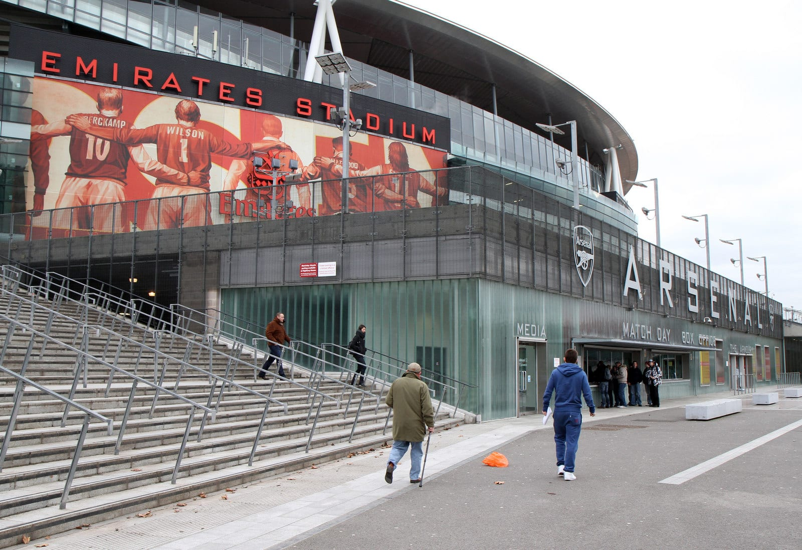
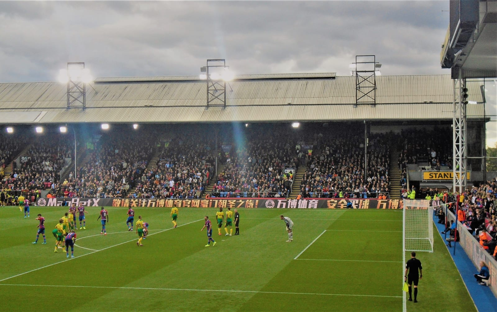
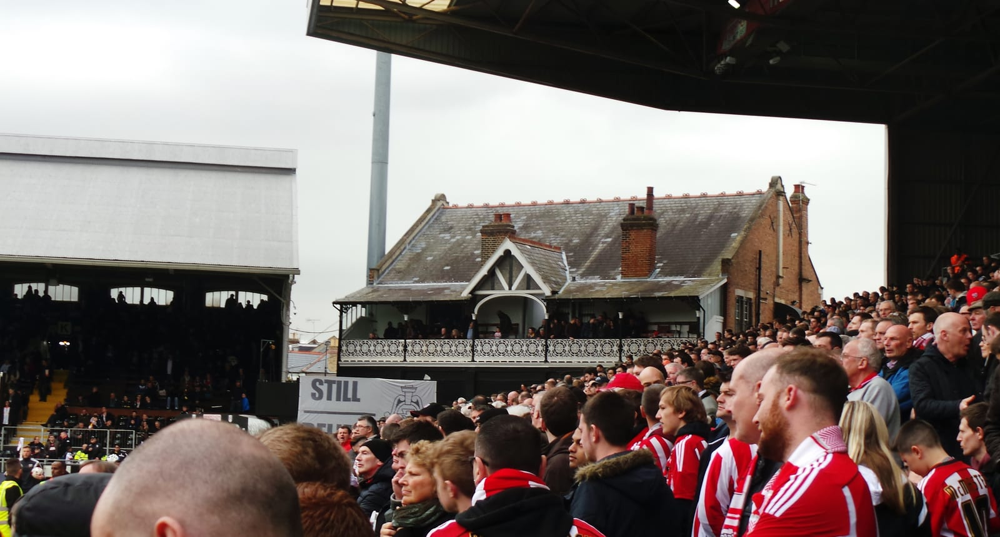
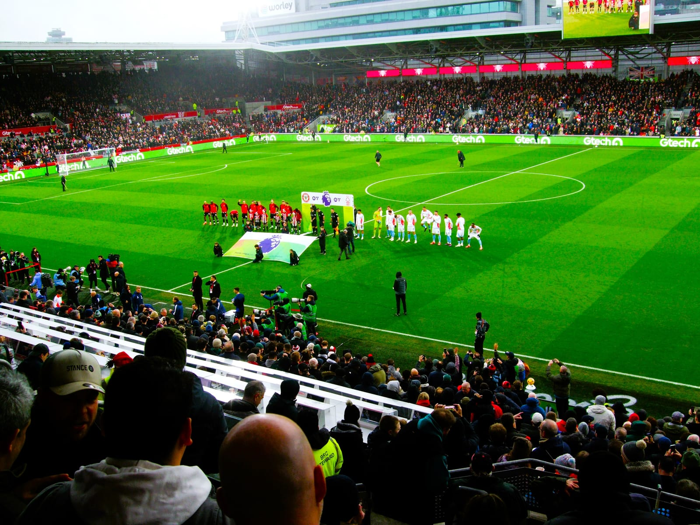

A visitor who wants to see a Premier League match in London usually starts in the same place: the club's website, looking for a ticket. There is no ticket. For five of the six London clubs in the division, the home end is sold out to season-ticket holders and paying members weeks before anyone else gets a look, and the sale never reaches the public at all.

This is not an accident of demand. It is how the clubs have deliberately built their ticketing, and once you understand the mechanism there are four or five real routes in — none of them involving the man outside the station.

> 💡 **The Short Version:** **You almost certainly cannot just buy a ticket.** Home league tickets at **Arsenal, Chelsea, Tottenham, Crystal Palace and Brentford** are sold to paying members first and rarely get past them. So buy the membership: **Crystal Palace Adult £25**, **Brentford Bees Overseas £30**, **Arsenal Red £38**, **Tottenham One Hotspur from £45**, **Chelsea CFC Blue £45**, **Fulham £50**. Then enter that club's ballot or sale window, usually **four to eight weeks** before the match, and expect to pay **£40–£145** for the seat itself. **Fulham is the one club that reaches a real general sale.** **Brentford holds back 100 tickets per home game** for overseas members alone. If a match is sold out, the only lawful resale is the club's **own exchange** — everything else is a criminal offence to sell under **section 166 of the Criminal Justice and Public Order Act 1994**, and the ticket will not scan. **Hospitality** always works and needs no membership: **from £285 plus VAT** at Selhurst Park. And **Championship and League One London clubs sell to anyone** — Charlton from **£20**, Bromley from **£25**.

---

> 🧭 **Plan the rest of it:** [Where to stay in London](/articles/best-areas-to-stay-in-london/) · [Getting around London](/articles/getting-around-london-transport-guide/) · [Transport costs and fares](/articles/london-public-transport-costs-and-fares/)

## Which London clubs are in the Premier League in 2026/27

Six: **Arsenal, Brentford, Chelsea, Crystal Palace, Fulham and Tottenham Hotspur**.

**West Ham United are not.** They were relegated at the end of 2025/26 and play in the Championship this season, alongside Queens Park Rangers, Charlton Athletic and Millwall. If you came here to see West Ham at London Stadium, the good news is that a Championship ticket is far easier to buy — see [the alternatives below](#where-you-can-just-buy-a-ticket).

---

## Why general sale barely exists

Three things have to happen before a seat can be sold to you.

**Season-ticket holders take most of the ground.** They have a named seat for every home league match, and the club sells nothing until they have either used it or released it.

**Members take what is left, in a strict order of priority.** Every London club runs a paid membership scheme whose real product is not a scarf and a newsletter but a place in the ticket queue. Higher tiers get in first. At Arsenal, the Silver ballot is drawn before the Red ballot. At Chelsea, True Blue+ and True Blue apply in phase one and CFC Blue only in phase two. At Crystal Palace, Gold members get a 72-hour head start on everyone else.

**By then it is usually gone.** Arsenal put **273,000 tickets** into member ballots across the 2025/26 season, an average of more than **9,100 a match**, and reports that every competitive men's home fixture sold out to paid members. Tottenham's own FAQ says home tickets are "unlikely to get to General Sale". Brentford is blunter: a membership is, apart from a season ticket, "the only way to purchase tickets for Premier League matches".

> ⚠️ **A membership does not buy a ticket. It buys a chance at one.** Every scheme on this page is an access product, and the club says so. At Arsenal you are entering a ballot; at Chelsea a random selection algorithm; at Brentford a points-ranked queue. Paying £38 for an Arsenal Red Membership gets you into the draw for every home game and guarantees you nothing. Arsenal does report that **105,000 members who entered at least one ballot in 2025/26 were successful at least once**, up 11 per cent on the previous season.

### What changed for 2026/27

New Premier League requirements mean **every seat sold must be registered to the person who will use it**, with that individual's name and contact details held by the club. Both Fulham and Crystal Palace have published the same change. In practice: buying four tickets means assigning four named accounts at the point of purchase, and a ticket that has not been correctly assigned may not scan. At Crystal Palace a guest ticket that has not been transferred **24 hours before kick-off** is deactivated, and the holder has to go to the box office with the purchaser's name, address and client reference number.

---

## The six clubs at a glance

| Club | Cheapest membership with ticket access | When home tickets are released | Realistic chance without a membership |
| --- | --- | --- | --- |
| **Arsenal** | **Red, £38** (Silver £59, capped) | Ballot opens ~7 weeks out, closes after 3 days | None. Home tickets are balloted "exclusively for Arsenal Members" |
| **Chelsea** | **CFC Blue, £45** (True Blue £60, True Blue+ £80) | Application window opens **~42 days** before each fixture | Effectively none for the league. Domestic cup home ties have a general-sale phase |
| **Tottenham** | **One Hotspur, from £45** (One Hotspur+ from £60) | Members' on-sale, five home games at a time | Very low. The club says home games are "unlikely to get to General Sale" |
| **Crystal Palace** | **Adult, £25** (Gold £60, International from £35) | Gold first, all members three days later, guest tickets a week after that | Only as a member's guest in the third sale phase, or via hospitality |
| **Fulham** | **Membership, £50** (Membership+ £65) | Members, then season-ticket holders, then booking history, then **general sale** | Real. The Crystal Palace fixture on 5 September 2026 reached general sale |
| **Brentford** | **Bees Overseas, £30** (UK adult £45) | Overseas ballot closes 72 hours after kick-off is confirmed | None, but the overseas ballot needs no loyalty points |

---

## Arsenal

**Emirates Stadium, N5.** Arsenal sells home tickets by ballot, and the ballot is open only to members. There is no public sale of any kind.

| Membership | Price for 2026/27 | What it gets you |
| --- | --- | --- |
| Digital | Free | Content only — explicitly no ticketing rights |
| Team JGs (4–11) and Young Guns (12–16) | **£15 lite, £25 full** | Ballot entry for every home match, plus Ticket Exchange |
| Cannon (17–18) | **£32** | Ballot entry for every home match, plus Ticket Exchange |
| **Red** | **£38** | The standard adult tier: ballot entry and Ticket Exchange |
| **Silver** | **£59** | Same, but balloted *before* Red. Numbers are capped |

Prices are from [Arsenal's own membership guidance](https://help.arsenal.com/support/solutions/articles/101000579615-membership-overview), and all tiers auto-renew.

> 💡 **Silver is not something you can simply buy.** The number of Silver memberships is capped and a place only comes up when an existing Silver member does not renew. Red members join the waiting list automatically, strictly in order of purchase — and if you let your Red membership lapse, you lose your place. Buy Red now and Silver is a plan for a future season.

**How the ballot runs.** Arsenal publishes a ticket information page for every fixture with the exact dates. For the Category A match against Chelsea on 6 September 2026, the ballot opened at **noon on Friday 17 July** and closed at **noon on Monday 20 July** — about seven weeks out, open for three days. The Disability Access ballot was drawn first, Silver members were charged around 23 July and Red members around 28 July. The ballot price range for that fixture was **£78.00 to £145.50**.

You can apply alone or as a group of up to four members, and **applying early does not improve your odds**. You may pick up to two preferred price bands.

**If you lose the ballot**, the [Ticket Exchange](https://www.arsenal.com/ticket-exchange-aKOq49R5lTrR) opens to you — unsuccessful Silver members first, then all unsuccessful members. Arsenal recorded more than **156,000 Ticket Exchange purchases** in 2025/26, roughly 5,200 a game, so this is a genuine second route rather than a token one. It closes three hours before kick-off. Red and Silver members cannot transfer a ticket to anyone; if they cannot attend, the Exchange is the only legitimate option, and Arsenal's own help centre notes that selling outside it "is also illegal under the Criminal Justice and Public Order Act 1994".

**New this season:** licensed standing in the Clock End lower tier, extending to the North Bank lower tier from 2027/28, by which point around 13,500 supporters will be in standing areas.

---

## Chelsea

**Stamford Bridge, SW6.** Chelsea runs an application window rather than a straight sale, and picks winners with a random selection algorithm.

| Membership | Price for 2026/27 | Where it puts you in the queue |
| --- | --- | --- |
| Ticket Forwarding | **£15** | New for 2026/27. Lets you *receive* a forwarded ticket; no application rights |
| Junior Blue (under-16s) | **£35** | Phase one |
| **CFC Blue** | **£45** | Phase two |
| **True Blue** | **£60** | Phase one |
| **True Blue+** | **£80** | Phase one, plus the season-ticket waiting list |

**The mechanism.** Chelsea's [ticketing policy](https://www.chelseafc.com/en/ticketing-policy-men) says the application process for a Premier League home match "will generally open approximately 42 days before each fixture". Phase one is True Blue+, True Blue and Junior Blue, one ticket per person. Phase two adds CFC Blue and those who missed out first time. Further phases may follow if seats remain. For league matches there is no listed general-sale phase at all — that only appears in the domestic cup section, where any remaining tickets go on sale to everyone with a limit of four per person.

Applying early does not help, a **1p pre-authorisation** is put on your card to validate it, and results arrive by email within four working days of the window closing.

**What it costs.** These are Chelsea's published 2026/27 adult member prices for Category AA, its top band:

| Area | Adult member | Under-20 / 66+ | Under-23 |
| --- | --- | --- | --- |
| East Upper, West Lower | **£78** | £39 | £59 |
| East Lower South, Matthew Harding Upper, Shed Upper | £71 | £36 | £53 |
| Matthew Harding Lower, Shed Lower | £66 | — | £49.50 |
| East Lower North Family Centre | £52 | £26 | £39 |
| **Restricted view, Matthew Harding Lower** | **£27** | — | — |

**General-sale tickets cost £5 more than member prices in every category**, which tells you how little the club expects to sell that way.

**Loyalty points** now accrue only for actually attending — your ticket has to be scanned at the turnstile — and no longer for buying. That includes tickets bought on the exchange or received by forwarding.

---

## Tottenham Hotspur

**Tottenham Hotspur Stadium, N17.** Spurs answer the question directly on their own site: home tickets are "unlikely to get to General Sale and are often only available for our One Hotspur Members".

| Membership | Price for 2026/27 | What the extra buys |
| --- | --- | --- |
| **Adult One Hotspur** | **from £45** | Ticket on-sale access, Ticket Exchange, £15 shop voucher |
| **Adult One Hotspur+** | **from £60** | An additional 24-hour ticket access window and a season-ticket waiting list place |
| Junior One Hotspur | from £20 | Ticket on-sale access |
| Junior One Hotspur+ | from £25 | The extra window, plus free entry to women's matches |

All 2026/27 memberships expire on **31 May 2027** whenever you buy them, and **a member can buy only one ticket per membership per fixture** — so two people need two memberships.

**[Ticket Exchange](https://www.tottenhamhotspur.com/tickets/ticket-exchange/)** is the club's resale platform, and Spurs describe it as "the only authorised way of purchasing a General Admission seat for a sold out Premier League game at Tottenham Hotspur Stadium". Season-ticket holders and premium members list their seat at **face value plus a small administration fee**, up to **four hours before kick-off**, and seats appear continually right up to matchday. What you buy there is strictly non-transferable and non-refundable.

Occasionally Spurs open exchange listings wider: a **Guest Sale** lets season-ticket holders and members buy extra seats for friends and family, and a **General Sale** opens them to everybody. Neither is scheduled in advance.

Getting there is its own problem — there is no public car park at the ground. See [how to get to Tottenham Hotspur Stadium](/articles/tottenham-hotspur-stadium-travel-guide/).

---

## Crystal Palace

**Selhurst Park, SE25.** Palace is the most tourist-friendly of the five member-only clubs, because its cheapest tier is £25 and it sells a membership designed for exactly this situation.

| Membership | Price for 2026/27 | What it gets you |
| --- | --- | --- |
| **Adult** or **Junior** | **£25** | Entry-level access to buy home Premier League tickets subject to availability, 100 loyalty points, and Ticket Resale |
| **Gold** or **Junior Gold** | **£60** | A **72-hour priority window** on home tickets, plus away ballots |
| **International** | **from £35** digital, welcome pack £10 more | Priority access for **one** home match before general sale |
| Season Ticket+ upgrade | £50 | For existing season-ticket holders |

The [International Membership](https://www.cpfc.co.uk/2627-international-membership) is written for a visitor planning a single trip: it buys early access for one match of your choosing and comes with a Palace TV+ subscription and a discount on international shipping over £100.

**The sale phases, with real dates.** For the home match against Nottingham Forest on Sunday 11 October 2026, Palace published this sequence — online from 10:00, by other methods from 14:00:

| Phase | Date | Who can buy |
| --- | --- | --- |
| 1 | Mon 14 September | Gold Members, Junior Gold Members, Season Ticket+ holders |
| 2 | Thu 17 September | Adult Members, Junior Members, **International Members** |
| 3 | Tue 22 September | **Guest tickets** for all season-ticket holders and members — the guest does **not** need a membership |
| 4 | Mon 5 October | **Ticket Resale** opens to Gold and Junior Gold Members |
| 5 | Tue 6 October | Ticket Resale opens to Adult, Junior and International Members |

Phase three is the one worth knowing about: a member can buy a guest ticket for somebody with no membership at all, provided that person has a free Palace ticketing account and is on the member's friends-and-family list.

**Ticket Resale** works differently from 2026/27. Season-ticket holders can list their seat from the moment a match goes on sale, but those seats are held back until the fixed resale date above — so there is a known time to be at your keyboard rather than a website to refresh.

---

## Fulham

**Craven Cottage, SW6.** The one London club where a visitor with no connection to the club can reasonably expect to buy a ticket.

Fulham's [2026/27 membership](https://www.fulhamfc.com/tickets-and-hospitality/membership) is **£50 for adults and £30 for juniors**, with a limited-run Membership+ at £65 and £45 that adds a £20 retail voucher and a gift.

**The order of sale**, in the club's own words, is members first, then additional seats for season-ticket holders, then supporters with a booking history or general sale. For the 20 September 2026 home match against Manchester United that ran: members from 9.30am on **1 September**, season-ticket holders' extra seats from **3 September**, booking history from **5 September**.

Two details decide whether this works for you:

- **Booking history** means you have bought a Fulham men's first-team ticket in the **past five years** — and it does not count if the only ticket you ever bought was against the same opponent.
- **A membership bought too late is no use for the next match.** For that Manchester United window, the membership had to be in place by **noon on 28 August**.

And general sale is real, not theoretical: the London derby against Crystal Palace on 5 September 2026 went on **General Sale with up to four tickets per person**, with no general sale in the Putney End.

Fulham grades fixtures into five price categories. A concrete figure from the club's own ticketing update: a Category B junior ticket in block H4 of the Hammersmith End is **£36**, and the adult equivalent in the same seat is **£61**. Members get **£10 off in The Riverside and £5 off elsewhere** on one ticket per fixture, and restricted-view seats are £2 cheaper. The full grid is on the [2026/27 match ticket prices page](https://www.fulhamfc.com/tickets-and-hospitality/match-tickets/26-27-match-ticket-prices).

---

## Brentford

**Gtech Community Stadium, TW8.** The only London club that reserves a fixed block of seats for supporters who live abroad, and the one that spells out exactly how its queue works.

**My Bees memberships for 2026/27**, with prices frozen on last season: **Adult £45**, 18–24 **£30**, Bee Team (3–10) **£20**, Swarm (11–17) **£20**, Babees (2 and under) £10, and **[Bees Overseas £30](https://www.brentfordfc.com/en/memberships-2026-27)**.

**The Bees Overseas ballot is the single clearest route into a Premier League match that exists in London.** For every home Premier League fixture, **100 tickets are set aside** for this ballot alone. There are no loyalty points involved, you can enter as many ballots as you like, and you are only charged if you win.

| Fixture category | Adult | 18–24 and senior | Junior |
| --- | --- | --- | --- |
| **A\*** | **£50.50** | £40.40 | £15.15 |
| **A** | £45.45 | £35.35 | £15.15 |
| **B** | £40.40 | £30.30 | £10.10 |

The timing is the part to plan around. Roughly **four to six weeks** before the match, the date and kick-off time are confirmed after the broadcasters make their picks — and the ballot then **closes 72 hours later**. Enter early and be ready for the fixture to move across the weekend.

> ⚠️ **Bees Overseas ballot tickets are not digital.** They must be collected in person from the Brentford FC Box Office on matchday, against valid photo ID. Build that into your arrival time rather than turning up ten minutes before kick-off.

**For everyone else, Brentford runs on Ticket Access Points.** TAPs are earned by attending matches and scanning in at the turnstile, on a rolling balance covering the previous four seasons plus the current one. For the highest-demand Category A\* fixtures, window one is members with 300+ TAPs and window two is 100+. Category A opens at 30+ TAPs, reduced from a higher threshold for 2026/27 to widen access. Category B is open to all members. A new member starts on zero, which is why the overseas ballot matters. The full system is set out in [Brentford's ticketing guide](https://www.brentfordfc.com/en/ticketing-guide).

The **Ticket Exchange** opens three weeks before each fixture, and Bees Overseas members can use it — but it carries the same TAPs thresholds, so it works for Category B games and not for the big ones.

---

## Ticket touts: why football is different

Football is not like theatre, or a concert, or Wimbledon. Unauthorised resale here is not a breach of the seller's terms and conditions. It is a crime.

> ⚠️ **Reselling a football ticket without the club's written authorisation is a criminal offence.** Section 166 of the [Criminal Justice and Public Order Act 1994](https://www.legislation.gov.uk/ukpga/1994/33/section/166) makes it an offence for an "unauthorised person" to sell a ticket for a designated football match, or otherwise to dispose of one to another person. You are unauthorised unless the match organisers have authorised you **in writing**. Conviction on summary trial carries a fine at level 5 on the standard scale — and since 12 March 2015 that cap has been removed, so the fine is unlimited.

The definition of "sell" is deliberately wide. Under section 166(2)(aa) it covers offering a ticket for sale, exposing it for sale, making it available for sale by somebody else, **advertising that a ticket is available for purchase**, and giving a ticket to a person who pays for some other goods or service. That last limb is what catches the "free match ticket with your hotel package" offers.

Which matches are covered? The [Ticket Touting (Designation of Football Matches) Order 2007](https://www.legislation.gov.uk/uksi/2007/790/made) designates any association football match played in England and Wales involving a club that is a member of the Premier League, the Football League, the Football Conference or the League of Wales. Every fixture on this page is inside it, from Arsenal down to Bromley.

**What this means in practice:**

- **No general resale marketplace can lawfully sell you a Premier League ticket.** Not a well-known one, not an obscure one, and not one with a padlock icon and a money-back guarantee.
- **Buying is not itself the offence**, but that is cold comfort. The ticket is void, it will not scan, you will be refused entry and the club will not refund you. Chelsea states plainly that tickets from any source other than the club or an authorised partner "will be confiscated and entry will be refused".
- **The same digital ticket can be sold to several people.** A barcode scans once. The second and third buyers stand outside.
- **Clubs act on this at scale.** Arsenal says it has cancelled almost **74,000 accounts** since 2022/23 for trying to obtain tickets through unauthorised means, banned more than **19,000** in 2025/26 alone, and removed over **45,000 suspicious ballot entries**.

The offence also reaches the street: section 166(5) extends a constable's power of search on arrest to any vehicle reasonably believed to have been used in connection with it.

---

## The official resale platforms

Every London club runs its own exchange, and this is the legitimate route into a sold-out match. Seats change hands at face value — the clubs set the price, not the seller.

| Club | Platform | Who can buy | How it works |
| --- | --- | --- | --- |
| **Arsenal** | Ticket Exchange | Members, unsuccessful Silver balloters first | Closes three hours before kick-off; more than 156,000 purchases in 2025/26 |
| **Chelsea** | Ticket exchange | Members, with a priority window for unsuccessful applicants who met the loyalty criteria | Closes three hours before kick-off; True Blue+, True Blue and CFC Blue can also list |
| **Tottenham** | Ticket Exchange | One Hotspur Members, or everyone if the game goes to General Sale | Face value plus an admin fee; holders can list up to four hours before kick-off |
| **Crystal Palace** | Ticket Resale | Gold Members first, then all members, on a fixed published date | Season-ticket holders list from the moment a match goes on sale; seats held back until the resale date |
| **Fulham** | Ticket Exchange | Members and supporters, depending on the phase reached | Runs alongside the ordinary sale sequence |
| **Brentford** | Ticket Exchange | Members meeting the TAPs threshold, including Bees Overseas | Opens three weeks before each fixture; 100+ TAPs for Category A\*, 30+ for Category A, none for B |

> 💡 **Two different shapes of opportunity.** Crystal Palace changed its system for 2026/27 so that listings accumulate from the day a match goes on sale and are all released at one published date and time — you set an alarm. Everywhere else, seats appear as holders decide they cannot go, which Tottenham describes as happening "continually" right up to matchday, so you check repeatedly instead.

---

## Hospitality: the route that is always open

If you will pay for it, hospitality solves every problem on this page at once. There is no ballot, no membership requirement and no loyalty points, you choose the fixture, and you know months in advance that you are going.

Chelsea states it explicitly: **you are not required to be a member or season-ticket holder** to buy its non-Westview [Club Chelsea](https://www.chelseafc.com/en/club-chelsea) packages.

Crystal Palace publishes a standing matchday rate card, which gives you the shape of the market. All are **per person and exclude VAT** — add 20 per cent:

| Package | Price, ex VAT | What you get |
| --- | --- | --- |
| **Legends Restaurant** | **£285** | Goal-line view, three-course buffet, half-time and full-time refreshments, drinks included |
| Speroni's Restaurant | £375 | Directors Box seat over the halfway line, curated pre-match dining, inclusive drinks |
| The 1861 Lounge | £410 | Main Stand seat, showpiece bar with a dedicated mixologist, gourmet menus, all drinks |
| **The 2010 Club** | **£425** | The club's smallest room, sparkling reception, table service, set menu |
| **Executive Box** | **£3,750** | A private ten or twenty-person box |

Arsenal, Chelsea, Tottenham, Fulham and Brentford price hospitality fixture by fixture rather than from a fixed card. Every club on this page grades its matches into demand categories, and hospitality tracks those grades, so the same lounge costs more against a title contender than against a newly promoted side. Brentford gives Bees Overseas members **10 per cent off selected hospitality**.

> ⚠️ **Buy hospitality from the club or an agent the club names.** Arsenal publishes a list of authorised hospitality agents for overseas buyers and a checker tool for verifying whether a website is authorised. An unauthorised "hospitality package" is an unauthorised ticket with a lunch attached, and section 166 catches it the moment a ticket is bundled with goods or services.

---

## Where you can just buy a ticket

Step outside the Premier League and the whole apparatus disappears. These clubs want your money on the day.

### The Championship

London has four clubs in the second tier in 2026/27: **West Ham United** at London Stadium, **Queens Park Rangers** at Loftus Road, **Charlton Athletic** at The Valley and **Millwall** at The Den.

Charlton publishes the clearest numbers. A **bronze-category** match at The Valley starts at **£20 for adults and £5 for under-12s**, with a family bundle from **£35 for two adults and two under-12s**. More to the point, the club publishes a **general sale date for every home fixture** — for the Lincoln City match, season-ticket holders get an additional-ticket window on 12 October 2026 and general sale opens to all supporters the next day.

West Ham's relegation makes London Stadium a much easier ticket than it was last season. The journey out there is covered in [how to get to London Stadium](/articles/london-stadium-travel-guide/).

### League One and League Two

**AFC Wimbledon** (Plough Lane, SW17), **Leyton Orient** (Brisbane Road, E10) and **Bromley** (Hayes Lane, BR2) are in League One; **Barnet** (The Hive, HA8) are in League Two.

Bromley's published prices are the benchmark for how cheap this gets: **£25 for an adult in advance and £27 on the day**, £19 and £21 for over-65s, **£10 and £12 for under-18s**, and **£7 and £9 for an under-12 with a paying adult**. Prices rise automatically at midnight the night before, so buy ahead.

### Women's football

Top-flight football at Stamford Bridge and the Emirates, from £12, with tickets anyone can buy.

**Chelsea** play all **13 Women's Super League home games at Stamford Bridge** in 2026/27. Each match is graded A, B or C and sold in three windows — early bird, general sale and last chance, with last-chance pricing starting around 48 hours before kick-off:

| Category | Early bird, Tier 1 / Tier 2 | General sale | Last chance |
| --- | --- | --- | --- |
| **A** | £25 / £18 | £27.50 / £20 | £29 / £22 |
| **B** | £21 / £14 | £23 / £16 | — |
| **C** | **£12** | — | — |

Concessions run at 20 per cent off for over-66s and under-23s and **50 per cent off for under-16s**. Tier 1 is the West and East Lower stands; Tier 2 is the rest of the ground. Cup matches move to AFC Wimbledon's Cherry Red Records Stadium.

**Arsenal Women** play at the Emirates and sell in four phases: early bird, general sale, last chance, and **on the day, from midnight right through to half-time**, with a £1.65 booking fee per ticket. No membership is needed.

### Cup ties

The League Cup and the FA Cup are where the member-only wall softens. Chelsea's ticketing policy sets out five phases for a domestic cup home match, ending with "any remaining Match Tickets will go on general sale", maximum four per person — a phase that does not exist for its Premier League games. The pricing moves too: Chelsea graded its home League Cup tie against Luton Town at Category G, against Category AA for a Premier League Sunday.

Midweek early rounds against lower-league opposition are the ones to watch for.

---

## On the day

**Bring photo ID.** With every seat now registered to a named individual, the mismatch between the name on the ticket and the person at the turnstile is the thing that gets people stopped. Chelsea may require photographic identification for any general-sale ticket. Brentford's overseas ballot tickets are only released over the box office counter against ID.

**Make sure the ticket is actually assigned to you.** If a member or a season-ticket holder bought it, it has to be transferred to your account before the deadline — 24 hours before kick-off at Crystal Palace, three hours at Chelsea and Arsenal. An unassigned ticket does not scan.

**Do not buy into the away end.** Home and away supporters are segregated and clubs police it. Chelsea's policy states that general-sale tickets "WILL NOT be sold to non-Members who appear to be supporters of the opposition club", and every club reserves the right to eject a visiting supporter found in a home area. If you have no allegiance, sit in the home end and behave accordingly.

**Children need an adult next to them.** Chelsea requires anyone under 16 to attend with and sit next to someone aged 18 or over, and will cancel bookings that break it. Arsenal requires children aged 13 and under to be seated within reaching distance of an adult aged 18 or over, and cancels and refunds bookings that do not.

**Alcohol cannot be drunk in sight of the pitch.** This is law, not club policy: under [section 2 of the Sporting Events (Control of Alcohol etc.) Act 1985](https://www.legislation.gov.uk/ukpga/1985/57/section/2) it is an offence to have alcohol in your possession in any area of a designated sports ground from which the match can be directly viewed, or to try to enter the ground drunk. Concourse bars serve up to kick-off and at half-time; you drink there and go back to your seat empty-handed.

**Leave time for the journey and the queue.** None of the London grounds expects you to drive — Tottenham has no public car park at all, and London Stadium has 229 spaces for a 60,000-plus crowd. Tottenham's own regional coach service is timed to arrive **two hours before kick-off**, which is a reasonable benchmark for any of them.

- 🚇 **[How to get to Tottenham Hotspur Stadium](/articles/tottenham-hotspur-stadium-travel-guide/)** — four stations, the £160 parking penalty and getting home
- 🏟️ **[How to get to London Stadium](/articles/london-stadium-travel-guide/)** — Stratford's seven services, and the two stations that skip Westfield
- 🏴 **[Wembley Stadium and Arena](/articles/wembley-stadium-arena-guide/)** — for cup finals and England internationals
- 🏈 **[NFL London Games](/articles/nfl-london-games/)** — the other reason those stadiums sell out

---

## If you only remember one thing

The Premier League in London is not a ticket you buy. It is a queue you join, and the entry fee for the queue is £25 to £50 depending on the club. Join it eight weeks before you fly, not eight days.

And if the dates do not work, the football does not stop at the top division. A Saturday afternoon at The Valley or Hayes Lane costs £20 to £25, you can buy it that morning, and nobody will ask you for a loyalty-points balance.

---

## Continue planning your London trip

- 🎾 **[How to Get Wimbledon Tickets](/articles/wimbledon-tickets-guide/)** — the other London sporting ticket with a mechanism worth understanding
- 🏃 **[London Marathon: How to Get a Place](/articles/london-marathon-guide/)**
- 🎭 **[London Theatre Guide](/articles/london-theatre-guide/)** — day seats, lotteries and rush tickets
- 📺 **[Free TV Show Tickets in London](/articles/free-tv-show-tickets-london/)**
- 💷 **[London on a Budget](/articles/london-on-a-budget/)**
- 🚇 **[Getting Around London](/articles/getting-around-london-transport-guide/)**
- 🛏️ **[Where to Stay in London](/articles/best-areas-to-stay-in-london/)**
- 📅 **[Best Time to Visit London](/articles/best-time-to-visit-london/)** — the season runs from August to May

---

*Membership prices, sale phases and ticket prices are as published by Arsenal, Chelsea, Tottenham Hotspur, Crystal Palace, Fulham, Brentford, Charlton Athletic and Bromley for the 2026/27 season, checked on 21 September 2026. League placings are the Premier League, Championship, League One and League Two tables on the same date. The legal position is section 166 of the Criminal Justice and Public Order Act 1994 as amended by the Violent Crime Reduction Act 2006, read with the Ticket Touting (Designation of Football Matches) Order 2007 and section 85 of the Legal Aid, Sentencing and Punishment of Offenders Act 2012. On-sale dates are set fixture by fixture and move with broadcast selections, so check the club's ticket page for the match you want.*
