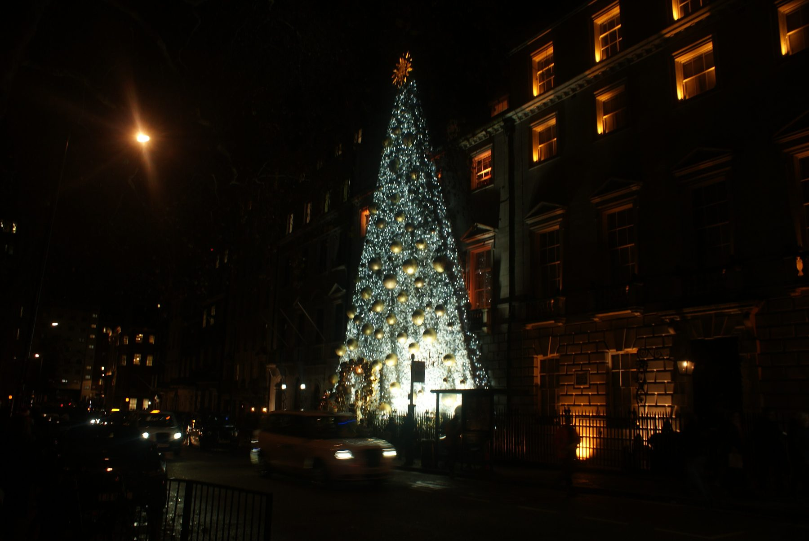
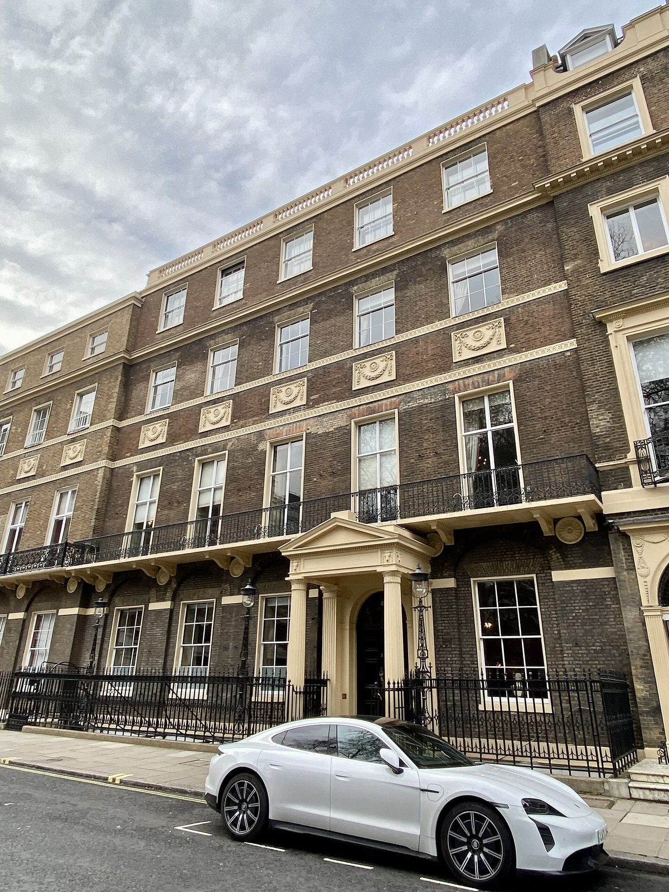
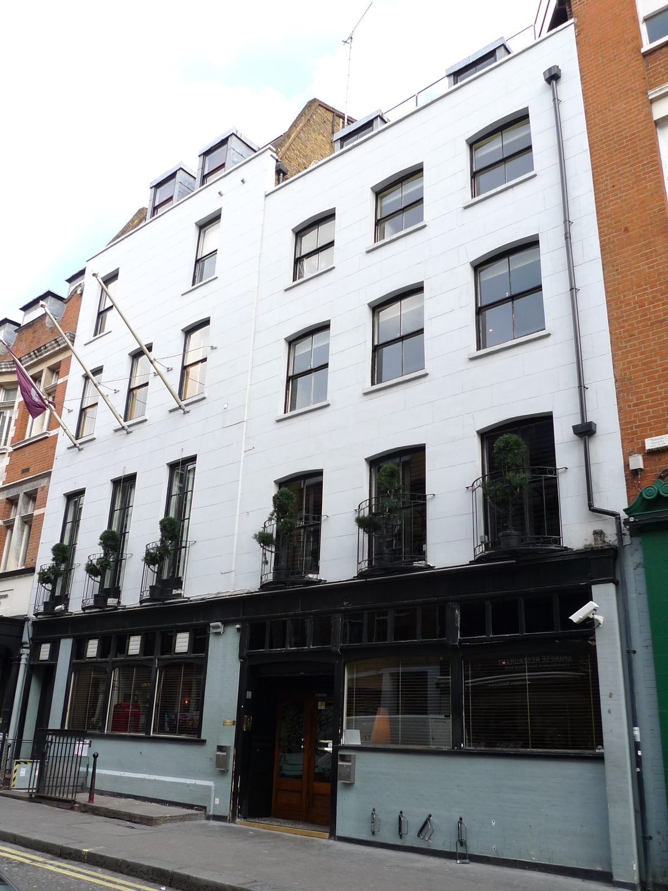
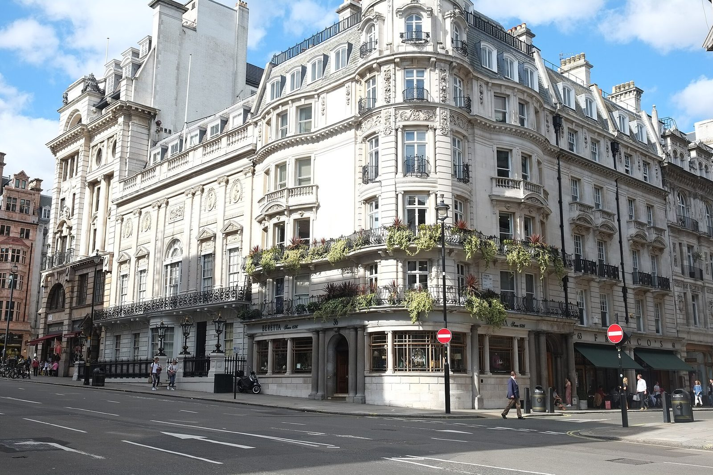

A private members' club sells a room to sit in, a dining room, a bar and the other members, for an annual fee and a vote by a committee. London has the oldest one in the world, White's, founded in 1693, and a newer generation, led by Soho House, that adds bedrooms, gyms and rooftop pools.

This guide covers the clubs readers ask about: what each costs in 2026, how to apply, what to wear, the phone and photo rules, and the ways a visitor gets through the door without a membership.

> 💡 **The Short Version:** Annual fees run from **£880** (the Groucho Club, under 36) to **£4,500** (Soho House, every House worldwide), plus a joining fee of roughly **£500 to £1,850**. Almost every club needs a **proposer** or a **committee vote**, and most ban **photography** inside. Without a membership you can **tour Annabel's** on its public access days, **stay at a Soho House hotel** (Shoreditch House and White City House include the pool and gym), eat in **The Ned's** public restaurants or **Nettle** on The Conduit's roof. The **St James's gentlemen's clubs** are members and their guests only, and **White's and Boodle's admit men only**.

*Fees are the 2026 rates on each club's own site unless another source and date are named.*

---

## What it costs: the clubs side by side

| Club | Annual fee (2026) | Joining fee | Dress code | Who it suits |
| --- | --- | --- | --- | --- |
| [Soho House](#soho-house-and-shoreditch-house) | £4,500 every House; £1,300 to £3,500 one House; £2,500 under 27 | £550, returned as credit | Casual | Creative industries; the widest network, with pools at Shoreditch, 180 House and White City |
| [Annabel's](#annabels) | £3,750; £2,250 under 35 (Spear's, January 2026) | £1,850; £600 under 35 | Blazer for men after 6pm | Mayfair nightlife, dining and the garden |
| [Ned's Club](#neds-club-at-the-ned) | £4,100; £2,750 under 30 | £1,250; £450 under 30 | Smart; no sportswear or sliders | City workers; rooftop pool, gym and spa |
| [The Arts Club](#the-arts-club) | £3,200; £1,500 under 33 | £1,600; £500 under 33 | Elegant; blazer encouraged after 6pm | Art, live music and late opening in Mayfair |
| [Home House](#home-house) | £2,250; £1,560 under 35; £1,440 evenings and weekends | £499 | No set code | A Robert Adam house on Portman Square, open to photography |
| [5 Hertford Street](#5-hertford-street) | From £1,800 (Spear's, January 2026) | – | Jacket at all times | Mayfair power dining and Loulou's nightclub |
| [The Groucho Club](#the-groucho-club) | £1,500; £880 under 36; £1,100 outside London | – | Relaxed | Media and arts people in Soho |
| [The Conduit](#the-conduit) | £1,500; £1,250 not-for-profit | – | No strict code | Social-impact work in Covent Garden |

Home House states that its rates include VAT. Soho House, Home House and the Groucho also take the subscription monthly.

---

## The clubs

### Soho House and Shoreditch House

*Soho: 40 Greek Street and 76 Dean Street · Shoreditch House, Ebor Street, E1 6AW · Every House £4,500 a year (2026)*

Soho House started at 40 Greek Street in 1995 and has grown to 48 Houses in 19 countries. In London the members-only Houses include the original **40 Greek Street** and **76 Dean Street** in Soho, **Shoreditch House** in the old Tea Building with a rooftop pool, **180 House** on the Strand with a rooftop pool and terrace, **White City House** in the former BBC Television Centre, **Electric House** in Notting Hill and **Little House Mayfair**. Membership is aimed at people in the creative industries.

**What it costs in 2026:**

- **Every House**, every House worldwide: £4,500 a year (£375 a month), under 27 £2,500.
- **Local House**, one House only: £2,200 at Soho House London, £3,500 at Shoreditch House, 180 House or White City House, and £1,300 at Electric House or Little House Mayfair.
- A one-off **House Introduction Fee** of £550 (£330 under 27), returned as credit for food, drink and bedrooms in the Houses.
- The under-27 rate lasts until your 30th birthday if you are accepted by your 27th. Most London Houses do not offer under-27 Local House membership; Little House Mayfair does, at £1,050.

**How to apply:** online, in about 15 minutes, with a recent photo, your occupation and interests, and card details. An existing member can be named on the form as your proposer. The Membership Committee meets **quarterly**, and renewals are reviewed every year.

**The rules:** up to **three guests**, who cannot enter without you or stay after you leave. **No cameras or recording of any kind**, phones included, and the House can confiscate a device used to take pictures. Calls and laptops are allowed only in designated areas at set times; at Shoreditch House laptops are allowed in the Library, Sitting Room and Games Room until 6pm on weekdays and noon at weekends.

**The way in without joining:** Soho House's bedrooms take non-members. At [Shoreditch House](https://www.sohohouse.com/houses/shoreditch-house/bedrooms) and White City House a non-member staying the night can book tables, swim in the pool and use the gym for the length of the stay. At some Houses, White City House among them, a non-member joins **Soho Friends** (£135 a year) to complete the booking. Soho House also runs hotels outside the Houses, including [Dean Street Townhouse](hotel:dean-street-townhouse) in Soho and [Redchurch Townhouse](hotel:redchurch-townhouse) in Shoreditch.

### Annabel's

*46 Berkeley Square, W1J 5AT · £3,750 a year plus £1,850 to join ([Spear's](https://spearswms.com/luxury/london-best-private-members-clubs/), January 2026) · Mon–Tue 7.30am–1am, Wed–Fri 7.30am–3am, Sat 11.30am–3am, Sun 11.30am–midnight*

Mark Birley opened Annabel's as a basement nightclub at 44 Berkeley Square in 1963, naming it after his wife, Lady Annabel. Richard Caring bought it in 2007 and in 2018 moved it two doors along to No. 46, a Grade I listed Georgian house, after a refit by Martin Brudnizki that Spear's put at £55 million. It has restaurants, bars, a garden terrace and the nightclub downstairs, and the facade is dressed for Christmas and for the Chelsea Flower Show. Spear's gave the under-35 rate as £2,250 a year with a £600 joining fee.

**How to apply:** through the online application form on the Birley Clubs site. The club rules forbid applying through a concierge service and forbid members from selling a proposal.

**The rules:**

- Up to **three guests** without a reservation, accompanied throughout.
- **No photography or video** anywhere in the club.
- Phones and laptops only in The Elephant Lounge until 6pm, phones on silent at all times.
- Members dining or booking a table for drinks are asked to bring a mixed group of guests.
- Under-18s at weekends until 6pm.

**The dress code:** men wear a **blazer after 6pm**; a round-neck T-shirt passes only under a tailored jacket. Formal shoes are required, with clean plain leather or suede trainers allowed; running-style trainers with cushioned soles or mesh uppers, flip-flops and sliders are not. Smart jeans in a solid colour are fine, ripped or heavily washed denim is not, men never wear shorts, and **hats are not allowed anywhere**.

*Annabel's, Berkeley Square. Photo: [Robert Lamb](https://commons.wikimedia.org/wiki/File:View_of_a_Christmas_tree_covering_the_front_of_Annabel%27s_Club_on_Berkeley_Square_-_geograph.org.uk_-_6342705.jpg), [CC BY-SA 2.0](https://creativecommons.org/licenses/by-sa/2.0/).*

**The way in without joining:** because the house is listed, Westminster requires public access, and Annabel's runs **tours of the staircase and the principal rooms** on the ground and first floors. The 2026 dates are Monday 16 February, Friday 10 April, Saturday 12 September (open to under-18s) and **Monday 26 October**, with tours on the hour from 9am to 4pm for up to 12 people. Email reservations@annabels.co.uk with a date, time and party size. The dress code applies to visitors too.

### Ned's Club at The Ned

*27 Poultry, EC2R 8AJ · £4,100 a year plus £1,250 to join (2026) · [Hotels.com](hotel:the-ned)*

The Ned fills the former Midland Bank headquarters at Bank, built in 1924: a 250-room hotel, a banking hall of public restaurants, and **Ned's Club** above and below them. Upstairs is the rooftop with a heated pool, terraces and a restaurant; downstairs is **The Vault**, a late-night bar in the old bank vault, plus the Long Bar, a 620-square-metre gym and a spa built around a 20-metre pool. Membership covers the Ned's Clubs abroad too.

**What it costs in 2026:** £4,100 a year and a £1,250 joining fee; under 30, £2,750 and £450. Soho House members pay the same subscription with a smaller joining fee (£625, or £225 under 30), but a Soho House card does not open Ned's Club. The application form asks for proposers, and the Ned's Club Committee decides.

**The dress code:** no gym or sportswear, no sliders, scruffy trainers or ripped trousers. Tailored shorts are allowed on the rooftop in summer only, never indoors after 5pm and never in The Vault. Bags go into the members' cloakroom.

**The way in without joining:** the hotel and its ground-floor restaurants are open to everyone, with no dress code in the public spaces. The rooftop is members and their guests, over 18, except that hotel guests can take children to the rooftop pool from 7am to 10am. Our [hotels with pools guide](/articles/hotels-with-pool-london/) explains which pool a hotel guest can use.

### The Arts Club

*40 Dover Street, W1S 4NP · £3,200 a year plus a £1,600 assessment fee (2026) · Open 8am–3am*

Founded in 1863, with Charles Dickens, Anthony Trollope and Lord Leighton among the founders, and a membership drawn from art, music and writing. The Mayfair townhouse holds restaurants including Kyubi and Leo's, a members' lounge, a programme of exhibitions and live music, and hotel rooms on the top two floors.

**What it costs in 2026:** £3,200 a year for anyone 33 or older, plus a £1,600 member assessment fee. Under 33 it is £1,500 a year and a £500 fee; a spouse or partner at the same address pays £1,400 with no fee. London members can add The Arts Club Dubai for £1,400 more.

**The dress code is "always elegant":** men are encouraged to wear a blazer after 6pm. Not allowed: T-shirts with large logos or slogans, ripped jeans, gym shoes, shorts or cargo trousers on men, sportswear and hooded tops, flip-flops and sliders, baseball caps and beanies, and **backpacks**. The front desk can turn away someone who meets the rules but is not, in its words, sufficiently well-presented.

**Reciprocal access.** Members can use affiliated private clubs around the world, and the club stays open until 3am.

### Home House

*20 Portman Square, W1H 6LW · £2,250 a year plus £499 to join (2026)*

Elizabeth, Countess of Home, took the house in 1773 and had Robert Adam remodel it; his hand-painted ceilings, imperial staircase and glass dome survive. It spreads across three Georgian townhouses with a walled garden, a gym, sauna and steam room, and bedrooms for members and their guests.

*Home House, Portman Square. Photo: [No Swan So Fine](https://commons.wikimedia.org/wiki/File:Home_House,_20_Portman_Square,_Marylebone,_March_2023.jpg), [CC BY-SA 4.0](https://creativecommons.org/licenses/by-sa/4.0/).*

**What it costs in 2026:** full membership £2,250 a year; under 35, £1,560; **Social membership** £1,440, which covers weekdays after 6pm and all day at weekends and bank holidays, with no gym. Members living outside the UK pay £1,560. Each adds a £499 joining fee, and the rates include VAT.

**How to apply:** a member who knows you proposes you, and the Membership Committee votes by secret ballot; **two "no" votes** and you are not elected, with no reason given. The minimum age is 21.

**The rules:** there is **no set dress code**, though the club can refuse anyone it thinks is inappropriately dressed. Up to three guests, signed in by the member, and the club may charge guests a daily entrance fee. Home House is the rare club that allows **general photography**, as long as no members or guests are in the shot. Laptops are banned in the drawing rooms, garden, restaurant and spa, and "co-working behaviour" is not allowed anywhere.

### 5 Hertford Street

*2–5 Hertford Street, W1J 7RB · From £1,800 a year (Spear's, January 2026) · Mon–Tue 7am–1am, Wed 7am–2am, Thu–Fri 7am–3am, Sat noon–3am, closed Sunday*

Robin Birley, Mark Birley's son, opened 5 Hertford Street in 2012 in a run of houses on the corner of Shepherd Market. It has dining rooms, its own cigar shop and **Loulou's**, the nightclub in the basement. Membership enquiries go to the club's membership office by email.

**The dress code:** a **jacket at all times**, which can come off on the Loulou's dance floor after 11pm. Collared or mandarin-collared shirts; chinos, cords, or jeans if they are smart, unfrayed and one colour; smart, clean trainers. No shorts, no sportswear of any kind (polo shirts included), no collarless shirts or T-shirts, no flip-flops or sandals and no dirty or "distressed" shoes.

**Knowing a member.** Many of its members also belong to Oswald's, Birley's second club.

### Oswald's

*25 Albemarle Street, W1S 4HU · Mon–Fri 10am–1am, Sat 6pm–1am, closed Sunday*

Robin Birley's second Mayfair club, named after his grandfather, the portrait painter Sir Oswald Birley, and set up to serve vintage wines at more affordable prices. **Jackets are required at all times**, the same shirt, jeans and trainer rules apply as at 5 Hertford Street, and **photography is not permitted anywhere in the club at any time**.

### The Groucho Club

*45 Dean Street, W1D 4QB · £1,500 a year (2026)*

Opened on 5 May 1985 and named after Groucho Marx's line about not wanting to belong to any club that would have him as a member. Members come mostly from publishing, media, film, music and the arts. There are bars, restaurants, a snooker room and 17 bedrooms for members and their guests. Artfarm, the hospitality company founded by Iwan and Manuela Wirth of the gallery Hauser & Wirth, bought it in 2022.

*The Groucho Club, Dean Street. Photo: [Ewan Munro](https://commons.wikimedia.org/wiki/File:Groucho_Club,_Soho,_W1_%282711860818%29.jpg), [CC BY-SA 2.0](https://creativecommons.org/licenses/by-sa/2.0/).*

**What it costs in 2026:** £1,500 a year for London members aged 36 and over, **£880 for 35 and under**, and £1,100 for members living outside London (£880 if 35 or under). Applications go through the club's online form, and an applicant needs two existing members to propose them.

**Age.** The £880 rate for members 35 and under is the lowest subscription on this page.

### The Conduit

*6 Langley Street, Covent Garden, WC2H 9JA · £1,500 a year (2026) · Mon–Thu 7am–11pm, Fri 7am–midnight, Sat 10am–11pm, closed Sunday*

A club for people working on social and environmental change, with talks and events on top of the usual bars and workspace. Membership is £1,500 a year, or **£1,250 for people working in the not-for-profit sector**, and cheaper out-of-town rates exist for those living outside the M25. Applicants usually hear within 14 days. There is no strict dress code, but shoes must be worn.

**The rules:** two guests in the day, plus two more at evening events, each registered in the members' app on the day. A guest can visit **three times in any 12 months**, after which they are expected to apply.

**The way in without joining:** the club runs **30-minute tours** on weekdays between 7am and 7pm, open days from 3pm and open evenings from 6pm, booked through [its visit page](https://www.theconduit.com/visit-the-conduit/). Its two restaurants take the public: **Birchwood**, the ground-floor café, is open to everyone every day, and **[Nettle](https://www.sevenrooms.com/explore/nettle/reservations/create/search/)**, the rooftop restaurant cooking seasonal British produce over fire, takes bookings.

---

## The St James's gentlemen's clubs

The older clubs sit along St James's Street and Pall Mall. They are owned by their members, publish little, take new members by proposal and election, and have no public restaurant, bar or bedroom. The way in is as a member's guest, or through a reciprocal arrangement with a club abroad.

| Club | Address | Founded | Admits |
| --- | --- | --- | --- |
| White's | 37–38 St James's Street | 1693 | Men only |
| Boodle's | 28 St James's Street | 1762 | Men only |
| Brooks's | St James's Street, SW1A 1LN | Clubhouse built in 1778 | – |
| The Athenaeum | 107 Pall Mall | 1824 | Men and women |
| The Garrick | 15 Garrick Street, Covent Garden | 1831 | Men and women since May 2024 |
| The Reform Club | 104 Pall Mall, SW1Y 5EW | 1836 | Men and women since 1981 |

### White's

Founded in 1693 as a hot chocolate shop and on St James's Street since 1778, which makes it the oldest members' club in London. It admits men only; David Cameron resigned his membership in 2008 over the club's refusal to admit women.

*White's, St James's Street. Photo: [Anthony O'Neil](https://commons.wikimedia.org/wiki/File:Whites_Club_%28geograph_5658549%29.jpg), [CC BY-SA 2.0](https://creativecommons.org/licenses/by-sa/2.0/).*

### Boodle's

Founded in January 1762 by the Earl of Shelburne, later prime minister, and named after its head waiter, Edward Boodle. It has been at 28 St James's Street since 1782. Members are elected by nomination, and the club admits men only.

### Brooks's

On St James's Street, in a clubhouse Henry Holland designed for the wine merchant William Brooks and completed in 1778. The club grew out of a society founded at Almack's on Pall Mall in 1762.

### The Reform Club

Founded in 1836 by Radicals and Whigs, in Sir Charles Barry's clubhouse on Pall Mall, and one of the first of the old clubs to admit women on equal terms, in 1981. Of roughly 2,700 members, about 500 are overseas members. It is where Anthony Bridgerton and Simon Basset meet in the first series of [Bridgerton](/articles/bridgerton-london/).

**The dress code:** men wear a **jacket and a shirt with a full collar**; ties are encouraged but optional, and women dress with similar formality. No denim, sportswear, polo shirts, shorts or sweatshirts, and no trainers, deck shoes or hiking boots. Jackets can come off in June, July and August, and the code relaxes at weekends after Saturday breakfast. The club is closed on bank holidays.

### The Athenaeum

Founded in 1824 for men and women with intellectual interests, particularly those distinguished in science, engineering, literature or the arts; 51 Nobel laureates have been members. The Decimus Burton clubhouse at the corner of Waterloo Place carries a gilded statue of Athena over the door and a copy of the Parthenon frieze.

### The Garrick

Founded in 1831 for "actors and men of refinement", with a membership drawn from the theatre, law, journalism and Parliament, and what the club calls the most comprehensive collection of theatrical paintings and drawings in existence. It voted to admit women in May 2024. A candidate needs a proposer, a seconder and supporting signatures from at least 30 other members before the committees and a secret vote.

---

## How membership works

The modern clubs and the old ones run on the same four steps.

- **A proposer.** Most clubs want one or two existing members to vouch for you; Home House says the proposer must know you personally. Soho House's form lets you name one.
- **An application.** An online form with a photo, your occupation and often a note on what you would bring to the club.
- **A committee.** It meets on a schedule (quarterly at Soho House) and gives no reasons. At Home House two votes against are enough to reject you.
- **A joining fee, then a subscription.** The joining fee is paid once; the subscription renews every year, and Soho House and Ned's Club review members before renewing.

Age bands change the price more than anything else: the young rates stop at 27 (Soho House, held until 30), 30 (Ned's Club), 33 (The Arts Club) and 35 (Annabel's, Home House and the Groucho).

---

## Dress codes and etiquette

> ⚠️ **No photos.** Soho House, Annabel's and Oswald's ban photography and filming anywhere in the club, and Soho House can confiscate the phone. Your guests are your responsibility, and a member can lose their membership over a guest's behaviour.

The rules repeat from club to club:

- **Jackets.** Required at all times at 5 Hertford Street and Oswald's, after 6pm at Annabel's, encouraged after 6pm at The Arts Club, required at the Reform. Soho House, Home House, the Groucho and The Conduit have no jacket rule.
- **Shoes.** Clean, plain leather trainers pass at Annabel's and 5 Hertford Street; running shoes, sliders and flip-flops fail almost everywhere.
- **Sportswear and shorts.** Banned at The Arts Club, 5 Hertford Street, Oswald's, the Reform and Ned's Club, and shorts on men at Annabel's; 5 Hertford Street and Oswald's count a polo shirt as sportswear.
- **Phones and laptops.** Calls in designated areas only at Soho House; laptops only in The Elephant Lounge until 6pm at Annabel's; no laptops in the drawing rooms, garden or restaurant at Home House.
- **Guests.** Usually three per visit, signed in and accompanied the whole time; The Conduit allows two in the day.
- **Discretion.** Soho House's rules forbid sharing details of other members, guests or events with the press or on social media.

---

## Reciprocal clubs abroad

Many clubs give members access to partner clubs in other cities. The Reform Club has reciprocal arrangements with clubs around the world, and The Arts Club and the Garrick both list affiliated clubs abroad. For a visitor this works in reverse: a member of a club in New York, Sydney or Hong Kong should ask their own club whether it has a London partner, which is the one way into a St James's club without a host. Soho House's **Cities Without Houses** membership gives people living somewhere without a House the full Every House access when they travel.

---

## What a visitor can book without a membership

| Where | What you can book | Watch out for |
| --- | --- | --- |
| Annabel's, 46 Berkeley Square | A free tour of the staircase and principal rooms | Set public access days only; the last 2026 date is Monday 26 October. Email to book; dress code applies |
| Shoreditch House and White City House | A bedroom, with the pool, gym and tables in the House during the stay | Some Houses add Soho Friends (£135 a year) to the booking |
| [Dean Street Townhouse](hotel:dean-street-townhouse) and Redchurch Townhouse | A bedroom in Soho House's public hotels | No club spaces |
| [The Ned](hotel:the-ned), the City | A hotel room, and a table in the ground-floor restaurants | The rooftop is members only, except the pool for hotel guests' children from 7am to 10am |
| [The Twenty Two](hotel:the-twenty-two), Grosvenor Square | A bedroom, with temporary club membership for the stay | The club is over-21s only |
| The Conduit, Covent Garden | Birchwood café, Nettle on the roof, and free tours and open evenings | Tours are aimed at people considering membership |

Our [Mayfair hotel guide](/articles/where-to-stay-mayfair/) covers The Twenty Two in full, and the [Shoreditch hotel guide](/articles/where-to-stay-shoreditch/) covers Redchurch Townhouse.

---

## Continue planning your London trip

- 🍸 **[Best Cocktail Bars in London](/articles/best-cocktail-bars-london/)** — the bars anyone can walk into
- 🌇 **[Best Rooftop Restaurants in London](/articles/best-rooftop-restaurants-london/)** — the views without a membership
- 🫖 **[Best Afternoon Tea in London](/articles/best-afternoon-tea-london/)** — the grand hotel rooms, open to anyone who books
- 🏊 **[Hotels with Pools in London](/articles/hotels-with-pool-london/)** — including The Ned's two pools
- 🎰 **[Casinos in London](/articles/casinos-london/)** — the West End rooms anyone with photo ID can walk into
- 🏛️ **[Mayfair Area Guide](/articles/mayfair-area-guide/)** — Berkeley Square, Shepherd Market and the arcades
- 🎭 **[Soho Area Guide](/articles/soho-area-guide/)** — Dean Street and Greek Street
- 🏨 **[Where to Stay in Mayfair](/articles/where-to-stay-mayfair/)** — including The Twenty Two
- 🏨 **[Where to Stay in Shoreditch](/articles/where-to-stay-shoreditch/)** — Redchurch Townhouse and the area around Shoreditch House
- 🏦 **[Where to Stay in the City of London](/articles/where-to-stay-city-of-london/)** — The Ned and its neighbours
