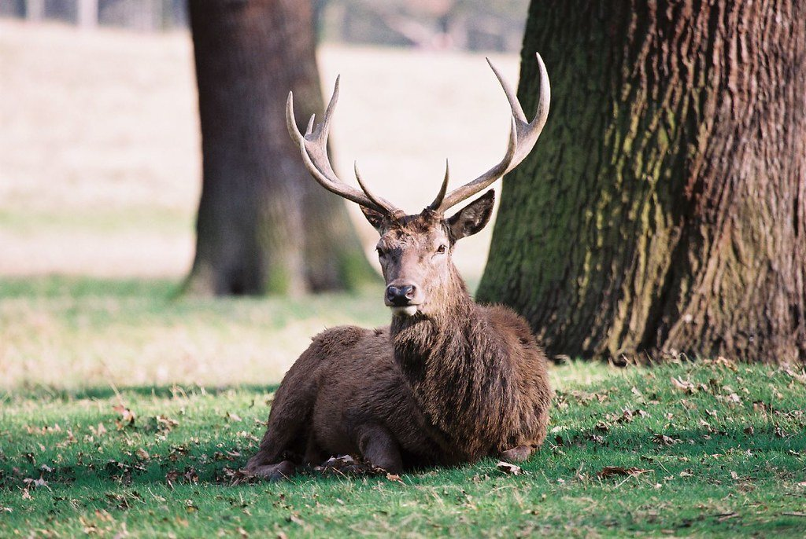
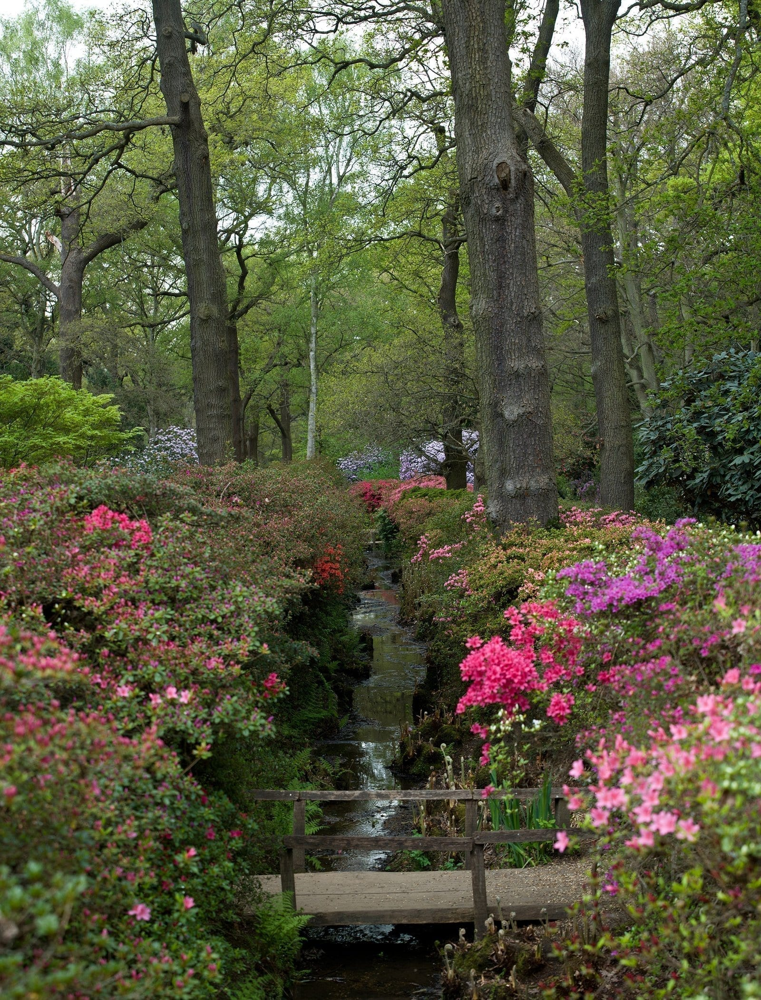
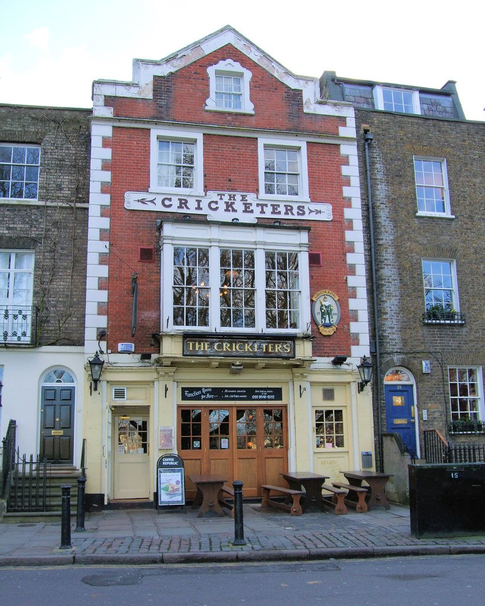
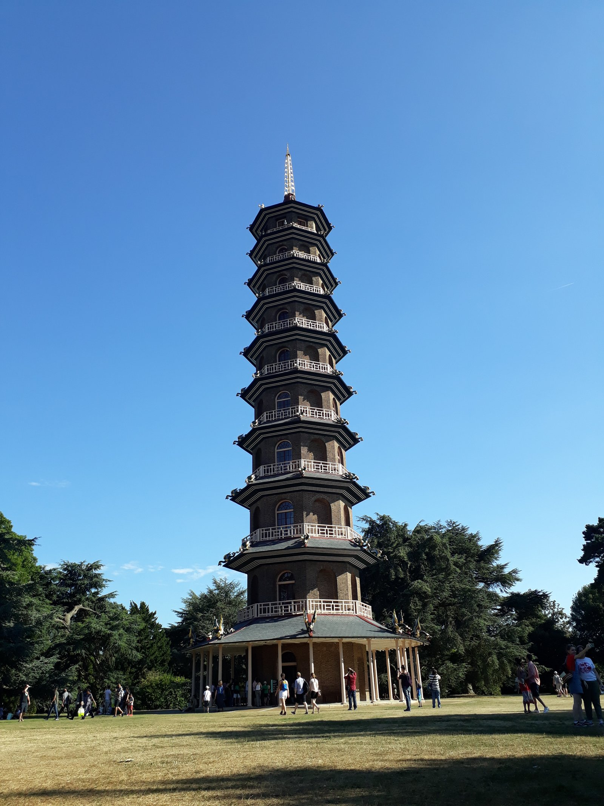

Richmond is a Georgian riverside town that London grew around rather than absorbed. It has a green, a river, a working town centre, and behind it 2,500 acres of deer park — the largest of the royal parks and nearly three times the size of Central Park.

It is about 30 minutes from central London on the District line, and it is the most straightforward way to spend a day outdoors without leaving the city.

Richmond has its own share of the commemorative plaques marking where notable people lived or worked - see them on our [interactive map](/plaques/?area=richmond).

## Why visit — and who should skip it

**Come here if** you want space, wildlife and a river. Richmond Park has around 600 free-roaming deer, a legally protected view of St Paul's ten miles away, and an azalea garden that is one of the best things in London for two weeks in May.

**Skip it if** you are on a short trip. Richmond is Zone 4 and takes the better part of a day to do properly. On three days in London, the parks in Zone 1 will serve you better.

## Top sights and activities

1. **Richmond Park** — 2,500 acres, a National Nature Reserve, and around 600 red and fallow deer roaming free since 1637. Keep 50 metres back, more in autumn.
2. **King Henry's Mound** — In Pembroke Lodge Gardens, with a telescope aimed through a cut in the trees at **St Paul's Cathedral**, ten miles east. The sightline is legally protected.
3. **The Isabella Plantation** — A 40-acre woodland garden inside the park, planted with azaleas and rhododendrons. Spectacular for about two weeks in late April and May, and quiet the rest of the year.
4. **The view from Richmond Hill** — The only view in England protected by its own Act of Parliament, painted by Turner and Reynolds. Two minutes up from the town centre.
5. **The Thames Path to Ham House** — A flat riverside walk south past Petersham Meadows, where cows still graze, to a Stuart house of 1610 kept largely intact.
6. **Richmond Green** — A wide green ringed by Georgian houses, with the remains of Richmond Palace at one corner. Cricket in summer.
7. **Kew Gardens** — Two stops north, or a 30-minute river walk. Ticketed, and a full half day on its own.

*One of about 600 red and fallow deer roaming Richmond Park. Keep 50 metres back, and much further during the autumn rut. Photo: [Bruno Girin](https://www.flickr.com/photos/16405999@N00/19873390), [CC BY-SA 2.0](https://creativecommons.org/licenses/by-sa/2.0/).*

## Key streets and micro-districts

### Richmond town centre

Around the station and George Street, and a working high street rather than a tourist one — chains, a market, banks and the ordinary business of a prosperous suburb. That is worth knowing before you arrive expecting a village.

**Richmond station is the hub and it is unusually well connected**: District line, Overground and South Western Railway from Waterloo, all on one platform group. Waterloo is about twenty minutes, the District line about forty.

**Eat on Red Lion Street**, two minutes off George Street: **Al Boccon di'vino at 14** serves a no-menu Italian feast where you eat what they cook that day and there is no ordering involved, and **Napoli on the Road at 12** does Neapolitan pizza. **Antipodea at 30 Hill Street** is the all-day Australian for breakfast.

**Everything else in this guide is uphill or downhill from here.** The Green is two minutes west, the riverside five minutes south, and the park a twenty-minute climb — so decide the order before you set off.

### Richmond Green

Two minutes west of the station and one of the finest greens in London — a wide open square of grass edged with Georgian frontages, still used for cricket in summer.

**The palace gateway on the south-west corner is the surviving fragment of Richmond Palace**, where Elizabeth I died in 1603. Almost all of it was demolished after the Civil War; what remains is the gatehouse and a courtyard behind, and you can walk through to Old Palace Yard.

**Richmond Theatre** on the north-east corner is a Frank Matcham building of 1899, the same architect as the Hackney Empire, and it takes touring productions on their way to or from the West End.

**It is free, open at all hours and unfenced**, which makes it the best picnic ground in this guide. The pubs along the western side put tables out and fill on summer evenings.

### Richmond Hill and the Terrace Gardens

The climb south from the town centre to the view, about fifteen minutes on foot and steeper than it looks on a map.

**The view from the Terrace Walk is protected by its own Act of Parliament** — the Richmond, Petersham and Ham Open Spaces Act 1902 — and it is the only view in England with that distinction. What it protects is the bend of the Thames below Petersham Meadows with Glover's Island in the middle, painted by Turner and Reynolds.

> The protected sightline is from **the pavement at the top of the hill**, not from inside Terrace Gardens below. Both are open at all hours and free — Richmond Council describes the Gardens as accessible at all times too — so the distinction is about where the legal protection falls, not about getting locked out.

**The Roebuck at 130 Richmond Hill** is directly on the view, which makes it the only pub in London where the outlook is protected by statute. There is a café in Terrace Gardens open seven days during daylight.

Keep climbing and **Richmond Gate** puts you into the park at the top.

### The riverside and Petersham

Below the hill, and the best walk in this guide. The towpath runs south from Richmond Bridge past Petersham Meadows — still grazed by cattle in summer, which is why the view from the hill above still looks like a landscape painting — and on to Ham House, about forty minutes each way.

**The White Cross on Water Lane** is the riverside pub, and it has a quirk worth knowing: **the towpath floods at high tide and the pub's lower entrance goes underwater**, tide tables pinned up by the door. It is not a problem, it is the attraction.

**Boat hire runs from below Richmond Bridge** in the warmer months — rowing boats by the hour — and there are river trips downstream to Kew and Westminster.

**Petersham has two serious restaurants**, both a walk: **Petersham Nurseries** does glasshouse dining inside a working plant nursery, and **The Dysart at 135 Petersham Road** runs a seasonal tasting menu. Both need booking and neither is cheap.

**Ham House at the far end** is a largely unaltered 1610 Stuart house, National Trust, ticketed, and reachable only on foot or by the little seasonal foot ferry across the river.

### Richmond Park

Behind the hill, and at 2,500 acres it is the largest of London's Royal Parks — big enough that arriving without a destination means seeing very little of it. Three things to aim for.

**Pembroke Lodge** is the Georgian mansion near Richmond Gate, now a tea room, with **King Henry VIII's Mound** in its gardens: a telescopic sightline through a gap in a hedge to **St Paul's ten miles away**, protected as a linear view. Be realistic — it is a keyhole, not a vista, and on a hazy day you see very little.

**The Isabella Plantation** is a fenced woodland garden in the middle of the park, best in late April and May for the azaleas, free and open all year. **Pen Ponds** are where the deer come to drink.

**Around 600 red and fallow deer roam free.** Keep 50 metres away, never photograph them close up, and during the **autumn rut and the spring birthing season** the park authorities ask you to give them considerably more room.

> ⚠️ **Pedestrian gates open 24 hours except during the two six-week deer culls** — November to early December and February to early March — when they shut 8pm to 7.30am on every night but Friday and Saturday. Vehicle gates close at dusk year-round. **Pembroke Lodge has a free 200-space car park**, one of only seven in the whole park, and it is the practical way in for most visitors.

*The Isabella Plantation in late April. It is a 40-acre woodland garden inside the park, and spectacular for about two weeks a year. Photo: [Diliff](https://commons.wikimedia.org/w/index.php?curid=14946838), [CC BY-SA 3.0](https://creativecommons.org/licenses/by-sa/3.0/).*

Powered by <a target="_blank" rel="sponsored" href="https://www.getyourguide.com/london-l57/">GetYourGuide</a>

## Where to eat and drink

| Spot | Style | Price | Why go |
| --- | --- | --- | --- |
| **The White Cross** | Riverside pub | ££ | On the towpath; floods at high tide, which is part of the appeal |
| **Petersham Nurseries Cafe** | Modern European | £££ | In a working plant nursery near Ham House; book ahead |
| **Pembroke Lodge** | Park cafe | ££ | Inside Richmond Park, beside King Henry's Mound |
| **The Roebuck** | Pub | ££ | On Richmond Hill, with the protected view from outside |
| **Richmond Station arcade** | Cafes and delis | £ | Quick and practical before heading into the park |
| **Al Boccon di'vino** | Italian set menu | £££ | No menu — they bring what they are cooking |

*The Cricketers, on Richmond Green. Cricket is still played on the green in front of it in summer. Photo: [Jim Linwood](https://www.flickr.com/photos/54238124@N00/2231008770), [CC BY 2.0](https://creativecommons.org/licenses/by/2.0/).*

## Getting there

**By Tube.** The **District line** runs direct to Richmond, the end of the Richmond branch, in about 30 minutes from Earl's Court. Step-free at Richmond.

**By Overground and rail.** London Overground from Stratford, and South Western Railway from Waterloo in around 20 minutes — faster than the Tube.

**Into the park.** **Richmond Gate** is the closest, up the hill from the town centre and about 20 minutes on foot. The **371 or 65 bus** saves the climb. Petersham Gate is the flatter approach.

**By river.** Boats run upstream to Hampton Court in summer, and downstream towards Kew and Westminster — slow but scenic.

*Kew's Great Pagoda, built in 1762. The eighty dragons on its roofs were restored and put back in 2018. Photo: [Atlaj123](https://commons.wikimedia.org/w/index.php?curid=72795184), [CC BY-SA 4.0](https://creativecommons.org/licenses/by-sa/4.0/).*

## How long to spend, and when to go

| If you have | Do this |
| --- | --- |
| **Two hours** | Richmond Green, the Hill view and the riverside |
| **Half a day** | Add Richmond Park as far as Pembroke Lodge |
| **A full day** | Add the Isabella Plantation and the walk to Ham House, or Kew |

**Best time:** Late April to May for the Isabella Plantation. Autumn for the deer rut and the colour, though keep well back from the stags.

**Note:** Richmond Park closes to vehicles overnight and gates shut at dusk. Check closing times before an evening walk.

## Suggested full-day route

1. **Start:** Richmond station. West to **Richmond Green** and the palace gateway.
2. **The riverside:** Down to the towpath and **The White Cross**.
3. **Richmond Hill:** Up to the **protected view** — the classic Turner viewpoint.
4. **Richmond Park:** In at **Richmond Gate** to **Pembroke Lodge** and **King Henry's Mound**.
5. **Isabella Plantation:** South-east into the woodland garden.
6. **Finish:** Out at Petersham Gate and back along the river, or on to **Ham House**.

## Common mistakes to avoid

1. **Approaching the deer.** They are wild. Fifty metres minimum, and much further during the autumn rut and spring births.
2. **Underestimating the park.** It is 2,500 acres. Pick two destinations rather than trying to cross it.
3. **Walking up Richmond Hill with tired legs.** The 371 or 65 bus goes to Richmond Gate.
4. **Visiting the Isabella Plantation outside May.** It is pleasant year-round but only spectacular in late spring.
5. **Expecting to see St Paul's in haze.** King Henry's Mound needs a clear day.
6. **Arriving late in the day.** Park gates close at dusk and it is a long walk back to any of them.

Powered by <a target="_blank" rel="sponsored" href="https://www.getyourguide.com/london-l57/">GetYourGuide</a>

## Where to stay

A quiet, green base with a slow commute — best if you are staying a week or more.

- **Richmond town centre** — Small hotels and inns near the green and the river.
- **Richmond Hill** — A few larger hotels with the view, at a premium.
- **Kew** — Two stops north, cheaper, and next to the Botanic Gardens.
