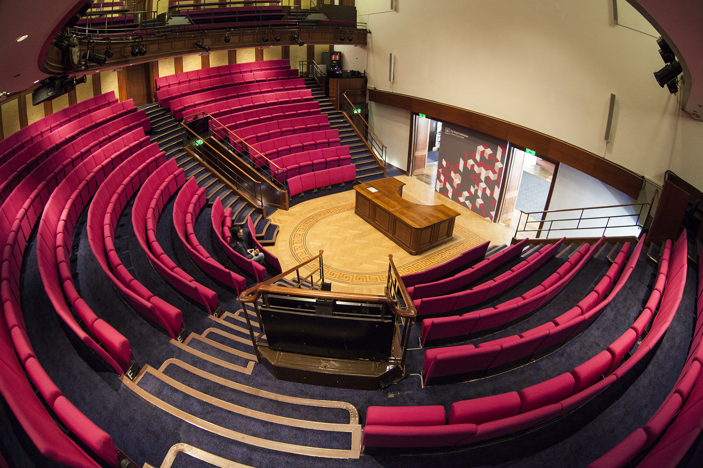
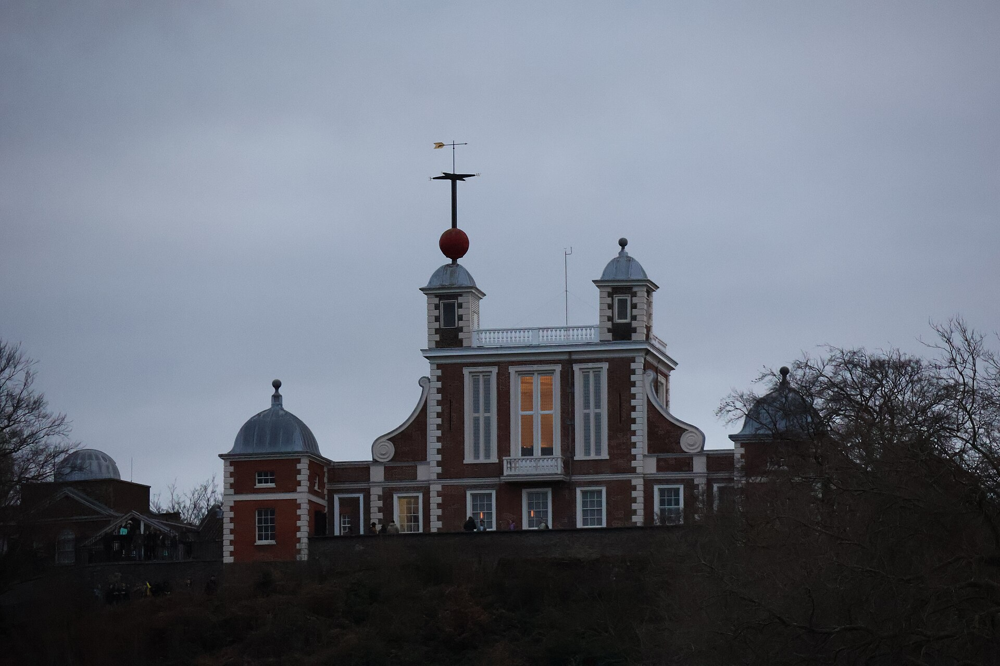
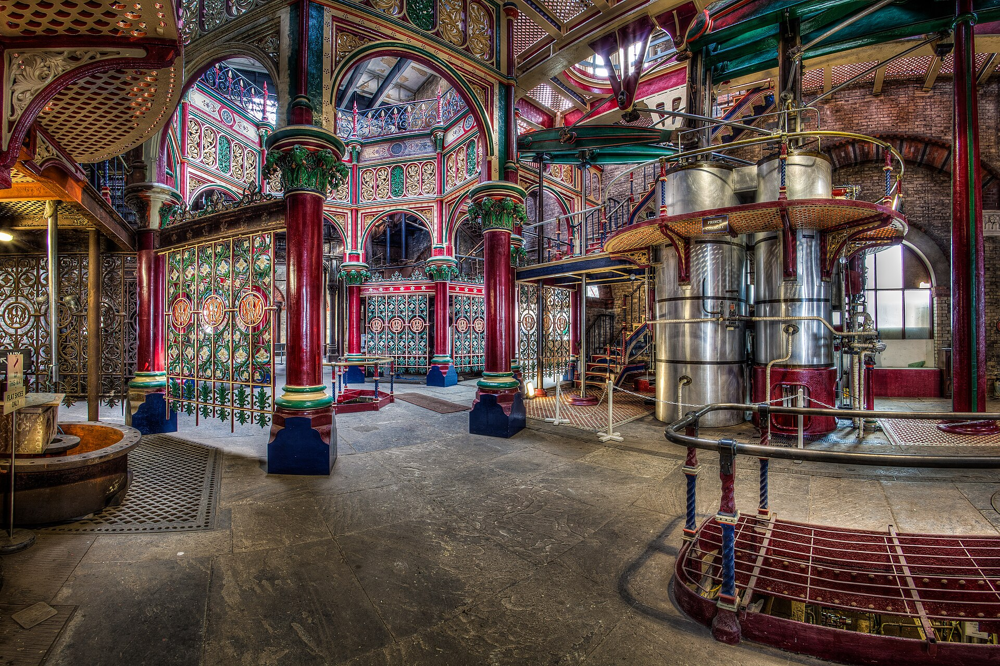
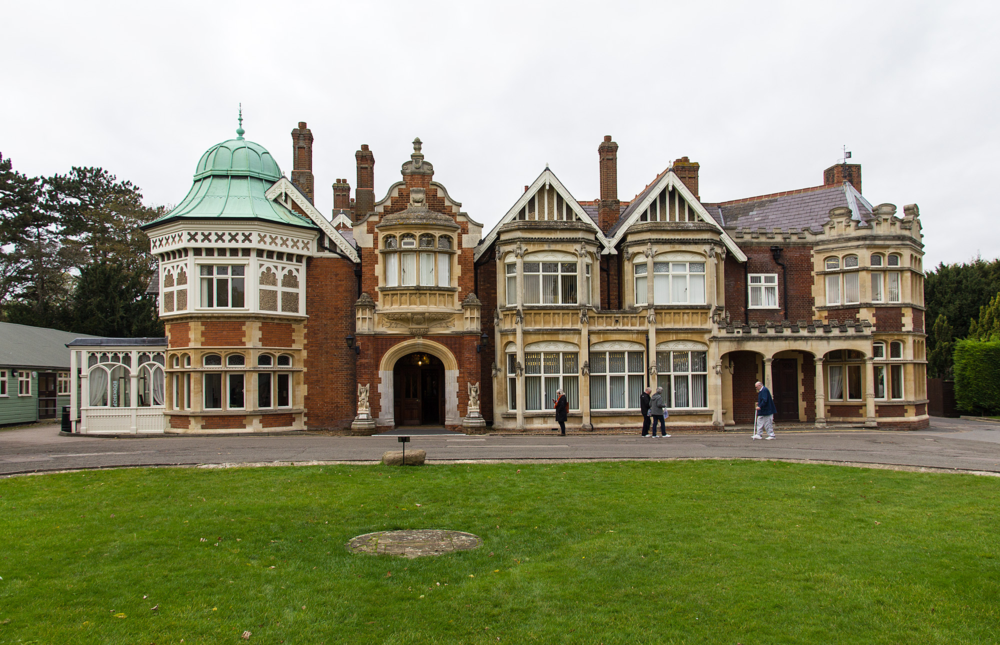

A Discourse at the Royal Institution begins at **7.30pm sharp with no introduction**, and the speaker is locked into a room ten minutes beforehand — the Ri says a speaker once tried to escape. The series has run since 1825, in the same red semicircular theatre where JJ Thomson announced the electron and Michael Faraday lectured more than a hundred times.

Everything below is science in London that happens **on a date, with a way to book**: lecture programmes, museum lates, planetarium shows, observatory nights, the autumn expo at ExCeL, and the Victorian pumping engines that only turn over on published dates. For the permanent collections — the Science Museum, the Natural History Museum, the Grant Museum, Wellcome — our [best museums in London guide](/articles/best-museums-london/) is the one you want.

> 💡 **The Short Version:** **[Gresham College](https://www.gresham.ac.uk/whats-on) has been free since 1597** and still is, in Holborn and online — but it oversells every lecture, so arrive 30 minutes early. **[Royal Institution](https://www.rigb.org/whats-on) Discourses are £20 or £15**, free to Ri Members, on selected Fridays; ordinary evening talks are £16 or £10. The **[Royal Society](https://royalsociety.org/science-events-and-lectures/public/) prize lectures are free**, and the YouTube stream needs no booking at all. **[New Scientist Live](https://live.newscientist.com/) is 10–12 October 2026 at ExCeL**, across four stages. The **[Peter Harrison Planetarium is closed](https://www.rmg.co.uk/whats-on/national-maritime-museum/astronomers-take-over)** — the replacement show is at the National Maritime Museum, £18 adult. **[Hampstead Observatory](https://www.hampsteadscience.ac.uk/observatory.html) is free** but runs evening sessions from **October to April only**, clear-sky only, with tickets live at 10am on the day. And four Victorian pumping stations still run their engines under steam on specific dates — **[Crossness](https://crossness.org.uk/visit/) on 17–18 October and 6 December**, **[Kempton](https://kemptonsteam.org/whats-on/steaming-weekends/) on 17–18 October and 21–22 November**, **[Kew Bridge](https://waterandsteam.org.uk/whats-on-new) on the last weekend of most months**, and **[Markfield](https://www.mbeam.org/visit) on 12 December**.

---

> 🧭 **Plan the rest of it:** [Best museums](/articles/best-museums-london/) · [Greenwich](/articles/greenwich-area-guide/) · [South Kensington](/articles/south-kensington-area-guide/) · [Hidden London](/articles/hidden-london-secret-places/) · [Things to do in October](/articles/things-to-do-in-london-in-october/)

## In the diary

Every date and price below is the organiser's own, taken from its listings on **21 September 2026**.

| Date | Price | What is on |
| --- | --- | --- |
| **Wed 23 Sep** | Free | Chris Lintott on cosmic inflation, Gresham College at Conway Hall, 7pm |
| **Thu 24 Sep** | Free | Wellcome Collection Lates: The Friendship Effect, 7–10pm, ticketed |
| **Fri 25 Sep** | Free | Gresham's Festival of Astronomical Ideas, Barnard's Inn Hall, from 11am — in person only, no livestream |
| **Fri 25 Sep** | £20/£15 | Ri Discourse: Carlo Rovelli on physics and philosophy, 7.30pm |
| **Sat 26–Sun 27 Sep** | £15 adult, £5 child | September Steam Up, London Museum of Water & Steam, Brentford |
| **Sun 27 Sep** | Free | Markfield Beam Engine open day, Tottenham, 10am–3.30pm (engine not in steam) |
| **Mon 28 Sep** | Members only | RGS Monday Night Lecture: Sir Steve Sparks on volcanoes, Kensington Gore, 6.30pm |
| **Wed 30 Sep** | Free | Imperial Inaugural: Joseph Boyle on heart attacks and strokes, South Kensington, 5.30pm |
| **Sat 10–Mon 12 Oct** | Ticketed | New Scientist Live, ExCeL London — two public days and a Schools' Day |
| **Sat 10 Oct** | Ticketed | Gaussfest: Electricity Day, London Museum of Water & Steam |
| **Wed 14 Oct** | Free | Francis Crick Prize Lecture: Kayla King on pathogens, the Royal Society |
| **Thu 15 Oct** | Free | Hampstead Scientific Society: Andrew Jaffe on the random universe, 8pm |
| **Fri 16 Oct** | £20/£15 | Ri Discourse: Mark Thomson, Director-General of CERN, 7.30pm |
| **Sat 17–Sun 18 Oct** | £20.37 and £12 | Crossness **and** Kempton both steam on the same two days — a hard choice, and a long way apart |
| **Sat 24–Sun 25 Oct** | £15 adult, £5 child | October Steam Up, London Museum of Water & Steam |
| **Wed 28 Oct** | Free | See Buildings Differently, a materials-science panel chaired by Mark Miodownik, the Royal Society |
| **Fri 30 Oct** | £20/£15 | Ri Discourse: Dame Ijeoma Uchegbu on drug delivery, 7.30pm |
| **Tue 3 Nov** | £25, £15 members | NHM Dig Deeper: the team behind the *Wild London* documentary, Flett Theatre |
| **Tue 10 Nov** | Free | Michael Faraday Prize Lecture: Anjali Goswami on evolution under pressure, the Royal Society |
| **Thu 19 Nov** | Free | Helen Czerski on the nitrogen cycle, Gresham College at Barnard's Inn Hall, 6pm |
| **Sat 21–Sun 22 Nov** | £12 adult | Kempton steaming weekend, Hanworth |
| **Sat 12 Dec** | Free | Markfield's last steaming day of 2026, engine running 12.30 and 2.30 |

---

## The lecture theatres

*The Ri theatre on Albemarle Street. The Discourses have been given from that bench since 1825, and the Christmas Lectures are filmed here. Photo: [AnaConvTrans](https://commons.wikimedia.org/wiki/File:Royal_Institution_Lecture_Theatre.jpg), [CC BY-SA 4.0](https://creativecommons.org/licenses/by-sa/4.0/).*

### The Royal Institution, Albemarle Street

Two price bands, and the difference is worth knowing. A **[Discourse](https://www.rigb.org/whats-on/discourse-cern-past-present-and-future) is £20 or £15 in the theatre and free to Ri Members and Patrons**, with a pay-what-you-can livestream from £5. Doors open about 6.50pm, you must be seated by 7.20pm, and there is a pay bar from 6pm. **Ordinary evening talks are £16 or £10, and £7 for Members**, usually 7pm to 8.30pm. Eventbrite's booking fee is on top of both.

The autumn Discourses are **Carlo Rovelli on 25 September**, **CERN's Director-General Mark Thomson on 16 October** and **Dame Ijeoma Uchegbu on 30 October**. The ordinary programme runs between them, several nights a week: the James Webb Space Telescope on 17 October, Neanderthal musicality on 19 October, the Einstein Telescope on 2 November, growing a quantum computer on 14 November, weather whiplash on 16 November.

The **[Faraday Museum](https://www.rigb.org/visit/faraday-museum) downstairs is free** and holds Faraday's magnetic laboratory laid out as it was in the 1850s, opposite a working nanotechnology lab. Ten chemical elements were first isolated in the building. The Ri is **[open Monday to Friday 9am to 5pm](https://www.rigb.org/visit), plus the first Saturday of the month from 1pm to 6pm**, and a 45-minute welcome tour is £10, or free to Members and refunded if you join on the day. Green Park is five minutes away and step-free.

> ⚠️ **The Ri closes to the public on some weekdays.** In the rest of 2026 that means 1 October, 12–15 October, 12 November and 18–19 November, plus every English bank holiday. Ring 020 7409 2992 before a special trip.

### The Christmas Lectures are members-only

The **2026 [Christmas Lectures](https://www.rigb.org/christmas-lectures) are given by Jim Al-Khalili on the science of time**, filmed in the Ri theatre in mid-December and broadcast on BBC and iPlayer in late December. The audience is **young people aged 11 to 17**, and [tickets to the filming](https://www.rigb.org/christmas-lectures/join-us-christmas-lectures-live-filming) go exclusively to Ri Young Members, Members and Patrons. Membership starts at **£35 a year**, with 20% off the first year by Direct Debit, and family membership improves the odds of a ticket. Everything else here is open to anyone; this one is not.

### Gresham College — free since 1597

**Every [Gresham lecture](https://www.gresham.ac.uk/whats-on) is free**, delivered by one of its professors, and streamed live as well as recorded. Most are at **Barnard's Inn Hall, Holborn EC1N 2HH**, two minutes from Chancery Lane; some are at Conway Hall, the Guildhall or LSO St Luke's, so check each one. Its archive of more than 3,500 past lectures is free to watch.

Two rules decide whether you get in. **In-person tickets are only released one month before the lecture**, through Eventbrite. And Gresham [deliberately oversells](https://www.gresham.ac.uk/faqs) every public lecture, so a ticket is not a seat — the college asks you to arrive **at least 30 minutes early**, and it no longer opens the overflow room downstairs. Children under 12 should be with an adult; there is no other age limit.

> ⚠️ **Use the Fetter Lane entrance.** The main door to [Barnard's Inn Hall](https://www.gresham.ac.uk/whats-on/venues/barnards-inn-hall) on High Holborn is shut for maintenance as of 21 September 2026, and the way in is round the back on Fetter Lane. Signs are up and staff are on the door, but allow extra time on top of the 30 minutes.

Chris Lintott, the Gresham Professor of Astronomy, takes **inflation and the creation of the universe at Conway Hall on Wednesday 23 September at 7pm**, and hosts a whole day of astronomy at Barnard's Inn Hall on **Friday 25 September from 11am** — that one is in person only, with no livestream. Helen Czerski follows on the nitrogen cycle on **Thursday 19 November at 6pm**.

### The Royal Society, Carlton House Terrace

**Free, and you do not have to be a scientist.** The [public programme](https://royalsociety.org/science-events-and-lectures/public/) at 6–9 Carlton House Terrace SW1Y 5AG runs prize lectures and panels at 6.30pm, doors 6pm, with live subtitles. Coming up: the **Francis Crick Prize Lecture on 14 October** (Kayla King on pathogens and evolution), **See Buildings Differently on 28 October**, the **Croonian Prize Lecture on 3 November** (computational protein design), the **[Michael Faraday Prize Lecture on 10 November](https://royalsociety.org/science-events-and-lectures/2026/11/faraday-prize-lecture/)** (Anjali Goswami) and the **Milner Prize Lecture on 12 November** (forty years of complexity theory).

In-person seats are free but booked through Eventbrite, and the Society warns it issues more than it has seats, so entry is first-come. It also releases them in waves: for the Faraday lecture, **batch one on 15 September, batch two on 13 October and last-chance tickets on 27 October**. **Watching online needs no booking at all** — it goes out on the Society's YouTube channel with a live Q&A through Slido, and the recording stays up.

The Society's free **[Summer Science Exhibition](https://royalsociety.org/science-events-and-lectures/summer-science-exhibition/)** fills the building for a week each summer; in 2026 it ran 30 June to 5 July with 13 flagship exhibits and was suitable for all ages.

### The Royal Geographical Society — members and one guest

The **[Monday Night Lectures](https://www.rgs.org/events/upcoming-events)** at 1 Kensington Gore SW7 2AR are the Society's flagship talks, and they are not open to the public: **Fellows and Members plus one guest**, included in membership, with a free ticket booked in advance. Doors 5.30pm at the Exhibition Road entrance, lecture 6.30pm in the Ondaatje Theatre, bar in the Map Room, card payments only. Every one is livestreamed, and members watching at home do not have to pre-book at all.

The autumn run is weekly: **volcanoes with Sir Steve Sparks on 28 September**, seahorse conservation with Amanda Vincent on 5 October, news mapping on 12 October, glaciers and ice sheets on 19 October, wildlife tracking on 2 November and polar expeditions on 9 November.

Membership is **£185 a year**, Fellowship from £144 — but **[Student Membership is free](https://www.rgs.org/join-us/student-membership)** for anyone studying GCSE, A Level or an undergraduate degree, which is the cheap way into the whole series. Separately, the Society hires the Ondaatje Theatre to outside promoters, and those nights are open to anyone at commercial prices: Max Hastings on the end of the Second World War on **22 September is £34.95**, the Saola Foundation on the Annamite Mountains on **23 September £20**, Nazanin Zaghari-Ratcliffe on **26 September £34.95**.

### The Linnean Society, Burlington House

The world's oldest learned society devoted to biology and natural history, at Burlington House on Piccadilly, and — in its own words — the birthplace of the theory of evolution. Its [events programme](https://www.linnean.org/meetings-and-events/events) runs lectures, workshops and its annual joint lecture with the British Ornithologists' Club, most of them also streamed.

The one to book is the **[Treasures Tour](https://www.linnean.org/research-collections/access/linnean-society-tours-1)**, which runs in the first week of each month and goes down into the bombproof collections store beneath the Piccadilly pavement, where Linnaeus's own specimens, books and archive are kept in controlled conditions. **90 minutes, £15 a head, £12 for members and £13 concession**, rising to £16.50, £13 and £15 for tours from 1 January 2027. **Age 16 and over only.** Private tours need a minimum of six people; individuals join the public tour.

### Imperial College, South Kensington

**Imperial Inaugurals** are term-time lectures marking a new professorship, **free, open to all, registration in advance, and livestreamed**. They run 5.30pm to 6.30pm on a Wednesday, usually in the City and Guilds Building. Autumn 2026: **heart attacks and strokes on 30 September**, metamaterials in the Blackett Building on 7 October, causality in medical imaging AI on 14 October. Imperial's [full listings](https://www.imperial.ac.uk/whats-on/) also carry named annual lectures and one-offs like a World Space Week panel on 7 October.

It is worth pairing with the museums two hundred metres away, which the [South Kensington area guide](/articles/south-kensington-area-guide/) covers.

### Hampstead Scientific Society

Founded 1899 and run entirely by volunteers. **[Talks](https://www.hampsteadscience.ac.uk/talks.html) are on the third Thursday of the month from September to May at 8pm**, at Hampstead Community Centre, 78 Hampstead High Street NW3 1RE. **Free, members and non-members both welcome**, tea and biscuits afterwards with the speaker. **Andrew Jaffe of Imperial on 15 October**, on why different teams measuring the expansion of the universe keep getting different answers, and **George Allison of Sheffield on 19 November** on computational modelling of bone strength in children.

---

## Museums after dark

The collections are in the [museums guide](/articles/best-museums-london/). These are the things with a start time.

**[Wellcome Collection Lates](https://wellcomecollection.org/events)** take over the whole building on a Thursday evening, **7pm to 10pm, free but ticketed**, with one ticket covering the night and everything inside it on a first-come basis. The Friendship Effect on **24 September 2026** runs live music and DJ sets in the atrium, a Care Café in the Studio, ten-minute talks in the Reading Room from a philosopher, a psychologist, an AI researcher and an activist, and gallery tours every half hour. Exhibitions, bar, café and shop all stay open, and there is a low-lit quiet space.

**[NHM Dig Deeper](https://www.nhm.ac.uk/events/dig-deeper-talks.html)** is the Natural History Museum's evening panel series in the Flett Theatre by the East Entrance — **£25, or £15 for Members, doors 6.30pm, a drink included, recommended 12+**. On **Tuesday 3 November** the filmmakers behind *Wild London* discuss shooting urban wildlife with a Museum scientist. The booking is two-stage and easy to miss: **Member tickets on Friday 25 September, non-member tickets on Friday 9 October**. Members watch free online; everyone else can buy a livestream ticket instead.

Two daytime NHM tours belong here too because they go where the public does not. The **[Spirit Collection tour](https://www.nhm.ac.uk/events/behind-the-scenes-tour-the-spirit-collection.html)** is **£35, or £28 for Members**, 45 minutes, ages 10+, meeting at the coral bay in Hintze Hall. Bags are not allowed and the cloakroom is included; there are chemical smells in the tank room, and the Museum says the tour is not suitable for pregnant visitors. The **[Science of the Natural History Museum tour](https://www.nhm.ac.uk/events/science-of-the-natural-history-museum.html)** is **£20, or £16 for Members**, an hour, from the Human Evolution Gallery, and now takes in the Fixing Our Broken Planet gallery.

For the full night, **[Dino Snores for Grown Ups](https://www.nhm.ac.uk/events/dino-snores-for-grown-ups.html)** is a sleepover under the galleries, **18.30 to 10.00, from £235, or £211.50 for Members**, with a three-course dinner, bars until 00:45 and a cooked breakfast. The VIP version at **£295** puts a camp bed on the upper balconies of Hintze Hall. Bring your own sleeping bag either way.

---

## Looking up

*Flamsteed House and the red time ball, which has dropped at 1pm since 1833. The Observatory is open daily; the planetarium on the same site is not. Photo: [DiscoA340](https://commons.wikimedia.org/wiki/File:Royal_Observatory_Greenwich_(January_2024)_01.jpg), [CC BY-SA 4.0](https://creativecommons.org/licenses/by-sa/4.0/).*

### Royal Observatory Greenwich

**Open daily, £24 adult, £18 student, £12 child, under-4s and Members free** — the [current prices](https://www.rmg.co.uk/plan-your-visit/tickets-prices) — and **£3 for visitors on Universal Credit and several other benefits**. Standard hours are 10am to 5pm with last entry at 4pm, extended to 6pm in September. Two short guided add-ons run on top of entry at **£5 adult, £3.50 student and £2.50 child**: the **[Treasures Tour](https://www.rmg.co.uk/royal-observatory) daily at 11am and 3pm**, and the Lunar Tours daily at 1.30pm. Observatory Unlocked, where the Explainers take questions in the galleries, is on Saturdays and Sundays and costs nothing extra.

> ⚠️ **The Peter Harrison Planetarium is closed for renovation.** Do not build a day in Greenwich around a show under the bronze cone. The replacement is downstairs at the National Maritime Museum.

**[Astronomers Take Over](https://www.rmg.co.uk/whats-on/national-maritime-museum/astronomers-take-over)** is that replacement, and the Royal Museums Greenwich booking page states plainly that **no adults without children will be admitted** — so it is not the answer for an adult chasing a planetarium. It is a **30-minute planetarium show presented live by the Observatory's own astronomers**, plus seven interactive zones — a Mars lander you aim at a crater, a spectroscope you split starlight with, a Moon room, a walk-through galaxy box. **£18 adult and £16 child with the planetarium, £8 for the zones alone, 25% off for Members**, 10am to 5pm with dates and times varying. It is inside the National Maritime Museum, which is free to enter.

The [Greenwich area guide](/articles/greenwich-area-guide/) has the rest of the hill, including the free view and how not to end up at North Greenwich by mistake.

### Hampstead Observatory

A **six-inch Cooke refractor from the late 19th century under a rotating dome**, on top of a Victorian covered reservoir just off Lower Terrace near Whitestone Pond, with a modern 16-inch Dobsonian beside it for fainter objects. Run by the Hampstead Scientific Society's volunteers.

**Evening sessions run October to April, usually Friday and Saturday from 8pm to 10pm, and only when the sky is clear.** In summer the dome closes for maintenance apart from occasional Sunday-morning solar viewings. Entry is **free but ticketed**, and the [booking rule](https://www.hampsteadscience.ac.uk/observatory.html) is the thing to understand: because the weather decides, **tickets only go live on Eventbrite at 10am on the day itself** for an evening session, and at 5pm the previous evening for a solar one. The Society posts on Facebook a few days ahead when a clear night looks likely. Demand is high and the dome is small.

Make an afternoon of it with the [Hampstead area guide](/articles/hampstead-area-guide/) and walk up over the Heath.

---

## The engines that only run on certain days

*The Beam Engine House at Crossness, with the Prince Consort engine and its nameplate on the right. It only turns on a Steaming Day. Photo: [Nathusius2](https://commons.wikimedia.org/wiki/File:Crossness_Prince_Consort_Beam_Engine_IMG5999-03.jpg), [CC BY-SA 4.0](https://creativecommons.org/licenses/by-sa/4.0/).*

Four Victorian pumping stations around London still put steam into their original engines, and all four are volunteer-run and open on published dates rather than daily. On a non-steaming day the engines stand still, so check which sort of day you are booking.

| Site | Price | Nearest station | What runs, and when |
| --- | --- | --- | --- |
| **[Crossness](https://crossness.org.uk/visit/)**, Thamesmead SE2 9AQ | £20.37 adult, £7.19 child 5–17 | Abbey Wood, Elizabeth line | The beam engine **Prince Consort** in the cast-iron Octagon, on Steaming Days only. **17–18 Oct** is a steampunk weekend; **6 Dec** is the festive Steaming Day. Guided tours run on other dates but the engine does not turn |
| **[Kempton](https://kemptonsteam.org/whats-on/steaming-weekends/)**, Hanworth TW13 6XH | £12 adult, under-18s free | Kempton Park, 15 min | The **Sir William Prescott** triple-expansion engine, which the museum calls the largest working one in the world. Steaming weekends **17–18 Oct**, **21–22 Nov** and **29–31 Dec**, 10.30am–4pm. Static Sundays are £7 |
| **[London Museum of Water & Steam](https://waterandsteam.org.uk/whats-on-new)**, Brentford TW8 0EN | £15 adult, £5 child on Steam Ups; £12/£4 otherwise | Kew Bridge | Steam Ups on the last weekend of most months: **26–27 Sep**, **24–25 Oct**, **28–29 Nov**, **29–31 Dec**. The Waddon, the Triple, Dancer's End and the Easton and Amos run every half hour from about 11.30 |
| **[Markfield](https://www.mbeam.org/visit)**, Tottenham N15 4RB | Free | Tottenham Hale or South Tottenham, 10 min | An 1886 engine built to lift Tottenham's sewage, in a riverside park. Open the second and fourth Sunday of most months, 10am–3.30pm. **Sat 12 Dec is the last steaming day of 2026**, engine running 12.30 and 2.30 |

**Crossness.** Joseph Bazalgette, chief engineer of the Metropolitan Board of Works, put it at the southern outfall of London's new main sewer system, and **the Prince of Wales turned the handle to start the beam engines on 4 April 1865**. It was decommissioned in the 1950s and left to rot; a trust formed in 1987 got one engine back into steam, and about a hundred volunteers keep it that way. The Beam Engine House is Grade I listed and filled with painted and gilded cast iron around an octagonal well — the Trust calls it the Cathedral of Sewage. Carers go free, Museums Association members go free and National Art Pass holders get 50% off. A **free vintage bus runs from Abbey Wood station on Steaming Days and special events**, but not for guided tours, so check which sort of day you have booked. Group and private tours are from £22.50 a head and photography visits from £36.

**Kempton** splits the day in two. Self-guided access to engine number 7 runs **10.30am to 1pm with last entry at 12.30pm**, then **guided tours every 20 minutes from 1.10pm to 3.10pm**, booked at reception when you arrive, six people at a time. Both involve steep stairs and carry a **minimum height of 1.4m** because of the historic railings. The [museum is closed from 20 October to 20 November 2026](https://kemptonsteam.org/visit-us/prices-opening-times/), which falls between two of its steaming weekends. Every public transport route ends in a walk of about 15 minutes: South Western Railway to Kempton Park, or bus 290 from Twickenham or Staines and the H25 from Feltham. Driving is simpler — the site is inside Greater London but outside both the Congestion Charge and the ULEZ.

**Kew Bridge.** The [museum](https://waterandsteam.org.uk/plan-your-visit) says it holds the world's largest collection of stationary steam engines, in the buildings of the old Kew Bridge Waterworks. On a Steam Up, two Cornish engines still standing in their original positions run to a timetable: the **Boulton & Watt from 12.15 to 12.45 and again 3.15 to 3.45**, the **Bull engine from 2.00 to 2.30**. Outside event days it opens **Thursday to Sunday, 10am to 4pm** and the engines are still. The **New Year's Steam Up on 29–31 December** adds a Routemaster shuttle to Kempton, 30 minutes each way, with both sites in steam; the bus is a heritage vehicle with no step-free access. It stands beside Kew Bridge station, 800 metres from the Elizabeth Gate of [Kew Gardens](/articles/kew-gardens-guide/) on the other side of the river.

**Markfield** costs nothing and sits in a park that is itself one of the most complete surviving Victorian sewage treatment works in the country; volunteers run tours of the remains on most open days, booked at the museum door. There is a café and a playground, and level access to the engine hall.

Two more run below ground. **[Mail Rail](https://www.postalmuseum.org/visit-us/what-to-expect/mail-rail/)** at the Postal Museum runs a 15-minute ride through the Post Office's own tunnels, Tuesday to Sunday on a timed ticket included with museum entry — the [museums guide](/articles/best-museums-london/) has the price and the buggy rules. And the London Transport Museum's **[Hidden London](https://www.ltmuseum.co.uk/hidden-london)** tours open disused stations and wartime shelters to anyone aged 10 and over, with dates on sale to March 2027; the [hidden London guide](/articles/hidden-london-secret-places/) covers which ones are worth the money.

---

## The annual fixtures

| Event | Dates | Price | Where, and what you get |
| --- | --- | --- | --- |
| **[New Scientist Live](https://live.newscientist.com/)** | **10–12 Oct 2026** | Ticketed | ExCeL London, Custom House on the DLR and Elizabeth line. Four stages over two public days, plus a show floor; Monday is a Schools' Day |
| **[Great Exhibition Road Festival](https://www.greatexhibitionroadfestival.co.uk/)** | **19–20 Jun 2027** | Free | South Kensington's museums, Imperial and the Royal Albert Hall open the street between them for a weekend of science and arts |
| **[London Tech Week](https://londontechweek.com/)** | **7–11 Jun 2027** | Ticketed | Expo and content stages at Olympia 7–9 June; a fringe programme runs across London to the 11th |
| **[British Science Week](https://www.britishscienceweek.org/)** | **5–14 Mar 2027** | Mostly free | A ten-day national programme run by the British Science Association; the 2027 theme is Creativity |
| **[Royal Society Summer Science](https://royalsociety.org/science-events-and-lectures/summer-science-exhibition/)** | Early summer | Free | A week of research exhibits, talks and hands-on activities at Carlton House Terrace, all ages |
| **[Open House Festival](https://open-city.org.uk/open-house-festival)** | Nine days in Sep | Free | Buildings across all 33 boroughs, including engineering and infrastructure sites shut the rest of the year |

**New Scientist Live**'s two public days run **10am to 5pm**, the Schools' Day on Monday 12 October runs **9.30am to 3pm**, and the four stages — Family, Future, Mind & Body, Universe — run in parallel from 10.30am with a lunchtime Science Bites slot on each. Among the 47: **Helen Sharman, the first British astronaut, with ESA reserve astronaut Meganne Christian** on the future of spaceflight; **Chris Packham in conversation with Megan McCubbin**; **Alice Roberts** on human evolution; **Tim Spector with Kandi Ejiofor** on ultra-processed food; **Steve Brusatte** on dinosaurs; **Chanda Prescod-Weinstein** on dark matter; **Chris Lintott** on the little red dots the James Webb telescope found in the early universe. The [full programme](https://live.newscientist.com/2026-talks-programme) lists every slot. **Child tickets cover ages 6 to 17, under-5s go free, and under-14s must be accompanied.** Every talk is livestreamed and stays on demand for 12 months; if you are going in person you can add that for **£10**.

**Open House** is the way into buildings nobody sells tickets to the rest of the year, engineering sites included. The 2026 festival ran **12 to 20 September** and was the 35th. The timetable is the part to plan around: the programme went live on **15 July** and booking for ticketed sites opened at **midday on 19 August**, with a free account needed first. Sites that ballot or book out do so in the first hours. [London on a budget](/articles/london-on-a-budget/) puts it in context with the rest of the free calendar.

---

## Bletchley Park: the day trip

*The Mansion at Bletchley Park — about 50 minutes out of Euston, and a day rather than an afternoon. Photo: [David P Howard](https://commons.wikimedia.org/wiki/File:The_Mansion_at_Bletchley_Park_-_geograph.org.uk_-_4216465.jpg), [CC BY-SA 2.0](https://creativecommons.org/licenses/by-sa/2.0/).*

**Bletchley Park is in Milton Keynes, not London**, and it is a full day out rather than an afternoon's detour — the Trust asks you to allow at least four hours and says a whole day is easy. Treat it the way you would [Oxford](/articles/oxford-day-trip/) or [Cambridge](/articles/cambridge-day-trip/): one destination, a train each way, and nothing else in the diary.

**Getting there.** London Northwestern Railway runs **direct from Euston to Bletchley, typically about 50 minutes, 34 minutes on the fastest service**, with up to four trains an hour and 79 a day. The [operator's own fares](https://www.londonnorthwesternrailway.co.uk/train-times/london-euston-to-bletchley) are **Advance singles from £6.80**, an **Off-Peak Day Single at £11.60**, an **Off-Peak Day Return at £23.20** and an **Anytime Day Single at £25.50**. The first train out of Euston is 05:35 and the last is 01:39. **[Bletchley station is a five-minute walk](https://www.londonnorthwesternrailway.co.uk/attractions/trains-to-bletchley-park)**: turn right along Sherwood Drive, then left after 100 to 200 metres. Groups of three to nine get a third off off-peak fares with GroupSave.

**What it costs.** [Admission](https://www.bletchleypark.org.uk/plan-a-visit/) booked online before the day is **£25.87 adult, £23.62 senior or student, £13.50 for 12- to 17-year-olds, £6.75 for 8- to 11-year-olds and free under 8** — a 10% saving on the gate prices of £28.75, £26.25, £15.00 and £7.50. **Every ticket is an annual pass**, so it covers return visits free for twelve months, events included. Open daily 9.30am to 5pm to 31 October 2026 with last admission at 3pm, then 9.30am to 4pm from 1 November with last admission at 2pm, closed 24 to 26 December.

> 💷 **Your train ticket is worth two entries.** Bletchley Park is on the National Rail **2FOR1** list, so a rail ticket to Bletchley can get two people in for the price of one. Our [2FOR1 guide](/articles/national-rail-2for1-london-attractions/) explains why Oyster and contactless do not qualify and what you have to print.

**Do not miss the second museum.** [The National Museum of Computing](https://www.tnmoc.org/plan-your-visit) is in **Block H on the same estate**, and it is a separate charity with a separate ticket that a lot of visitors walk past. It holds the **[rebuilt Colossus](https://www.tnmoc.org/colossus)** — the world's first electronic computer, built to find the wheel settings of the Lorenz cipher the German high command used, and designed by Tommy Flowers at the Post Office Research Station in **Dollis Hill, north-west London**. Tony Sale's team spent nearly fifteen years rebuilding the Mark II in the spot Colossus 9 occupied in the same Block H; in the 2007 Cipher Challenge it broke the code in three and a half hours, and was beaten by a man with a laptop in 46 seconds. The IEEE designated Colossus an **IEEE Milestone in 2026**, and the plaque is unveiled at the museum on **29 September 2026**. Day tickets are **£20 adult, £15 concession, £12.50 child aged 5–15 and £55 family**; annual tickets are £30, £25, £20 and £70. It opens **Tuesday, Thursday, Saturday and Sunday, 10.30am to 4.30pm in autumn and winter**, last admission an hour before closing, and it is 400 metres from Bletchley station. Two museums in one day is tight but doable on an early train.

[Day trips from London](/articles/day-trips-from-london/) compares the rest of what is reachable and back in a day.

---

## Five booking rules that catch people out

1. **A free ticket is not a seat.** Gresham College and the Royal Society both issue more tickets than they have chairs, on purpose. Gresham asks for 30 minutes; the Royal Society opens its doors at 6pm for a 6.30pm start.
2. **The date the tickets go on sale matters more than the date of the talk.** Gresham releases in-person tickets exactly a month out. The NHM sells to Members two weeks before anyone else. The Royal Society drips prize-lecture tickets in three batches.
3. **Weather decides the observatory, so the ticket appears on the morning.** Hampstead's evening sessions go live at 10am on the day. There is no advance list.
4. **Steaming day or open day is not the same visit.** At Crossness the engine only runs on a Steaming Day; at Markfield most Sundays are open days with the engine still. Check which you are booking.
5. **The livestream is often the cheaper half of the same event.** An Ri Discourse is £20 in the room and pay-what-you-can from £5 online. Every Royal Society lecture goes out free on YouTube with no booking, while the seat in the room has to be reserved in a batch. NHM Members watch Dig Deeper online for nothing; everyone else pays £25 in the theatre or buys a livestream ticket.

If you are building a whole trip around this, [things to do in London in October](/articles/things-to-do-in-london-in-october/) has the month New Scientist Live lands in, [best time to visit London](/articles/best-time-to-visit-london/) sets the seasons against each other, and [getting around London](/articles/getting-around-london-transport-guide/) explains the fares out to Thamesmead, Brentford and Greenwich.

---

*Every date, price, opening time and booking rule here comes from the organiser's own listing — the learned societies, the museums, the four pumping stations, Bletchley Park and London Northwestern Railway. All checked 21 September 2026.*
