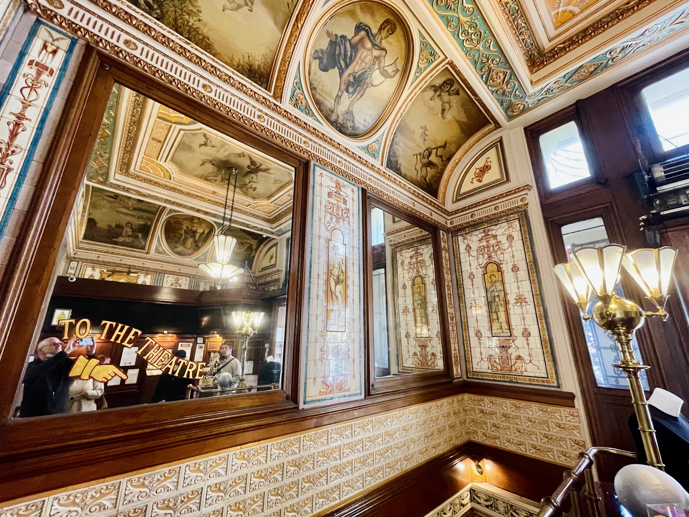
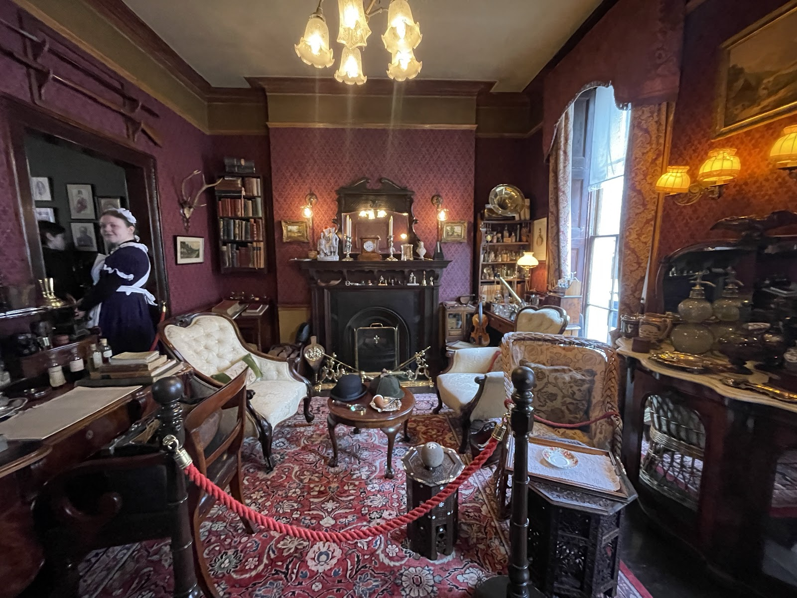
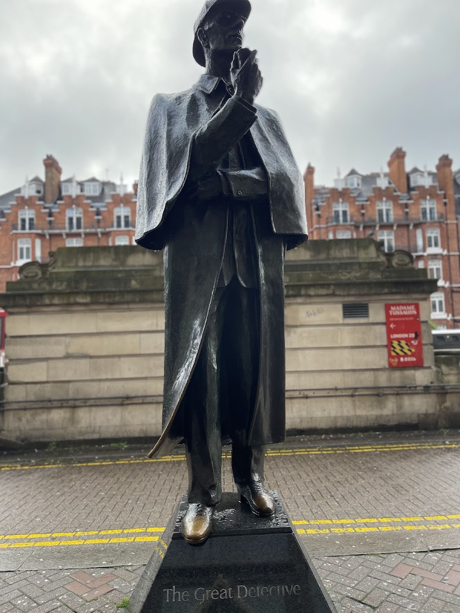
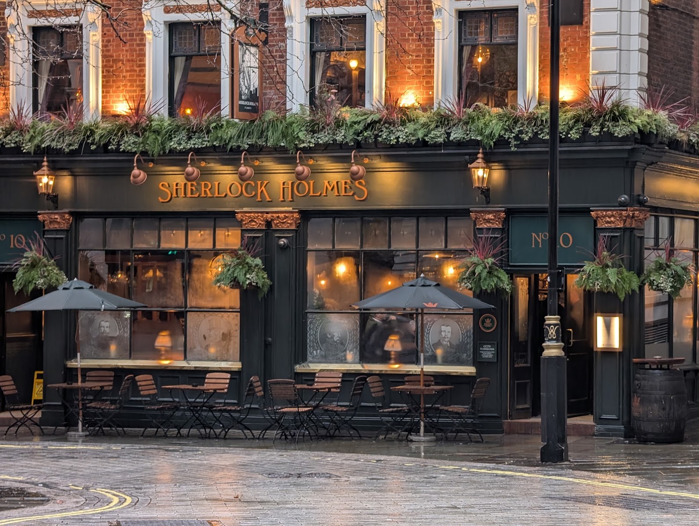
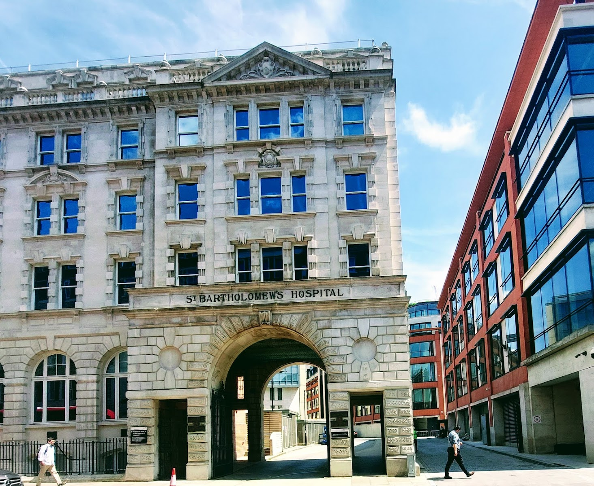
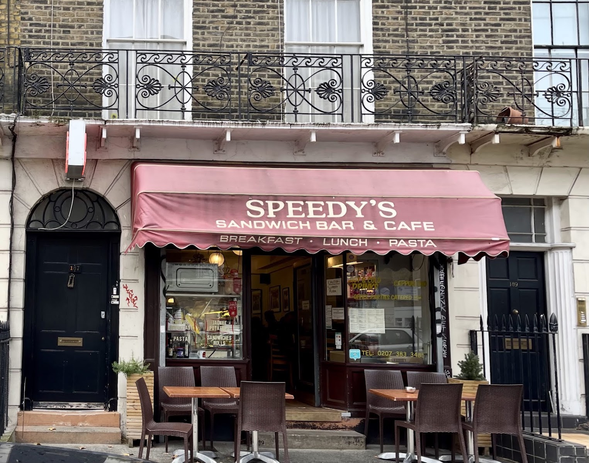
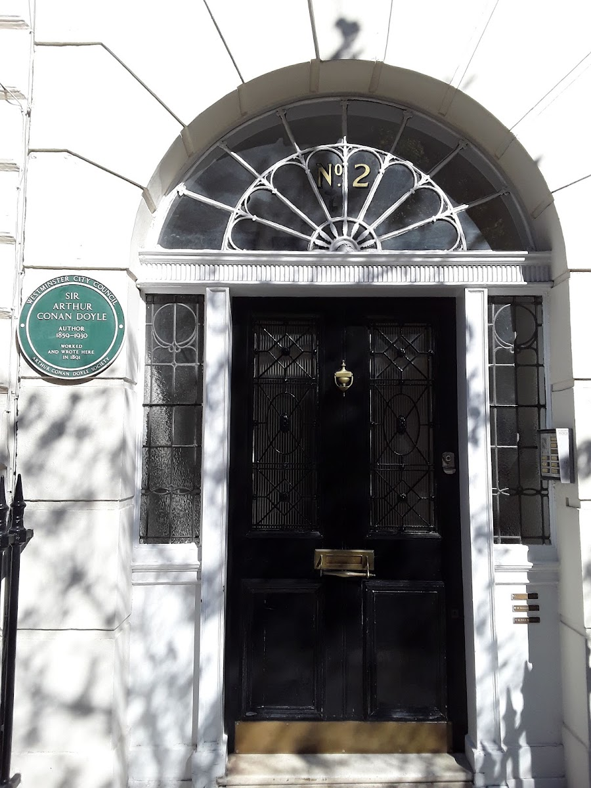
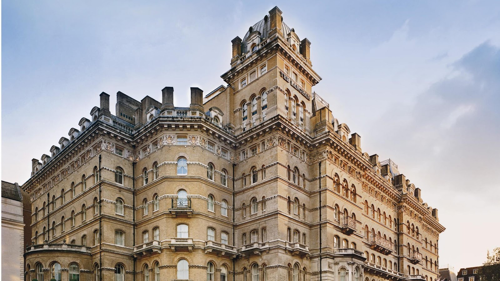

**The Sherlock Holmes Museum costs £19 and is signed 221b by arrangement: when Conan Doyle wrote the stories, Baker Street's numbers didn't reach 221.** The BBC's 221B is a mile east, near Euston Square, and Conan Doyle's own London is a consulting room on Upper Wimpole Street and a dinner at the Langham. This guide covers all three, with what each costs and how to reach it.

> 💡 **The Short Version:** **The Sherlock Holmes Museum at 221b Baker Street costs £19**, open every day, 9:30am-6pm. **Or book a guided walk from £20**, which saves working out a route between the stories' clubs, hotels and film locations; the £69 small-group tour adds Barts, Speedy's and Baker Street. **The statue outside Baker Street station is free.** **The Sherlock Holmes pub on Northumberland Street has a full recreation of his sitting room upstairs**, free to see if you buy a drink downstairs. **The BBC series filmed 221B on North Gower Street**, a mile east near Euston Square, not on Baker Street. And **St Bartholomew's Hospital is where Holmes and Watson first meet in the books, and where BBC Sherlock jumped from the roof** - the same building, both times.

> ⚠️ **The BBC's 221B isn't on Baker Street.** Sherlock filmed the flat's front door at 187 North Gower Street, a mile east near Euston Square. Baker Street has the museum and the statue.

## What it all costs

| What | Cost per adult | Status |
| --- | --- | --- |
| Statue outside Baker Street station | £0 | Free |
| North Gower Street and Speedy's exterior | £0 | Free |
| St Bartholomew's Hospital exterior | £0 | Free |
| 2 Upper Wimpole Street plaque | £0 | Free |
| The Langham's plaque and lobby | £0 | Free |
| Sherlock Holmes pub, replica study upstairs | £0 to look, pub prices to sit | Free with a drink |
| Sherlock Holmes Museum | £19 | Ticketed |
| Walking tour, cheapest (Brit Movie Tours) | £20 | Bookable |
| Small-group specialist tour | £69 | Bookable |
| Private guided tour, group of up to 15 | £180 | Bookable |
| Private black cab tour, group of up to 6 | £499 | Bookable |

## Tours

The sites are spread over Marylebone, Euston, the City and Westminster. Every address on this page is free to find alone; a tour buys the route and a guide who knows the stories.

### The walking tour, if you want one guide and a low price

**<a href="https://www.getyourguide.com/activity/-t25865?partner_id=WWP7I0R&amp;cmp=sherlock-holmes-london" target="_blank" rel="sponsored nofollow noopener" data-affiliate="gyg">London: Sherlock Holmes-Themed Walking Tour</a>**, run by Brit Movie Tours, is the most reviewed on this page: **4.7 from 815 reviews**, **£20** for **2 hours**, with free cancellation up to 24 hours ahead. It starts outside **the Criterion, 224 Piccadilly**, where Dr Watson first hears Sherlock Holmes's name in *A Study in Scarlet*. From there it works through the gentlemen's clubs and grand hotels of the stories, and on to the film and TV adaptations, from Jeremy Brett to Benedict Cumberbatch to Robert Downey Jr.

Powered by <a target="_blank" rel="sponsored" href="https://www.getyourguide.com/london-l57/">GetYourGuide</a>

### The specialist, if you want the detail

**<a href="https://www.getyourguide.com/activity/-t1199629?partner_id=WWP7I0R&amp;cmp=sherlock-holmes-london" target="_blank" rel="sponsored nofollow noopener" data-affiliate="gyg">Elementary My Dear London: The Ultimate Sherlock Holmes Tour</a>** is the highest-rated: **5.0 from 17 reviews**, **£69** for **3 hours**, kept deliberately small. The guide is a self-described "Sherlockian" who previously worked at the Sherlock Holmes Museum and has published a book on Conan Doyle's own house, Undershaw. It meets outside Embankment station and takes in Great Scotland Yard, the Sherlock Holmes pub, St Paul's, St Bartholomew's Hospital and St Bartholomew the Great, Speedy's Sandwich Bar on North Gower Street, and 221b Baker Street, with an optional museum visit at the end.

### The private options, if you'd rather not share

**<a href="https://www.getyourguide.com/activity/-t406534?partner_id=WWP7I0R&amp;cmp=sherlock-holmes-london" target="_blank" rel="sponsored nofollow noopener" data-affiliate="gyg">London: Sherlock Holmes Guided City Walking Tour</a>** is priced as a private group rather than per person: **£180 for up to 15 people**, 3 hours, **5.0 from 7 reviews**. It runs from Piccadilly to Baker Street by way of Victoria Embankment, Downing Street, Piccadilly Circus and Trafalgar Square - for a full group, that's £12 a head or less.

*The tours on this page start here, outside the Criterion at 224 Piccadilly.*

**<a href="https://www.getyourguide.com/activity/-t30595?partner_id=WWP7I0R&amp;cmp=sherlock-holmes-london" target="_blank" rel="sponsored nofollow noopener" data-affiliate="gyg">London: Sherlock Holmes Tour by Black Cab</a>** covers similar ground from the back of a chauffeured London taxi: **£499 for up to six people**, 4 hours, **4.9 from 17 reviews**. It takes in locations from the Basil Rathbone and Robert Downey Jr. films as well as the books, and more than one reviewer says it ends at the Sherlock Holmes pub.

## The Sherlock Holmes Museum, 221b Baker Street

**221b Baker St, Marylebone, London, NW1 6XE.** Open every day, **9:30am-6pm, last entry 5:30pm**. **£19 for an adult, £17 concession, £14 for a child under 16, free under 6.** Book online at sherlock-holmes.co.uk; the rooms are small and a queue is normal outside regardless.

The museum occupies a four-storey Georgian townhouse built in 1815, one minute's walk from Baker Street station in [Marylebone](/articles/marylebone-area-guide/). It has traded as the Sherlock Holmes Museum since 1990, and its own plaque on the front marks Holmes's fictional residency "from 1881 to 1904" - the dates the stories imply, not a fact about the building's real history. A costumed constable greets visitors at the door, and guides in period dress lead the way up a narrow staircase into a recreation of the sitting room, furnished with Victorian curiosities rather than anything that belonged to a real person. Photography is allowed inside; filming needs permission first.

*The room is roped off for viewing, like the rest of the museum's staged interiors.*

Baker Street's numbering hadn't reached 221 when Conan Doyle wrote the stories in the 1880s, and the museum sits, in reality, between numbers 237 and 241 - it's signed 221b by arrangement rather than by the street's actual sequence. The ground floor holds what the museum calls the largest collection of Sherlock Holmes memorabilia in the world, and the shop sells deerstalkers, pipes and books both there and at shop.sherlock-holmes.co.uk.

Powered by <a target="_blank" rel="sponsored" href="https://www.getyourguide.com/london-l57/">GetYourGuide</a>

## The statue outside Baker Street station

Free, and viewable at any hour, **outside the Marylebone Road entrance to Baker Street station**, a few minutes' walk from the museum. A three-metre bronze by the sculptor John Doubleday, commissioned in March 1998 and unveiled on 23 September 1999 by the then-chairman of Abbey National, which paid for it - the bank's old head office stood a few doors down at 215-229 Baker Street, and it once employed someone specifically to answer post addressed to "Sherlock Holmes, 221B Baker Street."

Holmes wears the deerstalker hat and Inverness cape that came from Sidney Paget's original magazine illustrations rather than Conan Doyle's own text, and holds a calabash pipe that's a later addition again.

*The deerstalker, cape and pipe all come from illustrations and later films - Conan Doyle's own text never describes them exactly like this.*

## The Sherlock Holmes pub, Northumberland Street

**10 Northumberland Street, WC2N 5DB**, between Charing Cross and Embankment stations. **Open 11am-11pm Monday to Saturday, 11am-10:30pm Sunday**; the kitchen runs to 10pm (9pm Sunday). A Greene King pub.

It began as a small hotel, briefly the Northumberland Hotel and then the Northumberland Arms - a name that appears in Conan Doyle's own 1892 story "The Adventure of the Noble Bachelor," and which some Holmes scholars think is also the hotel of the same name in *The Hound of the Baskervilles*. The Turkish baths Holmes and Watson use in the stories stood next door at 25 Northumberland Avenue; the entrance to the women's side is still visible round the back, in Craven Passage.

*A Greene King pub today, between Charing Cross and Embankment stations.*

**Its real draw is upstairs.** The collection began at the 1951 Festival of Britain, when Marylebone Public Library and Abbey National built a full recreation of Holmes's sitting room for a temporary exhibition, gathering props down to a Persian slipper for his tobacco and a gasogene for Watson's soda. After a world tour that reached New York, the brewer Whitbread bought the entire exhibit and reopened this pub under its current name in December 1957 to house it permanently. The recreation now sits behind glass on the first floor, visible from the roof terrace and the restaurant. Downstairs, the bar carries Watson's prop service revolver, theatre posters and the mounted head of the Hound of the Baskervilles.

## St Bartholomew's Hospital: the one place both stories use

**West Smithfield, EC1A**, in the [City of London](/articles/city-of-london-area-guide/). Free to view from outside; a working hospital, so keep clear of patients and staff.

In Conan Doyle's *A Study in Scarlet* (1887), Holmes and Watson meet for the first time in a chemical laboratory at Barts, where Watson - a former army doctor - is introduced as an old student of the hospital. The BBC series used the same building twice over: for its own version of that first meeting in "A Study in Pink" (2010), and for the roof Holmes appears to jump from at the end of "The Reichenbach Fall" (2012), a fall resolved the following series in "The Empty Hearse."

*Holmes and Watson meet for the first time here in Conan Doyle's 1887 novel, A Study in Scarlet.*

## North Gower Street: the BBC's 221B

**187 North Gower Street, NW1 2NJ**, three minutes from Euston Square station and a mile east of the real Baker Street, just north of [Bloomsbury](/articles/bloomsbury-area-guide/). Free to view; the flat itself is a private residence.

*The numbered door on the left, 187, is the flat; Speedy's takes the shopfront next to it.*

The production filmed here rather than on Baker Street because the real street was too busy to close for filming, and already carried too many things labelled "Sherlock Holmes" to disguise for the shoot. **Speedy's café, next door, is real and still trading.** Go in and buy something rather than only photographing the door.

## Arthur Conan Doyle's own London

Two addresses, and neither is on Baker Street.

**2 Upper Wimpole Street, Marylebone.** Conan Doyle opened a consulting room here in 1891, planning to work as an ophthalmologist after training in Vienna. By his own account no patients ever came; he wrote the first five Sherlock Holmes short stories at this address instead, while waiting for a practice that never arrived. A Westminster City Council plaque marks the building today.

*The plaque credits both Westminster City Council and the Arthur Conan Doyle Society.*

**The Langham, 1c Portland Place, W1B 1JA.** In August 1889, the American editor Joseph Marshall Stoddart hosted a dinner here that commissioned two of the era's biggest literary works in one evening: Conan Doyle went away to write *The Sign of the Four*, and Oscar Wilde went away to write *The Picture of Dorian Gray*. Conan Doyle also set scenes from that novel and from "A Scandal in Bohemia" partly at the hotel itself. A City of Westminster green plaque, unveiled in 2010, marks the dinner today.

*The 1889 dinner here produced both this book and Oscar Wilde's The Picture of Dorian Gray, commissioned the same evening.*

## One day, self-guided

Start at **Baker Street** for the free statue, then the museum. Walk the ten minutes to **Upper Wimpole Street**, then on to **the Langham** on Portland Place - both free stops, about half an hour combined once you include the walk. Take the Tube from Oxford Circus or Great Portland Street to **Euston Square** for **North Gower Street** and a coffee at Speedy's. Continue to **Barbican** for **St Bartholomew's Hospital** and Smithfield. Finish at **Embankment** for dinner and a pint at the **Sherlock Holmes pub**, and go upstairs to see the study before you leave.

| Item | Cost |
| --- | --- |
| Contactless daily cap, Zones 1-2 | £8.90 |
| Sherlock Holmes Museum | £19.00 |
| Statue, Upper Wimpole Street plaque, the Langham, St Bartholomew's exterior | £0.00 |
| Coffee near North Gower Street | £6.00 |
| Dinner and a drink at the Sherlock Holmes pub, allowance | £18.00 |
| Total per adult | £51.90 |

**Skip the museum and the day costs £32.90.**

Powered by <a target="_blank" rel="sponsored" href="https://www.getyourguide.com/london-l57/">GetYourGuide</a>

## What is not worth it

**Undershaw.** Conan Doyle's own house, where he wrote *The Hound of the Baskervilles*, is real and still standing in Hindhead, Surrey, about 40 miles from London - but since 2014 it has been Stepping Stones School, a working school for children with additional needs. It isn't a museum, it isn't in London, and it isn't a visit, whatever a tour description might imply.

**The black cab tour, solo.** £499 for up to six people is a genuinely good rate split between a group. Travelling alone, it's the most expensive way on this page to see addresses that cost nothing to reach on foot or by Tube.

## Continue planning your London trip

- 🎬 **[London Filming Locations](/articles/london-filming-locations/)**
- 🧙 **[Harry Potter in London](/articles/harry-potter-london/)**
- 🚶 **[Best Walking Tours in London](/articles/best-walking-tours-london/)**
- 🏘️ **[Marylebone Area Guide](/articles/marylebone-area-guide/)**
- 📚 **[Bloomsbury Area Guide](/articles/bloomsbury-area-guide/)**
- 🏛️ **[City of London Area Guide](/articles/city-of-london-area-guide/)**
- 🎭 **[London Theatre Guide](/articles/london-theatre-guide/)**

*Checked 15 September 2026 against operators' own websites.*
