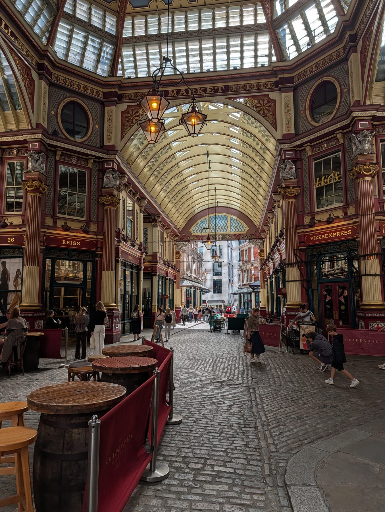
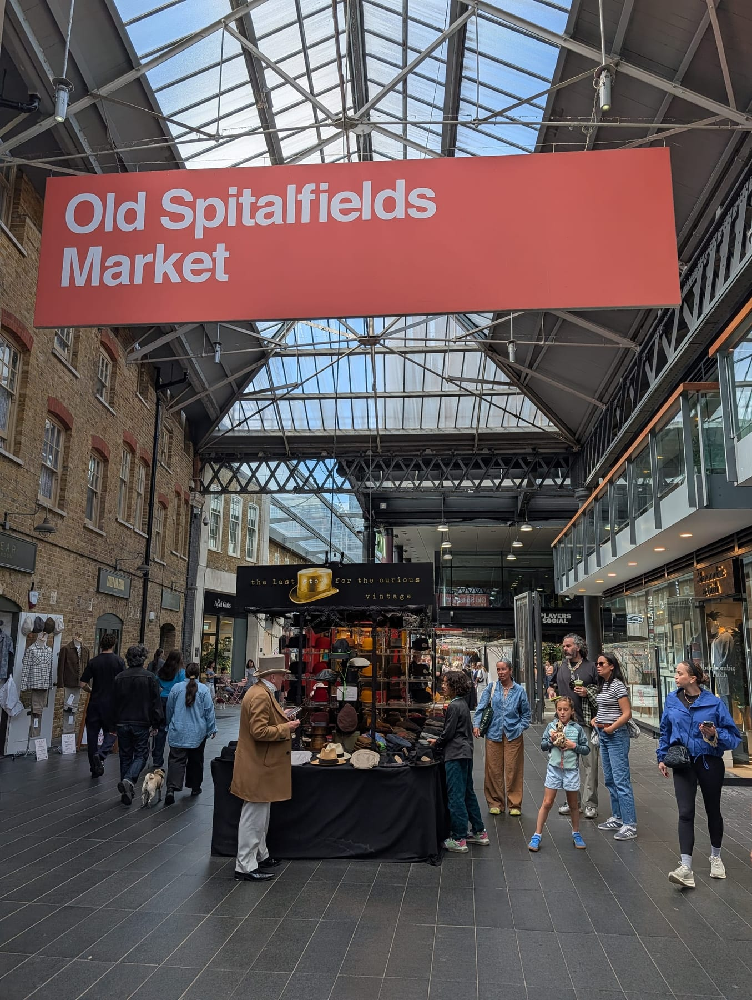
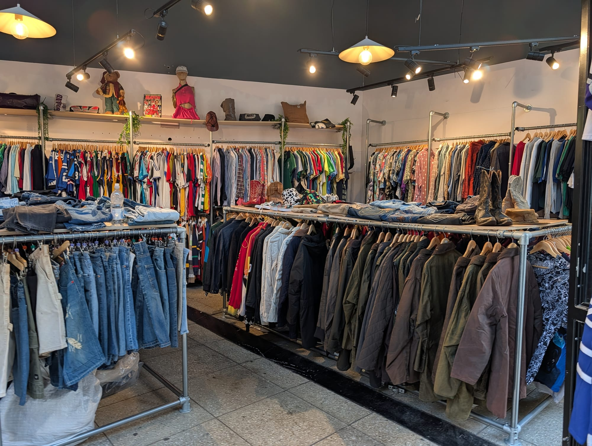
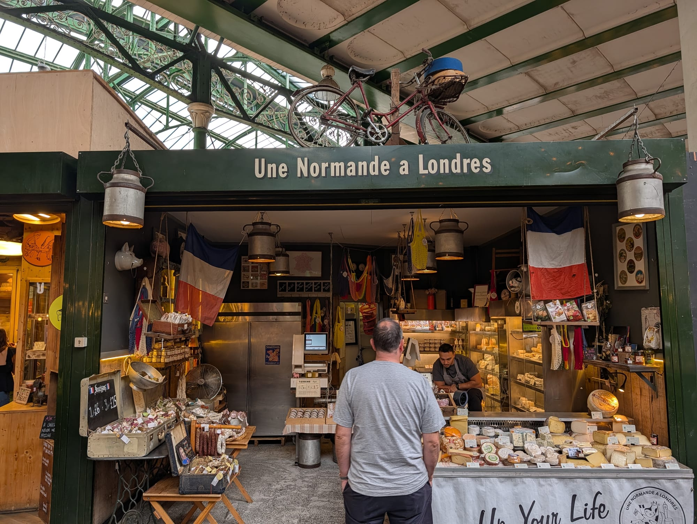

London has more good shopping than any visitor can use, and most guides list the same six streets in the same order. This one is arranged by **what you are actually trying to buy** — because someone after a wedding outfit, someone after vintage denim and someone after edible gifts to take home should not be sent to the same postcode.

Two things first, because both catch people out and neither is obvious.

> ⚠️ **You cannot claim the VAT back.** The UK **abolished tax-free shopping for visitors in January 2021** and has not brought it back. Unlike Paris, Milan or Madrid, there is **no refund desk at the airport** and no reclaiming the 20% on anything you carry home in your luggage. The one workaround: if the shop **ships it directly to an overseas address**, VAT comes off at the till. On a £2,000 purchase that is a £333 difference, so ask.

> ⏰ **Sunday is a six-hour day, by law.** The Sunday Trading Act restricts any shop **over 280 square metres** to **six hours between 10am and 6pm**. In practice most of Oxford Street trades **noon to 6pm**, with some department stores open from **11.30am for browsing only** — you can look, you cannot pay. **Small independents and markets are exempt**, which is exactly why Sunday is the best market day and the worst department store day.

> 💡 **The Short Version:** **Oxford Street** is a sight more than a shopping trip. **Regent Street** and **Bond Street** are the architecture and the luxury. **Marylebone High Street** is the one Londoners actually recommend. **Camden and Brick Lane** are vintage. **Portobello is antiques, but only on Saturday.** **Westfield London** is everything indoors. And **food is the best souvenir**, by a distance.

---

## Where to go for what

| If you want | Go to | Best day |
| --- | --- | --- |
| High street chains, all of them | [Oxford Street](#oxford-street-and-the-big-three) | Any weekday |
| Mid-range brands, grand buildings | [Regent Street](#regent-street-and-piccadilly) | Any |
| Luxury and jewellery | [Bond Street and Mayfair](#bond-street-mayfair-and-the-arcades) | Weekday |
| Independents and a village feel | [Marylebone High Street](#the-independent-streets) | Saturday |
| Vintage clothing | [Camden or Brick Lane](#vintage-and-second-hand) | Sunday |
| Antiques | [Portobello Road](#markets-and-what-day-they-actually-run) | **Saturday only** |
| Everything under one roof | [Westfield or Battersea](#malls-and-centres) | Any |
| Books and records | [Charing Cross Road, Soho](#books-records-and-specialists) | Any |
| Gifts to take home | [Food halls and markets](#what-to-actually-take-home) | Any |

---

## The streets

### Oxford Street, and the big three

**A mile and a half, about 300 shops, and half a million people a day.** Every British high street chain has a flagship here, and if you want to see them all in one walk this is the only place to do it.

**Be honest about what it is, though.** The chains are identical to the ones in every other British city and quieter everywhere else. What Oxford Street has that nowhere else does is the **department stores at the western end**:

* **Selfridges** — the best of them for actual shopping. Vast, genuinely well-curated, and the food hall and Duke Street entrance are worth it alone.
* **John Lewis** — where Londoners buy things they intend to keep. Famously price-matches.
* **Marks & Spencer** — the Marble Arch flagship.

**Practical:** Bond Street and Tottenham Court Road stations sit at either end and both are on the **Elizabeth line**, which is the fastest way in and out. Avoid Oxford Circus on a Saturday afternoon if you can — TfL periodically closes the station entrances when crowds build.

### Regent Street and Piccadilly

**The most beautiful shopping street in London**, curving from Piccadilly Circus to Oxford Circus in one continuous Nash-designed sweep — and unusually, the whole street is owned by the Crown Estate, which is why the shopfronts are coherent rather than a jumble.

Mid-to-premium rather than luxury: **Liberty** just off it on Great Marlborough Street is the essential stop — a mock-Tudor building made from two ships' timbers, and the best haberdashery, fabric and scarf departments in the country. **Hamleys** for toys, seven floors of it. **Apple, Burberry, & Other Stories, Lululemon** along the street itself.

**Just south**, Piccadilly has **Fortnum & Mason** (below) and **Waterstones Piccadilly**, the largest bookshop in Europe.

### Bond Street, Mayfair and the arcades

**Old and New Bond Street are the luxury spine** — Cartier, Tiffany, Chanel, Louis Vuitton, Hermès — plus the auction houses, **Sotheby's** on New Bond Street, whose viewing exhibitions are **free to walk into** and considerably more interesting than the shops.

**The arcades are the part people miss**, and they are the loveliest shopping in London:

* **Burlington Arcade**, off Piccadilly — **opened 1819**, the oldest of them, still patrolled by Beadles in top hats. Watches, jewellery, Manolo Blahnik, Globe-Trotter luggage.
* **Piccadilly Arcade**, **Princes Arcade** and **the Royal Arcade** nearby.
* **Jermyn Street**, one street south — **the shirt street**, and the place to buy a proper British shirt or shoe: Turnbull & Asser, New & Lingwood, Bates the hatter.

**You can walk all of the above in forty minutes**, and it costs nothing to look.

### The independent streets

This is where Londoners actually shop, and where the guides mostly do not send you.

* **Marylebone High Street** — the best of them. **Daunt Books** in its galleried Edwardian room, La Fromagerie, Cadenhead's whisky, and a Sunday farmers' market behind it.
* **Columbia Road**, Sunday only — flowers, but the **shops behind the stalls** are the real find: ceramics, prints, vintage.
* **Redchurch Street**, Shoreditch — design, denim, skincare.
* **Seven Dials and Neal Street**, Covent Garden — small brands in seven radiating streets, and **Neal's Yard Dairy** is the best cheese shop in London.
* **King's Road**, Chelsea — less punk, more homeware, and the Saatchi Gallery at the end is free.
* **Broadway Market**, Hackney — Saturday.
* **Church Street**, Marylebone — antiques, and **Alfies Antique Market**, five floors of twentieth-century design, Tuesday to Saturday.

### Carnaby and Soho

**Carnaby Street** is fourteen pedestrian streets rather than one, aimed squarely at independent and mid-market brands, and genuinely good for gifts. **Kingly Court** behind it is three galleried floors of food.

**Soho proper** is for records, instruments (Denmark Street) and books.

---

## The department stores

| Store | What it is really for | Price feel |
| --- | --- | --- |
| **Selfridges**, Oxford Street | The best all-rounder. Fashion, beauty, food hall | ££–££££ |
| **Liberty**, Great Marlborough Street | Fabric, scarves, haberdashery, the building itself | £££ |
| **Fortnum & Mason**, Piccadilly | Food and edible gifts. **The best souvenir shop in London** | ££–£££ |
| **Harrods**, Knightsbridge | The food halls. Go for those and the building | £££–££££ |
| **Harvey Nichols**, Knightsbridge | Fashion-led, less crowded than Harrods | £££–££££ |
| **John Lewis**, Oxford Street | Where Londoners buy things to keep | ££ |
| **Peter Jones**, Sloane Square | John Lewis with a nicer view | ££ |

**On Harrods specifically:** it is the one most visitors go to and the one most likely to disappoint as a *shop* — it is enormous, crowded, and the fashion floors are priced for a different customer. **The food halls are the reason to go**, and they are genuinely magnificent. There is a dress code of sorts, enforced loosely: no visible sportswear or ripped clothing.

**Fortnum & Mason is the one to save for last**, because it solves presents for everybody in one building.

---

Powered by <a target="_blank" rel="sponsored" href="https://www.getyourguide.com/london-l57/">GetYourGuide</a>

## Markets, and what day they actually run

**The day matters more than anything else in this section.** Turning up on the wrong one is the single commonest London shopping mistake.

| Market | What for | Days |
| --- | --- | --- |
| **Portobello Road** | **Antiques** | **Antiques Saturday only.** General market Mon–Wed and Fri; **Thursday half day, closes 1pm**; no street market Sunday |
| **Camden Market** | Vintage, gifts, food | **Daily, 10am–7pm** |
| **Old Spitalfields** | Design, prints, vintage | Daily; themed days, busiest Sunday |
| **Brick Lane / Truman Brewery** | Vintage, records | **Sunday** is full strength |
| **Columbia Road** | Flowers, and the shops behind | **Sunday only**, 8am–3pm |
| **Broadway Market** | Food, makers | **Saturday** |
| **Greenwich Market** | Crafts, makers | Wed–Sun |
| **Borough Market** | Food | **Closed Monday** |
| **Leadenhall Market** | The building, mostly | Weekdays |

*Leadenhall is a shopping arcade you visit for the architecture — it empties at the weekend, which is when it looks best.*

**Portobello deserves the warning in bold.** It is famous for antiques and the antiques are **Saturday only**. Arrive before 10am — by midday the northern end is impassable. The rest of the week it is a good general market and a poor antiques one.

*Spitalfields runs every day, which makes it the reliable one when you have got the day wrong somewhere else.*

**[The full markets guide →](/articles/best-london-markets/)**

---

## Vintage and second-hand

London is one of the best cities in Europe for this, and prices span an enormous range.

* **Camden** — the biggest concentration. **Stables Market** is the serious end; expect **£15–£60** for a decent piece, more for branded denim or leather.
* **Brick Lane** — **Sunday** especially. Kilo sales (buy by weight) run regularly at the Truman Brewery and are the cheapest way in.
* **Beyond Retro**, **Rokit** and **Blitz** — the reliable chains, Dalston and Shoreditch.
* **Charity shops in wealthy postcodes.** Chelsea, Marylebone, Hampstead and Primrose Hill are where the good donations land. This is the genuine insider tip in this section.
* **Alfies Antique Market**, Marylebone — twentieth-century design and vintage fashion, five floors, Tuesday to Saturday and far calmer than Portobello.

*Camden is the volume option. Go on a weekday if you want to actually look at anything.*

---

## Malls and centres

For when it is raining, or you want everything in one building.

* **Westfield London**, Shepherd's Bush — **the largest shopping centre in Europe**. Everything from Primark to Louis Vuitton, plus **The Village** for luxury. Typically **10am–9pm**, and the Sunday six-hour rule applies to the big units.
* **Westfield Stratford City** — nearly as large, next to the Olympic Park, and generally less crowded.
* **Battersea Power Station** — the newest, and worth going to for the building whether or not you buy anything. Direct on the Northern line.
* **Coal Drops Yard**, King's Cross — small, design-led, in restored Victorian coal warehouses. The best-looking of them.
* **One New Change**, by St Paul's — mid-market shops, but the **free roof terrace** has the best close view of the cathedral in London.
* **Brent Cross** and **Bluewater** — big, out of town, for serious volume shopping.

---

## Books, records and specialists

* **Books:** Waterstones Piccadilly (Europe's largest), **Daunt** Marylebone, **Foyles** Charing Cross Road, **Hatchards** on Piccadilly (**London's oldest bookshop, 1797**), **Cecil Court** for antiquarian, and the **South Bank Book Market** under Waterloo Bridge — second-hand books outdoors, daily.
* **Records:** **Sister Ray** and **Reckless** in Soho, **Rough Trade East** on Brick Lane, **Honest Jon's** in Ladbroke Grove, and the Berwick Street stretch.
* **Instruments:** **Denmark Street**, though it is much reduced from what it was.
* **Art supplies:** **Cass Art**, Islington.
* **Maps and travel:** **Stanfords**, Covent Garden.
* **Tea:** **Postcard Teas** in Mayfair, **Fortnum's** for gifting.

---

## What to actually take home

**Food is the best souvenir from London** — it is cheaper than fashion, more distinctive than a keyring, and it survives the flight.

| What | Where | Rough price |
| --- | --- | --- |
| Tea | Fortnum & Mason, Postcard Teas | **from ~£6** a caddy |
| Cheese | Neal's Yard Dairy, Borough Market | **~£8–£20** a wedge |
| Marmalade and preserves | Fortnum's, Borough | **£5–£12** |
| Gin | The distilleries, Gerry's in Soho | **£30–£45** |
| Biscuits and shortbread | Fortnum's, M&S | **£5–£15** |
| Liberty print scarf or fabric | Liberty | **£40+** |
| Prints and art | Spitalfields, Columbia Road, Greenwich | **£15–£60** |
| Vintage clothing | Camden, Brick Lane | **£15–£60** |
| A proper British shirt | Jermyn Street | **£90–£200** |
| British-made shoes | Jermyn Street, Northampton brands | **£150–£400** |

*Neal's Yard and Borough will vacuum-pack cheese for travel if you ask — say you are flying.*

> ⚠️ **Check what you can take home.** Meat and dairy have restrictions entering many countries, including the EU and the US. Cheese is fine for most of Europe and **not permitted into the United States** in many forms. Ask the stall, and check your own country's rules before you buy £40 of Stilton.

---

## What things actually cost

Rough, honest bands for planning:

* **High street outfit:** £60–£150
* **Designer handbag:** £900 upwards, and Bond Street is the same price as everywhere else
* **Cashmere jumper:** from £120 at John Lewis, £250+ at the specialists
* **Vintage jacket:** £40–£120
* **A record:** £20–£35 new, £5–£15 second-hand
* **A book:** £9–£20 paperback
* **Lunch while shopping:** £8–£15 at a market, £20+ sitting down

**Sales:** the big ones are **late December to January** and **late June to July**. **Bicester Village** an hour out is the outlet option, and it is extremely busy at weekends.

---

Powered by <a target="_blank" rel="sponsored" href="https://www.getyourguide.com/london-l57/">GetYourGuide</a>

## Practicalities

**Cards everywhere.** Contactless is universal; many places no longer take cash at all. You do not need to carry notes.

**Opening hours**, broadly: **Mon–Sat 10am–7pm** (later on Thursdays in the West End), **Sunday 12–6pm** for anything large. Markets are their own thing — see the table above.

**Left luggage** exists at the big stations if you are shopping on a travel day, and Selfridges and Harrods will hold bags for customers.

**The best time to shop** is a weekday morning. Saturday afternoon on Oxford Street is genuinely unpleasant, and it is not better shopping — it is the same shops with more people in them.

---

## Continue planning your London trip

- 🏪 **[The Best Markets in London](/articles/best-london-markets/)** — every market, and what day it runs
- 🍽️ **[The Best Street Food in London](/articles/best-street-food-london/)** — the food halls, compared
- 💷 **[London on a Budget](/articles/london-on-a-budget/)** — including a day that costs nothing
- 🧭 **[Best Areas to Visit in London](/articles/best-areas-to-visit-london/)** — where the shopping streets actually sit
- ☔ **[London in the Rain](/articles/london-in-the-rain/)** — for when the malls become the plan
