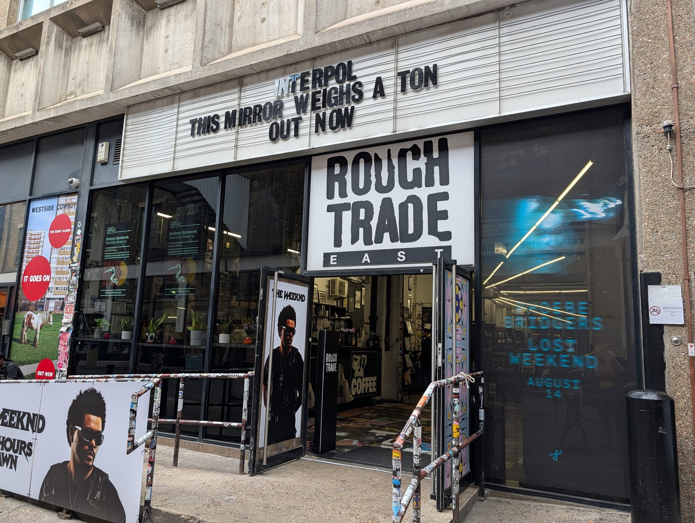
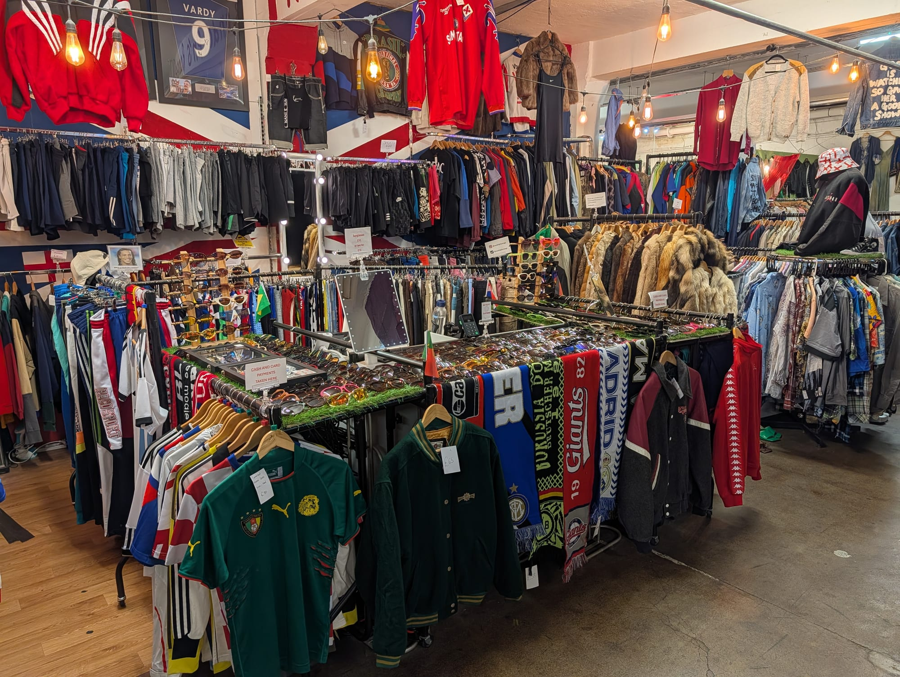
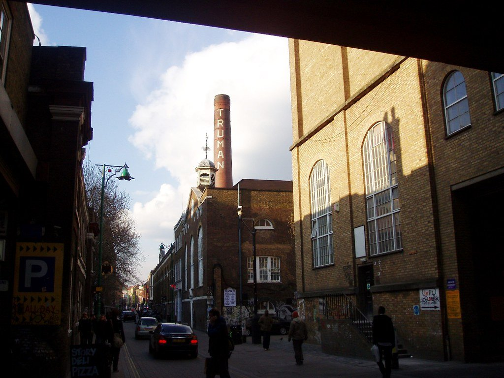

Shoreditch sits immediately north of the City, and the boundary is abrupt: glass towers on one side, Victorian warehouses and painted walls on the other. It has been a garment district, a furniture district, and — since the 1990s — the centre of London's creative and nightlife scene.

The two things worth planning around are the markets, which mostly run at the weekend, and the street art, which changes constantly.

**This guide covers Shoreditch, Spitalfields, Brick Lane and Hoxton together.** They run into one another with no gap, and nobody walking between them notices a boundary — Old Spitalfields Market to the Truman Brewery is eight minutes, and Hoxton Square is ten minutes the other way. Splitting them into separate guides would mean four thin pages and a reader bouncing between them to plan one afternoon.

Shoreditch has its own share of the commemorative plaques marking where notable people lived or worked - see them on our [interactive map](/plaques/?area=shoreditch).

## Why visit — and who should skip it

**Come here if** you like markets, vintage, street food or street art. On a Sunday this is the best few hours in London for wandering: four separate markets within twenty minutes' walk of each other, plus the flower market north-east.

**Skip it if** you come midweek expecting the weekend version. Monday to Thursday, Brick Lane is a fairly ordinary street and most of the markets are shut. Also skip it if you want traditional sights — there are none.

## Top sights and activities

1. **The street art** — Hanbury Street, Chance Street, Redchurch Street, Grimsby Street and the Truman Brewery walls. It is repainted constantly, so treat it as a walk rather than a checklist.
2. **Old Spitalfields Market** — A covered Victorian market hall trading daily, with different themes by day: antiques on Thursday, records on Friday, general and vintage at the weekend.
3. **Brick Lane** — Bangladeshi restaurants at the south end, vintage and street food around the Truman Brewery, and the 24-hour bagel bakeries at the north.
4. **Columbia Road Flower Market** — Sundays only, 08:00 to 15:00. Fifteen minutes north-east, and one of the best hours in London.
5. **The Truman Brewery** — A former brewery complex holding seven separate markets, food halls, studios and event space either side of Brick Lane. Not all of them run on the same days.
6. **The Brick Lane Vintage Market** — The UK's biggest dedicated vintage market, in a 13,000 sq ft basement under the Truman Brewery, with around forty traders. **Open seven days a week**, unlike almost everything around it.
7. **Dennis Severs' House** — A candlelit Georgian house on Folgate Street presented as if the family has just left the room. Silent, strange and unlike anything else in the city. Booked in advance.
8. **Boxpark Shoreditch** — Shipping containers stacked into a food and retail court by Shoreditch High Street station.

*Shoreditch changes month to month. Nothing here is permanent, which is the reason to walk it more than once. Photo: [Loco Steve](https://www.flickr.com/photos/36989019@N08/39711836800), [CC BY-SA 2.0](https://creativecommons.org/licenses/by-sa/2.0/).*

Powered by <a target="_blank" rel="sponsored" href="https://www.getyourguide.com/london-l57/">GetYourGuide</a>

## Key streets and micro-districts

### Brick Lane and the Truman Brewery

The spine of the area, and it changes character three times along its length. **Bangladeshi restaurants at the south end** around the mosque, where the touts work the pavement and the good ones do not need to. **The Truman Brewery in the middle**, which is where most of what people come for actually is. **The 24-hour bagel bakeries at the north end**, where Beigel Bake has been selling salt beef through the night since 1974.

The **Truman Brewery** itself is the thing to understand: brewing stopped in 1989, and the buildings on both sides of Brick Lane now hold seven separate markets, studios, galleries and event space. They do not all run on the same days, which is the single most common way to get this wrong.

**Rough Trade East** is on Dray Walk inside the complex — a record shop with a stage at the back, and in-store gigs that are free with an album purchase.

*Rough Trade East, on Dray Walk inside the Truman Brewery. A record shop with a stage at the back — in-store gigs are free with an album purchase.*

### The Brick Lane Vintage Market

**The biggest dedicated vintage clothing market in the UK**, and the one thing in this area that is genuinely open seven days a week — which almost nobody realises, because everything around it is a weekend affair.

It is **underground**, in F Block at 85 Brick Lane, down a neon-lit staircase off the street: more than 13,000 square feet of basement holding **around forty specialist traders**, drawn from across the UK and Europe rather than a rota of local stalls. Each one is effectively its own boutique with its own eye, so the same aisle runs from restrained to completely mad within a few metres.

**The range is the point, and it is much wider than "vintage" suggests.** Clothes from the **1920s right through to the 1990s** — flapper dresses at one end and shell suits at the other — plus **fur and feather capes, vintage bridal wear, men's tailoring, hats, sunglasses, bags and jewellery**, and racks of **vinyl** to flick through between the clothes. It is one of the few markets in London where you can dress an entire period costume, find a wearable 1970s overcoat, and buy a record, without going back up the stairs.

**Open every day: Monday to Friday 11am–6.30pm, Saturday 11am–6pm, Sunday 10am–6pm.** Go on a weekday if you want to actually look at things — the Sunday crowd makes browsing rails difficult, and the traders have more time for you when it is quiet. Prices are per item and vary hugely by stall; haggling is normal on anything above about twenty pounds.

*The vintage market under the Truman Brewery. Forty traders across a basement floor, open every day of the week.*

**Next door, the Backyard Market** is the other half of the same trip: independent designer-makers inside a repurposed warehouse set back from Brick Lane, with street food stalls out front on the street. **Saturday 11am–6pm and Sunday 10am–6pm only** — so on a weekday, the vintage market is the one that is open.

### Spitalfields

Around the covered market hall, and the most architecturally intact corner of the area by a distance. **Fournier Street and Princelet Street** are terraces of Georgian houses built for **Huguenot silk weavers** who arrived as refugees from France in the late 1600s — the wide upper windows are weavers' lofts, put there to get light onto the looms.

Walk them slowly and look up. Many are still lived in, several by artists who bought them when the area was cheap, and **Dennis Severs' House** on Folgate Street is the one you can go inside: a candlelit Georgian house presented as though the family has just left the room, silent and staged and unlike anything else in London. Book ahead.

**Old Spitalfields Market** itself trades daily under a Victorian roof, with a different theme by day — antiques on Thursday, records on Friday, general and vintage at the weekend — and The Kitchens, a dozen food counters around shared tables, is the most reliable weekday lunch in the area.

*The Kitchens at Old Spitalfields — a dozen counters around shared tables, and the most reliable weekday lunch in the area.*

### Redchurch Street and Chance Street

The design end, and the part of Shoreditch that gentrified hardest. **Redchurch Street** is a short run of independent fashion, skincare and homeware shops with coffee between them — the sort of street where a shop sells eight objects and all of them are beautifully lit.

**Chance Street and the alleys off it carry the densest run of murals in the area**, and they change constantly. This is where street art tours end up, and where you are most likely to see someone actually painting on a weekday morning.

It is a ten-minute walk end to end and worth doing between the markets rather than as a destination in itself.

### Old Street

North-west, around the roundabout that spent a decade being called Silicon Roundabout. It is the **loudest corner of the area after dark** — bars, clubs and late licences — and the least interesting during the day, when it is mostly tech offices and building sites.

The roundabout itself was rebuilt into a proper public space with a new station entrance, which improved it considerably. **Come here for a night out rather than an afternoon**, and know that the good bars are on the streets leading off it rather than on the junction.

### Hoxton
North of Old Street and noticeably calmer. **Hoxton Square** is a proper garden square with bars around it, and the **Museum of the Home** — a row of eighteenth-century almshouses laid out as domestic rooms from 1600 to now, free to enter — is a five-minute walk further north. Most people never get this far and it is the part of the area that still feels residential.

It is also where the drinking gets more civilised. The bars around the square and along **Hoxton Street** are pubs and neighbourhood places rather than the queue-and-bouncer operations by Old Street roundabout, and **Hoxton Street Market** trades on weekdays as a genuine local street market with none of the tourist traffic. Ten minutes' walk from Shoreditch High Street and a noticeably different evening.

### Columbia Road

North-east, and an ordinary residential street for six days of the week — then, on **Sunday from 8am to around 3pm**, a wall of flowers and one of the best hours in London.

The trick is the timing, and it cuts both ways. **Go at 8am** and you can move, talk to the growers and photograph the street. **Go in the last hour** and the traders cut prices hard to avoid carting stock home — that is when you hear the shouting the market is famous for. The middle of the day is shoulder to shoulder and not much fun.

The **shops along the street are open on Sunday too** and are the reason to stay: independent ceramics, prints, vintage and a couple of very good bakeries, all trading off the market's crowd. It is fifteen minutes' walk north-east of Brick Lane.

*The Truman Brewery. Brewing stopped in 1989 and the buildings now hold markets, studios and bars across both sides of Brick Lane. Photo: [Ewan-M](https://www.flickr.com/photos/55935853@N00/2403737549), [CC BY-SA 2.0](https://creativecommons.org/licenses/by-sa/2.0/).*

## Where to eat and drink

| Spot | Style | Price | Why go |
| --- | --- | --- | --- |
| **Beigel Bake** | Salt beef bagels | £ | Brick Lane, open 24 hours, cash-cheap and always busy |
| **Dishoom Shoreditch** | Bombay-inspired Indian | ££ | The verandah room; expect to queue without a booking |
| **Old Spitalfields Market** | Food stalls | £ | Covered, daily, and the safe bet in bad weather |
| **Smoking Goat** | Thai barbecue | ££ | Shoreditch High Street; walk-in only downstairs |
| **The Ten Bells** | Historic pub | ££ | Beside Spitalfields, with its Victorian tiling intact |
| **Brick Lane Sunday food halls** | Street food | £ | Truman Brewery; dozens of traders under cover |
| **Upmarket, Brick Lane** | Street food | £ | Truman Brewery food hall, daily 11am–6pm, and the cheapest grazing here |

*Boxpark, built out of shipping containers in 2011. The upper deck is food stalls and long shared tables. Photo: [JasonParis](https://www.flickr.com/photos/94064020@N00/8063833095), [CC BY 2.0](https://creativecommons.org/licenses/by/2.0/).*

## Getting there

**By Overground.** **Shoreditch High Street** puts you at Boxpark and two minutes from Brick Lane. It is the closest station and the least crowded.

**By Tube and Elizabeth line.** **Liverpool Street** is a ten-minute walk south and far better connected — Elizabeth line, Central, Circle, Metropolitan and Hammersmith & City. **Old Street** (Northern) serves the north-west.

**Best exit.** From Liverpool Street, use the **Bishopsgate** exit and walk north — it takes you past Spitalfields on the way.

**On foot.** Fifteen minutes to the Tower, fifteen to St Paul's. The Elizabeth line reaches Canary Wharf from Liverpool Street in six minutes.

## How long to spend, and when to go

| If you have | Do this |
| --- | --- |
| **Two hours** | Spitalfields, Brick Lane and the Hanbury Street murals |
| **Half a day** | Add the Truman Brewery markets and Redchurch Street |
| **A full Sunday** | Start at Columbia Road at 08:00, then work south through everything |

**Best time:** Sunday. Every market runs, and the day rolls naturally into the evening bars.

**Avoid:** Monday to Wednesday if markets are your reason for coming — most are closed and the area is quiet.

## Suggested Sunday route

1. **Start:** **Columbia Road Flower Market** at 08:30, before the crush.
2. **South to Brick Lane:** Through Hackney Road to the **Truman Brewery** food halls.
3. **Street art:** West along **Hanbury Street** and **Chance Street**.
4. **Redchurch Street:** The independent shops and more murals.
5. **Spitalfields:** South to **Old Spitalfields Market** and the Georgian streets around Fournier Street.
6. **Finish:** A salt beef bagel at **Beigel Bake**, or a drink at The Ten Bells.

## Common mistakes to avoid

1. **Coming on a Monday or Tuesday expecting the full picture.** Most of the markets do not run. The exceptions are worth knowing: **Old Spitalfields trades daily**, and so does the **Brick Lane Vintage Market**, which is the best reason to come midweek.
2. **Missing Columbia Road.** Sunday morning only, fifteen minutes away, and the best of the lot.
3. **Following an old street art map.** Pieces are painted over within months. Walk the streets rather than hunting specific murals.
4. **Being pulled into a Brick Lane restaurant by a tout.** The touts are a reliable signal to keep walking.
5. **Arriving at Columbia Road at midday.** By then it is shoulder to shoulder. Go at 08:30 or in the final hour for discounts.
6. **Assuming Shoreditch High Street is on the Tube.** It is Overground only. Liverpool Street is the Tube option.

## Where to stay

Lively, well connected and good value against Zone 1 proper — but genuinely loud at weekends.

- **Shoreditch and Old Street** — Design-led hotels in converted warehouses. Book away from the street.
- **Liverpool Street and Aldgate** — Ten minutes south, quieter at night, excellent transport including the Elizabeth line.
- **Whitechapel** — East and cheaper, on the Elizabeth line and District line.
