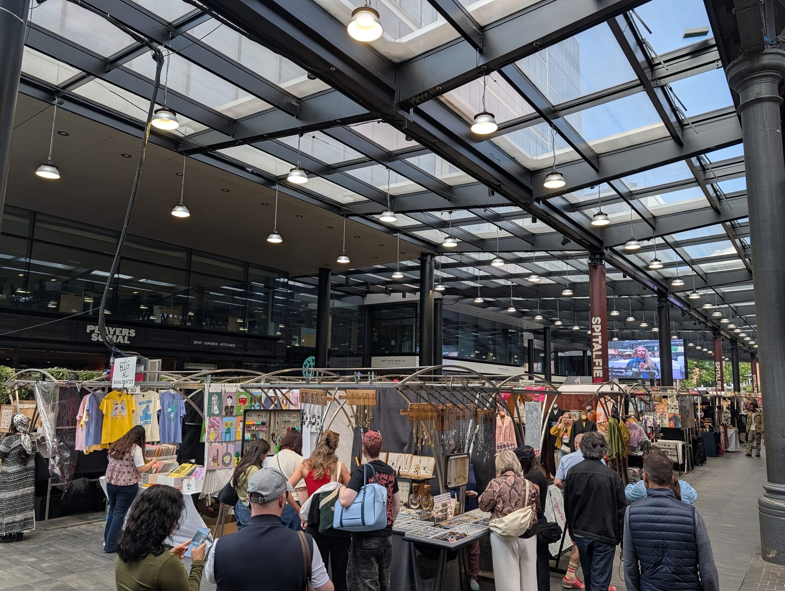

Almost every guide to this part of London tells you where to go. Very few tell you **which day**, and here that is the only question that matters.

Columbia Road exists on a Sunday and does not exist on a Tuesday. The Brick Lane street market is a Sunday. Four of the Old Truman Brewery's eight markets are weekends only. Christ Church Spitalfields opens its doors to visitors for three hours a week. Petticoat Lane is two different markets on two different streets depending on whether it is a weekday or a Sunday. Turn up on a Wednesday with a Sunday itinerary and you will walk past a lot of shutters.

**This route runs north to south**, from Columbia Road Flower Market down through the Boundary Estate and the length of Brick Lane, and finishes at Petticoat Lane. Eleven numbered stops, **2.6km measured and about 35 minutes of actual walking** — call it a half day once the markets get involved. It is free apart from what you buy.

For the wider area — the bars, Hoxton, where to stay — see the [Shoreditch area guide](/articles/shoreditch-area-guide/). This is the walking route version of it.

> 💡 **The Short Version:** Go on a **Sunday** and start at **Columbia Road at 8am**, because it shuts at about 3pm and does not run any other day. Walk **south** the whole way. The stop people miss is the **Brick Lane Vintage Market**, a basement under the Truman Brewery that is the only thing here open **seven days a week**. **Christ Church** lets visitors in on **Sunday afternoons only**. There are **two bagel shops**, not one. Finish at **Petticoat Lane**, then Liverpool Street.

## The route

  

    Map of the walk, numbered in walking order
  

  

    
Loading the map…

  

  

    <i class="route-map-marker" aria-hidden="true">1</i> On the route, in walking order
    <i class="route-map-marker route-map-marker--alt" aria-hidden="true">+</i> Optional detour
  

  <noscript>
    
The map needs JavaScript. Every stop below is numbered in walking order with its nearest station.

  </noscript>

**[Open the whole route in Google Maps →](https://www.google.com/maps/dir/?api=1&origin=51.529218,-0.06962&destination=51.516593,-0.074856&waypoints=51.526042,-0.074906%7C51.524449,-0.074633%7C51.524512,-0.071753%7C51.521267,-0.071908%7C51.520478,-0.072303%7C51.520287,-0.070903%7C51.519441,-0.072051%7C51.519122,-0.07375%7C51.519594,-0.075373&travelmode=walking)** — all eleven stops in walking order, set to walking directions, which is the version to put on your phone.

| # | Stop | Cost | Open |
| --- | --- | --- | --- |
| **1** | Columbia Road Flower Market | Free to walk | **Sunday only**, 8am–3pm |
| **2** | Arnold Circus & the Boundary Estate | Free | Always |
| **3** | Redchurch Street | Free to walk | Shop hours; street always |
| **4** | The two bagel shops | Free to walk | Beigel Bake **24 hours, 7 days** |
| **5** | The Old Truman Brewery | Free | **Eight markets, different days** |
| **6** | Brick Lane Vintage Market | Free to enter | **Seven days** |
| **7** | Hanbury Street & the street art | Free | Always |
| **8** | Brick Lane's south end & the Jamme Masjid | Free to walk | Street market **Sunday only** |
| **9** | Fournier Street & Christ Church | Free | Church **Sunday 1–4pm only** |
| **10** | Old Spitalfields Market | Free | Seven days, themed by day |
| **11** | Petticoat Lane | Free | **Sunday and weekdays, two sites** |
| **+** | Dennis Severs' House | **£16 + fee** | **Friday to Sunday only** |

---

## 1. Columbia Road Flower Market

**Sunday, from 8am until about 3pm.** The market's own site gives the hours as "8am 'til 3'ish"; Tower Hamlets, which licenses it, has the traders down until 2pm. Treat the last hour as the wind-down rather than a guarantee.

There is no midweek version. Six days a week Columbia Road is a quiet Victorian terrace in Bethnal Green; on the seventh it is a solid wall of cut flowers and potted plants with growers shouting over the top of them, and it is the best hour on this walk by a distance.

**Go at 8am or after 2pm, and not in between.** Early gets you room to move, the pick of the stock and a conversation with the person who grew the thing. The last hour is when traders cut prices hard rather than cart stock home, and it is where the shouting the market is famous for actually happens. Between about ten and one you are wedged in a crowd, unable to carry a plant.

**The shops are half the reason to come.** The market's own site counts around **sixty independent businesses** along the street — galleries, ceramics, vintage, delis, a perfumer, bakeries — and they open on Sunday because the market does. Some also trade during the week, which is worth knowing if you are here on a Saturday and want the street without the crush.

> ⚠️ **If you are not walking on a Sunday, start at stop 2 instead.** Columbia Road is not a thin version of itself midweek; it is a residential street. Arnold Circus is six minutes' walk south and the route works perfectly well from there.

## 2. Arnold Circus and the Boundary Estate

Six minutes south, and the stop nobody has heard of.

**Seven streets converge on a raised circular garden with a bandstand on top of it.** That is the centre of the **Boundary Estate**, and Historic England has the whole thing on the register — the gardens as a Grade II registered park and garden, the bandstand listed separately.

The history is worth two minutes. In 1890 the London County Council used the new Housing Act to clear the **Old Nichol**, a slum on this site, under what became the Boundary Street Improvement Scheme. It covered six hectares and **displaced 5,719 people**; **4,600** were rehoused in the blocks you are standing among. The revised plan — blocks along tree-lined avenues radiating from a central circus — was approved in 1893 and **the scheme was finished by the end of 1900**. Historic England calls it the first major initiative the LCC undertook in improving its housing stock, and says the estate "provided the inspiration of many later housing developments".

The mound itself has a good story attached and a better one on the record: **the earth came from the foundations of the new blocks**, heaped up at the centre of the radial plan. Saving on cartage was the convenient part; the stated purpose was to give the new community something to be arranged around.

**The bandstand went up in 1899.** Four sets of steps at the compass points take you up two tiers of terracing to it. It is free, it is open, and on a weekday morning you will have it to yourself.

## 3. Redchurch Street

Two minutes further and the tone changes completely.

**Redchurch Street is the design end of Shoreditch** — a short run of independent fashion, skincare, homeware and coffee, the sort of street where a shop sells eight objects and every one of them is beautifully lit. Ten minutes end to end.

The reason it is on the route rather than in a shopping guide is what runs off it. **Chance Street and the alleys around it carry the densest concentration of murals in the area**, and they are repainted constantly. This is where the street art tours end up and where you are most likely to find someone actually working on a wall on a weekday morning.

**Do not come with a list.** Pieces here last months rather than years. The mural you saw online has a decent chance of being gone, and the one that replaced it is the point.

## 4. The north end of Brick Lane and the two bagel shops

You join Brick Lane at the railway bridge, and this is where the walk properly starts.

**There are two bagel shops here, not one, and this is the thing that catches people out.** They are a few doors apart, both with queues, both selling salt beef beigels, and both are separate businesses:

- **Beigel Bake, 159 Brick Lane** — **open 24 hours, seven days a week**, which its own site states plainly and which is the fact everyone half-remembers.
- **The Beigel Shop, 155 Brick Lane** — the yellow-fronted one, four doors down, and a completely separate business.

So "the 24-hour bagel place on Brick Lane" sends you to a street with two bagel shops on it, and telling someone to look for the yellow sign sends them to the other one. **[Our sandwich guide has the full story →](/articles/best-sandwiches-london/)** — which family runs which, what each is better at, and what a salt beef beigel costs.

**On a Sunday the street around them is a market.** Tower Hamlets licenses the Brick Lane street market for **Sundays, 10am to 3pm**, and it has been running here since 1888 — flea-market stalls, household goods, retro fashion and food, filling the road under and around the bridge. On every other day this stretch is a road with two bagel shops on it.

*Brick Lane under the railway bridge on a Sunday, a minute from both bagel shops. This is the same road on a Tuesday, minus every stall in the photograph.*

Powered by <a target="_blank" rel="sponsored" href="https://www.getyourguide.com/london-l57/">GetYourGuide</a>

## 5. The Old Truman Brewery

Brewing stopped here in 1989. What replaced it is the single most confusing thing in east London to plan around, so here it is properly.

**The brewery's own site currently lists eight separate markets** across the buildings on both sides of Brick Lane, and **they do not run on the same days**:

| Market | Where | Days |
| --- | --- | --- |
| **Brick Lane Vintage Market** | F Block, 85 Brick Lane | **Seven days** |
| **Upmarket** | 83 Brick Lane | **Seven days** |
| **Ely's Yard food trucks** | Ely's Yard | **Seven days** |
| **Artisan** | Above the vintage market, 85 + 83 | **Thursday to Monday** |
| **Backyard Market** | 146 Brick Lane | **Saturday & Sunday** |
| **The Tea Rooms** | Next to 146 Brick Lane | **Saturday & Sunday** |
| **Rinse Showrooms** | U Block, by 146 Brick Lane | **Saturday & Sunday** |
| **Provisions** | G1 Ely's Yard | **Saturday & Sunday** |

Weekend hours across all of them are broadly **Saturday 11am–6pm and Sunday 10am–6pm**; the seven-day ones open **11am–6pm Monday to Saturday** with a 10am start on Sunday. **Artisan is the odd one** — a curated floor of makers above the vintage market, open Thursday to Monday, so it is the market that catches out a Tuesday or Wednesday visit.

**Upmarket, at 83 Brick Lane, is the food answer.** Its operator puts it at **over forty street food traders** — Ethiopian, Korean, arepas, Japanese shaved ice — and it is open every day, with a retail section that only appears at weekends. Ely's Yard behind it is outdoor food trucks, also seven days.

*Rough Trade East on Dray Walk, inside the brewery complex. Its own listing calls this the flagship UK store — 5,000 square feet, a bar, a photobooth, and live events seven days a week.*

**Rough Trade East is on Dray Walk**, inside the complex, and it is open daily. In-store gigs run on the stage at the back and the shop is free to walk into either way.

> ⚠️ **The Boiler House is not one of these.** Older guides still send people to a Boiler House food hall on Brick Lane; it does not appear anywhere on the Truman Brewery's own site, on the markets page or elsewhere. Do not plan a lunch around it.

## 6. The Brick Lane Vintage Market

**The one place on this walk that is never shut, and the reason a midweek version of this route still works.**

It is underground. You go down a neon-lit staircase off Brick Lane into the basement of **F Block at 85 Brick Lane**, and the operator's description of it is "an iconic underground vintage haven and the largest vintage market in the UK" with **over 100 shops** in it. Traders come from across the UK and Europe rather than a rota of local stalls, so each unit is effectively its own boutique with its own eye, and one aisle runs from restrained tailoring to completely mad within a few metres.

**The range is much wider than "vintage" implies.** The market's own listing runs from **the 1920s through to the 1990s** — fur and feather capes, vintage bridal wear, men's suits, hats, sunglasses, bags and jewellery — with **racks of vinyl** to flick through between the clothes.

**Open every day: Monday to Friday 11am–6.30pm, Saturday 11am–6pm, Sunday 10am–6pm.**

> 💡 **Come on a weekday if you actually want to buy something.** The Sunday crowd makes it hard to work a rail, and the traders have time for you when it is quiet. This is the single strongest argument on this page for walking the route on a Tuesday.

*The basement under 85 Brick Lane. Everything here is open seven days a week, which almost nothing else on this walk is.*

## 7. Hanbury Street and the street art

Hanbury Street crosses Brick Lane at the vintage market, and the walls both sides of the junction are the second of the two street art clusters on this route.

**This is a two-minute detour that most people already do by accident**, and it is worth doing deliberately. Walk east off Brick Lane, then back and west, and look up as well as ahead — a good share of the best work here is above shopfront height, on gable ends and the sides of yards.

As with Redchurch Street, treat it as a walk rather than a checklist. Pieces get painted over within months, which is the deal the artists work to and the reason the street is worth coming back to.

*Nothing on these walls is permanent. This particular piece may well have gone; something else will be there.*

## 8. Brick Lane's south end and the Jamme Masjid

South of Hanbury Street, Brick Lane changes character for the third time. This is the **Bangladeshi restaurant end**, the stretch the street is famous for, and it needs a word of caution and a piece of history.

**The caution:** the restaurants along here vary enormously and some employ touts to work the pavement. A tout is a reliable signal to keep walking — the places worth eating in do not need one. Look for somewhere busy with people who are not visibly on a walking tour.

**The history is at 59 Brick Lane**, on the corner of Fournier Street, and it is one of the best buildings in London for what it says about the area. **It has been a house of worship since 1743** and it has housed three faiths:

- **1743** — La Neuve Église, a chapel for Huguenot Protestants who had fled France.
- **1809** — a Wesleyan Methodist chapel.
- **1898** — the Machzikei Hadath Synagogue, serving the Jewish community of Spitalfields and Whitechapel.
- **1976** — the **Brick Lane Jamme Masjid**, which today serves thousands of Bengali Muslims and holds around 3,000 for Friday prayers.

Three waves of arrivals, one set of walls, and getting on for three centuries of continuous worship. It is Grade II\* listed, and the **minaret-like structure alongside it went up in 2009** — so the newest thing on the building is younger than most of the street art you have just walked past.

**Find the sundial before you move on.** It is set in the pediment of the Fournier Street elevation, it carries the date **1743**, and the motto cut beneath it is **UMBRA SUMUS** — "we are but shadow". It has watched three congregations come and go and it is still keeping time.

It is a working mosque rather than a visitor attraction — visits are arranged for schools, colleges and community groups — so this is a stop you look at from the pavement.

## 9. Fournier Street and Christ Church Spitalfields

Turn right into **Fournier Street** and the eighteenth century arrives all at once.

**These are the Huguenot silk weavers' houses**, and Historic England has the terrace listed as a group — Grade II, mostly early eighteenth century, red and yellow brick with parapets, three storeys and an attic. Look up: the wide upper windows are **weavers' lofts**, put there to get light onto the looms. Many are still lived in. Walk it slowly; it is 200 metres and it is the quietest thing on this route.

At the west end, **Christ Church Spitalfields**, and this is the day-of-the-week trap of the whole walk.

> ⚠️ **The church opens to visitors on Sundays, 1pm to 4pm.** That is the church's own guidance and it is the only general public opening in the week. The **vestibule** opens **10am to 3pm on Monday and Tuesday**, from which you can see into the nave but not walk into it. Group tours of up to twelve are **£60** and need booking at least two weeks ahead. On a Wednesday, Thursday, Friday or Saturday you are looking at the outside.

The outside is not a consolation prize. It is **Nicholas Hawksmoor's**, built **1723–29** and opened on 5 July 1729 under the Fifty New Churches Act; **Grade I listed** since 1950. Historic England's entry is blunt about the effect — "white ashlar tower and spire dominate the Spitalfields area" — and the western portico of four giant Tuscan columns is the thing to stand in front of. A restoration finished in 2004 and the redeveloped crypt opened in 2015.

**The Ten Bells is on the corner** at 84 Commercial Street: Grade II listed, recorded on the list as **founded in 1666 with the present building mid-nineteenth century**, and the listing singles out the **coloured Victorian tiled plaque of an eighteenth or nineteenth-century street scene** inside the Commercial Street entrance. See the eating section below for when its kitchen is actually on.

Powered by <a target="_blank" rel="sponsored" href="https://www.getyourguide.com/london-l57/">GetYourGuide</a>

## 10. Old Spitalfields Market

Two minutes west, under a Victorian roof, and the most misunderstood market on the walk — because it opens **seven days a week and is a different market every day**.

| Day | What is actually on |
| --- | --- |
| **Monday** | Daily market, 10am–6pm |
| **Tuesday** | Daily market, 10am–6pm |
| **Wednesday** | Daily market plus **Urban Makers Wednesdays**, 10am–5pm |
| **Thursday** | **Antiques Market**, and the hall opens early at **8am** |
| **Friday** | Daily market — plus the **Vinyl Market on the 1st and 3rd Friday** only, 10am–5pm |
| **Saturday** | Daily market plus **Urban Makers**, 10am–6pm |
| **Sunday** | Busiest, and the **earliest close of the week at 5pm** |

**The Thursday antiques market is the one to plan for if you are not here on a Sunday.** It has been running over fifteen years, it is curated by dealers who bring stock in from around the country and Europe, and the hall opens at 8am for it — the only early start of the week. Ceramics, furniture, ephemera, cameras, militaria, costume jewellery, and prices the market itself describes as the reason to come early.

**The Vinyl Market is the trap.** It is often written up as "records on Fridays", which is wrong: the market's own listing is the **first and third Friday of each month**, 10am to 5pm. Two Fridays in four you will find the ordinary daily market.

**The Kitchens** — around a dozen food counters around shared tables — runs **11am to 6pm Monday to Saturday and 11am to 5pm on Sunday**, which makes it the most reliable lunch on this route and the one that does not care what day it is.

*Seven days a week under one roof — but the traders under it change completely between a Thursday and a Sunday.*

## 11. Petticoat Lane

Five minutes south, and the last surprise: **Petticoat Lane is two different markets on two different streets, and which one you get depends entirely on the day.**

It is also not on a street called Petticoat Lane, because there isn't one. The Victorians thought the reference to underwear was too racy and renamed it **Middlesex Street**, which is where the Sunday market runs.

- **Sunday, 9am to 3pm** — the big one, on **Middlesex Street** and spilling into Cobb, Leyden, New Goulston, Old Castle, Strype, Toynbee, Goulston and Wentworth Streets. Fashion, textiles and leather goods, with Asian and African fabric shops behind the stalls.
- **Monday to Friday, 8am to 4pm** — a **street food market on Wentworth Street**, around the Goulston Street and Bell Lane junctions, with clothing stalls trading along Wentworth Street through the week.

So the weekday version is a lunch market and the Sunday version is a clothing market, and they occupy different ground. The textile trade here goes back to Huguenots arriving in the 1750s and was carried on by Eastern European Jewish traders through the nineteenth century — the same sequence of arrivals you have been walking through since Brick Lane.

**Liverpool Street is five minutes north** and Aldgate East five minutes east, which makes this the right place to stop.

---

## The detour: Dennis Severs' House

Worth its own section because it is nothing like anything else on this walk, and because it only runs three days a week.

**18 Folgate Street**, two minutes off the route between stops 9 and 10. A Georgian house arranged as though the eighteenth-century family living in it has just walked out of the room — fires lit, food on the table, chamber pots, the sound of the street outside. It is not a museum with labels. It is a made thing, and it is unlike anything else in the city.

**Day visits run Friday, Saturday and Sunday**, in timed slots between **12pm and 3.15pm**, and last about 45 minutes. **£16 plus a £1.50 booking fee.** Friday and Saturday are the Relaxed Day Visit, where talking is allowed; Sunday is the Silent Day Visit, which is done without speaking. A Silent Night Visit at £25 and evening performances — the Dennis Severs' Tour at £75, for no more than seven people — appear on the same booking calendar.

**Book online.** Walk-ups depend on availability and latecomers are not admitted.

> ⚠️ **Read the practicalities before you book.** There are **no toilets**. There is **no wheelchair access** — uneven floors, steep stairs, and visitors must be able to leave the building unaided. No photography. Only handbags and small backpacks, carried in your hand. Open fires mean smoke levels can be high, and nuts are used and displayed throughout the house. Under-16s need one adult each.

## Where to eat

Three answers, and the day decides between them rather than the food.

**Upmarket, 83 Brick Lane (£), at stop five** — the food hall inside the Truman Brewery, with over forty street food traders and **open every day**: 11am to 6pm Monday to Saturday, 10am to 6pm Sunday. Ely's Yard behind it is outdoor food trucks, also seven days. This is the answer at the halfway point and the answer on a Monday.

**The Kitchens at Old Spitalfields (£), at stop ten** — around a dozen counters around long shared tables, **11am–6pm Monday to Saturday and 11am–5pm Sunday**, entirely covered. The wet-weather answer, and the one that lands at the end of the walk rather than the middle.

*The Kitchens at Old Spitalfields. Covered, seven days, and the least day-dependent food on this route.*

**A salt beef beigel at 159 Brick Lane (£), at stop four** — the one that is open whatever time you get there, because it never closes.

**For a pint rather than lunch, the Ten Bells** at stop nine is open seven days — noon to midnight Monday to Wednesday, 11am to 1am Thursday to Saturday, 11am to midnight on Sunday. **The kitchen is closed on Mondays** and runs noon to 9pm the rest of the week, so a Monday visit is a drink rather than a meal.

**Brick Lane's curry houses** are at stop eight and are a separate decision from this walk. Be selective, ignore the touts, and see the [area guide](/articles/shoreditch-area-guide/#where-to-eat-and-drink) for the full picture.

Powered by <a target="_blank" rel="sponsored" href="https://www.getyourguide.com/london-l57/">GetYourGuide</a>

## The best day to go

**Sunday, and it is not close.** This is one of the few walks in London where a single day gets you everything and the other six get you a fraction.

| Day | What you get |
| --- | --- |
| **Sunday** | **Everything.** Columbia Road, the Brick Lane street market, Petticoat Lane, all eight Truman markets, and Christ Church open 1–4pm |
| **Saturday** | Close second. Every Truman market runs, Old Spitalfields is at full stretch, Dennis Severs' is open. **No Columbia Road, no Christ Church** |
| **Thursday** | The best weekday. **Antiques at Old Spitalfields from 8am**, Artisan opens, and the vintage market is browsable |
| **Friday** | Vintage market, Upmarket, Artisan, Dennis Severs'. **Vinyl Market only on the 1st and 3rd Friday** |
| **Monday** | Quiet. Vintage market, Upmarket, Artisan and Old Spitalfields open; Christ Church vestibule 10am–3pm. Ten Bells kitchen shut |
| **Tuesday–Wednesday** | Quietest. Vintage market and Upmarket open; **Artisan closed**. Wednesday adds Urban Makers at Spitalfields |

**What closes if you do not come on a Sunday:** Columbia Road entirely, the Brick Lane street market entirely, Petticoat Lane's Middlesex Street footprint, Christ Church's interior, and — Saturday aside — the Backyard Market, the Tea Rooms, Rinse Showrooms and Provisions.

**What does not care what day it is:** Arnold Circus, Redchurch Street, the street art, the Jamme Masjid from the pavement, Fournier Street, Beigel Bake, the Brick Lane Vintage Market, Upmarket, Ely's Yard, Old Spitalfields and Rough Trade East. That is still seven of the eleven stops.

**Now the case for the quiet day, because the table above reads as a warning and should not be the last word.** If what you came for is the *shopping* rather than the *spectacle*, a **Tuesday or a Thursday beats a Sunday outright**. The basement vintage market is the biggest of its kind in the country and holds over a hundred traders; on a Sunday you cannot work a rail, and on a Tuesday you can go through it properly and get a conversation with the person selling. Thursday adds the antiques market from 8am and a floor of makers upstairs at Artisan. Old Spitalfields' Kitchens run all week. Fournier Street is better empty. Nobody is shouting at you on Brick Lane.

The Sunday version is the better *day out*. The weekday version is the better *shop*, and it is the one almost no guide recommends.

**On time of day:** if it is Sunday, be at Columbia Road for 8am — that single decision does more for the day than anything else on this page. You will reach Brick Lane by ten as the street market opens, Old Spitalfields by early afternoon, and Petticoat Lane before it packs up at three.

## Getting there and back

**Start:** Hoxton (London Overground) is the closest station to Columbia Road, about five minutes; Bethnal Green (Central) and Old Street (Northern) are around fifteen. **Finish:** Liverpool Street (Elizabeth line, Central, Circle, Metropolitan, Hammersmith & City and rail) five minutes from Petticoat Lane, or Aldgate East (District, Hammersmith & City).

**Shoreditch High Street (Overground)** sits beside stop 3 and is the way to join the route halfway if you are skipping Columbia Road.

The walk is **flat and paved throughout** and never more than about five minutes from a station, so it is easy to cut short. The one climb is the four steps up to the bandstand at Arnold Circus.

**Walked south to north** it also works, and finishes at Columbia Road — but only if it is a Sunday and only if you can be there before three, which is exactly the constraint that argues for doing it this way round.

## What to do with the rest of the day

- **[The Shoreditch area guide](/articles/shoreditch-area-guide/)** — Hoxton, the bars, Boxpark, the Museum of the Home, and where to stay.
- **[London's best markets](/articles/best-london-markets/)** — where Columbia Road, Spitalfields and Brick Lane sit among the rest, and which days the others run.
- **[London street art and Banksy](/articles/london-street-art/)** — the Rivington Street cluster north of here, and eight more areas.
- **[The City of London walk](/articles/city-of-london-walk/)** — starts at Bank, ten minutes south-west of where this one finishes.
- **[Where to stay in Shoreditch](/articles/where-to-stay-shoreditch/)** — nine hotels compared, and which streets are loud at 2am.
