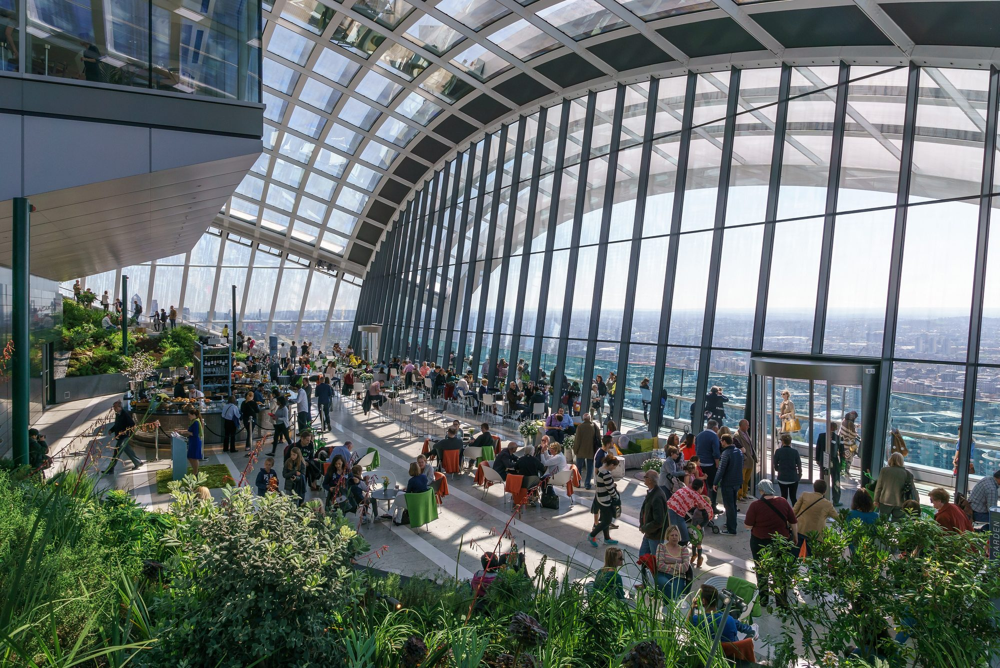
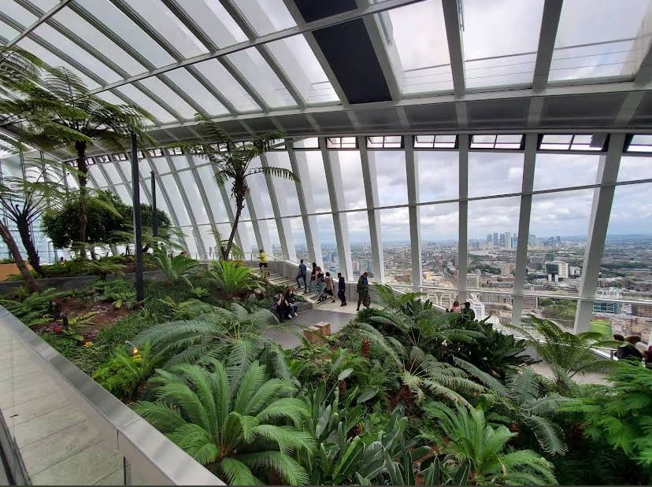
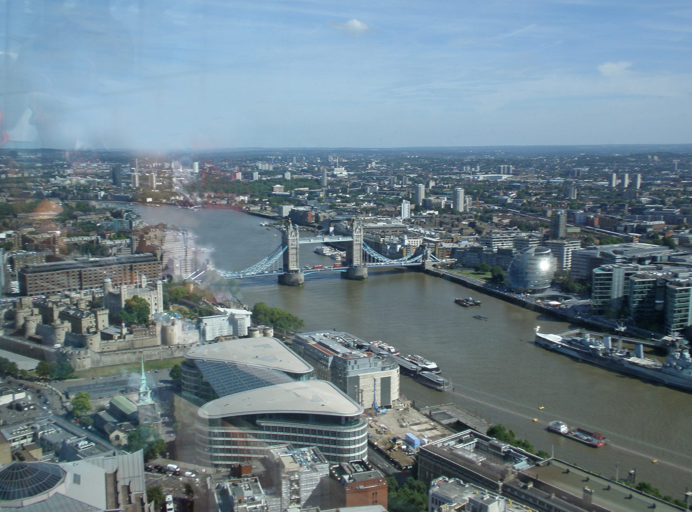
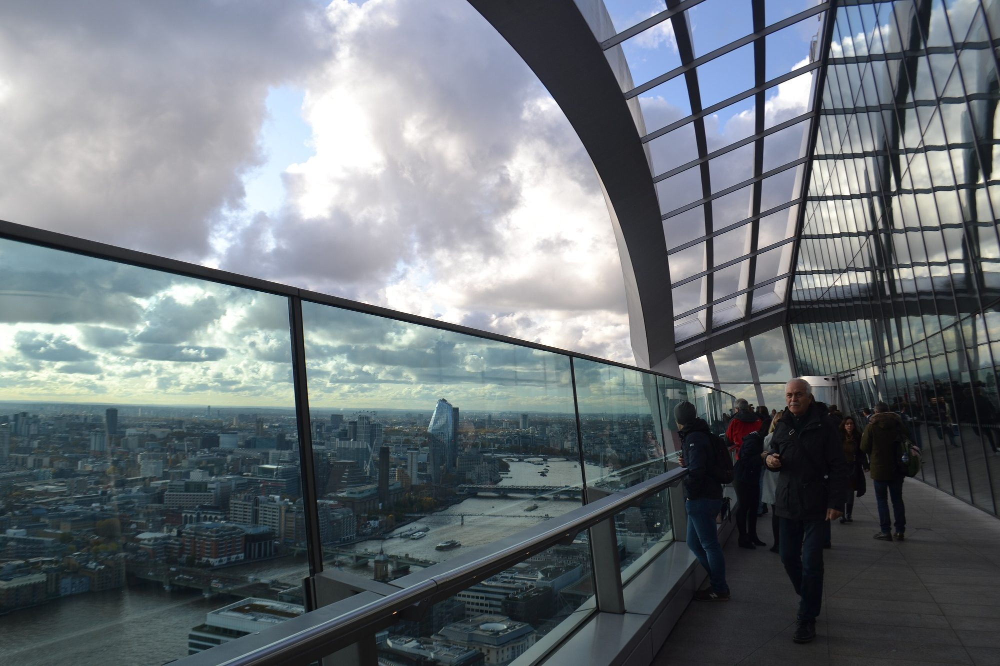
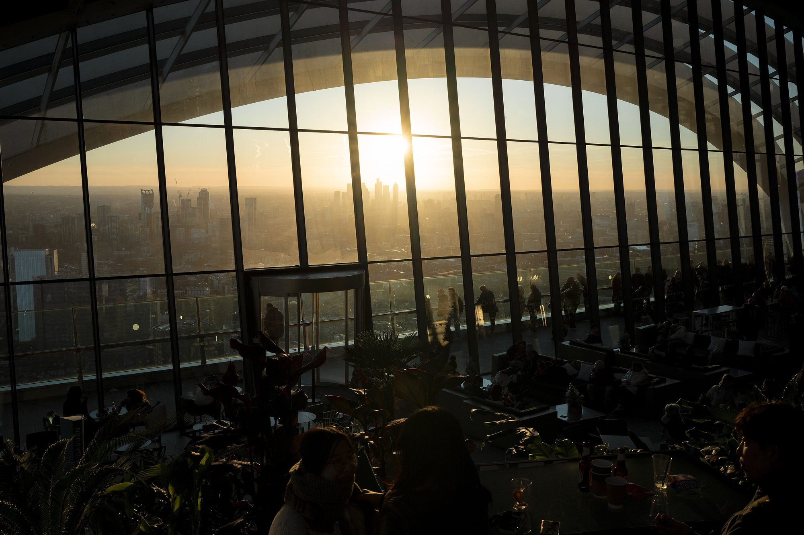
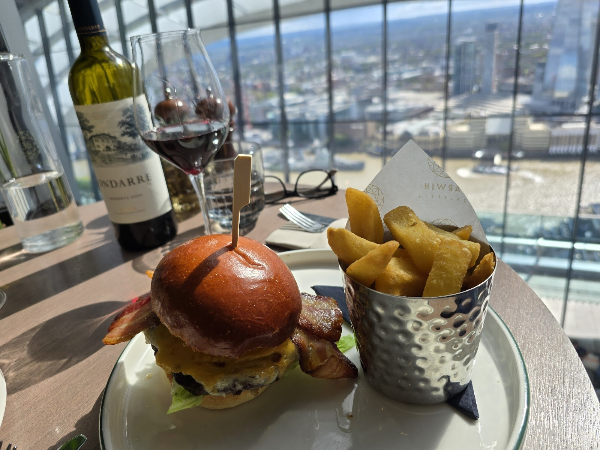
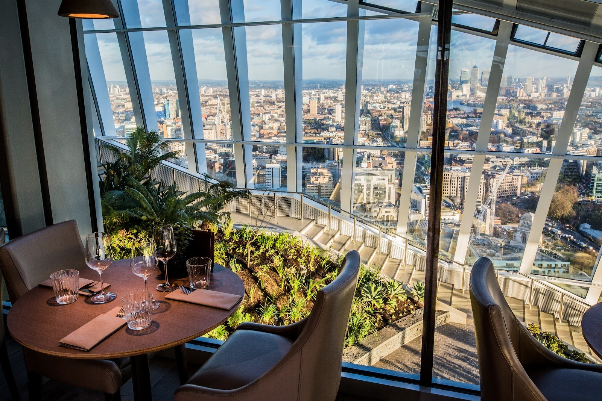
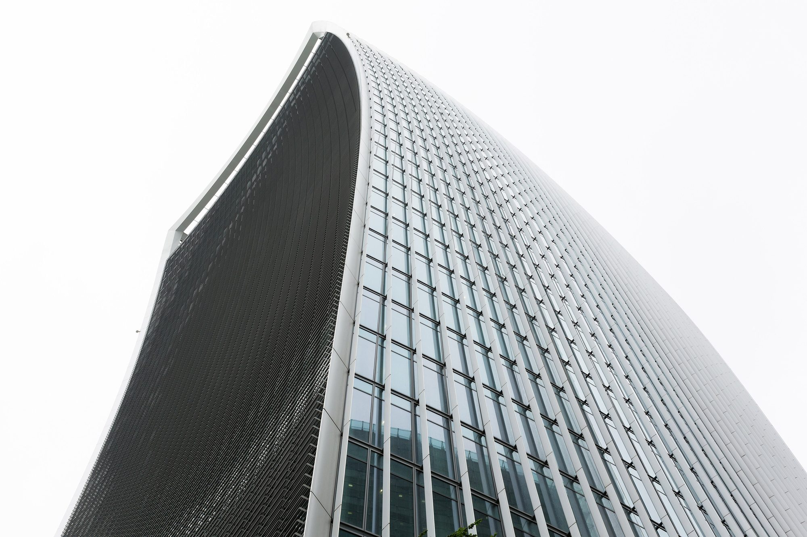

The Sky Garden is the public garden at the top of 20 Fenchurch Street, the curved tower known as the Walkie-Talkie. You enter on Level 35, 155 metres up, under a glass roof, with planted terraces climbing either side of a café floor and an open-air terrace looking down on the Thames. Entry is free. Getting a ticket is the hard part.

> 💡 **The Short Version:**
> - **Free tickets come out every Monday morning, three weeks ahead,** a whole week of slots at a time, on the [Sky Garden's ticket site](https://tickets.skygarden.london/WebStore/shop/viewitems.aspx?cg=SkyGarden&c=Tickets). There is no release on bank holidays.
> - **A ticket gives you one hour,** and you must reach the queue within 15 minutes of your slot.
> - **Missed the release?** A table at **Darwin Brasserie** or **Fenchurch Restaurant** includes entry, even when the free tickets are gone. The door also takes free walk-ins when there is room, sells an early-morning ticket with a hot drink for £11.50, and sells evening music-night entry from £15.50. An <a href="https://www.getyourguide.com/activity/-t1100481?partner_id=WWP7I0R&amp;cmp=sky-garden-guide" target="_blank" rel="sponsored nofollow noopener" data-affiliate="gyg">early-access ticket with a breakfast treat on GetYourGuide</a> fixes a paid slot in advance.
> - **Hours:** Monday to Friday 10:00 to 18:00; Saturday, Sunday and bank holidays 11:00 to 21:00. The open-air terrace shuts at 18:00 every day.
> - **Leave big bags behind.** Security is airport-style, there are no lockers, and only a cabin-size case that fits the X-ray is allowed. Evening walk-ins need photo ID.
> - **Within ten minutes' walk,** The Garden at 120 needs no booking at all, and Horizon 22 is free and 23 floors higher.

> ⚠️ **Book the Monday the week you want opens, or plan on paying to get in.** The Sky Garden advises booking the full three weeks ahead, and is unlikely to let in anyone who reaches the queue more than 15 minutes after their slot.

---

## Tickets and booking

*The main floor of the Sky Garden. Photo: [Colin](https://commons.wikimedia.org/wiki/File:The_Sky_Garden.jpg), [CC BY-SA 4.0](https://creativecommons.org/licenses/by-sa/4.0/).*

Free tickets are sold only on the [Sky Garden's own ticket site](https://tickets.skygarden.london/WebStore/shop/viewitems.aspx?cg=SkyGarden&c=Tickets).

- **When they come out:** every Monday morning, bank holidays excepted, for the whole week three weeks ahead. Book on 12 October 2026 and you are choosing from the week beginning 2 November.
- **How long you get:** one hour inside from the moment you enter, ending at 18:00 on weekdays and 21:00 at weekends and on bank holidays however late your slot.
- **Arriving late:** more than 15 minutes after the time on your ticket and you are unlikely to be let in. Tickets cannot be moved on the day; to change one, cancel it online and book another slot.
- **You still queue.** A ticket is for capacity, not a fast track. Join the back of the queue from Fenchurch Street and Philpot Lane and keep to the right-hand side, which is for pre-booked tickets.
- **Children:** anyone over five needs a ticket. Under-16s must be with an adult of 18 or over, and one adult can bring at most three children.
- **Groups:** a booking takes up to ten people. Larger groups are taken only on community days, the second Wednesday of each month, through the [group tickets page](https://skygarden.london/booking/group-tickets/). Book separate tickets and arrive as a party of more than ten, and you will be turned away.
- **Confirmation emails** can take up to 24 hours. If yours has not come, the door can check you in with your booking reference and name.

In early October 2026 one of the visitor lifts was out of service, and the Sky Garden warned that some ticket holders might not get in at their booked time. If your day is flexible, it suggests rebooking for later in the week or the week after.

Powered by <a target="_blank" rel="sponsored" href="https://www.getyourguide.com/london-l57/">GetYourGuide</a>

### When the free tickets have gone

- **Book a table at Darwin Brasserie or Fenchurch Restaurant.** Both include entry without a ticket, even when the free ones are sold out. Arrive no more than 30 minutes before your table, and go to the desk on the right of reception instead of joining the ticket queue.
- **Book a table at the Sky Garden bars.** The Sky Garden names a bar booking as the other way in when you have no ticket. Bar tables are for 16 and over, with anyone under 18 accompanied by a parent or guardian.
- **Walk up.** The door takes free walk-ins every day during public hours when there is room, at the team's discretion. Nothing is guaranteed.
- **Go early.** The door sells an early-morning ticket for **£11.50**, with a hot drink and access to the gardens. The same early visit can be booked ahead as [Sunrise at Sky Garden on SevenRooms](https://www.sevenrooms.com/experiences/skygardenbars/sunrise-at-sky-garden-6211553286340608): from 08:00 on weekdays and 09:00 at weekends, coffee and a pastry, with the terrace closed.
- **Go late.** Evening entry is sold at the door from **£15.50**, with a welcome drink and the DJ or live band. Music nights start at 18:30, are 18 and over, and need physical ID. Pre-book [standing access on SevenRooms](https://www.sevenrooms.com/experiences/skygardenbars/music-night-standing-access-5476695103815680); the Sky Garden says music nights get very busy.

GetYourGuide resells the early-morning visit and two Larch packages, breakfast or dinner with Sky Garden entry. Each costs money where the Monday release costs nothing, so they are for when your dates are fixed and the free week has gone.

Powered by <a target="_blank" rel="sponsored" href="https://www.getyourguide.com/london-l57/">GetYourGuide</a>

---

## Opening hours and closures

| | Hours |
| --- | --- |
| Garden, ticket holders, Monday to Friday | 10:00 to 18:00 |
| Garden, ticket holders, Saturday, Sunday and bank holidays | 11:00 to 21:00 |
| Open-air terrace | 10:00 to 18:00 weekdays, 11:00 to 18:00 weekends |
| Sky Pod and City Garden bars | 08:00 to midnight Sunday to Thursday, 08:00 to 01:00 Friday and Saturday |
| Last entry to the building | 23:00 Sunday to Thursday, midnight Friday and Saturday |

Under-16s cannot be in the Sky Garden after 18:00 on weekdays or 21:00 at weekends, even with a parent, except at a restaurant table. Security can close the terrace without warning in bad weather.

**The first Monday of most months is a maintenance day.** The garden and bars on Levels 35 and 36 stay shut until 18:30, and only diners with a reservation are let in, at their booking time. The [closure dates page](https://skygarden.london/sky-garden-closure-dates/) lists the rest. Between now and Christmas:

- **14 and 21 October:** closed from 16:00 for a private hire.
- **16 November and 7 December:** maintenance days, closed until 18:30.
- **24 November, 3 and 10 December:** closed from 16:00.
- **25 November:** closed all day.
- **24 December:** closes at 18:00. **25 December:** closed.

City Garden bar and Darwin Brasserie also close for a few hours on scattered dates, listed on the same page.

---

## The garden and the terrace

*The planted terraces inside the dome.*

The building was designed by Rafael Viñoly in 2004, widening as it rises so the top floors are the largest. The planting, by the landscape architects Gillespies, runs up both sides of the main floor in stepped beds of drought-tolerant Mediterranean and South African species, among them African lily, red hot poker, bird of paradise and French lavender. Stairs climb the beds to the upper levels, and lifts link the floors for anyone who cannot use them.

The windows look three ways. North and east you get the City cluster close up: the Gherkin, the Cheesegrater and Tower 42 a few hundred metres away, then Canary Wharf on the horizon. To the south-east the river runs past the Tower of London, Tower Bridge and HMS Belfast.

*Tower Bridge and the Tower of London from the Sky Garden. Photo: [amandabhslater](https://commons.wikimedia.org/wiki/File:Tower_Bridge_Sky_Garden.jpg), [CC BY-SA 2.0](https://creativecommons.org/licenses/by-sa/2.0/).*

**The terrace** is outside the glass, behind a glass balustrade, looking out over the river. It is the only open air at the Sky Garden and opens 10:00 to 18:00 on weekdays and 11:00 to 18:00 at weekends, so on a weekend evening you watch the sunset through the glass. The bars, the terrace and the garden are naturally ventilated, which means they are roughly as warm or cold as the street: dress for outdoors. Only the two restaurants are heated.

*The open-air terrace over the river. Photo: [Daniel from Glasgow](https://commons.wikimedia.org/wiki/File:The_Sky_Garden_in_London_(49071040517).jpg), [CC BY 2.0](https://creativecommons.org/licenses/by/2.0/).*

### Sunset

On a weekday the free tickets stop at 18:00, so they catch the sunset only from about the third week of October to mid-March, when the sun goes down before then. In December it sets just before 16:00. Book a slot starting about 45 minutes before sunset and you get daylight, sunset and the lights coming on within your hour.

At weekends the garden is open to 21:00, which covers sunset all year except roughly late May to late July, when the sun sets later. From mid-March to the third week of October, then, a free sunset means a weekend ticket. On a summer weekday it takes a restaurant or bar booking, or evening entry at the door.

*Late-afternoon sun in January. Photo: [Andrei Nicolae](https://commons.wikimedia.org/wiki/File:20_Fenchurch_Street_Sky_Garden,_Golden_hour_2025-01-03.jpg), [CC BY 2.0](https://creativecommons.org/licenses/by/2.0/).*

---

## Restaurants and bars

All of them are cashless, and all take bookings up to 60 days ahead. From 18:00 Darwin and the bars ask for smart casual. Flip-flops, baseball caps and men's vest tops are refused in the restaurants.

### Darwin Brasserie, Level 36

*A burger at a window table in Darwin Brasserie.*

An all-day British brasserie overlooking the Thames: breakfast, brunch, lunch and dinner, with a Saturday brunch and a Sunday roast, both of which take a bottomless Prosecco upgrade. Reservations run 08:30 to 22:00 Sunday to Thursday and to 22:30 on Fridays and Saturdays. **A window table costs £10 to £15 a head extra**, chosen when you pick your time slot. [Book Darwin Brasserie on SevenRooms](https://www.sevenrooms.com/reservations/darwinbrasserie).

*A window table at Darwin Brasserie, with the garden below.*

### Fenchurch Restaurant

Fine dining under Chef de Cuisine Kerth Gumbs, who puts British ingredients together with the Caribbean cooking of his Anguillan heritage, in a five-course tasting menu, an à la carte and a chef's set menu. The **Bar Experience** seats you at the counter for small plates such as whiskey barbecue wings and cured jerk salmon ceviche. Lunch is 12:00 to 14:30 and dinner 17:00 to 21:00, with all-day service from 12:00 to 21:00 on Saturdays. The dress code is stricter than Darwin's: no sportswear, hoodies or gym trainers. [Book Fenchurch on SevenRooms](https://www.sevenrooms.com/reservations/fenchurch).

### Sky Pod Bar and City Garden Bar

Two bars among the planting, serving drinks and light food all day, with live music and DJs in the evenings. Book a table and you are given whichever of the two has room. Bar tables are 16 and over, with under-18s accompanied by a parent or guardian; standing access and walk-ins are 18 and over. [Book the bars on SevenRooms](https://www.sevenrooms.com/reservations/skygardenbars). Groups of ten to 99 can book a roped-off area with canapé packages from £45 a head through groups@skygarden.london.

### Larch, the café and the gift shop

**Larch** is an Italian restaurant opposite the Sky Garden entrance, on the first floor above a ground-floor gift shop and café. None of the three is inside the Sky Garden. A table at Larch gets you up only if there is room on the day; to be sure of entry, book a free ticket as well, or one of Larch's two packages with entry included, breakfast or a set menu, both on [SevenRooms](https://www.sevenrooms.com/experiences/larchrestaurant/breakfast-at-larch-access-to-sky-garden-6066430295588864).

---

## Practical information

### Getting there

*20 Fenchurch Street from Rood Lane. Photo: [Diliff](https://commons.wikimedia.org/wiki/File:20_Fenchurch_St_(Walkie-Talkie_building)_from_Rood_Ln,_London,_UK_-_Diliff.jpg), [CC BY-SA 3.0](https://creativecommons.org/licenses/by-sa/3.0/).*

The Sky Garden has its own entrance on **Philpot Lane**, at the south-west corner of 20 Fenchurch Street, signposted at street level. The postal address is 1 Sky Garden Walk, London EC3M 8AF. Past security, a lift takes you to Level 35.

- **Tube:** Monument (District and Circle lines) is the nearest station, a few minutes' walk. Bank, Mansion House, Tower Hill and Aldgate, and the DLR at Tower Gateway, are all under ten minutes.
- **Rail:** Fenchurch Street, Cannon Street and London Bridge.
- **Bus:** route 40, stops T and W.

### Security, bags and ID

- **Airport-style screening** for everyone, with an X-ray machine. Allow time for the queue.
- **No large bags or suitcases.** A cabin-size case is allowed if it fits through the X-ray, up to 615 x 410 mm. There are **no lockers** and reception will not hold anything; our [luggage storage guide](/articles/luggage-storage-london/) has the desks at London Bridge and Liverpool Street.
- **No outside food or drink,** except baby food and milk. Alcohol brought in is confiscated.
- **No tripods** or large camera kit; handheld cameras are fine. Balloons and candles are not allowed either.
- **ID:** the Sky Garden runs Challenge 25. Anyone over 18 who looks under 25 should carry a passport, photo driving licence or PASS card, and evening walk-ins must show physical ID.

### Step-free access

The visitor route is step-free throughout. Lifts run from street level on Philpot Lane and Rood Lane to the entrance level, and more lifts inside link the garden's floors. Assistance dogs are welcome and should stay on a lead; no other animals are allowed. Email skygarden@20fenchurchstreet.co.uk ahead of a visit to arrange support. Our [step-free London guide](/articles/step-free-london/) compares the other viewpoints.

### Common mistakes to avoid

- **Waiting until you are in London to book.** By then the Monday release for your week has been and gone.
- **Arriving at the end of your slot.** Fifteen minutes late and you are unlikely to get in.
- **Planning a summer weekday sunset on a free ticket.** Weekday tickets stop at 18:00; from mid-March to the third week of October that is before sunset.
- **Bringing a suitcase.** There is nowhere to leave it.
- **Bringing a party of more than ten** on separate bookings. You will be turned away.

---

## Sky Garden or somewhere else?

Four other high viewpoints are within a short walk or a Tube stop. The Sky Garden is the only one with a planted garden under glass and an open-air terrace together. Our [best views in London guide](/articles/best-views-london/) covers all of them and the rest of the city.

| Viewpoint | Cost and booking | How it compares |
| --- | --- | --- |
| **[Horizon 22](https://horizon22.co.uk/)** | Free, timed ticket | Level 58 of 22 Bishopsgate, ten minutes' walk north: 23 floors higher than the Sky Garden, with a 300-degree view and lifts that take 41 seconds, but fully enclosed behind glass. Weekdays 10:00 to 18:00, Saturday to 17:00, Sunday to 16:00. |
| **[The Garden at 120](https://fen-court.com/garden-at-120/)** | Free, no booking | A 15th-floor open-air roof garden at 120 Fenchurch Street, two minutes along the street, with wisteria, roses and a long water feature, looking up at the Gherkin and the Cheesegrater. From 1 October to 31 March it is open 10:00 to 18:30 on weekdays and to 17:00 at weekends; closed on bank holidays and in high wind, storms or ice. |
| **[The View from The Shard](https://www.theviewfromtheshard.com/)** | Paid, prices vary by date | Floors 68 to 72 across the river, with an open-air skydeck at the top. Children are from £10 and under-fours go free with an adult. |
| **[Tate Modern, Level 10](https://www.tate.org.uk/visit/tate-modern)** | Free, no booking | The top floor of the Blavatnik Building on Bankside, looking across the river to St Paul's and the City. Tate Modern is open to 21:00 on Fridays and Saturdays. |

**If you could not get a Sky Garden ticket**, walk along Fenchurch Street to The Garden at 120: no booking, open air, and the City's towers all round you. **If you want height**, book Horizon 22. **If you want to stand in the open air high over the river**, the Shard's skydeck is the one that charges for it.

---

## Nearby

The Sky Garden sits in the east of the City, so the rest of the Square Mile's sights are close. **St Dunstan-in-the-East**, a bombed church turned into a garden inside its own walls, is about five minutes south down St Dunstan's Hill. **Leadenhall Market** and **the Monument** are each about five minutes away, and the **Tower of London** about ten. The [City of London walk](/articles/city-of-london-walk/) passes all of them.

---

## Continue planning your London trip

- 🌆 **[The Best Views in London](/articles/best-views-london/)** — Horizon 22, The Garden at 120, The Shard and the free hilltops, compared.
- 🏙️ **[City of London Area Guide](/articles/city-of-london-area-guide/)** — the Square Mile's Roman remains, markets and pubs around 20 Fenchurch Street.
- 🚶 **[City of London Walk](/articles/city-of-london-walk/)** — from Bank to St Katharine Docks, past the Sky Garden, Leadenhall Market and St Dunstan-in-the-East.
- 🍽️ **[The Best Rooftop and Riverside Restaurants in London](/articles/best-rooftop-restaurants-london/)** — the other high tables, sorted by the cooking.
- 🌿 **[Unusual Restaurants in London](/articles/unusual-restaurants-london/)** — Darwin Brasserie among the rooms that are worth eating in for the setting.
- 🏰 **[Tower of London Guide](/articles/tower-of-london-guide/)** — tickets and hours for the fortress you look down on from the terrace.
- 💷 **[London on a Budget](/articles/london-on-a-budget/)** and **[Free Things to Do in London](/free/)** — the free viewpoints, museums and walks.
- 🛏️ **[Where to Stay in the City of London](/articles/where-to-stay-city-of-london/)** — hotels within a short walk of Fenchurch Street.
- ♿ **[Step-Free London](/articles/step-free-london/)** — lifts and level access at the Sky Garden and the other big sights.

---

*Ticket rules, opening hours, closure dates and restaurant details are the Sky Garden's own, checked 8 October 2026.*
