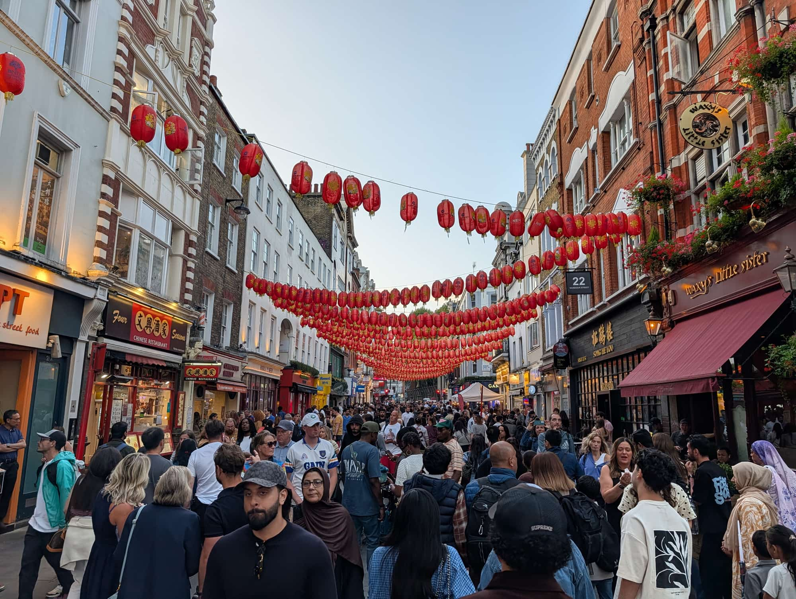
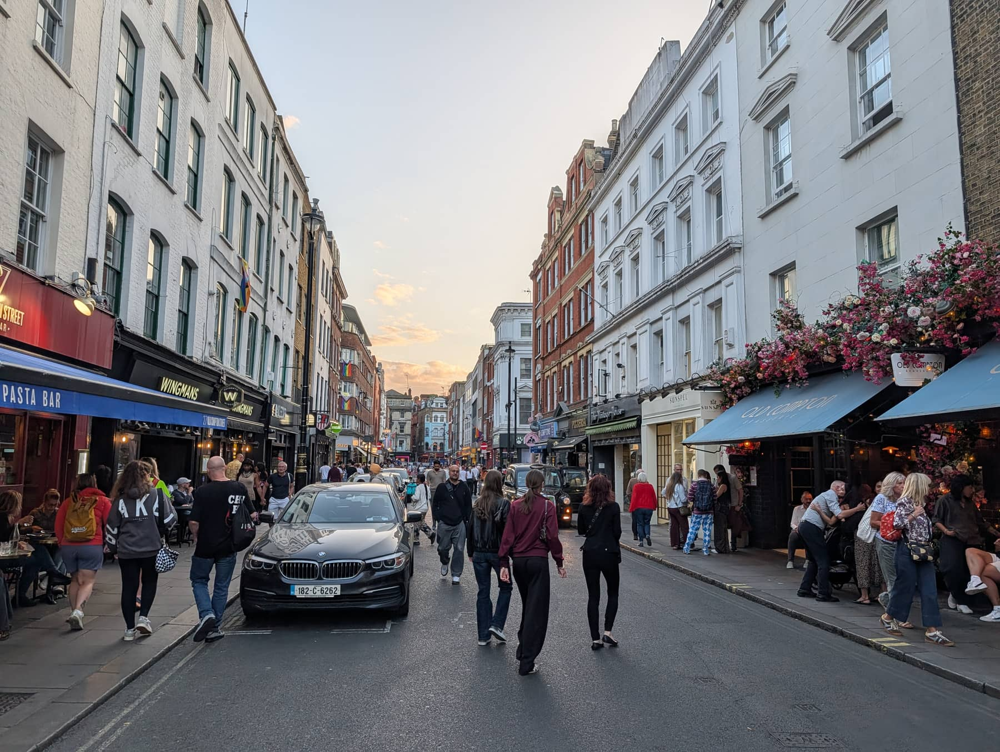
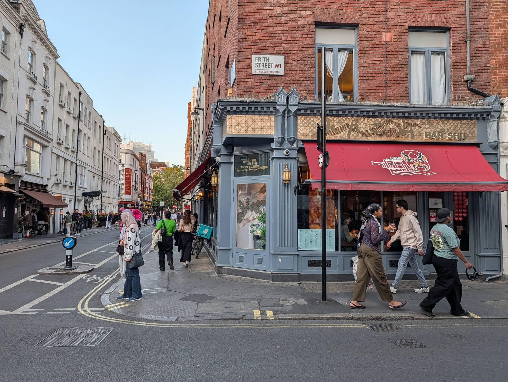
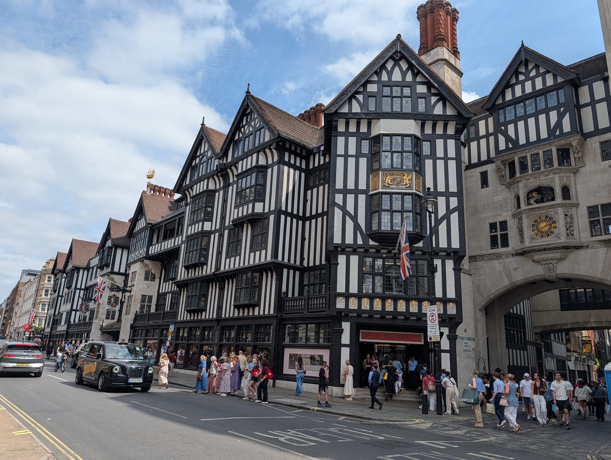

Soho is roughly one square kilometre bounded by [Oxford Street](/articles/shopping-in-london/#oxford-street-and-the-big-three), Regent Street, Shaftesbury Avenue and Charing Cross Road, and it contains more restaurants, bars, theatres and recording studios than anywhere else in Britain.

It is also two different places depending on when you arrive. By day it is a working media district with good coffee and quiet streets. From about 18:00 it becomes the busiest nightlife area in London.

Soho has its own share of the commemorative plaques marking where notable people lived or worked - see them on our [interactive map](/plaques/?area=soho).

## Why visit — and who should skip it

**Come here if** you want to eat and drink well, or you want London with the volume turned up. Soho has the best concentration of restaurants in the city at every price point, from £8 roast duck on Gerrard Street to tasting menus on Lexington Street.

**Skip it if** you are travelling with young children in the evening, or you want landmarks. Soho has no major sights — no museum, no monument, nothing to queue for. Its appeal is entirely atmosphere and food. Come for dinner rather than for sightseeing.

## Top sights and activities

1. **Chinatown (Gerrard Street)** — Pedestrianised, gated at both ends, and the best-value eating in central London. Roast meats in the windows, dim sum from mid-morning, bakeries and bubble tea throughout.
2. **Carnaby Street and Kingly Court** — The 1960s fashion street, now largely chains. **Kingly Court** just off it is the better stop: three storeys of independent restaurants and bars around a covered courtyard.
3. **Old Compton Street** — The heart of London's LGBTQ+ nightlife for decades, and still the busiest street in Soho after dark. Cafes and bars spill onto the pavement all evening.
4. **Berwick Street** — A street market since the 1770s, plus the surviving record shops that made this the centre of London's vinyl trade.
5. **Denmark Street** — "Tin Pan Alley". The guitar shops and the studios where the Rolling Stones and David Bowie recorded. Much reduced by redevelopment but still recognisable.
6. **Soho Square** — The only real green space, with the mock-Tudor gardener's hut at its centre. Full of office workers at lunchtime and the quietest spot in the area.
7. **Ronnie Scott's** — The jazz club on Frith Street. Founded in 1959, though it opened on Gerrard Street and only moved here in 1965. Book ahead for the main show, or turn up for the 11.15pm Late Late Show at £12.

## Key streets and micro-districts

### Gerrard Street and Chinatown

*Gerrard Street under its lanterns. The street is pedestrianised, and busiest between about 6pm and 9pm.*

Pedestrianised and lantern-strung, and **London's Chinatown is Cantonese first** — roast meats hanging in windows, dim sum until mid-afternoon, hotpot, and bakeries open later than almost anything else in the West End.

Gerrard Street is the spine, with Lisle Street parallel to it and usually cheaper. The **gates and lanterns** date from the 1980s, though the community moved here from Limehouse after the war.

**Busiest on Sunday afternoons**, which is when families come to eat — good for atmosphere, bad for a table. Dim sum kitchens generally stop by about 4pm, so come earlier than you think.

### Old Compton Street

*Old Compton Street at dusk. It is the centre of Soho's LGBTQ+ scene and the street most people picture when they picture Soho.*
The east–west spine of Soho nightlife, and **the centre of its LGBTQ+ scene** since the 1980s — bars, cafés and a street that has been the visible heart of gay London for forty years.

By day it is coffee and outside tables; from about 9pm it is shoulder to shoulder, and the drinking spills into the street itself in summer.

**It is four minutes end to end.** Leicester Square and Tottenham Court Road stations are both close, and the whole street is pedestrian-friendly rather than pedestrianised, so traffic still comes through.

### Carnaby Street and Kingly Court
Pedestrian shopping to the west, and **fourteen streets rather than one** — Carnaby is the name people know, but the surrounding lanes hold most of what is worth finding.

**Kingly Court is the reason to come**: three galleried floors around an open courtyard, almost entirely food and drink, and covered enough to work in the rain.

**Free to walk through, open daily**, and five minutes from Oxford Circus. The courtyard is busiest between 6pm and 8pm, and most of its restaurants take bookings — worth doing at a weekend.

### Berwick Street and Broadwick Street
Market stalls, record shops and some of Soho's better restaurants — **Berwick Street market has traded since the 1770s** and is now a short run of food stalls rather than the fruit and veg it was, with the surviving record shops on the same stretch.

Broadwick Street has the **John Snow pump replica**, marking where Snow traced the 1854 cholera outbreak to a single water source and effectively founded modern epidemiology. The pub beside it is named after him.

**The market runs weekday lunchtimes** and is largely gone by mid-afternoon and at weekends, so time it for lunch or you will find an empty street.

### Dean Street and Frith Street

*Frith Street where it meets Shaftesbury Avenue. Ronnie Scott's, Bar Italia and a run of long-standing restaurants are all on this stretch.*
North–south restaurant streets running parallel through the middle of Soho, and where most of the eating actually happens.

**Ronnie Scott's** has been on Frith Street since 1965 and is still the serious jazz room in London — two sets a night, booked well ahead. **Bar Italia** a few doors up has been open since 1949 and trades nearly around the clock. The private members' clubs are on Dean Street, unmarked and not for walking into.

**Book anything you actually want.** These two streets fill from about 7pm and the good tables go days in advance, particularly at weekends.

*Liberty, built in the 1920s from the timbers of two Royal Navy ships. Free to walk into, and worth it for the atrium.*

Powered by <a target="_blank" rel="sponsored" href="https://www.getyourguide.com/london-l57/">GetYourGuide</a>

## Where to eat and drink

| Spot | Style | Price | Why go |
| --- | --- | --- | --- |
| **Bao Soho** | Taiwanese buns | £ | Small counter on Lexington Street; queue, no bookings |
| **Four Seasons** | Cantonese roast duck | £ | Chinatown institution; the duck is the entire point |
| **Kiln** | Thai, live fire | ££ | Counter seating on Brewer Street; walk-ins downstairs |
| **Barrafina** | Spanish tapas | ££ | Counter only, no bookings; go early or late |
| **Bar Italia** | Coffee | £ | Frith Street, open since 1949 and nearly around the clock |
| **The French House** | Historic pub | £ | Dean Street; beer served in halves by tradition |

## Getting there

**By Tube.** Four stations sit on Soho's edges. **Tottenham Court Road** (Elizabeth line, Central, Northern) is best for the east side and Chinatown. **Oxford Circus** is best for Carnaby Street. **Piccadilly Circus** is closest to Chinatown's southern gate.

**Best exit.** From Tottenham Court Road, use the **Dean Street** exit to come out directly in Soho rather than on Oxford Street.

**Late night.** The Central, Victoria, Northern, Jubilee, Piccadilly and Windrush lines run a **Night Tube** on Friday and Saturday nights. The Elizabeth line does not — it runs later than the rest of the Tube but still stops. Night buses run from Trafalgar Square and Oxford Circus every night. Details in the [Getting Around London guide](/articles/getting-around-london-transport-guide/).

## How long to spend, and when to go

| If you have | Do this |
| --- | --- |
| **Two hours** | Chinatown for lunch, then Berwick Street and Kingly Court |
| **An evening** | Early dinner, a drink on Old Compton Street, a show or Ronnie Scott's |
| **Half a day** | Add Carnaby Street, Denmark Street and Soho Square |

**Best time:** Evening. Soho is a nightlife district and feels flat before about 17:00.

**For Chinatown:** Sunday afternoon is traditional and busiest. Weekday lunch is the quiet alternative.

## Suggested evening route

1. **Start:** Tottenham Court Road station, Dean Street exit.
2. **Chinatown:** South to **Gerrard Street** for the gates and the roast meat windows.
3. **Old Compton Street:** North for a drink as the street fills up.
4. **Berwick Street:** West past the record shops to **Broadwick Street**.
5. **Kingly Court:** Through to **Carnaby Street** and the courtyard.
6. **Finish:** Ronnie Scott's on Frith Street, or a late plate at Bar Italia.

## Common mistakes to avoid

1. **Coming in the morning.** Much of Soho does not open until midday and the atmosphere is entirely absent before evening.
2. **Expecting to book everywhere.** Several of the best restaurants are walk-in only. Arrive at 17:30 or after 21:00 to avoid the worst queues.
3. **Treating Carnaby Street as the destination.** Twenty minutes is enough. Kingly Court beside it is better.
4. **Assuming Chinatown is expensive.** It is the cheapest good eating in Zone 1, and most places seat you quickly.
5. **Driving or taking a cab.** Much of Soho is pedestrianised or one-way, and the Congestion Charge applies. Walk.
6. **Missing the last Tube on a weeknight.** Night Tube runs Friday and Saturday only; other nights the last trains go around 00:30.

Powered by <a target="_blank" rel="sponsored" href="https://www.getyourguide.com/london-l57/">GetYourGuide</a>

## Where to stay

Central and convenient, but genuinely noisy. Ask for a room away from the street.

- **Soho proper** — Boutique hotels on Dean, Frith and Greek Streets. You will hear the street until late.
- **Fitzrovia** — Ten minutes north across Oxford Street. Same access, considerably quieter.
- **Covent Garden** — East, calmer after the market closes, and better for theatre.
