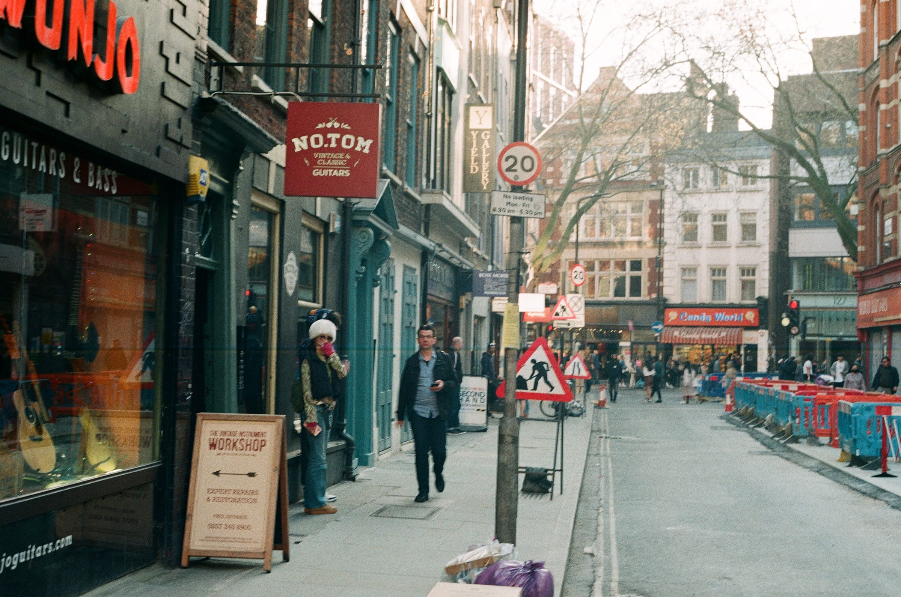
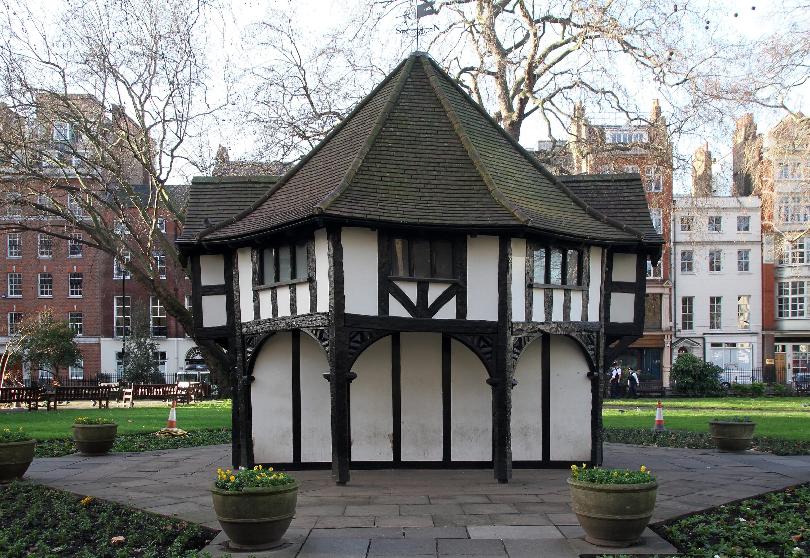
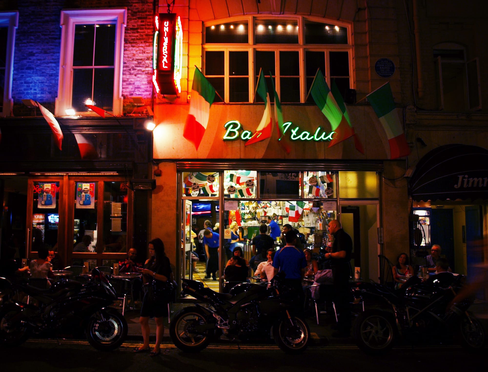
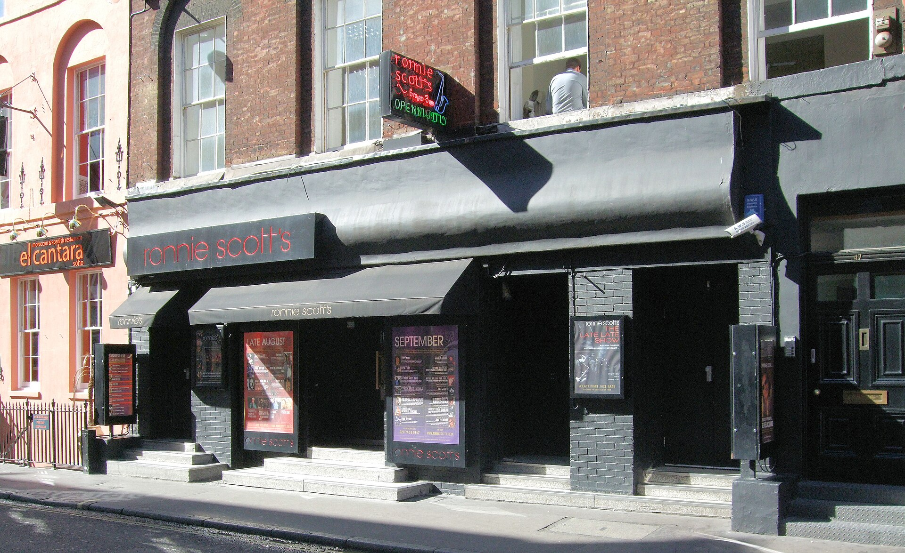
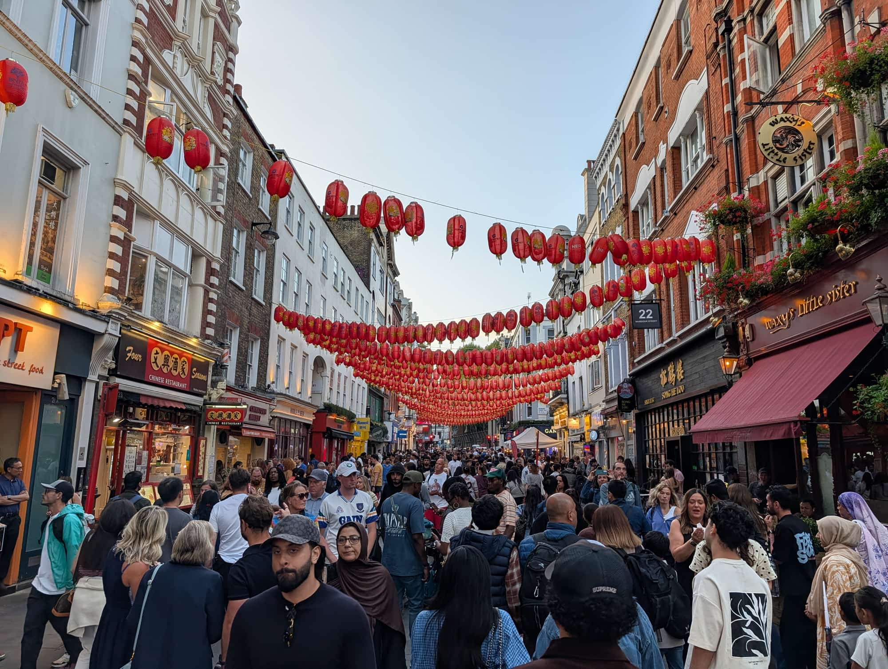

Most people see Soho from a restaurant table after dark, and Chinatown from the queue outside one. By day it is a square kilometre of plaques, squares and a market that has traded since 1778, and all of it is free to walk.

**This route runs from Denmark Street to Chinatown in eleven numbered stops**: about **3km, 45 minutes of walking and two and a half to three hours with stops**. It starts a minute from Tottenham Court Road station and finishes two minutes from Leicester Square.

For where to eat in the evening, the nightlife and where to stay, see the [Soho area guide](/articles/soho-area-guide/).

> 💡 **The Short Version:** Walk it **Monday to Saturday**: **Berwick Street market does not trade on Sundays**. Start by **11am**, have coffee at **Bar Italia** (open 7am to 4am), and you reach **Chinatown for lunch** before most dim sum kitchens stop at about 4pm. The three gardens on the route close at **4.30pm in winter**. Nothing on the walk charges admission.

## The route

  

    Map of the walk, numbered in walking order
  

  

    
Loading the map…

  

  

    <i class="route-map-marker" aria-hidden="true">1</i> On the route, in walking order
  

  <noscript>
    
The map needs JavaScript. Every stop below is numbered in walking order with its nearest station.

  </noscript>

**[Open the whole route in Google Maps →](https://www.google.com/maps/dir/?api=1&origin=51.5152,-0.12963&destination=51.511787,-0.131095&waypoints=51.515289,-0.13221%7C51.51408,-0.13259%7C51.513421,-0.131235%7C51.513256,-0.134609%7C51.513302,-0.136663%7C51.512672,-0.138699%7C51.511655,-0.137183%7C51.51228,-0.13249%7C51.513315,-0.130199&travelmode=walking)**: all eleven stops in walking order, set to walking directions, which is the version to put on your phone.

| # | Stop | Cost | Open |
| --- | --- | --- | --- |
| **1** | Denmark Street | Free | Street always; guitar shops from 10am |
| **2** | Soho Square | Free | Daily from 8am |
| **3** | Dean Street: Karl Marx | Free to look | Always |
| **4** | Frith Street | Free to look | Bar Italia daily 7am–4am |
| **5** | Berwick Street market | Free | **Mon–Sat 8am–6pm; no Sunday** |
| **6** | Broadwick Street | Free | Always |
| **7** | Carnaby Street & Kingly Court | Free to walk | Daily |
| **8** | Golden Square | Free | Daily from 8am |
| **9** | St Anne's churchyard | Free | Daily; **4.30pm close in winter** |
| **10** | Old Compton Street & Maison Bertaux | Free to walk | Street always |
| **11** | Chinatown | Free to walk | Restaurants daily from noon |

---

## 1. Denmark Street

*Denmark Street's guitar shops, with Wunjo at No. 5 on the left. Photo: [Marcus Grbac](https://commons.wikimedia.org/wiki/File:Tin_Pan_Alley,_5_~_11_Denmark_Street_(2022-05-12_13.04.16_by_Marcus_Grbac).jpg), [CC BY 2.0](https://creativecommons.org/licenses/by/2.0/).*

**One short street off Charing Cross Road, and for eighty years the home of British songwriting.** A blue plaque reads: "This street was 'Tin Pan Alley' 1911–1992, home of the British publishers and songwriters and their meeting place The Giaconda." Outernet, whose development takes in the street, lists the Sex Pistols among its residents and the Rolling Stones' first album among the records made here.

The guitar shops that remain are the reason to look in: **Wunjo Guitars** at No. 5 opens Monday to Saturday 10am to 7pm and Sunday 11am to 5pm. The same building carries an English Heritage plaque to **Augustus Siebe**, pioneer of the diving helmet, who lived and worked there.

Cross Charing Cross Road and take Sutton Row west into Soho Square.

## 2. Soho Square

*The mock-Tudor hut, built in 1895 as the gardener's hut. Photo: [Tony Hisgett](https://commons.wikimedia.org/wiki/File:Soho_Square_(24023270222).jpg), [CC BY 2.0](https://creativecommons.org/licenses/by/2.0/).*

**Laid out in the 1680s on what was Soho Fields.** The half-timbered hut in the middle dates from 1895, and the statue of **Charles II** is listed.

An English Heritage plaque at **No. 14** marks where **Mary Seacole**, the Jamaican nurse of the Crimean War, lived and started writing her autobiography.

**The gardens open daily from 8am** and close at a time set by the season: 4.30pm in winter, 9.30pm in high summer, 7.30pm at the end of September. They are step-free, and dogs are not allowed. There are public toilets at the top of the square by the Santander bike docks.

Leave by the south-west corner into Dean Street.

## 3. Dean Street: Karl Marx

**Marx lived at 28 Dean Street from 1851 to 1856**, in two rooms on the second floor: a back bedroom for the whole family and a front room that was kitchen and living room. Jenny Marx called them "the evil frightful rooms". Two of their children died here and a third, Eleanor, was born. He was working on the first volume of *Das Kapital*, researching it in the British Museum's library.

**The blue plaque went up in 1967**, after two earlier ones at his last house, on Maitland Park Road, were vandalised. English Heritage records that the owner of the restaurant downstairs objected to it at the time.

That restaurant is **Quo Vadis**, which opened in 1926 and is marking its centenary with a calendar of centenary dishes. The **smoked eel sandwich is £18.50**. Lunch is served Monday to Saturday, noon to 2.30pm, and it is closed on Sundays.

Take Bateman Street east to Frith Street.

Powered by <a target="_blank" rel="sponsored" href="https://www.getyourguide.com/london-l57/">GetYourGuide</a>

## 4. Frith Street: Mozart, Bar Italia and Ronnie Scott's

*Bar Italia, open on Frith Street since 1949. Photo: [SomeDriftwood](https://commons.wikimedia.org/wiki/File:Bar_Italia_-_Soho_(4764432107).jpg), [CC BY 2.0](https://creativecommons.org/licenses/by/2.0).*

Three plaques in a hundred metres, and the route's coffee stop.

- **No. 6**: the essayist **William Hazlitt** died here in 1830. It is now Hazlitt's hotel, and he is buried at stop nine.
- **No. 20**: a Royal Musical Association plaque says **Mozart** "lived, played and composed" in a house on this site in 1764–5, aged eight. The family's first London lodging, on Cecil Court, is on the [Covent Garden walk](/articles/covent-garden-walk/#2-cecil-court).
- **No. 22**: **John Logie Baird** worked in two attic rooms here from November 1924, and on **26 January 1926** gave the first demonstration of a working television, to 40 members of the Royal Institution.

**Bar Italia** is on the ground floor of No. 22. The Polledri family opened it in 1949, and it is **open every day from 7am to 4am**: coffee at the counter, and a place to stand rather than a meal.

**Ronnie Scott's is directly opposite, at No. 47.** The club moved here in 1965; its first home is at the end of this walk. It opens in the evening, from 5.30pm, and for a Sunday lunchtime session, so on a daytime walk there is only the frontage and the month's bills. For a return visit, the **Late Late Show** starts at 11.15pm Wednesday to Saturday at £12, and most tickets are available on the door.

*Ronnie Scott's at 47 Frith Street, across the road from Bar Italia. Photo: [Jim Linwood](https://commons.wikimedia.org/wiki/File:Ronnie_Scott%27s_Jazz_Club,_47_Frith_Street,_Soho_-_London.jpg), [CC BY 2.0](https://creativecommons.org/licenses/by/2.0/).*

Continue down Frith Street to Old Compton Street and turn right. Turn right up Dean Street, then left into Meard Street, which comes out on Wardour Street opposite Peter Street. Peter Street brings you to the foot of the market.

## 5. Berwick Street market

**Founded in 1778, and one of London's oldest street markets.** Westminster City Council licenses it **Monday to Saturday, 8am to 6pm**, for fruit and vegetables, flowers, coffee, dairy and hot food, and it is Soho's main lunchtime food street. The stalls are fewer than they were: count on a lunchtime pass-through rather than a morning's shopping.

**Breadstall** at No. 92 is the stop worth making: a counter selling slow-fermented pizza by the quarter, half or whole, walk-in only. It is covered in our [pizza guide](/articles/best-pizza-london/).

> ⚠️ **There is no market on Sunday.** It is the one stop on this walk that shuts for a whole day.

Walk north to the top of the market and turn left into Broadwick Street.

## 6. Broadwick Street: John Snow and William Blake

**This was Broad Street, and in September 1854 more than 500 people in Soho died of cholera.** The physician **John Snow** traced the deaths to the street's water pump and showed that cholera is carried in water. A replica of the pump stands on the pavement, and a red granite kerbstone marks where the original stood.

The pub on the corner of Lexington Street is **The John Snow**, a Samuel Smith's house. It opens Monday to Saturday noon to 11pm and Sunday 1pm to 10pm.

Carry on west to the corner of Marshall Street. A plaque on **8 Marshall Street** marks where **William Blake** was born, on 28 November 1757, in a house that stood on this site.

## 7. Carnaby Street and Kingly Court

Cross Marshall Street into Ganton Street, which runs into **Carnaby Street**. A green Westminster plaque credits **John Stephen**, who died in 2004, with making it the world centre of men's fashion in the 1960s. The street is now mostly brands, and it is pedestrianised.

**Kingly Court is the reason to stop**: three floors of restaurants and bars round an open courtyard, covered for the winter. Go in beside Dr Martens on Carnaby Street. Two of its top-floor rooms, **Imad's Syrian Kitchen** and the Filipino **Donia**, hold 2026 Michelin Bib Gourmands, and Imad's books weeks ahead; our [Middle Eastern guide](/articles/best-middle-eastern-restaurants-london/) and [Filipino guide](/articles/best-filipino-restaurants-london/) cover both.

The toilets inside are for diners. The public ones are at the north end of Carnaby Street, and there is a free water refill point outside Pizza Pilgrims in the courtyard.

From early November the street is hung with Christmas lights; our [Christmas lights walk](/articles/christmas-lights-walk-london/) takes it in with the rest of the West End's.

Leave Kingly Court by the Beak Street entrance and walk down Upper John Street into Golden Square.

## 8. Golden Square

**Laid out in the 1670s, possibly to plans by Christopher Wren.** The statue in the middle is **George II**; Dickens described the square as a little wilderness of shrubs watched over by a "mournful statue". Four mature hornbeams stand in the garden.

**The garden opens daily from 8am**, on the same seasonal closing times as Soho Square. Round the edge, a plaque at No. 31 records the surgeon **John Hunter**, and Nos. 23–24 were the **Portuguese Embassy** from 1724 to 1747.

Leave by Lower John Street, follow Brewer Street east to Wardour Street, and turn right.

Powered by <a target="_blank" rel="sponsored" href="https://www.getyourguide.com/london-l57/">GetYourGuide</a>

## 9. St Anne's churchyard

**The garden is well above the pavement on Wardour Street, and the reason is underneath.** The church says up to 60,000 people are buried here. The churchyard closed to burials in the 1850s, largely because a sexton had been dumping bodies in the ground and selling their coffins for firewood, and because London's churchyards were full.

**William Hazlitt** is among them. The church itself was consecrated in 1686 by Bishop Henry Compton, after whom Old Compton Street is named, and was bombed in 1940. Only the **tower of 1803** survived, and its clock is still wound by hand. The crime writer **Dorothy L. Sayers** was churchwarden while there was no church building at all, and her ashes are in the base of the tower.

**The garden is free and open daily**, with Westminster's seasonal closing times. It has steps and no step-free entrance, and dogs are allowed.

Walk back north to Old Compton Street and turn right.

## 10. Old Compton Street and Maison Bertaux

**Old Compton Street is Soho's east–west spine**, and the centre of its LGBTQ+ scene. By day it is coffee and outside tables; from about 9pm it is shoulder to shoulder. A green Westminster plaque at **No. 59** marks the **2i's Coffee Bar** (1956–1970), which it calls the birthplace of British rock 'n' roll.

Turn right into Greek Street. **Maison Bertaux**, a few doors down at **No. 28**, was opened in 1871 by Monsieur Bertaux, a Communard who had fled Paris, and it is still baking every day upstairs above the tea room. Order the **éclairs, the mille-feuille, or a scone with clotted cream and jam**. It is one small tea room.

Walk south down Greek Street, cross Shaftesbury Avenue, and take Gerrard Place into Gerrard Street.

## 11. Chinatown: Gerrard Street and Lisle Street

*The Chinatown stretch of Wardour Street under its lanterns, with Four Seasons on the left.*

**Gerrard Street was completed in 1685.** London's first Chinatown was in Limehouse; after the Blitz damaged it, the community moved west, and by the 1950s restaurants were opening here. In the late 1980s Gerrard Street was pedestrianised and the first gates went up. The largest, on **Wardour Street**, was opened on **25 July 2016**, built in the Qing dynasty style by Chinese craftsmen.

The history is on the walls. A blue plaque at **No. 39** marks the basement where **Ronnie Scott opened his club in October 1959**, before the move to Frith Street. At **No. 9** a plaque marks the **Turk's Head Tavern**, where Samuel Johnson and Joshua Reynolds founded The Club in 1764, and **John Dryden** lived at No. 43.

Walk west along Gerrard Street and turn left down Wardour Street to the gate. Come back a few steps and turn into **Lisle Street**, whose 18th-century shopfronts were restored in the 1980s. It ends at Newport Place, two minutes from Leicester Square.

**Where to eat:**

- **Four Seasons**, 12 Gerrard Street: the roast duck hanging in the window is the order. Open daily noon to 11pm, and it takes bookings.
- **Tao Tao Ju**, 15 Lisle Street: dim sum made on site each day. Open daily noon to 11pm, £££.
- **Bun House**, 26–27 Lisle Street: steamed buns from a counter, **walk-in only**, from noon daily.
- **Chinatown Bakery**, 7 Newport Place: egg tarts and bolo bao, 10.30am to 9pm daily.

> 💡 **Come for lunch, not tea.** Most dim sum kitchens stop at about 4pm, and Sunday afternoon is when Chinatown is at its busiest. For the full list, see our [dim sum guide](/articles/best-dim-sum-london/) and [Chinese and East Asian guide](/articles/best-chinese-east-asian-restaurants-london/); for dinner, Chinatown's hot pot rooms are in our [hot pot guide](/articles/best-hot-pot-london/).

---

## Where to eat

The route is timed so the eating falls into place:

- **Bar Italia** (£) at stop four: coffee at the counter from 7am, every day.
- **Breadstall** (£) at stop five: pizza by the slice on the market street, walk-in.
- **Maison Bertaux** (£) at stop ten: French pastries in a tea room that has been baking since 1871.
- **Chinatown** (£–£££) at stop eleven: lunch before the dim sum kitchens close, at the places above.

For a sit-down lunch on the way, **Quo Vadis** at stop three serves Monday to Saturday from noon. For dinner, booking and the walk-in-only rooms, the [Soho area guide](/articles/soho-area-guide/#where-to-eat-and-drink) has the list.

## The best day to go

**Monday to Saturday.** Almost everything on the route is a street, a plaque or a garden, and they do not close. Two things do.

| Day | What you get |
| --- | --- |
| **Mon–Fri** | Everything open. Berwick Street market 8am–6pm, at its busiest at lunchtime |
| **Saturday** | Market trades as usual. Quo Vadis serves lunch from noon |
| **Sunday** | **No market, Quo Vadis closed.** Chinatown at its busiest in the afternoon |

**What closes:** Berwick Street market on Sundays, and the three gardens (Soho Square, Golden Square and St Anne's churchyard) in the late afternoon in winter. From the end of British Summer Time until 15 February they shut at 4.30pm.

**Sunday still works** if the market is not the point. The squares and plaques are the same and Bar Italia opens at 7am. Reach Chinatown before 1pm to eat before the family crowds.

**On time of day:** start at 10am or 11am. Denmark Street's shops open at 10am, the market is at its fullest at lunchtime, and you reach Chinatown in time to eat. After dark the route turns into the Soho of the area guide: Frith Street is loud, Ronnie Scott's is open, and the gardens are locked.

Powered by <a target="_blank" rel="sponsored" href="https://www.getyourguide.com/london-l57/">GetYourGuide</a>

## Getting there and back

**Start:** Tottenham Court Road (Elizabeth line, Central, Northern). Denmark Street is a minute's walk from the station, on the east side of Charing Cross Road.

**Finish:** Leicester Square (Piccadilly, Northern), two minutes south of Lisle Street. Piccadilly Circus (Piccadilly, Bakerloo) is five minutes west along Shaftesbury Avenue.

**To cut it short**, leave at Oxford Circus after stop seven, five minutes from the north end of Carnaby Street.

The route is flat. St Anne's churchyard is the one stop with steps and no step-free way in.

## Carry on walking

- **[Covent Garden: Leicester Square to Somerset House](/articles/covent-garden-walk/)**: starts at the theatre ticket booth in Leicester Square, two minutes from the end of this walk.
- **[Fitzrovia to Mayfair](/articles/fitzrovia-mayfair-walk/)**: starts at Fitzroy Square, fifteen minutes north of Denmark Street across Oxford Street.
- **[The Christmas lights walk](/articles/christmas-lights-walk-london/)**: passes Carnaby Street, from November to early January.

## What to do with the rest of the day

- **[The Soho area guide](/articles/soho-area-guide/)**: where to eat in the evening, the nightlife and how Soho changes after 6pm.
- **[Where to stay in Soho and the West End](/articles/where-to-stay-soho-west-end/)**: which streets are still loud at 2am.
- **[London's blue plaques](/articles/london-blue-plaques/)**: Marx's plaque and the rest of the city's best.
- **[The best live music venues](/articles/best-live-music-venues-london/)**: Ronnie Scott's and the other jazz rooms, for the evening.
- **[Free things to do in London](/free/)**: every stop on this walk costs nothing to see.
