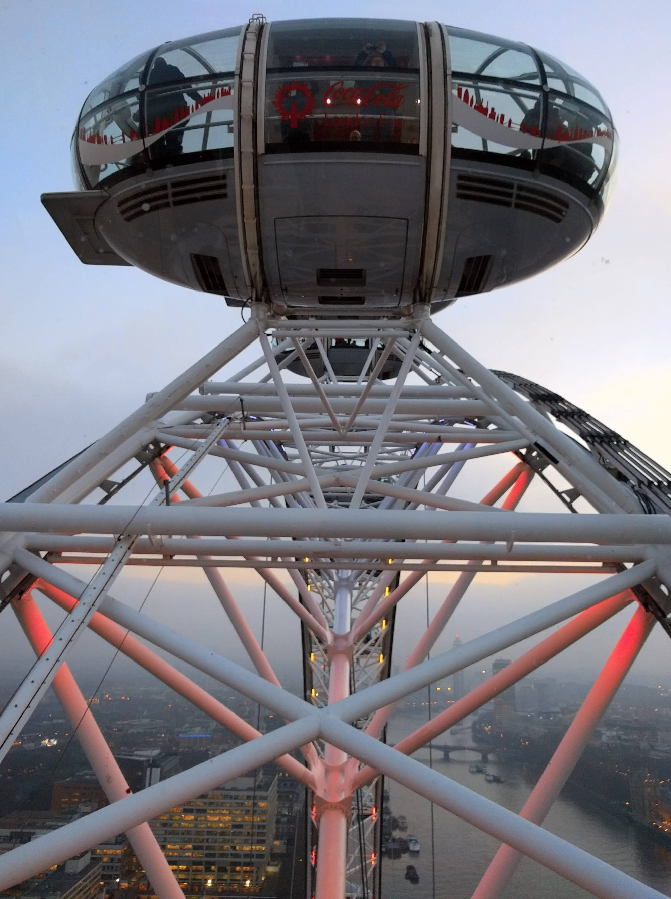
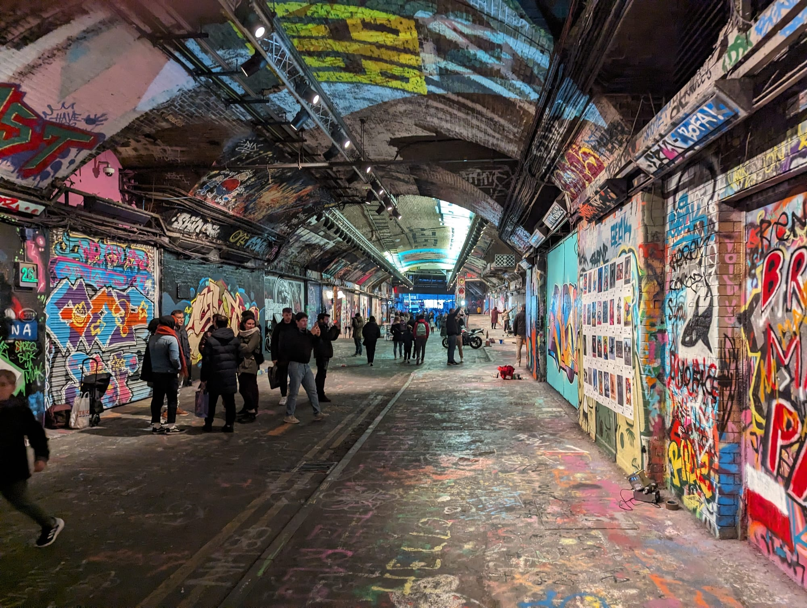

The South Bank is a continuous riverside walk from Westminster Bridge east to Tower Bridge, and it is the single best introduction to London on foot. It is flat, entirely pedestrianised, step-free, and lined with more free things to do than any comparable stretch in the city.

It is also the answer to bad weather: Tate Modern, the Southbank Centre, the BFI and Borough Market's covered halls are all on the route and all free to walk into.

The South Bank has its own share of the commemorative plaques marking where notable people lived or worked - see them on [our interactive map](/plaques/?area=south-bank).

## Why visit — and who should skip it

**Come here if** you have half a day and want to see a lot of London without planning anything. The walk connects Westminster, the Thames, three major free galleries, a great food market and Tower Bridge in one flat, signposted line.

**Skip it if** you specifically want quiet. This is one of the busiest pedestrian routes in Britain and the section between the London Eye and the Southbank Centre is crowded from late morning until evening every day of the year.

## Top sights and activities

1. **Tate Modern** — A converted power station holding the national collection of international modern art. Free. The tenth-floor viewing level in the Blavatnik Building is also free and has the best free view in London, straight across the river to St Paul's.
2. **Borough Market** — A wholesale market since at least the 12th century, now the best food market in the city. Full market Tuesday to Saturday.
3. **The Southbank Centre and BFI** — Brutalist arts complex with free foyer spaces, the secondhand book market under Waterloo Bridge, and the BFI's film programme.
4. **Shakespeare's Globe** — A faithful reconstruction of the 1599 open-air theatre, 230 metres from the original site. Standing tickets for the yard are genuinely cheap.
5. **The London Eye** — 30 minutes, 135 metres, and the most-booked paid attraction in the country. Book a timed slot online; walk-up prices are considerably higher.
6. **Millennium Bridge** — The pedestrian bridge from Tate Modern to St Paul's, and the best five-minute crossing in London.
7. **Leake Street Arches** — A road tunnel under Waterloo station given over to legal graffiti, repainted constantly by anyone who turns up with a can. Free, open, and the only sanctioned wall of its kind in central London.
8. **HMS Belfast and Tower Bridge** — At the eastern end. The Tower Bridge glass floor walkway looks down on the traffic 42 metres below.
9. **Hay's Galleria** — The old Hay's Wharf, where Britain's tea came ashore, roofed over in 1987 with a glass barrel vault modelled on Milan's Galleria Vittorio Emanuele II. Free, covered, and holding a sixty-foot kinetic sculpture called The Navigators. Directly behind HMS Belfast.

## Key streets and micro-districts

### Queen's Walk (London Eye to Southbank Centre)
The busiest stretch. Street performers, the skate park at the Undercroft, food stalls and the secondhand book market under Waterloo Bridge.

*The Eye from underneath. It is a cantilevered wheel supported from one side only, which is why the whole structure leans out over the river.*

*Leake Street Arches. The whole tunnel is repainted every few days.*

### Bankside
Tate Modern, Shakespeare's Globe and the Millennium Bridge. Quieter than the western end and the most attractive part of the walk.

### Borough and Southwark
Inland from the river. Borough Market, Southwark Cathedral and the Victorian streets around Stoney Street.

### More London and Tower Bridge
The eastern end, with City Hall's old building, HMS Belfast and the approach to Tower Bridge.

### Lower Marsh and Leake Street
Behind Waterloo station. Lower Marsh is a genuine local street of independent cafes and a weekday market, five minutes off the tourist route and far better value. **Leake Street** runs under the station alongside it.

## Where to eat and drink

| Spot | Style | Price | Why go |
| --- | --- | --- | --- |
| **Borough Market** | Food market | £ | Grab-and-go from dozens of traders; go before midday on Saturdays |
| **Southbank Centre Food Market** | Street food | £ | Behind the Royal Festival Hall, Friday to Sunday |
| **Lower Marsh** | Independent cafes | £ | Behind Waterloo, and the best value near the river |
| **The Anchor Bankside** | Historic riverside pub | ££ | Terrace over the Thames; touristy but the view is real |
| **OXO Tower Brasserie** | Modern British | £££ | Eighth-floor river views; the public viewing balcony is free |
| **Padella** | Handmade pasta | £ | Beside Borough Market; queue-only, and worth it |

## Getting there

**By Tube and rail.** **Waterloo** (Jubilee, Northern, Bakerloo, National Rail) serves the western end. **Southwark** (Jubilee) is closest to Tate Modern. **London Bridge** (Jubilee, Northern, National Rail) serves Borough Market and the eastern end.

**Best exit.** From Waterloo, follow signs for the **South Bank exit** rather than the main concourse — it puts you out on the riverside in two minutes. From London Bridge, use the **Borough Market** exit.

**On foot.** Ten minutes from Westminster across the bridge, five from St Paul's over the Millennium Bridge, fifteen from Covent Garden over Waterloo Bridge.

**By river.** Piers at the London Eye, Bankside and London Bridge City. See the [river boats guide](/articles/how-to-use-london-river-boats/).

## How long to spend, and when to go

| If you have | Do this |
| --- | --- |
| **One hour** | London Eye to Tate Modern along the river |
| **Half a day** | The full walk to Tower Bridge, with Tate Modern and Borough Market |
| **A full day** | Add the Globe, HMS Belfast and the Tower Bridge walkway |

**Best time:** Late afternoon into sunset. The walk faces north across the river, so the light on St Paul's and the City in the evening is the best of the day.

**For Borough Market:** Before midday, Tuesday to Friday. Saturday is the fullest market and the hardest to move through.

## Suggested walking route (west to east)

1. **Start:** Westminster station, cross **Westminster Bridge** to the **London Eye**.
2. **Southbank Centre:** East along **Queen's Walk** past the performers and the book market.
3. **Tate Modern:** Continue to Bankside. Go up to the **tenth-floor viewing level** — free.
4. **Shakespeare's Globe:** Next door; look in even without a ticket.
5. **Borough Market:** Inland at Southwark Cathedral for lunch.
6. **Finish:** East past **HMS Belfast** to **Tower Bridge**.

## Common mistakes to avoid

1. **Paying for a view before trying the free ones.** Tate Modern's tenth floor and the Sky Garden are both free. Book the Sky Garden weeks ahead.
2. **Going to Borough Market on a Monday.** Only a limited market runs. Tuesday to Saturday for the full thing.
3. **Buying London Eye tickets on the day.** Walk-up is significantly more expensive and the queue is long. Book a timed slot.
4. **Eating on Queen's Walk itself.** Walk five minutes inland to Lower Marsh or Borough for better food at half the price.
5. **Taking the Tube between South Bank stops.** Waterloo to London Bridge is a pleasant 25-minute walk along the river and an awkward journey underground.
6. **Doing the walk at midday in summer.** The western half is packed. Start early or go late.

## Where to stay

Better value than the north bank, well connected, and lively into the evening.

- **Waterloo and Lower Marsh** — Mid-range hotels a few minutes from the river, with excellent transport.
- **Bankside and Southwark** — Quieter, walkable to Tate Modern and Borough Market.
- **London Bridge** — The eastern end, well connected for Gatwick via Thameslink and Southern.
