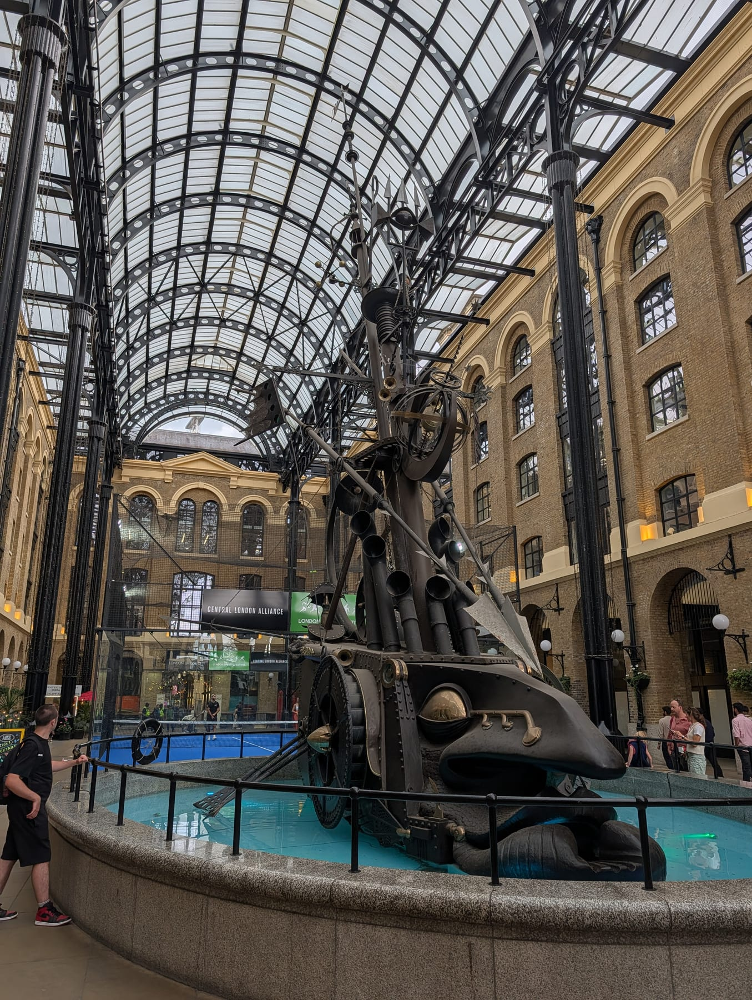
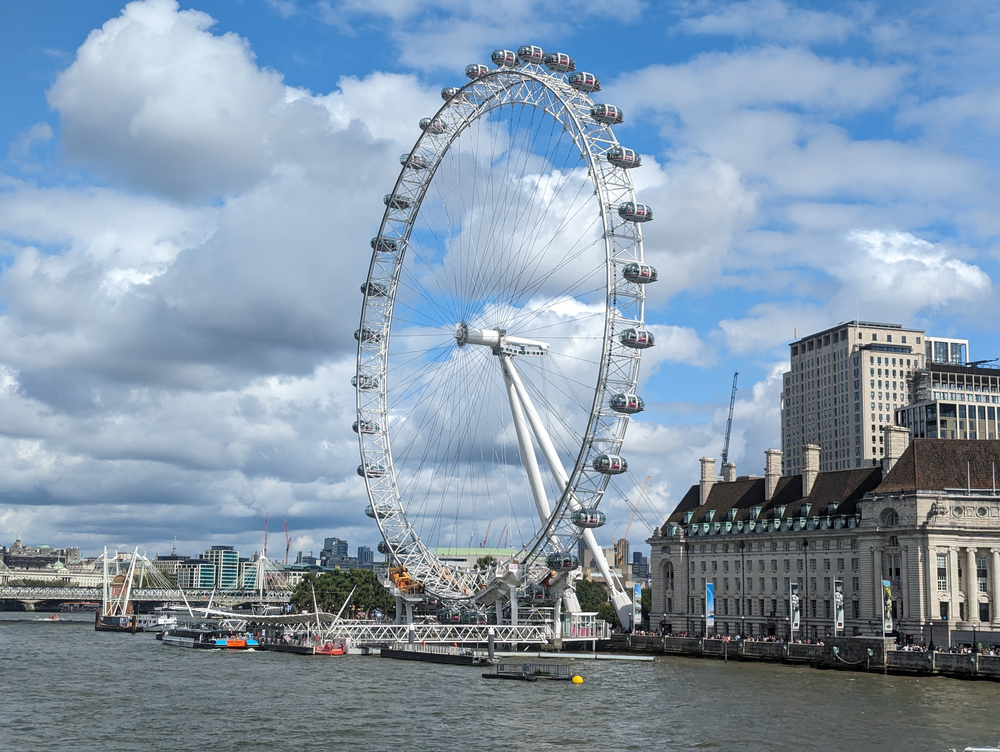
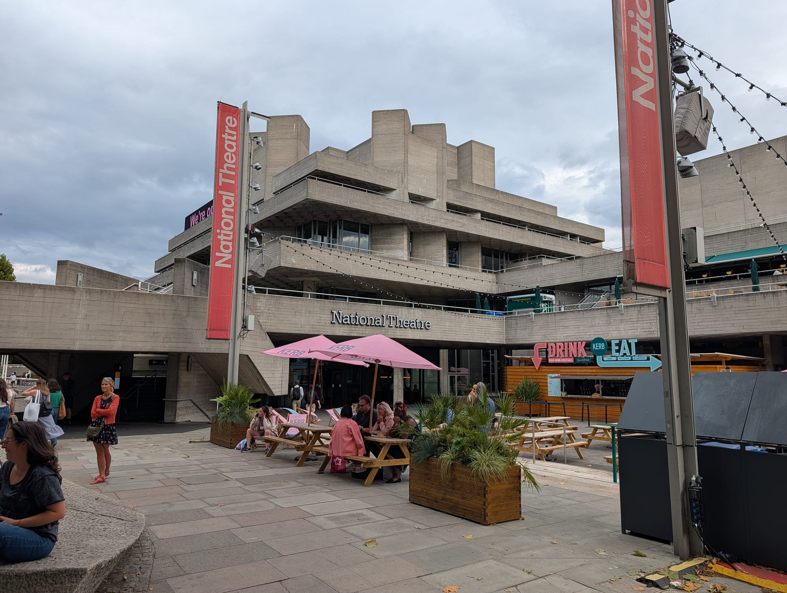
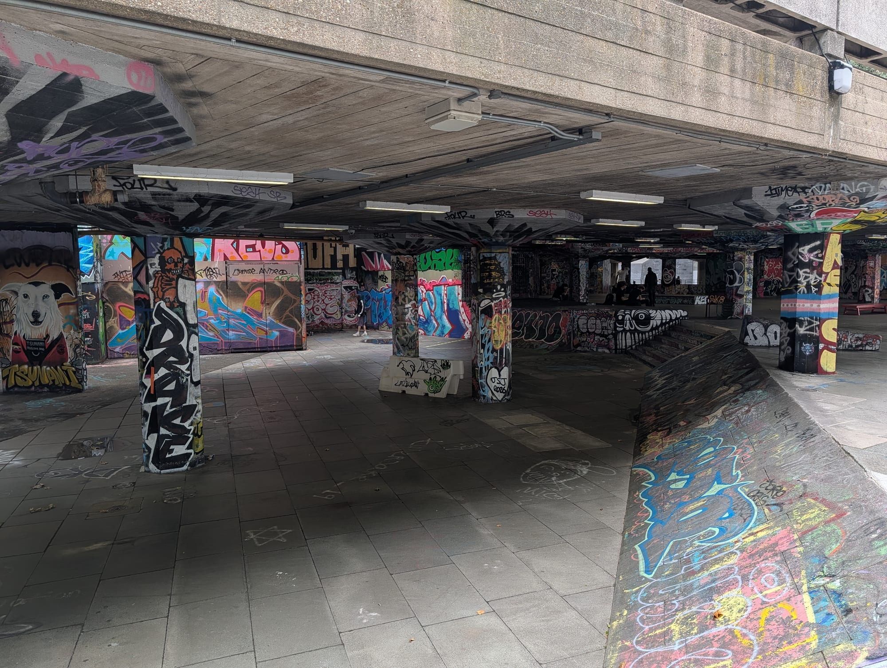
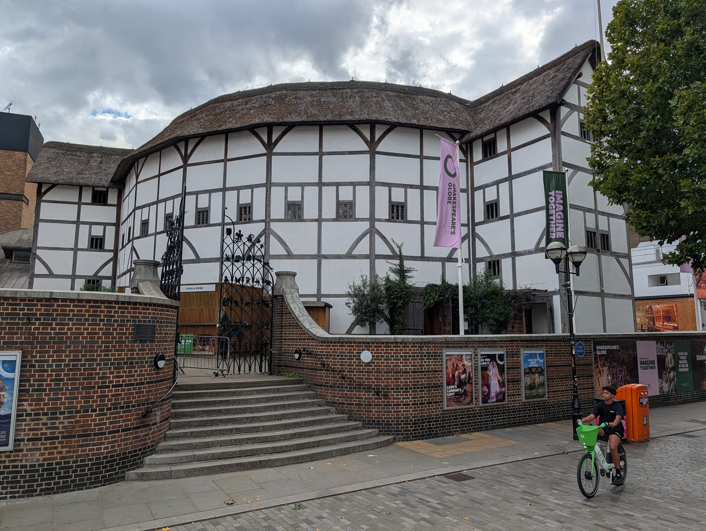
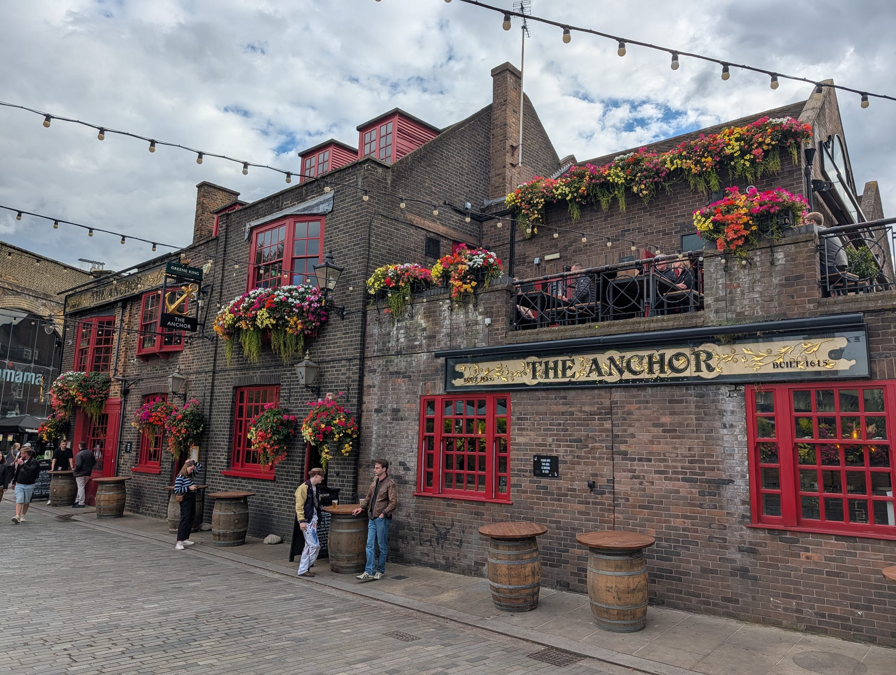
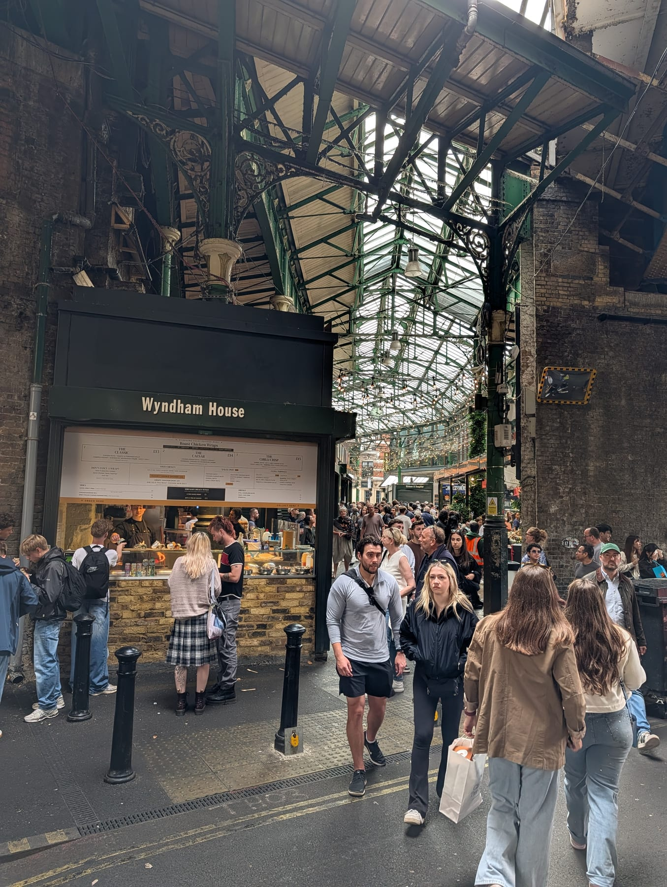
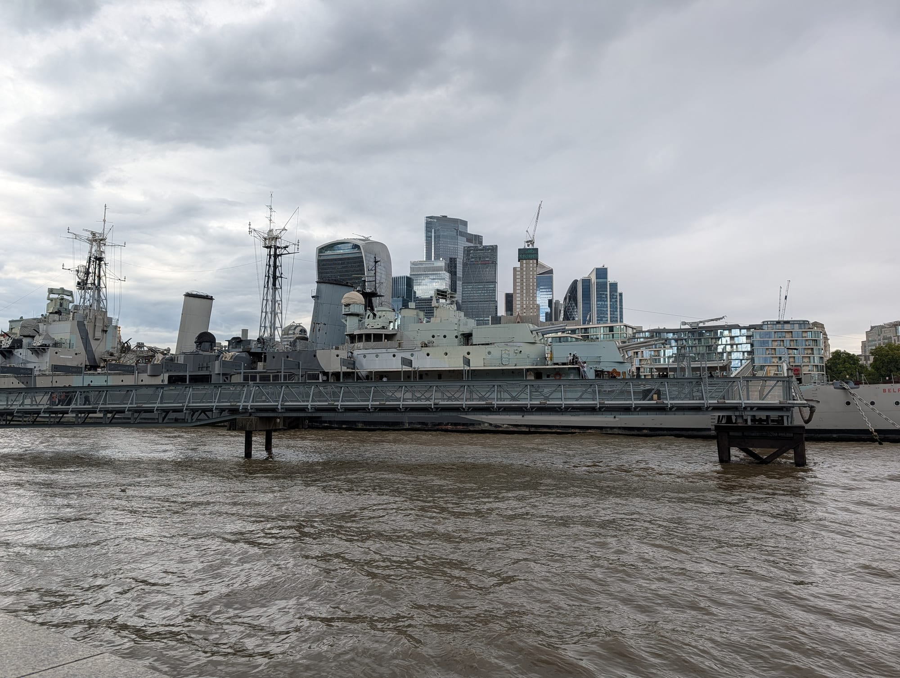
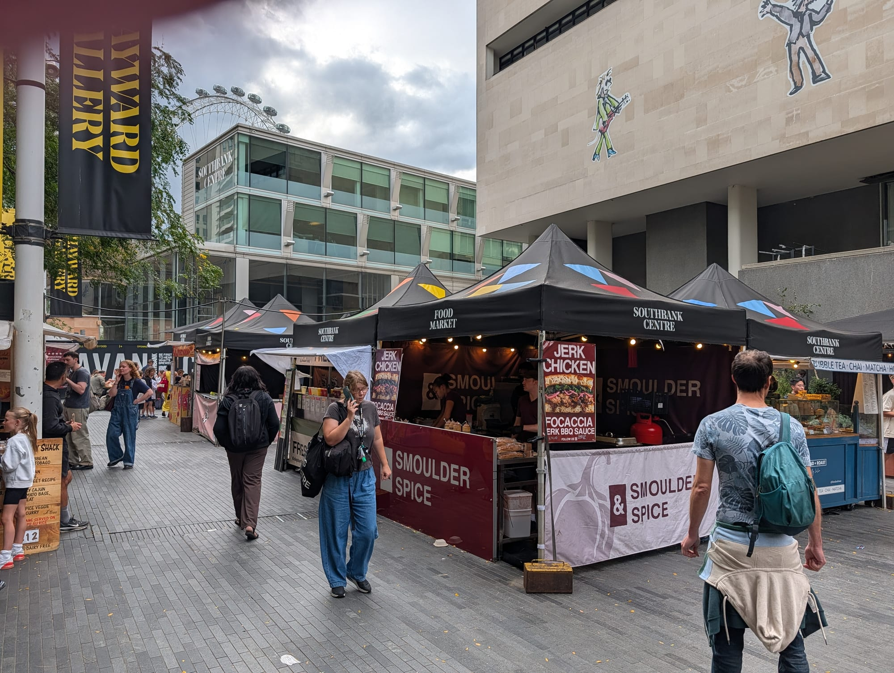

The South Bank is a continuous riverside walk from Westminster Bridge east to Tower Bridge, and it is the single best introduction to London on foot. It is flat, entirely pedestrianised, step-free, and lined with more free things to do than any comparable stretch in the city.

It is also the answer to bad weather: Tate Modern, the Southbank Centre, the BFI and Borough Market's covered halls are all on the route and all free to walk into.

The South Bank has its own share of the commemorative plaques marking where notable people lived or worked - see them on our [interactive map](/plaques/?area=south-bank).

## Why visit — and who should skip it

**Come here if** you have half a day and want to see a lot of London without planning anything. The walk connects Westminster, the Thames, three major free galleries, a great food market and Tower Bridge in one flat, signposted line.

**Skip it if** you specifically want quiet. This is one of the busiest pedestrian routes in Britain and the section between the London Eye and the Southbank Centre is crowded from late morning until evening every day of the year.

## Top sights and activities

1. **Tate Modern** — A converted power station holding the national collection of international modern art. Free, and **open until 9pm on Fridays and Saturdays** as well as 10am–6pm the rest of the week. The tenth-floor viewing level in the Blavatnik Building is also free and gives you the river and St Paul's from height without a ticket.
2. **Borough Market** — A wholesale market since at least the 12th century, now the best food market in the city. **Closed Mondays.** Tuesday to Friday 10am–5pm, Saturday 9am–5pm, Sunday 10am–4pm.
3. **The Southbank Centre and BFI** — Brutalist arts complex with free foyer spaces, the secondhand book market under Waterloo Bridge, and the BFI's film programme.
4. **Shakespeare's Globe** — A faithful reconstruction of the 1599 open-air theatre, 230 metres from the original site. **Standing in the yard is £10**, the cheapest way in — and a batch of **£5 Rush standing tickets is released every Friday at 11am** for the following week, including for shows that are otherwise sold out. The indoor, candlelit Sam Wanamaker Playhouse runs through the winter.
5. **The London Eye** — 30 minutes, 135 metres, and the most-booked paid attraction in the country. Book a timed slot online; walk-up prices are considerably higher.
6. **Millennium Bridge** — The pedestrian bridge from Tate Modern to St Paul's, and the best five-minute crossing in London.
7. **Leake Street Arches** — A road tunnel under Waterloo station given over to legal graffiti, repainted constantly by anyone who turns up with a can. Free, open, and the only sanctioned wall of its kind in central London.
8. **HMS Belfast and Tower Bridge** — At the eastern end. HMS Belfast is nine decks and around three hours; adult tickets start at £23.45, but **anyone on Universal Credit or Pension Credit pays £3, for up to five people in the household**, booked online. **Walking across Tower Bridge is free** — you only pay for the high-level walkways, the glass floor and the Victorian engine rooms.
9. **Hay's Galleria** — The old Hay's Wharf, where Britain's tea came ashore, roofed over in 1987 with a glass barrel vault modelled on Milan's Galleria Vittorio Emanuele II. Free, covered, and holding a sixty-foot kinetic sculpture called The Navigators. Directly behind HMS Belfast.

*The Navigators in Hay's Galleria. It moves and squirts water, on the site of the wharf where most of Britain's tea came ashore.*

*The Eye behind County Hall. It went up in 1999 as a temporary structure with a five-year permit. Photo: [barry.marsh1944](https://www.flickr.com/photos/126409951@N04/49097008366), [Public Domain Mark](https://creativecommons.org/publicdomain/mark/1.0/).*

*The National Theatre - one of London's major [off-West End houses](/articles/london-theatre-guide/). Denys Lasdun's 1976 building — the foyers are open to anyone, ticket or not, and there is a bar on every level.*

## Key streets and micro-districts

### County Hall: three paid attractions in one building

The Edwardian block beside the Eye holds **SEA LIFE London, the London Dungeon and Shrek's Adventure**, all Merlin-run and all indoors — which makes this the obvious wet-weather corner of the South Bank.

Buying them one at a time is the expensive way. **Merlin's Magical London** covers all three plus the **London Eye** and **Madame Tussauds** in Marylebone, **from £69 against £132 separately**, valid 90 days. Two attractions are cheaper booked direct; from the third it pays.

Powered by <a target="_blank" rel="sponsored" href="https://www.getyourguide.com/london-l57/">GetYourGuide</a>

### Queen's Walk (London Eye to Southbank Centre)

The busiest pedestrian stretch in Britain, and the one everybody pictures when they say South Bank: street performers, the Undercroft skate space, the second-hand book market under Waterloo Bridge, and a run of concrete arts buildings that people either love or walk straight past.

**The most useful thing here is free and indoors.** The Royal Festival Hall foyers are open to anyone — seats, heating, toilets, a piano, a view over the river — and **the Southbank Centre lets you bring your own food and soft drinks in**, which in an area where every riverside bench comes with a £6 coffee attached is worth knowing. Only alcohol has to be bought on site, and the whole complex is **cash-free**. Upstairs, the **Queen Elizabeth Hall Roof Garden** is free too: over 200 wild native plants and a bar, open Tuesday from 4pm and Wednesday to Sunday from midday, closed Mondays.

The **book market under Waterloo Bridge** runs daily, roughly 10am to 7pm, and has done since 1983 — eight stalls of second-hand fiction, children's books, maps and prints. Past it, the **National Theatre** foyers are open 10am to 11pm Monday to Saturday with no ticket needed, and there is a bar on every level.

*The Undercroft. Skated continuously since the early 1970s and formally protected in 2014 after a campaign to build shops in it.*

*The Eye from underneath. It is a cantilevered wheel supported from one side only, which is why the whole structure leans out over the river.*

### Bankside

Quieter than the western end and the most attractive part of the walk — Tate Modern, the Globe, the Millennium Bridge and a riverside path with the City on the far bank.

**Tate Modern is the anchor and it costs nothing.** Sunday to Thursday 10am–6pm, and **until 9pm on Friday and Saturday**, which is the best time to go: the crowds thin, the Turbine Hall empties out, and it is the rare free thing in London that is open at night. The **tenth-floor viewing level** in the Blavatnik Building behind it is also free, reached by lift — worth knowing that it only opens on three sides now, after the flats opposite won a privacy case against the gallery.

Ninety seconds west of Tate's door, **Bankside Gallery** is free, open daily during exhibitions, and gets about 55,000 visitors a year against Tate's millions. It is the home of the Royal Watercolour Society and almost nobody walking between the two notices it.

*Tate Modern, in the shell of Bankside Power Station. Free, and the tenth-floor viewing level in the Blavatnik Building behind it is free too.*

*Shakespeare's Globe. The thatch is the only one in London — every other roof of its kind was banned after the Great Fire.*

*The Anchor Bankside. Samuel Pepys watched the Great Fire from somewhere near here; the present building is early 1800s.*

### Borough and Southwark

Inland from the river, and the part of this area most worth your time — Borough Market, Southwark Cathedral and the Victorian streets around Stoney Street.

**Borough Market is closed on Mondays**, which is the single most common wasted journey here. Tuesday to Friday 10am–5pm, Saturday 9am–5pm, Sunday 10am–4pm, and seven days a week through December. Saturday is heaving; a Tuesday or Wednesday morning is the same market with room to move. Borough Market Kitchen is the hot street food section.

**Southwark Cathedral is free** and open 9am–6pm Monday to Saturday, 8.30am–5pm Sunday — a thousand years of building beside a market, with a churchyard, a herb garden and a resident cat. There is an hourly pause for prayer on the half hour, about two minutes, when visitors are asked to stand still.

Around them, three small paid museums that people miss: the **Old Operating Theatre**, a Georgian surgical theatre up a spiral staircase in a church tower (Thursday to Sunday only); the **Clink Prison Museum** on the site of the Bishop of Winchester's gaol; and the **Golden Hinde**, currently under restoration, so parts may be shut. The **ruins of Winchester Palace** on Clink Street are free, roofless and visible from the pavement at any hour, rose window and all.

*Borough Market. Busiest on Saturday by a wide margin — a Tuesday or Wednesday morning is the same market with room to move.*

### More London and Tower Bridge

The eastern end, and the stretch that has changed most.

**The building everyone still calls City Hall is not City Hall any more.** The Mayor and the Assembly moved out to the Royal Docks in December 2021, and Foster's leaning glass egg — now **110 The Queen's Walk** — is a building site: main construction runs from **February 2026 to summer 2028**, after which it becomes offices, shops, restaurants and a food hall. There is nothing to see there for the moment, and **The Scoop**, the free sunken amphitheatre beside it that used to run open-air summer screenings, is inside the same scheme, so do not plan around it.

**HMS Belfast** is the reason to come to this stretch. Nine decks, open 10am–6pm daily, and IWM suggests at least three hours. Adult tickets start at £23.45 — but **anyone on Universal Credit, Pension Credit or several other benefits pays £3, covering up to five people in the household**, booked online in advance. Almost no guide mentions it.

Then **Tower Bridge**, which is free to walk across; the ticket buys the high-level walkways with the glass floor over the traffic and the Victorian engine rooms. **The bridge lifts around 800 times a year and the schedule is published weeks ahead** on its own site — watching it open from the riverside costs nothing and is better than the walkway.

A minute past the southern end of the bridge, on Horselydown Lane, **[Tower Bridge Collective](/articles/best-street-food-london/)** opened in October 2025: thirteen independent kitchens over two floors, open from 8am daily, and by a distance the cheapest good eating anywhere near Tower Bridge. It is the obvious answer to the problem this end of the river has always had, which is that everything with a view charges for it.

*HMS Belfast, permanently moored off Tooley Street since 1971. The view across her guns to the City is the best free thing on this stretch.*

### Lower Marsh and Leake Street

Behind Waterloo station, five minutes off the tourist route and far better value for it.

**Lower Marsh** is a genuine local street of independent cafés, record shops and a **weekday market, roughly 11am to 3pm Monday to Friday** — worth checking before a weekend trip, because the market's own site lists Saturday and Sunday as closed even though plenty of other listings still advertise a Saturday flea market.

**Leake Street** runs under the station platforms alongside it: London's longest legal graffiti wall, free, open, and repainted constantly by anyone who turns up with a can. It has been legal since Banksy's Cans Festival in 2008. Eight of the railway arches are now independent venues — a Polish restaurant, a Philadelphia dive bar, a board-game café — so the tunnel is a night out as well as a walk-through.

*Leake Street Arches. The whole tunnel is repainted every few days.*

Powered by <a target="_blank" rel="sponsored" href="https://www.getyourguide.com/london-l57/">GetYourGuide</a>

## Where to eat and drink

| Spot | Style | Price | Why go |
| --- | --- | --- | --- |
| **Borough Market** | Food market | £ | Grab-and-go from dozens of traders; go before midday on Saturdays |
| **Southbank Centre Food Market** | Street food | £ | Behind the Royal Festival Hall, Friday to Sunday |
| **Lower Marsh** | Independent cafes | £ | Behind Waterloo, and the best value near the river |
| **The Anchor Bankside** | Historic riverside pub | ££ | Terrace over the Thames; touristy but the view is real |
| **OXO Tower Brasserie** | Modern British | £££ | Eighth-floor river views; the public viewing balcony is free |
| **Padella** | Handmade pasta | £ | Beside Borough Market; queue-only, and worth it |
| **Tower Bridge Collective** | Food hall | £ | Thirteen kitchens off Shad Thames, from 8am daily |

*The Southbank Centre Food Market, behind the Royal Festival Hall. Friday to Sunday, and the cheapest hot food on this stretch of river.*

## Getting there

**By Tube and rail.** **Waterloo** (Jubilee, Northern, Bakerloo, National Rail) serves the western end. **Southwark** (Jubilee) is closest to Tate Modern. **London Bridge** (Jubilee, Northern, National Rail) serves Borough Market and the eastern end.

**Best exit.** From Waterloo, follow signs for the **South Bank exit** rather than the main concourse — it puts you out on the riverside in two minutes. From London Bridge, use the **Borough Market** exit.

**On foot.** Ten minutes from Westminster across the bridge, five from St Paul's over the Millennium Bridge, fifteen from Covent Garden over Waterloo Bridge.

**By river.** Piers at the London Eye, Bankside and London Bridge City. See the [river boats guide](/articles/how-to-use-london-river-boats/).

## How long to spend, and when to go

| If you have | Do this |
| --- | --- |
| **One hour** | London Eye to Tate Modern along the river |
| **Half a day** | The full walk to Tower Bridge, with Tate Modern and Borough Market |
| **A full day** | Add the Globe, HMS Belfast and the Tower Bridge walkway |

**Best time:** Late afternoon into sunset. The walk faces north across the river, so the light on St Paul's and the City in the evening is the best of the day.

**For Borough Market:** Before midday, Tuesday to Friday. Saturday is the fullest market and the hardest to move through.

## Suggested walking route (west to east)

1. **Start:** Westminster station, cross **Westminster Bridge** to the **London Eye**.
2. **Southbank Centre:** East along **Queen's Walk** past the performers and the book market.
3. **Tate Modern:** Continue to Bankside. Go up to the **tenth-floor viewing level** — free.
4. **Shakespeare's Globe:** Next door; look in even without a ticket.
5. **Borough Market:** Inland at Southwark Cathedral for lunch.
6. **Finish:** East past **HMS Belfast** to **Tower Bridge**.

Powered by <a target="_blank" rel="sponsored" href="https://www.getyourguide.com/london-l57/">GetYourGuide</a>

## Common mistakes to avoid

1. **Paying for a view before trying the free ones.** Tate Modern's tenth floor and the Sky Garden are both free. Book the Sky Garden weeks ahead.
2. **Going to Borough Market on a Monday.** Only a limited market runs. Tuesday to Saturday for the full thing.
3. **Buying London Eye tickets on the day.** Walk-up is significantly more expensive and the queue is long. Book a timed slot.
4. **Eating on Queen's Walk itself.** Walk five minutes inland to Lower Marsh or Borough for better food at half the price.
5. **Taking the Tube between South Bank stops.** Waterloo to London Bridge is a pleasant 25-minute walk along the river and an awkward journey underground.
6. **Doing the walk at midday in summer.** The western half is packed. Start early or go late.

## Where to stay

Better value than the north bank, well connected, and lively into the evening.

- **Waterloo and Lower Marsh** — Mid-range hotels a few minutes from the river, with excellent transport.
- **Bankside and Southwark** — Quieter, walkable to Tate Modern and Borough Market.
- **London Bridge** — The eastern end, well connected for Gatwick via Thameslink and Southern.
