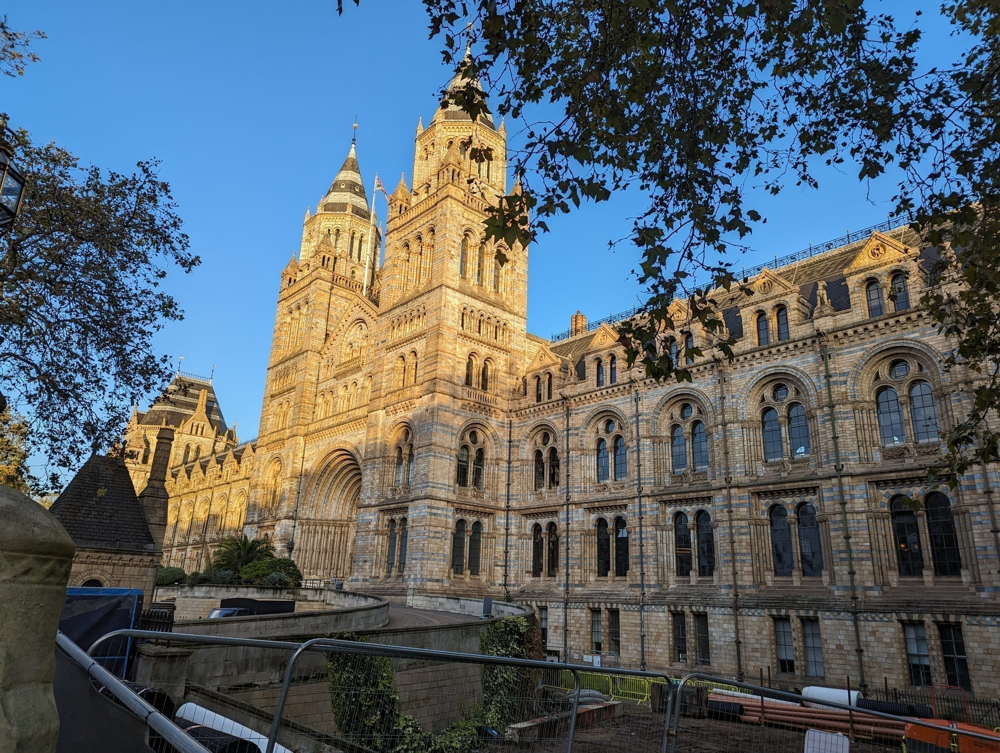
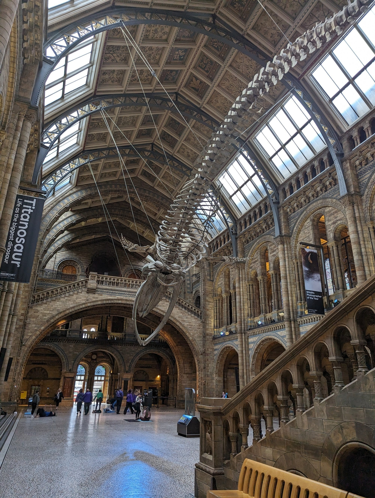
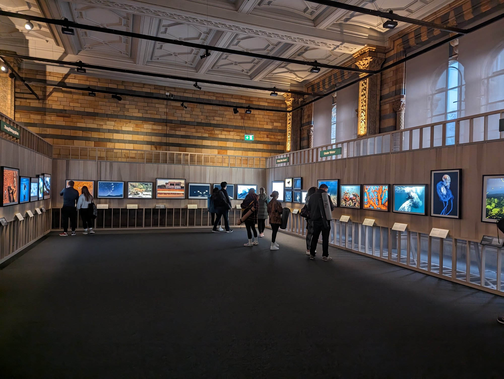
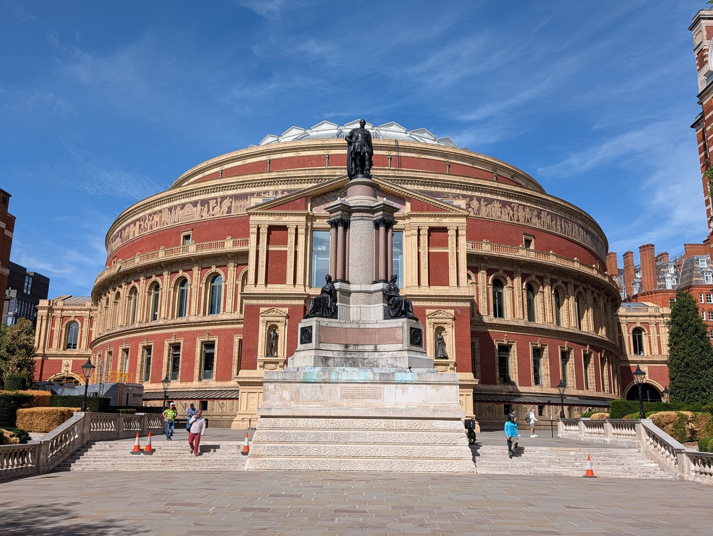
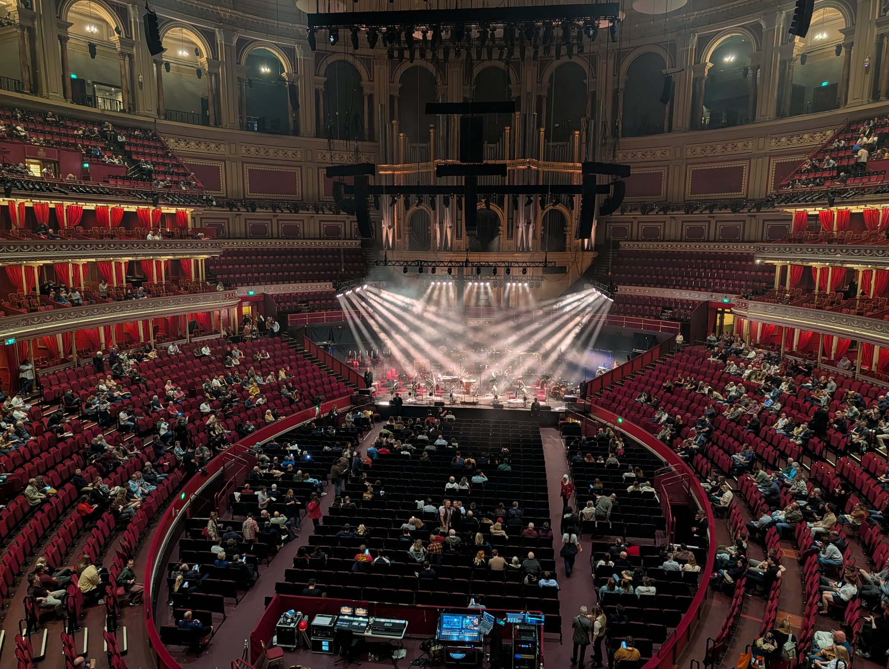

South Kensington exists because of the 1851 Great Exhibition. Its profits bought the land, and what went up afterwards was a deliberate cluster of museums, colleges and concert halls — the area was nicknamed Albertopolis after the prince who drove it.

The result is three of the world's great museums within 400 metres of each other, all free, plus the Royal Albert Hall at the top of the road. It is the highest concentration of free culture anywhere in Britain.

South Kensington has its own share of the commemorative plaques marking where notable people lived or worked - see them on our [interactive map](/plaques/?area=south-kensington).

## Why visit — and who should skip it

**Come here if** you have children, or a rainy day, or any interest in science, design or natural history. The value is extraordinary: three world-class collections at no cost, all connected to the station by an undercover tunnel.

**Skip it if** you are short on time and not a museum person. There is little else here — the streets are handsome but residential, and the area is quiet by evening. If you want one museum and then something else, the British Museum in Bloomsbury sits closer to the rest of central London.

## Top sights and activities

1. **Natural History Museum** — Alfred Waterhouse's terracotta cathedral of a building, with "Hope" the blue whale skeleton suspended in Hintze Hall. The building itself is as good as the collection.
2. **Victoria and Albert Museum (V&A)** — 145 galleries covering 5,000 years of art and design. The John Madejski Garden in the centre is the best courtyard in London to sit in, and the original Victorian refreshment rooms are the world's first museum cafe.
3. **Science Museum** — Rockets, jet engines and the Apollo 10 command module. **Wonderlab** upstairs is hands-on and the one part that charges.
4. **Royal Albert Hall** — The circular concert hall at the top of Exhibition Road. Home of the BBC Proms each summer, when standing tickets in the arena go for a few pounds on the day.
5. **Kensington Gardens and the Albert Memorial** — Across the road, with Kensington Palace at the far end and the Serpentine galleries in between.
6. **Brompton Oratory** — An enormous Italianate Catholic church next to the V&A that almost nobody goes into. Free, and startling inside.

Powered by <a target="_blank" rel="sponsored" href="https://www.getyourguide.com/london-l57/">GetYourGuide</a>

## Key streets and micro-districts

*The Natural History Museum. Alfred Waterhouse's 1881 building is as much the attraction as the collection.*

*"Hope" the blue whale skeleton, suspended over Hintze Hall since 2017. Free, and the first thing you see through the main doors.*

*Inside the **Wildlife Photographer of the Year** exhibition, the Museum's ticketed annual show of the year's 100 winning images. It typically runs from mid-October to the following July, so check what's on before planning around it specifically.*

### Exhibition Road
The spine, resurfaced as a shared pedestrian-priority space. All three museums, Imperial College and the Royal Geographical Society sit on it.

### The Museum Subway
The tiled Victorian tunnel from the station to the museums. Free, dry, and the single most useful thing to know about the area.

*The Royal Albert Hall at the top of Exhibition Road. Standing tickets for the Proms go for a few pounds on the day.*

*Inside during a show. The circular auditorium seats over 5,000 and there is not a bad view in the house.*

### Cromwell Road and Thurloe Square
Grand stucco terraces and garden squares south of the museums, and the quieter side of South Kensington.

### Bute Street and Old Brompton Road
The everyday streets. French bakeries and cafes — there is a long-established French community here, anchored by the Lycée.

### Knightsbridge and Brompton Road
North-east towards Harrods and Harvey Nichols. Ten minutes on foot.

## Where to eat and drink

| Spot | Style | Price | Why go |
| --- | --- | --- | --- |
| **V&A Cafe** | Museum cafe | ££ | The world's first museum restaurant, in three Victorian rooms |
| **Ognisko** | Polish | ££ | Elegant townhouse dining room on Exhibition Road with a terrace |
| **The Anglesea Arms** | Historic pub | ££ | Proper pub five minutes south, away from the museum crowds |
| **Comptoir Libanais** | Lebanese | £ | Reliable, quick and good with children |
| **Bute Street bakeries** | French cafes | £ | The local French quarter; better coffee than anything on Cromwell Road |
| **Duke of York Square** | Various | ££ | Fifteen minutes towards Chelsea, with a Saturday food market |

## Getting there

**By Tube.** **South Kensington** is on the Piccadilly, District and Circle lines. The Piccadilly line runs direct from Heathrow in about 40 minutes for under £6 — one of the best-value airport journeys in London.

**Best exit.** Follow signs inside the station for the **Museum Subway**, the pedestrian tunnel that comes up inside the museum precinct. Do not leave by the main street exit unless you want the shops.

**On foot.** Ten minutes to Knightsbridge, fifteen to Sloane Square, twenty-five through the parks to Notting Hill.

## How long to spend, and when to go

| If you have | Do this |
| --- | --- |
| **Two hours** | One museum's highlights — Hintze Hall, or the V&A cast courts |
| **Half a day** | One museum properly, plus lunch and Exhibition Road |
| **A full day** | Two museums, with Kensington Gardens between them |

**Best time:** Right at opening, usually 10:00. The first hour is dramatically quieter, and it is the only time you will get Hintze Hall without crowds.

**Avoid:** Weekends and school holidays if you can, particularly at the Natural History Museum, which is the busiest free attraction in the country.

## Suggested three-hour route

1. **Start:** South Kensington station, via the **Museum Subway**.
2. **Natural History Museum:** Hintze Hall and the dinosaur gallery. Book a slot.
3. **Exhibition Road:** North past Imperial College to the **Royal Albert Hall**.
4. **Kensington Gardens:** Cross to the **Albert Memorial** and into the park.
5. **Finish:** Back down for the **V&A** courtyard, or east to Harrods.

## Common mistakes to avoid

1. **Trying to do all three museums in a morning.** You will see corridors. One per half day.
2. **Queuing outside in the rain.** The Museum Subway from inside the station is undercover and free.
3. **Not booking free timed entry.** It costs nothing and skips a 45-minute weekend queue.
4. **Eating on Cromwell Road.** The cafes immediately around the station are poor value. Walk to Bute Street or Duke of York Square.
5. **Paying for a taxi from Heathrow.** The Piccadilly line comes here directly.
6. **Assuming Wonderlab is included.** The Science Museum is free; Wonderlab is ticketed.

## Where to stay

Quiet, safe, well connected and good for families, with the trade-off that the area is sleepy after about 20:00.

- **South Kensington and Gloucester Road** — Townhouse hotels and serviced flats, walkable to the museums, direct to Heathrow.
- **Earl's Court** — Ten minutes west, noticeably cheaper, same District and Piccadilly access.
- **Knightsbridge** — North-east and considerably more expensive, closer to Hyde Park.
