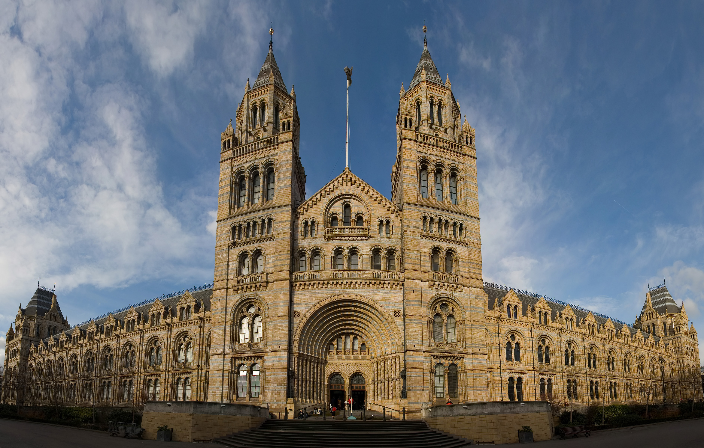

South Kensington and Chelsea represent London at its most polished. Centered around "Exhibition Road"—home to three of the world's greatest free museums—this leafy West London enclave pairs Victorian grandeur and garden squares with high-end boutique shopping along King's Road and Knightsbridge.

> 💡 **At a Glance: South Kensington & Chelsea**  
> - **Vibe:** Refined, elegant, family-friendly, and culturally rich.  
> - **Walkability:** 5 / 5 (Pedestrianized museum subway and tree-lined avenues).  
> - **Nearest Stations:** South Kensington (Piccadilly, District, Circle), Gloucester Road, Sloane Square.  
> - **Best For:** Free world-class museums, family trips, Royal Albert Hall concerts, and boutique shopping.

---

## Top 5 Sights & Activities

1. **The Natural History Museum:** Marvel at the giant blue whale skeleton ("Hope") suspended in Hintze Hall, dinosaur galleries, and Earth Hall escalators inside Alfred Waterhouse's cathedral-like Romanesque building.
2. **Victoria and Albert Museum (V&A):** Explore 5,000 years of global art, design, fashion, and sculpture, and relax in the central John Madejski Garden courtyard.
3. **The Science Museum:** Experience interactive space exploration exhibits, flight simulators, Wonderlab, and historic steam engines.
4. **Royal Albert Hall & Kensington Gardens:** Attend a concert or BBC Proms performance at the iconic circular hall, then stroll through Kensington Gardens to the Albert Memorial.
5. **Shop & Stroll King's Road & Harrods:** Explore boutique fashion along Chelsea's famous **King's Road** and marvel at the ornate Food Halls inside **Harrods** in Knightsbridge.

---

## Key Micro-Districts & Shopping Avenues

*Natural History Museum. Photo: [Diliff](https://commons.wikimedia.org/wiki/File:Natural_History_Museum_London_Jan_2006.jpg), [CC BY-SA 3.0](https://creativecommons.org/licenses/by-sa/3.0/).*

### 1. Exhibition Road Museum Quarter
Exhibition Road is a shared pedestrian space housing the Natural History Museum, V&A, Science Museum, Imperial College, and Royal Geographical Society.

### 2. Sloane Square & King's Road
Beginning at **Sloane Square**, Chelsea's **King's Road** was the center of 1960s counter-culture and punk fashion, now lined with luxury boutiques, cafes, and the **Saatchi Gallery** at Duke of York Square.

### 3. Knightsbridge & Brompton Road
Immediately north of South Kensington, Knightsbridge is home to legendary department stores **Harrods** and **Harvey Nichols**.

---

## Book Museum & Palace Tours

Powered by <a target="_blank" rel="sponsored" href="https://www.getyourguide.com/s/%3Fq=London&amp;lc=57&amp;et=292175&amp;searchSource=3&amp;src=search_bar">GetYourGuide</a>

---

## Where to Eat & Drink

| Spot | Style / Specialty | Why Visit |
| --- | --- | --- |
| **V&A Cafe** | Victorian Period Dining Room | The world's first museum cafe, featuring William Morris stained glass |
| **Colbert Sloane Square** | Parisian French Bistro | Classic brasserie people-watching spot on Sloane Square |
| **Ognisko** | Polish & Eastern European | Elegant dining in an Exhibition Road townhouse with vodka terrace |
| **The Anglesea Arms** | Historic Gastropub | Classic 18th-century South Kensington pub with outdoor terrace |

---

## Suggested 3-Hour Self-Guided Walking Route

1. **Start:** Exit **South Kensington Station** via the subterranean **Museum Subway pedestrian tunnel**.
2. **Museum Quarter:** Visit the **Natural History Museum** or **V&A**.
3. **Exhibition Road to Royal Albert Hall:** Walk north up Exhibition Road past Imperial College to the **Royal Albert Hall**.
4. **Kensington Gardens:** Cross the road into **Kensington Gardens** to admire the **Albert Memorial**.
5. **Finish at Harrods:** Walk east down Brompton Road to finish at **Harrods Food Halls** for tea and pastries!

---

## 5 Common Visitor Mistakes to Avoid

1. **Trying to visit all 3 museums in a single morning:** The Natural History Museum and V&A are vast; pick one major museum per morning to avoid museum fatigue.
2. **Queuing outdoors in the rain at South Kensington:** Use the **free tiled underground pedestrian tunnel** from South Kensington station directly into the museum basements!
3. **Not booking free timed entry for Natural History Museum:** Standard entry is free, but standby lines on weekends can take 45+ minutes. Book free timed slots online.
4. **Eating at overpriced tourist cafes immediately around South Kensington station:** Walk 5 minutes down Brompton Road or to Duke of York Square for far better food.
5. **Paying for expensive taxis from Heathrow:** The **Piccadilly line** runs directly from Heathrow Airport to South Kensington station in 40 minutes for less than £6!

---

## Related London Guides

* 🏨 [Exploring London's Best Neighbourhoods: Master Guide](/articles/best-areas-to-stay-and-visit-london/)
* ✈️ [Heathrow Airport to London Transport Guide](/articles/heathrow-airport-to-london/)
* 🚊 [Getting Around London: Complete Transport Overview](/articles/getting-around-london-transport-guide/)
* 🚇 [How to Use the London Underground](/articles/how-to-use-the-london-underground/)

---

*Exploration guide checked on 2 August 2026. Always verify museum exhibition schedules.*
